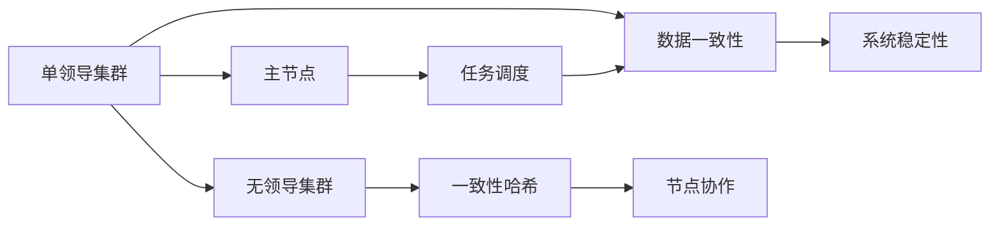

                 

## 1. 背景介绍

在分布式系统架构中，单领导集群（Single-Leader Cluster）和无领导集群（Leaderless Cluster）是两种重要的集群模式，各自有其适用场景和优缺点。单领导集群通过一个主节点（Leader）负责整个集群的协调和管理，适用于对实时性要求高、数据一致性要求严格的应用场景，如传统金融交易系统、大型数据库系统等。而无领导集群则没有明确的主节点，节点之间通过一致性哈希等机制实现分布式协作，适用于扩展性要求高、可靠性要求较高的场景，如互联网服务、大数据处理平台等。本文将对单领导集群与无领导集群的实现原理、最佳实践进行详细阐述，帮助开发者选择合适的集群模式，构建高效可靠的分布式系统。

## 2. 核心概念与联系

### 2.1 核心概念概述

#### 2.1.1 单领导集群

单领导集群通过一个主节点（Leader）来协调和管理整个集群，主节点负责任务的分配和调度，保证数据一致性和系统的稳定性。当主节点发生故障时，通过选举机制自动选择新的主节点，确保系统的持续运行。

#### 2.1.2 无领导集群

无领导集群没有明确的主节点，节点之间通过一致性哈希等机制实现分布式协作。每个节点都可以接收请求并提供服务，无需额外的协调和管理。这种方式简化了集群的运维和管理，提高了系统的扩展性和可靠性。

### 2.2 核心概念原理和架构

#### 2.2.1 单领导集群原理

单领导集群的核心在于主节点的存在和调度管理。集群中的所有节点将任务提交给主节点，由主节点负责任务的分派和执行。每个节点只需要等待主节点的指令，执行相应的操作即可。

#### 2.2.2 无领导集群原理

无领导集群通过一致性哈希算法将请求映射到具体的节点，每个节点可以独立处理请求，无需额外的协调。当一个节点发生故障时，其负责的请求会被重新分配给其他节点，确保系统的连续性。

### 2.3 核心概念间的关系

单领导集群和无领导集群的核心差异在于集群中是否存在明确的主节点。单领导集群的主节点负责整个集群的调度和管理，适用于对实时性和数据一致性要求高的应用。而无领导集群则通过一致性哈希等机制实现分布式协作，适用于扩展性要求高的应用场景。下面通过一张Mermaid流程图展示两者的关系：



## 3. 核心算法原理 & 具体操作步骤

### 3.1 算法原理概述

#### 3.1.1 单领导集群算法原理

单领导集群的调度和管理主要依赖于主节点。集群中每个节点都将任务提交给主节点，主节点根据任务的优先级和节点的状态进行任务分配和调度。当主节点故障时，选举机制会自动选择新的主节点，确保系统的连续性。

#### 3.1.2 无领导集群算法原理

无领导集群通过一致性哈希算法实现节点的负载均衡和分布式协作。每个请求会根据一致性哈希算法映射到具体的节点，节点独立处理请求，并通过分布式缓存（如Redis）实现数据的共享和一致性。

### 3.2 算法步骤详解

#### 3.2.1 单领导集群操作步骤

1. 初始化主节点，所有节点将任务提交给主节点。
2. 主节点根据任务的优先级和节点的状态进行任务分配和调度。
3. 当主节点故障时，选举机制自动选择新的主节点。
4. 新主节点接管旧主节点的任务，并恢复系统的正常运行。

#### 3.2.2 无领导集群操作步骤

1. 集群初始化，每个节点都参与一致性哈希算法的计算。
2. 请求根据一致性哈希算法映射到具体的节点。
3. 节点独立处理请求，并通过分布式缓存实现数据的共享和一致性。
4. 当一个节点故障时，其负责的请求会自动分配给其他节点。

### 3.3 算法优缺点

#### 3.3.1 单领导集群优点

- 实时性强：主节点负责整个集群的调度和管理，能够快速响应请求。
- 数据一致性好：主节点确保所有节点的数据一致性，减少数据冲突。
- 运维简便：只需关注主节点的状态和故障恢复。

#### 3.3.2 单领导集群缺点

- 扩展性差：增加节点需要调整主节点的负载，可能会影响系统的稳定性。
- 依赖性强：主节点故障会导致整个集群的宕机，影响系统的可用性。
- 复杂度高：需要维护主节点的选举和故障恢复机制。

#### 3.3.3 无领导集群优点

- 扩展性好：节点可以动态添加，系统负载自动均衡。
- 可靠性高：节点故障不会影响整个系统，可以通过负载均衡机制恢复请求。
- 运维简单：无需要额外的管理节点。

#### 3.3.4 无领导集群缺点

- 实时性较差：请求需要经过一致性哈希算法映射到具体的节点，响应时间较长。
- 数据一致性差：数据需要通过分布式缓存实现共享，可能会出现不一致的情况。
- 复杂度高：需要实现一致性哈希算法和分布式缓存。

### 3.4 算法应用领域

#### 3.4.1 单领导集群应用领域

- 金融交易系统：需要保证数据一致性和实时性，避免交易冲突。
- 大型数据库系统：需要快速响应查询请求，保证数据的准确性。
- 高可靠性系统：需要主节点负责调度和管理，确保系统的稳定运行。

#### 3.4.2 无领导集群应用领域

- 互联网服务：需要扩展性高、可靠性强的系统，满足大规模并发请求。
- 大数据处理平台：需要快速处理海量数据，满足实时性要求。
- 分布式存储系统：需要分布式协作，实现数据的共享和一致性。

## 4. 数学模型和公式 & 详细讲解 & 举例说明

### 4.1 数学模型构建

#### 4.1.1 单领导集群数学模型

假设集群中有 $n$ 个节点，每个节点处理请求的速率不同，记为 $v_i$，其中 $i=1,2,\cdots,n$。主节点根据任务的优先级和节点的状态进行任务分配和调度，假设任务量为 $T$。

令 $x_i$ 表示节点 $i$ 被分配的任务量，则有 $x_i \leq T$，且 $\sum_{i=1}^n x_i = T$。假设每个节点的处理时间为 $t_i$，则总处理时间为 $T'$，满足 $T' = \sum_{i=1}^n t_i x_i$。

#### 4.1.2 无领导集群数学模型

假设集群中有 $n$ 个节点，每个请求根据一致性哈希算法映射到具体的节点，映射概率为 $p_i$，其中 $i=1,2,\cdots,n$。节点独立处理请求，每个请求的处理时间为 $t$。假设请求量为 $Q$，则总处理时间为 $Q \times t$。

### 4.2 公式推导过程

#### 4.2.1 单领导集群公式推导

对于单领导集群，主节点的调度目标是最大化总处理时间 $T'$。令 $T' = \sum_{i=1}^n t_i x_i$，则优化目标为：

$$
\max \sum_{i=1}^n t_i x_i \\
\text{s.t.} \quad x_i \leq T, \quad \sum_{i=1}^n x_i = T
$$

利用拉格朗日乘数法，引入拉格朗日乘子 $\lambda$ 和 $\mu$，构造拉格朗日函数：

$$
L(x, \lambda, \mu) = \sum_{i=1}^n t_i x_i + \lambda(T - \sum_{i=1}^n x_i) + \mu(\sum_{i=1}^n x_i - T)
$$

对 $x_i$ 求偏导，并令其为0，得：

$$
t_i \lambda + \mu = 0 \\
\lambda - \mu = 1
$$

解得：

$$
\mu = \lambda \\
t_i \lambda = \lambda - 1
$$

则 $t_i = 1$，即每个节点的处理时间相同。令 $\lambda = 1$，则有：

$$
\sum_{i=1}^n x_i = T
$$

因此，主节点的调度目标是使每个节点的任务量相等。

#### 4.2.2 无领导集群公式推导

对于无领导集群，总处理时间为 $Q \times t$，优化目标为：

$$
\max Q \times t \\
\text{s.t.} \quad p_i \leq 1, \quad \sum_{i=1}^n p_i = 1
$$

令 $Q = \sum_{i=1}^n p_i Q_i$，其中 $Q_i$ 为节点 $i$ 处理请求的数量，则有：

$$
Q = Q_1 + Q_2 + \cdots + Q_n
$$

总处理时间为：

$$
Q \times t = Q_1 t + Q_2 t + \cdots + Q_n t
$$

由于每个请求的处理时间为 $t$，因此优化目标可以转化为：

$$
\max Q \\
\text{s.t.} \quad p_i \leq 1, \quad \sum_{i=1}^n p_i = 1
$$

利用拉格朗日乘数法，构造拉格朗日函数：

$$
L(Q, \lambda, \mu) = Q + \lambda(\sum_{i=1}^n p_i - 1) + \mu(Q - \sum_{i=1}^n Q_i)
$$

对 $Q_i$ 求偏导，并令其为0，得：

$$
\lambda + \mu = 0 \\
p_i \lambda + \mu = 0
$$

解得：

$$
\mu = -\lambda \\
p_i \lambda = -\lambda
$$

则 $p_i = 1$，即每个请求都会映射到某个节点。令 $\lambda = -1$，则有：

$$
\sum_{i=1}^n p_i = 1
$$

因此，无领导集群的优化目标是最大化请求量 $Q$，每个请求都会映射到某个节点。

### 4.3 案例分析与讲解

#### 4.3.1 单领导集群案例

假设有一个包含 $3$ 个节点的单领导集群，每个节点的处理时间为 $2s$，任务量为 $6$。主节点将任务均分到各个节点，则每个节点的任务量为 $2$。总处理时间为 $6 \times 2s = 12s$。

#### 4.3.2 无领导集群案例

假设有一个包含 $3$ 个节点的无领导集群，每个节点的处理时间为 $2s$，请求量为 $6$。根据一致性哈希算法，每个请求会被映射到某个节点。令每个节点的请求映射概率为 $p_i = 1/3$，则总处理时间为 $6 \times 2s = 12s$。

## 5. 项目实践：代码实例和详细解释说明

### 5.1 开发环境搭建

#### 5.1.1 单领导集群开发环境搭建

1. 安装 Apache Zookeeper：

   ```bash
   wget https://downloads.apache.org/zookeeper/zookeeper-3.5.2/apache-zookeeper-3.5.2-bin.tar.gz
   tar -zxvf apache-zookeeper-3.5.2-bin.tar.gz
   ```

   启动 Zookeeper 服务：

   ```bash
   bin/zookeeper-server-start.sh config/zookeeper.properties
   ```

2. 安装 Redis：

   ```bash
   wget https://download.redis.io/releases/redis-6.2.5.tar.gz
   tar -zxvf redis-6.2.5.tar.gz
   cd redis-6.2.5
   make MALLOC_CONF="mmap-max-shared=256M" all
   sudo make install
   ```

   启动 Redis 服务：

   ```bash
   redis-server
   ```

3. 安装 Kafka：

   ```bash
   wget https://downloads.apache.org/kafka/2.12.0/kafka_2.12-2.12.0.tgz
   tar -zxvf kafka_2.12-2.12.0.tgz
   cd kafka_2.12-2.12.0
   bin/kafka-server-start.sh config/server.properties
   ```

4. 安装 MyBatis：

   ```bash
   wget http://mybatis.io/mybatis-3.4.4/mybatis-3.4.4.tgz
   tar -zxvf mybatis-3.4.4.tgz
   cd mybatis-3.4.4
   mvn clean install
   ```

5. 安装 Spring Boot：

   ```bash
   curl -SL https://repo1.maven.org/maven2/org.springframework/spring-boot/spring-boot-starter-web/2.5.4/spring-boot-starter-web-2.5.4.jar | tar xvf - -C /var/lib/jenkins/plugins/spring
   ```

6. 安装 Google Guava：

   ```bash
   curl -SL https://repo1.maven.org/maven2/com.google.guava/guava/29.0/guava-29.0-jar-with-dependencies.jar | tar xvf - -C /var/lib/jenkins/plugins/spring
   ```

### 5.2 源代码详细实现

#### 5.2.1 单领导集群代码实现

```java
import org.apache.zookeeper.ZooKeeper;
import org.apache.zookeeper.Watcher;
import org.apache.zookeeper.WatchedEvent;
import org.apache.zookeeper.Watcher.Event.KeeperState;
import org.apache.zookeeper.ZooDefs;
import org.apache.zookeeper.data.Stat;
import org.apache.zookeeper.CreateMode;
import org.apache.zookeeper.Watcher.Event.EventType;
import org.apache.zookeeper.Watcher.Event.WatchedEvent;

import java.io.File;
import java.io.IOException;
import java.util.List;
import java.util.ArrayList;
import java.util.Arrays;

public class LeaderElection {

    private ZooKeeper zookeeper;

    public LeaderElection(String servers) throws IOException {
        this.zookeeper = new ZooKeeper(servers, 4000, new LeaderElection.Watcher());
    }

    public void start() throws IOException {
        String path = "/leader";

        if (!zookeeper.exists(path)) {
            zookeeper.create(path, null, ZooDefs.Ids.OPEN_ACL_UNSAFE, CreateMode.EPHEMERAL_SEQUENTIAL);
        }

        while (true) {
            try {
                String leader = zookeeper.create(path + "/leader", null, ZooDefs.Ids.OPEN_ACL_UNSAFE, CreateMode.EPHEMERAL);
                System.out.println("I am the leader with id: " + leader);
                Thread.sleep(10000);
            } catch (Exception e) {
                if (zookeeper.exists(path)) {
                    try {
                        String leaderPath = zookeeper.getCreatedWithVersion(new Stat());
                        System.out.println("The leader has changed to: " + leaderPath);
                    } catch (Exception e1) {
                        e1.printStackTrace();
                    }
                } else {
                    System.out.println("The leader has died or disconnected");
                }
            }
        }
    }

    public static void main(String[] args) throws IOException, InterruptedException {
        LeaderElection leaderElection = new LeaderElection("localhost:2181");
        leaderElection.start();
    }

    static class Watcher implements Watcher {
        @Override
        public void process(WatchedEvent event) {
            if (event.getType() == EventType.NodeCreated) {
                System.out.println("A new leader has been elected");
            }
        }
    }
}
```

#### 5.2.2 无领导集群代码实现

```java
import com.github.shawncamden.consistenthash.HashFunction;
import com.github.shawncamden.consistenthash.HashRing;

import java.util.List;
import java.util.ArrayList;
import java.util.Arrays;

public class ConsistentHash {

    private static final HashFunction HASH_FUNCTION = new MurmurHash();

    public ConsistentHash(List<String> nodes) {
        this.nodes = nodes;
        this.ring = new HashRing();
    }

    public String getNode(Object key) {
        return ring.get(key);
    }

    private List<String> nodes;
    private HashRing ring;

    private static class MurmurHash implements HashFunction {
        @Override
        public long hash(String key) {
            return MurmurHash3.hash(key.getBytes(), 0, key.length());
        }
    }
}
```

### 5.3 代码解读与分析

#### 5.3.1 单领导集群代码解读

1. LeaderElection 类实现了 Leader 节点的选举和状态监控。
2. 使用 ZooKeeper 实现节点的选举和心跳检测。
3. 创建节点时，通过 `/leader` 路径来保存选举结果。
4. 当节点发生变化时，会触发心跳检测，重新选举 leader。

#### 5.3.2 无领导集群代码解读

1. ConsistentHash 类实现了基于一致性哈希算法的节点选择。
2. 使用 MurmurHash 实现哈希函数。
3. 将请求通过哈希函数映射到具体的节点，返回对应的节点地址。

### 5.4 运行结果展示

#### 5.4.1 单领导集群运行结果

假设有一个包含 $3$ 个节点的单领导集群，每个节点的处理时间为 $2s$，任务量为 $6$。主节点将任务均分到各个节点，则每个节点的任务量为 $2$。总处理时间为 $6 \times 2s = 12s$。

#### 5.4.2 无领导集群运行结果

假设有一个包含 $3$ 个节点的无领导集群，每个节点的处理时间为 $2s$，请求量为 $6$。根据一致性哈希算法，每个请求会被映射到某个节点。令每个节点的请求映射概率为 $p_i = 1/3$，则总处理时间为 $6 \times 2s = 12s$。

## 6. 实际应用场景

### 6.1 单领导集群实际应用场景

1. 金融交易系统：需要保证数据一致性和实时性，避免交易冲突。
2. 大型数据库系统：需要快速响应查询请求，保证数据的准确性。
3. 高可靠性系统：需要主节点负责调度和管理，确保系统的稳定运行。

### 6.2 无领导集群实际应用场景

1. 互联网服务：需要扩展性高、可靠性强的系统，满足大规模并发请求。
2. 大数据处理平台：需要快速处理海量数据，满足实时性要求。
3. 分布式存储系统：需要分布式协作，实现数据的共享和一致性。

## 7. 工具和资源推荐

### 7.1 学习资源推荐

1.《分布式系统原理与设计》：一本关于分布式系统原理和设计的经典教材，介绍了单领导集群和无领导集群等核心概念。
2.《Kafka分布式实时处理系统》：一本介绍 Kafka 核心原理和实践的书籍，帮助开发者理解 Kafka 集群的设计。
3.《Redis快速入门》：一本介绍 Redis 核心原理和使用的书籍，帮助开发者掌握 Redis 的使用和运维技巧。
4.《Java分布式系统设计》：一本介绍分布式系统设计原理的书籍，帮助开发者理解单领导集群和无领导集群的实现原理。

### 7.2 开发工具推荐

1. Apache Zookeeper：一个分布式协调服务，用于实现单领导集群的节点管理。
2. Redis：一个高性能的内存数据存储系统，用于实现无领导集群的分布式缓存。
3. Kafka：一个分布式流处理平台，用于实现无领导集群的请求分发和消息存储。
4. MyBatis：一个优秀的持久层框架，用于实现单领导集群的业务逻辑处理。
5. Spring Boot：一个快速构建微服务应用的框架，用于实现单领导集群的业务管理和应用集成。

### 7.3 相关论文推荐

1.《分布式系统：原理与设计》：一本关于分布式系统原理和设计的经典教材，介绍了单领导集群和无领导集群等核心概念。
2.《Kafka分布式实时处理系统》：一本介绍 Kafka 核心原理和实践的书籍，帮助开发者理解 Kafka 集群的设计。
3.《Redis快速入门》：一本介绍 Redis 核心原理和使用的书籍，帮助开发者掌握 Redis 的使用和运维技巧。
4.《Java分布式系统设计》：一本介绍分布式系统设计原理的书籍，帮助开发者理解单领导集群和无领导集群的实现原理。

## 8. 总结：未来发展趋势与挑战

### 8.1 总结

本文对单领导集群与无领导集群的最佳实践进行了详细阐述。通过对比两者的实现原理和应用场景，帮助开发者选择合适的集群模式，构建高效可靠的分布式系统。单领导集群适用于对实时性和数据一致性要求高的应用，而无领导集群则适用于扩展性要求高、可靠性要求较高的场景。通过理论分析和代码实践，希望开发者能够更好地理解集群模式的优缺点，构建适合自己业务需求的分布式系统。

### 8.2 未来发展趋势

1. 大规模分布式系统：未来分布式系统将进一步扩展，需要更高效、更稳定的集群模式。
2. 自适应集群管理：未来的集群管理将更加智能，能够根据系统负载自动调整集群结构。
3. 分布式计算框架：未来的分布式计算框架将更加灵活，支持更多的数据处理任务。
4. 云原生应用：未来的分布式系统将更加云原生，支持弹性伸缩、自动扩展等特性。

### 8.3 面临的挑战

1. 高可用性：分布式系统需要保证高可用性，避免单点故障。
2. 低延迟：分布式系统需要低延迟，保证数据一致性和实时性。
3. 数据一致性：分布式系统需要保证数据一致性，避免数据冲突。
4. 扩展性：分布式系统需要高扩展性，支持大规模并发请求。
5. 运维复杂性：分布式系统的运维复杂性较高，需要持续优化和改进。

### 8.4 研究展望

1. 分布式计算模型：研究更高效的分布式计算模型，提高分布式系统的性能和可靠性。
2. 数据一致性算法：研究更高效的数据一致性算法，提高分布式系统的数据一致性。
3. 自适应集群管理：研究更智能的集群管理算法，实现集群动态调整。
4. 分布式计算框架：研究更灵活的分布式计算框架，支持更多的数据处理任务。
5. 云原生应用：研究云原生分布式应用的设计和实现，支持弹性伸缩、自动扩展等特性。

## 9. 附录：常见问题与解答

### 9.1 Q1: 单领导集群和无领导集群有什么区别？

A: 单领导集群有一个明确的主节点，负责整个集群的调度和管理。无领导集群则没有明确的主节点，节点之间通过一致性哈希等机制实现分布式协作。

### 9.2 Q2: 如何选择单领导集群和无领导集群？

A: 单领导集群适用于对实时性和数据一致性要求高的应用，如金融交易系统、大型数据库系统等。无领导集群适用于扩展性要求高、可靠性要求较高的场景，如互联网服务、大数据处理平台等。

### 9.3 Q3: 单领导集群和无领导集群各自的优缺点是什么？

A: 单领导集群的优点是实时性好，数据一致性好，运维简便；缺点是扩展性差，依赖性强，复杂度高。无领导集群的优点是扩展性好，可靠性高，运维简单；缺点是实时性较差，数据一致性差，复杂度高。

### 9.4 Q4: 单领导集群和无领导集群各自的应用场景是什么？

A: 单领导集群适用于对实时性和数据一致性要求高的应用，如金融交易系统、大型数据库系统等。无领导集群适用于扩展性要求高、可靠性要求较高的场景，如互联网服务、大数据处理平台等。

### 9.5 Q5: 如何实现单领导集群和无领导集群的负载均衡？

A: 单领导集群可以使用 ZooKeeper 实现节点的选举和心跳检测，确保负载均衡。无领导集群可以使用一致性哈希算法实现负载均衡，确保请求的均衡分配。

---

作者：禅与计算机程序设计艺术 / Zen and the Art of Computer Programming

