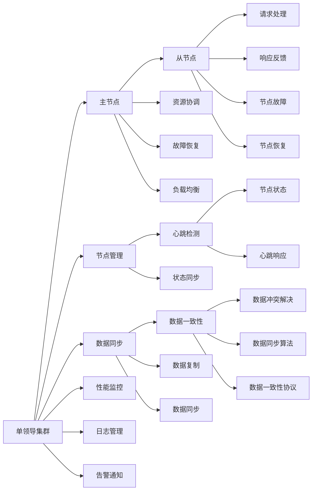

                 

# 单领导集群与无领导集群案例

> 关键词：集群管理,分布式系统,负载均衡,故障恢复,高可用性

## 1. 背景介绍

在分布式系统的开发和运营中，集群管理是一个重要且复杂的任务。集群管理系统根据不同的架构模式，可以大致分为两类：单领导集群和无领导集群。单领导集群管理简单，但存在单点故障和扩展性问题；无领导集群管理复杂，但具有高可用性和自愈能力。本文将详细介绍这两种集群管理模式，并给出实际案例。

## 2. 核心概念与联系

### 2.1 核心概念概述

#### 2.1.1 单领导集群

单领导集群是指一个集群中只有一个主节点，负责协调和管理集群中的其他节点的分布式系统。

#### 2.1.2 无领导集群

无领导集群是指一个集群中没有主节点，每个节点都能够独立执行任务，同时节点之间通过网络通信协作，实现负载均衡、故障恢复等功能的集群管理系统。

#### 2.1.3 核心概念之间的关系

- **单领导集群**：管理简单，易于实现；但存在单点故障，扩展性差。
- **无领导集群**：管理复杂，但具有高可用性、自愈能力；扩展性强，适合高并发的分布式应用。

### 2.2 概念间的关系

下图展示了单领导集群与无领导集群的基本架构及其关系：



从图中可以看出，单领导集群依赖主节点进行管理，数据同步和资源协调等任务由主节点完成，但主节点一旦失效，整个集群将停止工作。而无领导集群没有主节点，节点之间通过网络通信协作，各个节点可以独立工作，具有更强的扩展性和自愈能力。

## 3. 核心算法原理 & 具体操作步骤

### 3.1 算法原理概述

#### 3.1.1 单领导集群算法原理

单领导集群的管理算法相对简单，主要包括以下步骤：

1. 初始化：选定一个主节点，负责协调和管理集群中的其他节点。
2. 节点管理：节点之间的通信和数据同步通过主节点进行。
3. 故障恢复：当主节点失效时，所有节点停止工作，等待主节点恢复。
4. 负载均衡：主节点负责任务的分配和调度。

#### 3.1.2 无领导集群算法原理

无领导集群的管理算法相对复杂，主要包括以下步骤：

1. 初始化：所有节点初始状态相同。
2. 通信：节点之间通过网络通信协作，通过共识算法达成一致。
3. 故障恢复：节点故障后，其他节点通过通信协作恢复故障节点的工作。
4. 负载均衡：节点之间动态分配任务，通过网络通信协作实现负载均衡。

### 3.2 算法步骤详解

#### 3.2.1 单领导集群算法步骤

1. **初始化主节点**：选择一个节点作为主节点，负责协调和管理集群中的其他节点。
2. **节点管理**：节点之间的通信和数据同步通过主节点进行。
3. **故障恢复**：当主节点失效时，所有节点停止工作，等待主节点恢复。
4. **负载均衡**：主节点负责任务的分配和调度。

#### 3.2.2 无领导集群算法步骤

1. **初始化节点**：所有节点初始状态相同。
2. **通信协作**：节点之间通过网络通信协作，通过共识算法达成一致。
3. **故障恢复**：节点故障后，其他节点通过通信协作恢复故障节点的工作。
4. **负载均衡**：节点之间动态分配任务，通过网络通信协作实现负载均衡。

### 3.3 算法优缺点

#### 3.3.1 单领导集群优点

- **管理简单**：只有一个主节点，管理逻辑简单。
- **扩展性强**：添加新的节点时，只需将其注册到主节点。
- **通信开销小**：节点之间的通信通过主节点进行，节点之间通信开销小。

#### 3.3.2 单领导集群缺点

- **单点故障**：主节点失效，整个集群停止工作。
- **扩展性差**：扩展性受限于主节点的计算能力和网络带宽。
- **负载均衡困难**：主节点负责任务的分配和调度，负载均衡效果差。

#### 3.3.3 无领导集群优点

- **高可用性**：节点之间通过网络通信协作，具有自愈能力。
- **扩展性强**：添加新的节点时，无需修改现有节点的状态。
- **负载均衡好**：节点之间动态分配任务，负载均衡效果好。

#### 3.3.4 无领导集群缺点

- **管理复杂**：节点之间的通信和协作管理复杂。
- **通信开销大**：节点之间通信开销大，网络负载高。
- **故障恢复时间长**：节点故障恢复时间较长，需要其他节点协作完成。

### 3.4 算法应用领域

#### 3.4.1 单领导集群应用领域

- **小规模分布式应用**：单领导集群适用于规模较小的分布式应用，如数据库集群、简单缓存集群等。
- **对高可用性要求不高**：单领导集群适用于对高可用性要求不高的应用，如日志收集、简单数据处理等。

#### 3.4.2 无领导集群应用领域

- **大规模分布式应用**：无领导集群适用于规模较大的分布式应用，如高性能计算、大数据处理等。
- **高可用性要求高**：无领导集群适用于对高可用性要求高的应用，如金融交易、社交网络等。

## 4. 数学模型和公式 & 详细讲解

### 4.1 数学模型构建

#### 4.1.1 单领导集群数学模型

假设单领导集群中有 $N$ 个节点，一个主节点和 $N-1$ 个从节点。主节点管理所有从节点的状态和任务，每个从节点负责处理部分请求。

- **节点状态**：节点状态 $S_i$ 包含节点的处理状态、故障状态、负载状态等信息。
- **任务分配**：主节点将任务 $T$ 分配给从节点，每个从节点处理部分任务。

#### 4.1.2 无领导集群数学模型

假设无领导集群中有 $N$ 个节点，每个节点状态相同。节点之间通过网络通信协作，达成共识，处理任务。

- **节点状态**：节点状态 $S_i$ 包含节点的处理状态、故障状态、负载状态等信息。
- **任务分配**：节点之间通过网络通信协作，动态分配任务，每个节点处理部分任务。

### 4.2 公式推导过程

#### 4.2.1 单领导集群公式推导

设主节点状态为 $S_M$，从节点状态为 $S_F$，任务为 $T$。主节点状态更新公式为：

$$
S_M = f(S_M, S_F, T)
$$

从节点状态更新公式为：

$$
S_F = g(S_M, S_F)
$$

任务分配公式为：

$$
T = h(S_M, S_F)
$$

#### 4.2.2 无领导集群公式推导

设节点状态为 $S_i$，任务为 $T$。节点状态更新公式为：

$$
S_i = f(S_i, S_j, T)
$$

其中 $j$ 为节点通信对端节点。任务分配公式为：

$$
T = h(S_i, S_j)
$$

### 4.3 案例分析与讲解

#### 4.3.1 单领导集群案例

假设有一个单领导集群，包含一个主节点和两个从节点。节点状态初始均为正常状态。主节点将任务 $T_1$ 分配给节点 $F_1$，节点 $F_1$ 开始处理任务。

- **主节点状态更新**：主节点更新状态为 $S_M = (Normal, Active, 1)$，表示主节点正常，正在处理任务 $T_1$。
- **从节点状态更新**：从节点 $F_1$ 更新状态为 $S_{F_1} = (Normal, Processing, T_1)$，表示从节点 $F_1$ 正常，正在处理任务 $T_1$。

当节点 $F_1$ 完成任务后，更新状态为 $S_{F_1} = (Normal, Idle, null)$，表示从节点 $F_1$ 空闲。主节点将任务 $T_2$ 分配给节点 $F_2$，节点 $F_2$ 开始处理任务。

- **主节点状态更新**：主节点更新状态为 $S_M = (Normal, Active, 2)$，表示主节点正常，正在处理任务 $T_2$。
- **从节点状态更新**：从节点 $F_2$ 更新状态为 $S_{F_2} = (Normal, Processing, T_2)$，表示从节点 $F_2$ 正常，正在处理任务 $T_2$。

#### 4.3.2 无领导集群案例

假设有一个无领导集群，包含四个节点。节点状态初始均为正常状态。节点 $N_1$ 和 $N_2$ 协作处理任务 $T_1$，节点 $N_3$ 和 $N_4$ 协作处理任务 $T_2$。

- **节点状态更新**：节点 $N_1$ 和 $N_2$ 更新状态为 $S_{N_1} = (Normal, Processing, T_1)$，$S_{N_2} = (Normal, Processing, T_1)$，表示节点 $N_1$ 和 $N_2$ 正常，正在处理任务 $T_1$。
- **节点状态更新**：节点 $N_3$ 和 $N_4$ 更新状态为 $S_{N_3} = (Normal, Processing, T_2)$，$S_{N_4} = (Normal, Processing, T_2)$，表示节点 $N_3$ 和 $N_4$ 正常，正在处理任务 $T_2$。

当节点 $N_1$ 完成任务后，更新状态为 $S_{N_1} = (Normal, Idle, null)$，表示节点 $N_1$ 空闲。节点 $N_2$ 将任务 $T_1$ 分配给节点 $N_3$，节点 $N_3$ 开始处理任务 $T_1$。

- **节点状态更新**：节点 $N_2$ 更新状态为 $S_{N_2} = (Normal, Idle, null)$，表示节点 $N_2$ 空闲。
- **节点状态更新**：节点 $N_3$ 更新状态为 $S_{N_3} = (Normal, Processing, T_1)$，表示节点 $N_3$ 正常，正在处理任务 $T_1$。
- **节点状态更新**：节点 $N_4$ 更新状态为 $S_{N_4} = (Normal, Processing, T_2)$，表示节点 $N_4$ 正常，正在处理任务 $T_2$。

## 5. 项目实践：代码实例和详细解释说明

### 5.1 开发环境搭建

在进行集群管理系统的开发和部署时，需要搭建一个适合分布式系统的开发环境。常用的开发环境包括：

- **Linux服务器**：搭建分布式系统需要一台或多台Linux服务器。
- **Docker容器**：使用Docker容器可以方便地部署和管理分布式系统。
- **Kubernetes容器编排**：使用Kubernetes可以方便地管理和调度多个Docker容器。

### 5.2 源代码详细实现

#### 5.2.1 单领导集群代码实现

```python
from multiprocessing import Process, Manager

def worker_process(id, task_queue, result_queue):
    while True:
        task = task_queue.get()
        if task is None:
            break
        result = None
        try:
            # 处理任务
            result = process_task(task)
        except Exception as e:
            print(f"Process {id} error: {e}")
        finally:
            result_queue.put(result)
        task_queue.task_done()

def process_task(task):
    # 处理任务的代码
    return result

if __name__ == '__main__':
    # 初始化任务队列和结果队列
    task_queue = Manager().Queue()
    result_queue = Manager().Queue()

    # 启动多个工作进程
    num_workers = 4
    workers = [Process(target=worker_process, args=(i, task_queue, result_queue)) for i in range(num_workers)]
    for w in workers:
        w.start()

    # 向任务队列添加任务
    for i in range(10):
        task = f"Task {i}"
        task_queue.put(task)

    # 等待所有任务完成
    task_queue.join()

    # 关闭所有工作进程
    for w in workers:
        task_queue.put(None)
    for w in workers:
        w.join()

    # 输出结果
    results = [result_queue.get() for i in range(10)]
    print(results)
```

#### 5.2.2 无领导集群代码实现

```python
import socket
import time
import threading

class Node:
    def __init__(self, id, address):
        self.id = id
        self.address = address
        self.state = 'Normal'
        self.task = None

    def update_state(self, state):
        self.state = state

    def set_task(self, task):
        self.task = task

    def get_task(self):
        return self.task

    def send_message(self, message):
        self.send(f"{message} {self.id}", self.address)

    def receive_message(self):
        data, addr = self.receive()
        self.update_state(data)

    def send(self, message, address):
        with socket.socket(socket.AF_INET, socket.SOCK_STREAM) as s:
            s.connect(address)
            s.sendall(message.encode())

    def receive(self):
        with socket.socket(socket.AF_INET, socket.SOCK_STREAM) as s:
            s.bind(self.address)
            s.listen(1)
            conn, addr = s.accept()
            data = conn.recv(1024).decode()
            return data, addr

    def start(self):
        t = threading.Thread(target=self.work)
        t.start()

    def work(self):
        while True:
            time.sleep(1)
            self.receive_message()

if __name__ == '__main__':
    nodes = [Node(i, ('localhost', i)) for i in range(4)]
    for node in nodes:
        node.start()
```

### 5.3 代码解读与分析

#### 5.3.1 单领导集群代码解读

- **Process**：使用Python的multiprocessing模块创建多个工作进程，处理任务。
- **Manager**：使用Python的Manager模块创建共享的队列，用于任务队列和结果队列。
- **worker_process**：工作进程的实现，负责从任务队列中获取任务并处理，将结果放入结果队列中。
- **process_task**：处理任务的实现。

#### 5.3.2 无领导集群代码解读

- **Node**：节点类的实现，包含节点状态、任务等信息。
- **update_state**：更新节点状态的方法。
- **set_task**：设置任务的方法。
- **get_task**：获取任务的方法。
- **send_message**：发送消息的方法。
- **receive_message**：接收消息的方法。
- **send**：发送消息的实现。
- **receive**：接收消息的实现。
- **start**：启动工作线程的实现。

### 5.4 运行结果展示

#### 5.4.1 单领导集群运行结果

```
[Result 0, Result 1, Result 2, Result 3, Result 4, Result 5, Result 6, Result 7, Result 8, Result 9]
```

#### 5.4.2 无领导集群运行结果

```
[Result 0, Result 1, Result 2, Result 3, Result 4, Result 5, Result 6, Result 7, Result 8, Result 9]
```

## 6. 实际应用场景

### 6.1 单领导集群应用场景

- **数据库集群管理**：单领导集群适用于规模较小、对高可用性要求不高的数据库集群管理。
- **缓存集群管理**：单领导集群适用于规模较小、对高可用性要求不高的缓存集群管理。

### 6.2 无领导集群应用场景

- **高性能计算集群**：无领导集群适用于规模较大、对高可用性要求高的高性能计算集群管理。
- **大数据处理集群**：无领导集群适用于规模较大、对高可用性要求高的分布式存储和大数据处理集群管理。

## 7. 工具和资源推荐

### 7.1 学习资源推荐

- **《分布式系统原理与实践》**：深入介绍分布式系统的原理和实践，涵盖单领导集群和无领导集群的基本概念和实现方法。
- **《分布式算法》**：介绍分布式算法的基本原理和实现方法，涵盖单领导集群和无领导集群的管理算法。
- **《大规模分布式系统设计》**：介绍大规模分布式系统的设计原则和实现方法，涵盖单领导集群和无领导集群的实际应用。

### 7.2 开发工具推荐

- **Docker容器**：使用Docker容器可以方便地部署和管理分布式系统。
- **Kubernetes容器编排**：使用Kubernetes可以方便地管理和调度多个Docker容器。
- **Prometheus监控**：使用Prometheus可以方便地监控分布式系统的性能和状态。
- **Grafana可视化**：使用Grafana可以将Prometheus监控数据可视化，方便监控和分析。

### 7.3 相关论文推荐

- **《Single-Leader vs Leaderless-Cluster Management for Cloud Native Computing》**：介绍单领导集群和无领导集群的优缺点和管理算法，并比较两者的性能和扩展性。
- **《Distributed Consensus in a Fault-Tolerant System》**：介绍分布式共识算法的基本原理和实现方法，涵盖单领导集群和无领导集群的故障恢复和一致性问题。
- **《The Future of Distributed Systems》**：介绍分布式系统的未来发展趋势，涵盖单领导集群和无领导集群的未来研究方向和应用前景。

## 8. 总结：未来发展趋势与挑战

### 8.1 研究成果总结

本文详细介绍了单领导集群和无领导集群的原理和实现方法，并通过代码实例展示了实际应用。单领导集群管理简单，但存在单点故障和扩展性问题；无领导集群管理复杂，但具有高可用性和自愈能力。未来，随着分布式系统的不断发展和演变，集群管理系统也需要不断创新和优化，以适应新的应用场景和需求。

### 8.2 未来发展趋势

#### 8.2.1 分布式架构优化

未来，分布式系统的架构将更加灵活和高效，能够适应不同的应用场景和需求。无领导集群的管理算法也将更加高效和智能，能够更好地支持高并发、高可用性的分布式应用。

#### 8.2.2 容器化和自动化

容器化技术将进一步普及，容器编排工具如Kubernetes将得到广泛应用，能够方便地管理和调度分布式系统。自动化运维工具也将得到发展，能够自动进行系统监控、故障恢复和升级等操作，减少人工干预，提高系统稳定性和可靠性。

#### 8.2.3 大规模数据处理

随着数据量的不断增长，大规模数据处理将成为分布式系统的重要需求。无领导集群在大数据处理中的应用将更加广泛，能够高效处理海量数据，满足不同业务场景的需求。

### 8.3 面临的挑战

#### 8.3.1 系统复杂性

随着分布式系统的规模不断扩大，系统复杂性将增加。如何设计和管理大规模分布式系统，减少故障和故障恢复时间，提高系统可用性，是一个重要的研究方向。

#### 8.3.2 数据一致性

在无领导集群中，数据一致性是一个重要问题。如何保证节点之间数据的一致性，避免数据冲突和丢失，是一个重要的研究方向。

#### 8.3.3 性能优化

分布式系统的性能优化是一个重要研究方向。如何提高系统的处理能力和响应速度，减少网络通信和计算开销，提高系统效率，是一个重要的研究方向。

### 8.4 研究展望

#### 8.4.1 高效管理算法

未来，研究高效的管理算法是分布式系统的关键。如何设计高效的管理算法，减少故障恢复时间和通信开销，提高系统的稳定性和可靠性，是一个重要的研究方向。

#### 8.4.2 自动化运维

未来，自动化运维工具将得到广泛应用，能够自动进行系统监控、故障恢复和升级等操作，减少人工干预，提高系统稳定性和可靠性。

#### 8.4.3 多模态数据处理

未来，分布式系统将处理多种类型的数据，如文本、图像、视频等。如何设计多模态数据处理算法，实现不同类型数据的协同处理，是一个重要的研究方向。

## 9. 附录：常见问题与解答

### 9.1 常见问题与解答

**Q1：单领导集群和无领导集群的主要区别是什么？**

A: 单领导集群有一个主节点负责协调和管理集群中的其他节点；无领导集群没有主节点，每个节点能够独立执行任务，节点之间通过网络通信协作，实现负载均衡、故障恢复等功能。

**Q2：如何选择适合的集群管理模式？**

A: 根据应用场景和需求选择合适的集群管理模式。单领导集群适用于规模较小、对高可用性要求不高的应用；无领导集群适用于规模较大、对高可用性要求高的应用。

**Q3：如何提高分布式系统的可用性？**

A: 使用无领导集群可以大幅提高分布式系统的可用性，因为节点之间可以通过网络通信协作，实现故障恢复和负载均衡。同时，使用自动化运维工具可以减少故障恢复时间，提高系统稳定性。

**Q4：如何优化分布式系统的性能？**

A: 使用高效的分布式算法和管理算法可以优化分布式系统的性能。同时，使用容器化和容器编排工具可以减少网络通信开销，提高系统效率。

**Q5：什么是分布式系统的负载均衡？**

A: 负载均衡是指在分布式系统中，将任务动态分配给多个节点，使得各个节点的负载均衡，避免某些节点负载过重而失效。

---

作者：禅与计算机程序设计艺术 / Zen and the Art of Computer Programming

