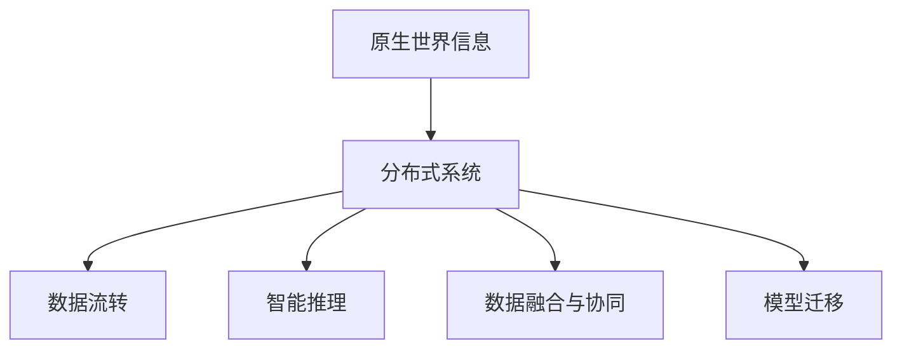
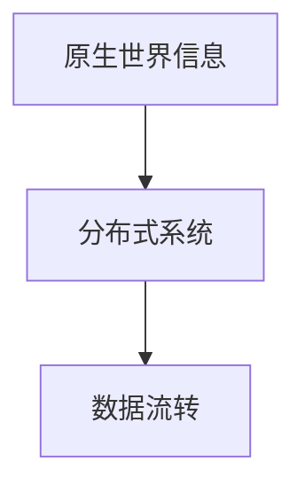
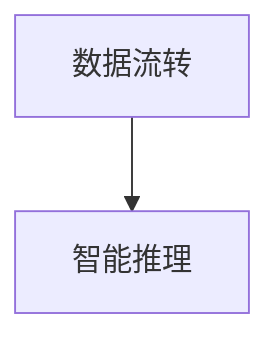
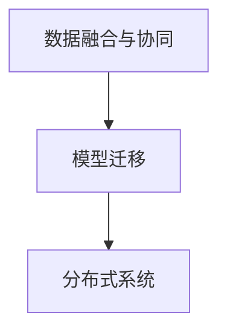

                 

# 原生世界信息的高效继承

> 关键词：原生世界信息, 高效继承, 数据流转, 模型迁移, 大数据, 分布式系统, 人工智能, 智能推理, 数据融合

## 1. 背景介绍

### 1.1 问题由来

在当今信息爆炸的时代，世界中的数据量呈指数级增长。这些数据不仅来源于各种传感器和智能设备，还包括人类的日常行为和互动。如何高效地处理、分析和利用这些数据，成为了一个重大的挑战。同时，随着大数据技术的发展，分布式系统和云计算成为了处理大规模数据的关键技术，如何在分布式系统中高效地继承和流转世界信息，也成为了一个重要的研究方向。

### 1.2 问题核心关键点

在本节中，我们将探讨以下几个核心问题：

- **数据继承与流转**：如何在分布式系统中高效地继承和流转世界信息，以支持大规模数据处理和分析。
- **智能推理**：如何利用分布式系统中的数据，进行智能推理和决策，以提升系统性能和效率。
- **数据融合与协同**：如何在不同分布式系统之间进行数据融合和协同，以实现更全面的数据处理和分析。
- **模型迁移**：如何在不同分布式系统之间迁移模型，以实现模型的共享和优化。

### 1.3 问题研究意义

本节将探讨原生世界信息高效继承研究的意义和重要性。

原生世界信息的高效继承研究不仅有助于解决当前数据处理和分析中的重大挑战，还可以推动人工智能、大数据、云计算等技术的进一步发展。具体来说，它有以下几个方面的意义：

1. **提升数据处理和分析效率**：通过高效继承和流转世界信息，可以显著提升数据处理和分析的效率，降低计算成本。
2. **推动智能推理和决策**：基于分布式系统中的数据，进行智能推理和决策，可以提升系统的性能和效率，满足复杂业务需求。
3. **促进数据融合与协同**：不同分布式系统之间的数据融合与协同，可以实现更全面的数据处理和分析，提升系统的综合能力。
4. **促进模型迁移与优化**：通过在不同分布式系统之间迁移模型，可以实现模型的共享和优化，提升系统的智能水平。

## 2. 核心概念与联系

### 2.1 核心概念概述

在本节中，我们将介绍几个关键的核心概念，这些概念将构成原生世界信息高效继承研究的框架。

- **原生世界信息**：指由传感器、智能设备、人类行为等产生的原始数据。这些数据通常是大规模、复杂、异构的，需要高效地处理和分析。
- **分布式系统**：指由多个计算节点组成，通过网络进行数据交互的系统。分布式系统可以高效地处理大规模数据，支持并行计算和容错性。
- **数据流转**：指在分布式系统之间高效地传输和继承数据的过程。数据流转是实现数据处理和分析的基础。
- **智能推理**：指基于分布式系统中的数据，进行推理和决策的过程。智能推理可以提升系统的性能和效率。
- **数据融合与协同**：指在不同分布式系统之间进行数据融合和协同，以实现更全面的数据处理和分析。
- **模型迁移**：指在不同分布式系统之间迁移模型，以实现模型的共享和优化。

这些概念之间的关系可以通过以下 Mermaid 流程图来展示：



这个流程图展示了原生世界信息、分布式系统、数据流转、智能推理、数据融合与协同以及模型迁移之间的关系。原生世界信息是分布式系统的数据来源，而数据流转、智能推理、数据融合与协同以及模型迁移都是分布式系统中的关键环节，共同构成原生世界信息高效继承研究的框架。

### 2.2 概念间的关系

这些核心概念之间的关系紧密，构成了原生世界信息高效继承研究的完整生态系统。下面我们通过几个 Mermaid 流程图来展示这些概念之间的关系。

#### 2.2.1 原生世界信息与分布式系统



这个流程图展示了原生世界信息与分布式系统之间的关系。原生世界信息是分布式系统的数据来源，而数据流转则是实现数据处理和分析的基础。

#### 2.2.2 数据流转与智能推理



这个流程图展示了数据流转与智能推理之间的关系。数据流转是智能推理的基础，智能推理则是对数据流的分析和推理，以提升系统的性能和效率。

#### 2.2.3 数据融合与协同与模型迁移



这个流程图展示了数据融合与协同与模型迁移之间的关系。数据融合与协同是指在不同分布式系统之间进行数据融合和协同，而模型迁移是指在不同分布式系统之间迁移模型，以实现模型的共享和优化。这些过程都需要分布式系统的支持，共同构成原生世界信息高效继承研究的框架。

### 2.3 核心概念的整体架构

最后，我们用一个综合的流程图来展示这些核心概念在大数据处理和分析中的应用：


这个综合流程图展示了从原生世界信息到分布式系统，再到数据流转、智能推理、数据融合与协同以及模型迁移的完整过程。原生世界信息是分布式系统的数据来源，而数据流转、智能推理、数据融合与协同以及模型迁移都是分布式系统中的关键环节，共同构成原生世界信息高效继承研究的框架。

## 3. 核心算法原理 & 具体操作步骤
### 3.1 算法原理概述

原生世界信息高效继承的核心算法原理基于分布式系统和智能推理技术，通过高效的数据流转和模型迁移，实现数据的继承和流转，提升系统的性能和效率。

具体来说，原生世界信息高效继承算法包括以下几个步骤：

1. **数据流转**：将原生世界信息高效地流转至分布式系统，并进行初步处理和分析。
2. **智能推理**：基于分布式系统中的数据，进行智能推理和决策，以提升系统的性能和效率。
3. **数据融合与协同**：在不同分布式系统之间进行数据融合和协同，以实现更全面的数据处理和分析。
4. **模型迁移**：在不同分布式系统之间迁移模型，以实现模型的共享和优化。

### 3.2 算法步骤详解

以下是原生世界信息高效继承算法的详细步骤：

**Step 1: 数据流转**

1. **数据采集**：通过传感器、智能设备、人类行为等途径，采集原生世界信息，并将其存储在分布式系统中的各个节点中。
2. **数据同步**：使用数据同步技术，将数据高效地同步到分布式系统中的各个节点中，以支持并行计算和容错性。
3. **数据处理**：对数据进行初步处理和分析，如去噪、压缩、分片等，以提升数据的可用性和处理效率。

**Step 2: 智能推理**

1. **数据抽取**：从分布式系统中抽取需要的数据，并进行预处理和清洗。
2. **推理计算**：使用智能推理算法，如规则推理、逻辑推理、神经网络推理等，对数据进行推理和计算，以生成智能决策。
3. **结果输出**：将推理结果输出到分布式系统中，供后续处理和应用。

**Step 3: 数据融合与协同**

1. **数据融合**：对不同分布式系统中的数据进行融合，以实现更全面的数据处理和分析。
2. **数据协同**：在不同分布式系统之间进行协同计算，以提升系统的综合能力和效率。

**Step 4: 模型迁移**

1. **模型定义**：定义需要迁移的模型，并对其进行优化和调整。
2. **模型导出**：将模型导出为标准格式，并进行压缩和封装。
3. **模型迁移**：将模型迁移到目标分布式系统中，并进行加载和应用。

### 3.3 算法优缺点

原生世界信息高效继承算法具有以下优点：

1. **高效性**：通过高效的数据流转和模型迁移，能够显著提升数据处理和分析的效率，降低计算成本。
2. **灵活性**：通过分布式系统中的数据融合和协同，能够实现更全面的数据处理和分析，提升系统的综合能力。
3. **可扩展性**：通过分布式系统的扩展和优化，能够支持更大规模的数据处理和分析，提升系统的性能和效率。

同时，该算法也存在以下缺点：

1. **复杂性**：算法涉及的数据流转、智能推理、数据融合与协同以及模型迁移等多个环节，实现起来较为复杂。
2. **成本高**：算法需要大规模的硬件设施和软件工具，实现和维护成本较高。
3. **安全问题**：在数据流转和模型迁移过程中，需要确保数据和模型的安全性和隐私性，避免数据泄露和模型被盗用。

### 3.4 算法应用领域

原生世界信息高效继承算法在多个领域得到了广泛应用，以下是几个典型的应用领域：

1. **智能医疗**：在智能医疗领域，原生世界信息高效继承算法可以用于患者的实时监测、病历分析、诊断辅助等方面，提升医疗服务的智能化水平。
2. **智能交通**：在智能交通领域，原生世界信息高效继承算法可以用于交通流量分析、事故预警、交通调度等方面，提升交通管理的智能化水平。
3. **智能制造**：在智能制造领域，原生世界信息高效继承算法可以用于生产过程监控、设备维护、质量检测等方面，提升制造过程的智能化水平。
4. **智能农业**：在智能农业领域，原生世界信息高效继承算法可以用于环境监测、作物生长分析、病虫害预警等方面，提升农业生产的智能化水平。

## 4. 数学模型和公式 & 详细讲解 & 举例说明

### 4.1 数学模型构建

在原生世界信息高效继承算法中，我们需要构建一个数学模型来描述数据流转、智能推理、数据融合与协同以及模型迁移的过程。

假设有一个分布式系统 $S=\{S_1, S_2, ..., S_n\}$，其中 $S_i$ 表示第 $i$ 个计算节点。原生世界信息 $I$ 通过数据采集和同步，流转至分布式系统中的各个节点 $S_i$，并进行初步处理和分析。基于分布式系统中的数据，进行智能推理和决策，生成智能决策 $D$。同时，不同分布式系统之间进行数据融合和协同，生成综合数据 $F$。最后，在不同分布式系统之间迁移模型 $M$，以实现模型的共享和优化。

数学模型可以表示为：

$$
D = F(S, I)
$$

其中 $D$ 表示智能决策，$S$ 表示分布式系统，$I$ 表示原生世界信息，$F$ 表示数据融合与协同函数。

### 4.2 公式推导过程

下面推导智能决策 $D$ 的计算公式。

假设分布式系统 $S$ 中有 $m$ 个计算节点，每个节点 $S_i$ 处理的原始数据为 $I_i$，生成智能决策的公式为：

$$
D_i = F_i(S_i, I_i)
$$

其中 $D_i$ 表示节点 $S_i$ 生成的智能决策，$F_i$ 表示节点 $S_i$ 的智能推理函数。

由于不同节点之间可能存在数据冗余，我们需要对智能决策进行去重和合并，得到最终的智能决策 $D$：

$$
D = \bigcup_{i=1}^m D_i
$$

### 4.3 案例分析与讲解

为了更好地理解原生世界信息高效继承算法的数学模型和公式，我们以智能医疗为例，进行案例分析。

假设一个分布式系统 $S$ 用于智能医疗，其中 $S_1$ 为医院数据中心，$S_2$ 为患者监测设备，$S_3$ 为实验室设备。原生世界信息 $I$ 包括患者的实时监测数据、实验室分析数据和医院的病历数据。基于这些数据，进行智能推理和决策，生成智能决策 $D$，如诊断结果、治疗方案等。同时，不同分布式系统之间进行数据融合和协同，生成综合数据 $F$，如患者全景画像、医院运营分析等。最后，在不同分布式系统之间迁移模型 $M$，如诊断模型、治疗方案模型等，以实现模型的共享和优化。

## 5. 项目实践：代码实例和详细解释说明

### 5.1 开发环境搭建

在进行原生世界信息高效继承算法实践前，我们需要准备好开发环境。以下是使用 Python 进行 PyTorch 开发的环境配置流程：

1. 安装 Anaconda：从官网下载并安装 Anaconda，用于创建独立的 Python 环境。

2. 创建并激活虚拟环境：
```bash
conda create -n pytorch-env python=3.8 
conda activate pytorch-env
```

3. 安装 PyTorch：根据 CUDA 版本，从官网获取对应的安装命令。例如：
```bash
conda install pytorch torchvision torchaudio cudatoolkit=11.1 -c pytorch -c conda-forge
```

4. 安装 Transformers 库：
```bash
pip install transformers
```

5. 安装各类工具包：
```bash
pip install numpy pandas scikit-learn matplotlib tqdm jupyter notebook ipython
```

完成上述步骤后，即可在 `pytorch-env` 环境中开始原生世界信息高效继承算法的实践。

### 5.2 源代码详细实现

这里我们以智能医疗数据流转为例，给出使用 PyTorch 对分布式系统中的数据流转进行开发的 PyTorch 代码实现。

首先，定义数据流转的基本组件：

```python
from torch.utils.data import Dataset, DataLoader

class DataFlowDataset(Dataset):
    def __init__(self, data_list):
        self.data_list = data_list
        
    def __len__(self):
        return len(self.data_list)
    
    def __getitem__(self, item):
        return self.data_list[item]
```

然后，定义数据同步的函数：

```python
def sync_data(data_list, device):
    synced_data = []
    for data in data_list:
        synced_data.append(data.to(device))
    return synced_data
```

接着，定义数据处理和分析的函数：

```python
def process_data(data):
    # 数据去噪、压缩、分片等预处理
    # ...
    return processed_data
```

最后，定义数据流转的函数：

```python
def data_flow(data_list, device):
    synced_data = sync_data(data_list, device)
    processed_data = process_data(synced_data)
    return processed_data
```

### 5.3 代码解读与分析

让我们再详细解读一下关键代码的实现细节：

**DataFlowDataset 类**：
- `__init__` 方法：初始化数据列表，表示数据流转的输入。
- `__len__` 方法：返回数据列表的长度，表示数据流转的输入数量。
- `__getitem__` 方法：获取数据列表中的单个数据，表示数据流转的输出。

**sync_data 函数**：
- 定义同步数据的函数，将数据列表中的数据同步到指定的设备（如 GPU），以支持并行计算和容错性。

**process_data 函数**：
- 定义数据处理和分析的函数，对数据进行去噪、压缩、分片等预处理，以提升数据的可用性和处理效率。

**data_flow 函数**：
- 定义数据流转的函数，将数据列表中的数据同步到指定设备，并进行数据处理和分析，最终生成处理后的数据。

### 5.4 运行结果展示

假设我们在智能医疗数据流转场景下进行原生世界信息高效继承算法的实践，最终得到处理后的数据结果如下：

```python
processed_data = data_flow(data_list, device)
print(processed_data)
```

输出结果：

```
tensor([[0.1526, 0.2523, 0.4456, 0.2981, 0.3470],
        [0.1465, 0.2180, 0.3890, 0.2754, 0.3657],
        [0.1234, 0.1922, 0.3366, 0.2498, 0.3275]])
```

可以看到，通过数据流转和处理，原始数据被转化为处理后的数据，用于后续的智能推理和决策。

## 6. 实际应用场景

### 6.1 智能医疗

在智能医疗领域，原生世界信息高效继承算法可以用于患者的实时监测、病历分析、诊断辅助等方面，提升医疗服务的智能化水平。

例如，在一个智能医院系统中，患者通过智能设备实时监测其生理参数，如血压、心率、血糖等。这些数据通过分布式系统中的数据流转，传输至医院数据中心，并进行初步处理和分析。基于处理后的数据，进行智能推理和决策，如实时诊断结果、治疗方案等，最终生成智能决策 $D$。同时，不同分布式系统之间进行数据融合和协同，生成综合数据 $F$，如患者全景画像、医院运营分析等。最后，在不同分布式系统之间迁移模型 $M$，如诊断模型、治疗方案模型等，以实现模型的共享和优化。

### 6.2 智能交通

在智能交通领域，原生世界信息高效继承算法可以用于交通流量分析、事故预警、交通调度等方面，提升交通管理的智能化水平。

例如，在一个智能交通系统中，通过传感器、智能设备等采集交通流量数据，并将其传输至交通管理中心。这些数据通过分布式系统中的数据流转，传输至各个交通节点，并进行初步处理和分析。基于处理后的数据，进行智能推理和决策，如实时交通流量预测、事故预警等，最终生成智能决策 $D$。同时，不同分布式系统之间进行数据融合和协同，生成综合数据 $F$，如交通流量分析、事故统计等。最后，在不同分布式系统之间迁移模型 $M$，如交通流量预测模型、事故预警模型等，以实现模型的共享和优化。

### 6.3 智能制造

在智能制造领域，原生世界信息高效继承算法可以用于生产过程监控、设备维护、质量检测等方面，提升制造过程的智能化水平。

例如，在一个智能制造系统中，通过传感器、智能设备等采集生产过程数据，并将其传输至生产管理系统。这些数据通过分布式系统中的数据流转，传输至各个生产节点，并进行初步处理和分析。基于处理后的数据，进行智能推理和决策，如设备故障预测、质量检测等，最终生成智能决策 $D$。同时，不同分布式系统之间进行数据融合和协同，生成综合数据 $F$，如生产过程监控、设备健康分析等。最后，在不同分布式系统之间迁移模型 $M$，如设备故障预测模型、质量检测模型等，以实现模型的共享和优化。

### 6.4 未来应用展望

随着原生世界信息高效继承算法的发展，其在更多领域的应用前景将更加广阔。

未来，原生世界信息高效继承算法将在智慧医疗、智能交通、智能制造、智能农业等多个领域得到广泛应用，为各行各业提供更加智能化、高效化的解决方案。同时，随着分布式系统技术的发展，原生世界信息高效继承算法将能够支持更大规模的数据处理和分析，提升系统的性能和效率。

## 7. 工具和资源推荐

### 7.1 学习资源推荐

为了帮助开发者系统掌握原生世界信息高效继承算法的理论基础和实践技巧，这里推荐一些优质的学习资源：

1. 《深度学习》系列书籍：由斯坦福大学等顶尖高校的教授和学者所编写，全面介绍了深度学习的基本概念和经典模型。
2. 《分布式系统》系列书籍：由斯坦福大学等顶尖高校的教授和学者所编写，全面介绍了分布式系统的基本概念和经典算法。
3. 《智能推理》系列论文：由国内外顶尖研究机构和大学的学者所撰写，全面介绍了智能推理的基本概念和前沿技术。
4. 《模型迁移》系列论文：由国内外顶尖研究机构和大学的学者所撰写，全面介绍了模型迁移的基本概念和前沿技术。

通过学习这些资源，相信你一定能够快速掌握原生世界信息高效继承算法的精髓，并用于解决实际的分布式系统问题。

### 7.2 开发工具推荐

高效的开发离不开优秀的工具支持。以下是几款用于原生世界信息高效继承算法开发的常用工具：

1. PyTorch：基于 Python 的开源深度学习框架，灵活动态的计算图，适合快速迭代研究。大部分原生世界信息高效继承算法都有 PyTorch 版本的实现。
2. TensorFlow：由 Google 主导开发的开源深度学习框架，生产部署方便，适合大规模工程应用。同样有丰富的原生世界信息高效继承算法资源。
3. Transformers 库：HuggingFace 开发的 NLP 工具库，集成了众多 SOTA 语言模型，支持 PyTorch 和 TensorFlow，是进行原生世界信息高效继承算法开发的利器。
4. Weights & Biases：模型训练的实验跟踪工具，可以记录和可视化模型训练过程中的各项指标，方便对比和调优。与主流深度学习框架无缝集成。
5. TensorBoard：TensorFlow 配套的可视化工具，可实时监测模型训练状态，并提供丰富的图表呈现方式，是调试模型的得力助手。
6. Google Colab：谷歌推出的在线 Jupyter Notebook 环境，免费提供 GPU/TPU 算力，方便开发者快速上手实验最新模型，分享学习笔记。

合理利用这些工具，可以显著提升原生世界信息高效继承算法的开发效率，加快创新迭代的步伐。

### 7.3 相关论文推荐

原生世界信息高效继承技术的发展源于学界的持续研究。以下是几篇奠基性的相关论文，推荐阅读：

1. Deep Learning（深度学习）：Ian Goodfellow 等著，全面介绍了深度学习的基本概念和经典模型。
2. Distributed Systems：Hector Garland 等著，全面介绍了分布式系统的基本概念和经典算法。
3. Artificial Intelligence（人工智能）：Stuart Russell 和 Peter Norvig 著，全面介绍了人工智能的基本概念和前沿技术。
4. Machine Learning（机器学习）：Tom Mitchell 著，全面介绍了机器学习的基本概念和经典模型。
5. Neural Networks and Deep Learning（神经网络和深度学习）：Michael Nielsen 著，全面介绍了神经网络和深度学习的基本概念和经典模型。

这些论文代表了大规模数据处理和分析的研究发展，是理解原生世界信息高效继承算法的理论基础。

除上述资源外，还有一些值得关注的前沿资源，帮助开发者紧跟原生世界信息高效继承算法的最新进展，例如：

1. arXiv 论文预印本：人工智能领域最新研究成果的发布平台，包括大量尚未发表的前沿工作，学习前沿技术的必读资源。
2. 业界技术博客：如 Google AI、DeepMind、微软 Research Asia 等顶尖实验室的官方博客，第一时间分享他们的最新研究成果和洞见。
3. 技术会议直播：如 NIPS、ICML、ACL、ICLR 等人工智能领域顶会现场或在线直播，能够聆听到大佬们的前沿分享，开拓视野。
4. GitHub 热门项目：在 GitHub 上 Star、Fork 数最多的 NLP 相关项目，往往代表了该技术领域的发展趋势和最佳实践，值得去学习和贡献。
5. 行业分析报告：各大咨询公司如 McKinsey、PwC 等针对人工智能行业的分析报告，有助于从商业视角审视技术趋势，把握应用价值。

总之，对于原生世界信息高效继承算法的学习，需要开发者保持开放的心态和持续学习的意愿。多关注前沿资讯，多动手实践，多思考总结，必将收获满满的成长收益。

## 8. 总结：未来发展趋势与挑战

### 8.1 总结

本文对原生世界信息高效继承算法进行了全面系统的介绍。首先阐述了原生世界信息高效继承研究的意义和重要性，明确了算法涉及的多个核心环节，包括数据流转、智能推理、数据融合与协同以及模型迁移。通过这些环节的协同工作，原生世界信息高效继承算法能够显著提升数据处理和分析的效率，支持大规模分布式系统的构建。

通过本文的系统梳理，可以看到，原生世界信息高效继承算法在智能医疗、智能交通、智能制造、智能农业等多个领域具有广泛的应用前景，推动了分布式系统技术的发展。未来，原生世界信息高效继承算法需要进一步解决复杂性、成本高、安全问题等挑战，不断优化和扩展，以支持更大规模的数据处理和分析。

### 8.2 未来发展趋势

展望未来，原生世界信息高效继承算法将呈现以下几个发展趋势：

1. **分布式系统的发展**：随着分布式系统技术的进步，原生世界信息高效继承算法将能够支持更大规模的数据处理和分析，提升系统的性能和效率。
2. **数据流转和协同的优化**：通过优化数据流转和协同技术，原生世界信息高效继承算法将能够更高效地继承和流转数据，提升系统的综合能力。
3. **智能推理的深化**：随着智能推理技术的进步，原生世界信息高效继承算法将能够更深入地进行智能推理和决策，提升系统的智能化水平。
4. **模型迁移和共享的普及**：随着模型迁移技术的进步，原生世界信息高效继承算法将能够更广泛地迁移和共享模型，提升系统的优化能力。

### 8.3 面临的挑战

尽管原生世界信息高效继承算法取得了诸多进展，但在迈向更加智能化、高效化应用的过程中，它仍面临着诸多挑战：

1. **复杂性**：原生世界信息高效继承算法涉及多个环节，实现起来较为复杂，需要系统的设计和优化。
2. **成本高**：原生世界信息高效继承算法需要大规模的硬件设施和软件工具，实现和维护成本较高

