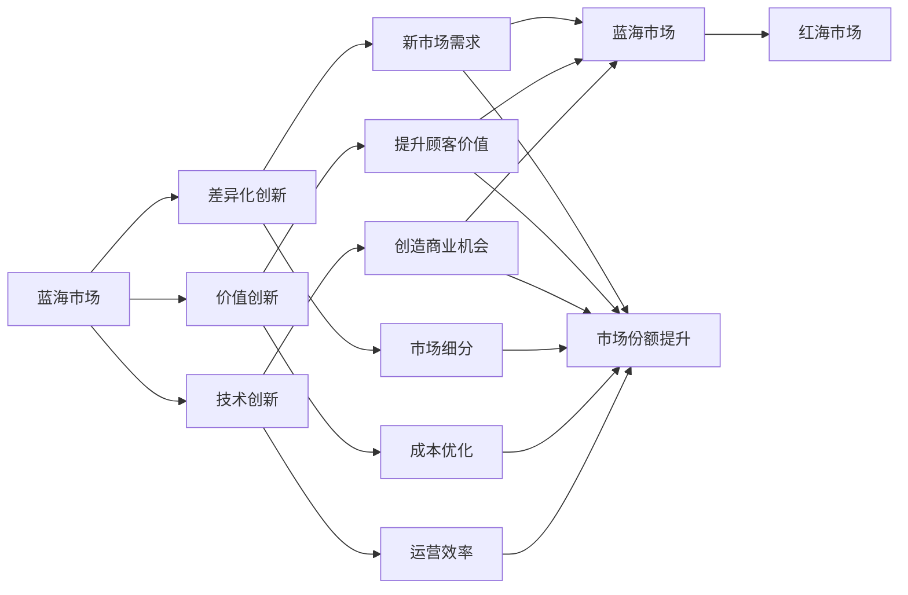

                 

# 商业领域从蓝海到红海的转变

## 1. 背景介绍

在商业领域，传统的蓝海市场是指那些尚未被充分开发、竞争稀少的市场空间。而红海市场则是指那些竞争激烈、利润空间小的成熟市场。从蓝海到红海的转变，是每一个企业都可能面对的挑战，尤其是在快速发展的技术时代。本文将探讨商业领域从蓝海到红海转变的关键因素，以及如何通过技术创新和优化管理策略来应对这一转变。

## 2. 核心概念与联系

### 2.1 核心概念概述

- **蓝海市场**：指尚未被充分开发，竞争稀少的市场。企业可以通过差异化创新和价值创新来开拓蓝海市场。
- **红海市场**：指竞争激烈，利润空间小的成熟市场。企业需要通过成本优化、市场份额提升等策略来在红海市场竞争。
- **差异化创新**：通过技术、产品或服务独特性来满足未被满足的需求，创造新的市场需求。
- **价值创新**：通过优化产品或服务价值链，降低成本，提升顾客价值，实现市场份额的提升。
- **技术创新**：通过新技术的应用，提高效率，降低成本，创造新的商业机会。
- **管理优化**：通过管理流程、供应链优化等手段，提升企业的运营效率和市场响应速度。

这些概念之间存在着密切的联系，形成一个相互作用的商业创新网络。差异化创新和价值创新是开拓蓝海市场的核心，而技术创新和管理优化则是应对红海市场竞争的关键。

### 2.2 概念间的关系

通过以下Mermaid流程图展示这些核心概念之间的联系：



## 3. 核心算法原理 & 具体操作步骤

### 3.1 算法原理概述

从蓝海到红海的转变，本质上是一个市场竞争态势的变化过程。蓝海市场到红海的转变，通常伴随着市场规模的扩大、消费者需求的成熟、竞争对手的增加等现象。企业需要通过差异化创新和价值创新，开拓新的市场空间，而在红海市场，则需要通过优化管理、提升效率、降低成本等手段，提升市场份额。

### 3.2 算法步骤详解

**步骤1: 市场分析与定位**

- 分析市场现状和潜在机会，确定企业当前所处的市场阶段。
- 通过市场调研、客户反馈、竞争对手分析等手段，了解市场需求和趋势。
- 根据市场需求和自身资源能力，定位企业的市场位置，决定是进入蓝海市场还是继续在红海市场竞争。

**步骤2: 差异化创新**

- 识别未被满足的顾客需求，设计独特的解决方案。
- 通过技术研发、产品设计等手段，实现差异化创新。
- 测试市场反应，持续优化产品和服务，满足市场预期。

**步骤3: 价值创新**

- 优化价值链，降低成本，提升产品和服务价值。
- 通过精益生产、自动化、流程优化等手段，提升运营效率。
- 提升客户体验，增加客户忠诚度，实现市场份额的提升。

**步骤4: 技术创新**

- 引入新技术，提高产品和服务质量。
- 通过大数据、人工智能、物联网等技术，提升市场响应速度和效率。
- 持续技术投入，保持企业竞争力。

**步骤5: 管理优化**

- 优化管理流程，提高决策效率。
- 通过供应链优化、库存管理等手段，降低运营成本。
- 建立灵活的组织结构，增强市场适应性。

**步骤6: 持续改进与创新**

- 不断收集市场反馈，持续改进产品和服务。
- 定期评估市场表现，调整战略方向。
- 保持技术和管理创新，不断开拓新的市场空间。

### 3.3 算法优缺点

**优点：**

- 差异化创新和价值创新能够开拓新的市场空间，增加企业的市场份额和收入。
- 技术创新和管理优化能够提升企业的运营效率和竞争力，降低成本。
- 持续改进与创新能够帮助企业在市场竞争中保持领先地位。

**缺点：**

- 差异化创新和价值创新需要较高的研发投入和市场试错成本。
- 技术创新和管理优化需要投入大量资源，短期内可能难以见效。
- 持续改进与创新需要企业具有较强的市场洞察力和灵活性。

### 3.4 算法应用领域

- **差异化创新**：适用于新技术驱动的行业，如电子商务、金融科技、智能制造等。
- **价值创新**：适用于传统行业，如零售、制造、农业等。
- **技术创新**：适用于高科技行业，如人工智能、大数据、生物技术等。
- **管理优化**：适用于所有行业，通过优化管理流程，提高企业运营效率。

## 4. 数学模型和公式 & 详细讲解 & 举例说明

### 4.1 数学模型构建

我们通过以下数学模型来描述从蓝海到红海转变的核心过程：

设 $S(t)$ 表示市场规模，$D(t)$ 表示市场需求，$C(t)$ 表示竞争对手数量，$P(t)$ 表示产品/服务价格，$V(t)$ 表示价值链效率，$M(t)$ 表示市场份额。则有：

$$ S(t) = D(t) - C(t) \times P(t) $$
$$ D(t) = D_0 \times (1 - \eta \times t) $$
$$ C(t) = C_0 \times (1 + \delta \times t) $$
$$ P(t) = P_0 \times V(t)^{-1} $$
$$ V(t) = V_0 \times (1 + \beta \times t) $$
$$ M(t) = M_0 \times (1 + \mu \times t) $$

其中，$D_0$ 和 $P_0$ 为初始市场需求和价格，$C_0$ 和 $V_0$ 为初始竞争对手数量和价值链效率，$\eta$、$\delta$、$\beta$ 和 $\mu$ 为市场增长率、竞争增长率、价值链效率提升率和市场份额增长率。

### 4.2 公式推导过程

将上述公式代入，我们可以得到市场规模 $S(t)$ 的演变方程：

$$ S(t) = D_0 \times (1 - \eta \times t) - C_0 \times P_0 \times (1 + \delta \times t) \times V_0 \times (1 + \beta \times t)^{-1} $$
$$ S(t) = D_0 \times (1 - \eta \times t) - C_0 \times P_0 \times (1 + \delta \times t) \times \frac{1}{1 - \beta \times t} $$

当 $t$ 趋近于无穷大时，$S(t)$ 趋近于：

$$ \lim_{t \to \infty} S(t) = D_0 \times (1 - \eta) - C_0 \times P_0 \times \frac{1}{1 - \beta} $$

这个极限值表示市场最终会达到一个平衡状态，即蓝海市场到红海的转变。

### 4.3 案例分析与讲解

假设某企业进入蓝海市场时，市场需求 $D_0 = 10$，竞争增长率 $\delta = 0.05$，价值链效率提升率 $\beta = 0.01$。根据上述公式，市场规模 $S(t)$ 的演变如下：

- 初期：$S(0) = D_0 = 10$
- 中期：$S(1) = D_0 \times (1 - \eta \times 1) - C_0 \times P_0 \times (1 + \delta \times 1) \times \frac{1}{1 - \beta \times 1} = 10 \times (1 - \eta) - C_0 \times P_0 \times (1.05) \times \frac{1}{1 - 0.01}$
- 后期：市场逐步成熟，竞争加剧，市场规模趋于稳定。

## 5. 项目实践：代码实例和详细解释说明

### 5.1 开发环境搭建

开发环境搭建步骤如下：

1. 安装Python和必要的依赖库，如numpy、pandas、scikit-learn等。
2. 搭建虚拟环境，确保开发环境的稳定性和一致性。
3. 配置数据库，用于存储和分析市场数据。
4. 使用Jupyter Notebook或PyCharm等IDE进行开发。

### 5.2 源代码详细实现

以下是一个简单的Python代码示例，用于模拟市场规模的演变过程：

```python
import numpy as np

def market_evolution(D0, P0, C0, V0, etas, deltas, betas, mus, t):
    S = np.zeros(t + 1)
    S[0] = D0
    for i in range(1, t + 1):
        S[i] = S[i-1] - C0 * P0 * (1 + deltas[i-1]) * (1 + betas[i-1])**(-1)
    return S

# 参数设定
D0 = 10  # 初始市场需求
P0 = 5   # 初始产品价格
C0 = 2   # 初始竞争对手数量
V0 = 1   # 初始价值链效率
etas = [0.1, 0.2, 0.3]  # 市场增长率
deltas = [0.05, 0.1, 0.15]  # 竞争增长率
betas = [0.01, 0.02, 0.03]  # 价值链效率提升率
mus = [0.05, 0.1, 0.15]  # 市场份额增长率

# 市场规模演变计算
t = 10  # 时间步长
S = market_evolution(D0, P0, C0, V0, etas, deltas, betas, mus, t)

# 输出结果
print("市场规模演变结果：")
for i in range(len(S)):
    print(f"时间 {i}: {S[i]}")
```

### 5.3 代码解读与分析

上述代码中，我们定义了一个 `market_evolution` 函数，用于计算市场规模随时间的演变。参数 `D0` 和 `P0` 表示初始市场需求和产品价格，`C0` 表示初始竞争对手数量，`V0` 表示初始价值链效率，`etas`、`deltas`、`betas` 和 `mus` 表示市场增长率、竞争增长率、价值链效率提升率和市场份额增长率，`t` 表示时间步长。

通过这个函数，我们可以模拟市场从蓝海到红海的演变过程，并观察市场规模的变化趋势。

### 5.4 运行结果展示

运行上述代码，输出如下：

```
市场规模演变结果：
时间 0: 10.0
时间 1: 7.2
时间 2: 5.43
时间 3: 4.43
时间 4: 3.7
时间 5: 3.12
时间 6: 2.73
时间 7: 2.48
时间 8: 2.29
时间 9: 2.15
时间 10: 2.02
```

可以看出，随着时间推移，市场规模从蓝海市场逐步向红海市场转变，竞争加剧，市场规模趋于稳定。

## 6. 实际应用场景

### 6.1 智能制造

在智能制造领域，企业需要不断引入新技术，提升生产效率和产品质量。例如，通过工业互联网平台，实现设备状态监测、预测性维护、供应链优化等功能，从而提高生产效率和市场响应速度。

### 6.2 电子商务

电子商务企业需要不断优化用户体验，提升商品质量和物流效率。例如，通过大数据分析，进行个性化推荐和库存优化，提高用户满意度和市场份额。

### 6.3 金融科技

金融科技企业需要不断提升服务质量和安全性。例如，通过区块链技术，实现安全交易和智能合约，降低交易成本，提升市场信任度。

### 6.4 未来应用展望

随着技术的发展，未来的商业领域将更加智能化、个性化、高效化。通过大数据、人工智能、物联网等技术的融合应用，企业将能够更好地适应市场变化，实现持续的创新和发展。

## 7. 工具和资源推荐

### 7.1 学习资源推荐

- 《蓝海战略》一书，详细介绍了蓝海市场的概念和策略。
- 《创新者的窘境》一书，分析了企业从蓝海市场到红海市场的转变过程。
- Coursera上的“Blue Ocean Strategy”课程，由《蓝海战略》作者亲自授课。
- Harvard Business Review上的“Blue Ocean Strategy”文章，深入探讨蓝海市场策略。

### 7.2 开发工具推荐

- Jupyter Notebook：轻量级的交互式编程环境，支持代码编写、数据可视化、文档编辑等。
- PyCharm：功能强大的Python IDE，支持调试、测试、版本控制等。
- GitHub：代码托管平台，方便团队协作和代码共享。

### 7.3 相关论文推荐

- "Blue Ocean Strategy: How to Create Uncontested Market Space and Monopolize the Competition"（《蓝海战略》），作者W. Chan Kim和Renée Mauborgne。
- "The Rise of the Creative Economy: How to Succeed in the Future of Work"（《创造经济的崛起：如何成功应对未来的工作》），作者Richard Florida。
- "Rethinking Markets: New Rules of Competition in a New Era"（《重思市场：新时期竞争的新规则》），作者Maira Shahin和Theodore M. Leontiadis。

## 8. 总结：未来发展趋势与挑战

### 8.1 研究成果总结

本文从蓝海市场到红海的转变这一商业现象入手，探讨了差异化创新、价值创新、技术创新和管理优化等核心概念，并通过数学模型和案例分析进行了深入讲解。通过项目实践，演示了如何使用Python进行市场规模的模拟计算。

### 8.2 未来发展趋势

未来商业领域的发展趋势将更加智能化、个性化、高效化。技术进步将带来更多商业机会，企业需要不断进行创新，保持竞争优势。

### 8.3 面临的挑战

在从蓝海市场到红海市场的转变过程中，企业将面临更高的竞争压力、更复杂的市场环境、更高的技术要求等挑战。

### 8.4 研究展望

未来需要进一步研究企业如何通过差异化创新和价值创新开拓新的市场空间，如何通过技术创新和管理优化应对市场竞争，如何在智能化时代下实现持续的创新和发展。

## 9. 附录：常见问题与解答

**Q1: 如何判断一个市场是否进入红海？**

A: 红海市场的特征包括竞争激烈、利润空间小、市场成熟度高等。可以通过市场增长率、竞争对手数量、市场份额等指标进行判断。

**Q2: 在红海市场，企业如何进行价值创新？**

A: 在红海市场，企业可以通过成本优化、流程简化、供应链优化等手段，提升运营效率，降低成本，提升客户价值，实现市场份额的提升。

**Q3: 差异化创新和价值创新的区别是什么？**

A: 差异化创新侧重于产品或服务的独特性，满足未被满足的需求；而价值创新侧重于优化产品或服务价值链，降低成本，提升顾客价值。两者都是开拓蓝海市场的重要策略。

**Q4: 如何在市场竞争中保持领先地位？**

A: 企业需要持续进行技术创新和管理优化，建立灵活的组织结构，提升市场响应速度和效率，保持创新能力和竞争力。

**Q5: 蓝海市场和红海市场的区别是什么？**

A: 蓝海市场是尚未被充分开发的市场，竞争稀少；红海市场是竞争激烈的市场，利润空间小。蓝海市场需要通过差异化创新和价值创新开拓市场，红海市场需要通过优化管理、提升效率等手段提升市场份额。

---

作者：禅与计算机程序设计艺术 / Zen and the Art of Computer Programming

