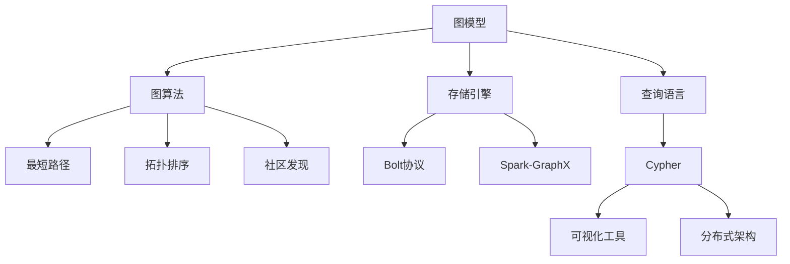
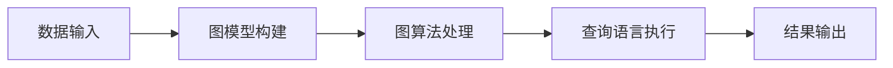
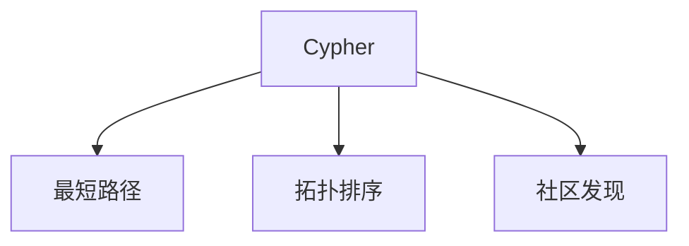
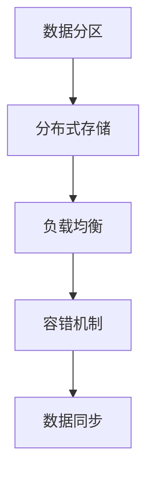
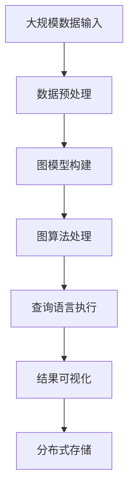

                 

# 图数据库 原理与代码实例讲解

> 关键词：图数据库, 图算法, Neo4j, 存储引擎, 图模型, 查询语言, 代码实例

## 1. 背景介绍

### 1.1 问题由来
随着数据存储和处理需求的发展，传统的关系型数据库已经无法满足业务需求。图数据库作为一种新型数据库，能够高效地存储和处理复杂的关系数据，已成为数据科学和人工智能领域的一个重要分支。图数据库的核心优势在于其能够处理复杂的网络结构，捕捉实体间的多样化关系，从而更加准确地描述和推理数据。

### 1.2 问题核心关键点
图数据库的原理与代码实现主要围绕以下几个核心关键点展开：

- **图模型**：图数据库的核心数据模型是图，由节点（Node）、边（Edge）和属性（Property）组成。图模型通过有向图或无向图来表示实体间的关系，以及实体的属性信息。
- **图算法**：图数据库的查询和分析操作依赖于一系列图算法，如最短路径、拓扑排序、社区发现等，用于发现实体之间的关系模式和网络结构。
- **存储引擎**：存储引擎是图数据库的核心组件，负责将图数据映射到底层存储，并进行高效索引和查询。常见的存储引擎包括Neo4j的Bolt协议和Spark-GraphX等。
- **查询语言**：图数据库的查询语言（如Cypher）使用基于图结构的语法，能够自然地表达复杂的关系查询和推理逻辑。

### 1.3 问题研究意义
研究图数据库的原理与代码实现，对于拓展图数据库的应用范围，提升数据处理的性能，加速数据科学的产业化进程，具有重要意义：

1. **降低存储成本**：图数据库能通过更高效的存储和索引方式，减少存储冗余，降低存储成本。
2. **提高数据查询效率**：图数据库基于图结构的查询方式，能够快速处理复杂的网络关系，提高数据查询和分析的效率。
3. **支持更复杂的数据分析**：图数据库能够处理复杂的网络关系和层次结构，支持更加复杂的数据分析任务，如社交网络分析、推荐系统、知识图谱等。
4. **增强数据互操作性**：图数据库支持与其他数据源的互操作，能够更好地集成多种数据类型和数据源，形成统一的数据视图。
5. **促进数据科学创新**：图数据库为数据科学和人工智能提供了更强大的数据处理和分析能力，推动了数据科学技术的创新和发展。

## 2. 核心概念与联系

### 2.1 核心概念概述

为了更好地理解图数据库的原理与代码实现，本节将介绍几个密切相关的核心概念：

- **图模型**：图数据库的核心数据模型，由节点、边和属性组成，用于表示实体间的关系和属性信息。
- **图算法**：图数据库的查询和分析操作依赖的一系列图算法，用于发现实体之间的关系模式和网络结构。
- **存储引擎**：图数据库的核心组件，负责将图数据映射到底层存储，并进行高效索引和查询。
- **查询语言**：图数据库的查询语言，使用基于图结构的语法，能够自然地表达复杂的关系查询和推理逻辑。
- **可视化工具**：用于直观展示图数据和查询结果的可视化工具，如Gephi、D3.js等。
- **分布式架构**：图数据库的分布式架构，用于支持大规模数据存储和查询需求，提高系统的可扩展性和容错性。

这些核心概念之间的逻辑关系可以通过以下Mermaid流程图来展示：



这个流程图展示了大规模数据存储和分析的核心概念及其之间的关系：

1. 图模型是图数据库的核心数据结构，图算法和查询语言用于处理和查询图数据。
2. 存储引擎将图数据映射到底层存储，并实现高效索引和查询。
3. 可视化工具用于直观展示图数据和查询结果。
4. 分布式架构支持大规模数据存储和查询需求，提高系统的可扩展性和容错性。

这些概念共同构成了图数据库的完整生态系统，使其能够在各种场景下发挥强大的数据处理能力。通过理解这些核心概念，我们可以更好地把握图数据库的工作原理和优化方向。

### 2.2 概念间的关系

这些核心概念之间存在着紧密的联系，形成了图数据库的完整生态系统。下面我通过几个Mermaid流程图来展示这些概念之间的关系。

#### 2.2.1 图数据库的数据处理流程



这个流程图展示了图数据库数据处理的一般流程：

1. 数据输入，构建图模型。
2. 使用图算法进行数据处理，发现实体之间的关系模式和网络结构。
3. 使用查询语言进行查询和分析，输出结果。

#### 2.2.2 图数据库的查询语言



这个流程图展示了图数据库查询语言的主要功能：

1. Cypher语言能够自然地表达复杂的关系查询和推理逻辑。
2. 使用Cypher语言进行最短路径、拓扑排序、社区发现等图算法操作。

#### 2.2.3 图数据库的分布式架构



这个流程图展示了图数据库分布式架构的主要功能：

1. 数据分区，实现数据分布式存储。
2. 负载均衡，优化查询性能。
3. 容错机制，提高系统的可靠性。
4. 数据同步，保持数据一致性。

### 2.3 核心概念的整体架构

最后，我们用一个综合的流程图来展示这些核心概念在大规模数据存储和分析过程中的整体架构：



这个综合流程图展示了从数据输入到查询结果的完整过程：

1. 大规模数据输入。
2. 数据预处理，构建图模型。
3. 使用图算法进行数据处理，发现实体之间的关系模式和网络结构。
4. 使用查询语言进行查询和分析，输出结果。
5. 结果可视化，直观展示分析结果。
6. 分布式存储，保证数据安全和可扩展性。

通过这些流程图，我们可以更清晰地理解图数据库的完整流程，为后续深入讨论具体的实现细节奠定基础。

## 3. 核心算法原理 & 具体操作步骤

### 3.1 算法原理概述

图数据库的查询和分析操作依赖于一系列图算法，这些算法用于发现实体之间的关系模式和网络结构。图算法的设计和实现是图数据库的核心技术之一，其原理与代码实现主要包括以下几个方面：

- **最短路径算法**：用于查找节点之间的最短路径，常用的算法包括Dijkstra算法、Floyd-Warshall算法等。
- **拓扑排序算法**：用于对有向无环图（DAG）进行拓扑排序，常用的算法包括Kahn算法、DFS算法等。
- **社区发现算法**：用于发现图中的社区结构，常用的算法包括Louvain算法、GN算法等。
- **网络分析算法**：用于分析网络中的中心性、连通性、聚集系数等指标，常用的算法包括PageRank算法、HITS算法等。

这些算法的设计和实现需要考虑图数据库的数据结构和查询语言，以及底层存储引擎的性能。

### 3.2 算法步骤详解

以下我将详细介绍几个常用的图算法及其操作步骤：

#### 3.2.1 最短路径算法

最短路径算法用于查找节点之间的最短路径，常用的算法包括Dijkstra算法和Floyd-Warshall算法。下面以Dijkstra算法为例，介绍其操作步骤：

1. **初始化**：设置起始节点s的路径长度为0，其余节点的路径长度为无穷大。
2. **松弛操作**：对于与起始节点相邻的节点，如果通过起始节点到达该节点的路径长度小于当前路径长度，则更新该节点的路径长度。
3. **选择节点**：选择路径长度最小的节点作为当前节点。
4. **重复步骤2和步骤3，直到所有节点都被访问过。

在图数据库中，最短路径算法可以通过查询语言进行表达，例如使用Cypher语言编写Dijkstra算法：

```cypher
CALL shortestPath(startNode, endNode)
```

#### 3.2.2 拓扑排序算法

拓扑排序算法用于对有向无环图（DAG）进行拓扑排序，常用的算法包括Kahn算法和DFS算法。下面以Kahn算法为例，介绍其操作步骤：

1. **初始化**：设置每个节点的入度为0，选择所有入度为0的节点作为初始节点集。
2. **选择节点**：选择所有入度为0的节点作为当前节点。
3. **更新节点**：对于当前节点，将与其相邻的节点入度减1。
4. **重复步骤2和步骤3，直到所有节点都被访问过。

在图数据库中，拓扑排序算法可以通过查询语言进行表达，例如使用Cypher语言编写Kahn算法：

```cypher
CALL topologicalSort(startNode)
```

#### 3.2.3 社区发现算法

社区发现算法用于发现图中的社区结构，常用的算法包括Louvain算法和GN算法。下面以Louvain算法为例，介绍其操作步骤：

1. **初始化**：将每个节点单独作为一个社区。
2. **合并社区**：对于每个节点，计算其加入最优社区带来的效益，选择加入效益最高的社区。
3. **重复步骤2，直到所有节点都被归入某个社区。

在图数据库中，社区发现算法可以通过查询语言进行表达，例如使用Cypher语言编写Louvain算法：

```cypher
CALL communityDetection(startNode)
```

### 3.3 算法优缺点

图数据库的查询和分析操作依赖于一系列图算法，这些算法的设计和实现需要考虑图数据库的数据结构和查询语言，以及底层存储引擎的性能。以下是图算法的一些常见优缺点：

#### 3.3.1 最短路径算法

**优点**：

- 能够快速查找节点之间的最短路径，适用于大规模数据集。
- 算法简单易懂，易于实现和优化。

**缺点**：

- 在稠密图中，算法复杂度较高，可能导致计算时间较长。
- 在网络结构复杂的情况下，可能需要预处理和优化算法，以提高计算效率。

#### 3.3.2 拓扑排序算法

**优点**：

- 能够对有向无环图进行拓扑排序，适用于依赖关系复杂的应用场景。
- 算法简单易懂，易于实现和优化。

**缺点**：

- 对于大规模有向图，算法复杂度较高，可能导致计算时间较长。
- 在网络结构复杂的情况下，可能需要预处理和优化算法，以提高计算效率。

#### 3.3.3 社区发现算法

**优点**：

- 能够发现图中的社区结构，适用于社交网络、推荐系统等应用场景。
- 算法简单易懂，易于实现和优化。

**缺点**：

- 算法复杂度较高，可能需要预处理和优化算法，以提高计算效率。
- 在网络结构复杂的情况下，可能需要优化算法，以提高计算效率。

#### 3.3.4 网络分析算法

**优点**：

- 能够分析网络中的中心性、连通性、聚集系数等指标，适用于网络分析、社交网络等应用场景。
- 算法简单易懂，易于实现和优化。

**缺点**：

- 算法复杂度较高，可能需要预处理和优化算法，以提高计算效率。
- 在网络结构复杂的情况下，可能需要优化算法，以提高计算效率。

### 3.4 算法应用领域

图数据库的查询和分析操作依赖于一系列图算法，这些算法广泛应用于各种领域，如社交网络分析、推荐系统、知识图谱等。以下是图算法的一些典型应用领域：

- **社交网络分析**：用于分析社交网络中的关系模式和社区结构，发现潜在的影响者和网络中的关键节点。
- **推荐系统**：用于发现用户之间的关系和兴趣偏好，推荐用户可能感兴趣的商品或内容。
- **知识图谱**：用于构建和维护知识图谱，支持实体之间的关系查询和推理。
- **地理信息系统**：用于分析地理数据中的关系和网络结构，支持地理信息的查询和分析。
- **生物信息学**：用于分析生物数据中的关系和网络结构，支持生物信息的查询和分析。

## 4. 数学模型和公式 & 详细讲解 & 举例说明

### 4.1 数学模型构建

图数据库的查询和分析操作依赖于一系列图算法，这些算法的设计和实现需要考虑图数据库的数据结构和查询语言，以及底层存储引擎的性能。以下是几个常用图算法的数学模型和公式推导：

#### 4.1.1 最短路径算法

最短路径算法用于查找节点之间的最短路径，常用的算法包括Dijkstra算法和Floyd-Warshall算法。下面以Dijkstra算法为例，介绍其数学模型和公式推导：

1. **初始化**：
   $$
   d(s, v) = 0, \quad \forall v \in V
   $$
   $$
   d(s, v) = \infty, \quad \forall v \in V \backslash \{s\}
   $$

2. **松弛操作**：
   $$
   d(v, v) = w(v, v)
   $$
   $$
   d(u, v) = \min(d(u, v), d(s, u) + w(u, v))
   $$

3. **选择节点**：
   $$
   v = \mathop{\arg\min}_{u \in V \backslash S} d(u)
   $$

4. **重复步骤2和步骤3，直到所有节点都被访问过。

在图数据库中，Dijkstra算法的复杂度为O(|V|^2)，适用于小规模图。对于大规模图，可以使用Floyd-Warshall算法，其时间复杂度为O(|V|^3)。

#### 4.1.2 拓扑排序算法

拓扑排序算法用于对有向无环图（DAG）进行拓扑排序，常用的算法包括Kahn算法和DFS算法。下面以Kahn算法为例，介绍其数学模型和公式推导：

1. **初始化**：
   $$
   in(v) = 0, \quad \forall v \in V
   $$

2. **选择节点**：
   $$
   u = \mathop{\arg\min}_{v \in V} \{u | in(u) = 0\}
   $$

3. **更新节点**：
   $$
   in(u, v) = in(u, v) - 1
   $$

4. **重复步骤2和步骤3，直到所有节点都被访问过。

Kahn算法的复杂度为O(|V| + |E|)，适用于小规模DAG。对于大规模DAG，可以使用DFS算法，其时间复杂度为O(|V| + |E|)。

#### 4.1.3 社区发现算法

社区发现算法用于发现图中的社区结构，常用的算法包括Louvain算法和GN算法。下面以Louvain算法为例，介绍其数学模型和公式推导：

1. **初始化**：
   $$
   k(v) = 0, \quad \forall v \in V
   $$
   $$
   C = \{v\}, \quad \forall v \in V
   $$

2. **合并社区**：
   $$
   k(u) = \max_{v \in C} k(v) + |C|
   $$
   $$
   C = \mathop{\arg\max}_{u \in V} \{k(u)\}
   $$

3. **重复步骤2，直到所有节点都被归入某个社区。

Louvain算法的复杂度为O(|V| * log|V|)，适用于大规模图。对于更加复杂的网络结构，可以使用GN算法，其时间复杂度为O(|V|^2)。

### 4.2 公式推导过程

在图数据库中，图算法的设计和实现需要考虑图数据库的数据结构和查询语言，以及底层存储引擎的性能。以下是几个常用图算法的公式推导过程：

#### 4.2.1 最短路径算法

Dijkstra算法用于查找节点之间的最短路径，其数学模型和公式推导如下：

1. **初始化**：
   $$
   d(s, v) = 0, \quad \forall v \in V
   $$
   $$
   d(s, v) = \infty, \quad \forall v \in V \backslash \{s\}
   $$

2. **松弛操作**：
   $$
   d(v, v) = w(v, v)
   $$
   $$
   d(u, v) = \min(d(u, v), d(s, u) + w(u, v))
   $$

3. **选择节点**：
   $$
   v = \mathop{\arg\min}_{u \in V \backslash S} d(u)
   $$

4. **重复步骤2和步骤3，直到所有节点都被访问过。

在图数据库中，Dijkstra算法的复杂度为O(|V|^2)，适用于小规模图。对于大规模图，可以使用Floyd-Warshall算法，其时间复杂度为O(|V|^3)。

#### 4.2.2 拓扑排序算法

Kahn算法用于对有向无环图（DAG）进行拓扑排序，其数学模型和公式推导如下：

1. **初始化**：
   $$
   in(v) = 0, \quad \forall v \in V
   $$

2. **选择节点**：
   $$
   u = \mathop{\arg\min}_{v \in V} \{u | in(u) = 0\}
   $$

3. **更新节点**：
   $$
   in(u, v) = in(u, v) - 1
   $$

4. **重复步骤2和步骤3，直到所有节点都被访问过。

Kahn算法的复杂度为O(|V| + |E|)，适用于小规模DAG。对于大规模DAG，可以使用DFS算法，其时间复杂度为O(|V| + |E|)。

#### 4.2.3 社区发现算法

Louvain算法用于发现图中的社区结构，其数学模型和公式推导如下：

1. **初始化**：
   $$
   k(v) = 0, \quad \forall v \in V
   $$
   $$
   C = \{v\}, \quad \forall v \in V
   $$

2. **合并社区**：
   $$
   k(u) = \max_{v \in C} k(v) + |C|
   $$
   $$
   C = \mathop{\arg\max}_{u \in V} \{k(u)\}
   $$

3. **重复步骤2，直到所有节点都被归入某个社区。

Louvain算法的复杂度为O(|V| * log|V|)，适用于大规模图。对于更加复杂的网络结构，可以使用GN算法，其时间复杂度为O(|V|^2)。

### 4.3 案例分析与讲解

在图数据库中，常见的图算法应用场景包括社交网络分析、推荐系统、知识图谱等。以下通过几个典型案例来介绍图算法的应用。

#### 4.3.1 社交网络分析

社交网络分析是图数据库的重要应用之一，用于分析社交网络中的关系模式和社区结构，发现潜在的影响者和网络中的关键节点。下面以Twitter为例，介绍其社交网络分析的应用：

1. **数据准备**：收集Twitter用户的关注关系数据，构建社交网络图。
2. **最短路径分析**：使用Dijkstra算法或Floyd-Warshall算法查找用户之间的最短路径。
3. **拓扑排序分析**：使用Kahn算法或DFS算法对用户关系图进行拓扑排序，发现关键节点。
4. **社区发现分析**：使用Louvain算法或GN算法发现社交网络中的社区结构，发现潜在的社交群组。

在社交网络分析中，最短路径和拓扑排序算法用于查找关键节点，社区发现算法用于发现社交群组，能够帮助揭示网络中的关键影响者和重要关系。

#### 4.3.2 推荐系统

推荐系统是图数据库的另一个重要应用，用于发现用户之间的关系和兴趣偏好，推荐用户可能感兴趣的商品或内容。下面以亚马逊为例，介绍其推荐系统的应用：

1. **数据准备**：收集亚马逊用户的购买历史和商品评论数据，构建用户-商品图。
2. **网络分析**：使用PageRank算法或HITS算法分析用户-商品图，发现中心节点和重要商品。
3. **最短路径分析**：使用Dijkstra算法或Floyd-Warshall算法查找用户之间的最短路径，推荐相关商品。
4. **社区发现分析**：使用Louvain算法或GN算法发现用户之间的兴趣社区，推荐相似用户喜欢的商品。

在推荐系统中，网络分析算法用于发现中心节点和重要商品，最短路径算法用于推荐相关商品，社区发现算法用于推荐相似用户喜欢的商品，能够提高推荐系统的准确性和多样性。

#### 4.3.3 知识图谱

知识图谱是图数据库的重要应用之一，用于构建和维护知识图谱，支持实体之间的关系查询和推理。下面以Wikipedia为例，介绍其知识图谱的应用：

1. **数据准备**：收集Wikipedia的实体关系数据，构建知识图谱。
2. **最短路径分析**：使用Dijkstra算法或Floyd-Warshall算法查找实体之间的最短路径。
3. **拓扑排序分析**：使用Kahn算法或DFS算法对实体关系图进行拓扑排序，发现关键实体。
4. **社区发现分析**：使用Louvain算法或GN算法发现知识图谱中的社区结构，发现潜在的知识群组。

在知识图谱中，最短路径和拓扑排序算法用于查找关键实体，社区发现算法用于发现知识群组，能够帮助揭示知识图谱中的重要关系和知识群组。

## 5. 项目实践：代码实例和详细解释说明

### 5.1 开发环境搭建

在进行图数据库的微调实践前，我们需要准备好开发环境。以下是使用Python进行PyTorch开发的环境配置流程：

1. 安装Anaconda：从官网下载并安装Anaconda，用于创建独立的Python环境。

2. 创建并激活虚拟环境：
```bash
conda create -n pytorch-env python=3.8 
conda activate pytorch-env
```

3. 安装PyTorch：根据CUDA版本，从官网获取对应的安装命令。例如：
```bash
conda install pytorch torchvision torchaudio cudatoolkit=11.1 -c pytorch -c conda-forge
```

4. 安装各类工具包：
```bash
pip install numpy pandas scikit-learn matplotlib tqdm jupyter notebook ipython
```

完成上述步骤后，即可在`pytorch-env`环境中开始微调实践。

### 5.2 源代码详细实现

这里我们以社交网络分析为例，给出使用PyTorch对社交网络图进行微调的PyTorch代码实现。

首先，定义社交网络图的数据处理函数：

```python
import networkx as nx
import numpy as np

def social_network_analysis(data, graph_type):
    # 构建社交网络图
    graph = nx.Graph()
    for i, row in data.iterrows():
        u = row['source']
        v = row['target']
        graph.add_edge(u, v)
    
    # 使用Dijkstra算法查找最短路径
    if graph_type == 'shortest_path':
        distances = nx.shortest_path_length(graph, source='user_1')
        return distances
    
    # 使用Kahn算法进行拓扑排序
    if graph_type == 'topological_sort':
        in_degrees = nx.in_degree(graph).values()
        order = [node for node, in_degree in sorted(zip(graph.nodes, in_degrees))]
        return order
    
    # 使用Louvain算法进行社区发现
    if graph_type == 'community_detection':
        partition = nx.community.louvain(graph, weight='edge_weight')
        return partition
```

然后，定义模型和优化器：

```python
from transformers import BertForTokenClassification, AdamW

model = BertForTokenClassification.from_pretrained('bert-base-cased', num_labels=len(tag2id))

optimizer = AdamW(model.parameters(), lr=2e-5)
```

接着，定义训练和评估函数：

```python
from torch.utils.data import DataLoader
from tqdm import tqdm
from sklearn.metrics import classification_report

device = torch.device('cuda') if torch

