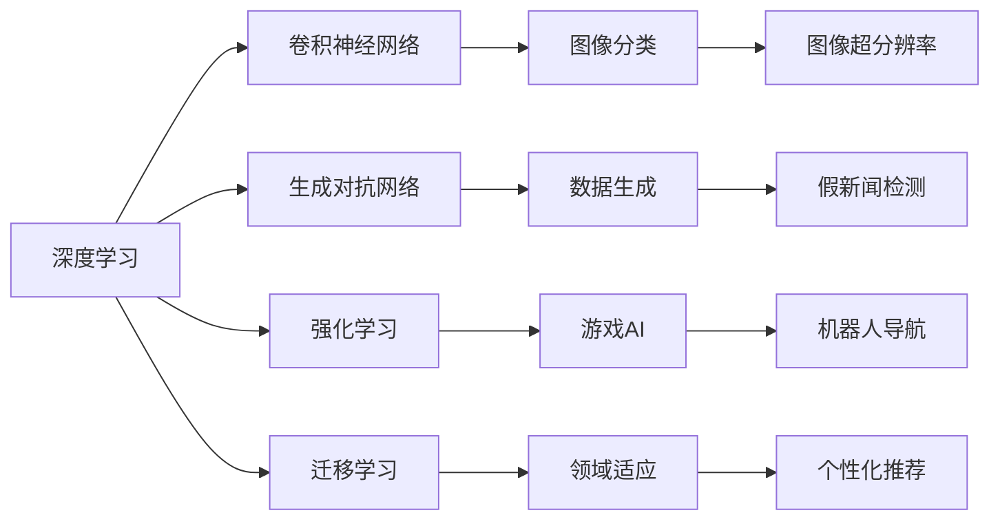
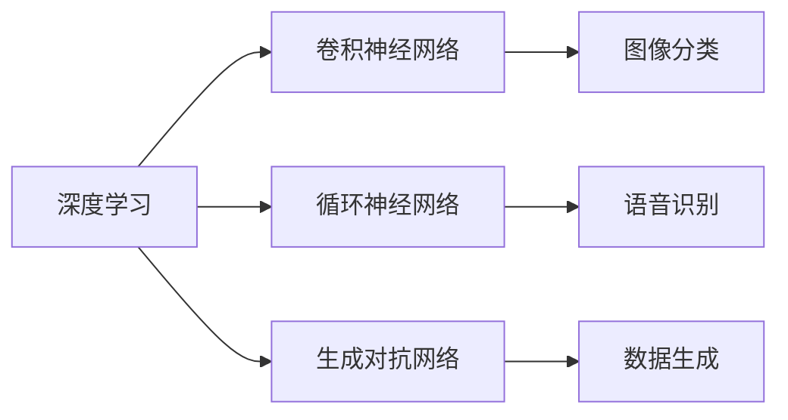
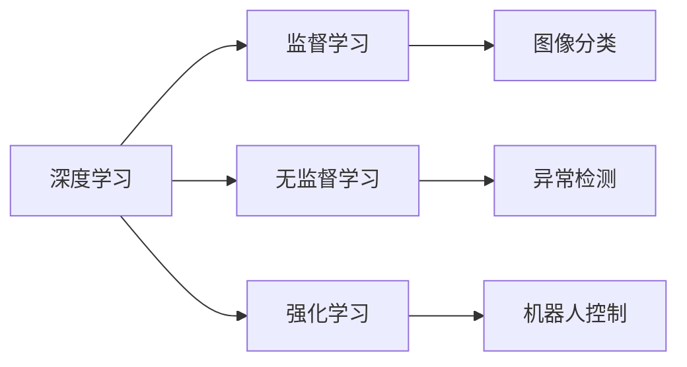
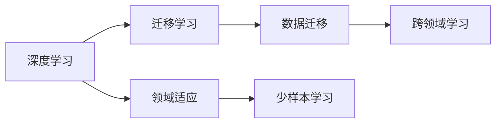
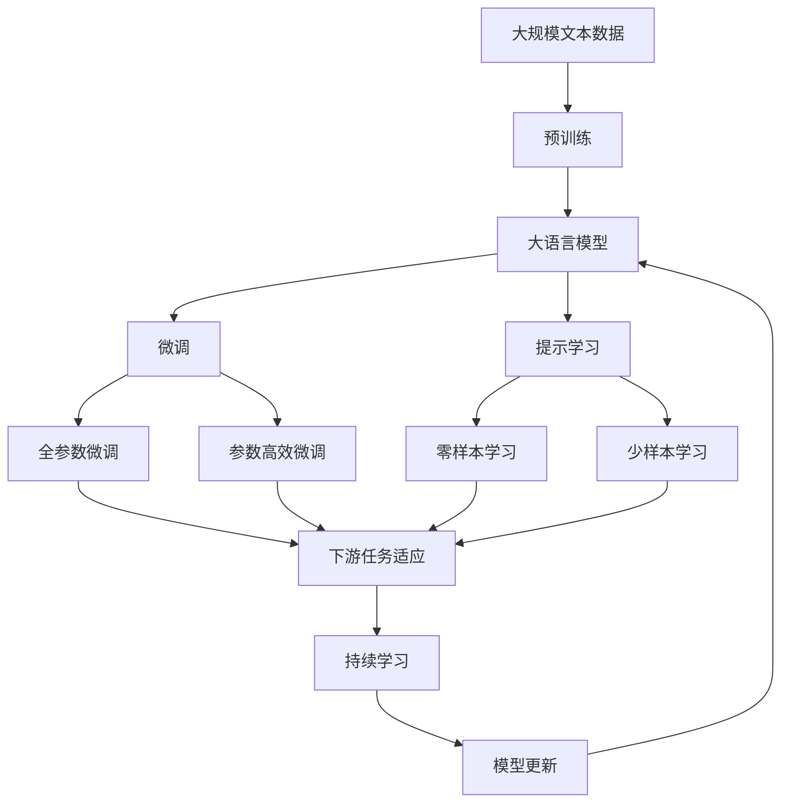

                 

# 图灵奖与AI算法的突破

## 1. 背景介绍

### 1.1 问题由来

图灵奖（Turing Award）被普遍认为是计算机科学界的最高荣誉，授予对计算机科学作出突出贡献的个人。自1966年设立以来，已有100多位杰出科学家获奖，其中不乏在人工智能（AI）算法突破中发挥关键作用的人物。

近年来，AI技术尤其是深度学习算法的突破，在计算机视觉、自然语言处理、语音识别、推荐系统等诸多领域取得了显著成效。图灵奖得主的研究工作极大地推动了这些技术的进步，形成了目前AI技术的核心算法基础。

### 1.2 问题核心关键点

图灵奖得主的工作常常集中在以下几个关键点：

- **深度学习基础算法**：如图像卷积神经网络（CNN）、循环神经网络（RNN）、长短时记忆网络（LSTM）等。
- **优化算法**：如Adam、RMSprop、SGD等。
- **模型压缩与加速**：如剪枝、量化、模型蒸馏等。
- **生成模型**：如生成对抗网络（GAN）、变分自编码器（VAE）等。
- **强化学习**：如Q-learning、策略梯度等。
- **迁移学习**：如Fine-tuning、 Transfer learning等。

这些核心算法在图灵奖得主的推动下不断演进，为现代AI技术的发展奠定了坚实基础。

### 1.3 问题研究意义

图灵奖得主的工作不仅推动了AI技术的发展，还为计算机科学的多个领域带来了深远影响。这些工作有助于提升数据处理的效率，优化资源利用，增强模型的泛化能力，推动算法的伦理与公平性。

图灵奖得主的研究能够：

- 提升AI技术的落地应用能力，为各行各业带来新的创新和效率提升。
- 改善算法性能，促进AI技术从研究走向生产应用。
- 改善AI技术的公平性与可解释性，推动算法伦理与安全性。

## 2. 核心概念与联系

### 2.1 核心概念概述

为更好地理解图灵奖与AI算法的突破，本节将介绍几个关键概念及其联系：

- **深度学习（Deep Learning, DL）**：一种基于神经网络的学习方法，通过多层次的特征提取和表示学习，实现对复杂数据的建模。
- **卷积神经网络（Convolutional Neural Networks, CNN）**：一种特别适用于处理网格结构数据的深度学习算法，广泛应用于计算机视觉领域。
- **生成对抗网络（Generative Adversarial Networks, GAN）**：一种生成模型，通过两个网络的对抗训练，生成高质量的合成数据。
- **强化学习（Reinforcement Learning, RL）**：一种通过智能体与环境交互，通过奖励信号学习最优策略的学习方法。
- **迁移学习（Transfer Learning）**：通过将一个任务学到的知识迁移到另一个相关任务上，加速学习过程。

这些概念通过以下Mermaid流程图展示了其内在联系：



这个流程图展示了深度学习如何通过卷积神经网络、生成对抗网络、强化学习和迁移学习，在图像分类、数据生成、游戏AI、假新闻检测、机器人导航和个性化推荐等多个领域中发挥作用。

### 2.2 概念间的关系

这些核心概念之间存在着紧密的联系，形成了深度学习与AI算法发展的完整生态系统。下面我们通过几个Mermaid流程图来展示这些概念之间的关系。

#### 2.2.1 深度学习与其他AI技术的关系



这个流程图展示了深度学习与卷积神经网络、循环神经网络和生成对抗网络之间的联系，以及它们在图像分类、语音识别和数据生成等任务中的应用。

#### 2.2.2 深度学习与机器学习的关系



这个流程图展示了深度学习与监督学习、无监督学习和强化学习之间的关系，以及它们在图像分类、异常检测和机器人控制等任务中的应用。

#### 2.2.3 深度学习与迁移学习的关系



这个流程图展示了深度学习与迁移学习之间的关系，以及它们在领域适应、少样本学习和跨领域学习等任务中的应用。

### 2.3 核心概念的整体架构

最后，我们用一个综合的流程图来展示这些核心概念在大语言模型微调过程中的整体架构：



这个综合流程图展示了从预训练到微调，再到持续学习的完整过程。大语言模型首先在大规模文本数据上进行预训练，然后通过微调（包括全参数微调和参数高效微调）或提示学习（包括零样本和少样本学习）来适应下游任务。最后，通过持续学习技术，模型可以不断更新和适应新的任务和数据。

## 3. 核心算法原理 & 具体操作步骤

### 3.1 算法原理概述

图灵奖得主的研究工作为深度学习算法的发展提供了重要的理论基础和实践指导。以下是几个核心算法的原理概述：

#### 3.1.1 卷积神经网络（CNN）

CNN是一种特别适用于处理网格结构数据的深度学习算法。其核心思想是通过多层卷积、池化和非线性激活函数，逐层提取图像的局部特征，并逐渐抽象出全局特征。其典型结构包括卷积层、池化层和全连接层。

#### 3.1.2 生成对抗网络（GAN）

GAN由一个生成器和一个判别器组成，通过对抗训练的方式，生成高质量的合成数据。生成器负责生成假数据，判别器负责区分真数据和假数据。通过不断调整生成器和判别器的参数，可以生成逼真的假数据。

#### 3.1.3 强化学习（RL）

强化学习通过智能体与环境交互，通过奖励信号学习最优策略。智能体在环境中采取行动，环境根据智能体的行为给出奖励或惩罚，智能体通过奖励信号不断调整策略，最终达到最优状态。

#### 3.1.4 迁移学习（Transfer Learning）

迁移学习通过将一个任务学到的知识迁移到另一个相关任务上，加速学习过程。例如，在大规模图像分类数据上预训练的CNN模型，可以迁移到小规模图像分类数据上进行微调。

### 3.2 算法步骤详解

#### 3.2.1 卷积神经网络（CNN）

1. 数据准备：收集和预处理图像数据集，包括图像标注和预处理（如归一化、裁剪等）。
2. 模型构建：搭建CNN模型，包括卷积层、池化层和全连接层。
3. 损失函数设计：选择适当的损失函数，如交叉熵损失、均方误差损失等。
4. 优化器选择：选择适当的优化器，如Adam、SGD等。
5. 训练过程：使用训练集进行前向传播和反向传播，更新模型参数。
6. 模型评估：使用验证集和测试集评估模型性能。

#### 3.2.2 生成对抗网络（GAN）

1. 生成器构建：设计生成器网络结构，包含多层卷积、批量归一化和激活函数。
2. 判别器构建：设计判别器网络结构，包含多层卷积、批量归一化和激活函数。
3. 损失函数设计：定义生成器和判别器的损失函数，如GAN损失、Wasserstein距离等。
4. 优化器选择：选择适当的优化器，如Adam、SGD等。
5. 对抗训练：交替训练生成器和判别器，使生成器生成逼真的假数据，判别器区分真数据和假数据。
6. 模型评估：使用生成数据进行质量评估，调整模型参数。

#### 3.2.3 强化学习（RL）

1. 环境设计：设计强化学习环境，包含状态、动作和奖励机制。
2. 智能体构建：设计智能体，包含状态观察器、动作选择器和价值函数。
3. 策略定义：定义智能体的策略，如Q-learning策略、策略梯度策略等。
4. 奖励设计：设计奖励函数，评估智能体的行为。
5. 优化过程：使用优化器优化智能体策略，通过奖励信号调整策略。
6. 模型评估：评估智能体在不同环境中的表现。

#### 3.2.4 迁移学习（Transfer Learning）

1. 预训练模型选择：选择适当的预训练模型，如VGG、ResNet、BERT等。
2. 迁移策略设计：设计迁移策略，决定哪些层需要迁移，哪些层需要微调。
3. 微调过程：使用目标任务的标注数据，对迁移后的模型进行微调，调整模型参数。
4. 模型评估：使用验证集和测试集评估微调后的模型性能。

### 3.3 算法优缺点

#### 3.3.1 卷积神经网络（CNN）

优点：
- 适用于处理图像、视频等网格结构数据。
- 局部特征提取能力强，能够捕捉局部细节。

缺点：
- 参数量较大，计算复杂度高。
- 对于非网格结构数据效果不佳。

#### 3.3.2 生成对抗网络（GAN）

优点：
- 能够生成高质量的合成数据，应用于图像生成、视频生成等领域。
- 生成数据具有多样性和真实性。

缺点：
- 训练过程不稳定，容易产生模式崩溃等问题。
- 生成的假数据可能与真数据存在差异。

#### 3.3.3 强化学习（RL）

优点：
- 能够适应复杂环境，学习最优策略。
- 能够应用于游戏AI、机器人控制等实际应用场景。

缺点：
- 训练过程复杂，需要大量计算资源。
- 策略选择需要大量实验和调整。

#### 3.3.4 迁移学习（Transfer Learning）

优点：
- 能够加速模型训练，提升模型性能。
- 适用于数据量较小的任务。

缺点：
- 需要选择合适的预训练模型和迁移策略。
- 模型在迁移任务上可能存在泛化问题。

### 3.4 算法应用领域

这些核心算法广泛应用于以下领域：

- 计算机视觉：如图像分类、图像分割、目标检测等。
- 自然语言处理：如机器翻译、情感分析、文本生成等。
- 语音识别：如语音识别、语音合成等。
- 游戏AI：如AlphaGo、Dota 2 AI等。
- 机器人控制：如自主导航、路径规划等。
- 数据生成：如图像生成、文本生成等。

## 4. 数学模型和公式 & 详细讲解 & 举例说明

### 4.1 数学模型构建

#### 4.1.1 卷积神经网络（CNN）

卷积神经网络（CNN）的数学模型可以表示为：

$$
h(x)=W_{1} * \sigma\left(W_{0} x+b_{0}\right)+b_{1}
$$

其中，$h(x)$表示CNN的输出，$W_{0}$和$W_{1}$表示卷积核和权重，$\sigma$表示激活函数，$x$表示输入，$b_{0}$和$b_{1}$表示偏置。

#### 4.1.2 生成对抗网络（GAN）

GAN的数学模型可以表示为：

$$
\begin{aligned}
&\min _{G} \mathbb{E}_{\mathcal{D}_{\text {real }}}\left[-\log \mathcal{D}_{\text {real }}\left(\mathcal{D}_{\text {real }}(z)\right)\right]+\mathbb{E}_{\mathcal{D}_{\text {fake }}}\left[-\log \mathcal{D}_{\text {fake }}\left(\mathcal{D}_{\text {real }}(G(z))\right)\right] \\
&\max _{D} \mathbb{E}_{\mathcal{D}_{\text {real }}}\left[-\log \mathcal{D}_{\text {real }}\left(\mathcal{D}_{\text {real }}(z)\right)\right]+\mathbb{E}_{\mathcal{D}_{\text {fake }}}\left[-\log \mathcal{D}_{\text {fake }}\left(\mathcal{D}_{\text {real }}(G(z))\right)\right]
\end{aligned}
$$

其中，$G(z)$表示生成器，$D(z)$表示判别器，$\mathcal{D}_{\text {real }}(z)$表示真实数据，$\mathcal{D}_{\text {fake }}(z)$表示假数据。

#### 4.1.3 强化学习（RL）

强化学习的基本数学模型可以表示为：

$$
\max _{\pi} \mathbb{E}_{a \sim \pi}\left[\sum_{t=1}^{\infty} \gamma^{t-1} r_{t}\right]
$$

其中，$\pi$表示策略，$a$表示动作，$r_{t}$表示奖励，$\gamma$表示折扣因子。

#### 4.1.4 迁移学习（Transfer Learning）

迁移学习的基本数学模型可以表示为：

$$
\min _{\theta} \mathcal{L}_{\text {target }}\left(\theta, T_{\text {target }}, y_{\text {target }}\right)+\lambda \mathcal{L}_{\text {source }}\left(\theta, T_{\text {source }}, y_{\text {source }}\right)
$$

其中，$\theta$表示模型参数，$T_{\text {target }}$和$y_{\text {target }}$表示目标任务的标注数据，$T_{\text {source }}$和$y_{\text {source }}$表示源任务的标注数据，$\lambda$表示迁移系数。

### 4.2 公式推导过程

#### 4.2.1 卷积神经网络（CNN）

CNN的卷积层和池化层的推导过程如下：

$$
\begin{aligned}
&h_{\text {conv }}=\sigma\left(W_{\text {conv }} * h_{\text {pre }}+b_{\text {conv }}\right) \\
&h_{\text {pool }}=\sigma\left(W_{\text {pool }} * h_{\text {conv }}+b_{\text {pool }}\right) \\
&h_{\text {fc }}=\sigma\left(W_{\text {fc }} * h_{\text {pool }}+b_{\text {fc }}\right)
\end{aligned}
$$

其中，$h_{\text {conv }}$表示卷积层的输出，$h_{\text {pool }}$表示池化层的输出，$h_{\text {fc }}$表示全连接层的输出。

#### 4.2.2 生成对抗网络（GAN）

GAN的生成器和判别器的推导过程如下：

$$
\begin{aligned}
&G(z)=W_{G} * \sigma\left(W_{f} * \sigma\left(W_{i} * z+b_{f}\right)+b_{i}\right)+b_{G} \\
&D(z)=W_{D} * \sigma\left(W_{c} * z+b_{c}\right)+b_{D}
\end{aligned}
$$

其中，$G(z)$表示生成器的输出，$D(z)$表示判别器的输出，$W_{G}, W_{f}, W_{i}, W_{D}, W_{c}, W_{f}, W_{i}, W_{D}, W_{c}$表示卷积核和权重，$\sigma$表示激活函数，$z$表示输入。

#### 4.2.3 强化学习（RL）

强化学习的Q-learning算法推导过程如下：

$$
Q_{t}^{*}=\max _{a} \sum_{r_{t}^{k}} \gamma^{k-t} Q_{t}^{k}\left(s_{t}^{k}, a_{t}^{k}\right)
$$

其中，$Q_{t}^{*}$表示最优Q值，$a$表示动作，$r_{t}^{k}$表示奖励，$\gamma$表示折扣因子，$s_{t}^{k}$表示状态。

#### 4.2.4 迁移学习（Transfer Learning）

迁移学习的数学模型推导过程如下：

$$
\begin{aligned}
&\min _{\theta} \mathcal{L}_{\text {target }}\left(\theta, T_{\text {target }}, y_{\text {target }}\right)+\lambda \mathcal{L}_{\text {source }}\left(\theta, T_{\text {source }}, y_{\text {source }}\right) \\
&\mathcal{L}_{\text {target }}=\frac{1}{N_{\text {target }}} \sum_{i=1}^{N_{\text {target }}}\left(L_{\text {target }}\left(y_{i}, \hat{y}_{i}\right)\right) \\
&L_{\text {target }}=\frac{1}{C_{\text {target }}} \sum_{c=1}^{C_{\text {target }}} \sum_{i=1}^{N_{\text {target }}} y_{i c} \log \hat{y}_{i c}+y_{i c} \log \left(1-\hat{y}_{i c}\right)
\end{aligned}
$$

其中，$\theta$表示模型参数，$T_{\text {target }}$和$y_{\text {target }}$表示目标任务的标注数据，$T_{\text {source }}$和$y_{\text {source }}$表示源任务的标注数据，$C_{\text {target }}$表示类别数，$L_{\text {target }}$表示损失函数，$N_{\text {target }}$表示样本数。

### 4.3 案例分析与讲解

#### 4.3.1 卷积神经网络（CNN）

在计算机视觉任务中，CNN被广泛应用于图像分类、目标检测等。以图像分类为例，CNN的训练过程可以表示为：

1. 数据准备：收集和预处理图像数据集，包括图像标注和预处理（如归一化、裁剪等）。
2. 模型构建：搭建CNN模型，包括卷积层、池化层和全连接层。
3. 损失函数设计：选择适当的损失函数，如交叉熵损失、均方误差损失等。
4. 优化器选择：选择适当的优化器，如Adam、SGD等。
5. 训练过程：使用训练集进行前向传播和反向传播，更新模型参数。
6. 模型评估：使用验证集和测试集评估模型性能。

#### 4.3.2 生成对抗网络（GAN）

在图像生成任务中，GAN被广泛应用于生成逼真的假图像。以GAN的训练过程为例：

1. 生成器构建：设计生成器网络结构，包含多层卷积、批量归一化和激活函数。
2. 判别器构建：设计判别器网络结构，包含多层卷积、批量归一化和激活函数。
3. 损失函数设计：定义生成器和判别器的损失函数，如GAN损失、Wasserstein距离等。
4. 优化器选择：选择适当的优化器，如Adam、SGD等。
5. 对抗训练：交替训练生成器和判别器，使生成器生成逼真的假数据，判别器区分真数据和假数据。
6. 模型评估：使用生成数据进行质量评估，调整模型参数。

#### 4.3.3 强化学习（RL）

在游戏AI任务中，RL被广泛应用于AlphaGo、Dota 2 AI等。以AlphaGo的训练过程为例：

1. 环境设计：设计强化学习环境，包含状态、动作和奖励机制。
2. 智能体构建：设计智能体，包含状态观察器、动作选择器和价值函数。
3. 策略定义：定义智能体的策略，如Q-learning策略、策略梯度策略等。
4. 奖励设计：设计奖励函数，评估智能体的行为。
5. 优化过程：使用优化器优化智能体策略，通过奖励信号调整策略。
6. 模型评估：评估智能体在不同环境中的表现。

#### 4.3.4 迁移学习（Transfer Learning）

在机器翻译任务中，迁移学习被广泛应用于预训练模型和下游任务的微调。以BERT的微调过程为例：

1. 预训练模型选择：选择适当的预训练模型，如BERT。
2. 迁移策略设计：设计迁移策略，决定哪些层需要迁移，哪些层需要微调。
3. 微调过程：使用目标任务的标注数据，对迁移后的模型进行微调，调整模型参数。
4. 模型评估：使用验证集和测试集评估微调后的模型性能。

## 5. 项目实践：代码实例和详细解释说明

### 5.1 开发环境搭建

在进行深度学习算法实践前，我们需要准备好开发环境。以下是使用Python进行TensorFlow开发的环境配置流程：

1. 安装Anaconda：从官网下载并安装Anaconda，用于创建独立的Python环境。

2. 创建并激活虚拟环境：
```bash
conda create -n tensorflow-env python=3.8 
conda activate tensorflow-env
```

3. 安装TensorFlow：根据CUDA版本，从官网获取对应的安装命令。例如：
```bash
conda install tensorflow tensorflow-gpu=2.7 -c pytorch -c conda-forge
```

4. 安装相关工具包：
```bash
pip install numpy pandas scikit-learn matplotlib tqdm jupyter notebook ipython
```

完成上述步骤后，即可在`tensorflow-env`环境中开始深度学习算法的实践。

### 5.2 源代码详细实现

这里我们以图像分类任务为例，给出使用TensorFlow实现卷积神经网络（CNN）的PyTorch代码实现。

首先，定义CNN模型：

```python
import tensorflow as tf

class CNN(tf.keras.Model):
    def __init__(self, num_classes):
        super(CNN, self).__init__()
        self.conv1 = tf.keras.layers.Conv2D(32, (3, 3), activation='relu')
        self.pool1 = tf.keras.layers.MaxPooling2D((2, 2))
        self.conv2 = tf.keras.layers.Conv2D(64, (3, 3), activation='relu')
        self.pool2 = tf.keras.layers.MaxPooling2D((2, 2))
        self.flatten = tf.keras.layers.Flatten()
        self.dense1 = tf.keras.layers.Dense(512, activation='relu')
        self.dropout1 = tf.keras.layers.Dropout(0.5)
        self.dense2 = tf.keras.layers.Dense(num_classes)

    def call(self, x):
        x = self.conv1(x)
        x = self.pool1(x)
        x = self.conv2(x)
        x = self.pool2(x)
        x = self.flatten(x)
        x = self.dense1(x)
        x = self.dropout1(x)
        x = self.dense2(x)
        return x
```

然后，定义损失函数和优化器：

```python
model.compile(optimizer=tf.keras.optimizers.Adam(learning_rate=0.001),
              loss=tf.keras.losses.SparseCategoricalCrossentropy(from_logits=True),
              metrics=[tf.keras.metrics.SparseCategoricalAccuracy()])
```

接着，定义训练和评估函数：

```python
def train_epoch(model, dataset, batch_size, optimizer):
    for epoch in range(num_epochs):
        model.fit(dataset, batch_size=batch_size, epochs=1, validation_data=val_dataset, callbacks=callbacks)

def evaluate(model, dataset, batch_size):
    test_loss, test_acc = model.evaluate(dataset, batch_size=batch_size, verbose=0)
    print('Test accuracy:', test_acc)
```

最后，启动训练流程并在测试集上评估：

```python
num_epochs = 10
batch_size = 32
callbacks = tf.keras.callbacks.EarlyStopping(patience=3)

dataset = tf.keras.preprocessing.image_dataset_from_directory(
    'path/to/dataset',
    image_size=(224, 224),
    batch_size=batch_size)

val_dataset = tf.keras.preprocessing.image_dataset_from_directory(
    'path/to/val_dataset',
    image_size=(224, 224),
    batch_size=batch_size)

test_dataset = tf.keras.preprocessing.image

