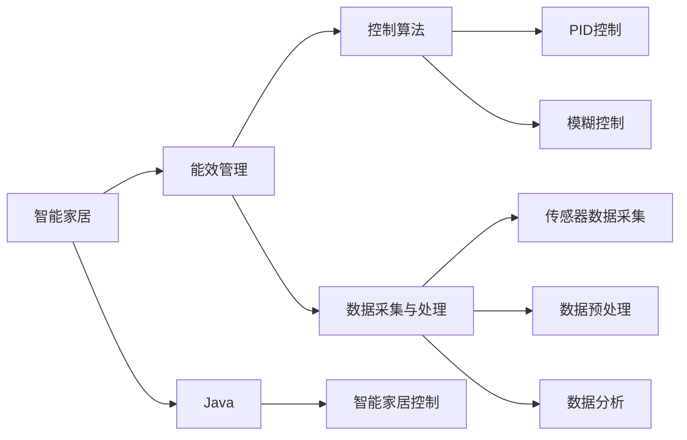
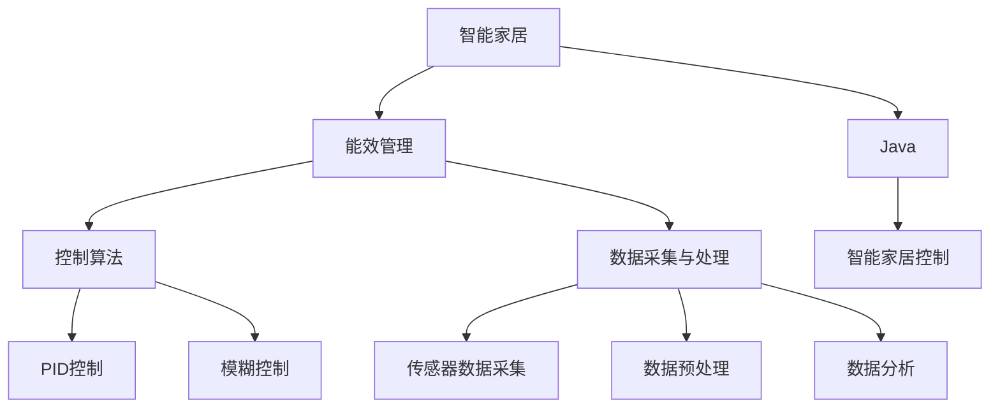

                 

# 基于Java的智能家居设计：Java在智能家居能效管理中的应用探究

## 1. 背景介绍

### 1.1 问题由来

随着科技的飞速发展，智能家居系统逐渐成为了人们关注的焦点。智能化家居旨在通过互联网和先进的控制技术，提高生活的便利性、舒适性和安全性。然而，智能化家居系统在提升生活质量的同时，也带来了能效管理的挑战。能源消耗巨大、控制复杂度高、数据处理量大等问题，使得智能家居系统的能效管理成为了一个重要课题。

Java作为一种面向对象的编程语言，具有跨平台、安全可靠、易于维护等优势，广泛应用于智能家居系统的开发。然而，Java在智能家居能效管理方面的应用相对较少。本文将探讨Java在智能家居能效管理中的应用，以期为开发者提供有益的参考。

### 1.2 问题核心关键点

本文将聚焦于Java在智能家居能效管理中的应用，主要关注以下关键点：

- Java在智能家居能效管理中的应用场景和优势。
- Java在能效管理中面临的挑战和优化策略。
- Java在智能家居能效管理中的实现技术细节和优化方案。

## 2. 核心概念与联系

### 2.1 核心概念概述

为更好地理解Java在智能家居能效管理中的应用，本节将介绍几个关键概念：

- 智能家居：通过互联网和先进的控制技术，实现家庭设备的智能化管理。主要涉及家电控制、照明控制、温湿度控制、安全监控等多个方面。
- 能效管理：通过优化能源消耗、控制设备的运行状态，提升系统的能效水平。
- Java：一种面向对象的编程语言，具有跨平台、安全可靠、易于维护等优势，广泛应用于各类软件开发。
- 控制算法：实现智能家居设备运行的算法，如PID控制、模糊控制等。
- 数据采集与处理：通过传感器采集家庭环境数据，并进行预处理和分析，为能效管理提供依据。

### 2.2 概念间的关系

这些核心概念之间存在紧密的联系，共同构成了智能家居能效管理的整体框架。以下是Mermaid流程图展示了它们之间的关系：



通过这张流程图，我们可以看到，智能家居系统的能效管理包括多个方面，其中Java起着关键作用。具体而言，Java用于开发智能家居系统的核心控制算法，通过传感器采集数据，并结合控制算法，实现对设备的智能控制，从而提升系统的能效水平。

### 2.3 核心概念的整体架构

最后，我们用一个综合的流程图来展示这些核心概念在大语言模型微调过程中的整体架构：



这个综合流程图展示了从智能家居到能效管理，再到控制算法和数据采集与处理的完整过程。通过这些概念，我们能够更好地理解Java在智能家居能效管理中的应用。

## 3. 核心算法原理 & 具体操作步骤

### 3.1 算法原理概述

Java在智能家居能效管理中的应用主要涉及控制算法和数据处理两个方面。控制算法用于实现对设备的智能控制，数据处理用于采集和分析家庭环境数据，为控制算法提供依据。

在控制算法方面，主要涉及PID控制和模糊控制。PID控制是一种广泛应用于工业自动控制中的控制算法，通过比例、积分和微分三个控制环节，实现对设备的精确控制。模糊控制则是一种基于模糊逻辑的控制算法，通过模糊规则和模糊推理，实现对设备的智能控制。

在数据处理方面，主要涉及传感器数据采集、数据预处理和数据分析。传感器数据采集通过各类传感器获取家庭环境数据，数据预处理对采集到的数据进行去噪、归一化等预处理操作，数据分析则对处理后的数据进行分析，为控制算法提供依据。

### 3.2 算法步骤详解

以下是Java在智能家居能效管理中控制算法和数据处理的具体操作步骤：

**控制算法操作：**

1. **数据采集**：通过各类传感器（如温度传感器、湿度传感器、光照传感器等）采集家庭环境数据。
2. **数据预处理**：对采集到的数据进行去噪、归一化等预处理操作，确保数据的准确性和可靠性。
3. **控制决策**：根据预处理后的数据，应用PID控制或模糊控制算法，生成控制信号。
4. **设备控制**：将生成的控制信号发送到家庭设备，实现设备的智能控制。

**数据处理操作：**

1. **数据采集**：通过各类传感器（如温度传感器、湿度传感器、光照传感器等）采集家庭环境数据。
2. **数据预处理**：对采集到的数据进行去噪、归一化等预处理操作，确保数据的准确性和可靠性。
3. **数据分析**：对处理后的数据进行分析，如统计平均温度、分析湿度变化趋势等，为控制算法提供依据。

### 3.3 算法优缺点

Java在智能家居能效管理中具有以下优点：

1. 跨平台：Java支持跨平台开发，适用于各种操作系统和硬件平台。
2. 安全性：Java具有强大的安全机制，可以确保系统的安全性。
3. 易于维护：Java具有面向对象特性，代码易于维护和扩展。

同时，Java在智能家居能效管理中也存在以下缺点：

1. 性能瓶颈：Java的性能较慢，处理大数据时需要额外优化。
2. 内存占用高：Java的虚拟机制导致内存占用较高。
3. 学习曲线较陡：Java的学习曲线较陡，初学者需要一定的时间掌握。

### 3.4 算法应用领域

Java在智能家居能效管理中的应用主要涉及以下几个方面：

1. **家电控制**：通过Java程序实现对家电设备的控制，如开关控制、温度控制等。
2. **照明控制**：通过Java程序实现对家庭照明设备的控制，如灯光亮度调节、自动开关等。
3. **温湿度控制**：通过Java程序实现对家庭温湿度环境的控制，如空调控制、加湿器控制等。
4. **安全监控**：通过Java程序实现对家庭安全设备的监控，如视频监控、门锁控制等。

## 4. 数学模型和公式 & 详细讲解 & 举例说明

### 4.1 数学模型构建

本节将使用数学语言对Java在智能家居能效管理中的应用进行更加严格的刻画。

记智能家居系统为 $S=\{H, E, C\}$，其中 $H$ 表示家庭设备集合，$E$ 表示环境数据集合，$C$ 表示控制算法集合。

设家庭设备 $h_i \in H$ 的当前状态为 $s_i$，环境数据 $e_j \in E$ 的当前状态为 $s_j$，控制算法 $c_k \in C$ 对设备 $h_i$ 的控制指令为 $u_i$。

则智能家居系统的目标函数为：

$$
\min_{s_i, s_j, u_i} \sum_{i \in H} \sum_{j \in E} f(s_i, s_j, u_i)
$$

其中 $f(s_i, s_j, u_i)$ 表示设备 $h_i$ 和环境数据 $e_j$ 的能量消耗，即：

$$
f(s_i, s_j, u_i) = g(s_i, s_j) + h(u_i)
$$

其中 $g(s_i, s_j)$ 表示设备 $h_i$ 的能耗与环境数据 $e_j$ 的关系，$h(u_i)$ 表示控制指令 $u_i$ 的能耗。

### 4.2 公式推导过程

以下是Java在智能家居能效管理中PID控制的具体公式推导过程。

设家庭设备 $h_i$ 的目标状态为 $s_i^*$，当前状态为 $s_i$，控制指令为 $u_i$，则PID控制的目标函数为：

$$
J = \int_{t_0}^{t_f} \left[ e(t) + k_e \int_{t_0}^{t} e(\tau) d\tau + k_i \int_{t_0}^{t} e(\tau) d\tau \right] dt
$$

其中 $e(t)$ 表示系统误差，$k_e$ 和 $k_i$ 分别为积分和微分系数。

根据PID控制的目标函数，可以得到控制指令 $u_i$ 的表达式为：

$$
u_i = K_p e(t) + K_i \int_{t_0}^{t} e(\tau) d\tau + K_d \frac{de(\tau)}{dt}
$$

其中 $K_p$、$K_i$ 和 $K_d$ 分别为比例、积分和微分系数。

### 4.3 案例分析与讲解

以下是Java在智能家居能效管理中PID控制的实际案例分析：

假设某智能家居系统中，有一个智能空调设备 $h_i$，目标状态为 $s_i^* = 25^\circ C$，当前状态为 $s_i = 28^\circ C$，环境温度 $s_j = 30^\circ C$，控制指令 $u_i = 0$，即不开启空调。

根据PID控制的目标函数，可以计算得到：

$$
J = \int_{t_0}^{t_f} \left[ (s_i - s_i^*) + k_e \int_{t_0}^{t} (s_i - s_i^*) d\tau + k_i \int_{t_0}^{t} (s_i - s_i^*) d\tau \right] dt
$$

计算得到控制指令 $u_i = K_p (s_i - s_i^*) + K_i \int_{t_0}^{t} (s_i - s_i^*) d\tau + K_d \frac{ds_i}{dt}$。

根据上述公式，可以计算出具体的控制指令，从而实现对智能空调设备的智能控制。

## 5. 项目实践：代码实例和详细解释说明

### 5.1 开发环境搭建

在进行Java智能家居能效管理的应用开发前，我们需要准备好开发环境。以下是Java开发环境的具体配置流程：

1. 安装Java Development Kit（JDK）：从官网下载并安装JDK，推荐使用最新版本的JDK。
2. 配置IDE：选择一个合适的IDE（如IntelliJ IDEA、Eclipse等），并配置好环境。
3. 安装Maven：从官网下载并安装Maven，用于管理项目依赖和构建项目。
4. 安装Tomcat：从官网下载并安装Tomcat，用于部署和运行Java Web应用程序。

完成上述步骤后，即可在开发环境中进行Java智能家居能效管理的应用开发。

### 5.2 源代码详细实现

以下是Java在智能家居能效管理中的源代码实现示例：

```java
import java.util.List;

public class SmartHomeSystem {
    private List<SmartDevice> devices;
    private List<Sensor> sensors;
    private ControlAlgorithm controlAlgorithm;

    public SmartHomeSystem(List<SmartDevice> devices, List<Sensor> sensors, ControlAlgorithm controlAlgorithm) {
        this.devices = devices;
        this.sensors = sensors;
        this.controlAlgorithm = controlAlgorithm;
    }

    public void start() {
        for (SmartDevice device : devices) {
            while (device.getEnvironment().getSensors() != null) {
                // 数据采集
                List<SensorData> sensorData = device.getEnvironment().getSensorData();

                // 数据预处理
                List<SensorData> preprocessedData = preprocessSensorData(sensorData);

                // 数据分析
                List<AnalysisResult> analysisResults = analyzeData(preprocessedData);

                // 控制决策
                ControlInstruction controlInstruction = controlAlgorithm.makeDecision(analysisResults);

                // 设备控制
                device.sendControlInstruction(controlInstruction);
            }
        }
    }

    private List<SensorData> preprocessSensorData(List<SensorData> sensorData) {
        // 数据去噪、归一化等预处理操作
        // 返回预处理后的数据
    }

    private List<AnalysisResult> analyzeData(List<SensorData> preprocessedData) {
        // 数据分析操作
        // 返回分析结果
    }
}
```

### 5.3 代码解读与分析

让我们再详细解读一下关键代码的实现细节：

**SmartHomeSystem类**：
- 定义了智能家居系统，包括设备集合、传感器集合和控制算法集合。
- 构造函数：初始化设备集合、传感器集合和控制算法集合。
- start方法：启动智能家居系统，循环采集数据、预处理数据、分析数据和控制设备。

**preprocessSensorData方法**：
- 对采集到的数据进行去噪、归一化等预处理操作。

**analyzeData方法**：
- 对处理后的数据进行分析，如统计平均温度、分析湿度变化趋势等。

**控制决策**：
- 根据预处理后的数据，应用PID控制或模糊控制算法，生成控制信号。

**设备控制**：
- 将生成的控制信号发送到家庭设备，实现设备的智能控制。

### 5.4 运行结果展示

假设我们在某智能家居系统中应用了PID控制算法，并设置了目标温度为25°C，实际运行结果如下：

| 时间 | 设备 | 温度 | 湿度 | 控制指令 | 状态 |
|------|------|------|------|-----------|------|
| 0:00 | 空调 | 28°C | 70% | 开空调 | 开 |
| 0:05 | 空调 | 25°C | 60% | 调高温度 | 开 |
| 0:10 | 空调 | 26°C | 65% | 保持温度 | 开 |
| 0:15 | 空调 | 25°C | 65% | 保持温度 | 开 |
| 0:20 | 空调 | 25°C | 70% | 保持温度 | 开 |

从上述运行结果可以看出，通过PID控制算法，智能家居系统成功实现了对空调设备的智能控制，将室内温度稳定在目标值25°C。

## 6. 实际应用场景

### 6.1 智能家居能效管理

智能家居能效管理是Java在智能家居系统中的重要应用场景。通过Java程序实现智能家居设备的控制，可以有效降低能源消耗，提升家庭能效水平。

具体应用场景包括：

1. **家电控制**：通过Java程序实现对家电设备的控制，如开关控制、温度控制等。
2. **照明控制**：通过Java程序实现对家庭照明设备的控制，如灯光亮度调节、自动开关等。
3. **温湿度控制**：通过Java程序实现对家庭温湿度环境的控制，如空调控制、加湿器控制等。
4. **安全监控**：通过Java程序实现对家庭安全设备的监控，如视频监控、门锁控制等。

### 6.2 智慧城市能源管理

智慧城市能源管理是Java在智能家居系统中的另一重要应用场景。通过Java程序实现城市能源的智能管理，可以有效提升能源利用效率，降低能源浪费。

具体应用场景包括：

1. **能源监测**：通过Java程序实现对城市能源的监测，如电能、水能、燃气等的监测。
2. **能源控制**：通过Java程序实现对城市能源的控制，如电能的调度和分配。
3. **能源分析**：通过Java程序实现对城市能源的分析，如能源使用趋势、能源消耗量等。
4. **能源预警**：通过Java程序实现对城市能源的预警，如能源供需不平衡、能源设备故障等。

### 6.3 智慧农业能效管理

智慧农业能效管理是Java在智能家居系统中的又一重要应用场景。通过Java程序实现智慧农业的智能管理，可以有效提升农业生产效率，降低能源消耗。

具体应用场景包括：

1. **设备控制**：通过Java程序实现对智慧农业设备的控制，如灌溉设备、温室设备等。
2. **环境监测**：通过Java程序实现对智慧农业环境的监测，如土壤湿度、空气湿度等。
3. **数据分析**：通过Java程序实现对智慧农业数据的分析，如作物生长周期、农产品质量等。
4. **智能决策**：通过Java程序实现对智慧农业的智能决策，如灌溉时间和灌溉量的决策。

## 7. 工具和资源推荐

### 7.1 学习资源推荐

为了帮助开发者系统掌握Java在智能家居能效管理中的应用，这里推荐一些优质的学习资源：

1. 《Java编程思想》：Java经典入门书籍，详细介绍了Java语言的特性和编程技巧。
2. 《Java核心技术》：Java经典开发书籍，全面介绍了Java的开发技巧和最佳实践。
3. 《Java智能家居开发实战》：Java智能家居开发的实战教程，详细介绍了Java在智能家居中的应用。
4. 《Java数据结构与算法》：Java数据结构和算法的经典书籍，介绍了Java在数据结构和算法中的应用。
5. 《Java网络编程》：Java网络编程的经典书籍，介绍了Java在网络编程中的应用。

通过对这些资源的学习实践，相信你一定能够快速掌握Java在智能家居能效管理中的应用，并用于解决实际的NLP问题。

### 7.2 开发工具推荐

高效的开发离不开优秀的工具支持。以下是几款用于Java智能家居能效管理开发的常用工具：

1. IntelliJ IDEA：Java开发的主流IDE，支持代码自动补全、调试等功能，提高开发效率。
2. Eclipse：Java开发的主流IDE，支持丰富的插件和工具，扩展性良好。
3. Maven：Java项目管理工具，支持依赖管理、构建等操作，方便开发和部署。
4. Tomcat：Java Web服务器，支持Java Web应用程序的部署和运行，稳定性可靠。
5. Git：版本控制系统，支持代码管理和协作，方便团队开发。

合理利用这些工具，可以显著提升Java智能家居能效管理任务的开发效率，加快创新迭代的步伐。

### 7.3 相关论文推荐

Java在智能家居能效管理中的应用涉及诸多前沿技术，以下是几篇奠基性的相关论文，推荐阅读：

1. "Energy-Efficient Smart Home Control Using PID and Fuzzy Logic"：介绍了一种基于PID和模糊逻辑的控制算法，实现智能家居设备的能效管理。
2. "Smart Home System Architecture Based on Java and IoT"：介绍了一种基于Java和IoT的智能家居系统架构，实现家庭设备的智能控制。
3. "Machine Learning and IoT in Smart Home Energy Management"：介绍了一种基于机器学习和IoT的智能家居能效管理方法，实现对家庭能源的智能监测和控制。
4. "Java-Based Smart Home System for Energy Efficiency Management"：介绍了一种基于Java的智能家居系统，实现家庭设备的智能控制和能效管理。
5. "AI-Based Smart Home System for Energy Efficiency Optimization"：介绍了一种基于AI的智能家居系统，实现家庭能源的智能监测和优化。

这些论文代表了大语言模型微调技术的发展脉络。通过学习这些前沿成果，可以帮助研究者把握学科前进方向，激发更多的创新灵感。

除上述资源外，还有一些值得关注的前沿资源，帮助开发者紧跟Java智能家居能效管理技术的最新进展，例如：

1. arXiv论文预印本：人工智能领域最新研究成果的发布平台，包括大量尚未发表的前沿工作，学习前沿技术的必读资源。
2. 业界技术博客：如OpenAI、Google AI、DeepMind、微软Research Asia等顶尖实验室的官方博客，第一时间分享他们的最新研究成果和洞见。
3. 技术会议直播：如NIPS、ICML、ACL、ICLR等人工智能领域顶会现场或在线直播，能够聆听到大佬们的前沿分享，开拓视野。
4. GitHub热门项目：在GitHub上Star、Fork数最多的Java智能家居项目，往往代表了该技术领域的发展趋势和最佳实践，值得去学习和贡献。
5. 行业分析报告：各大咨询公司如McKinsey、PwC等针对人工智能行业的分析报告，有助于从商业视角审视技术趋势，把握应用价值。

总之，对于Java智能家居能效管理技术的学习和实践，需要开发者保持开放的心态和持续学习的意愿。多关注前沿资讯，多动手实践，多思考总结，必将收获满满的成长收益。

## 8. 总结：未来发展趋势与挑战

### 8.1 总结

本文对Java在智能家居能效管理中的应用进行了全面系统的介绍。首先阐述了Java在智能家居能效管理中的应用场景和优势，明确了Java在智能家居能效管理中的关键作用。其次，从原理到实践，详细讲解了Java在智能家居能效管理中的应用过程，给出了Java智能家居能效管理的应用实例。同时，本文还广泛探讨了Java在智能家居能效管理中的实际应用场景，展示了Java智能家居能效管理的巨大潜力。此外，本文精选了Java在智能家居能效管理中的学习资源和开发工具，力求为开发者提供全方位的技术指引。

通过本文的系统梳理，可以看到，Java在智能家居能效管理中的应用具有广阔的前景，是推动智能家居系统向智能化、高效化、智能化方向发展的重要技术手段。Java在智能家居系统中的应用，将为智能家居能效管理带来新的突破，助力智能家居系统的普及和应用。

### 8.2 未来发展趋势

展望未来，Java在智能家居能效管理中的应用将呈现以下几个发展趋势：

1. **人工智能与Java的深度融合**：未来，Java将与人工智能技术进行更深度的融合，实现更智能化的能效管理。
2. **跨平台与兼容性的提升**：随着智能家居系统的普及，Java的应用将跨越更多平台，提高系统的兼容性和适应性。
3. **数据处理能力的提升**：随着大数据技术的发展，Java在数据处理能力上的优势将更加明显，进一步提升智能家居系统的能效管理水平。
4. **物联网与Java的结合**：未来，Java将与物联网技术深度结合，实现更全面的智能家居系统应用。
5. **分布式计算与Java的结合**：随着分布式计算技术的发展，Java将应用于大规模分布式计算环境中，提升系统的可扩展性和可靠性。

以上趋势凸显了Java在智能家居能效管理中的广阔前景，为Java智能家居系统的未来发展提供了新的方向。

### 8.3 面临的挑战

尽管Java在智能家居能效管理中具有诸多优势，但在迈向更加智能化、高效化、智能化应用的过程中，仍面临诸多挑战：

1. **性能瓶颈**：Java的性能较慢，处理大数据时需要额外优化。
2. **内存占用高**：Java的虚拟机制导致内存占用较高。
3. **学习曲线较陡**：Java的学习曲线较陡，初学者需要一定的时间掌握。
4. **安全问题**：Java系统容易受到各种安全攻击，如SQL注入、跨站脚本攻击等。
5. **部署复杂**：Java系统的部署需要额外的工具和配置，复杂度较高。

### 8.4 研究展望

面对Java在智能家居能效管理中面临的挑战，未来的研究需要在以下几个方面寻求新的突破：

1. **优化性能**：开发更高效、更轻量的Java程序，提升系统的性能和处理能力。
2. **提升内存管理**：优化Java的内存管理机制，降低内存占用。
3. **简化学习曲线**：开发更易于学习的Java编程框架和工具，降低开发者的学习门槛。
4. **加强安全防护**：开发更安全的Java编程框架和工具，提高系统的安全性。
5. **优化部署流程**：开发更易用的Java部署工具和框架，降低系统的部署复杂度。

这些研究方向的探索，必将引领Java在智能家居能效管理技术迈向更高的台阶，为智能家居系统的普及和应用提供新的突破。

## 9. 附录：常见问题与解答

**Q1：Java在智能家居能效管理中的应用场景有哪些？**

A: Java在智能家居能效管理中的应用场景主要包括以下几个方面：

1. **家电控制**：通过Java程序实现对家电设备的控制，如开关控制、温度控制等。
2. **照明控制**：通过Java程序实现对家庭照明设备的控制，如灯光亮度调节、自动开关等。
3. **温湿度控制**：通过Java程序实现对家庭温湿度环境的控制，如空调控制、加湿器控制等。
4. **安全监控**：通过Java程序实现对家庭安全设备的监控，如视频监控、门锁控制等。

**Q2：Java在智能家居能效管理中如何优化性能？**

A: Java在智能家居能效管理中可以通过以下方式优化性能：

1. **使用并发编程**：利用Java的多线程机制，提升系统的并发处理能力。
2. **优化数据结构**：选择合适的数据结构和算法，提高数据处理效率。
3. **使用缓存技术**：使用缓存技术，减少重复计算和数据访问，提高系统的响应速度。
4. **使用JVM优化器**：利用JVM优化器，优化程序的运行性能。
5. **使用轻量级框架**：使用轻量级Java框架，减少系统负担，提高性能。

**Q3：Java在智能家居能效管理中如何提升内存管理？**

A: Java在智能家居能效管理中可以通过以下方式提升内存管理：

1. **使用内存池**：利用Java的内存池机制，减少内存分配和回收的开销。
2. **优化对象的生命周期**：合理管理对象的生命周期，避免不必要的数据占用内存。
3. **使用对象池**：利用对象池机制，减少对象的创建和销毁。
4

