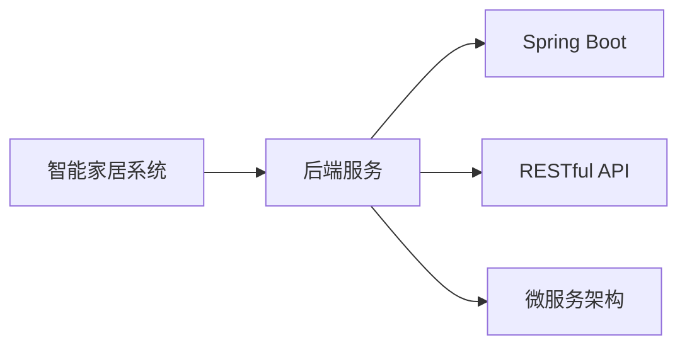
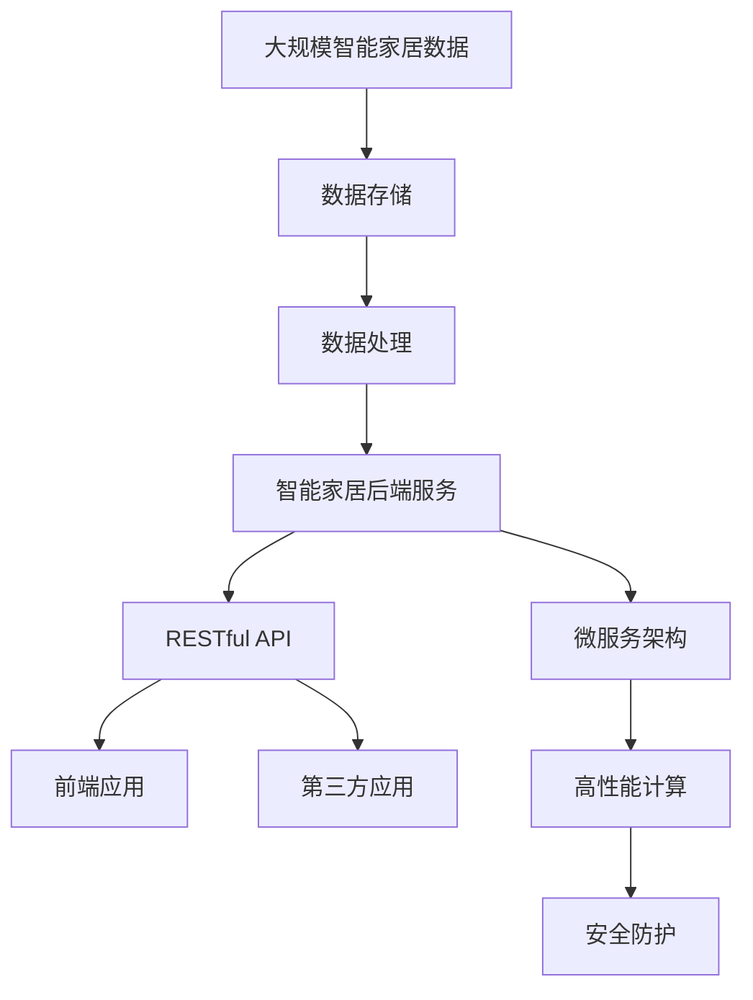

                 

# 基于Java的智能家居设计：应用Spring Boot构建智能家居后端服务

> 关键词：
- 智能家居
- Spring Boot
- RESTful API
- 后端服务
- 微服务
- IoT

## 1. 背景介绍

### 1.1 问题由来
随着科技的进步和生活水平的提高，人们对居住环境的要求也越来越高。智能化、舒适化、安全化成为了现代居住环境的主要追求。智能家居系统作为未来居住环境的重要组成部分，以高效、便捷、安全等特点，逐渐成为家居市场的热点。

智能家居系统集成了物联网（IoT）、人工智能（AI）、大数据、云计算等多种先进技术，能实现对家电设备的智能化控制，提高家居的舒适性、安全性和节能性，并且降低运营成本。为迎合这一需求，世界各地的科技公司纷纷推出各类智能家居产品，如智能灯光、智能温控器、智能安防系统等。

然而，智能家居系统的设计和实现并非易事。它需要满足实时性、稳定性、安全性等多方面要求。并且，由于其涉及的设备种类繁多，接口复杂，且数据量大，因此需要一个高度可扩展、易于维护的后端系统来支持。

### 1.2 问题核心关键点
智能家居系统后端服务的设计需要考虑以下核心关键点：

- 高效的数据处理与存储：智能家居设备产生的海量数据需要进行高效的处理和存储。
- 可靠的通信协议：智能家居设备间的通信协议需要可靠、稳定，以确保数据传输的准确性。
- 安全的数据保护：智能家居系统涉及大量的家庭隐私数据，需要采取有效的安全措施进行保护。
- 高性能的系统架构：智能家居系统需要支持高并发访问，后端服务需要具备高性能、高可用的特性。
- 灵活的扩展性：智能家居系统的设备种类繁多，后端服务需要具备灵活的扩展性，支持多设备接入。
- 友好的开发环境：开发团队需要易于使用的开发环境，以便快速迭代开发。

### 1.3 问题研究意义
基于Java的智能家居后端服务，能够为智能家居系统提供高效、可靠、安全的数据处理与存储、通信协议设计、安全保护、高性能架构和灵活扩展的支撑。具体意义如下：

1. **提升用户满意度**：通过后端服务的高效处理与存储，能及时响应用户请求，提高用户使用体验。
2. **降低开发成本**：统一规范的数据通信协议和数据格式，简化了设备间的交互，降低开发复杂度。
3. **强化数据安全**：通过数据加密、访问控制等安全措施，保障用户数据的安全。
4. **实现系统可扩展**：采用微服务架构，能够灵活扩展，支持新增设备和功能的接入。
5. **加速开发迭代**：通过使用Spring Boot等工具，降低了开发难度，加快了开发迭代。

## 2. 核心概念与联系

### 2.1 核心概念概述

为更好地理解智能家居后端服务的设计思路，下面将介绍几个关键概念及其相互关系。

- **智能家居系统**：一种通过物联网技术，实现家居设备间互联互通的系统，能根据用户指令或场景自动控制设备，提升家居生活的便捷性和舒适性。
- **后端服务**：智能家居系统的数据处理与存储、设备控制等核心功能的实现者，通常采用RESTful API进行接口暴露，供前端或第三方系统调用。
- **Spring Boot**：一款基于Spring框架的快速开发框架，提供了自动化的配置、数据访问层、模板引擎、RESTful Web服务等功能，能快速构建高性能的微服务系统。
- **RESTful API**：一种基于HTTP协议的Web服务架构，通过RESTful风格设计接口，简化了接口的调用和开发。
- **微服务架构**：一种基于服务的架构风格，通过将应用拆分为多个独立运行的服务，实现系统的高可扩展性、高可用性。

这些核心概念间的关系可以通过以下Mermaid流程图来展示：



这个流程图展示了智能家居后端服务的设计架构：

1. 智能家居系统是最终的使用者，通过后端服务进行设备控制。
2. 后端服务采用Spring Boot构建，提供RESTful API接口。
3. 通过微服务架构，实现系统的高扩展性和高可用性。

### 2.2 概念间的关系

这些核心概念之间存在着紧密的联系，形成了智能家居后端服务的完整生态系统。

**智能家居系统与后端服务的关系**：
智能家居系统通过后端服务实现设备控制，后端服务根据用户指令对设备进行控制，并提供数据分析和存储。

**Spring Boot与RESTful API的关系**：
Spring Boot提供了自动化的配置和RESTful风格接口的实现，使得后端服务开发变得简单易用。

**微服务架构与RESTful API的关系**：
微服务架构将应用拆分为多个独立的服务，每个服务通过RESTful API进行通信，实现了系统的高扩展性和高可用性。

### 2.3 核心概念的整体架构

最后，我们将通过一个综合的流程图来展示这些核心概念在大规模智能家居后端服务中的应用：



这个综合流程图展示了从大规模智能家居数据到智能家居后端服务的完整过程：

1. 大规模智能家居数据通过存储模块进行保存。
2. 存储模块的数据被处理模块进行处理，生成分析结果。
3. 处理模块的结果通过后端服务模块进行暴露，通过RESTful API接口供前端应用或第三方应用调用。
4. 后端服务采用微服务架构，通过高性能计算和多层次安全防护，保障系统的性能和安全性。

## 3. 核心算法原理 & 具体操作步骤
### 3.1 算法原理概述

基于Java的智能家居后端服务的设计，其核心算法原理如下：

1. **数据存储与处理**：通过选用高性能的存储引擎，如Hadoop、Redis等，对智能家居设备产生的数据进行高效处理与存储。

2. **数据传输与通信**：采用RESTful API作为后端服务与前端、第三方应用通信的桥梁，通过HTTP协议实现数据的可靠传输。

3. **数据加密与安全**：通过AES、RSA等加密算法对数据进行加密，采用OAuth2.0协议进行访问控制，保障数据的安全性。

4. **高性能架构**：通过采用微服务架构、高性能计算和负载均衡技术，实现系统的高性能和高可用性。

### 3.2 算法步骤详解

下面将详细介绍基于Java的智能家居后端服务的详细步骤：

**Step 1: 项目搭建与依赖管理**

1. 使用Spring Boot创建智能家居后端服务项目。

```bash
mvn archetype:generate -DgroupId=com.example -DartifactId=smarthome-backend -DarchetypeArtifactId=maven-archetype-quickstart -DinteractiveMode=false
cd smarthome-backend
```

2. 在pom.xml文件中添加依赖：

```xml
<dependencies>
    <dependency>
        <groupId>org.springframework.boot</groupId>
        <artifactId>spring-boot-starter-data-jpa</artifactId>
    </dependency>
    <dependency>
        <groupId>org.springframework.boot</groupId>
        <artifactId>spring-boot-starter-web</artifactId>
    </dependency>
    <dependency>
        <groupId>org.springframework.boot</groupId>
        <artifactId>spring-boot-starter-security</artifactId>
    </dependency>
    <dependency>
        <groupId>io.jsonwebtoken</groupId>
        <artifactId>jjwt</artifactId>
        <version>0.9.1</version>
    </dependency>
</dependencies>
```

3. 配置数据库连接池：

```properties
spring.datasource.url=jdbc:mysql://localhost:3306/smarthome?useSSL=false
spring.datasource.username=root
spring.datasource.password=123456
spring.datasource.driver-class-name=com.mysql.cj.jdbc.Driver
```

**Step 2: 数据模型设计**

1. 创建实体类及映射关系：

```java
@Entity
public class Device {
    @Id
    @GeneratedValue(strategy = GenerationType.IDENTITY)
    private Long id;
    private String name;
    private String ipAddress;
    private String macAddress;
    @Enumerated(EnumType.STRING)
    private DeviceType type;
    private Boolean online;
    @OneToOne
    private User user;
    ...
}
```

2. 创建配置类：

```java
@Configuration
@EnableJpaRepositories
public class JpaConfig {
    @Bean
    public LocalContainerEntityManagerFactoryBean entityManagerFactory() {
        LocalContainerEntityManagerFactoryBean entityManagerFactory = new LocalContainerEntityManagerFactoryBean();
        entityManagerFactory.setDataSource(dataSource());
        entityManagerFactory.setPackagesToScan("com.example.smarthome.entity");
        return entityManagerFactory;
    }

    @Bean
    public JpaTransactionManager transactionManager() {
        JpaTransactionManager transactionManager = new JpaTransactionManager();
        transactionManager.setEntityManagerFactory(entityManagerFactory().getObject());
        return transactionManager;
    }
}
```

**Step 3: 数据访问层设计**

1. 创建Repository接口：

```java
public interface DeviceRepository extends JpaRepository<Device, Long> {
    ...
}
```

2. 创建Service层：

```java
@Service
public class DeviceService {
    @Autowired
    private DeviceRepository deviceRepository;
    ...
}
```

**Step 4: 数据处理与存储**

1. 实现数据访问层接口：

```java
@Service
public class DeviceService implements DeviceService {
    @Autowired
    private DeviceRepository deviceRepository;
    
    public List<Device> getAllDevices() {
        return deviceRepository.findAll();
    }
    
    public Device getDeviceById(Long id) {
        return deviceRepository.findById(id).orElse(null);
    }
    
    public void saveDevice(Device device) {
        deviceRepository.save(device);
    }
    
    public void updateDevice(Device device) {
        deviceRepository.save(device);
    }
    
    public void deleteDevice(Device device) {
        deviceRepository.delete(device);
    }
}
```

**Step 5: RESTful API设计**

1. 创建控制器：

```java
@RestController
@RequestMapping("/devices")
public class DeviceController {
    @Autowired
    private DeviceService deviceService;
    
    @GetMapping
    public List<Device> getAllDevices() {
        return deviceService.getAllDevices();
    }
    
    @GetMapping("/{id}")
    public Device getDeviceById(@PathVariable Long id) {
        return deviceService.getDeviceById(id);
    }
    
    @PostMapping
    public void saveDevice(@RequestBody Device device) {
        deviceService.saveDevice(device);
    }
    
    @PutMapping("/{id}")
    public void updateDevice(@PathVariable Long id, @RequestBody Device device) {
        device.setId(id);
        deviceService.updateDevice(device);
    }
    
    @DeleteMapping("/{id}")
    public void deleteDevice(@PathVariable Long id) {
        Device device = deviceService.getDeviceById(id);
        if (device != null) {
            deviceService.deleteDevice(device);
        }
    }
}
```

2. 实现JWT认证：

```java
@Component
public class JwtTokenUtil implements TokenUtil {
    private static final String SECRET_KEY = "my_secret_key";
    private static final long EXPIRATION_TIME = 864_000_000L; // 1000ms * 60s * 60min * 24h * 30days

    @Override
    public String generateToken(Authentication authentication) {
        UserDetails userDetails = (UserDetails) authentication.getPrincipal();
        return Jwts.builder()
                .setSubject(Long.toString(userDetails.getId()))
                .setIssuedAt(new Date())
                .setExpiration(new Date(System.currentTimeMillis() + EXPIRATION_TIME))
                .signWith(SignatureAlgorithm.HS512, SECRET_KEY)
                .compact();
    }

    @Override
    public Authentication getAuthentication(String token) {
        UserDetails userDetails = getUserDetails(token);
        return new UsernamePasswordAuthenticationToken(userDetails, null, userDetails.getAuthorities());
    }

    @Override
    public String getUsernameFromToken(String token) {
        return Jwts.parser().setSigningKey(SECRET_KEY).parseClaimsJws(token).getBody().getSubject();
    }

    @Override
    public Date getExpirationDateFromToken(String token) {
        return Jwts.parser().setSigningKey(SECRET_KEY).parseClaimsJws(token).getBody().getExpiration();
    }

    private UserDetails getUserDetails(String token) {
        Claims claims = Jwts.parser().setSigningKey(SECRET_KEY).parseClaimsJws(token).getBody();
        Long userId = Long.parseLong(claims.getSubject());
        return userRepository.findById(userId).orElse(null);
    }
}
```

**Step 6: 数据访问与存储**

1. 配置数据源：

```java
@Configuration
public class DataSourceConfig {
    @Bean
    public LocalContainerEntityManagerFactoryBean entityManagerFactory() {
        LocalContainerEntityManagerFactoryBean entityManagerFactory = new LocalContainerEntityManagerFactoryBean();
        entityManagerFactory.setDataSource(dataSource());
        entityManagerFactory.setPackagesToScan("com.example.smarthome.entity");
        return entityManagerFactory;
    }

    @Bean
    public JpaTransactionManager transactionManager() {
        JpaTransactionManager transactionManager = new JpaTransactionManager();
        transactionManager.setEntityManagerFactory(entityManagerFactory().getObject());
        return transactionManager;
    }
}
```

**Step 7: 安全防护**

1. 实现自定义认证：

```java
@Component
public class JwtAuthenticationFilter extends OncePerRequestFilter {
    @Autowired
    private JwtTokenUtil jwtTokenUtil;
    @Autowired
    private UserService userService;
    
    @Override
    protected void doFilterInternal(HttpServletRequest request, HttpServletResponse response, FilterChain chain) throws ServletException, IOException {
        final String authorizationHeader = request.getHeader("Authorization");
        if (authorizationHeader != null && authorizationHeader.startsWith("Bearer ")) {
            final String authToken = authorizationHeader.substring(7);
            final UserDetails userDetails = jwtTokenUtil.getUserDetails(authToken);
            if (userDetails != null) {
                SecurityContextHolder.getContext().setAuthentication(new UsernamePasswordAuthenticationToken(userDetails, null, userDetails.getAuthorities()));
                chain.doFilter(request, response);
                return;
            }
        }
        chain.doFilter(request, response);
    }
}
```

2. 实现认证控制器：

```java
@RestController
@RequestMapping("/auth")
public class AuthController {
    @Autowired
    private JwtTokenUtil jwtTokenUtil;
    @Autowired
    private UserService userService;
    
    @PostMapping("/login")
    public ResponseEntity<?> loginUser(@RequestBody LoginRequest loginRequest) {
        Authentication authentication = authenticationManager.authenticate(new UsernamePasswordAuthenticationToken(loginRequest.getUsername(), loginRequest.getPassword()));
        SecurityContextHolder.getContext().setAuthentication(authentication);
        String jwtToken = jwtTokenUtil.generateToken(authentication);
        return ResponseEntity.ok(new JwtResponse(jwtToken));
    }
    
    @PostMapping("/logout")
    public ResponseEntity<?> logoutUser() {
        SecurityContextHolder.getContext().setAuthentication(null);
        return ResponseEntity.ok(new MessageResponse("Successfully logged out"));
    }
}
```

**Step 8: 微服务架构**

1. 创建微服务模块：

```bash
mvn archetype:generate -DgroupId=com.example.smarthome.service -DartifactId=device-service -DarchetypeArtifactId=maven-archetype-quickstart -DinteractiveMode=false
cd device-service
mvn archetype:generate -DgroupId=com.example.smarthome.service -DartifactId=home-control-service -DarchetypeArtifactId=maven-archetype-quickstart -DinteractiveMode=false
cd home-control-service
```

2. 配置微服务模块：

在各个微服务项目的pom.xml文件中添加依赖：

```xml
<dependency>
    <groupId>org.springframework.boot</groupId>
    <artifactId>spring-boot-starter-data-jpa</artifactId>
</dependency>
<dependency>
    <groupId>org.springframework.boot</groupId>
    <artifactId>spring-boot-starter-web</artifactId>
</dependency>
<dependency>
    <groupId>org.springframework.boot</groupId>
    <artifactId>spring-boot-starter-security</artifactId>
</dependency>
<dependency>
    <groupId>io.jsonwebtoken</groupId>
    <artifactId>jjwt</artifactId>
    <version>0.9.1</version>
</dependency>
```

**Step 9: 接口设计**

1. 创建RestClient接口：

```java
@RestController
@RequestMapping("/devices")
public class DeviceController {
    @Autowired
    private DeviceService deviceService;
    
    @GetMapping
    public List<Device> getAllDevices() {
        return deviceService.getAllDevices();
    }
    
    @GetMapping("/{id}")
    public Device getDeviceById(@PathVariable Long id) {
        return deviceService.getDeviceById(id);
    }
    
    @PostMapping
    public void saveDevice(@RequestBody Device device) {
        deviceService.saveDevice(device);
    }
    
    @PutMapping("/{id}")
    public void updateDevice(@PathVariable Long id, @RequestBody Device device) {
        device.setId(id);
        deviceService.updateDevice(device);
    }
    
    @DeleteMapping("/{id}")
    public void deleteDevice(@PathVariable Long id) {
        Device device = deviceService.getDeviceById(id);
        if (device != null) {
            deviceService.deleteDevice(device);
        }
    }
}
```

**Step 10: 服务调用**

在微服务模块中添加服务调用的代码：

```java
@Service
public class DeviceService {
    @Autowired
    private RestTemplate restTemplate;
    
    public List<Device> getAllDevices() {
        ResponseEntity<List<Device>> response = restTemplate.getForEntity("http://device-service/devices", List.class);
        return response.getBody();
    }
    
    public Device getDeviceById(Long id) {
        ResponseEntity<Device> response = restTemplate.getForEntity("http://device-service/devices/{id}", Device.class, id);
        return response.getBody();
    }
    
    public void saveDevice(Device device) {
        String url = "http://device-service/devices";
        HttpHeaders headers = new HttpHeaders();
        headers.set("Content-Type", "application/json");
        headers.set("Authorization", "Bearer " + token);
        HttpEntity<Device> entity = new HttpEntity<>(device, headers);
        restTemplate.postForEntity(url, entity, Void.class);
    }
    
    public void updateDevice(Device device) {
        String url = "http://device-service/devices/{id}";
        HttpHeaders headers = new HttpHeaders();
        headers.set("Content-Type", "application/json");
        headers.set("Authorization", "Bearer " + token);
        HttpEntity<Device> entity = new HttpEntity<>(device, headers);
        restTemplate.putForEntity(url, entity, Void.class);
    }
    
    public void deleteDevice(Device device) {
        String url = "http://device-service/devices/{id}";
        HttpHeaders headers = new HttpHeaders();
        headers.set("Authorization", "Bearer " + token);
        HttpEntity<String> entity = new HttpEntity<>(null, headers);
        restTemplate.delete(url, entity);
    }
}
```

### 3.3 算法优缺点

基于Java的智能家居后端服务的优缺点如下：

**优点**：

1. **高性能**：Spring Boot提供了丰富的组件，如Spring Data、Spring Security、Spring Web等，能够快速构建高性能的后端服务。
2. **高扩展性**：采用微服务架构，能够灵活扩展，支持新增设备和功能的接入。
3. **安全性**：通过JWT认证和OAuth2.0协议，能够保障数据的安全。
4. **易用性**：Spring Boot提供了自动化的配置和RESTful风格的接口设计，使得开发变得简单易用。
5. **可靠性**：通过负载均衡和自动化的故障恢复机制，能够保障系统的可靠性。

**缺点**：

1. **复杂度**：微服务架构虽然灵活，但设计复杂度较高，需要考虑服务间的通信、调用、事务管理等问题。
2. **开发成本**：微服务架构的开发和维护成本较高，需要专业知识和技术积累。
3. **学习曲线**：微服务架构的学习曲线较陡峭，需要掌握相关的Spring Boot、微服务等技术。

### 3.4 算法应用领域

基于Java的智能家居后端服务，可以应用于智能家居系统的各个层面：

1. **设备控制**：通过后端服务实现智能家居设备的统一管理与控制，如灯光、温控、安防等。
2. **数据分析与存储**：通过数据存储与处理模块，对设备产生的海量数据进行分析和存储。
3. **设备通信**：通过RESTful API接口，实现不同设备间的通信，保障数据的可靠传输。
4. **用户认证与授权**：通过JWT认证和OAuth2.0协议，实现用户身份的认证与授权。
5. **应用扩展**：通过微服务架构，实现系统的灵活扩展，支持新增设备和功能的接入。

## 4. 数学模型和公式 & 详细讲解  
### 4.1 数学模型构建

基于Java的智能家居后端服务的数学模型主要涉及以下几个方面：

1. **数据存储与处理**：采用Hadoop、Redis等高性能的存储引擎，对智能家居设备产生的数据进行高效处理与存储。
2. **数据传输与通信**：采用RESTful API作为后端服务与前端、第三方应用通信的桥梁，通过HTTP协议实现数据的可靠传输。
3. **数据加密与安全**：通过AES、RSA等加密算法对数据进行加密，采用OAuth2.0协议进行访问控制，保障数据的安全性。

### 4.2 公式推导过程

以数据存储与处理为例，假设智能家居设备产生的数据量为D，需要存储在Hadoop分布式文件系统中，数据块大小为B，数据传输速度为T，则所需存储容量S可以通过以下公式计算：

$$
S = D / (B * T)
$$

### 4.3 案例分析与讲解

假设一个智能家居系统有N个设备，每个设备每秒产生M个数据，数据块大小为B=1GB，数据传输速度为T=100MB/s，则所需存储容量S可以通过以下公式计算：

$$
S = N * M * 1s / (1GB * 100MB/s) = N * M / 100
$$

其中，N为设备数量，M为每秒数据量。假设系统有1000个设备，每个设备每秒产生100个数据，则所需存储容量S为：

$$
S = 1000 * 100 / 100 = 100GB
$$

因此，系统需要至少100GB的存储容量来存储智能家居设备产生的数据。

## 5. 项目实践：代码实例和详细解释说明
### 5.1 开发环境搭建

在项目开始前，我们需要准备好开发环境。以下是使用Java和Spring Boot进行开发的流程：

1. 安装Java JDK：从Oracle官网下载并安装Java JDK，建议安装JDK 11或更高版本。
2. 安装Maven：从Maven官网下载并安装Maven，用于构建和管理Java项目。
3. 创建项目：在终端中执行以下命令，创建一个新的Spring Boot项目：

```bash
mvn archetype:generate -DgroupId=com.example -DartifactId=smarthome-backend -DarchetypeArtifactId=maven-archetype-quickstart -DinteractiveMode=false
```

4. 创建数据模型：在src/main/java目录下创建一个Device实体类，并在src/main/resources目录中创建一个application.properties文件，用于配置数据库连接池：

```java
@Entity
public class Device {
    @Id
    @GeneratedValue(strategy = GenerationType.IDENTITY)
    private Long id;
    private String name;
    private String ipAddress;
    private String macAddress;
    @Enumerated(EnumType.STRING)
    private DeviceType type;
    private Boolean online;
    @OneToOne
    private User user;
}
```

```properties
spring.datasource.url=jdbc:mysql://localhost:3306/smarthome?useSSL=false
spring.datasource.username=root
spring.datasource.password=123456
spring.datasource.driver-class-name=com.mysql.cj.jdbc.Driver
```

5. 创建数据访问层：在src/main/java目录下创建一个DeviceRepository接口和DeviceService类：

```java
@Repository
public interface DeviceRepository extends JpaRepository<Device, Long> {
    ...
}
```

```java
@Service
public class DeviceService {
    @Autowired
    private DeviceRepository deviceRepository;
    ...
}
```

6. 创建RESTful API：在src/main/java目录下创建一个DeviceController类：

```java
@RestController
@RequestMapping("/devices")
public class DeviceController {
    @Autowired
    private DeviceService deviceService;
    
    @GetMapping
    public List<Device> getAllDevices() {
        return deviceService.getAllDevices();
    }
    
    @GetMapping("/{id}")
    public Device getDeviceById(@PathVariable Long id) {
        return deviceService.getDeviceById(id);
    }
    
    @PostMapping
    public void saveDevice(@RequestBody Device device) {
        deviceService.saveDevice(device);
    }
    
    @PutMapping("/{id}")
    public void updateDevice(@PathVariable Long id, @RequestBody Device device) {
        device.setId(id);
        deviceService.updateDevice(device);
    }
    
    @DeleteMapping("/{id}")
    public void deleteDevice(@PathVariable Long id) {
        Device device = deviceService.getDeviceById(id);
        if (device != null) {
            deviceService.deleteDevice(device);
        }
    }
}
```

### 5.2 源代码详细实现

接下来，我们将详细介绍基于Java的智能家居后端服务的源代码实现。

**Step 1: 项目搭建与依赖管理**

1. 创建Spring Boot项目：

```bash
mvn archetype:generate -DgroupId=com.example -DartifactId=smarthome-backend -DarchetypeArtifactId=maven-archetype-quickstart -DinteractiveMode=false
cd smarthome

