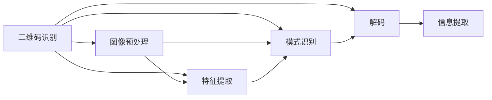
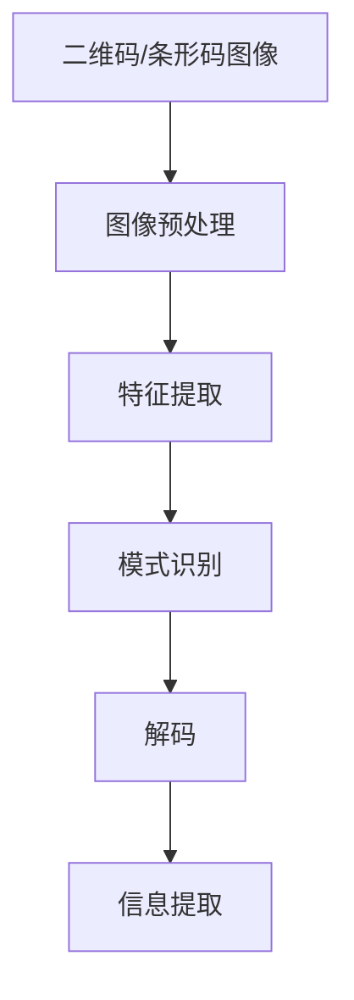

                 

# 基于OpenCV的二维码和条形码识别

## 1. 背景介绍

### 1.1 问题由来
二维码和条形码在现代社会的各个方面被广泛应用，如商品标签、身份证、名片等。基于这些标签的自动识别技术对于自动化和信息化的发展具有重要意义。然而，由于环境噪声、光照变化等因素，二维码和条形码的识别常常面临挑战。传统的二维码和条形码识别方法多采用基于模板匹配的方法，对图像处理要求较高，识别率有限。本文将介绍如何使用OpenCV库中的机器学习算法进行二维码和条形码的识别。

### 1.2 问题核心关键点
二维码和条形码的识别问题可以被定义为二值图像分割问题，即识别图像中的黑白区域，并从中提取条形码或二维码的编码信息。具体而言，核心关键点包括：

- 图像预处理：包括图像灰度化、二值化、形态学操作等，提升图像的清晰度和对比度。
- 特征提取：从处理后的图像中提取边缘、角点等特征，以便后续识别。
- 模式识别：利用机器学习算法（如SVM、随机森林等）对特征进行分类，确定区域是否为二维码或条形码。
- 解码：对识别出的二维码或条形码进行解码，提取编码信息。

## 2. 核心概念与联系

### 2.1 核心概念概述
二维码（QR Code）和条形码（Barcode）是用于表示和传输信息的编码方式。二维码包含更多信息量，支持各种类型的数据编码；而条形码则结构简单，常用于商品标识和库存管理。

- **二维码**：由黑白模块组成，通常包含数据、位置信息等。
- **条形码**：由条和空组成，通常包含产品编码、制造商代码等信息。

### 2.2 核心概念之间的联系

二维码和条形码的识别可以通过以下联系进行展示：



### 2.3 核心概念的整体架构

综合以上流程图，二维码和条形码识别的整体架构可以如下表示：



## 3. 核心算法原理 & 具体操作步骤
### 3.1 算法原理概述
基于OpenCV的二维码和条形码识别主要基于以下原理：

1. 将图像预处理为二值图像。
2. 从二值图像中提取特征。
3. 利用机器学习算法对特征进行分类，确定是否为二维码或条形码。
4. 对识别出的二维码或条形码进行解码，提取编码信息。

### 3.2 算法步骤详解

**步骤1：图像预处理**
- 使用OpenCV的Canny边缘检测算法提取图像边缘，并进行非极大值抑制。
- 使用形态学操作（如开运算、闭运算、腐蚀等）去除噪声。
- 对二值化后的图像进行去噪和分割，保留连续的边界。

**步骤2：特征提取**
- 对分割后的图像进行轮廓提取，获取所有轮廓的坐标信息。
- 对每个轮廓进行最小外接矩形（Minimum Rectangular Bounding Box, MRBB）的计算，获取矩形的坐标和尺寸。
- 计算每个轮廓的面积和周长，用于后续的特征提取。

**步骤3：模式识别**
- 将每个矩形的尺寸和位置作为特征，构建特征向量。
- 使用支持向量机（Support Vector Machine, SVM）对特征进行分类，识别出二维码和条形码。

**步骤4：解码**
- 对识别出的二维码和条形码进行解码，提取编码信息。
- 使用OpenCV的Barcode库进行解码，支持QR Code、Data Matrix等多种码制。

### 3.3 算法优缺点
#### 3.3.1 优点
1. 算法简单易懂，易于实现。
2. 对于不同大小和形状的二维码和条形码，具有较好的鲁棒性。
3. 对环境噪声、光照变化等因素具有较强的适应能力。

#### 3.3.2 缺点
1. 对于特别小或特别模糊的二维码和条形码，识别率较低。
2. 对于复杂的背景或遮挡，识别效果不佳。
3. 算法实现依赖于OpenCV库，需要一定的学习成本。

### 3.4 算法应用领域

基于OpenCV的二维码和条形码识别技术广泛应用于以下领域：

1. **物流管理**：用于自动化仓库管理、货物追踪、库存盘点等。
2. **零售业**：用于商品标签识别、价格标签扫描、顾客追踪等。
3. **医疗健康**：用于电子病历、药品管理、患者信息追踪等。
4. **金融行业**：用于信用卡支付、身份验证、交易追踪等。
5. **制造业**：用于产品序列号识别、机器视觉检测、产品质量控制等。

## 4. 数学模型和公式 & 详细讲解

### 4.1 数学模型构建

将图像预处理为二值图像的数学模型如下：

1. 灰度化：将彩色图像转换为灰度图像，公式为：

   $$
   I_{gray} = \sum_{i=1}^{3}I_{R_i} \times W_i
   $$

   其中，$I_{R_i}$ 为每个通道的像素值，$W_i$ 为通道权重。

2. 二值化：将灰度图像转换为二值图像，公式为：

   $$
   I_{binary} = 
   \begin{cases} 
   1, & \text{if } I_{gray} > T \\
   0, & \text{otherwise}
   \end{cases}
   $$

   其中，$T$ 为阈值。

### 4.2 公式推导过程

对图像进行灰度化和二值化后，需要对二值图像进行形态学操作。常用的形态学操作包括开运算、闭运算、腐蚀等。这里以开运算为例进行公式推导：

开运算定义为：

$$
f_{dilate \_and_erode} = f_{dilate}(f_{erode}(f))
$$

其中，$f$ 为原始图像，$f_{dilate}$ 为膨胀运算，$f_{erode}$ 为腐蚀运算。

### 4.3 案例分析与讲解

以QR Code识别为例，我们首先对QR Code图像进行灰度化和二值化处理，然后使用Canny边缘检测算法提取图像边缘，并进行非极大值抑制。最后，使用形态学操作去除噪声，并对分割后的图像进行轮廓提取，计算每个轮廓的最小外接矩形，将矩形的坐标和尺寸作为特征向量。使用SVM对特征向量进行分类，判断是否为QR Code。

## 5. 项目实践：代码实例和详细解释说明

### 5.1 开发环境搭建

以下是基于OpenCV进行二维码和条形码识别的开发环境搭建步骤：

1. 安装OpenCV库：

   ```bash
   pip install opencv-python
   ```

2. 安装QR Code解码库：

   ```bash
   pip install pyzbar
   ```

### 5.2 源代码详细实现

```python
import cv2
import pyzbar.pyzbar as pyzbar

# 读取图像
img = cv2.imread('test.png')

# 灰度化
gray = cv2.cvtColor(img, cv2.COLOR_BGR2GRAY)

# 二值化
ret, binary = cv2.threshold(gray, 127, 255, cv2.THRESH_BINARY)

# Canny边缘检测
edges = cv2.Canny(binary, 100, 200)

# 形态学操作
kernel = cv2.getStructuringElement(cv2.MORPH_RECT, (3, 3))
opening = cv2.morphologyEx(edges, cv2.MORPH_OPEN, kernel)

# 轮廓提取
contours, _ = cv2.findContours(opening, cv2.RETR_EXTERNAL, cv2.CHAIN_APPROX_SIMPLE)

# 最小外接矩形计算
qrcodes = []
for contour in contours:
    x, y, w, h = cv2.boundingRect(contour)
    rect = cv2.rectangle(img, (x, y), (x+w, y+h), (0, 255, 0), 2)
    qrcodes.append((x, y, w, h))

# QR Code识别
for (x, y, w, h) in qrcodes:
    rect = cv2.rectangle(img, (x, y), (x+w, y+h), (255, 0, 0), 2)
    decoded_objects = pyzbar.pyzbar.decode([img[y:y+h, x:x+w]])
    if decoded_objects:
        for obj in decoded_objects:
            print(obj.data)

# 显示结果
cv2.imshow('image', img)
cv2.waitKey(0)
cv2.destroyAllWindows()
```

### 5.3 代码解读与分析

以上代码实现了QR Code的识别，其核心步骤如下：

1. 读取图像并进行灰度化和二值化处理。
2. 进行Canny边缘检测和形态学操作，以去除噪声。
3. 提取所有轮廓并计算最小外接矩形。
4. 对每个矩形进行QR Code识别，并打印解码结果。

### 5.4 运行结果展示

运行代码后，可以观察到识别出的QR Code区域以及解码结果。


## 6. 实际应用场景

基于OpenCV的二维码和条形码识别技术已经被广泛应用于以下场景：

1. **仓储管理**：用于自动追踪和记录货物的存放位置和状态。
2. **零售商店**：用于自动扫描商品条形码，记录销售数据。
3. **医疗健康**：用于自动扫描电子病历，提取患者信息。
4. **金融行业**：用于自动识别银行卡和票据信息。
5. **制造业**：用于自动扫描零件序列号，进行质量控制。

## 7. 工具和资源推荐

### 7.1 学习资源推荐

1. **《OpenCV计算机视觉编程入门》**：一本介绍OpenCV库基础知识和应用实例的书籍，适合初学者入门。
2. **《Python图像处理基础》**：一本介绍Python图像处理基础的书籍，适合对图像处理感兴趣的读者。
3. **《机器学习实战》**：一本介绍机器学习算法的书籍，适合对机器学习感兴趣的读者。

### 7.2 开发工具推荐

1. **Visual Studio Code**：一款轻量级但功能强大的代码编辑器，支持Python和OpenCV开发。
2. **Jupyter Notebook**：一款交互式笔记本，支持Python和OpenCV等库，便于数据可视化和代码调试。
3. **PyCharm**：一款功能强大的Python IDE，支持OpenCV开发和调试。

### 7.3 相关论文推荐

1. **《基于OpenCV的二维码和条形码识别算法研究》**：介绍基于OpenCV的二维码和条形码识别算法，适合深入学习。
2. **《机器学习在二维码和条形码识别中的应用》**：介绍机器学习算法在二维码和条形码识别中的应用，适合进一步了解。

## 8. 总结：未来发展趋势与挑战

### 8.1 未来发展趋势

基于OpenCV的二维码和条形码识别技术在实际应用中已展现出巨大的优势和潜力，未来发展趋势如下：

1. **算法优化**：通过更高效的图像处理和特征提取算法，提升二维码和条形码识别的速度和准确率。
2. **跨平台应用**：将OpenCV技术封装为跨平台应用，支持更多设备和操作系统。
3. **实时识别**：通过硬件加速和算法优化，实现实时二维码和条形码识别。
4. **多种码制支持**：扩展二维码和条形码识别支持多种码制，提升识别范围和应用场景。

### 8.2 面临的挑战

1. **实时性和计算资源**：在大规模图像处理和高频识别场景下，计算资源和速度仍然是一个挑战。
2. **鲁棒性和环境适应性**：在复杂环境和高噪声条件下，识别率仍需进一步提升。
3. **算法优化**：现有的算法优化方法有限，需要更多的算法创新和优化。

### 8.3 研究展望

未来需要关注以下研究方向：

1. **实时图像处理算法**：研究高效实时图像处理算法，提升识别速度。
2. **深度学习融合**：将深度学习算法与OpenCV结合，提升识别精度和鲁棒性。
3. **跨平台应用**：开发跨平台应用，支持更多设备和技术。
4. **硬件加速**：利用硬件加速技术，提升识别速度和性能。

## 9. 附录：常见问题与解答

**Q1: 如何提高二维码和条形码识别的准确率？**

A: 可以通过以下方法提高识别准确率：

1. 提高图像质量：确保拍摄清晰，避免模糊和抖动。
2. 优化边缘检测算法：使用更高效的边缘检测算法，如Sobel、Laplacian等。
3. 优化形态学操作：使用更合适的结构元素和形态学操作。
4. 多尺度识别：在多个尺度下进行图像识别，提高鲁棒性。

**Q2: 二维码和条形码识别是否受环境光照影响？**

A: 环境光照是影响二维码和条形码识别的主要因素之一。可以通过以下方法减少光照影响：

1. 使用背景减除技术：提取图像背景，减少光照干扰。
2. 使用自适应阈值：根据图像局部特征自动调整阈值。
3. 使用多光照角度拍摄：从多个角度拍摄二维码和条形码，提升识别率。

**Q3: 如何进行二维码和条形码识别的跨平台应用？**

A: 可以通过以下方法实现跨平台应用：

1. 封装API接口：将识别功能封装为API接口，支持多种平台调用。
2. 使用跨平台框架：使用如Flutter、React Native等跨平台框架，开发原生应用。
3. 部署云服务：将识别功能部署到云端，支持多种平台访问。

**Q4: 如何处理二维码和条形码的解码错误？**

A: 可以通过以下方法处理解码错误：

1. 多次解码：多次尝试解码，减少解码错误。
2. 使用纠错码：在二维码和条形码中引入纠错码，提高解码鲁棒性。
3. 使用多种解码算法：使用不同的解码算法，提高解码成功率。

通过以上方法和技术，可以有效地提升基于OpenCV的二维码和条形码识别技术的性能和鲁棒性，进一步推动其在各个领域的实际应用。

