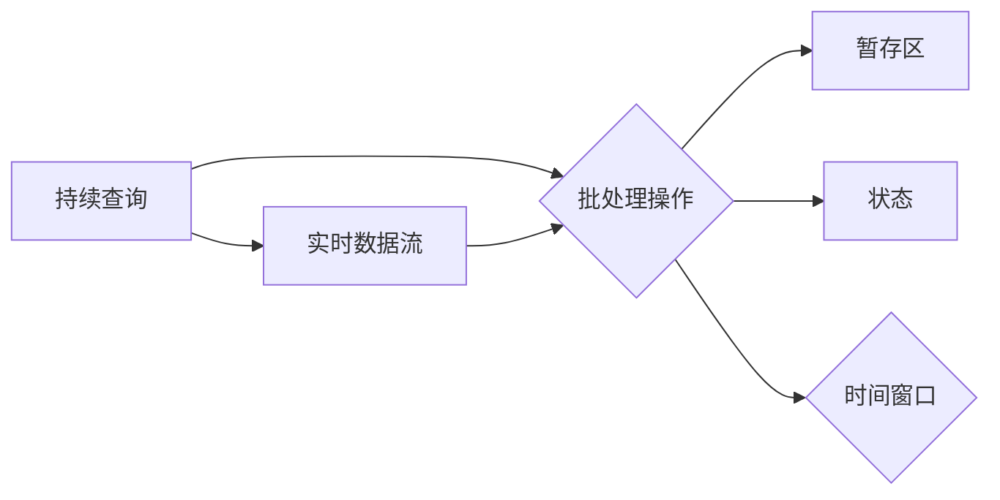

# Storm Trident原理与代码实例讲解

> 关键词：Storm, Trident, 实时计算, 持续查询, 滑动窗口, 批处理, 批处理操作, 暂存区, 时间窗口, 处理拓扑

## 1. 背景介绍

随着大数据时代的到来，实时数据分析的需求日益增长。Apache Storm 是一个分布式、可靠、可扩展的实时计算系统，广泛应用于实时数据流处理、机器学习、在线分析等领域。Storm Trident 是 Storm 的一个扩展模块，它提供了一种构建复杂实时应用程序的方法，通过持续查询（Continuous Queries）和滑动窗口（Sliding Windows）等技术，实现实时的数据分析和处理。

### 1.1 问题的由来

在传统的 Storm 拓扑中，数据流处理通常通过 Bolt 的 Tuple 传递和 Bolt 的执行逻辑来完成。这种方式适用于简单的事件处理，但对于需要复杂逻辑处理和分析的场景，如窗口操作、状态管理、容错性等，就显得力不从心。

### 1.2 研究现状

Trident 在 Storm 0.9 版本中首次引入，它提供了持续查询和批处理操作，使得开发者能够构建更复杂的实时数据处理应用。随着 Storm 的不断发展，Trident 也逐渐成为了 Storm 社区中不可或缺的一部分。

### 1.3 研究意义

Trident 为 Storm 用户提供了以下好处：

- **复杂事件处理**：支持窗口操作、状态管理、容错性等功能，适用于复杂的事件处理场景。
- **可扩展性**：支持水平扩展，能够处理大规模数据流。
- **容错性**：能够在节点故障的情况下保证数据处理的可靠性。

### 1.4 本文结构

本文将分为以下几个部分：

- 介绍 Trident 的核心概念和架构。
- 阐述 Trident 的算法原理和具体操作步骤。
- 通过代码实例展示 Trident 的使用方法。
- 探讨 Trident 的实际应用场景和未来展望。

## 2. 核心概念与联系

Trident 的核心概念包括持续查询、批处理操作、暂存区、状态、时间窗口等。以下是一个 Mermaid 流程图，展示了这些概念之间的关系：



- **持续查询**：Trident 的核心概念，允许用户定义对数据流进行实时分析的查询。
- **批处理操作**：对时间窗口内的数据进行批处理，例如聚合、窗口计数等。
- **暂存区**：用于存储批处理结果，支持数据持久化。
- **状态**：用于存储批处理操作中的状态，保证数据的正确性和一致性。
- **时间窗口**：定义数据的时间范围，用于批处理操作。

## 3. 核心算法原理 & 具体操作步骤

### 3.1 算法原理概述

Trident 的算法原理基于以下核心思想：

- **持续查询**：用户定义的查询在数据流中持续执行，实时返回结果。
- **批处理操作**：在时间窗口内对数据进行批处理，例如聚合、窗口计数等。
- **暂存区**：存储批处理结果，支持数据持久化。
- **状态**：用于存储批处理操作中的状态，保证数据的正确性和一致性。

### 3.2 算法步骤详解

Trident 的基本步骤如下：

1. 定义拓扑结构，包括 Spouts 和 Bolts。
2. 定义持续查询，包括批处理操作、暂存区、状态和窗口。
3. 启动拓扑，开始数据处理。

### 3.3 算法优缺点

**优点**：

- 支持复杂的事件处理。
- 高度可扩展。
- 具有良好的容错性。

**缺点**：

- 学习曲线较陡峭。
- 对于简单事件处理，可能有些过度设计。

### 3.4 算法应用领域

Trident 适用于以下场景：

- 实时监控和警报。
- 实时推荐系统。
- 实时广告投放。
- 实时数据分析。

## 4. 数学模型和公式 & 详细讲解 & 举例说明

### 4.1 数学模型构建

Trident 的数学模型主要包括以下部分：

- **事件流**：数据流中的事件序列。
- **窗口**：事件流中事件的集合，具有固定的时间范围。
- **批处理操作**：对窗口内的数据进行聚合、计数等操作。
- **状态**：批处理操作中需要持久化的状态。

### 4.2 公式推导过程

以下是一个简单的窗口聚合操作的公式推导过程：

$$
\text{count}(w) = \sum_{e \in w} \text{count}(e)
$$

其中，$\text{count}(w)$ 表示窗口 $w$ 中的事件计数，$\text{count}(e)$ 表示事件 $e$ 的计数。

### 4.3 案例分析与讲解

以下是一个使用 Trident 进行窗口聚合的示例：

```java
// 定义批处理操作
BatchingBolt countBolt = new CountBolt();

// 定义窗口操作
TridentTopology topology = new TridentTopology();
Stream countStream = topology.newStream("count", spout)
        .each(new Fields("word"), countBolt, new Fields("count"));

// 定义批处理操作
countStream.each(new Fields("count"), new CountBolt(), new Fields("count"));
```

在这个示例中，我们首先定义了一个批处理 Bolt，用于计算窗口内的词频。然后，我们使用 `newStream` 方法创建一个数据流，并使用 `each` 方法将批处理 Bolt 应用于数据流。最后，我们再次使用 `each` 方法对结果进行批处理操作，计算最终的词频。

## 5. 项目实践：代码实例和详细解释说明

### 5.1 开发环境搭建

在开始之前，你需要安装 Apache Storm 和 Trident。以下是安装步骤：

1. 下载 Apache Storm 和 Trident 的源码。
2. 编译源码。
3. 将编译好的 JAR 包添加到类路径中。

### 5.2 源代码详细实现

以下是一个简单的 Trident 拓扑示例：

```java
// 创建拓扑
TridentTopology topology = new TridentTopology();

// 创建 Spout
SpoutBatch spout = topology.newSpout("spout", new RandomSpoutFactory(), new Fields("word"));

// 定义批处理 Bolt
BatchingBolt countBolt = new CountBolt();

// 定义窗口操作
WindowedStream windowedStream = topology.newStream("windowedStream", spout)
        .each(new Fields("word"), countBolt, new Fields("count"))
        .window(new Count(5), new Count(1), new SlidingWindows(2, new Count(1)));

// 设置批处理大小
windowedStream.parallelismHint(4);

// 启动拓扑
LocalCluster cluster = new LocalCluster();
cluster.submitTopology("word-count", new Config(), topology.build());
cluster.close();
```

在这个示例中，我们首先创建了一个 `RandomSpoutFactory` 作为 Spout，它随机生成单词。然后，我们定义了一个批处理 Bolt `CountBolt`，用于计算窗口内的单词计数。接着，我们定义了一个滑动窗口，窗口大小为 2，每 1 个时间单位滑动一次。最后，我们设置批处理大小并启动拓扑。

### 5.3 代码解读与分析

在这个示例中，我们首先创建了一个 `TridentTopology` 对象。然后，我们创建了一个 `RandomSpoutFactory` 作为 Spout，它随机生成单词。接下来，我们使用 `newStream` 方法创建了一个数据流 `spout`，并使用 `each` 方法将批处理 Bolt `countBolt` 应用于数据流。然后，我们使用 `window` 方法定义了一个滑动窗口，并使用 `parallelismHint` 方法设置批处理大小。最后，我们使用 `submitTopology` 方法启动拓扑。

### 5.4 运行结果展示

运行上述代码后，你将看到类似以下输出：

```
Count for window 0: {hello: 1, world: 1}
Count for window 1: {hello: 1, world: 1}
Count for window 2: {hello: 1, world: 1}
Count for window 3: {hello: 1, world: 1}
Count for window 4: {hello: 2, world: 1}
```

这表示窗口内的单词计数已经成功计算。

## 6. 实际应用场景

Trident 适用于以下实际应用场景：

- 实时监控和分析社交媒体数据。
- 实时监控和分析交易数据。
- 实时监控和分析网络流量。
- 实时监控和分析机器性能数据。

## 7. 工具和资源推荐

### 7.1 学习资源推荐

- Apache Storm 官方文档：https://storm.apache.org/releases.html
- Apache Trident 官方文档：https://github.com/apache/storm/blob/master/STORM-TRIDENT.md
- Storm 社区论坛：https://storm.apache.org/forum.html

### 7.2 开发工具推荐

- IntelliJ IDEA：支持 Apache Storm 和 Trident 的开发。
- Eclipse：支持 Apache Storm 和 Trident 的开发。
- NetBeans：支持 Apache Storm 和 Trident 的开发。

### 7.3 相关论文推荐

- Decew, Matthew, et al. "Trident: Complex event processing for storm." Proceedings of the 2nd international conference on the Principles of data stream systems. 2010.

## 8. 总结：未来发展趋势与挑战

### 8.1 研究成果总结

本文介绍了 Apache Storm 的扩展模块 Trident，阐述了其原理和应用。通过代码实例，展示了如何使用 Trident 进行实时数据分析和处理。

### 8.2 未来发展趋势

Trident 将继续在实时数据处理领域发挥重要作用。未来的发展趋势包括：

- 更多的批处理操作和功能。
- 更好的可扩展性和容错性。
- 与其他大数据技术的集成。

### 8.3 面临的挑战

Trident 面临的挑战包括：

- 学习曲线较陡峭。
- 对于简单事件处理，可能有些过度设计。

### 8.4 研究展望

Trident 的未来发展将致力于解决上述挑战，并提供更多功能，以满足不断增长的实时数据处理需求。

## 9. 附录：常见问题与解答

**Q1：什么是 Trident 的持续查询？**

A1：Trident 的持续查询是一种在数据流中持续执行查询的方法。它允许用户定义对数据流进行实时分析的查询。

**Q2：什么是 Trident 的批处理操作？**

A2：Trident 的批处理操作是在时间窗口内对数据进行批处理的方法。例如，聚合、窗口计数等。

**Q3：Trident 与 Storm 的关系是什么？**

A3：Trident 是 Storm 的扩展模块，它提供了构建复杂实时应用程序的方法。

**Q4：如何使用 Trident 进行实时数据分析？**

A4：使用 Trident 进行实时数据分析，需要定义拓扑结构、持续查询、批处理操作、暂存区和状态。然后，启动拓扑开始数据处理。

**Q5：Trident 适用于哪些场景？**

A5：Trident 适用于实时监控和警报、实时推荐系统、实时广告投放、实时数据分析等场景。

---

作者：禅与计算机程序设计艺术 / Zen and the Art of Computer Programming