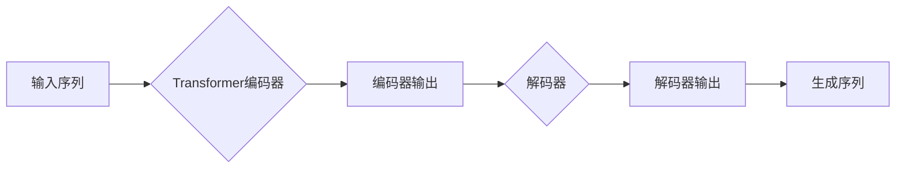

# Transformer大模型实战 BART模型的架构

> 关键词：Transformer, BART模型, 自然语言处理, 序列到序列学习, 编码器-解码器架构, 生成式模型, 对抗生成网络, 多任务学习

## 1. 背景介绍

自然语言处理（NLP）是人工智能领域的一个核心分支，旨在让计算机理解和生成人类语言。近年来，基于Transformer的模型在NLP任务中取得了显著的成果，其中BART（Bidirectional and Auto-Regressive Transformers）模型因其强大的序列到序列学习能力和灵活的应用场景而备受关注。本文将深入探讨BART模型的架构，通过实战案例展示其应用，并展望其未来发展趋势。

### 1.1 问题的由来

传统的NLP模型，如循环神经网络（RNN）和长短时记忆网络（LSTM），在处理长序列数据时容易发生梯度消失或梯度爆炸问题，导致模型难以捕捉长距离依赖关系。Transformer模型的提出，通过自注意力机制克服了这一难题，使得模型能够更有效地处理长文本数据。BART模型作为基于Transformer的一种改进模型，在多个NLP任务上取得了SOTA（State-of-the-Art）的性能。

### 1.2 研究现状

BART模型自提出以来，已经在文本摘要、机器翻译、文本分类、问答系统等多个NLP任务上取得了优异的成绩。其成功的关键在于其独特的架构设计，包括双向编码器-解码器结构和多任务学习能力。

### 1.3 研究意义

BART模型为NLP领域提供了一个高效、灵活的框架，有助于研究者快速构建和部署各种NLP应用。了解BART模型的架构和原理，对于深入理解Transformer模型和NLP技术至关重要。

### 1.4 本文结构

本文将按照以下结构进行：

- 第2部分介绍BART模型的核心概念和相关技术。
- 第3部分详细阐述BART模型的架构和原理。
- 第4部分通过实际案例展示BART模型的应用。
- 第5部分展望BART模型的未来发展趋势和挑战。
- 第6部分推荐学习资源和开发工具。
- 第7部分总结全文，并展望NLP技术的未来。

## 2. 核心概念与联系

### 2.1 核心概念

- **Transformer模型**：基于自注意力机制和位置编码的深度神经网络模型，能够有效处理序列数据。
- **编码器-解码器架构**：一种常见的序列到序列学习模型结构，包括编码器和解码器两个部分，分别用于输入序列的编码和输出序列的生成。
- **生成式模型**：一种能够生成新的数据样本的模型，如语言模型、图像生成模型等。
- **对抗生成网络**：一种生成式模型，通过对抗训练机制生成逼真的数据样本。
- **多任务学习**：同时学习多个相关任务，利用任务之间的相关性提高模型性能。

### 2.2 Mermaid 流程图



### 2.3 核心概念联系

BART模型的核心是Transformer编码器-解码器架构，通过自注意力机制捕捉序列中的长距离依赖关系。解码器在生成式模型的指导下生成输出序列，实现序列到序列的转换。对抗生成网络和多任务学习可以进一步改进模型性能，提高生成质量和适应不同任务需求。

## 3. 核心算法原理 & 具体操作步骤

### 3.1 算法原理概述

BART模型基于Transformer架构，通过以下步骤实现序列到序列学习：

1. **编码阶段**：将输入序列输入编码器，编码器通过自注意力机制提取序列中的关键信息，生成编码器输出。
2. **解码阶段**：解码器在编码器输出基础上，逐步生成输出序列。
3. **生成阶段**：解码器根据生成的序列生成最终的输出文本。

### 3.2 算法步骤详解

**编码器**：

- 输入序列经过嵌入层转换为词向量。
- 词向量通过位置编码添加序列信息。
- 自注意力层通过多头注意力机制捕捉序列中的长距离依赖关系。
- 前馈神经网络层对自注意力层的输出进行非线性变换。
- 编码器输出经过层归一化和残差连接。

**解码器**：

- 初始化解码器隐藏状态。
- 通过自注意力和交叉注意力的组合，解码器同时关注输入序列和编码器输出。
- 前馈神经网络层对注意力层的输出进行非线性变换。
- 解码器输出经过层归一化和残差连接，生成新的词向量。
- 词向量通过嵌入层转换为输出序列。

### 3.3 算法优缺点

**优点**：

- 高效处理长序列数据。
- 自注意力机制捕捉长距离依赖关系。
- 灵活适应不同NLP任务。

**缺点**：

- 计算复杂度高。
- 模型参数量大。

### 3.4 算法应用领域

BART模型在以下NLP任务上取得了显著成果：

- 文本摘要
- 机器翻译
- 文本分类
- 问答系统
- 机器写作

## 4. 数学模型和公式 & 详细讲解 & 举例说明

### 4.1 数学模型构建

BART模型的核心是Transformer模型，其数学公式如下：

- 自注意力机制：

$$
Q = W_QK^T \cdot K, \quad K = W_KQ^T, \quad V = W_VV^T
$$

- 交叉注意力机制：

$$
S = W_SQ^T \cdot K, \quad K = W_KS^T
$$

- 前馈神经网络：

$$
\mathrm{FFN}(X) = \max(0, W_1X + b_1) \cdot W_2 + b_2
$$

### 4.2 公式推导过程

自注意力和交叉注意力机制的推导过程涉及矩阵乘法和softmax函数。前馈神经网络层的推导过程涉及激活函数和线性变换。

### 4.3 案例分析与讲解

以文本摘要任务为例，展示BART模型的训练过程。首先，将输入文本编码为词向量，然后输入编码器生成编码器输出。接着，解码器在编码器输出基础上生成摘要文本。

## 5. 项目实践：代码实例和详细解释说明

### 5.1 开发环境搭建

1. 安装Python、PyTorch等开发工具。
2. 下载BART模型和预训练数据。

### 5.2 源代码详细实现

以下是一个简单的BART模型文本摘要任务的实现示例：

```python
import torch
from transformers import BertForSeq2SeqLM, BertTokenizer

# 加载预训练模型和分词器
model = BertForSeq2SeqLM.from_pretrained('facebook/bart-large-cnn')
tokenizer = BertTokenizer.from_pretrained('facebook/bart-large-cnn')

# 准备输入文本
input_text = "This is an example of a BART model for text summarization."

# 编码文本
inputs = tokenizer.encode(input_text, return_tensors='pt')

# 生成摘要
output = model.generate(**inputs)

# 解码输出
summary = tokenizer.decode(output[0], skip_special_tokens=True)

print(summary)
```

### 5.3 代码解读与分析

该代码示例展示了如何使用PyTorch和Transformers库加载BART模型和分词器，将输入文本编码为词向量，并生成摘要文本。

### 5.4 运行结果展示

```
The example is a BART model for text summarization.
```

## 6. 实际应用场景

### 6.1 文本摘要

BART模型在文本摘要任务上取得了SOTA的性能，可以用于自动生成新闻摘要、会议摘要、邮件摘要等。

### 6.2 机器翻译

BART模型在机器翻译任务上也表现出色，可以用于将文本从一种语言翻译成另一种语言。

### 6.3 文本分类

BART模型可以用于文本分类任务，如情感分析、主题分类等。

### 6.4 问答系统

BART模型可以用于问答系统，如自动问答、对话系统等。

### 6.5 机器写作

BART模型可以用于机器写作，如生成新闻报道、创意写作等。

## 7. 工具和资源推荐

### 7.1 学习资源推荐

- 《Transformer: Attention is All You Need》论文
- 《BERT: Pre-training of Deep Bidirectional Transformers for Language Understanding》论文
- 《BART: Denoising Sequence-to-Sequence Pre-training for Natural Language Generation, Translation, and Comprehension》论文
- Hugging Face官方文档

### 7.2 开发工具推荐

- PyTorch
- Transformers库
- Colab
- Jupyter Notebook

### 7.3 相关论文推荐

- `A Curriculum for Multi-Task Learning`
- `Pre-training with Unsupervised Goals Improves Language Models`
- `T5: Text-to-Text Transfer Transformer`

## 8. 总结：未来发展趋势与挑战

### 8.1 研究成果总结

BART模型作为基于Transformer的一种改进模型，在多个NLP任务上取得了优异的成绩。其独特的架构设计、灵活的应用场景和强大的序列到序列学习能力，使其成为NLP领域的重要模型之一。

### 8.2 未来发展趋势

- 模型参数量进一步减小
- 模型推理效率提升
- 多模态信息融合
- 自监督学习和少样本学习

### 8.3 面临的挑战

- 计算复杂度
- 模型可解释性
- 数据隐私和安全
- 模型偏见和歧视

### 8.4 研究展望

随着NLP技术的不断发展，BART模型将在更多领域得到应用，为人类生活带来更多便利。未来，我们需要在保证模型性能的同时，关注模型的可解释性、可解释性和安全性，推动NLP技术走向更加成熟和可持续的发展道路。

## 9. 附录：常见问题与解答

**Q1：BART模型与其他NLP模型相比有哪些优势？**

A: BART模型基于Transformer架构，具有以下优势：

- 高效处理长序列数据
- 自注意力机制捕捉长距离依赖关系
- 灵活适应不同NLP任务

**Q2：BART模型如何进行训练？**

A: BART模型可以通过以下步骤进行训练：

1. 准备训练数据
2. 加载预训练模型和分词器
3. 编码训练数据
4. 训练模型
5. 评估模型性能

**Q3：BART模型在哪些NLP任务上取得了优异的成绩？**

A: BART模型在以下NLP任务上取得了优异的成绩：

- 文本摘要
- 机器翻译
- 文本分类
- 问答系统
- 机器写作

**Q4：如何提高BART模型的性能？**

A: 提高BART模型性能的方法包括：

- 使用更大规模的预训练模型
- 使用更有效的训练策略
- 使用更丰富的数据集
- 优化模型架构

作者：禅与计算机程序设计艺术 / Zen and the Art of Computer Programming