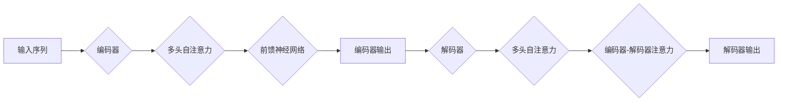

> 关键词：Transformer, 大模型, 自定义模型, 预训练, 微调, 自然语言处理, NLP, 代码实战

# Transformer大模型实战：加载自定义模型

> Transformer自提出以来，已成为自然语言处理（NLP）领域的事实标准。本文将深入探讨Transformer大模型的实战应用，重点讲解如何加载和定制自己的模型。通过本文的学习，读者将能够掌握从模型加载到微调的完整流程，并能够根据实际需求调整和优化模型，以满足特定任务的性能需求。

## 1. 背景介绍

自2017年Transformer模型提出以来，它在NLP领域取得了革命性的突破。Transformer模型因其并行计算的优势、端到端的学习方式以及对长距离依赖的有效处理，迅速成为NLP任务的首选模型。然而，通用的大模型往往在特定领域或任务上缺乏针对性，因此，如何加载和定制自己的Transformer模型，以满足特定需求，成为当前研究的热点。

## 2. 核心概念与联系

### 2.1 Transformer模型原理

Transformer模型基于自注意力（Self-Attention）机制，它通过计算序列中每个元素与其余元素之间的注意力分数，来聚合信息并生成表示。这种机制使得模型能够有效地处理长距离依赖问题。

Mermaid流程图如下：



### 2.2 预训练与微调

预训练是指在大量的无标签数据上训练模型，使其学习到通用语言特征。微调则是基于预训练模型和少量有标签数据进行进一步训练，以适应特定任务。

### 2.3 自定义模型

自定义模型指的是在预训练模型的基础上，根据特定需求进行调整和优化，例如调整模型架构、替换部分模块或添加新功能。

## 3. 核心算法原理 & 具体操作步骤

### 3.1 算法原理概述

Transformer模型主要由编码器和解码器两部分组成。编码器负责将输入序列编码成固定长度的向量表示，解码器则负责根据编码器的输出生成文本。

### 3.2 算法步骤详解

1. **加载预训练模型**：从预训练模型库中加载预训练的Transformer模型，例如BERT、GPT等。
2. **选择任务适配层**：根据具体任务，选择合适的任务适配层，例如分类器、回归器等。
3. **微调模型**：在少量有标签数据上对模型进行微调，优化模型参数。
4. **评估模型**：在验证集上评估模型性能，并根据评估结果调整模型参数或结构。

### 3.3 算法优缺点

**优点**：

* **强大的语言理解能力**：预训练模型在大量文本数据上学习到的通用语言特征，使得模型在NLP任务上具有强大的性能。
* **端到端学习**：Transformer模型能够直接从输入序列生成输出序列，无需进行复杂的序列到序列转换。
* **并行计算**：Transformer模型的结构使得其能够并行处理序列中的每个元素，提高了计算效率。

**缺点**：

* **计算复杂度较高**：Transformer模型参数量庞大，计算复杂度高，需要大量的计算资源。
* **内存消耗大**：模型参数量庞大，导致内存消耗大，对硬件要求较高。

### 3.4 算法应用领域

Transformer模型在NLP领域有着广泛的应用，包括：

* **文本分类**：如新闻分类、情感分析、垃圾邮件检测等。
* **序列到序列任务**：如机器翻译、摘要生成、对话系统等。
* **文本生成**：如文本摘要、对话生成、诗歌创作等。

## 4. 数学模型和公式 & 详细讲解 & 举例说明

### 4.1 数学模型构建

Transformer模型的核心是多头自注意力机制，其计算公式如下：

$$
Q = W_QK^T
$$

$$
K = W_KQ
$$

$$
V = W_VQ
$$

其中，$W_Q, W_K, W_V$ 分别是查询、键和值矩阵，$Q, K, V$ 分别是查询、键和值向量。

### 4.2 公式推导过程

多头自注意力机制的推导过程较为复杂，涉及矩阵分解、求和、乘法等操作。具体推导过程可参考相关论文。

### 4.3 案例分析与讲解

以BERT模型为例，介绍如何使用PyTorch加载和微调BERT模型。

```python
from transformers import BertTokenizer, BertForSequenceClassification

# 加载预训练模型和分词器
tokenizer = BertTokenizer.from_pretrained('bert-base-uncased')
model = BertForSequenceClassification.from_pretrained('bert-base-uncased', num_labels=2)

# 加载数据集
train_dataset = ...
test_dataset = ...

# 定义训练函数
def train_epoch(model, dataset, batch_size, optimizer):
    ...
    # 训练过程
    ...

# 训练模型
optimizer = ...
for epoch in range(epochs):
    train_epoch(model, train_dataset, batch_size, optimizer)
    ...
```

## 5. 项目实践：代码实例和详细解释说明

### 5.1 开发环境搭建

1. 安装PyTorch：`pip install torch`
2. 安装Transformers库：`pip install transformers`

### 5.2 源代码详细实现

以下是一个使用PyTorch和Transformers库加载和微调BERT模型的简单示例：

```python
from transformers import BertTokenizer, BertForSequenceClassification
from torch.utils.data import DataLoader, Dataset
import torch

# 加载预训练模型和分词器
tokenizer = BertTokenizer.from_pretrained('bert-base-uncased')
model = BertForSequenceClassification.from_pretrained('bert-base-uncased', num_labels=2)

# 定义数据集
class CustomDataset(Dataset):
    def __init__(self, texts, labels):
        self.texts = texts
        self.labels = labels

    def __len__(self):
        return len(self.texts)

    def __getitem__(self, idx):
        return tokenizer(self.texts[idx], return_tensors='pt', padding=True, truncation=True)[0], self.labels[idx]

# 创建数据集
train_dataset = CustomDataset(train_texts, train_labels)
test_dataset = CustomDataset(test_texts, test_labels)

# 创建DataLoader
train_loader = DataLoader(train_dataset, batch_size=16, shuffle=True)
test_loader = DataLoader(test_dataset, batch_size=16)

# 定义优化器
optimizer = torch.optim.AdamW(model.parameters(), lr=2e-5)

# 训练模型
for epoch in range(epochs):
    model.train()
    for batch in train_loader:
        inputs, labels = batch
        outputs = model(**inputs, labels=labels)
        loss = outputs.loss
        loss.backward()
        optimizer.step()
        optimizer.zero_grad()
```

### 5.3 代码解读与分析

1. **加载预训练模型和分词器**：使用Transformers库加载预训练的BERT模型和分词器。
2. **定义数据集**：自定义数据集类，实现`__init__`、`__len__`和`__getitem__`方法。
3. **创建数据加载器**：使用DataLoader将数据集分批次加载。
4. **定义优化器**：使用AdamW优化器进行参数更新。
5. **训练模型**：循环遍历数据集，进行前向传播、反向传播和参数更新。

### 5.4 运行结果展示

通过训练模型，可以在测试集上评估模型性能，例如计算准确率、召回率等指标。

## 6. 实际应用场景

Transformer大模型在NLP领域有着广泛的应用，以下列举一些实际应用场景：

* **文本分类**：用于对新闻、评论等进行分类，例如判断文本是正面、中性还是负面。
* **机器翻译**：将一种语言的文本翻译成另一种语言。
* **文本摘要**：将长文本压缩成简短的摘要。
* **问答系统**：回答用户提出的问题。
* **对话系统**：与用户进行自然语言对话。

## 7. 工具和资源推荐

### 7.1 学习资源推荐

* 《深度学习自然语言处理》
* 《NLP进展》
* 《Transformer论文解读》

### 7.2 开发工具推荐

* PyTorch
* Transformers库
* Hugging Face Model Hub

### 7.3 相关论文推荐

* Attention is All You Need
* BERT: Pre-training of Deep Bidirectional Transformers for Language Understanding
* GPT-3: Language Models are Few-Shot Learners

## 8. 总结：未来发展趋势与挑战

### 8.1 研究成果总结

本文介绍了Transformer大模型的实战应用，包括模型加载、微调和定制。通过学习和实践，读者能够掌握从模型加载到微调的完整流程，并能够根据实际需求调整和优化模型。

### 8.2 未来发展趋势

* **模型规模持续增大**：随着计算能力的提升，未来会有更多规模更大的预训练模型出现。
* **模型多样化**：除了Transformer模型，其他类型的模型，如RNN、LSTM等，也会得到进一步研究和应用。
* **多模态融合**：将文本、图像、音频等多种模态信息融合，构建更加智能的模型。

### 8.3 面临的挑战

* **计算资源消耗**：大规模预训练模型需要大量的计算资源。
* **数据隐私**：预训练模型需要大量的文本数据，如何保护用户隐私是一个重要问题。
* **模型可解释性**：如何提高模型的透明度和可解释性，是一个重要的研究方向。

### 8.4 研究展望

未来，Transformer大模型将在NLP领域发挥越来越重要的作用。随着技术的不断发展，我们将能够构建更加智能、高效、可解释的NLP模型，为人类社会带来更多便利。

## 9. 附录：常见问题与解答

**Q1：如何选择合适的预训练模型**？

A：选择合适的预训练模型需要根据具体任务和数据特点进行考虑。对于通用性强的任务，可以选择BERT、GPT等通用预训练模型；对于特定领域任务，可以选择针对该领域预训练的模型。

**Q2：如何调整预训练模型的结构**？

A：可以通过修改模型参数、增加或减少层、替换部分模块等方式调整预训练模型的结构。

**Q3：如何微调预训练模型**？

A：在少量有标签数据上，使用交叉熵损失函数对预训练模型进行微调。

**Q4：如何评估预训练模型**？

A：可以通过在验证集上评估模型的准确率、召回率、F1值等指标来评估预训练模型。

**Q5：如何提高预训练模型的效率**？

A：可以通过量化、剪枝、模型压缩等方法提高预训练模型的效率。

---

作者：禅与计算机程序设计艺术 / Zen and the Art of Computer Programming