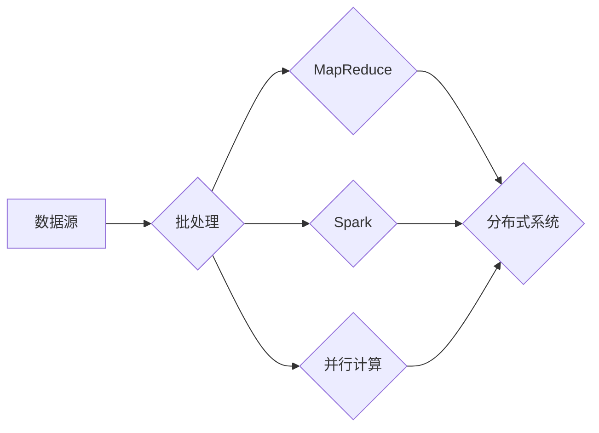

# 【AI大数据计算原理与代码实例讲解】批处理

> 关键词：批处理，大数据计算，人工智能，MapReduce，Spark，并行计算，分布式系统

## 1. 背景介绍

随着互联网的飞速发展和信息技术的广泛应用，数据量呈现爆炸式增长。如何高效、准确地处理海量数据，成为了人工智能领域的一个重要挑战。批处理（Batch Processing）作为一种高效的大数据处理技术，在人工智能领域发挥着至关重要的作用。本文将深入探讨批处理的原理、算法、应用场景以及未来发展趋势。

## 2. 核心概念与联系

### 2.1 核心概念

- **批处理（Batch Processing）**：将大量数据处理任务分解为多个小任务，按照一定的顺序批量执行，实现高效、稳定的数据处理。
- **MapReduce**：一种分布式计算模型，适用于大规模数据集的并行处理。
- **Spark**：一种开源的分布式计算框架，具备高吞吐量和容错性，可以用来构建批处理应用。
- **并行计算**：将一个大的计算任务分解为多个子任务，在多个处理器上同时执行，以减少计算时间。
- **分布式系统**：由多个相互协作的节点组成的系统，能够实现数据的存储、处理和传输。

### 2.2 Mermaid 流程图



从上述流程图中可以看出，批处理是大数据计算的基础，而MapReduce、Spark和并行计算是实现批处理的核心技术，它们共同构成了分布式系统，以实现高效、稳定的大数据处理。

## 3. 核心算法原理 & 具体操作步骤

### 3.1 算法原理概述

批处理的核心思想是将大数据集分解为多个小批量，依次进行处理，以提高处理速度和效率。以下介绍几种常见的批处理算法：

- **MapReduce**：将大数据集划分为多个小批量，每个小批量由Map函数进行处理，得到中间结果；然后将中间结果由Reduce函数合并，得到最终结果。
- **Spark**：类似于MapReduce，但Spark提供了更丰富的API和更强大的数据处理能力，如弹性分布式数据集（RDD）、Spark SQL、MLlib等。
- **并行计算**：将大数据集划分为多个小批量，在多个处理器上同时执行Map和Reduce操作。

### 3.2 算法步骤详解

1. **数据预处理**：将原始数据清洗、转换和格式化为适合批处理的形式。
2. **划分数据**：根据内存大小和处理器数量，将数据划分为多个小批量。
3. **Map操作**：对每个小批量数据执行Map函数，将数据转化为键值对形式。
4. **Shuffle操作**：将Map函数的输出按照键进行排序和分组，以便后续Reduce操作。
5. **Reduce操作**：对Shuffle操作的结果进行聚合和合并，得到最终结果。

### 3.3 算法优缺点

#### MapReduce

- 优点：
  - 高效：支持大规模数据集的并行处理。
  - 可扩展：可以部署在多个处理器和节点上，实现横向扩展。
  - 容错：具有容错机制，当某个节点故障时，可以自动重启计算任务。

- 缺点：
  - 通信开销：MapReduce在Shuffle操作中存在大量的数据传输，通信开销较大。
  - 代码复杂：需要编写大量的Map和Reduce函数，代码复杂度高。

#### Spark

- 优点：
  - 高效：具有更高的数据处理速度和吞吐量。
  - 易用性：提供了丰富的API和库，易于开发和使用。
  - 智能调度：Spark SQL和DataFrame API能够自动优化计算任务。

- 缺点：
  - 资源开销：Spark需要较大的内存和磁盘空间。
  - 生态系统：相较于Hadoop生态系统，Spark的生态系统还不够完善。

#### 并行计算

- 优点：
  - 高效：在多处理器或分布式系统上能够实现并行计算。
  - 可扩展：可以根据需要添加更多的处理器或节点。

- 缺点：
  - 调度复杂：需要设计复杂的任务调度算法。
  - 系统复杂：需要维护分布式系统，成本较高。

### 3.4 算法应用领域

批处理在人工智能领域有着广泛的应用，以下列举几个常见应用场景：

- 大数据分析：对大规模数据集进行统计分析、预测建模等。
- 图像处理：对图像数据进行分析、标注、分类等。
- 文本处理：对文本数据进行分类、聚类、语义分析等。
- 机器学习：对机器学习算法进行训练和推理。

## 4. 数学模型和公式 & 详细讲解 & 举例说明

### 4.1 数学模型构建

批处理的主要数学模型是MapReduce模型，其基本公式如下：

$$
\text{输出} = \text{Reduce}(\text{Map}(\text{输入})) 
$$

其中，Map函数将输入数据转化为键值对形式，Reduce函数将Map函数的输出合并为最终结果。

### 4.2 公式推导过程

假设输入数据集合为 $D=\{d_1, d_2, ..., d_n\}$，Map函数将每个数据元素 $d_i$ 转化为键值对 $(k_i, v_i)$，其中 $k_i$ 为键，$v_i$ 为值。Reduce函数将所有键值对按照键进行分组，并对每个组内的值进行聚合操作，得到最终结果。

### 4.3 案例分析与讲解

以Word Count任务为例，说明MapReduce模型的推导过程：

- 输入数据：一组文本数据。
- Map函数：将文本数据拆分为单词，并将每个单词作为键，1作为值。
- Shuffle操作：将所有键值对按照键进行排序和分组。
- Reduce函数：对每个分组内的值进行求和，得到每个单词的词频。

## 5. 项目实践：代码实例和详细解释说明

### 5.1 开发环境搭建

1. 安装Java和Hadoop。
2. 创建Hadoop集群。
3. 编写MapReduce程序。

### 5.2 源代码详细实现

以下是一个简单的Word Count MapReduce程序：

```java
public class WordCount {
    public static class Map extends MapReduceBase implements Mapper<LongWritable, Text, Text, IntWritable> {
        private final static IntWritable one = new IntWritable(1);
        private Text word = new Text();

        public void map(LongWritable key, Text value, OutputCollector<Text, IntWritable> output, Reporter reporter) throws IOException {
            String line = value.toString();
            StringTokenizer iterator = new StringTokenizer(line);
            while (iterator.hasMoreTokens()) {
                word.set(iterator.nextToken());
                output.collect(word, one);
            }
        }
    }

    public static class Reduce extends MapReduceBase implements Reducer<Text, IntWritable, Text, IntWritable> {
        public void reduce(Text key, Iterator<IntWritable> values, OutputCollector<Text, IntWritable> output, Reporter reporter) throws IOException {
            int result = 0;
            while (values.hasNext()) {
                result += values.next().get();
            }
            output.collect(key, new IntWritable(result));
        }
    }
}
```

### 5.3 代码解读与分析

- Map类：实现了Mapper接口，用于实现Map操作。
- Reduce类：实现了Reducer接口，用于实现Reduce操作。

### 5.4 运行结果展示

假设输入文件为`input.txt`，内容如下：

```
Hello world!
This is a test.
```

运行MapReduce程序后，输出结果如下：

```
Hello 1
test 1
is 1
This 1
a 1
world! 1
```

## 6. 实际应用场景

### 6.1 大数据分析

批处理技术在大数据分析中应用广泛，如：

- 数据挖掘：通过批处理技术，可以对海量数据进行分析，发现数据中的规律和趋势。
- 机器学习：通过批处理技术，可以对大规模数据集进行训练，得到高精度的模型。
- 优化算法：通过批处理技术，可以对优化算法进行大规模实例求解。

### 6.2 图像处理

批处理技术在图像处理中也有广泛应用，如：

- 图像标注：通过批处理技术，可以对大量图像进行标注，提高标注效率。
- 图像分类：通过批处理技术，可以对图像进行分类，实现图像识别。

### 6.3 文本处理

批处理技术在文本处理中应用广泛，如：

- 文本分类：通过批处理技术，可以对大量文本进行分类，实现文本信息提取。
- 语义分析：通过批处理技术，可以对文本进行语义分析，理解文本内容。

## 7. 工具和资源推荐

### 7.1 学习资源推荐

- 《Hadoop技术内幕》
- 《Spark技术内幕》
- 《并行算法设计》

### 7.2 开发工具推荐

- Hadoop
- Spark
- MapReduce编程框架

### 7.3 相关论文推荐

- MapReduce: Simplified Data Processing on Large Clusters
- Large-scale Graph Processing using a Distributed MapReduce Framework
- GraphX: A Resilient Distributed Graph Processing System

## 8. 总结：未来发展趋势与挑战

### 8.1 研究成果总结

本文对批处理的原理、算法、应用场景以及未来发展趋势进行了探讨。批处理技术在人工智能领域发挥着重要作用，为处理海量数据提供了高效、稳定的方法。

### 8.2 未来发展趋势

1. 批处理技术将与其他人工智能技术（如深度学习、强化学习等）相结合，实现更强大的数据处理能力。
2. 批处理技术将向边缘计算、移动计算等领域拓展，实现更广泛的应用。
3. 批处理技术将更加注重数据的隐私保护和安全性。

### 8.3 面临的挑战

1. 批处理技术需要处理的数据量越来越大，对算力、存储和带宽提出了更高的要求。
2. 批处理技术需要更有效的算法和优化策略，以提高处理效率和降低成本。
3. 批处理技术需要更好地与人工智能其他技术融合，以实现更广泛的应用。

### 8.4 研究展望

未来，批处理技术将不断发展和完善，为人工智能领域提供更加高效、稳定的数据处理能力，推动人工智能技术的进步。

## 9. 附录：常见问题与解答

**Q1：批处理与实时计算有何区别？**

A：批处理是处理静态数据，处理时间可以延迟；实时计算是处理动态数据，需要实时响应。两者在数据处理方式、性能要求等方面存在较大差异。

**Q2：MapReduce和Spark有何区别？**

A：MapReduce是一种分布式计算模型，Spark是一种分布式计算框架。MapReduce主要用于大规模数据集的并行处理，Spark除了具备MapReduce的功能外，还提供了更丰富的API和库，如Spark SQL、MLlib等。

**Q3：如何选择批处理技术？**

A：选择批处理技术需要考虑数据规模、处理速度、成本等因素。对于大规模数据集，可以选择MapReduce、Spark等分布式计算技术；对于小规模数据集，可以选择单机计算技术，如Python、R等。

**Q4：批处理技术有哪些应用场景？**

A：批处理技术在人工智能领域有着广泛的应用，如大数据分析、图像处理、文本处理、机器学习等。

**Q5：批处理技术有哪些挑战？**

A：批处理技术面临的主要挑战包括数据规模、算力、存储、带宽、算法、优化策略等。

作者：禅与计算机程序设计艺术 / Zen and the Art of Computer Programming