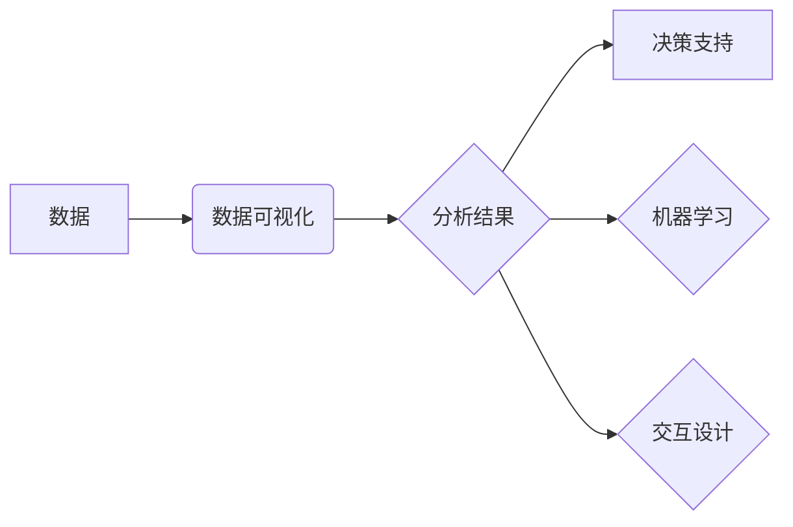

# 【AI大数据计算原理与代码实例讲解】数据可视化

> 关键词：数据可视化，大数据，AI，可视化工具，可视化库，数据分析，数据探索，交互式可视化

## 1. 背景介绍

随着信息时代的到来，数据已经成为现代社会的核心资产。大数据的规模和复杂性日益增加，如何有效地分析和理解这些数据变得至关重要。数据可视化作为一种将复杂数据以图形或图像形式呈现的技术，已经成为数据分析不可或缺的工具。本文将深入探讨数据可视化的原理、方法、工具以及其在AI大数据计算中的应用，并通过实例讲解如何使用代码实现数据可视化。

### 1.1 数据可视化的由来

数据可视化起源于统计图表和图形的早期形式。随着计算机技术的发展，数据可视化工具和库不断涌现，使得数据可视化变得更加高效和直观。如今，数据可视化已经成为数据分析、商业智能和决策支持的重要组成部分。

### 1.2 数据可视化的研究现状

目前，数据可视化技术已经取得了显著的进展。从简单的图表到复杂的交互式可视化，从静态图像到动态动画，数据可视化工具和库为用户提供了丰富的选择。同时，随着AI技术的发展，数据可视化开始与机器学习、深度学习等技术相结合，为数据分析提供了新的视角和方法。

### 1.3 研究意义

数据可视化在以下几个方面具有重要意义：

- 帮助用户快速理解和发现数据中的模式、趋势和异常。
- 支持决策者制定更加科学和合理的决策。
- 促进跨学科交流和知识共享。
- 提高数据分析和报告的效率和质量。

### 1.4 本文结构

本文将按照以下结构进行：

- 介绍数据可视化的核心概念和联系。
- 阐述数据可视化的核心算法原理和具体操作步骤。
- 讲解数学模型和公式，并通过实例进行说明。
- 展示项目实践：代码实例和详细解释说明。
- 探讨数据可视化的实际应用场景和未来应用展望。
- 推荐学习资源、开发工具和相关论文。
- 总结数据可视化的发展趋势与挑战。
- 提供常见问题与解答。

## 2. 核心概念与联系

### 2.1 数据可视化的核心概念

#### 数据可视化

数据可视化是指将数据以图形、图像等形式呈现，帮助用户理解数据内容和关系的过程。

#### 数据

数据是客观存在的事实和信息的集合，可以是数值、文本、图像等多种形式。

#### 可视化

可视化是指将抽象的数据转化为直观的图形或图像，以便于用户理解和分析。

### 2.2 数据可视化的联系

#### 数据可视化与数据分析

数据可视化是数据分析的重要组成部分，它帮助数据分析师发现数据中的模式和趋势。

#### 数据可视化与机器学习

数据可视化可以用于机器学习的模型解释和特征工程。

#### 数据可视化与决策支持

数据可视化可以帮助决策者更好地理解数据，从而做出更加合理的决策。

#### 数据可视化与交互设计

数据可视化可以用于交互式设计，为用户提供更加直观和易用的界面。

### 2.3 Mermaid 流程图



## 3. 核心算法原理 & 具体操作步骤

### 3.1 算法原理概述

数据可视化的核心算法包括：

- 数据抽取：从原始数据中提取所需的信息。
- 数据转换：将数据转换为适合可视化的格式。
- 数据映射：将数据映射到视觉元素（如颜色、形状、大小等）。
- 可视化呈现：将数据以图形或图像的形式呈现。

### 3.2 算法步骤详解

#### 步骤 1：数据抽取

数据抽取是指从原始数据集中提取所需的信息。这可以通过编程或使用数据处理工具实现。

#### 步骤 2：数据转换

数据转换是指将数据转换为适合可视化的格式。这包括数据清洗、归一化、聚合等操作。

#### 步骤 3：数据映射

数据映射是指将数据映射到视觉元素。这可以通过选择合适的可视化图表类型和颜色方案实现。

#### 步骤 4：可视化呈现

可视化呈现是指将数据以图形或图像的形式呈现。这可以通过使用可视化工具或库实现。

### 3.3 算法优缺点

#### 优点

- 直观易懂，易于用户理解。
- 可以发现数据中的模式和趋势。
- 支持决策支持。

#### 缺点

- 可视化设计需要专业技能。
- 可视化结果可能受到主观因素的影响。
- 可视化效果可能受到数据质量和图表类型的影响。

### 3.4 算法应用领域

数据可视化在以下领域有广泛的应用：

- 统计分析
- 金融分析
- 医疗保健
- 物流
- 教育

## 4. 数学模型和公式 & 详细讲解 & 举例说明

### 4.1 数学模型构建

数据可视化的数学模型主要包括：

- 统计模型：用于描述数据的分布和关系。
- 几何模型：用于描述图形和图像的几何属性。
- 优化模型：用于优化可视化效果。

### 4.2 公式推导过程

以下是一个简单的线性回归模型的公式推导过程：

$$
y = \beta_0 + \beta_1x + \epsilon
$$

其中，$y$ 是因变量，$x$ 是自变量，$\beta_0$ 和 $\beta_1$ 是回归系数，$\epsilon$ 是误差项。

### 4.3 案例分析与讲解

假设我们有一组数据，表示销售额与广告费用之间的关系。我们可以使用散点图来可视化这些数据，并通过线性回归模型拟合数据。

```python
import matplotlib.pyplot as plt
import numpy as np

# 数据
x = np.array([1, 2, 3, 4, 5])
y = np.array([2, 4, 5, 4, 5])

# 绘制散点图
plt.scatter(x, y)
plt.xlabel('广告费用')
plt.ylabel('销售额')
plt.title('广告费用与销售额关系')
plt.show()

# 线性回归
from sklearn.linear_model import LinearRegression

model = LinearRegression()
model.fit(x.reshape(-1, 1), y)

# 拟合数据
x_fit = np.linspace(0, 5, 100)
y_fit = model.predict(x_fit.reshape(-1, 1))

# 绘制拟合线
plt.scatter(x, y)
plt.plot(x_fit, y_fit, color='red')
plt.xlabel('广告费用')
plt.ylabel('销售额')
plt.title('广告费用与销售额关系')
plt.show()
```

## 5. 项目实践：代码实例和详细解释说明

### 5.1 开发环境搭建

在进行数据可视化项目实践之前，我们需要搭建以下开发环境：

- Python 3.x
- NumPy
- Matplotlib
- Seaborn
- Pandas

### 5.2 源代码详细实现

以下是一个使用Matplotlib和Seaborn进行数据可视化的示例代码：

```python
import matplotlib.pyplot as plt
import seaborn as sns
import pandas as pd

# 加载数据
data = pd.read_csv('data.csv')

# 绘制散点图
sns.scatterplot(x='广告费用', y='销售额', data=data)

# 添加标题和标签
plt.title('广告费用与销售额关系')
plt.xlabel('广告费用')
plt.ylabel('销售额')

# 显示图形
plt.show()
```

### 5.3 代码解读与分析

- 导入必要的库：Matplotlib、Seaborn和Pandas。
- 加载数据：使用Pandas读取CSV文件。
- 绘制散点图：使用Seaborn的scatterplot函数绘制散点图。
- 添加标题和标签：使用Matplotlib的title、xlabel和ylabel函数添加标题和标签。
- 显示图形：使用Matplotlib的show函数显示图形。

### 5.4 运行结果展示

运行上述代码将生成一个散点图，展示广告费用与销售额之间的关系。

## 6. 实际应用场景

### 6.1 商业分析

数据可视化在商业分析中有着广泛的应用，例如：

- 销售趋势分析
- 客户细分
- 市场需求分析

### 6.2 金融分析

数据可视化在金融分析中可以用于：

- 股票价格分析
- 风险管理
- 投资组合优化

### 6.3 医疗保健

数据可视化在医疗保健中可以用于：

- 疾病趋势分析
- 患者治疗结果分析
- 医疗资源分配

### 6.4 未来应用展望

随着AI和大数据技术的发展，数据可视化将在以下领域得到更广泛的应用：

- 智能交通
- 环境监测
- 能源管理

## 7. 工具和资源推荐

### 7.1 学习资源推荐

- 《数据可视化：原理与实践》
- 《数据可视化之美》
- 《Matplotlib实战》
- 《Seaborn实战》

### 7.2 开发工具推荐

- Matplotlib
- Seaborn
- Plotly
- Tableau

### 7.3 相关论文推荐

- "Visualizing Data: A Piece of cake with matplotlib" by B. Granger
- "Statistical Data Visualization: Design and Representation" by J. W. Emerson
- "Data Visualization in Python with Matplotlib and Seaborn" by F. Charles

## 8. 总结：未来发展趋势与挑战

### 8.1 研究成果总结

本文介绍了数据可视化的原理、方法、工具以及其在AI大数据计算中的应用。通过实例讲解，展示了如何使用代码实现数据可视化。

### 8.2 未来发展趋势

- 交互式可视化
- 多模态可视化
- 自动化可视化
- 可视化解释

### 8.3 面临的挑战

- 可视化设计
- 数据质量和准确性
- 可视化解释

### 8.4 研究展望

随着AI和大数据技术的不断发展，数据可视化将在未来发挥更加重要的作用。

## 9. 附录：常见问题与解答

**Q1：数据可视化有哪些类型？**

A1：数据可视化主要有以下类型：

- 散点图
- 折线图
- 饼图
- 条形图
- 雷达图
- 热力图

**Q2：如何选择合适的可视化图表？**

A2：选择合适的可视化图表需要考虑以下因素：

- 数据类型
- 数据分布
- 数据关系
- 可视化目的

**Q3：数据可视化有哪些挑战？**

A3：数据可视化面临的挑战包括：

- 可视化设计
- 数据质量和准确性
- 可视化解释

**Q4：如何提高数据可视化的可读性？**

A4：提高数据可视化的可读性可以采取以下措施：

- 使用清晰的标题和标签
- 选择合适的颜色方案
- 保持图形简洁
- 使用交互式功能

作者：禅与计算机程序设计艺术 / Zen and the Art of Computer Programming