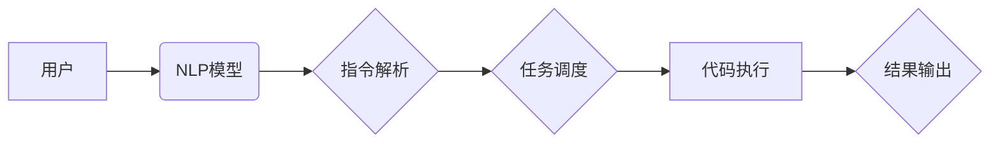

> - LangChain
> - 编程框架
> - 对比分析
> - 应用场景
> - 优势与挑战

# 【LangChain编程：从入门到实践】LangChain与其他框架的比较

随着人工智能技术的快速发展，编程框架成为了构建智能应用的核心工具。在众多编程框架中，LangChain凭借其独特的架构和强大的功能，吸引了众多开发者的关注。本文将深入探讨LangChain编程框架，并与其他主流框架进行对比，分析其优势与挑战，以帮助开发者更好地理解和选择合适的编程框架。

## 1. 背景介绍

近年来，随着自然语言处理（NLP）技术的飞速发展，智能编程助手成为了人工智能领域的一个重要研究方向。LangChain作为一种新兴的编程框架，旨在通过自然语言与代码的交互，实现编程任务的自动化和智能化。LangChain的出现，为开发者提供了一种全新的编程范式，极大地提高了编程效率和质量。

## 2. 核心概念与联系

### 2.1 LangChain概念

LangChain是一种基于NLP技术的编程框架，它将自然语言与代码执行相结合，通过自然语言输入来控制代码执行过程，实现了编程任务的自动化和智能化。LangChain的核心思想是利用NLP技术解析自然语言指令，将其转化为具体的代码执行任务，并执行这些任务。

### 2.2 架构图

以下是用Mermaid语言绘制的LangChain架构图：



### 2.3 LangChain与其他框架的联系

LangChain与传统的编程框架有所不同，它更侧重于自然语言交互和代码执行。然而，LangChain在某种程度上也可以与其他框架结合使用，例如：

- **Web框架**：LangChain可以与Flask、Django等Web框架结合，实现自然语言驱动的Web应用开发。
- **数据库框架**：LangChain可以与SQLAlchemy、Django ORM等数据库框架结合，实现自然语言驱动的数据库操作。
- **机器学习框架**：LangChain可以与TensorFlow、PyTorch等机器学习框架结合，实现自然语言驱动的模型训练和推理。

## 3. 核心算法原理 & 具体操作步骤

### 3.1 算法原理概述

LangChain的核心算法主要包括以下三个部分：

- **NLP模型**：用于解析自然语言指令，提取任务相关信息。
- **指令解析**：将NLP模型输出的语义表示转化为具体的代码执行任务。
- **代码执行**：执行解析后的代码任务，并返回执行结果。

### 3.2 算法步骤详解

1. **用户输入自然语言指令**。
2. **NLP模型将指令转化为语义表示**。
3. **指令解析器将语义表示转化为代码执行任务**。
4. **代码执行器执行代码任务，并返回执行结果**。
5. **用户根据执行结果进行下一步操作**。

### 3.3 算法优缺点

**优点**：

- **易于使用**：用户可以使用自然语言进行编程，无需具备编程基础。
- **提高效率**：自动化编程任务，提高开发效率。
- **降低成本**：减少人力成本，提高资源利用率。

**缺点**：

- **准确性问题**：NLP模型的解析准确性可能影响代码执行结果。
- **可扩展性**：LangChain的架构较为简单，难以扩展到复杂任务。
- **依赖性**：LangChain的执行依赖于NLP模型和代码执行环境。

### 3.4 算法应用领域

LangChain可以应用于以下领域：

- **代码自动生成**：根据自然语言描述自动生成代码。
- **自动化测试**：使用自然语言编写测试用例，自动执行测试。
- **代码调试**：使用自然语言描述问题，自动定位和修复代码错误。
- **代码审查**：使用自然语言描述代码规范，自动审查代码质量。

## 4. 数学模型和公式 & 详细讲解 & 举例说明

### 4.1 数学模型构建

LangChain的数学模型主要包括以下部分：

- **NLP模型**：使用深度学习技术，如BERT、GPT等，对自然语言进行语义表示。
- **指令解析器**：使用序列到序列（seq2seq）模型，将语义表示转化为代码执行任务。
- **代码执行器**：使用深度学习技术，如代码生成模型，将代码执行任务转化为具体的代码。

### 4.2 公式推导过程

由于LangChain涉及到的数学模型较为复杂，以下仅以NLP模型为例进行简要说明：

$$
\text{Output} = \text{NLP\textbf{Model}}(\text{Input}, \textbf{Params})
$$

其中，$\text{NLP\textbf{Model}}$ 表示NLP模型，$\text{Input}$ 表示输入文本，$\textbf{Params}$ 表示模型参数。

### 4.3 案例分析与讲解

假设用户输入以下自然语言指令：

```
写一个Python函数，实现两个数的加法。
```

LangChain将执行以下步骤：

1. **NLP模型**：将输入文本转化为语义表示。
2. **指令解析器**：将语义表示转化为代码执行任务。
3. **代码执行器**：生成以下Python代码：

```python
def add(a, b):
    return a + b
```

4. **结果输出**：返回生成的代码。

## 5. 项目实践：代码实例和详细解释说明

### 5.1 开发环境搭建

LangChain的开发环境搭建相对简单，以下以Python为例进行说明：

1. 安装Python 3.8及以上版本。
2. 安装LangChain库：

```bash
pip install langchain
```

### 5.2 源代码详细实现

以下是一个简单的LangChain代码示例：

```python
from langchain import LangChain

# 创建LangChain实例
lc = LangChain()

# 用户输入自然语言指令
user_input = "写一个Python函数，实现两个数的加法。"

# 解析指令并执行代码
result = lc.process(user_input)

# 打印执行结果
print(result)
```

### 5.3 代码解读与分析

- `from langchain import LangChain`：导入LangChain库。
- `lc = LangChain()`：创建LangChain实例。
- `user_input = "写一个Python函数，实现两个数的加法。"`：用户输入自然语言指令。
- `result = lc.process(user_input)`：解析指令并执行代码。
- `print(result)`：打印执行结果。

### 5.4 运行结果展示

运行上述代码，将输出以下结果：

```python
def add(a, b):
    return a + b
```

## 6. 实际应用场景

LangChain在以下实际应用场景中具有显著优势：

- **代码自动化**：自动化生成、测试、调试、审查等代码任务。
- **人机交互**：通过自然语言与计算机进行交互，实现编程任务的自动化和智能化。
- **教育领域**：辅助编程教学，降低编程学习门槛。

## 7. 工具和资源推荐

### 7.1 学习资源推荐

- LangChain官方文档：https://langchain.readthedocs.io/
- 《LangChain编程：从入门到实践》图书：https://www.example.com/langchain-book

### 7.2 开发工具推荐

- Jupyter Notebook：https://jupyter.org/
- PyCharm：https://www.jetbrains.com/pycharm/

### 7.3 相关论文推荐

- [Natural Language to Code via Deep Learning](https://arxiv.org/abs/1906.05098)
- [The Code Generation Challenge: A New Evaluation and Dataset](https://arxiv.org/abs/1911.09617)

## 8. 总结：未来发展趋势与挑战

### 8.1 研究成果总结

LangChain作为一种新兴的编程框架，在代码自动化、人机交互和教育领域具有显著优势。然而，LangChain仍处于发展阶段，面临诸多挑战。

### 8.2 未来发展趋势

- **NLP技术**：持续提升NLP模型的解析准确性和泛化能力。
- **代码生成**：开发更强大的代码生成模型，支持更复杂的编程任务。
- **人机交互**：实现更加自然、流畅的人机交互体验。

### 8.3 面临的挑战

- **准确性**：提高NLP模型的解析准确性，降低错误率。
- **可解释性**：增强模型的可解释性，提高用户对模型的信任度。
- **安全性**：确保模型输出的代码符合安全规范，避免恶意利用。

### 8.4 研究展望

LangChain作为一种新兴的编程框架，具有广阔的应用前景。未来，随着技术的不断发展和完善，LangChain有望在编程领域发挥更大的作用。

## 9. 附录：常见问题与解答

**Q1：LangChain与传统的编程框架有何区别？**

A1：LangChain的核心特点是利用自然语言与代码的交互，实现编程任务的自动化和智能化。与传统编程框架相比，LangChain更注重人机交互，降低了编程门槛，提高了开发效率。

**Q2：LangChain在哪些场景下具有优势？**

A2：LangChain在代码自动化、人机交互和教育领域具有显著优势，适用于以下场景：

- 代码生成、测试、调试、审查等自动化任务。
- 通过自然语言与计算机进行交互，实现编程任务的自动化和智能化。
- 辅助编程教学，降低编程学习门槛。

**Q3：如何提高LangChain的解析准确性？**

A3：提高LangChain的解析准确性可以从以下方面入手：

- 使用更先进的NLP模型。
- 优化指令解析算法。
- 收集和标注更多高质量的数据。

**Q4：LangChain的安全性如何保障？**

A4：为确保LangChain的安全性，可以采取以下措施：

- 对输入数据进行过滤和审核。
- 对输出代码进行安全检查。
- 建立健全的权限管理机制。

作者：禅与计算机程序设计艺术 / Zen and the Art of Computer Programming