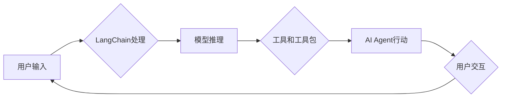

> - LangChain
> - 大模型应用开发
> - AI Agent
> - 工具和工具包
> - 代码实例
> - 实际应用场景

# 【大模型应用开发 动手做AI Agent】LangChain中的工具和工具包

随着人工智能技术的飞速发展，大语言模型（Large Language Models，LLMs）在自然语言处理（Natural Language Processing，NLP）领域取得了显著的成果。这些模型能够理解和生成复杂语言，但在实际应用中，如何高效地开发和使用这些大模型，构建出智能的AI Agent，成为了关键。LangChain作为一种开源工具，提供了丰富的工具和工具包，可以帮助开发者轻松实现这一目标。本文将深入探讨LangChain中的工具和工具包，并通过实际项目实践展示如何动手做AI Agent。

## 1. 背景介绍

大语言模型如GPT-3、BERT等，在文本生成、问答系统、机器翻译等领域展现了惊人的能力。然而，直接使用这些模型进行应用开发面临着以下挑战：

1. **模型复杂度高**：大语言模型通常包含数十亿甚至数千亿的参数，需要大量的计算资源和时间进行训练。
2. **部署难度大**：将大语言模型部署到生产环境中，需要考虑性能优化、资源分配、安全防护等问题。
3. **应用开发复杂**：缺乏便捷的工具和框架，使得应用开发者难以快速将大模型应用于实际问题。

LangChain正是为了解决这些问题而诞生的。LangChain是一个开源框架，它封装了多种大语言模型，并提供了一系列工具和工具包，使得开发者能够轻松地构建AI应用。

## 2. 核心概念与联系

### 2.1 LangChain的核心概念

LangChain的核心概念包括：

- **大语言模型**：如GPT-3、BERT等，是LangChain的基础，负责理解和生成语言。
- **工具和工具包**：LangChain提供了一系列工具和工具包，用于与模型交互、处理数据、构建应用。
- **AI Agent**：LangChain帮助开发者构建的智能体，能够自主执行任务、处理信息并与人交互。

### 2.2 LangChain架构流程图



## 3. 核心算法原理 & 具体操作步骤

### 3.1 算法原理概述

LangChain通过以下步骤实现AI Agent的构建：

1. **模型推理**：根据用户输入，LangChain调用大语言模型进行推理，得到预测结果。
2. **工具和工具包**：LangChain提供了一系列工具和工具包，用于处理数据和构建应用逻辑。
3. **AI Agent行动**：根据模型推理结果和工具包的功能，AI Agent执行相应的行动。
4. **用户交互**：AI Agent将行动结果反馈给用户，并根据用户反馈进行后续操作。

### 3.2 算法步骤详解

1. **初始化LangChain**：创建LangChain实例，配置所需的大语言模型和工具包。
2. **用户输入**：用户向AI Agent提供输入，可以是文本、语音等。
3. **模型推理**：LangChain调用大语言模型对用户输入进行推理，得到预测结果。
4. **工具和工具包处理**：LangChain根据预测结果，调用相应的工具和工具包进行处理。
5. **AI Agent行动**：AI Agent根据处理结果执行相应行动，如生成文本、执行命令等。
6. **用户交互**：AI Agent将行动结果反馈给用户，用户可以给出反馈或提供新的输入。

### 3.3 算法优缺点

**优点**：

- **简单易用**：LangChain提供了一套完整的工具和框架，简化了AI Agent的开发过程。
- **功能强大**：LangChain集成了多种大语言模型和工具包，能够满足多种应用需求。
- **可扩展性**：开发者可以根据自己的需求，添加新的工具和工具包，扩展LangChain的功能。

**缺点**：

- **依赖大语言模型**：LangChain的性能很大程度上取决于所选的大语言模型。
- **资源消耗**：大语言模型的推理和训练需要大量的计算资源。

## 4. 数学模型和公式 & 详细讲解 & 举例说明

### 4.1 数学模型构建

LangChain中的数学模型主要涉及大语言模型和工具包的使用。以下是一个简单的例子：

$$
\text{预测结果} = \text{大语言模型}(\text{用户输入}) + \text{工具包处理}(\text{预测结果})
$$

### 4.2 公式推导过程

公式推导过程如下：

1. **大语言模型推理**：使用大语言模型对用户输入进行推理，得到预测结果。
2. **工具包处理**：根据预测结果，调用相应的工具包进行处理。
3. **结果整合**：将大语言模型的预测结果和工具包的处理结果进行整合，得到最终的预测结果。

### 4.3 案例分析与讲解

以下是一个使用LangChain构建智能客服的例子：

1. **用户输入**：用户在聊天界面输入问题：“我的订单什么时候发货？”
2. **模型推理**：LangChain调用大语言模型对用户输入进行推理，得到预测结果：“订单状态为已发货。”
3. **工具包处理**：LangChain调用订单查询工具包，获取订单的详细状态信息。
4. **AI Agent行动**：AI Agent将订单状态信息反馈给用户：“您的订单已经发货，预计明天送达。”
5. **用户交互**：用户表示感谢。

## 5. 项目实践：代码实例和详细解释说明

### 5.1 开发环境搭建

1. 安装Python和pip。
2. 安装LangChain库：`pip install langchain`。

### 5.2 源代码详细实现

以下是一个简单的LangChain应用示例：

```python
from langchain import LangChain

# 创建LangChain实例
lc = LangChain()

# 定义工具包
def order_status(order_id):
    # 查询订单状态
    # ...

# 将工具包添加到LangChain
lc.add_tool("order_status", order_status)

# 用户输入
user_input = "我的订单什么时候发货？"

# 模型推理
prediction = lc.predict("我的订单什么时候发货？")

# 工具包处理
order_status_result = lc.run_tool("order_status", order_id=prediction["order_id"])

# AI Agent行动
print(f"您的订单已经发货，预计{order_status_result['estimated_delivery_date']}送达。")

```

### 5.3 代码解读与分析

1. **导入LangChain库**：首先，我们导入LangChain库。
2. **创建LangChain实例**：创建一个LangChain实例，配置所需的大语言模型和工具包。
3. **定义工具包**：定义一个工具包函数`order_status`，用于查询订单状态。
4. **添加工具包到LangChain**：将`order_status`工具包添加到LangChain。
5. **用户输入**：定义用户输入`user_input`。
6. **模型推理**：调用LangChain的`predict`方法进行模型推理。
7. **工具包处理**：调用`run_tool`方法执行工具包函数。
8. **AI Agent行动**：根据工具包处理结果，AI Agent将信息反馈给用户。

### 5.4 运行结果展示

当用户输入“我的订单什么时候发货？”时，AI Agent会查询订单状态，并将结果反馈给用户。

## 6. 实际应用场景

LangChain在以下应用场景中表现出色：

- **智能客服**：构建能够自动回答用户问题的智能客服系统。
- **虚拟助手**：构建能够协助用户完成日常任务的虚拟助手。
- **文本生成**：自动生成新闻报道、产品描述等文本内容。
- **问答系统**：构建能够回答用户问题的问答系统。

## 7. 工具和资源推荐

### 7.1 学习资源推荐

- LangChain官方文档：https://langchain.readthedocs.io/
- 《Natural Language Processing with Transformers》书籍：https://arxiv.org/abs/1801.08531
- Hugging Face模型库：https://huggingface.co/models

### 7.2 开发工具推荐

- PyCharm：https://www.jetbrains.com/pycharm/
- Visual Studio Code：https://code.visualstudio.com/

### 7.3 相关论文推荐

- BERT：https://arxiv.org/abs/1810.04805
- GPT-3：https://arxiv.org/abs/2005.05150

## 8. 总结：未来发展趋势与挑战

### 8.1 研究成果总结

本文深入探讨了LangChain中的工具和工具包，并通过实际项目实践展示了如何使用LangChain构建AI Agent。LangChain为开发者提供了一套完整的工具和框架，简化了AI应用的开发过程，使得大语言模型的应用变得更加容易。

### 8.2 未来发展趋势

1. **模型轻量化**：随着模型轻量化的需求日益增长，LangChain可能会推出更加轻量级的模型和工具包。
2. **多模态支持**：LangChain可能会支持更多模态的数据，如图像、语音等。
3. **知识图谱集成**：LangChain可能会集成知识图谱，使得AI Agent能够更好地理解和处理知识型任务。

### 8.3 面临的挑战

1. **模型可解释性**：如何提高大语言模型的可解释性，是一个亟待解决的问题。
2. **数据安全**：如何确保用户数据的安全，是一个重要的挑战。
3. **模型偏见**：如何消除大语言模型中的偏见，是一个需要持续关注的课题。

### 8.4 研究展望

LangChain作为一款开源框架，将继续发展和完善，为开发者提供更加便捷的AI应用开发工具。随着人工智能技术的不断进步，LangChain将助力更多开发者将AI技术应用于实际场景，推动人工智能技术的发展和应用。

## 9. 附录：常见问题与解答

**Q1：LangChain支持哪些大语言模型？**

A：LangChain支持多种大语言模型，如GPT-3、BERT、T5等。

**Q2：如何将LangChain集成到现有应用中？**

A：LangChain可以很容易地集成到现有应用中。你只需要导入LangChain库，并配置所需的大语言模型和工具包即可。

**Q3：LangChain需要多大的计算资源？**

A：LangChain的计算资源需求取决于所使用的大语言模型和工具包。一般来说，你需要一个高性能的GPU来运行LangChain。

**Q4：LangChain的安全性如何保障？**

A：LangChain的安全性主要依赖于所使用的大语言模型和工具包。你需要确保这些模型和工具包的安全性，以及你的数据安全。

**Q5：如何扩展LangChain的功能？**

A：你可以通过添加新的工具和工具包来扩展LangChain的功能。你只需要定义一个新的工具函数，并将其添加到LangChain中即可。

---

作者：禅与计算机程序设计艺术 / Zen and the Art of Computer Programming