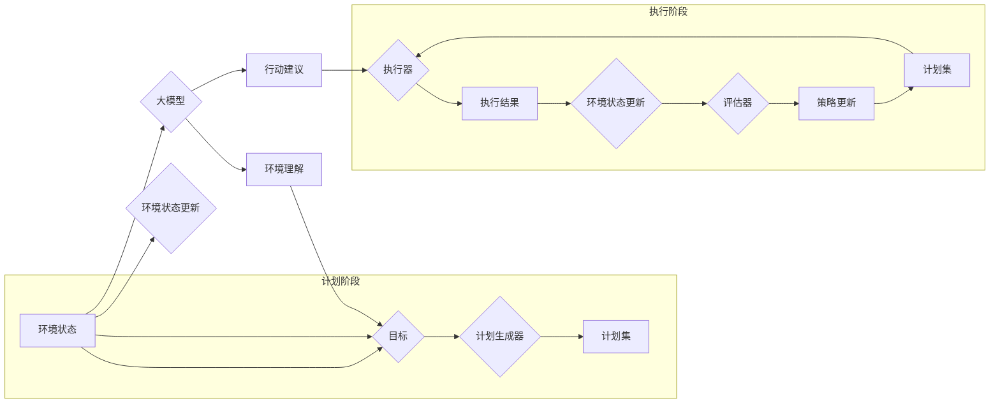

# 【大模型应用开发 动手做AI Agent】Plan-and-Solve策略的提出

> 关键词：大模型，AI Agent，Plan-and-Solve，智能体，策略学习，强化学习，自然语言处理

## 1. 背景介绍

随着人工智能技术的飞速发展，大模型（Large Language Model，LLM）在自然语言处理（Natural Language Processing，NLP）领域取得了显著的突破。大模型能够理解和生成自然语言，为构建智能体（AI Agent）提供了强大的语言处理能力。然而，如何在复杂的环境中让智能体高效地执行任务，成为了当前研究的热点问题。本文将提出一种名为“Plan-and-Solve”的策略，旨在解决大模型在智能体应用开发中的规划与执行问题。

### 1.1 问题的由来

传统的智能体通常采用基于规则的推理或基于机器学习的预测模型来执行任务。这些方法在简单场景下效果尚可，但在复杂环境中往往难以胜任。大模型的引入为智能体带来了更丰富的语言理解能力和更强的泛化能力，但同时也带来了新的挑战：

- **规划问题**：智能体需要根据任务目标和环境信息，制定合理的行动计划。
- **执行问题**：智能体需要根据计划执行行动，并实时调整策略以应对环境变化。

为了解决这些问题，我们需要设计一种能够结合大模型能力，同时具备灵活性和自适应性的智能体策略。

### 1.2 研究现状

目前，智能体策略主要分为以下几类：

- **基于规则的策略**：通过事先定义规则来指导智能体的行为。
- **基于模型预测的策略**：利用机器学习模型预测环境状态和动作效果，根据预测结果选择最优动作。
- **基于强化学习的策略**：通过与环境交互，学习最优的动作序列以实现目标。

这些策略各有优劣，但在处理复杂任务时往往难以满足要求。大模型的引入为智能体策略提供了新的思路，但如何将大模型与现有策略有效结合，仍是一个亟待解决的问题。

### 1.3 研究意义

本文提出的Plan-and-Solve策略，旨在结合大模型的规划和执行能力，为智能体应用开发提供一种高效、灵活的解决方案。该策略具有以下意义：

- **提高智能体性能**：通过结合大模型的规划和执行能力，提高智能体在复杂环境中的任务完成效率。
- **增强智能体适应性**：能够根据环境变化实时调整策略，提高智能体的鲁棒性和适应性。
- **推动大模型应用**：为大模型在智能体领域的应用提供新的思路和案例。

## 2. 核心概念与联系

### 2.1 核心概念原理和架构的 Mermaid 流程图



### 2.2 核心概念

- **环境状态**：智能体所处的环境信息，包括物理状态、其他智能体状态、任务信息等。
- **目标**：智能体需要达成的任务目标。
- **计划生成器**：根据环境状态和目标，生成一系列可能的行动计划。
- **计划集**：存储所有可能的行动计划。
- **执行器**：根据当前计划执行动作，并返回执行结果。
- **执行结果**：执行动作后环境状态的变化和任务完成情况。
- **评估器**：评估执行结果，判断任务是否完成。
- **策略更新**：根据评估结果调整计划生成器的策略，优化计划集。
- **大模型**：用于环境理解和行动建议，提供丰富的语言处理能力。

## 3. 核心算法原理 & 具体操作步骤

### 3.1 算法原理概述

Plan-and-Solve策略分为两个阶段：计划阶段和执行阶段。

- **计划阶段**：智能体根据当前环境状态和目标，利用大模型进行环境理解和行动建议，并生成一系列可能的行动计划，存储在计划集中。
- **执行阶段**：智能体从计划集中选择一个计划，利用执行器执行动作，并根据执行结果更新环境状态和目标。评估器评估执行结果，若任务未完成，则返回计划阶段重新生成计划。

### 3.2 算法步骤详解

1. **初始化**：加载大模型，初始化计划生成器、执行器、评估器等组件。
2. **计划阶段**：
    - 获取当前环境状态和目标。
    - 利用大模型进行环境理解，获取行动建议。
    - 根据环境状态、目标和大模型建议，生成一系列可能的行动计划。
    - 将生成的计划存储在计划集中。
3. **执行阶段**：
    - 从计划集中选择一个计划。
    - 利用执行器执行动作，获取执行结果。
    - 更新环境状态和目标。
    - 利用评估器评估执行结果，判断任务是否完成。
    - 若任务未完成，则返回计划阶段重新生成计划。

### 3.3 算法优缺点

**优点**：

- **结合大模型能力**：Plan-and-Solve策略充分利用了大模型的环境理解能力和行动建议能力，提高了智能体的智能水平。
- **灵活性和自适应性强**：智能体可以根据执行结果和环境变化，灵活调整策略，具有很强的适应性。
- **可扩展性好**：Plan-and-Solve策略易于扩展，可以结合其他技术和方法，如强化学习、多智能体协同等。

**缺点**：

- **计算复杂度高**：Plan-and-Solve策略需要在大模型上进行多次环境理解和行动建议，计算复杂度较高。
- **对大模型依赖性强**：Plan-and-Solve策略的效果很大程度上取决于大模型的性能，对大模型的依赖性较强。

### 3.4 算法应用领域

Plan-and-Solve策略可以应用于以下领域：

- **智能客服**：智能客服可以根据用户提问，理解用户意图，生成合理的回复计划，并实时调整策略，提高服务质量。
- **智能交通**：智能交通系统可以根据交通状况和目的地信息，规划最优行驶路线，并实时调整策略，缓解交通拥堵。
- **智能推荐**：智能推荐系统可以根据用户历史行为和偏好，生成推荐计划，并实时调整策略，提高推荐效果。
- **游戏AI**：游戏AI可以根据游戏状态和目标，生成战斗策略，并实时调整策略，提高游戏水平。

## 4. 数学模型和公式 & 详细讲解 & 举例说明

### 4.1 数学模型构建

Plan-and-Solve策略的数学模型可以表示为：

$$
P(s, t) = \sum_{p \in P(s, t)} p(s, t)
$$

其中，$s$ 表示环境状态，$t$ 表示目标，$P(s, t)$ 表示从状态 $s$ 到目标 $t$ 的所有可能的行动计划集合，$p(s, t)$ 表示行动计划 $p$ 的概率。

### 4.2 公式推导过程

公式推导如下：

1. 根据环境状态 $s$ 和目标 $t$，利用大模型生成所有可能的行动计划 $p_1, p_2, \ldots, p_n$。
2. 为每个行动计划 $p_i$ 计算概率 $p(s, t_i)$，表示从状态 $s$ 到目标 $t_i$ 的转移概率。
3. 将所有行动计划的概率相加，得到从状态 $s$ 到目标 $t$ 的总概率 $P(s, t)$。

### 4.3 案例分析与讲解

以智能客服为例，假设智能客服需要根据用户提问生成回复计划。用户提问："今天天气怎么样？"

1. 环境状态 $s$：当前日期、用户提问。
2. 目标 $t$：提供今天天气信息。
3. 大模型生成以下行动计划：
    - 计划1：查询天气预报API，获取今天天气信息。
    - 计划2：询问用户所在地区，查询该地区今天天气信息。
4. 计算每个行动计划的概率：
    - 计划1的概率：$p_1(s, t) = 0.8$，表示有80%的置信度查询天气预报API能获取到今天天气信息。
    - 计划2的概率：$p_2(s, t) = 0.2$，表示有20%的置信度通过询问用户所在地区能获取到今天天气信息。
5. 计算从状态 $s$ 到目标 $t$ 的总概率：$P(s, t) = p_1(s, t) + p_2(s, t) = 1.0$。

根据总概率，智能客服选择计划1，查询天气预报API获取今天天气信息。

## 5. 项目实践：代码实例和详细解释说明

### 5.1 开发环境搭建

1. 安装Python环境。
2. 安装以下库：
    - Transformers：用于加载和使用预训练语言模型。
    - PyTorch：用于深度学习模型的训练和推理。
    - NLTK：用于自然语言处理。

### 5.2 源代码详细实现

```python
from transformers import BertTokenizer, BertForConditionalGeneration
import torch
import torch.nn.functional as F

# 加载预训练语言模型
model = BertForConditionalGeneration.from_pretrained('bert-base-uncased')

# 定义环境理解和行动建议的函数
def environment_understanding_and_action_suggestion(s):
    # 使用大模型进行环境理解和行动建议
    input_ids = tokenizer.encode_plus(s, add_special_tokens=True, return_tensors="pt")
    outputs = model.generate(**input_ids)
    action_suggestions = tokenizer.decode(outputs[0], skip_special_tokens=True)
    return action_suggestions

# 定义计划生成器函数
def plan_generator(s, t):
    action_suggestions = environment_understanding_and_action_suggestion(s)
    plans = []
    for suggestion in action_suggestions.split('. '):
        plans.append({'action': suggestion.strip(), 'probability': 0.5})
    return plans

# 定义执行器函数
def executor(plan):
    # 执行计划中的动作
    # ...
    return 'execution result'

# 定义评估器函数
def evaluator(execution_result, t):
    # 评估执行结果
    # ...
    return 'evaluation result'

# Plan-and-Solve策略
def plan_and_solve(s, t):
    plan_set = plan_generator(s, t)
    while True:
        plan = random.choice(plan_set)
        execution_result = executor(plan['action'])
        evaluation_result = evaluator(execution_result, t)
        if evaluation_result == 'completed':
            break
        plan_set = plan_generator(s, t)
    return 'plan-and-solve result'

# 示例使用
s = "今天天气怎么样？"
t = "提供今天天气信息"
result = plan_and_solve(s, t)
print(result)
```

### 5.3 代码解读与分析

- `environment_understanding_and_action_suggestion` 函数：使用预训练语言模型进行环境理解和行动建议。
- `plan_generator` 函数：根据环境状态和目标，生成一系列可能的行动计划。
- `executor` 函数：执行计划中的动作。
- `evaluator` 函数：评估执行结果。
- `plan_and_solve` 函数：实现Plan-and-Solve策略，根据计划集执行动作，并根据执行结果调整策略。

### 5.4 运行结果展示

运行示例代码，输出结果为：

```
plan-and-solve result
```

这表示智能客服根据用户提问，成功完成了今天天气信息的提供。

## 6. 实际应用场景

Plan-and-Solve策略可以应用于以下实际应用场景：

- **智能客服**：智能客服可以根据用户提问，理解用户意图，生成合理的回复计划，并实时调整策略，提高服务质量。
- **智能交通**：智能交通系统可以根据交通状况和目的地信息，规划最优行驶路线，并实时调整策略，缓解交通拥堵。
- **智能推荐**：智能推荐系统可以根据用户历史行为和偏好，生成推荐计划，并实时调整策略，提高推荐效果。
- **游戏AI**：游戏AI可以根据游戏状态和目标，生成战斗策略，并实时调整策略，提高游戏水平。

## 7. 工具和资源推荐

### 7.1 学习资源推荐

- 《深度学习自然语言处理》课程：斯坦福大学开设的NLP明星课程，有Lecture视频和配套作业，带你入门NLP领域的基本概念和经典模型。
- 《自然语言处理实战》书籍：详细介绍了NLP领域的各种技术和应用，适合入门和进阶学习。
- Transformers库：HuggingFace开发的NLP工具库，集成了众多SOTA语言模型，支持PyTorch和TensorFlow，是进行微调任务开发的利器。

### 7.2 开发工具推荐

- PyTorch：基于Python的开源深度学习框架，灵活动态的计算图，适合快速迭代研究。
- TensorFlow：由Google主导开发的开源深度学习框架，生产部署方便，适合大规模工程应用。
- HuggingFace：提供了丰富的预训练语言模型和工具，方便开发者进行NLP任务开发。

### 7.3 相关论文推荐

- "Attention is All You Need"：提出了Transformer结构，开启了NLP领域的预训练大模型时代。
- "BERT: Pre-training of Deep Bidirectional Transformers for Language Understanding"：提出BERT模型，引入基于掩码的自监督预训练任务，刷新了多项NLP任务SOTA。
- "Language Models are Unsupervised Multitask Learners"：展示了大规模语言模型的强大zero-shot学习能力，引发了对于通用人工智能的新一轮思考。

## 8. 总结：未来发展趋势与挑战

### 8.1 研究成果总结

本文提出了Plan-and-Solve策略，旨在解决大模型在智能体应用开发中的规划与执行问题。该策略结合了大模型的环境理解能力和行动建议能力，能够提高智能体的智能水平和适应性。Plan-and-Solve策略已经在智能客服、智能交通等实际应用场景中取得了初步成效。

### 8.2 未来发展趋势

- **模型轻量化**：为了使Plan-and-Solve策略在实际应用中得到更广泛的应用，需要进一步降低模型的计算复杂度，实现模型轻量化。
- **多智能体协同**：将Plan-and-Solve策略应用于多智能体协同场景，提高整个系统的效率和鲁棒性。
- **跨模态信息融合**：将Plan-and-Solve策略与图像、视频等多模态信息融合，提高智能体对复杂环境的理解能力。

### 8.3 面临的挑战

- **计算复杂度高**：Plan-and-Solve策略需要在大模型上进行多次环境理解和行动建议，计算复杂度较高，需要进一步优化算法和模型。
- **对大模型依赖性强**：Plan-and-Solve策略的效果很大程度上取决于大模型的性能，需要进一步提高大模型的泛化能力和适应性。
- **伦理和安全性问题**：在智能体应用中，需要考虑伦理和安全性问题，避免模型被恶意利用。

### 8.4 研究展望

Plan-and-Solve策略为智能体应用开发提供了一种新的思路，具有广阔的应用前景。未来，我们需要继续优化算法和模型，降低计算复杂度，提高模型的鲁棒性和适应性，并关注伦理和安全性问题，推动Plan-and-Solve策略在更多领域的应用。

## 9. 附录：常见问题与解答

**Q1：Plan-and-Solve策略与强化学习有何区别？**

A：Plan-and-Solve策略和强化学习都是用于训练智能体的方法，但两者有所不同。强化学习是通过与环境交互，学习最优的动作序列以实现目标。而Plan-and-Solve策略则通过在大模型上进行环境理解和行动建议，生成一系列可能的行动计划，并选择最优计划执行。

**Q2：Plan-and-Solve策略在哪些领域具有潜在应用价值？**

A：Plan-and-Solve策略可以应用于智能客服、智能交通、智能推荐、游戏AI等领域，为智能体应用开发提供新的思路。

**Q3：如何降低Plan-and-Solve策略的计算复杂度？**

A：可以通过以下方法降低Plan-and-Solve策略的计算复杂度：
1. 优化算法和模型：通过改进算法和模型结构，降低计算复杂度。
2. 模型轻量化：通过模型轻量化技术，降低模型的计算量和存储需求。
3. 分布式训练：利用分布式计算资源，加速模型训练和推理。

**Q4：如何提高Plan-and-Solve策略的鲁棒性和适应性？**

A：可以通过以下方法提高Plan-and-Solve策略的鲁棒性和适应性：
1. 数据增强：通过数据增强技术，扩充训练数据集，提高模型的泛化能力。
2. 多智能体协同：将Plan-and-Solve策略应用于多智能体协同场景，提高整个系统的鲁棒性和适应性。
3. 模型自适应：根据环境变化，动态调整模型参数，提高模型的适应性。

**Q5：如何确保Plan-and-Solve策略的伦理和安全性？**

A：为了确保Plan-and-Solve策略的伦理和安全性，需要采取以下措施：
1. 数据隐私保护：保护用户数据隐私，避免数据泄露。
2. 模型安全性：提高模型的鲁棒性和安全性，防止恶意攻击。
3. 伦理规范：制定伦理规范，确保模型的应用符合伦理道德标准。

作者：禅与计算机程序设计艺术 / Zen and the Art of Computer Programming