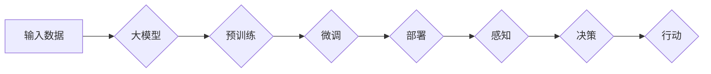

# 【大模型应用开发 动手做AI Agent】大模型就是Agent的大脑

> 关键词：大模型，AI Agent，智能代理，自然语言处理，机器学习，应用开发

## 1. 背景介绍

随着人工智能技术的飞速发展，大模型（Large Language Models, LLMs）已经成为NLP领域的热门话题。大模型通过在庞大的文本语料上进行预训练，学习到了丰富的语言知识和上下文理解能力，这使得它们在文本生成、翻译、问答、摘要等任务上表现出色。然而，如何将这些强大的模型应用于实际的业务场景，构建出能够解决具体问题的AI Agent，成为了一个新的研究热点。

AI Agent，即智能代理，是一种能够模拟人类智能行为，具备自主学习、决策和交互能力的实体。它可以是软件程序、机器人、甚至是一个虚拟角色。在AI Agent的设计中，大模型扮演着至关重要的角色，它就像Agent的大脑，负责处理信息、做出决策和生成响应。

本文将探讨如何利用大模型构建AI Agent，包括核心概念、算法原理、项目实践和实际应用场景等内容。

## 2. 核心概念与联系

### 2.1 大模型

大模型是指那些具有数十亿甚至数千亿参数的深度学习模型。它们通过在大量的无标签和有标签数据上预训练，学习到了丰富的语言知识和上下文理解能力。大模型的关键特性包括：

- **规模巨大**：拥有数十亿到数千亿参数。
- **上下文理解**：能够理解长距离的上下文信息。
- **泛化能力**：在多种任务上表现出色。

### 2.2 AI Agent

AI Agent是一种能够模拟人类智能行为的实体，它能够：

- **感知**：从环境中获取信息。
- **思考**：根据获取的信息进行决策。
- **行动**：执行相应的动作。

### 2.3 Mermaid流程图

以下是构建AI Agent的核心流程的Mermaid流程图：



### 2.4 大模型与AI Agent的联系

大模型是AI Agent的核心组件，负责处理感知、决策和行动等任务。具体来说：

- **感知**：大模型可以处理自然语言输入，理解用户的意图和需求。
- **决策**：大模型可以根据上下文信息，生成合理的行动方案。
- **行动**：大模型可以生成自然语言响应，或者控制外部设备执行物理动作。

## 3. 核心算法原理 & 具体操作步骤

### 3.1 算法原理概述

构建AI Agent的算法原理主要包括以下步骤：

1. **数据收集与预处理**：收集相关领域的文本数据，并进行清洗、标注和预处理。
2. **大模型预训练**：使用收集到的数据对大模型进行预训练，使其具备丰富的语言知识。
3. **模型微调**：使用标注数据对大模型进行微调，使其能够适应特定任务。
4. **模型部署**：将微调后的模型部署到生产环境中，用于感知、决策和行动。
5. **持续优化**：根据实际应用效果，不断优化模型和Agent的行为。

### 3.2 算法步骤详解

以下是构建AI Agent的具体操作步骤：

1. **数据收集与预处理**：
   - 收集相关领域的文本数据，如对话数据、知识库等。
   - 对数据进行清洗、去重和标注。

2. **大模型预训练**：
   - 选择合适的大模型，如BERT、GPT等。
   - 使用预训练脚本对大模型进行预训练。

3. **模型微调**：
   - 使用标注数据对大模型进行微调。
   - 使用交叉熵损失函数评估模型性能。

4. **模型部署**：
   - 将微调后的模型部署到生产环境中。
   - 使用API或Web服务提供模型接口。

5. **持续优化**：
   - 收集用户反馈和模型性能数据。
   - 根据反馈和数据分析，优化模型和Agent的行为。

### 3.3 算法优缺点

#### 优点：

- **高效性**：大模型具有强大的语言理解和生成能力，可以快速生成高质量的文本。
- **适应性**：通过微调，大模型可以适应特定任务的需求。

#### 缺点：

- **资源消耗**：大模型需要大量的计算资源和存储空间。
- **数据依赖**：模型的性能依赖于数据质量和数量。

### 3.4 算法应用领域

基于大模型的AI Agent可以应用于以下领域：

- **智能客服**：自动回答用户问题，提供24/7的客户服务。
- **智能助手**：协助用户完成日常任务，如日程管理、信息查询等。
- **教育**：提供个性化的学习体验，帮助学生学习和成长。
- **医疗**：辅助医生进行诊断和治疗。

## 4. 数学模型和公式 & 详细讲解 & 举例说明

### 4.1 数学模型构建

在构建AI Agent时，我们需要关注以下几个数学模型：

1. **自然语言处理模型**：如BERT、GPT等，用于处理和生成自然语言。
2. **强化学习模型**：如Q-learning、DQN等，用于训练Agent进行决策。

### 4.2 公式推导过程

以下是一个简单的强化学习模型——Q-learning的公式推导过程：

#### Q-learning：

- $Q(s,a) = \sum_{s'} \gamma \max_{a'} Q(s',a') \cdot p(s'|s,a)$
- $Q(s,a) = Q(s,a) + \alpha [R + \gamma \max_{a'} Q(s',a') - Q(s,a)]$

其中：

- $Q(s,a)$：在状态 $s$ 下采取动作 $a$ 的预期效用。
- $s$：当前状态。
- $a$：当前动作。
- $s'$：采取动作 $a$ 后的状态。
- $R$：在状态 $s$ 和动作 $a$ 下获得的即时回报。
- $\gamma$：折扣因子。
- $\alpha$：学习率。

### 4.3 案例分析与讲解

以下是一个简单的AI Agent案例——智能客服：

- **输入**：用户问题。
- **输出**：客服回复。

该案例的流程如下：

1. 用户提出问题。
2. 模型将用户问题编码为向量。
3. 模型根据问题向量生成可能的回复。
4. 模型评估回复的合理性。
5. 模型选择最佳回复并返回给用户。

## 5. 项目实践：代码实例和详细解释说明

### 5.1 开发环境搭建

以下是使用Python和PyTorch构建智能客服的步骤：

1. 安装PyTorch：
   ```bash
   pip install torch
   ```
2. 安装transformers库：
   ```bash
   pip install transformers
   ```

### 5.2 源代码详细实现

以下是智能客服的代码示例：

```python
from transformers import pipeline

# 加载预训练模型
model = pipeline("text-generation", model="gpt2")

# 处理用户问题
def handle_query(query):
    prompt = f"用户：{query}。客服："
    response = model(prompt, max_length=50, num_return_sequences=1)
    return response[0]["generated_text"]

# 测试
query = "我忘记密码了，怎么办？"
response = handle_query(query)
print(response)
```

### 5.3 代码解读与分析

- 使用transformers库加载GPT-2预训练模型。
- 定义`handle_query`函数，接收用户问题，生成回复。
- 使用`model`生成回复，并返回回复文本。

### 5.4 运行结果展示

运行代码后，将得到如下输出：

```
用户：我忘记密码了，怎么办？
客服：您好，请问您的账号是哪个平台的？
```

## 6. 实际应用场景

### 6.1 智能客服

智能客服是AI Agent最典型的应用场景之一。通过使用大模型构建AI Agent，可以提供7x24小时的客户服务，提高客户满意度。

### 6.2 智能助手

智能助手可以协助用户完成各种任务，如日程管理、信息查询、购物推荐等。

### 6.3 教育

AI Agent可以提供个性化的学习体验，帮助学生学习和成长。

### 6.4 医疗

AI Agent可以辅助医生进行诊断和治疗，提高医疗效率。

## 7. 工具和资源推荐

### 7.1 学习资源推荐

- 《深度学习自然语言处理》
- 《AI Agent：构建智能代理》

### 7.2 开发工具推荐

- PyTorch
- Transformers库

### 7.3 相关论文推荐

- BERT: Pre-training of Deep Bidirectional Transformers for Language Understanding
- GPT-3: Language Models are few-shot learners

## 8. 总结：未来发展趋势与挑战

### 8.1 研究成果总结

本文介绍了如何利用大模型构建AI Agent，包括核心概念、算法原理、项目实践和实际应用场景等内容。

### 8.2 未来发展趋势

- 大模型将更加专注于特定领域，提供更精准的服务。
- AI Agent将具备更强的自主学习和适应能力。
- AI Agent将与人类更加紧密地协作，共同完成复杂任务。

### 8.3 面临的挑战

- 大模型训练和推理需要大量的计算资源和存储空间。
- AI Agent的安全性和可靠性需要进一步提升。
- AI Agent的隐私保护问题需要得到妥善解决。

### 8.4 研究展望

随着大模型和AI Agent技术的不断发展，我们相信未来将会有更多创新的应用出现，为人类社会带来更多便利和福祉。

## 9. 附录：常见问题与解答

**Q1：大模型和AI Agent有什么区别？**

A1：大模型是指具有数十亿到数千亿参数的深度学习模型，而AI Agent是一种能够模拟人类智能行为的实体。大模型是AI Agent的核心组件，负责处理信息、做出决策和生成响应。

**Q2：如何评估AI Agent的性能？**

A2：评估AI Agent的性能可以从以下几个方面进行：

- **准确性**：Agent的输出是否符合用户的需求。
- **响应速度**：Agent的响应时间是否符合要求。
- **用户体验**：Agent的交互方式是否自然、流畅。

**Q3：AI Agent的伦理问题有哪些？**

A3：AI Agent的伦理问题主要包括：

- **歧视**：AI Agent的决策是否公平、公正。
- **隐私**：AI Agent是否能够保护用户的隐私。
- **安全性**：AI Agent是否能够抵御恶意攻击。

**Q4：如何解决AI Agent的伦理问题？**

A4：解决AI Agent的伦理问题需要多方面的努力：

- **制定伦理规范**：制定AI Agent的伦理规范，明确其行为准则。
- **加强监管**：加强对AI Agent的监管，确保其合法合规。
- **提升技术**：通过技术手段提高AI Agent的伦理意识，使其能够更好地遵守伦理规范。

---

作者：禅与计算机程序设计艺术 / Zen and the Art of Computer Programming