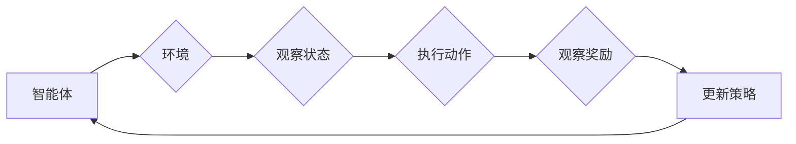
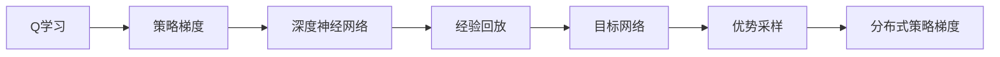

# 一切皆是映射：DQN算法改进历程与关键技术点

> 关键词：深度Q学习，DQN，Q学习，策略梯度，强化学习，神经网络，探索与利用，经验回放，优势采样，目标网络

## 1. 背景介绍

强化学习（Reinforcement Learning，RL）作为机器学习的一个重要分支，旨在通过智能体与环境交互来学习最优策略。在强化学习中，深度Q网络（Deep Q-Network，DQN）因其能够处理高维状态空间和动作空间而备受关注。DQN的提出，标志着深度学习在强化学习领域的重大突破，极大地推动了强化学习技术的发展。本文将回顾DQN算法的改进历程，并深入探讨其关键技术点。

### 1.1 问题的由来

在早期强化学习中，Q学习（Q-Learning）因其简单直接而被广泛研究。然而，Q学习在实际应用中存在两个主要问题：

1. **维度的 curse**：对于高维状态和动作空间，Q学习需要计算大量的Q值，计算复杂度高。
2. **样本效率低**：Q学习依赖于大量的探索来收集足够的样本，导致学习过程缓慢。

为了解决这些问题，研究者们提出了DQN算法，通过将Q学习与深度神经网络相结合，有效地降低了计算复杂度和提升了样本效率。

### 1.2 研究现状

自从DQN算法提出以来，研究者们对其进行了大量的改进，主要包括：

- **经验回放（Experience Replay）**：通过将收集到的经验存储在经验池中，并从经验池中随机抽取样本进行学习，提高了样本利用率和学习效率。
- **目标网络（Target Network）**：引入了两个网络，一个用于评估当前策略的Q值（称为行为网络），另一个用于生成Q值的估计（称为目标网络），以减少梯度更新的方差。
- **优势采样（Prioritized Experience Replay）**：为不同重要性的样本分配不同的权重，使得模型更倾向于学习重要经验。
- **分布式策略梯度（Distributed Policy Gradient）**：通过分布式计算，加速模型训练过程。

### 1.3 研究意义

DQN及其改进算法在强化学习领域具有重大意义：

- **提高了样本效率**：通过经验回放和优势采样，DQN显著提高了样本效率，使得模型能够在有限的样本下快速学习。
- **降低了计算复杂度**：通过使用深度神经网络，DQN能够处理高维状态和动作空间，降低了计算复杂度。
- **推动了强化学习的发展**：DQN的成功激发了研究者们对强化学习的进一步研究，推动了强化学习技术的快速发展。

### 1.4 本文结构

本文将分为以下几个部分：

- 第2部分，介绍DQN算法的核心概念与联系。
- 第3部分，详细阐述DQN算法的原理和具体操作步骤。
- 第4部分，讲解DQN算法的数学模型和公式，并结合实例进行分析。
- 第5部分，给出DQN算法的代码实例和详细解释。
- 第6部分，探讨DQN算法的实际应用场景和未来应用展望。
- 第7部分，推荐DQN算法相关的学习资源、开发工具和参考文献。
- 第8部分，总结DQN算法的研究成果、未来发展趋势和面临的挑战。
- 第9部分，提供DQN算法的常见问题与解答。

## 2. 核心概念与联系

### 2.1 核心概念

- **强化学习（Reinforcement Learning）**：智能体通过与环境的交互来学习最优策略的过程。
- **Q学习（Q-Learning）**：通过学习Q值来选择动作，Q值表示在当前状态下采取特定动作获得的最大累积奖励。
- **策略梯度（Policy Gradient）**：直接学习最优策略，而不是学习Q值。
- **深度神经网络（Deep Neural Network，DNN）**：具有多层感知器的神经网络，能够处理高维数据。
- **经验回放（Experience Replay）**：将收集到的经验存储在经验池中，并从经验池中随机抽取样本进行学习。
- **目标网络（Target Network）**：用于生成Q值的估计，以减少梯度更新的方差。
- **优势采样（Prioritized Experience Replay）**：为不同重要性的样本分配不同的权重。
- **分布式策略梯度（Distributed Policy Gradient）**：通过分布式计算，加速模型训练过程。

### 2.2 Mermaid 流程图



### 2.3 关系图



## 3. 核心算法原理 & 具体操作步骤

### 3.1 算法原理概述

DQN算法的核心思想是：通过学习Q值来选择动作，并通过最大化累积奖励来更新策略。

### 3.2 算法步骤详解

1. 初始化行为网络（Actor Network）和目标网络（Target Network）。
2. 从环境中随机采样初始状态，执行随机动作，收集经验（状态、动作、奖励、下一个状态）。
3. 将收集到的经验存储到经验池中。
4. 从经验池中随机抽取一批经验，进行经验回放。
5. 使用行为网络计算当前状态的Q值估计。
6. 使用目标网络计算下一个状态的Q值估计。
7. 计算损失函数，并使用梯度下降法更新行为网络参数。
8. 定期更新目标网络参数，使其与行为网络保持一定的滞后。
9. 重复步骤2-8，直至满足停止条件。

### 3.3 算法优缺点

#### 优点

- **样本效率高**：通过经验回放和优势采样，DQN能够有效地利用样本，提高样本效率。
- **计算复杂度低**：DQN能够处理高维状态和动作空间，降低计算复杂度。
- **易于实现**：DQN算法实现简单，易于理解和应用。

#### 缺点

- **收敛速度慢**：DQN需要大量的样本和迭代才能收敛，收敛速度较慢。
- **对初始策略敏感**：DQN的收敛速度和性能对初始策略的选择非常敏感。
- **高方差**：DQN在训练过程中可能会出现高方差问题，影响训练稳定性。

### 3.4 算法应用领域

DQN及其改进算法在多个领域都有广泛的应用，包括：

- **游戏**：如Atari游戏、Dota 2、StarCraft 2等。
- **机器人**：如自动驾驶、无人机控制等。
- **推荐系统**：如新闻推荐、商品推荐等。
- **资源调度**：如数据中心资源调度、电网调度等。

## 4. 数学模型和公式 & 详细讲解 & 举例说明

### 4.1 数学模型构建

DQN的数学模型主要包括以下几个部分：

- **状态空间（S）**：表示智能体当前所处的环境状态。
- **动作空间（A）**：表示智能体可以采取的动作集合。
- **Q值函数（Q(s,a)）**：表示在状态s下采取动作a的预期奖励。
- **策略函数（π(a|s)）**：表示在状态s下采取动作a的概率。
- **奖励函数（R(s,a,s')）**：表示在状态s下采取动作a后到达状态s'的奖励。

### 4.2 公式推导过程

#### Q值更新公式

$$
Q(s,a) \leftarrow Q(s,a) + \alpha [R(s,a,s') + \gamma \max_{a'} Q(s',a') - Q(s,a)]
$$

其中，$\alpha$ 为学习率，$\gamma$ 为折扣因子。

#### 策略梯度公式

$$
\nabla_{\pi} J(\pi) = \sum_{s \in S} \nabla_{a} J(\pi) P(s,a) = \sum_{s \in S} \sum_{a \in A} \nabla_{a} J(\pi) P(s,a)
$$

其中，$J(\pi)$ 为策略梯度目标函数，$P(s,a)$ 为状态s下采取动作a的概率。

### 4.3 案例分析与讲解

#### 案例一：Atari游戏

假设我们使用DQN算法训练一个智能体玩Atari游戏“Pong”。

1. 初始化行为网络和目标网络。
2. 从游戏中随机采样初始状态，执行随机动作，收集经验。
3. 将收集到的经验存储到经验池中。
4. 从经验池中随机抽取一批经验，进行经验回放。
5. 使用行为网络计算当前状态的Q值估计。
6. 使用目标网络计算下一个状态的Q值估计。
7. 计算损失函数，并使用梯度下降法更新行为网络参数。
8. 定期更新目标网络参数。
9. 重复步骤2-8，直至满足停止条件。

通过上述步骤，智能体能够学会在游戏中控制球拍，避免球从屏幕上掉落。

#### 案例二：机器人导航

假设我们使用DQN算法训练一个机器人进行路径规划。

1. 初始化行为网络和目标网络。
2. 从环境中随机采样初始状态，执行随机动作，收集经验。
3. 将收集到的经验存储到经验池中。
4. 从经验池中随机抽取一批经验，进行经验回放。
5. 使用行为网络计算当前状态的Q值估计。
6. 使用目标网络计算下一个状态的Q值估计。
7. 计算损失函数，并使用梯度下降法更新行为网络参数。
8. 定期更新目标网络参数。
9. 重复步骤2-8，直至满足停止条件。

通过上述步骤，机器人能够学会在环境中找到从起点到终点的最优路径。

## 5. 项目实践：代码实例和详细解释说明

### 5.1 开发环境搭建

为了实现DQN算法，我们需要以下开发环境：

- Python 3.x
- TensorFlow或PyTorch
- OpenAI Gym
- NumPy

### 5.2 源代码详细实现

以下是一个使用PyTorch实现DQN算法的简单示例：

```python
import torch
import torch.nn as nn
import torch.optim as optim
from torch.utils.data import DataLoader, Dataset
import gym
import numpy as np

# 定义DQN模型
class DQN(nn.Module):
    def __init__(self, input_dim, output_dim):
        super(DQN, self).__init__()
        self.fc1 = nn.Linear(input_dim, 128)
        self.fc2 = nn.Linear(128, 64)
        self.fc3 = nn.Linear(64, output_dim)

    def forward(self, x):
        x = torch.relu(self.fc1(x))
        x = torch.relu(self.fc2(x))
        x = self.fc3(x)
        return x

# 定义DQN算法
class DQNAgent:
    def __init__(self, input_dim, output_dim, learning_rate, gamma):
        self.model = DQN(input_dim, output_dim).to(device)
        self.criterion = nn.MSELoss()
        self.optimizer = optim.Adam(self.model.parameters(), lr=learning_rate)
        self.gamma = gamma
        self.memory = []

    def remember(self, state, action, reward, next_state, done):
        self.memory.append((state, action, reward, next_state, done))

    def act(self, state):
        if np.random.rand() <= epsilon:
            action = np.random.randint(self.model.output_dim)
        else:
            state = torch.from_numpy(state).float().unsqueeze(0).to(device)
            action_values = self.model(state).cpu().data.numpy()
            action = np.argmax(action_values)
        return action

    def replay(self, batch_size):
        mini_batch = random.sample(self.memory, batch_size)
        for state, action, reward, next_state, done in mini_batch:
            state = torch.from_numpy(state).float().unsqueeze(0).to(device)
            next_state = torch.from_numpy(next_state).float().unsqueeze(0).to(device)

            target = reward
            if not done:
                target = reward + self.gamma * torch.max(self.model(next_state)).detach().item()

            target_f = self.model(state)
            target_f[0][action] = target

            self.optimizer.zero_grad()
            loss = self.criterion(target_f, target)
            loss.backward()
            self.optimizer.step()
```

### 5.3 代码解读与分析

上述代码定义了一个DQN算法的简单实现，包括：

- `DQN`类：定义了DQN模型的结构和前向传播过程。
- `DQNAgent`类：实现了DQN算法的核心逻辑，包括选择动作、存储经验、回放经验、更新模型等。

### 5.4 运行结果展示

以下是一个使用DQN算法训练Atari游戏“Pong”的简单示例：

```python
import gym
import random

# 初始化DQN算法
agent = DQNAgent(input_dim=6, output_dim=2, learning_rate=0.001, gamma=0.99)

# 创建游戏环境
env = gym.make("Pong-v0")

# 训练DQN算法
for episode in range(1000):
    state = env.reset()
    done = False
    total_reward = 0

    while not done:
        action = agent.act(state)
        next_state, reward, done, _ = env.step(action)
        total_reward += reward
        agent.remember(state, action, reward, next_state, done)
        state = next_state

    if episode % 10 == 0:
        print(f"Episode: {episode}, Total Reward: {total_reward}")

# 关闭游戏环境
env.close()
```

通过上述代码，我们可以训练一个能够玩“Pong”游戏的智能体。

## 6. 实际应用场景

DQN及其改进算法在多个领域都有广泛的应用，以下是一些典型的应用场景：

- **游戏**：如Atari游戏、Dota 2、StarCraft 2等。
- **机器人**：如自动驾驶、无人机控制等。
- **推荐系统**：如新闻推荐、商品推荐等。
- **资源调度**：如数据中心资源调度、电网调度等。

## 7. 工具和资源推荐

### 7.1 学习资源推荐

- 《强化学习：原理与案例》
- 《深度学习：原理与实战》
- OpenAI Gym：一个开源的强化学习环境库。
- DQN官方GitHub仓库：https://github.com/deepmind/dqn

### 7.2 开发工具推荐

- TensorFlow：https://www.tensorflow.org/
- PyTorch：https://pytorch.org/
- OpenAI Gym：https://gym.openai.com/

### 7.3 相关论文推荐

- Deep Q-Networks (DQN)
- Prioritized Experience Replay
- Asynchronous Methods for Deep Reinforcement Learning
- Distributional Reinforcement Learning

## 8. 总结：未来发展趋势与挑战

### 8.1 研究成果总结

DQN算法及其改进算法在强化学习领域取得了显著的成果，为强化学习技术的发展做出了重要贡献。DQN及其改进算法在游戏、机器人、推荐系统、资源调度等多个领域都有广泛的应用，取得了良好的效果。

### 8.2 未来发展趋势

未来，DQN算法及其改进算法可能会朝着以下方向发展：

- **更复杂的模型结构**：如多智能体强化学习、多智能体决策过程等。
- **更有效的训练方法**：如分布式训练、多智能体训练等。
- **更广泛的应用领域**：如机器人、智能交通、智慧城市等。

### 8.3 面临的挑战

尽管DQN算法及其改进算法取得了显著的成果，但仍面临以下挑战：

- **样本效率**：如何进一步提高样本效率，减少对大量样本的依赖。
- **收敛速度**：如何加快收敛速度，减少训练时间。
- **可解释性**：如何提高算法的可解释性，使其更容易理解和应用。
- **安全性**：如何确保算法的安全性，避免恶意使用。

### 8.4 研究展望

随着研究的不断深入，DQN算法及其改进算法将会在强化学习领域取得更大的突破，为构建更加智能、高效、安全的系统提供强有力的技术支持。

## 9. 附录：常见问题与解答

### Q1：DQN算法与其他强化学习算法有什么区别？

A1：DQN算法是强化学习的一种，与其他强化学习算法相比，DQN算法的主要特点是使用深度神经网络来近似Q值函数，能够处理高维状态和动作空间。

### Q2：如何选择合适的经验回放大小？

A2：经验回放的大小取决于具体的任务和数据，一般建议从较小的值开始，如128或256，并根据实际效果进行调整。

### Q3：如何选择合适的目标网络更新频率？

A3：目标网络更新频率取决于具体的任务和数据，一般建议每隔一定数量的步骤更新一次目标网络，如每隔1000步更新一次。

### Q4：DQN算法如何处理连续动作空间？

A4：对于连续动作空间，可以使用动作空间的最大值和最小值作为参数，使用线性插值等方法将离散动作转换为连续动作。

### Q5：DQN算法如何处理多智能体强化学习问题？

A5：对于多智能体强化学习问题，可以使用多智能体DQN（Multi-Agent DQN，MADQN）等算法，或者将多个DQN算法进行集成。

---

作者：禅与计算机程序设计艺术 / Zen and the Art of Computer Programming