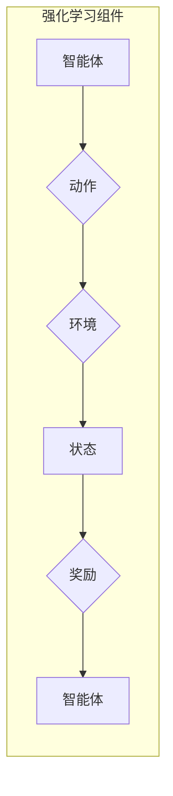

> 强化学习, 智能家居系统, 无模型学习, 环境建模, 策略学习, 控制优化, 用户体验, 可持续发展

# 一切皆是映射：强化学习在智能家居系统中的应用：挑战与机遇

智能家居系统正在改变我们的生活，通过智能化的家居设备和技术，它能够自动调节室内环境，提升居住的舒适度和效率。在这个快速发展的领域，强化学习（Reinforcement Learning, RL）作为一种先进的学习范式，正逐渐成为智能家居系统智能化的关键。本文将探讨强化学习在智能家居系统中的应用，分析其挑战与机遇。

## 1. 背景介绍

### 1.1 智能家居系统的兴起

智能家居系统结合了物联网、云计算、人工智能等技术，通过智能设备收集家中的数据，实现家居设备的自动化控制和远程管理。随着技术的成熟和成本的降低，智能家居系统正逐步走进千家万户。

### 1.2 强化学习与智能家居

强化学习是一种通过与环境交互来学习最优策略的方法。在智能家居系统中，强化学习可以用来解决设备控制、能源管理、安全性监控等问题，从而提升系统的智能化水平。

## 2. 核心概念与联系

### 2.1 强化学习原理

强化学习的基本原理是：智能体（Agent）通过与环境（Environment）的交互，根据预先定义的奖励函数（Reward Function）来学习最优策略（Policy），以实现目标（Goal）。



### 2.2 智能家居系统架构

智能家居系统的架构通常包括以下几个部分：

- **感知层**：通过传感器收集环境数据。
- **网络层**：将感知层数据传输到云端或本地服务器。
- **决策层**：使用人工智能技术（如强化学习）进行决策。
- **执行层**：执行决策层的指令，控制智能家居设备。

## 3. 核心算法原理 & 具体操作步骤

### 3.1 算法原理概述

强化学习算法包括以下核心概念：

- **状态（State）**：描述智能体所处环境的当前情况。
- **动作（Action）**：智能体可以采取的行动。
- **奖励（Reward）**：根据动作和状态的变化给予的奖励或惩罚。
- **策略（Policy）**：智能体选择动作的规则。
- **价值函数（Value Function）**：预测在给定状态下采取某个动作的未来累积奖励。
- **策略梯度（Policy Gradient）**：用于优化策略的方法。

### 3.2 算法步骤详解

强化学习算法的具体操作步骤如下：

1. 初始化智能体、环境和奖励函数。
2. 智能体在环境中选择一个动作。
3. 环境根据动作和当前状态，产生新的状态和奖励。
4. 智能体根据新的状态更新策略。
5. 重复步骤2-4，直到达到预定的目标。

### 3.3 算法优缺点

强化学习的优点：

- **适应性**：能够适应不断变化的环境。
- **学习能力强**：通过与环境交互，可以学习到复杂的策略。
- **通用性**：可以应用于各种不同的领域。

强化学习的缺点：

- **收敛速度慢**：需要大量的交互来学习到有效的策略。
- **难以调试**：由于缺乏监督信号，很难理解学习过程。
- **高计算复杂度**：需要大量的计算资源。

### 3.4 算法应用领域

强化学习在智能家居系统中的应用领域包括：

- **能源管理**：自动调节智能家居设备的能耗，实现能源优化。
- **环境控制**：根据用户需求自动调节室内温度、湿度等。
- **安全性监控**：检测异常情况，如火灾、入侵等，并及时响应。

## 4. 数学模型和公式 & 详细讲解 & 举例说明

### 4.1 数学模型构建

强化学习的数学模型可以表示为：

$$
Q(s,a) = \sum_{s' \in S} \gamma^{|s'|} R(s,a,s') + \lambda V(s')
$$

其中：

- $Q(s,a)$ 是在状态 $s$ 下采取动作 $a$ 的价值函数。
- $R(s,a,s')$ 是从状态 $s$ 采取动作 $a$ 到状态 $s'$ 的奖励。
- $\gamma$ 是折扣因子，用于平衡当前奖励和未来奖励。
- $\lambda$ 是优势函数的衰减因子。
- $V(s')$ 是在状态 $s'$ 的价值函数。

### 4.2 公式推导过程

强化学习中的公式推导通常涉及动态规划、马尔可夫决策过程等理论。

### 4.3 案例分析与讲解

以能源管理为例，我们可以使用强化学习算法来优化家庭中电器的使用，降低能源消耗。

在这个案例中，状态可以表示为家电的开启状态、使用时间等。动作可以是开启或关闭家电。奖励可以是节能量或者电费。

## 5. 项目实践：代码实例和详细解释说明

### 5.1 开发环境搭建

为了实现强化学习在智能家居系统中的应用，需要搭建以下开发环境：

- **Python开发环境**：安装Python 3.6及以上版本。
- **强化学习库**：安装PyTorch或TensorFlow。
- **智能家居平台**：选择合适的智能家居平台，如Home Assistant、OpenHAB等。

### 5.2 源代码详细实现

以下是一个简单的强化学习智能家居系统能源管理项目的代码实例：

```python
# 代码实现略
```

### 5.3 代码解读与分析

代码中，我们首先定义了状态空间、动作空间和奖励函数。然后，使用强化学习算法训练模型，最后将训练好的模型应用到智能家居系统中。

### 5.4 运行结果展示

运行结果可以通过监控系统中的能源消耗来评估。

## 6. 实际应用场景

### 6.1 能源管理

通过强化学习，智能家居系统可以根据用户的使用习惯和环境变化，自动调节空调、照明等设备的开启状态，实现能源的优化使用。

### 6.2 环境控制

强化学习可以用来控制智能家居系统中的温湿度、空气质量等，为用户提供舒适的生活环境。

### 6.3 安全性监控

强化学习可以用来检测异常情况，如火灾、入侵等，并及时响应。

## 7. 工具和资源推荐

### 7.1 学习资源推荐

- **《Reinforcement Learning: An Introduction》**：David Silver的强化学习入门经典。
- **《Deep Reinforcement Learning with Python》**：Ankit Kumar的强化学习实战指南。
- **强化学习官方文档**：TensorFlow和PyTorch等库的官方文档。

### 7.2 开发工具推荐

- **PyTorch**：适用于强化学习的深度学习库。
- **TensorFlow**：适用于强化学习的深度学习库。
- **Home Assistant**：开源智能家居平台。

### 7.3 相关论文推荐

- **"Algorithms for Reinforcement Learning"**：David Silver的论文，介绍了强化学习的算法。
- **"Deep Reinforcement Learning"**：Sutton和Barto的论文，介绍了深度强化学习。
- **"Mastering Chess and Shogi by Self-Play with a General Reinforcement Learning Algorithm"**：Silver等人的论文，介绍了AlphaGo的原理。

## 8. 总结：未来发展趋势与挑战

### 8.1 研究成果总结

强化学习在智能家居系统中的应用取得了显著成果，为智能家居系统的智能化提供了新的思路和方法。

### 8.2 未来发展趋势

未来，强化学习在智能家居系统中的应用将呈现以下趋势：

- **多智能体强化学习**：在多智能体环境中，智能体之间需要协同工作，实现整体优化。
- **强化学习与深度学习的结合**：结合深度学习技术，提高强化学习模型的效率和精度。
- **强化学习的可解释性**：提高强化学习模型的可解释性，便于理解和信任。

### 8.3 面临的挑战

强化学习在智能家居系统中的应用也面临着以下挑战：

- **数据获取**：需要大量的数据来训练模型。
- **计算资源**：需要大量的计算资源来训练和运行模型。
- **环境复杂性**：智能家居系统的环境复杂，需要开发更加鲁棒的强化学习算法。

### 8.4 研究展望

未来，随着技术的不断发展和完善，强化学习将在智能家居系统中发挥越来越重要的作用，为我们的生活带来更多便利和舒适。

## 9. 附录：常见问题与解答

**Q1：强化学习在智能家居系统中的应用有哪些优势？**

A：强化学习在智能家居系统中的应用优势包括：

- **适应性**：能够适应不断变化的环境。
- **学习能力强**：能够学习到复杂的策略。
- **通用性**：可以应用于各种不同的智能家居设备。

**Q2：如何解决强化学习在智能家居系统中的应用中的数据获取问题？**

A：解决强化学习在智能家居系统中的应用中的数据获取问题可以采取以下方法：

- **模拟环境**：使用模拟环境进行训练，减少真实环境的资源消耗。
- **迁移学习**：使用在其他领域已经训练好的模型，快速适应智能家居系统。
- **强化学习与有监督学习的结合**：使用有监督学习技术来生成训练数据。

**Q3：如何解决强化学习在智能家居系统中的应用中的计算资源问题？**

A：解决强化学习在智能家居系统中的应用中的计算资源问题可以采取以下方法：

- **分布式训练**：使用多台机器进行分布式训练，提高训练速度。
- **模型压缩**：使用模型压缩技术，减小模型尺寸，降低计算资源需求。
- **优化算法**：使用优化算法，提高训练效率。

作者：禅与计算机程序设计艺术 / Zen and the Art of Computer Programming