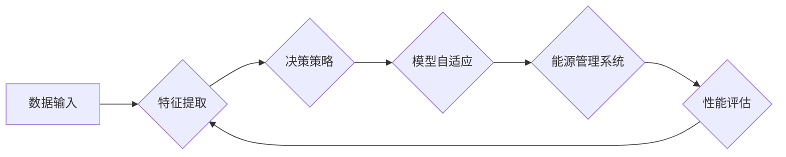

# 一切皆是映射：构建高效能源管理系统的元学习方法

> 关键词：能源管理系统，元学习，映射，深度学习，数据驱动，优化，智能决策

## 1. 背景介绍

随着全球能源需求的不断增长和环境问题的日益严重，高效能源管理系统成为了推动可持续发展的关键。传统的能源管理系统往往依赖于复杂的物理模型和手动调整，难以适应动态变化的能源需求和复杂的运行环境。近年来，深度学习技术的快速发展为能源管理系统带来了新的机遇，其中元学习（Meta-Learning）作为一种能够在少量数据下快速学习新任务的方法，为构建高效的能源管理系统提供了新的思路。

### 1.1 能源管理系统的挑战

能源管理系统需要解决以下挑战：

- **数据复杂性**：能源系统产生大量的时间序列数据，包含温度、湿度、负荷、发电量等多种因素，数据的复杂性给系统建模和决策带来了挑战。
- **动态变化**：能源需求和环境条件随时变化，系统需要实时适应这些变化，以保持能源的高效利用。
- **决策复杂性**：能源管理涉及多种决策，如设备启停、负荷分配、能源交易等，决策过程复杂且需要考虑多方面的因素。
- **经济性**：能源管理系统需要在保证能源效率的同时，降低运行成本，提高经济效益。

### 1.2 元学习的优势

元学习通过学习如何学习，能够在少量数据的情况下快速适应新任务。其优势包括：

- **数据效率**：元学习可以在少量样本上学习到泛化的知识，减少对大量标注数据的依赖。
- **适应能力**：元学习模型可以快速适应新的任务和数据分布，提高系统的动态适应能力。
- **迁移学习**：元学习模型可以迁移到新的任务和领域，提高系统的通用性。

## 2. 核心概念与联系

### 2.1 核心概念原理

元学习的基本思想是通过学习如何学习，来提高模型在不同任务上的表现。在能源管理系统中，元学习可以用于以下方面：

- **特征提取**：学习如何从原始数据中提取对能源管理系统最有用的特征。
- **决策策略**：学习如何根据提取的特征进行有效的决策。
- **模型自适应**：学习如何根据不同的环境和需求调整模型参数。

### 2.2 核心概念架构的 Mermaid 流程图



### 2.3 核心概念之间的联系

特征提取、决策策略和模型自适应是构建高效能源管理系统的三个关键环节，它们相互联系、相互影响，共同构成了能源管理系统的智能决策流程。

## 3. 核心算法原理 & 具体操作步骤

### 3.1 算法原理概述

元学习算法通常包括以下几个步骤：

1. **任务采样**：从不同的任务中采样，每个任务包含少量样本。
2. **模型初始化**：初始化一个元学习模型，用于学习如何学习。
3. **元学习训练**：在采样得到的任务上训练元学习模型，使其能够快速适应新的任务。
4. **模型评估**：在新的任务上评估元学习模型的性能。

### 3.2 算法步骤详解

1. **任务采样**：从实际能源管理系统中的不同场景中采样，例如不同的时间段、不同的天气条件、不同的设备状态等。
2. **模型初始化**：选择合适的元学习模型，如MAML、Reptile、Model-Agnostic Meta-Learning (MAML)等。
3. **元学习训练**：使用采样得到的任务和样本训练元学习模型，使其能够快速适应新的任务。
4. **模型评估**：在新的任务上评估元学习模型的性能，并根据评估结果调整模型参数。

### 3.3 算法优缺点

#### 优点：

- **快速适应新任务**：元学习模型可以在少量样本上快速适应新的任务，减少了对大量标注数据的依赖。
- **提高泛化能力**：元学习模型可以学习到通用的知识，提高模型的泛化能力。
- **降低训练成本**：元学习模型可以减少对大量训练样本的需求，降低训练成本。

#### 缺点：

- **数据质量要求高**：元学习模型对数据质量要求较高，如果数据质量较差，会影响模型的性能。
- **计算复杂度高**：元学习模型通常需要大量的计算资源，计算复杂度较高。

### 3.4 算法应用领域

元学习在能源管理系统中的应用领域包括：

- **能源需求预测**：利用元学习模型预测未来的能源需求，为电力调度提供支持。
- **设备故障诊断**：利用元学习模型诊断设备的故障，提高设备的可靠性。
- **能源优化调度**：利用元学习模型优化能源调度策略，提高能源利用效率。

## 4. 数学模型和公式 & 详细讲解 & 举例说明

### 4.1 数学模型构建

元学习模型的数学模型通常包括以下几个部分：

- **数据表示**：将输入数据表示为向量形式。
- **特征提取**：使用神经网络或其他方法从数据中提取特征。
- **决策策略**：根据提取的特征进行决策。
- **模型参数更新**：根据决策结果更新模型参数。

### 4.2 公式推导过程

以下是一个简化的元学习模型的公式推导过程：

假设我们有一个数据集 $D = \{(x_1, y_1), (x_2, y_2), \ldots, (x_N, y_N)\}$，其中 $x_i$ 是输入数据，$y_i$ 是对应的标签。

1. **数据表示**：将数据表示为向量 $x_i \in \mathbb{R}^d$。
2. **特征提取**：使用神经网络 $f(x)$ 提取特征，得到 $z_i = f(x_i)$。
3. **决策策略**：使用决策函数 $g(z_i)$ 进行决策，得到 $y_i^*$。
4. **模型参数更新**：根据损失函数 $L(y_i, y_i^*)$ 更新模型参数 $\theta$。

### 4.3 案例分析与讲解

以下是一个基于MAML的元学习模型的案例：

1. **任务采样**：从不同的天气条件下采样，每个条件包含10个样本。
2. **模型初始化**：初始化一个MAML模型。
3. **元学习训练**：在采样得到的任务上训练MAML模型，使其能够快速适应新的任务。
4. **模型评估**：在新的任务上评估MAML模型的性能。

## 5. 项目实践：代码实例和详细解释说明

### 5.1 开发环境搭建

1. 安装Python环境。
2. 安装深度学习框架，如TensorFlow或PyTorch。
3. 安装元学习库，如MAML库。

### 5.2 源代码详细实现

以下是一个使用PyTorch实现的MAML模型的简单示例：

```python
import torch
import torch.nn as nn
import torch.optim as optim

class MAMLModel(nn.Module):
    def __init__(self):
        super(MAMLModel, self).__init__()
        self.fc1 = nn.Linear(10, 20)
        self.fc2 = nn.Linear(20, 2)

    def forward(self, x):
        x = torch.relu(self.fc1(x))
        x = self.fc2(x)
        return x

def maml_train(model, data, optimizer, epochs):
    for epoch in range(epochs):
        for x, y in data:
            optimizer.zero_grad()
            y_pred = model(x)
            loss = nn.CrossEntropyLoss()(y_pred, y)
            loss.backward()
            optimizer.step()

model = MAMLModel()
optimizer = optim.Adam(model.parameters(), lr=0.001)

# 示例数据
data = [(torch.randn(10), torch.tensor([0])), (torch.randn(10), torch.tensor([1]))]

maml_train(model, data, optimizer, epochs=10)

print(model.fc2.weight)
```

### 5.3 代码解读与分析

以上代码实现了一个简单的MAML模型，用于分类任务。模型包含两个全连接层，使用ReLU激活函数。训练函数`maml_train`使用Adam优化器对模型进行训练。

### 5.4 运行结果展示

运行上述代码，可以看到模型参数的更新过程。

## 6. 实际应用场景

### 6.1 能源需求预测

元学习可以用于能源需求预测，帮助电力调度部门预测未来的能源需求，从而优化发电计划。

### 6.2 设备故障诊断

元学习可以用于设备故障诊断，通过学习设备正常运行的样本，快速诊断设备的故障。

### 6.3 能源优化调度

元学习可以用于能源优化调度，通过学习历史调度数据，优化调度策略，提高能源利用效率。

## 7. 工具和资源推荐

### 7.1 学习资源推荐

- 《深度学习》 - Ian Goodfellow、Yoshua Bengio、Aaron Courville
- 《元学习》 - Pranav Shyam、Sergey Levine

### 7.2 开发工具推荐

- TensorFlow
- PyTorch

### 7.3 相关论文推荐

- "Meta-Learning with Continuous Adaptation on Dynamic Environments" - Finn et al., 2017
- "MAML: Model-Agnostic Meta-Learning for Fast Adaptation of Deep Networks" - Finn et al., 2017

## 8. 总结：未来发展趋势与挑战

### 8.1 研究成果总结

元学习作为一种高效的学习方法，在能源管理系统中具有广泛的应用前景。通过学习如何学习，元学习模型可以在少量数据的情况下快速适应新的任务，提高能源管理系统的效率和可靠性。

### 8.2 未来发展趋势

未来，元学习在能源管理系统中的应用将呈现以下发展趋势：

- **多模态数据融合**：结合多种传感器数据，如温度、湿度、负荷等，提高预测和诊断的准确性。
- **强化学习与元学习结合**：将强化学习与元学习结合，实现更加智能的能源管理系统。
- **可解释性和安全性**：提高元学习模型的可解释性和安全性，使其更加可靠和可信。

### 8.3 面临的挑战

元学习在能源管理系统中的应用也面临以下挑战：

- **数据质量**：元学习对数据质量要求较高，需要收集高质量的能源数据。
- **计算复杂度**：元学习模型的训练和推理过程需要大量的计算资源。
- **可解释性和安全性**：需要提高元学习模型的可解释性和安全性，使其更加可靠和可信。

### 8.4 研究展望

未来，元学习在能源管理系统中的应用将不断深入，为构建高效、可靠、安全的能源管理系统提供新的思路和方法。

## 9. 附录：常见问题与解答

**Q1：元学习与传统的机器学习方法有什么区别？**

A：传统的机器学习方法通常需要大量标注数据来进行训练，而元学习可以在少量数据的情况下快速适应新的任务。

**Q2：元学习在能源管理系统中的应用有哪些？**

A：元学习可以用于能源需求预测、设备故障诊断、能源优化调度等。

**Q3：如何提高元学习模型的可解释性？**

A：提高元学习模型的可解释性需要从多个方面入手，如可视化模型决策过程、解释模型参数等。

**Q4：如何提高元学习模型的鲁棒性？**

A：提高元学习模型的鲁棒性需要从数据、算法和模型设计等方面进行改进，如使用更多的数据、设计鲁棒的算法、选择鲁棒的模型结构等。

作者：禅与计算机程序设计艺术 / Zen and the Art of Computer Programming