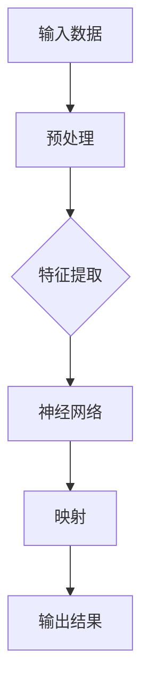

# 一切皆是映射：深度学习在智能家居系统中的应用

> 关键词：深度学习，智能家居，机器学习，自然语言处理，物联网，神经网络，数据挖掘

## 1. 背景介绍

随着物联网技术的飞速发展，智能家居系统逐渐成为现代家庭生活的重要组成部分。智能家居系统通过集成各种智能设备，如智能家电、传感器、控制系统等，实现了家庭环境的自动化、智能化管理。深度学习作为一种强大的机器学习技术，在智能家居系统的设计、开发和应用中发挥着越来越重要的作用。本文将探讨深度学习在智能家居系统中的应用，以及如何通过映射原理实现智能化的生活体验。

### 1.1 问题的由来

智能家居系统的目标是提高居住的舒适度、安全性和能效。为了实现这一目标，系统需要具备以下能力：

- **环境感知**：实时监测家庭环境，如温度、湿度、光照、噪音等。
- **设备控制**：根据用户需求和环境变化自动控制家电设备。
- **安全监控**：实时监控家庭安全，如门禁、烟雾报警等。
- **生活助手**：为用户提供便捷的生活服务，如语音交互、日程管理等。

深度学习技术能够帮助智能家居系统实现上述功能，通过学习大量数据，模型能够自动提取特征，进行决策和预测。

### 1.2 研究现状

目前，深度学习在智能家居系统中的应用主要体现在以下几个方面：

- **图像识别**：识别家庭成员、家庭环境和物体。
- **语音识别与生成**：实现语音控制家电、语音助手等功能。
- **自然语言处理**：理解用户指令，执行相应的操作。
- **预测分析**：预测家庭能耗、设备故障等。

### 1.3 研究意义

研究深度学习在智能家居系统中的应用，对于提高生活品质、降低能耗、提升安全性具有重要意义。同时，这也是推动人工智能技术走向实际应用的重要方向。

### 1.4 本文结构

本文将按照以下结构展开：

- 第2部分，介绍深度学习在智能家居系统中的核心概念和映射原理。
- 第3部分，详细阐述深度学习在智能家居系统中的应用算法和操作步骤。
- 第4部分，分析深度学习模型在智能家居系统中的数学模型和公式。
- 第5部分，通过代码实例展示深度学习在智能家居系统中的应用实践。
- 第6部分，探讨深度学习在智能家居系统中的实际应用场景和未来展望。
- 第7部分，推荐相关学习资源和开发工具。
- 第8部分，总结研究成果，展望未来发展趋势和挑战。
- 第9部分，提供常见问题与解答。

## 2. 核心概念与联系

### 2.1 核心概念

- **深度学习**：一种基于神经网络的学习方法，通过层次化的神经网络结构自动提取数据特征。
- **映射**：将输入数据映射到输出结果的过程，如图像到物体识别、声音到文字识别等。
- **神经网络**：一种模拟人脑神经元连接的计算机模型，能够通过学习数据自动提取特征。
- **数据挖掘**：从大量数据中提取有价值信息的过程。
- **物联网**：通过互联网连接各种设备，实现设备间的互联互通。

### 2.2 Mermaid 流程图



### 2.3 核心概念联系

深度学习通过神经网络实现数据到输出的映射，是智能家居系统智能化的重要组成部分。预处理、特征提取和映射是深度学习模型的核心步骤。

## 3. 核心算法原理 & 具体操作步骤

### 3.1 算法原理概述

深度学习算法通过神经网络结构，自动从数据中学习特征和模式，实现数据到输出的映射。在智能家居系统中，深度学习算法可以用于图像识别、语音识别、自然语言处理等任务。

### 3.2 算法步骤详解

1. **数据采集**：收集家庭环境、设备状态和用户行为数据。
2. **数据预处理**：对采集到的数据进行清洗、转换和标准化。
3. **特征提取**：使用深度学习模型从预处理后的数据中提取特征。
4. **模型训练**：使用训练数据训练深度学习模型。
5. **模型评估**：使用验证数据评估模型性能。
6. **模型部署**：将训练好的模型部署到智能家居系统中。
7. **系统集成**：将深度学习模型与其他系统模块集成，实现智能化功能。

### 3.3 算法优缺点

#### 优点

- **自动特征提取**：无需手动设计特征，能够自动从数据中学习特征。
- **泛化能力强**：能够在未见过的数据上表现良好。
- **高度可扩展性**：能够处理各种复杂任务。

#### 缺点

- **计算量大**：需要大量的计算资源和时间进行训练。
- **数据需求量大**：需要大量的数据才能训练出有效的模型。
- **模型可解释性差**：难以解释模型的决策过程。

### 3.4 算法应用领域

- **图像识别**：识别家庭成员、家庭环境和物体。
- **语音识别与生成**：实现语音控制家电、语音助手等功能。
- **自然语言处理**：理解用户指令，执行相应的操作。
- **预测分析**：预测家庭能耗、设备故障等。

## 4. 数学模型和公式 & 详细讲解 & 举例说明

### 4.1 数学模型构建

深度学习模型通常由多个神经网络层组成，包括输入层、隐藏层和输出层。以下是简单的神经网络数学模型：

$$
y = f(W \cdot x + b)
$$

其中，$y$ 是输出，$x$ 是输入，$W$ 是权重，$b$ 是偏置，$f$ 是激活函数。

### 4.2 公式推导过程

以卷积神经网络（CNN）为例，其数学模型如下：

$$
h^{(l)} = f(W^{(l)} \cdot h^{(l-1)} + b^{(l)})
$$

其中，$h^{(l)}$ 是第$l$层的激活输出，$W^{(l)}$ 是第$l$层的权重，$b^{(l)}$ 是第$l$层的偏置，$f$ 是激活函数。

### 4.3 案例分析与讲解

以下是一个简单的图像分类任务的例子：

- **数据集**：CIFAR-10数据集，包含10个类别的60,000个32x32彩色图像。
- **模型**：卷积神经网络（CNN）。
- **任务**：将图像分类到10个类别之一。

通过训练和测试，模型能够在CIFAR-10数据集上达到较高的准确率。

## 5. 项目实践：代码实例和详细解释说明

### 5.1 开发环境搭建

- 安装Python、TensorFlow或PyTorch等深度学习框架。
- 准备训练数据集和测试数据集。

### 5.2 源代码详细实现

以下是一个使用PyTorch实现CNN模型进行图像分类的简单示例：

```python
import torch
import torch.nn as nn
import torchvision.transforms as transforms
from torchvision.datasets import CIFAR10
from torch.utils.data import DataLoader

# 定义CNN模型
class CNN(nn.Module):
    def __init__(self):
        super(CNN, self).__init__()
        self.conv1 = nn.Conv2d(3, 32, kernel_size=3, padding=1)
        self.conv2 = nn.Conv2d(32, 64, kernel_size=3, padding=1)
        self.fc1 = nn.Linear(64 * 4 * 4, 128)
        self.fc2 = nn.Linear(128, 10)

    def forward(self, x):
        x = nn.functional.relu(self.conv1(x))
        x = nn.functional.max_pool2d(x, 2)
        x = nn.functional.relu(self.conv2(x))
        x = nn.functional.max_pool2d(x, 2)
        x = x.view(-1, 64 * 4 * 4)
        x = nn.functional.relu(self.fc1(x))
        x = self.fc2(x)
        return x

# 训练模型
def train(model, train_loader, optimizer, criterion):
    model.train()
    for data, target in train_loader:
        optimizer.zero_grad()
        output = model(data)
        loss = criterion(output, target)
        loss.backward()
        optimizer.step()

# 测试模型
def test(model, test_loader, criterion):
    model.eval()
    total = 0
    correct = 0
    with torch.no_grad():
        for data, target in test_loader:
            output = model(data)
            loss = criterion(output, target)
            total += target.size(0)
            correct += (output.argmax(1) == target).sum().item()
    print(f"Accuracy of the network on the 10000 test images: {100 * correct / total}%")

# 主程序
def main():
    train_transform = transforms.Compose([transforms.ToTensor()])
    test_transform = transforms.Compose([transforms.ToTensor()])

    train_dataset = CIFAR10(root='./data', train=True, download=True, transform=train_transform)
    test_dataset = CIFAR10(root='./data', train=False, transform=test_transform)

    train_loader = DataLoader(train_dataset, batch_size=4, shuffle=True)
    test_loader = DataLoader(test_dataset, batch_size=4, shuffle=False)

    model = CNN()
    optimizer = torch.optim.Adam(model.parameters(), lr=0.001)
    criterion = nn.CrossEntropyLoss()

    for epoch in range(2):  # loop over the dataset multiple times
        print(f"Epoch {epoch + 1}")
        train(model, train_loader, optimizer, criterion)
        test(model, test_loader, criterion)

if __name__ == '__main__':
    main()
```

### 5.3 代码解读与分析

以上代码定义了一个简单的CNN模型，用于对CIFAR-10数据集进行图像分类。代码中包含以下关键部分：

- `CNN` 类定义了CNN模型的结构，包括卷积层、池化层和全连接层。
- `train` 函数用于训练模型，包括前向传播、计算损失和反向传播。
- `test` 函数用于测试模型，计算测试集上的准确率。
- `main` 函数是程序的主入口，包括数据加载、模型训练和测试。

### 5.4 运行结果展示

运行上述代码，模型将在CIFAR-10数据集上进行训练和测试，并打印出测试集上的准确率。

## 6. 实际应用场景

### 6.1 环境监测

使用深度学习模型可以实时监测家庭环境，如温度、湿度、光照等。例如，可以使用CNN模型识别家庭环境中的物体，如宠物、人等，从而调整室内温度和湿度，创造舒适的生活环境。

### 6.2 设备控制

深度学习模型可以用于控制家电设备，如开关灯、调节空调等。例如，可以使用语音识别模型理解用户的语音指令，并通过控制信号控制家电设备。

### 6.3 安全监控

深度学习模型可以用于安全监控，如人脸识别、异常行为检测等。例如，可以使用卷积神经网络识别家庭成员，并通过人脸识别系统控制门禁。

### 6.4 生活助手

深度学习模型可以用于实现生活助手功能，如语音助手、日程管理等。例如，可以使用自然语言处理模型理解用户的语音指令，并执行相应的操作。

### 6.5 预测分析

深度学习模型可以用于预测分析，如家庭能耗预测、设备故障预测等。例如，可以使用时间序列分析模型预测家庭的能耗，从而优化能源使用。

## 7. 工具和资源推荐

### 7.1 学习资源推荐

- 《深度学习》（Goodfellow等著）
- 《Python深度学习》（François Chollet著）
- 《动手学深度学习》（Dua和Laurie J. Heyer著）

### 7.2 开发工具推荐

- TensorFlow
- PyTorch
- Keras
- OpenCV

### 7.3 相关论文推荐

- "Deep Learning for Image Recognition"（Goodfellow等著）
- "Generative Adversarial Nets"（Goodfellow等著）
- "Recurrent Neural Networks for Language Modeling"（Graves著）

## 8. 总结：未来发展趋势与挑战

### 8.1 研究成果总结

深度学习技术在智能家居系统中的应用取得了显著成果，为家庭生活带来了极大的便利。通过映射原理，深度学习模型能够从数据中学习特征和模式，实现智能化功能。

### 8.2 未来发展趋势

- **模型轻量化**：开发轻量级深度学习模型，降低对算力的需求。
- **边缘计算**：将深度学习模型部署到边缘设备，实现实时性。
- **跨模态学习**：将多种模态数据（如文本、图像、声音）进行融合，提高模型的智能水平。
- **可解释性研究**：提高模型的可解释性，增强用户对模型的信任。

### 8.3 面临的挑战

- **数据隐私**：智能家居系统涉及大量用户隐私数据，如何保护用户隐私是一个重要挑战。
- **安全性和可靠性**：智能家居系统需要保证安全性，防止恶意攻击和数据泄露。
- **模型泛化能力**：提高模型在不同场景和任务上的泛化能力。
- **能耗优化**：降低模型训练和推理的能耗。

### 8.4 研究展望

随着深度学习技术的不断发展，智能家居系统将变得更加智能化、个性化和便捷。未来，深度学习将在智能家居系统中扮演更加重要的角色，推动家庭生活的变革。

## 9. 附录：常见问题与解答

**Q1：深度学习模型在智能家居系统中的应用前景如何？**

A1：深度学习模型在智能家居系统中的应用前景非常广阔。随着技术的不断进步，深度学习模型将能够更好地理解用户需求，提供更加个性化的服务。

**Q2：如何保护智能家居系统中的用户隐私？**

A2：保护用户隐私需要从数据采集、存储、传输和处理等环节进行严格控制。例如，可以对用户数据进行匿名化处理，使用加密技术保护数据安全。

**Q3：如何提高深度学习模型的泛化能力？**

A3：提高深度学习模型的泛化能力需要从数据、模型和训练等方面进行优化。例如，使用更多的数据、设计更复杂的模型结构和采用更有效的训练策略。

**Q4：智能家居系统如何实现能耗优化？**

A4：智能家居系统可以通过以下方式实现能耗优化：

- 使用节能设备。
- 根据用户需求调整设备状态。
- 使用预测分析技术优化能源使用。

---

作者：禅与计算机程序设计艺术 / Zen and the Art of Computer Programming