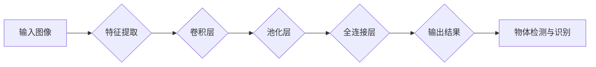

> - 物体检测
> - 物体识别
> - 卷积神经网络
> - 特征提取
> - 目标检测算法
> - 深度学习
> - 人工智能

# 一切皆是映射：物体检测与识别：AI的视觉能力

物体检测与识别是人工智能视觉领域的关键任务，它们赋予计算机像人类一样“看”的能力，使得计算机能够理解和解释图像和视频中的内容。本文将深入探讨物体检测与识别的原理、算法、实践应用以及未来发展趋势。

## 1. 背景介绍

随着深度学习技术的飞速发展，物体检测与识别技术在过去几年取得了显著的进展。从传统的基于图像处理的算法到深度学习时代的卷积神经网络（CNNs），再到近年来涌现的各种先进算法，物体检测与识别技术已经广泛应用于自动驾驶、视频监控、工业质检、医疗影像等多个领域。

### 1.1 问题的由来

物体检测与识别的核心目标是：

1. **物体检测**：确定图像或视频帧中的物体位置，并给出每个物体的类别。
2. **物体识别**：识别出图像或视频帧中的特定物体类别。

这两个任务在计算机视觉中至关重要，因为它们为计算机提供了对视觉世界的基本理解。

### 1.2 研究现状

在深度学习时代，基于CNN的物体检测与识别算法取得了显著的进步。以下是一些代表性算法：

- **R-CNN系列**：通过选择性搜索（Selective Search）生成候选区域（RoIs），然后对这些区域进行分类。
- **Fast R-CNN**：在R-CNN的基础上，将候选区域生成和分类合并到一个统一的神经网络中。
- **Faster R-CNN**：引入区域建议网络（Region Proposal Networks，RPN），进一步提高了候选区域生成的速度和准确性。
- **SSD（Single Shot MultiBox Detector）**：在单个网络中同时进行候选区域生成和分类，提高了检测速度。
- **YOLO（You Only Look Once）**：在图像中同时预测所有可能的物体位置和类别，速度极快。
- **RetinaNet**：通过锚框机制和Focal Loss解决了困难样本的检测问题。

### 1.3 研究意义

物体检测与识别技术的突破，不仅推动了计算机视觉技术的发展，也为众多领域带来了革命性的变革。以下是其重要意义：

- **自动化**：提高生产效率，降低人力成本。
- **安全**：在安全监控、自动驾驶等领域提高安全性。
- **便捷**：为智能助手、智能家居等提供便捷的交互体验。
- **医疗**：辅助医生进行疾病诊断。
- **娱乐**：丰富娱乐体验，如虚拟现实、增强现实等。

### 1.4 本文结构

本文将按照以下结构进行：

- **第2章**：介绍物体检测与识别的核心概念与联系。
- **第3章**：阐述物体检测与识别的核心算法原理与具体操作步骤。
- **第4章**：讲解数学模型和公式，并举例说明。
- **第5章**：提供项目实践，包括开发环境搭建、代码实例和运行结果展示。
- **第6章**：探讨实际应用场景和未来应用展望。
- **第7章**：推荐学习资源、开发工具和相关论文。
- **第8章**：总结研究成果，展望未来发展趋势与挑战。
- **第9章**：提供常见问题与解答。

## 2. 核心概念与联系

### 2.1 核心概念

- **卷积神经网络（CNN）**：一种深度学习模型，擅长于从图像中提取局部特征和层次化特征。
- **特征提取**：从原始数据中提取有用信息的过程。
- **目标检测算法**：用于检测图像或视频帧中物体的算法。
- **物体识别**：识别图像或视频帧中的特定物体类别。

### 2.2 Mermaid 流程图



### 2.3 核心概念联系

物体检测与识别的过程可以看作是一个从输入图像到输出结果的映射过程，其中CNN等深度学习模型扮演着特征提取的关键角色。

## 3. 核心算法原理 & 具体操作步骤

### 3.1 算法原理概述

物体检测与识别算法通常包括以下步骤：

1. **特征提取**：使用CNN等深度学习模型从图像中提取特征。
2. **候选区域生成**：根据提取的特征，生成可能的物体候选区域。
3. **候选区域分类**：对候选区域进行分类，确定其类别。
4. **非极大值抑制（NMS）**：去除重叠的候选区域，保留最具信度的区域。

### 3.2 算法步骤详解

#### 3.2.1 特征提取

特征提取是物体检测与识别的关键步骤，它负责从原始图像中提取具有区分度的特征。常用的CNN结构包括VGG、ResNet、MobileNet等。

#### 3.2.2 候选区域生成

候选区域生成是指在图像中生成可能的物体位置和尺寸。常用的方法包括选择性搜索、滑动窗口、基于区域提议网络（RPN）等。

#### 3.2.3 候选区域分类

候选区域分类是对候选区域进行类别判断。常用的分类器包括SVM、CNN、softmax等。

#### 3.2.4 非极大值抑制（NMS）

非极大值抑制（Non-Maximum Suppression，NMS）是一种常用的去重方法，用于去除重叠的候选区域，保留最具信度的区域。

### 3.3 算法优缺点

以下是几种常见物体检测与识别算法的优缺点：

| 算法       | 优点                         | 缺点                     |
|------------|------------------------------|--------------------------|
| R-CNN      | 精度高                       | 速度慢，计算量大           |
| Fast R-CNN | 速度比R-CNN快                 | 计算量大，依赖候选区域生成 |
| Faster R-CNN | 速度更快，不依赖候选区域生成 | 计算量大                 |
| SSD        | 速度快                       | 精度略低于Faster R-CNN     |
| YOLO       | 速度极快                     | 精度较低                 |
| RetinaNet  | 适用于困难样本的检测         | 计算量大                 |

### 3.4 算法应用领域

物体检测与识别算法在以下领域得到了广泛应用：

- **自动驾驶**：用于检测道路上的车辆、行人、交通标志等。
- **视频监控**：用于监控公共场所的安全。
- **工业质检**：用于检测产品质量。
- **医疗影像分析**：用于辅助医生进行疾病诊断。
- **机器人视觉**：用于机器人导航和操作。

## 4. 数学模型和公式 & 详细讲解 & 举例说明

### 4.1 数学模型构建

物体检测与识别的数学模型通常包括以下部分：

- **特征提取器**：使用CNN等深度学习模型提取图像特征。
- **候选区域生成器**：根据图像特征生成候选区域。
- **分类器**：对候选区域进行分类。
- **NMS**：去除重叠的候选区域。

### 4.2 公式推导过程

以下是物体检测与识别中常用的数学公式：

- **CNN公式**：
  $$
  f(x; \theta) = f_{\text{conv}}(f_{\text{pool}}(f_{\text{relu}}(f_{\text{conv}}(x; \theta_1), \theta_2), \theta_3), \theta_4)
  $$

- **SVM分类器**：
  $$
  w \cdot \mathbf{x} + b = 0
  $$

- **softmax函数**：
  $$
  P(y=i) = \frac{e^{w_i \cdot \mathbf{x} + b_i}}{\sum_{j=1}^{K} e^{w_j \cdot \mathbf{x} + b_j}}
  $$

### 4.3 案例分析与讲解

以Faster R-CNN为例，其核心思想是将候选区域生成和分类合并到一个统一的神经网络中。

- **RPN**：使用ROI Pooling层将候选区域映射到特征图上的固定大小区域，然后使用全连接层进行分类和边界框回归。
- **ROI Head**：对每个候选区域进行分类和边界框回归。

## 5. 项目实践：代码实例和详细解释说明

### 5.1 开发环境搭建

为了进行物体检测与识别的项目实践，我们需要以下开发环境：

- 操作系统：Linux或macOS
- 编程语言：Python
- 框架：TensorFlow或PyTorch
- 库：NumPy、Pandas、OpenCV等

### 5.2 源代码详细实现

以下是一个使用TensorFlow和TensorFlow Object Detection API进行物体检测的简单示例：

```python
import tensorflow as tf
from object_detection.utils import config_util
from object_detection.protos import pipeline_pb2
from object_detection.protos import train_config_pb2

# 加载配置文件
pipeline_config = pipeline_pb2.TrainConfig()
with tf.io.gfile.GFile('object_detection/configs/faster_rcnn_resnet50_coco17.config', 'r') as fid:
    text_format.Merge(fid.read(), pipeline_config)

# 创建模型
model = tf.saved_model.load('faster_rcnn_resnet50_coco17')

# 加载图像
image = load_image_into_numpy_array('path/to/your/image.jpg')

# 进行检测
 detections = model(image)

# 解析检测结果
detections = postprocess_detections(detections, image, pipeline_config)

# 显示检测结果
display_results(image, detections)
```

### 5.3 代码解读与分析

以上代码展示了如何使用TensorFlow Object Detection API进行物体检测。首先，加载配置文件和模型，然后加载图像，并进行检测。最后，解析检测结果并显示检测结果。

### 5.4 运行结果展示

运行以上代码，将显示图像中的物体检测结果，包括物体的类别、位置和置信度。

## 6. 实际应用场景

物体检测与识别技术在以下实际应用场景中发挥着重要作用：

- **自动驾驶**：用于检测道路上的车辆、行人、交通标志等，确保车辆安全行驶。
- **视频监控**：用于监控公共场所的安全，及时发现异常情况。
- **工业质检**：用于检测产品质量，提高生产效率。
- **医疗影像分析**：用于辅助医生进行疾病诊断，提高诊断准确率。
- **机器人视觉**：用于机器人导航和操作，提高机器人智能化水平。

## 7. 工具和资源推荐

### 7.1 学习资源推荐

- **书籍**：
  - 《深度学习》（Goodfellow, Bengio, Courville）
  - 《计算机视觉：算法与应用》（Richard Szeliski）
- **在线课程**：
  - TensorFlow Object Detection API教程
  - PyTorch Object Detection教程
- **网站**：
  - TensorFlow官网
  - PyTorch官网
  - OpenCV官网

### 7.2 开发工具推荐

- **框架**：
  - TensorFlow
  - PyTorch
- **库**：
  - NumPy
  - Pandas
  - OpenCV

### 7.3 相关论文推荐

- **Faster R-CNN**：《Fast R-CNN: Towards Real-Time Object Detection with Region Proposal Networks》
- **YOLO**：`You Only Look Once: Unified, Real-Time Object Detection》
- **SSD**：`Single Shot MultiBox Detector》
- **RetinaNet**：`RetinaNet: Faster R-CNN with ResNet Feature Pyramids》

## 8. 总结：未来发展趋势与挑战

### 8.1 研究成果总结

物体检测与识别技术在深度学习时代取得了显著的进展，但仍有许多挑战需要克服。

### 8.2 未来发展趋势

- **更快的速度**：使用更高效的模型结构和算法，提高检测速度。
- **更高的精度**：提高检测精度，减少误检和漏检。
- **更小的模型**：减小模型尺寸，降低计算量，提高部署效率。
- **多模态融合**：将图像、视频、音频等多种模态信息进行融合，提高检测和识别效果。

### 8.3 面临的挑战

- **数据标注**：高质量的数据标注成本高昂。
- **计算资源**：深度学习模型需要大量的计算资源。
- **模型可解释性**：需要提高模型的可解释性，确保其可靠性。
- **伦理问题**：需要解决模型可能带来的伦理问题。

### 8.4 研究展望

未来，物体检测与识别技术将朝着以下方向发展：

- **更智能的模型**：使用更先进的算法和模型结构，提高检测和识别能力。
- **更广泛的应用**：将物体检测与识别技术应用于更多领域。
- **更开放的生态**：建立更开放的生态系统，促进技术发展。

## 9. 附录：常见问题与解答

**Q1：物体检测与识别算法有哪些应用场景？**

A：物体检测与识别算法在自动驾驶、视频监控、工业质检、医疗影像分析、机器人视觉等领域得到了广泛应用。

**Q2：如何选择合适的物体检测与识别算法？**

A：选择合适的算法需要考虑以下因素：

- **任务需求**：不同的任务可能需要不同的算法。
- **数据量**：对于数据量较小的任务，可以选择速度较快的算法。
- **计算资源**：考虑计算资源限制，选择合适的算法。

**Q3：物体检测与识别算法的精度和速度如何平衡？**

A：精度和速度往往是相互矛盾的。为了在精度和速度之间取得平衡，可以选择以下策略：

- **模型结构**：使用更轻量级的模型结构。
- **数据增强**：使用数据增强技术提高模型的鲁棒性。
- **算法优化**：优化算法实现，提高效率。

**Q4：物体检测与识别算法如何提高可解释性？**

A：提高模型可解释性需要以下策略：

- **可视化**：将模型的内部结构可视化。
- **解释性模型**：使用可解释性模型，如LIME、SHAP等。

**Q5：物体检测与识别算法的伦理问题有哪些？**

A：物体检测与识别算法的伦理问题包括：

- **偏见**：模型可能存在偏见，导致不公平的判断。
- **隐私**：模型可能侵犯个人隐私。
- **责任**：模型可能产生错误的结果，导致不良后果。

作者：禅与计算机程序设计艺术 / Zen and the Art of Computer Programming