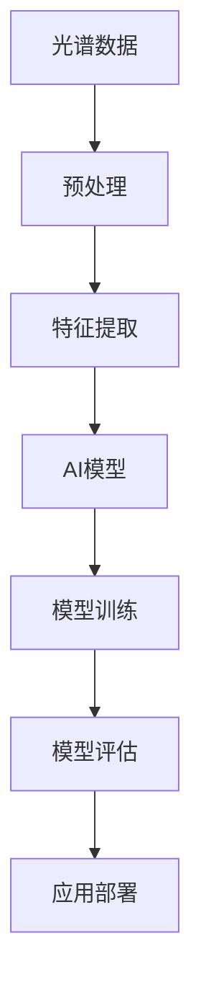
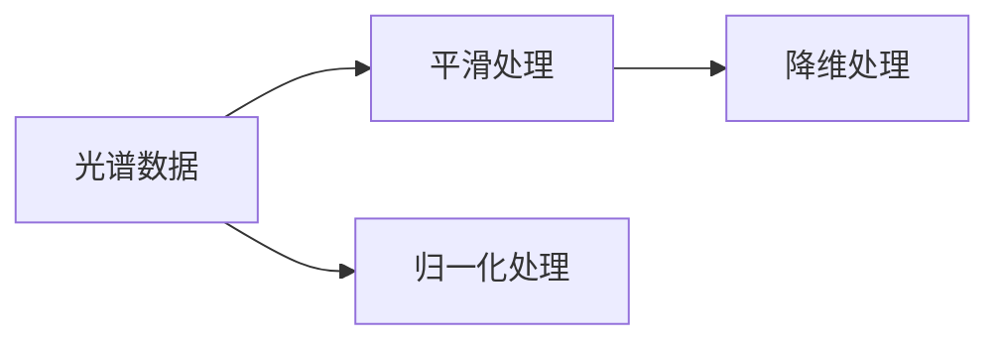
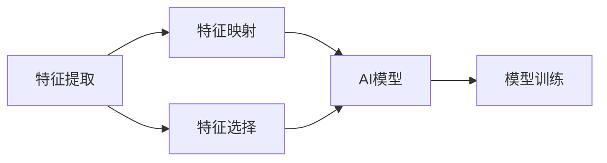
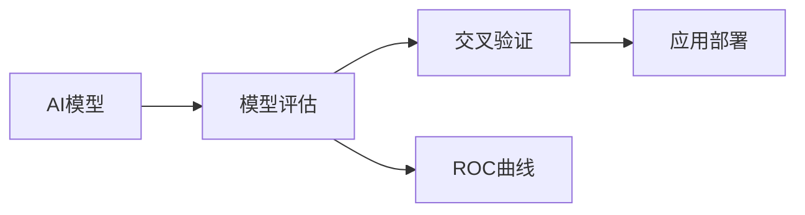
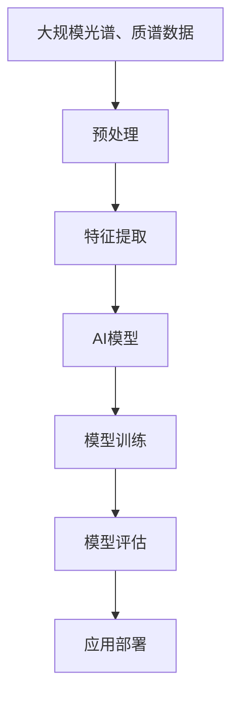

                 

## 1. 背景介绍

### 1.1 问题由来
光谱、质谱技术是化学、生物、医学等领域中常用的分析手段，通过分析物质的特性，可以揭示分子结构、化学反应机理等信息。随着人工智能(AI)技术的发展，光谱、质谱数据被广泛应用于机器学习模型训练中，辅助AI模型进行预测和分析。这一交叉领域的技术发展，不仅能够提升AI模型在分子识别、药物研发、环境监测等方面的性能，还能够为科学研究提供新的视角和方法。

### 1.2 问题核心关键点
光谱、质谱数据通常具有高维、稀疏、非线性的特性，直接用于机器学习模型的训练可能会面临数据表达、特征提取、模型泛化等挑战。当前，基于光谱、质谱数据进行AI模型训练的技术，主要包括以下几个关键点：

- **数据预处理**：对光谱、质谱数据进行平滑、归一化、降维等预处理，以提高数据质量。
- **特征提取**：将光谱、质谱信号转换为机器学习模型可处理的特征形式，如特征映射、特征选择等。
- **模型优化**：选择合适的机器学习模型和优化算法，如深度神经网络、支持向量机、随机森林等，并对其进行参数优化。
- **模型评估**：评估模型的预测性能和泛化能力，如交叉验证、ROC曲线等。
- **应用部署**：将训练好的模型部署到实际应用场景中，进行实时预测和分析。

这些关键点共同构成了光谱、质谱数据在AI中的使用框架，为后续的具体技术展开奠定了基础。

### 1.3 问题研究意义
光谱、质谱技术在AI中的应用，能够显著提升分子识别、物质分类、环境监测等领域的自动化水平和准确性，推动相关科学研究和技术进步。具体而言，研究光谱、质谱数据在AI中的应用，具有以下几方面的重要意义：

1. **提高预测准确性**：通过光谱、质谱数据的预处理和特征提取，能够提高AI模型对复杂分子结构、化合物特性的理解能力，从而提升预测准确性。
2. **拓展应用范围**：AI模型结合光谱、质谱技术，能够应用于更多领域，如药物研发、环境监测、食品检测等，推动相关产业的发展。
3. **促进交叉学科发展**：光谱、质谱技术与AI的结合，促进了化学、生物、医学等学科与AI的交叉融合，推动了科学研究的前沿进展。
4. **降低成本和时间**：AI模型通过快速处理大量光谱、质谱数据，显著降低了实验成本和时间，提升了科研和产业的效率。
5. **提升自动化水平**：基于AI的光谱、质谱技术，能够实现自动化分析、预测和决策，提高了科研和工业的自动化水平。

## 2. 核心概念与联系

### 2.1 核心概念概述

为更好地理解光谱、质谱数据在AI中的应用，本节将介绍几个密切相关的核心概念：

- **光谱(Spectroscopy)**：指通过物质吸收、发射或散射电磁波来分析物质结构、化学性质的一种方法。包括紫外光谱、红外光谱、拉曼光谱等。
- **质谱(Mass Spectrometry)**：指通过分析物质离子化后质量-电荷比(m/z)信息，揭示物质的分子结构和组成的一种方法。
- **AI模型**：指基于机器学习、深度学习等技术构建的预测和分析模型，包括神经网络、支持向量机、随机森林等。
- **特征提取**：指将原始数据转换为机器学习模型可处理的形式，如PCA、NMF、特征映射等。
- **模型训练**：指通过标注数据对AI模型进行训练，调整模型参数以优化预测性能。
- **模型评估**：指评估训练好的模型在测试集上的预测性能，如准确率、精确度、召回率等。

这些核心概念之间的逻辑关系可以通过以下Mermaid流程图来展示：



这个流程图展示了光谱、质谱数据在AI中的应用流程：从原始数据到预处理，再到特征提取、模型训练和评估，最终部署到实际应用中。

### 2.2 概念间的关系

这些核心概念之间存在着紧密的联系，形成了光谱、质谱数据在AI中的完整应用框架。下面我通过几个Mermaid流程图来展示这些概念之间的关系。

#### 2.2.1 数据预处理



这个流程图展示了对光谱数据进行预处理的常用方法，包括平滑处理、归一化处理和降维处理，以提高数据质量，为后续的特征提取和模型训练奠定基础。

#### 2.2.2 特征提取与模型训练



这个流程图展示了特征提取和模型训练的基本流程。特征映射和特征选择方法用于将光谱数据转换为机器学习模型可处理的特征形式，AI模型用于训练和优化预测性能。

#### 2.2.3 模型评估与应用部署



这个流程图展示了模型评估和应用部署的基本流程。模型评估包括交叉验证和ROC曲线等方法，用于评估模型性能。应用部署将训练好的模型部署到实际应用场景中，进行实时预测和分析。

### 2.3 核心概念的整体架构

最后，我们用一个综合的流程图来展示这些核心概念在大规模光谱、质谱数据AI处理过程中的整体架构：



这个综合流程图展示了从原始数据到预处理，再到特征提取、模型训练和评估，最终部署到实际应用中的完整流程。通过这些流程图，我们可以更清晰地理解光谱、质谱数据在AI中的应用过程和关键步骤。

## 3. 核心算法原理 & 具体操作步骤
### 3.1 算法原理概述

基于光谱、质谱数据进行AI模型训练，本质上是一个机器学习问题。其核心思想是：通过预处理和特征提取，将高维、稀疏的光谱、质谱数据转换为机器学习模型可处理的形式，然后使用标注数据对模型进行训练，优化模型参数以提高预测性能。

形式化地，假设光谱、质谱数据为 $X$，标注数据为 $Y$，则训练任务可以表述为：

$$
\theta^* = \mathop{\arg\min}_{\theta} \frac{1}{N} \sum_{i=1}^N \ell(M_{\theta}(X_i), Y_i)
$$

其中 $M_{\theta}$ 为训练好的AI模型，$\ell$ 为损失函数，用于衡量模型预测输出与真实标签之间的差异。常见的损失函数包括交叉熵损失、均方误差损失等。

### 3.2 算法步骤详解

基于光谱、质谱数据进行AI模型训练的一般包括以下几个关键步骤：

**Step 1: 数据预处理**

1. **平滑处理**：去除噪声，平滑信号，提高数据质量。常用的平滑方法包括移动平均、Savitzky-Golay滤波等。
2. **归一化处理**：将数据缩放到[0,1]或[-1,1]等标准范围内，避免因数据尺度差异导致的模型偏置。常用的归一化方法包括Min-Max归一化、Z-Score归一化等。
3. **降维处理**：通过PCA、NMF等方法，将高维数据降维到低维空间，减少计算复杂度，提高模型泛化能力。

**Step 2: 特征提取**

1. **特征映射**：将光谱、质谱数据映射为机器学习模型可处理的特征形式，常用的方法包括核函数映射、稀疏编码等。
2. **特征选择**：选择对预测性能贡献最大的特征，去除冗余信息，常用的方法包括递归特征消除(RFE)、L1正则化等。

**Step 3: 模型训练**

1. **选择模型**：选择合适的机器学习模型，如神经网络、支持向量机、随机森林等。
2. **训练参数优化**：使用梯度下降等优化算法，调整模型参数以优化预测性能。
3. **交叉验证**：使用交叉验证方法，评估模型在不同数据集上的泛化能力，避免过拟合。

**Step 4: 模型评估**

1. **性能评估指标**：常用的性能评估指标包括准确率、精确度、召回率、F1分数等。
2. **ROC曲线绘制**：绘制接收者操作特征曲线(ROC)，评估模型的分类性能。
3. **超参数调优**：通过网格搜索、贝叶斯优化等方法，选择最优的模型超参数组合。

**Step 5: 应用部署**

1. **模型保存**：将训练好的模型保存为文件，便于后续部署和使用。
2. **应用集成**：将模型集成到实际应用场景中，进行实时预测和分析。
3. **数据实时流处理**：使用流处理框架，如Apache Kafka、Apache Flink等，实时处理和分析光谱、质谱数据。

### 3.3 算法优缺点

基于光谱、质谱数据进行AI模型训练具有以下优点：

1. **数据丰富**：光谱、质谱数据通常具有高维、稀疏、非线性的特性，能够提供丰富的分子结构和化学性质信息。
2. **特征多样**：特征映射和特征选择方法能够将光谱、质谱数据转换为多样化的特征形式，提升模型泛化能力。
3. **模型灵活**：选择不同的机器学习模型和优化算法，能够适应不同的任务需求，提高预测性能。
4. **应用广泛**：光谱、质谱数据的应用范围广泛，涵盖化学、生物、医学等多个领域，能够为科学研究和技术创新提供新的视角和方法。

然而，基于光谱、质谱数据进行AI模型训练也存在一些缺点：

1. **数据获取难度大**：高质量的光谱、质谱数据获取难度较大，成本较高，可能限制模型训练和应用的范围。
2. **计算复杂度高**：高维数据的预处理和特征提取过程计算复杂度高，需要高性能计算资源支持。
3. **模型参数多**：高维数据的特征映射和特征选择过程可能引入较多的参数，导致模型过拟合风险增加。
4. **模型解释困难**：基于光谱、质谱数据训练的AI模型通常具有黑盒性质，难以解释其内部工作机制和决策逻辑。

尽管存在这些缺点，但随着计算资源的不断提升和算法技术的不断发展，基于光谱、质谱数据进行AI模型训练的方法正在逐步成熟，成为科学研究和工业应用的重要手段。

### 3.4 算法应用领域

基于光谱、质谱数据进行AI模型训练，在多个领域中得到了广泛的应用，具体如下：

- **分子识别**：通过光谱、质谱数据识别和分类分子结构，应用于药物研发、环境监测等领域。
- **物质分类**：对光谱、质谱数据进行分类，识别不同物质或物质类别，应用于食品检测、质量控制等领域。
- **化学计量学**：结合光谱、质谱数据进行化学计量学计算，如定量分析、结构分析等，应用于化工、环境监测等领域。
- **生物医学**：结合光谱、质谱数据进行生物医学分析，如蛋白质结构分析、代谢产物检测等，应用于医疗诊断、公共卫生等领域。
- **环境监测**：利用光谱、质谱数据监测环境污染物和有害物质的浓度，应用于空气质量监测、水质监测等领域。

这些领域的应用，展示了光谱、质谱数据在AI中的强大潜力，推动了相关技术和科学的进步。

## 4. 数学模型和公式 & 详细讲解 & 举例说明

### 4.1 数学模型构建

在本节中，我们将使用数学语言对基于光谱、质谱数据进行AI模型训练的数学模型进行严格描述。

假设输入光谱、质谱数据为 $X \in \mathbb{R}^{n \times p}$，其中 $n$ 为样本数，$p$ 为特征数。假设标注数据为 $Y \in \{0,1\}^N$，其中 $N$ 为样本数，1表示阳性，0表示阴性。

定义模型 $M_{\theta}$ 为机器学习模型，其中 $\theta$ 为模型参数。假设损失函数为交叉熵损失函数，定义为：

$$
\ell(M_{\theta}(X_i), Y_i) = -\sum_{i=1}^N [Y_i \log M_{\theta}(X_i) + (1-Y_i) \log(1-M_{\theta}(X_i))]
$$

其中 $M_{\theta}(X_i)$ 表示模型对样本 $X_i$ 的预测结果。

### 4.2 公式推导过程

以下是基于光谱、质谱数据进行AI模型训练的公式推导过程。

**Step 1: 数据预处理**

1. **平滑处理**：使用移动平均法对数据进行平滑处理，定义为：

$$
X_i^{smooth} = \frac{1}{w} \sum_{j=0}^{w-1} X_{i-j}
$$

其中 $w$ 为平滑窗口大小，$X_{i-j}$ 表示数据序列中的前 $w$ 个数据。

2. **归一化处理**：使用Z-Score归一化方法对数据进行归一化处理，定义为：

$$
X_i^{normalized} = \frac{X_i - \mu}{\sigma}
$$

其中 $\mu$ 和 $\sigma$ 分别为数据的均值和标准差。

3. **降维处理**：使用PCA方法对数据进行降维处理，定义为：

$$
X_i^{reduced} = W X_i
$$

其中 $W$ 为PCA降维矩阵。

**Step 2: 特征提取**

1. **特征映射**：使用核函数映射方法将数据映射为特征空间，定义为：

$$
\Phi(X_i) = K(X_i, X_k)
$$

其中 $K(X_i, X_k)$ 为核函数，通常采用径向基函数(RBF)核。

2. **特征选择**：使用L1正则化方法选择特征，定义为：

$$
\hat{X}_i = X_i - \lambda \frac{\partial \ell(\Phi(X_i), Y_i)}{\partial X_i}
$$

其中 $\lambda$ 为正则化系数。

**Step 3: 模型训练**

1. **选择模型**：选择神经网络模型作为机器学习模型，定义如下：

$$
M_{\theta}(X_i) = \sigma(W_1 \Phi(X_i) + b_1)
$$

其中 $\sigma$ 为激活函数，$W_1$ 和 $b_1$ 为模型参数。

2. **训练参数优化**：使用梯度下降法优化模型参数，定义为：

$$
\theta = \theta - \eta \nabla_{\theta} \ell(M_{\theta}(X_i), Y_i)
$$

其中 $\eta$ 为学习率。

3. **交叉验证**：使用K-fold交叉验证方法评估模型性能，定义为：

$$
\text{CV score} = \frac{1}{K} \sum_{k=1}^K \ell(M_{\theta}, Y^{(k)})
$$

其中 $Y^{(k)}$ 为第 $k$ 次交叉验证的标注数据集。

**Step 4: 模型评估**

1. **性能评估指标**：计算模型在测试集上的准确率、精确度、召回率、F1分数等性能指标，定义为：

$$
\text{Accuracy} = \frac{TP + TN}{TP + TN + FP + FN}
$$

$$
\text{Precision} = \frac{TP}{TP + FP}
$$

$$
\text{Recall} = \frac{TP}{TP + FN}
$$

$$
\text{F1 score} = 2 \frac{Precision \times Recall}{Precision + Recall}
$$

其中 $TP$ 表示真正例，$TN$ 表示真负例，$FP$ 表示假正例，$FN$ 表示假负例。

2. **ROC曲线绘制**：绘制ROC曲线，评估模型分类性能，定义为：

$$
\text{ROC} = \frac{TPR}{FPR}
$$

其中 $TPR$ 表示真正例率，$FPR$ 表示假正例率。

**Step 5: 应用部署**

1. **模型保存**：将训练好的模型保存为文件，定义为：

$$
\text{Save model}(\theta, path)
$$

2. **应用集成**：将模型集成到实际应用场景中，进行实时预测和分析，定义为：

$$
\text{Predict}(X, model) = M_{\theta}(X)
$$

3. **数据实时流处理**：使用流处理框架，如Apache Kafka、Apache Flink等，实时处理和分析光谱、质谱数据，定义为：

$$
\text{Streaming processing}(X, stream)
$$

### 4.3 案例分析与讲解

下面以一个基于光谱数据进行AI模型训练的案例，来详细讲解数学模型和公式的实际应用。

假设我们有N个光谱数据样本，每个样本有100个特征。我们需要构建一个神经网络模型，对光谱数据进行二分类预测，即判断样本是否为阳性。

**Step 1: 数据预处理**

1. **平滑处理**：使用移动平均法对数据进行平滑处理，窗口大小为5。
2. **归一化处理**：使用Z-Score归一化方法对数据进行归一化处理。
3. **降维处理**：使用PCA方法对数据进行降维处理，保留前10个主成分。

**Step 2: 特征提取**

1. **特征映射**：使用RBF核函数将数据映射为特征空间。
2. **特征选择**：使用L1正则化方法选择特征，保留前30个重要特征。

**Step 3: 模型训练**

1. **选择模型**：选择神经网络模型作为机器学习模型，定义如下：

$$
M_{\theta}(X_i) = \sigma(W_1 \Phi(X_i) + b_1)
$$

其中 $\sigma$ 为ReLU激活函数，$W_1$ 和 $b_1$ 为模型参数。

2. **训练参数优化**：使用梯度下降法优化模型参数，定义为：

$$
\theta = \theta - \eta \nabla_{\theta} \ell(M_{\theta}(X_i), Y_i)
$$

其中 $\eta$ 为学习率。

3. **交叉验证**：使用5-fold交叉验证方法评估模型性能。

**Step 4: 模型评估**

1. **性能评估指标**：计算模型在测试集上的准确率、精确度、召回率、F1分数等性能指标。
2. **ROC曲线绘制**：绘制ROC曲线，评估模型分类性能。

**Step 5: 应用部署**

1. **模型保存**：将训练好的模型保存为文件。
2. **应用集成**：将模型集成到实际应用场景中，进行实时预测和分析。
3. **数据实时流处理**：使用Apache Kafka、Apache Flink等流处理框架，实时处理和分析光谱、质谱数据。

通过以上案例，可以看到基于光谱、质谱数据进行AI模型训练的基本流程和具体实现方法，能够更好地理解数学模型和公式的应用。

## 5. 项目实践：代码实例和详细解释说明
### 5.1 开发环境搭建

在进行光谱、质谱数据AI模型训练前，我们需要准备好开发环境。以下是使用Python进行PyTorch开发的环境配置流程：

1. 安装Anaconda：从官网下载并安装Anaconda，用于创建独立的Python环境。

2. 创建并激活虚拟环境：
```bash
conda create -n pytorch-env python=3.8 
conda activate pytorch-env
```

3. 安装PyTorch：根据CUDA版本，从官网获取对应的安装命令。例如：
```bash
conda install pytorch torchvision torchaudio cudatoolkit=11.1 -c pytorch -c conda-forge
```

4. 安装Transformers库：
```bash
pip install transformers
```

5. 安装各类工具包：
```bash
pip install numpy pandas scikit-learn matplotlib tqdm jupyter notebook ipython
```

完成上述步骤后，即可在`pytorch-env`环境中开始AI模型训练实践。

### 5.2 源代码详细实现

下面我们以一个基于光谱数据进行AI模型训练的PyTorch代码实现为例，来详细讲解具体的代码实现过程。

首先，定义数据加载和预处理函数：

```python
from torch.utils.data import Dataset, DataLoader
from torchvision.transforms import Compose, Normalize, ToTensor, Smooth, Resize
import numpy as np
import torch
import torch.nn as nn
import torch.optim as optim

class SpectralDataLoader(Dataset):
    def __init__(self, data, transforms=None):
        self.data = data
        self.transforms = transforms
    
    def __len__(self):
        return len(self.data)
    
    def __getitem__(self, idx):
        x, y = self.data[idx]
        if self.transforms is not None:
            x = self.transforms(x)
        return x, y
```

然后，定义数据预处理函数：

```python
def preprocess_data(data, window_size=5):
    smoothed_data = np.zeros_like(data)
    for i in range(len(data)):
        window = data[max(i-window_size, 0):i+1]
        smoothed_data[i] = np.mean(window)
    return smoothed_data

def normalize_data(data):
    mean = np.mean(data, axis=0)
    std = np.std(data, axis=0)
    return (data - mean) / std

def reduce_dim(data, n_components=10):
    pca = PCA(n_components=n_components)
    reduced_data = pca.fit_transform(data)
    return reduced_data
```

接着，定义模型和训练函数：

```python
class SpectralNet(nn.Module):
    def __init__(self, input_dim, hidden_dim, output_dim):
        super(SpectralNet, self).__init__()
        self.fc1 = nn.Linear(input_dim, hidden_dim)
        self.fc2 = nn.Linear(hidden_dim, output_dim)
        self.sigmoid = nn.Sigmoid()
    
    def forward(self, x):
        x = self.fc1(x)
        x = torch.relu(x)
        x = self.fc2(x)
        return self.sigmoid(x)

def train_net(net, train_loader, test_loader, batch_size, epochs, learning_rate):
    criterion = nn.BCELoss()
    optimizer = optim.Adam(net.parameters(), lr=learning_rate)
    net.train()
    for epoch in range(epochs):
        for batch_idx, (data, target) in enumerate(train_loader):
            data, target = data.to(device), target.to(device)
            optimizer.zero_grad()
            output = net(data)
            loss = criterion(output, target)
            loss.backward()
            optimizer.step()
            if (batch_idx+1) % 100 == 0:
                net.eval()
                with torch.no_grad():
                    correct = 0
                    total = 0
                    for data, target in test_loader:
                        data, target = data.to(device), target.to(device)
                        output = net(data)
                        _, predicted = torch.max(output.data, 1)
                        total += target.size(0)
                        correct += (predicted == target).sum().item()
                    print(f'Epoch {epoch+1}, train loss: {loss:.4f}, test accuracy: {100 * correct / total:.2f}%')
                net.train()
```

最后，启动训练流程：

```python
from sklearn.decomposition import PCA
from sklearn.preprocessing import StandardScaler

# 加载数据
X_train, X_test, y_train, y_test = load_data()

# 数据预处理
X_train_smoothed = preprocess_data(X_train)
X_train_norm = normalize_data(X_train_smoothed)
X_train_reduced = reduce_dim(X_train_norm)

X_test_smoothed = preprocess_data(X_test)
X_test_norm = normalize_data(X_test_smoothed)
X_test_reduced = reduce_dim(X_test_norm)

# 定义模型和训练参数
input_dim = X_train_reduced.shape[1]
hidden_dim = 64
output_dim = 1
learning_rate = 0.001

net = SpectralNet(input_dim, hidden_dim, output_dim)

# 训练模型
train_loader = DataLoader(SpectralDataLoader(X_train_reduced, transforms=transforms), batch_size=batch_size)
test_loader = DataLoader(SpectralDataLoader(X_test_reduced, transforms=transforms), batch_size=batch_size)

train_net(net, train_loader, test_loader, batch_size=batch_size, epochs=100, learning_rate=learning_rate)

# 评估模型
net.eval()
with torch.no_grad():
    correct = 0
    total = 0
    for data, target in test_loader:
        data, target = data.to(device), target.to(device)
        output = net(data)
        _, predicted = torch.max(output.data, 1)
        total += target.size(0)
        correct += (predicted == target).sum().

