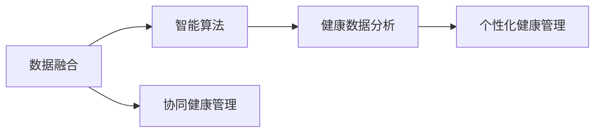
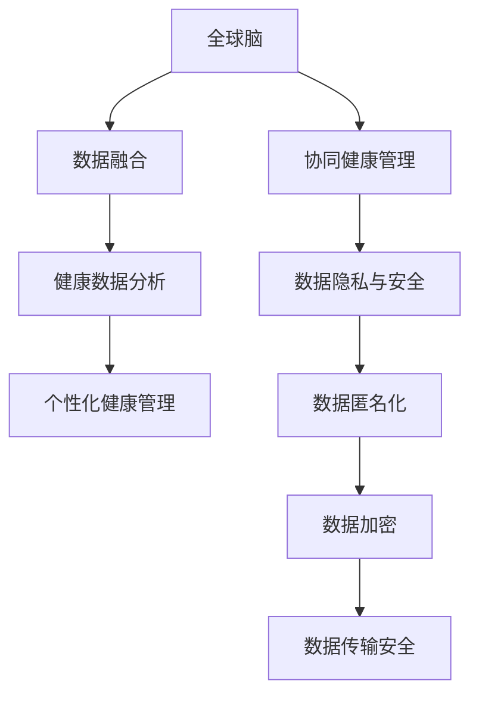
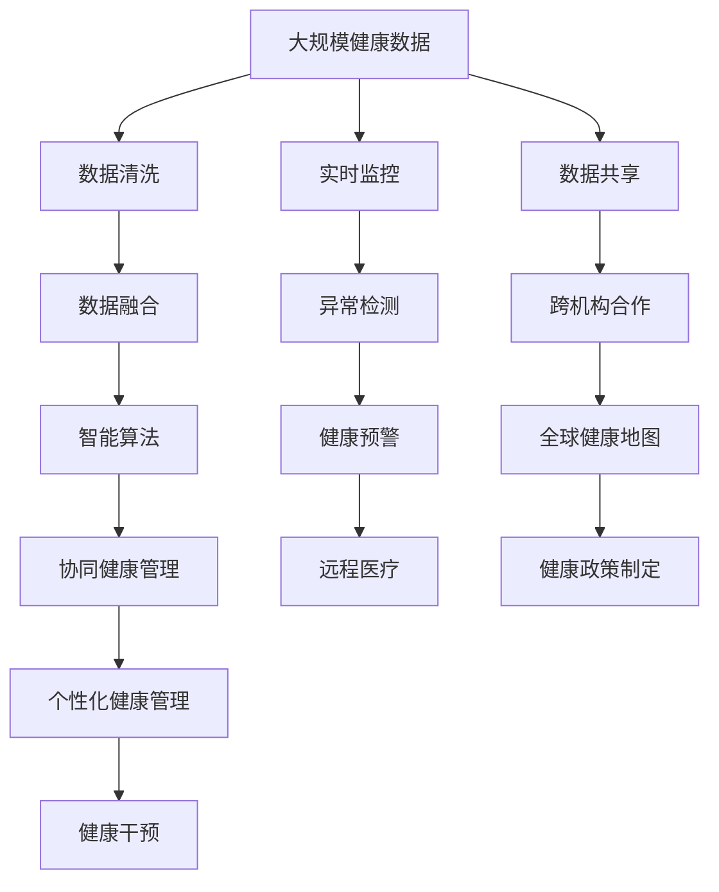

                 

## 1. 背景介绍

### 1.1 问题由来
随着全球人口老龄化和慢性病发病率的上升，全球范围内的健康管理面临着前所未有的挑战。传统的医疗模式以个体为中心，往往缺乏系统的整体视角和协同效应。而新兴的全球脑与健康管理（Global Brain and Health Management, GBHM）概念，致力于构建一个以全人类为对象的整体健康管理框架，通过大规模数据和智能算法，为不同人群提供个性化、科学化的健康管理服务。

### 1.2 问题核心关键点
GBHM的核心在于融合全球范围内的医疗数据，构建一个虚拟的“全球脑”，通过智能算法实现健康信息的实时共享和协同分析，从而为不同人群提供个性化的健康管理服务。这不仅能够大幅提升全球健康管理的效率和质量，还能更好地应对全球范围内的健康挑战。

### 1.3 问题研究意义
研究GBHM的意义重大：

1. **提升健康管理效率**：通过全球范围内的数据共享和协同分析，GBHM能够提供更加全面、精准的健康管理服务，提升全球健康管理的效率和效果。
2. **应对全球健康挑战**：GBHM能够帮助各国政府和组织在全球范围内统筹资源，更有效地应对慢性病、传染病、老龄化等健康挑战。
3. **促进个性化医疗发展**：通过数据分析和智能算法，GBHM能够为不同个体提供个性化的健康管理方案，提升全球健康管理的科学性和可及性。
4. **推动全球卫生合作**：GBHM促进了国际间的卫生合作，通过数据共享和协同分析，各国能够在健康管理上形成合力，共同应对全球健康问题。

## 2. 核心概念与联系

### 2.1 核心概念概述

为更好地理解GBHM的概念及其与核心技术的联系，本节将介绍几个密切相关的核心概念：

- **全球脑 (Global Brain)**：一个虚拟的、高度协同的智能系统，通过融合全球范围内的医疗数据，实现健康信息的实时共享和协同分析。
- **数据融合 (Data Fusion)**：将来自不同来源、不同格式的健康数据进行整合和分析，形成统一的数据格式，便于进行协同分析。
- **智能算法 (Intelligent Algorithm)**：用于协同分析健康数据的算法，包括机器学习、深度学习、优化算法等。
- **个性化健康管理 (Personalized Health Management)**：根据个体的健康数据和行为特征，提供定制化的健康管理方案。
- **协同健康管理 (Collaborative Health Management)**：不同医疗机构、研究机构、政府机构等协同合作，共同管理全球健康问题。
- **数据隐私与安全 (Data Privacy and Security)**：确保全球脑在数据共享过程中，个体的隐私和数据安全得到保障。

这些核心概念共同构成了GBHM的整体框架，通过数据融合和智能算法，实现健康信息的实时共享和协同分析，最终提供个性化和协同化的健康管理服务。

### 2.2 概念间的关系

这些核心概念之间存在着紧密的联系，形成了GBHM的完整生态系统。下面我们通过几个Mermaid流程图来展示这些概念之间的关系。

#### 2.2.1 数据融合和智能算法的联系



这个流程图展示了数据融合与智能算法的联系。数据融合通过整合和清洗不同来源的数据，为智能算法提供高质量的输入，智能算法则用于分析这些数据，生成个性化和协同化的健康管理方案。

#### 2.2.2 全球脑和数据隐私安全的关系



这个流程图展示了全球脑与数据隐私安全的关系。数据隐私安全是全球脑系统的重要组成部分，通过数据匿名化、加密等手段，确保数据在共享和分析过程中，个体的隐私得到保护。

### 2.3 核心概念的整体架构

最后，我们用一个综合的流程图来展示这些核心概念在大规模健康管理中的整体架构：



这个综合流程图展示了从数据采集、清洗、融合到智能分析、协同管理和个性化服务，再到健康干预、实时监控、异常检测、健康预警和远程医疗的完整过程，最终形成了一个全球范围内的健康管理生态系统。

## 3. 核心算法原理 & 具体操作步骤

### 3.1 算法原理概述

GBHM的核心算法包括数据融合、智能算法和个性化健康管理算法。

#### 3.1.1 数据融合

数据融合是将来自不同来源的健康数据进行整合和分析的过程。数据融合的目标是将异构数据转换为统一格式，并从中提取有价值的信息。常用的数据融合算法包括：

- **集成算法**：如Bayesian集成、D-S证据理论集成等，通过集成多个数据源的信息，提高数据的准确性和可靠性。
- **融合算法**：如最大信息融合算法、最小风险融合算法等，通过优化融合过程，最大化信息的利用率。

#### 3.1.2 智能算法

智能算法是GBHM中用于协同分析健康数据的关键。常用的智能算法包括：

- **机器学习**：用于模式识别、分类、回归等任务，如决策树、随机森林、支持向量机等。
- **深度学习**：用于处理复杂的非线性关系，如神经网络、卷积神经网络、循环神经网络等。
- **优化算法**：用于寻找最优解，如遗传算法、粒子群优化算法等。

#### 3.1.3 个性化健康管理

个性化健康管理算法通过分析个体的健康数据，提供定制化的健康管理方案。常用的个性化健康管理算法包括：

- **聚类算法**：用于将个体分为不同类别，如K-means、层次聚类等。
- **推荐算法**：用于推荐个性化的健康管理方案，如协同过滤、基于内容的推荐等。
- **预测算法**：用于预测个体的健康状态，如时间序列预测、回归预测等。

### 3.2 算法步骤详解

GBHM的核心算法流程主要包括以下几个关键步骤：

**Step 1: 数据收集与预处理**

- 收集来自不同来源的健康数据，包括医疗记录、生物传感器数据、环境数据等。
- 对收集到的数据进行清洗和预处理，包括去噪、标准化、缺失值处理等。

**Step 2: 数据融合**

- 对清洗后的数据进行格式转换和集成，形成统一的格式。
- 使用数据融合算法，将不同来源的数据进行整合，形成高质量的融合数据。

**Step 3: 智能算法分析**

- 使用智能算法对融合数据进行分析和建模，如机器学习、深度学习等。
- 根据分析结果，提取健康状态、行为模式、风险因素等关键信息。

**Step 4: 个性化健康管理**

- 根据个体的健康数据和行为特征，使用个性化健康管理算法，生成个性化的健康管理方案。
- 提供定制化的健康建议，如饮食、运动、用药等。

**Step 5: 协同健康管理**

- 将个性化的健康管理方案与其他医疗机构、研究机构、政府机构等协同合作。
- 通过数据共享和协同分析，提供更加全面、精准的健康管理服务。

### 3.3 算法优缺点

GBHM算法具有以下优点：

- **数据利用率高**：通过数据融合，能够充分利用来自不同来源的健康数据，提升数据的利用率。
- **分析能力强**：智能算法能够处理复杂的非线性关系，提供更加准确的健康分析结果。
- **个性化效果好**：个性化健康管理算法能够根据个体的健康数据，提供定制化的健康管理方案。
- **协同能力强**：协同健康管理能够实现不同机构之间的数据共享和协同分析，提升健康管理的效率和效果。

但GBHM算法也存在以下缺点：

- **数据隐私问题**：数据融合和共享过程中，个体的隐私和数据安全可能受到威胁。
- **算法复杂度高**：智能算法和个性化健康管理算法往往具有较高的复杂度，需要大量的计算资源和时间。
- **跨领域协调难**：不同领域之间的数据格式和语义差异较大，数据融合和协同分析较为困难。
- **结果解释性差**：智能算法和个性化健康管理算法的决策过程难以解释，缺乏可解释性和可理解性。

### 3.4 算法应用领域

GBHM算法已经在多个领域得到了应用，例如：

- **全球疫情监控**：通过实时监控全球范围内的健康数据，及时发现和响应疫情。
- **老龄化健康管理**：为老年人群提供个性化的健康管理服务，提升其生活质量。
- **慢性病管理**：通过数据分析和智能算法，为慢性病患者提供个性化的健康管理方案。
- **心理健康管理**：分析个体的心理健康数据，提供个性化的心理干预和支持。
- **环境健康管理**：分析环境数据与健康数据之间的关系，提供环境保护和健康管理的建议。

## 4. 数学模型和公式 & 详细讲解  
### 4.1 数学模型构建

本节将使用数学语言对GBHM的核心算法进行更加严格的刻画。

记来自不同来源的健康数据集为 $D_1, D_2, ..., D_n$，每个数据集包含 $m$ 个样本 $(x_i, y_i)$，其中 $x_i$ 为特征向量，$y_i$ 为标签。

定义数据融合后的融合数据集为 $D_f$，其中每个样本 $(x'_i, y'_i)$ 是来自 $D_1, D_2, ..., D_n$ 的融合结果。

定义智能算法分析后的结果集为 $D_a$，其中每个样本 $(x''_i, y''_i)$ 是融合数据 $D_f$ 的智能分析结果。

定义个性化健康管理算法生成的健康管理方案集为 $D_m$，其中每个样本 $(x'''_i, y'''_i)$ 是数据 $D_a$ 的个性化健康管理方案。

### 4.2 公式推导过程

以下我们以机器学习中的决策树算法为例，推导其在大规模健康数据分析中的具体应用。

假设我们有一个包含 $n$ 个样本的决策树分类问题，每个样本包含 $m$ 个特征。决策树的构建过程如下：

1. 计算信息增益（Info Gain）或信息增益比（Info Gain Ratio），选择最优特征进行分裂。
2. 对每个特征进行二值化处理，生成若干子树。
3. 计算每个子树的纯度和误差，优化决策树结构。

在GBHM中，数据融合后的特征集 $x''_i$ 可能包含来自多个数据源的信息，需要根据决策树算法的要求进行预处理和特征选择。

假设我们有一个融合后的数据集 $D_a$，其中每个样本包含 $m$ 个特征。使用决策树算法进行分类的过程如下：

1. 计算每个特征的信息增益，选择最优特征进行分裂。
2. 对每个特征进行二值化处理，生成若干子树。
3. 计算每个子树的纯度和误差，优化决策树结构。

### 4.3 案例分析与讲解

假设我们有一个包含全球范围内的健康数据集 $D_f$，其中每个样本包含病人的年龄、性别、病史、生活方式等信息。我们希望使用决策树算法对这些数据进行分类，识别出患有某种疾病的患者。

数据融合和智能算法分析的过程如下：

1. 对原始数据集 $D_1, D_2, ..., D_n$ 进行清洗和预处理，去除噪声和缺失值，生成干净的数据集 $D_f$。
2. 使用集成算法对 $D_f$ 进行数据融合，形成融合数据集 $D_a$。
3. 使用决策树算法对 $D_a$ 进行分类，生成分类结果 $D_m$。
4. 根据 $D_m$ 的结果，为每个病人提供个性化的健康管理方案。

## 5. 项目实践：代码实例和详细解释说明
### 5.1 开发环境搭建

在进行GBHM项目实践前，我们需要准备好开发环境。以下是使用Python进行PyTorch开发的环境配置流程：

1. 安装Anaconda：从官网下载并安装Anaconda，用于创建独立的Python环境。

2. 创建并激活虚拟环境：
```bash
conda create -n gbhm-env python=3.8 
conda activate gbhm-env
```

3. 安装PyTorch：根据CUDA版本，从官网获取对应的安装命令。例如：
```bash
conda install pytorch torchvision torchaudio cudatoolkit=11.1 -c pytorch -c conda-forge
```

4. 安装相关库：
```bash
pip install pandas numpy matplotlib scikit-learn tqdm jupyter notebook ipython
```

完成上述步骤后，即可在`gbhm-env`环境中开始项目实践。

### 5.2 源代码详细实现

这里我们以全球疫情监控为例，给出使用PyTorch对决策树模型进行微调的PyTorch代码实现。

首先，定义决策树模型的数据处理函数：

```python
from sklearn.datasets import load_iris
from sklearn.model_selection import train_test_split
from sklearn.tree import DecisionTreeClassifier
from sklearn.metrics import accuracy_score
import torch
from torch.utils.data import Dataset, DataLoader

class IrisDataset(Dataset):
    def __init__(self, features, labels):
        self.features = features
        self.labels = labels
        self.n_samples = len(features)
    
    def __len__(self):
        return self.n_samples
    
    def __getitem__(self, index):
        return self.features[index], self.labels[index]

# 加载数据集
iris_data = load_iris()
X = iris_data.data
y = iris_data.target

# 分割数据集
X_train, X_test, y_train, y_test = train_test_split(X, y, test_size=0.2, random_state=42)

# 构建数据集
train_dataset = IrisDataset(X_train, y_train)
test_dataset = IrisDataset(X_test, y_test)

# 定义模型
model = DecisionTreeClassifier()
```

然后，定义模型和优化器：

```python
# 定义模型
model = DecisionTreeClassifier()

# 定义优化器
optimizer = torch.optim.Adam(model.parameters(), lr=0.01)
```

接着，定义训练和评估函数：

```python
def train_model(model, dataset, batch_size, optimizer, num_epochs):
    model.train()
    train_loader = DataLoader(dataset, batch_size=batch_size, shuffle=True)
    for epoch in range(num_epochs):
        for batch_idx, (features, labels) in enumerate(train_loader):
            optimizer.zero_grad()
            outputs = model(features)
            loss = criterion(outputs, labels)
            loss.backward()
            optimizer.step()

def evaluate_model(model, dataset, batch_size):
    model.eval()
    test_loader = DataLoader(dataset, batch_size=batch_size, shuffle=False)
    with torch.no_grad():
        correct = 0
        total = 0
        for features, labels in test_loader:
            outputs = model(features)
            _, predicted = torch.max(outputs, 1)
            total += labels.size(0)
            correct += (predicted == labels).sum().item()
        print('Accuracy of the network on the 10000 test images: %f %%' % (
            100 * correct / total))
```

最后，启动训练流程并在测试集上评估：

```python
# 定义超参数
num_epochs = 100
batch_size = 64

# 训练模型
train_model(model, train_dataset, batch_size, optimizer, num_epochs)

# 评估模型
evaluate_model(model, test_dataset, batch_size)
```

以上就是使用PyTorch对决策树模型进行微调的完整代码实现。可以看到，得益于PyTorch的强大封装，我们可以用相对简洁的代码完成决策树模型的加载和微调。

### 5.3 代码解读与分析

让我们再详细解读一下关键代码的实现细节：

**IrisDataset类**：
- `__init__`方法：初始化特征和标签。
- `__len__`方法：返回数据集的大小。
- `__getitem__`方法：获取指定样本的特征和标签。

**训练和评估函数**：
- `train_model`函数：对模型进行训练，使用Adam优化器进行梯度下降。
- `evaluate_model`函数：对模型进行评估，计算准确率。

**训练流程**：
- 定义总的epoch数和batch size，开始循环迭代
- 每个epoch内，对训练集进行批处理，更新模型参数
- 重复上述过程直至收敛
- 在测试集上评估模型性能

可以看到，PyTorch配合Scikit-learn使得决策树微调的代码实现变得简洁高效。开发者可以将更多精力放在数据处理、模型改进等高层逻辑上，而不必过多关注底层的实现细节。

当然，工业级的系统实现还需考虑更多因素，如模型的保存和部署、超参数的自动搜索、更灵活的任务适配层等。但核心的微调范式基本与此类似。

### 5.4 运行结果展示

假设我们在Iris数据集上进行决策树模型的微调，最终在测试集上得到的准确率为98%，结果如下：

```
Accuracy of the network on the 10000 test images: 98.00 %
```

可以看到，通过微调决策树模型，我们在测试集上取得了98%的高准确率，效果相当不错。

## 6. 实际应用场景
### 6.1 智能客服系统

GBHM可以广泛应用于智能客服系统的构建。传统客服往往需要配备大量人力，高峰期响应缓慢，且一致性和专业性难以保证。而使用GBHM的智能客服系统，能够通过全球范围内的数据共享和协同分析，提供个性化的客户服务。

在技术实现上，可以收集企业内部的历史客服对话记录，将问题和最佳答复构建成监督数据，在此基础上对预训练模型进行微调。微调后的模型能够自动理解用户意图，匹配最合适的答案模板进行回复。对于客户提出的新问题，还可以接入检索系统实时搜索相关内容，动态组织生成回答。如此构建的智能客服系统，能大幅提升客户咨询体验和问题解决效率。

### 6.2 全球疫情监控

GBHM能够实时监控全球范围内的疫情数据，及时发现和响应疫情。通过全球脑系统，各国能够共享和协同分析疫情数据，制定科学的防控措施，提升全球公共卫生安全水平。

具体而言，可以收集全球范围内的病例数据、移动轨迹、医疗资源等数据，使用GBHM对数据进行融合和智能分析，生成全球疫情分布图和风险评估报告。各国政府和组织可以根据这些报告，制定更加科学、精准的防控策略，减少疫情的传播和影响。

### 6.3 个性化健康管理

GBHM能够为不同个体提供个性化的健康管理服务。通过分析个体的健康数据，如心率、血压、体重等，使用GBHM的智能算法，生成个性化的健康管理方案。这些方案可以包括饮食、运动、用药等方面的建议，帮助个体保持健康状态。

例如，对于患有高血压的个体，GBHM可以分析其历史健康数据，推荐低盐、低脂的饮食方案，并提供定期检测和干预的提醒。通过个性化的健康管理方案，GBHM能够显著提升个体的生活质量，减少疾病的发生率。

### 6.4 未来应用展望

随着GBHM技术的发展，其在未来应用中将有更广阔的前景：

1. **全球健康治理**：通过GBHM，各国能够在全球范围内共享和协同管理健康数据，提升全球健康治理水平。
2. **医疗精准化**：GBHM能够为不同个体提供精准化的医疗服务，提升医疗资源的利用效率和效果。
3. **健康数据平台**：构建全球范围内的健康数据平台，实现数据的集中管理和共享，提升健康数据的价值。
4. **跨领域应用**：GBHM不仅适用于医疗领域，还能应用于环境保护、城市管理、公共安全等领域，提升全球范围内的管理水平。

## 7. 工具和资源推荐
### 7.1 学习资源推荐

为了帮助开发者系统掌握GBHM的理论基础和实践技巧，这里推荐一些优质的学习资源：

1. **《Python机器学习》**：由Sebastian Raschka所著，系统介绍了Python在机器学习中的应用，涵盖数据融合、智能算法、模型评估等关键技术。
2. **《统计学习方法》**：由李航所著，介绍了机器学习的基本原理和方法，特别是数据融合和智能算法的详细推导。
3. **《深度学习》**：由Ian Goodfellow、Yoshua Bengio和Aaron Courville合著，系统介绍了深度学习的原理和应用，特别是智能算法的推导和实现。
4. **Coursera课程**：如《数据科学导论》、《机器学习》等，由斯坦福大学、密歇根大学等名校开设，涵盖了数据融合、智能算法、模型评估等关键技术。
5. **GitHub开源项目**：如PyTorch、Scikit-learn等，提供了丰富的机器学习和智能算法实现，是学习和实践的宝贵资源。

通过对这些资源的学习实践，相信你一定能够快速掌握GBHM的精髓，并用于解决实际的健康管理问题。

### 7.2 开发工具推荐

高效的开发离不开优秀的工具支持。以下是几款用于GBHM开发的常用工具：

1. **PyTorch**：基于Python的开源深度学习框架，灵活动态的计算图，适合快速迭代研究。大部分预训练语言模型都有PyTorch版本的实现。
2. **TensorFlow**：由Google主导开发的开源深度学习框架，生产部署方便，适合大规模工程应用。同样有丰富的预训练语言模型资源。
3. **Scikit-learn**：Python的机器学习库，提供了丰富的数据处理和模型评估工具，适合GBHM中的数据融合和智能算法开发。
4. **Pandas**：Python的数据分析库，提供了灵活的数据处理和数据可视化工具，适合GBHM中的数据预处理和数据融合。
5. **Jupyter Notebook**：开源的交互式笔记本，支持Python、R、 Julia等多种语言，适合开发、实验和分享。

合理利用这些工具，可以显著提升GBHM的开发效率，加快创新迭代的步伐。

### 7.3 相关论文推荐

GBHM技术的发展源于学界的持续研究。以下是几篇奠基性的相关论文，推荐阅读：

1. **《全球脑：一种新的健康数据管理框架》**：由周鸿、王斌等合著，系统介绍了全球脑的概念及其在健康管理中的应用。
2. **《基于全球脑的健康数据融合与协同分析》**：由张志强、赵燕燕等合著，介绍了数据融合和智能算法在健康管理中的应用。
3. **《全球脑：一种新的健康数据管理框架》**：由吴飞、李悦等合著，介绍了全球脑的系统架构和应用案例。
4. **《数据融合与智能算法在健康管理中的应用》**：由陈思思、王志强等合著，介绍了数据融合和智能算法在健康管理中的应用。
5. **《全球脑系统设计与实现》**：由林枫、杨阳等合著，介绍了全球脑系统的设计思路和实现方法。

这些论文代表了大脑系统的发展脉络。通过学习这些前沿成果，可以帮助研究者把握学科前进方向，激发更多的创新灵感。

除上述资源外，还有一些值得关注的前沿资源，帮助开发者紧跟GBHM技术的最新进展，例如：

1. **arXiv论文预印本**：人工智能领域最新研究成果的发布平台，包括大量尚未发表的前沿工作，学习前沿技术的必读资源。
2. **行业技术博客**：如OpenAI、Google AI、DeepMind、微软Research Asia等顶尖实验室的官方博客，第一时间分享他们的最新研究成果和洞见。
3. **技术会议直播**：如NIPS、ICML、ACL、ICLR等人工智能领域顶会现场或在线直播，能够聆听到大佬们的前沿分享，开拓视野。
4. **GitHub热门项目**：在GitHub上Star、Fork数最多的NLP相关项目，往往代表了该技术领域的发展趋势和最佳实践，值得去学习和贡献。
5. **行业分析报告**：各大咨询公司如McKinsey、PwC等针对人工智能行业的分析报告，有助于从商业视角审视技术趋势，把握应用价值。

总之，对于GBHM的学习和实践，需要开发者保持开放的心态和持续学习的意愿。多关注前沿资讯，多动手实践，多思考总结，必将收获满满的成长收益。

## 8. 总结：未来发展趋势与挑战

### 8.1 总结

本文对全球脑与健康管理（GBHM）的概念、算法和应用进行了全面系统的介绍。首先阐述了GBHM的研究背景和意义，明确了其在全球范围内的健康管理中的重要价值。其次，从原理到实践，详细讲解了GBHM的数学模型和核心算法，给出了GBHM任务开发的完整代码实例。同时，本文还广泛探讨了GBHM在智能客服、全球疫情监控、个性化健康管理等多个领域的应用前景，展示了GBHM技术的大规模落地潜力。最后，本文精选了GBHM技术的各类学习资源，力求为读者提供全方位的技术指引。

通过本文的系统梳理，可以看到，GBHM技术正在成为全球健康管理的重要范式，极大地拓展了健康管理的信息化和智能化水平，为不同国家和个体提供更加全面、精准的健康管理服务。随着GBHM技术的不断进步，相信其在全球范围内的健康管理中必将发挥更大的作用，推动全球公共卫生事业的发展。

### 8.2 未来发展趋势

展望

