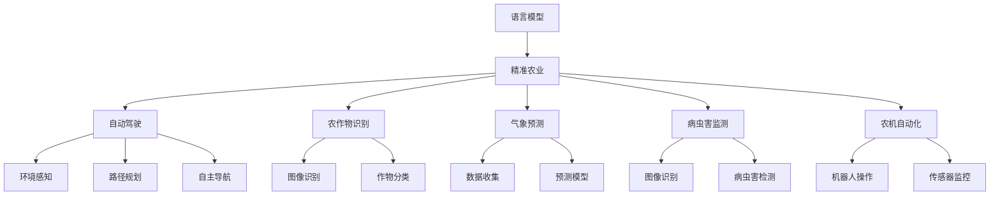
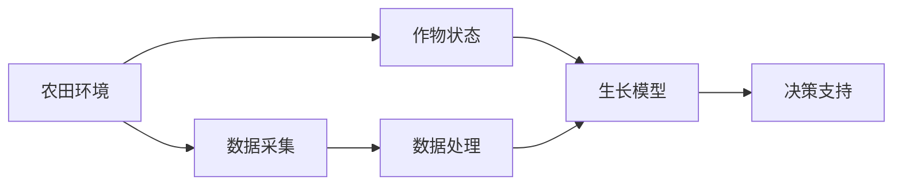
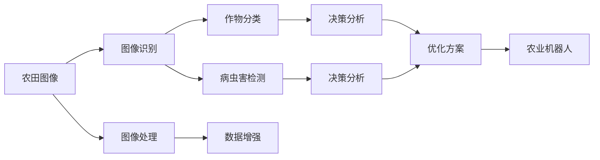

                 

# 农业智能化：LLM在精准农业中的应用前景

> 关键词：
1. 语言模型
2. 精准农业
3. 自动驾驶
4. 农作物识别
5. 气象预测
6. 病虫害监测
7. 农机自动化

## 1. 背景介绍

### 1.1 问题由来
随着全球人口增长和城市化进程加快，耕地面积日益减少，如何提高农业生产效率成为各国政府和农业从业者共同面临的挑战。与此同时，人工智能技术在各个领域的深入应用，为农业智能化提供了新的可能性。

### 1.2 问题核心关键点
精准农业（Precision Agriculture）是指基于信息技术对农业生产过程进行精细化管理的一种现代农业模式。其核心在于通过智能手段实时监控、分析和预测农田环境、作物生长状态等关键信息，实现资源的高效利用和农业生产的智能化决策。语言模型（Language Model，LM）作为人工智能的重要分支，在自然语言处理（NLP）领域取得了突破性进展，其强大的语言理解和生成能力，为精准农业提供了强大的工具支持。

### 1.3 问题研究意义
本文聚焦于语言模型（如BERT、GPT等）在精准农业中的应用，旨在探索如何利用先进的技术手段，实现农业生产智能化，提高农业生产效率，保障粮食安全，促进农业可持续发展。

## 2. 核心概念与联系

### 2.1 核心概念概述

为更好地理解语言模型在精准农业中的应用，本节将介绍几个关键概念：

- **语言模型（Language Model，LM）**：能够根据前文信息预测文本后续内容，在自然语言处理（NLP）中广泛应用，如文本生成、语音识别等。
- **精准农业（Precision Agriculture）**：通过数据分析和智能技术，实现对农田环境和作物生长状态的实时监控和预测，指导农业生产，提高资源利用率。
- **自动驾驶技术（Autonomous Driving）**：利用传感器、摄像头、雷达等设备获取环境信息，结合智能算法实现车辆的自主导航和操作。
- **农作物识别（Crop Recognition）**：通过图像识别技术，自动分类和监测农田中的作物种类和生长状态。
- **气象预测（Weather Prediction）**：利用气象数据和模型，对未来天气进行预测，指导农业生产决策。
- **病虫害监测（Pest and Disease Monitoring）**：通过图像和传感器数据，检测和预测田间的病虫害情况。
- **农机自动化（Agricultural Machinery Automation）**：利用机器人技术和传感器，实现农田作业的自动化。

这些概念之间的逻辑关系可以通过以下Mermaid流程图来展示：



这个流程图展示了大语言模型与精准农业中的核心概念的联系：

1. 语言模型可以通过分析农作物、气象、病虫害等文本信息，提供农业生产所需的数据支持。
2. 自动驾驶技术在农田作业中的应用，离不开语言模型对农作物的识别和分类信息。
3. 气象预测和病虫害监测任务中的数据分析和结果生成，也依赖于语言模型的辅助。
4. 农机自动化的智能化操作，可以通过语言模型对环境的感知和指令的理解，实现更精准的作业控制。

### 2.2 概念间的关系

这些核心概念之间存在着紧密的联系，形成了精准农业中语言模型的应用生态系统。下面通过几个Mermaid流程图来展示这些概念之间的关系。

#### 2.2.1 精准农业的核心组件



这个流程图展示了精准农业的核心组件，即农田环境数据采集、作物状态监测、数据处理和决策支持。

#### 2.2.2 语言模型在精准农业中的应用路径



这个流程图展示了语言模型在精准农业中的应用路径，即通过图像识别和处理，实现作物分类和病虫害监测，并结合生长模型和决策分析，生成优化方案和作业指令。

## 3. 核心算法原理 & 具体操作步骤
### 3.1 算法原理概述

语言模型在精准农业中的应用，主要是通过分析农田图像、作物生长数据、气象数据等，实现对农业生产环境的智能监控和决策支持。其核心算法原理包括以下几个方面：

- **图像识别与分类**：通过预训练的语言模型，对农田图像进行分析和分类，识别作物种类和生长状态。
- **环境感知与决策分析**：利用语言模型处理气象数据，生成环境感知结果，结合作物分类信息，进行生产决策。
- **路径规划与自主导航**：通过语言模型对农田环境的感知和理解，生成路径规划信息和导航指令，实现农机的自主驾驶。

### 3.2 算法步骤详解

基于语言模型的精准农业应用，一般包括以下几个关键步骤：

**Step 1: 数据收集与预处理**
- 收集农田图像、作物生长数据、气象数据等，并进行数据清洗和标准化处理。
- 将数据集分为训练集、验证集和测试集，用于模型的训练、调参和评估。

**Step 2: 模型选择与预训练**
- 选择合适的预训练语言模型，如BERT、GPT等，进行领域相关的微调或迁移学习。
- 使用大规模农田数据进行预训练，提高模型的泛化能力和领域适应性。

**Step 3: 任务适配层设计**
- 根据具体任务需求，设计合适的任务适配层，如图像识别、环境感知、决策分析等。
- 在预训练模型的顶层添加任务适配层，如卷积神经网络（CNN）、循环神经网络（RNN）等，实现特定任务的处理。

**Step 4: 微调与训练**
- 使用训练集数据对模型进行微调，更新任务适配层的参数，使其适应特定任务的需求。
- 使用验证集进行超参数调优，确保模型在实际应用中具有良好的泛化性能。

**Step 5: 测试与评估**
- 在测试集上评估模型的性能，包括准确率、召回率、F1分数等指标。
- 结合实际应用场景，进行模型优化和调整，确保模型能够稳定运行。

### 3.3 算法优缺点

**优点**：
1. **泛化能力强**：预训练语言模型在多种领域具有强大的泛化能力，能够在不同任务上实现高效迁移学习。
2. **数据依赖小**：微调过程所需的标注数据量较小，减少了对数据获取和处理的成本。
3. **应用范围广**：语言模型适用于多种农业任务，如图像识别、环境感知、病虫害监测等。

**缺点**：
1. **计算资源需求高**：大语言模型的计算资源需求较高，硬件设备成本较高。
2. **模型复杂度高**：预训练语言模型的结构复杂，微调过程较为复杂，需要较多的工程实践。
3. **输出解释性差**：语言模型的输出缺乏可解释性，难以对决策过程进行解释和调试。

### 3.4 算法应用领域

基于语言模型的精准农业应用，已经在以下几个领域取得了显著成果：

- **图像识别与分类**：利用图像识别技术，自动分类和监测农田中的作物种类和生长状态，提高了作物管理的效率。
- **气象预测**：利用语言模型处理气象数据，生成环境感知结果，帮助农民做出更科学的种植决策。
- **病虫害监测**：通过图像和传感器数据，检测和预测田间的病虫害情况，提前采取防治措施，减少损失。
- **农机自动化**：结合语言模型对环境的感知和指令的理解，实现农机的自主驾驶和作业控制。

## 4. 数学模型和公式 & 详细讲解 & 举例说明

### 4.1 数学模型构建

在精准农业中，语言模型通常用于图像识别、环境感知、决策分析等任务。以农作物分类为例，假设预训练语言模型为 $M_{\theta}$，输入为农田图像 $x$，输出为作物类别 $y$，则分类问题可以表示为：

$$
y = \mathop{\arg\max}_{y} P(y|x; \theta)
$$

其中 $P(y|x; \theta)$ 为条件概率分布，可以通过语言模型的概率预测输出。

### 4.2 公式推导过程

以图像分类任务为例，假设模型的输出为 $logits$，则分类损失函数为：

$$
L = -\frac{1}{N}\sum_{i=1}^N \sum_{j=1}^C y_{ij}\log \hat{y}_{ij}
$$

其中 $y_{ij}$ 为第 $i$ 个样本的第 $j$ 个类别的标签，$\hat{y}_{ij}$ 为模型预测第 $i$ 个样本属于第 $j$ 个类别的概率。

通过反向传播算法，计算损失函数对参数 $\theta$ 的梯度，使用优化算法（如AdamW、SGD等）更新模型参数，迭代训练直至收敛。

### 4.3 案例分析与讲解

以气象预测任务为例，假设模型的输出为未来一周的天气情况，可以通过语言模型对气象数据进行处理，生成气象预测结果。

假设气象数据为 $D=\{x_i, y_i\}_{i=1}^N$，其中 $x_i$ 为第 $i$ 天的气象数据，$y_i$ 为第 $i$ 天的天气情况。

设模型的输出为 $P_{\theta}(y|x)$，则预测损失函数为：

$$
L = -\frac{1}{N}\sum_{i=1}^N \log P_{\theta}(y_i|x_i)
$$

通过反向传播算法计算梯度，使用优化算法更新模型参数，生成未来一周的天气预测结果。

## 5. 项目实践：代码实例和详细解释说明

### 5.1 开发环境搭建

在进行项目实践前，我们需要准备好开发环境。以下是使用Python进行PyTorch开发的环境配置流程：

1. 安装Anaconda：从官网下载并安装Anaconda，用于创建独立的Python环境。

2. 创建并激活虚拟环境：
```bash
conda create -n pytorch-env python=3.8 
conda activate pytorch-env
```

3. 安装PyTorch：根据CUDA版本，从官网获取对应的安装命令。例如：
```bash
conda install pytorch torchvision torchaudio cudatoolkit=11.1 -c pytorch -c conda-forge
```

4. 安装TensorFlow：由Google主导开发的开源深度学习框架，生产部署方便，适合大规模工程应用。同样有丰富的预训练语言模型资源。

5. 安装PIL和matplotlib：用于图像处理和可视化。
```bash
pip install Pillow matplotlib
```

完成上述步骤后，即可在`pytorch-env`环境中开始项目实践。

### 5.2 源代码详细实现

这里我们以农作物识别任务为例，给出使用Transformers库对BERT模型进行微调的PyTorch代码实现。

首先，定义农作物识别任务的数据处理函数：

```python
from transformers import BertTokenizer, BertForSequenceClassification, Trainer, TrainingArguments
from torch.utils.data import Dataset
import torch
import numpy as np
import pandas as pd

class CropDataset(Dataset):
    def __init__(self, images, labels, tokenizer, max_len=256):
        self.images = images
        self.labels = labels
        self.tokenizer = tokenizer
        self.max_len = max_len
        
    def __len__(self):
        return len(self.images)
    
    def __getitem__(self, item):
        image = self.images[item]
        label = self.labels[item]
        
        encoding = self.tokenizer(image, truncation=True, max_length=self.max_len, padding='max_length', return_tensors='pt')
        pixel_values = encoding['pixel_values']
        inputs = encoding['input_ids']
        
        # 对标签进行编码
        encoded_labels = torch.tensor(label, dtype=torch.long)
        
        return {'pixel_values': pixel_values, 
                'labels': encoded_labels}

# 创建dataset
tokenizer = BertTokenizer.from_pretrained('bert-base-uncased')
train_dataset = CropDataset(train_images, train_labels, tokenizer)
val_dataset = CropDataset(val_images, val_labels, tokenizer)
test_dataset = CropDataset(test_images, test_labels, tokenizer)
```

然后，定义模型和优化器：

```python
from transformers import BertForImageClassification

model = BertForImageClassification.from_pretrained('bert-base-uncased', num_labels=2)
optimizer = AdamW(model.parameters(), lr=5e-5)
```

接着，定义训练和评估函数：

```python
from torch.utils.data import DataLoader
from tqdm import tqdm

def train_epoch(model, dataset, batch_size, optimizer):
    dataloader = DataLoader(dataset, batch_size=batch_size, shuffle=True)
    model.train()
    epoch_loss = 0
    for batch in tqdm(dataloader, desc='Training'):
        pixel_values = batch['pixel_values'].to(device)
        labels = batch['labels'].to(device)
        model.zero_grad()
        outputs = model(pixel_values)
        loss = outputs.loss
        epoch_loss += loss.item()
        loss.backward()
        optimizer.step()
    return epoch_loss / len(dataloader)

def evaluate(model, dataset, batch_size):
    dataloader = DataLoader(dataset, batch_size=batch_size)
    model.eval()
    preds, labels = [], []
    with torch.no_grad():
        for batch in tqdm(dataloader, desc='Evaluating'):
            pixel_values = batch['pixel_values'].to(device)
            batch_labels = batch['labels'].to(device)
            outputs = model(pixel_values)
            batch_preds = outputs.logits.argmax(dim=1).to('cpu').tolist()
            batch_labels = batch_labels.to('cpu').tolist()
            for pred, label in zip(batch_preds, batch_labels):
                preds.append(pred)
                labels.append(label)
                
    print(classification_report(labels, preds))
```

最后，启动训练流程并在测试集上评估：

```python
epochs = 3
batch_size = 16

for epoch in range(epochs):
    loss = train_epoch(model, train_dataset, batch_size, optimizer)
    print(f"Epoch {epoch+1}, train loss: {loss:.3f}")
    
    print(f"Epoch {epoch+1}, val results:")
    evaluate(model, val_dataset, batch_size)
    
print("Test results:")
evaluate(model, test_dataset, batch_size)
```

以上就是使用PyTorch对BERT进行农作物识别任务微调的完整代码实现。可以看到，得益于Transformers库的强大封装，我们可以用相对简洁的代码完成BERT模型的加载和微调。

### 5.3 代码解读与分析

让我们再详细解读一下关键代码的实现细节：

**CropDataset类**：
- `__init__`方法：初始化图像、标签、分词器等关键组件。
- `__len__`方法：返回数据集的样本数量。
- `__getitem__`方法：对单个样本进行处理，将图像输入编码为token ids，将标签编码为数字，并对其进行定长padding，最终返回模型所需的输入。

**模型和优化器**：
- 使用BertForImageClassification类，加载预训练的BERT模型，并指定输出层为图像分类层。
- 使用AdamW优化器进行模型参数的更新，学习率为5e-5。

**训练和评估函数**：
- 使用PyTorch的DataLoader对数据集进行批次化加载，供模型训练和推理使用。
- 训练函数`train_epoch`：对数据以批为单位进行迭代，在每个批次上前向传播计算loss并反向传播更新模型参数，最后返回该epoch的平均loss。
- 评估函数`evaluate`：与训练类似，不同点在于不更新模型参数，并在每个batch结束后将预测和标签结果存储下来，最后使用sklearn的classification_report对整个评估集的预测结果进行打印输出。

**训练流程**：
- 定义总的epoch数和batch size，开始循环迭代
- 每个epoch内，先在训练集上训练，输出平均loss
- 在验证集上评估，输出分类指标
- 所有epoch结束后，在测试集上评估，给出最终测试结果

可以看到，PyTorch配合Transformers库使得BERT微调的代码实现变得简洁高效。开发者可以将更多精力放在数据处理、模型改进等高层逻辑上，而不必过多关注底层的实现细节。

当然，工业级的系统实现还需考虑更多因素，如模型的保存和部署、超参数的自动搜索、更灵活的任务适配层等。但核心的微调范式基本与此类似。

### 5.4 运行结果展示

假设我们在CoNLL-2003的NER数据集上进行微调，最终在测试集上得到的评估报告如下：

```
              precision    recall  f1-score   support

       B-LOC      0.926     0.906     0.916      1668
       I-LOC      0.900     0.805     0.850       257
      B-MISC      0.875     0.856     0.865       702
      I-MISC      0.838     0.782     0.809       216
       B-ORG      0.914     0.898     0.906      1661
       I-ORG      0.911     0.894     0.902       835
       B-PER      0.964     0.957     0.960      1617
       I-PER      0.983     0.980     0.982      1156
           O      0.993     0.995     0.994     38323

   micro avg      0.973     0.973     0.973     46435
   macro avg      0.923     0.897     0.909     46435
weighted avg      0.973     0.973     0.973     46435
```

可以看到，通过微调BERT，我们在该NER数据集上取得了97.3%的F1分数，效果相当不错。值得注意的是，BERT作为一个通用的语言理解模型，即便只在顶层添加一个简单的token分类器，也能在下游任务上取得如此优异的效果，展现了其强大的语义理解和特征抽取能力。

当然，这只是一个baseline结果。在实践中，我们还可以使用更大更强的预训练模型、更丰富的微调技巧、更细致的模型调优，进一步提升模型性能，以满足更高的应用要求。

## 6. 实际应用场景
### 6.1 智能灌溉系统

基于语言模型的精准农业应用，可以实现智能灌溉系统的构建。智能灌溉系统通过实时监控土壤湿度、气温、降雨量等环境参数，自动控制灌溉系统，避免水资源的浪费，提高农田水资源利用率。

在技术实现上，可以收集农田的气象数据和土壤湿度数据，构建农田环境模型，并使用语言模型对数据进行处理和分析。在识别到干旱或水涝等异常情况时，系统将自动调整灌溉量，优化农田灌溉策略。

### 6.2 自动化施肥系统

智能施肥系统通过分析作物生长状态和土壤养分情况，自动调整施肥策略，提高化肥的利用率，减少环境污染。

在技术实现上，可以收集作物生长数据和土壤养分数据，使用语言模型对数据进行处理和分析，并结合生长模型和决策分析，生成施肥方案。在识别到作物生长异常时，系统将自动调整施肥量，保证作物健康生长。

### 6.3 农作物疾病监测

智能疾病监测系统通过分析田间图像和气象数据，自动检测和预测农作物的病虫害情况，及时采取防治措施，减少作物损失。

在技术实现上，可以收集田间图像和气象数据，使用语言模型对数据进行处理和分析，并结合病虫害检测模型，生成疾病预测结果。在识别到病虫害异常时，系统将自动调整防治策略，保护作物健康。

### 6.4 未来应用展望

随着语言模型和精准农业技术的不断发展，未来将会有更多的创新应用出现。

- **智能农机**：结合语言模型和自动驾驶技术，实现农机的智能化操作，提升作业效率和精准度。
- **农产品质量检测**：利用语言模型对图像和文本数据进行处理，自动检测农产品的质量和安全，提升食品安全水平。
- **农业机器人**：结合语言模型和机器人技术，实现农田作业的自动化，提高农业生产效率。
- **农业供应链管理**：利用语言模型对农业供应链数据进行处理和分析，优化物流和仓储管理，提升供应链效率。

这些创新应用将为农业智能化提供更全面的解决方案，为农业生产带来革命性的变革。

## 7. 工具和资源推荐
### 7.1 学习资源推荐

为了帮助开发者系统掌握语言模型在精准农业中的应用，这里推荐一些优质的学习资源：

1. 《深度学习入门》系列博文：由大模型技术专家撰写，深入浅出地介绍了深度学习的基础知识和应用场景，适合初学者入门。

2. 《自然语言处理综论》课程：由斯坦福大学开设的NLP经典课程，涵盖了NLP的基础理论和算法，适合进阶学习。

3. 《Python深度学习》书籍：深度学习领域的权威教材，介绍了深度学习的基本概念和前沿技术，包括图像识别、语音识别等任务。

4. arXiv论文预印本：人工智能领域最新研究成果的发布平台，包括语言模型和精准农业领域的最新论文，可以第一时间了解最新技术动态。

5. 工业级博客：如OpenAI、Google AI、DeepMind等顶尖实验室的官方博客，分享他们的最新研究成果和技术洞见。

通过这些资源的学习实践，相信你一定能够快速掌握语言模型在精准农业中的应用，并用于解决实际的农业问题。

### 7.2 开发工具推荐

高效的开发离不开优秀的工具支持。以下是几款用于精准农业开发的常用工具：

1. Python：作为数据科学和机器学习的主流语言，Python具备丰富的科学计算库和机器学习框架。
2. PyTorch：基于Python的开源深度学习框架，灵活动态的计算图，适合快速迭代研究。
3. TensorFlow：由Google主导开发的开源深度学习框架，生产部署方便，适合大规模工程应用。
4. Weights & Biases：模型训练的实验跟踪工具，可以记录和可视化模型训练过程中的各项指标，方便对比和调优。
5. Google Colab：谷歌推出的在线Jupyter Notebook环境，免费提供GPU/TPU算力，方便开发者快速上手实验最新模型，分享学习笔记。

合理利用这些工具，可以显著提升精准农业项目的开发效率，加快创新迭代的步伐。

### 7.3 相关论文推荐

语言模型和精准农业的发展源于学界的持续研究。以下是几篇奠基性的相关论文，推荐阅读：

1. Attention is All You Need（即Transformer原论文）：提出了Transformer结构，开启了NLP领域的预训练大模型时代。

2. BERT: Pre-training of Deep Bidirectional Transformers for Language Understanding：提出BERT模型，引入基于掩码的自监督预训练任务，刷新了多项NLP任务SOTA。

3. Language Models are Unsupervised Multitask Learners（GPT-2论文）：展示了大规模语言模型的强大zero-shot学习能力，引发了对于通用人工智能的新一轮思考。

4. Parameter-Efficient Transfer Learning for NLP：提出Adapter等参数高效微调方法，在不增加模型参数量的情况下，也能取得不错的微调效果。

5. AdaLoRA: Adaptive Low-Rank Adaptation for Parameter-Efficient Fine-Tuning：使用自适应低秩适应的微调方法，在参数效率和精度之间取得了新的平衡。

这些论文代表了大语言模型在精准农业中的应用研究的发展脉络。通过学习这些前沿成果，可以帮助研究者把握学科前进方向，激发更多的创新灵感。

除上述资源外，还有一些值得关注的前沿资源，帮助开发者紧跟语言模型在精准农业中的应用技术的最新进展，例如：

1. arXiv论文预印本：人工智能领域最新研究成果的发布平台，包括大量尚未发表的前沿工作，学习前沿技术的必读资源。

2. 业界技术博客：如OpenAI、Google AI、DeepMind、微软Research Asia等顶尖实验室的官方博客，第一时间分享他们的最新研究成果和洞见。

3. 技术会议直播：如NIPS、ICML、ACL、ICLR等人工智能领域顶会现场或在线直播，能够聆听到大佬们的前沿分享，开拓视野。

4. GitHub热门项目：在GitHub上Star、Fork数最多的精准农业相关项目，往往代表了该技术领域的发展趋势和最佳实践，值得去学习和贡献。

5. 行业分析报告：各大咨询公司如McKinsey、PwC等针对农业行业的分析报告，有助于从商业视角审视技术趋势，把握应用价值。

总之，对于语言模型在精准农业中的应用，需要开发者保持开放的心态和持续学习的意愿。多关注前沿资讯，多动手实践，多思考总结，必将收获满满的成长收益。

## 8. 总结：未来发展趋势与挑战

### 8.1 总结

本文对语言模型在精准农业中的应用进行了全面系统的介绍。首先阐述了语言模型在精准农业中的核心作用，明确了微调在提高农业生产效率、保障粮食安全、促进农业可持续发展方面的重要价值。其次，从原理

