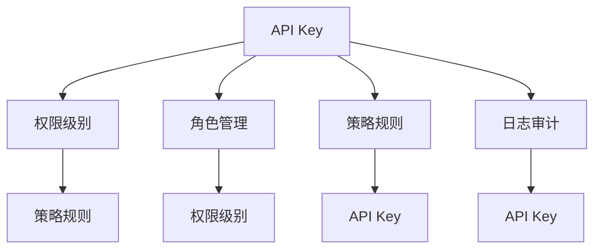
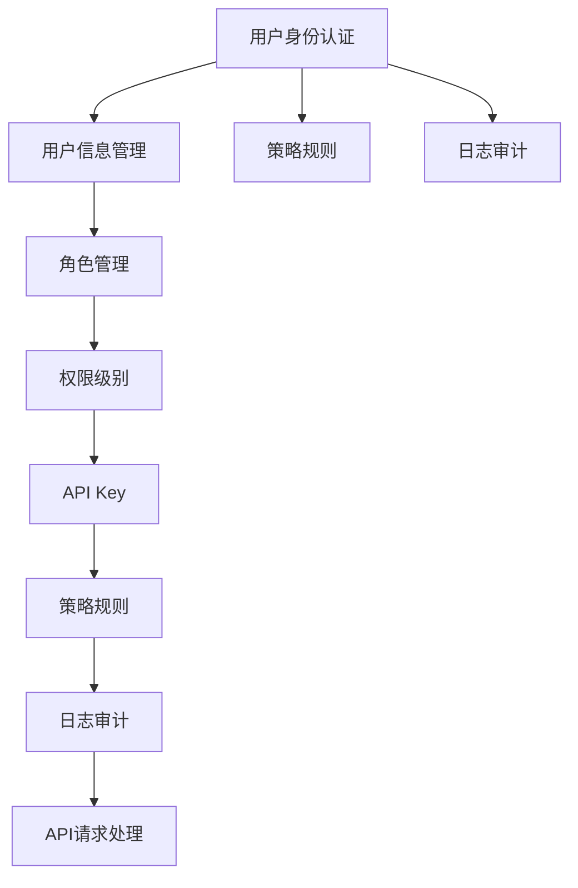

                 

# 分级 API Key 的使用案例

## 1. 背景介绍

### 1.1 问题由来
随着网络服务的普及，API（Application Programming Interface，应用程序编程接口）成为了连接不同系统和应用的关键桥梁。API Key（API密钥）作为一种身份验证方式，广泛应用于各个行业的Web服务。然而，传统API Key通常采取"一钥制"的方式，即一个API Key服务于所有用户，存在较大的安全隐患。如何对API Key进行更精细的管理和限制，是当前API安全领域的一个重要研究方向。

### 1.2 问题核心关键点
分级API Key技术，即基于多维度属性的API Key管理方式，通过对API Key进行更细粒度的授权和管理，提升API系统的安全性和可用性。

主要解决的核心问题包括：
- 如何根据不同用户的需求，分配不同权限级别的API Key？
- 如何通过API Key的级别限制，避免资源被滥用或恶意攻击？
- 如何高效地进行API Key的分配和撤销操作？
- 如何保证API Key的管理和使用过程的透明性、可追溯性？

### 1.3 问题研究意义
分级API Key技术，在保护API安全、提升API使用效率、增强API系统的扩展性等方面具有重要意义：

1. **安全保护**：通过细粒度的权限管理，可以降低因单一密钥被攻破而导致的系统风险。
2. **效率提升**：分级API Key可以大幅减少密钥管理和权限控制的复杂度，提升API服务的可用性。
3. **系统扩展**：分级API Key技术适用于各种规模的API系统，无论是单体应用还是微服务架构，都能高效部署和管理。
4. **规范透明**：分级API Key提供了清晰的API使用规则，增强了API系统的可追溯性和透明性。

## 2. 核心概念与联系

### 2.1 核心概念概述

为更好地理解分级API Key技术的核心概念，本节将介绍几个密切相关的核心概念：

- **API Key**：用于标识API请求源的身份验证密钥，通常以字符串形式存在。
- **权限级别**：基于业务需求和资源类型，对API Key的访问权限进行细粒度划分，通常包括读取、写入、修改、删除等操作权限。
- **角色管理**：根据用户的身份和权限，动态分配和撤销API Key，并对其进行权限管理。
- **策略规则**：定义API Key的使用规则，如访问频率限制、访问IP范围等，用于限制API Key的行为。
- **日志审计**：记录API Key的使用情况，包括请求时间、请求参数、响应结果等，用于后期追溯和审计。

这些核心概念之间的逻辑关系可以通过以下Mermaid流程图来展示：



这个流程图展示了几大核心概念之间的相互关系：

1. API Key 和权限级别：API Key 的访问权限由权限级别来定义，权限级别决定了API Key 的操作能力。
2. 角色管理：角色管理根据用户的身份和权限，动态分配和撤销API Key，并对权限级别进行配置。
3. 策略规则：策略规则对API Key的行为进行限制，如访问频率、访问IP等，进一步细化权限级别的操作。
4. 日志审计：记录API Key的使用情况，用于后期追溯和审计。

### 2.2 概念间的关系

这些核心概念之间存在着紧密的联系，形成了分级API Key技术的安全、高效、透明的实施框架。

- 通过角色管理，可以根据用户角色和职责，动态分配不同权限级别的API Key，确保API Key的合理分配和使用。
- 策略规则进一步细化了权限级别的操作范围，确保API Key的操作行为符合业务需求和安全要求。
- 日志审计提供了对API Key使用情况的记录和追溯功能，帮助管理者及时发现和处理异常情况。
- 分级API Key技术使得API系统具备更强的安全性和灵活性，能够更好地适应各种复杂多变的业务场景。

### 2.3 核心概念的整体架构

最后，我们用一个综合的流程图来展示这些核心概念在大规模API系统中的整体架构：



这个综合流程图展示了分级API Key技术的整体架构：

1. 用户身份认证：用户通过身份认证，获得相应的角色和权限。
2. 用户信息管理：根据用户信息和权限，动态分配和撤销API Key，并对权限级别进行配置。
3. API Key：API Key是用户的访问凭证，根据权限级别定义了其操作能力。
4. 策略规则：策略规则对API Key的行为进行限制，确保API使用符合业务需求和安全要求。
5. 日志审计：记录API Key的使用情况，用于后期追溯和审计。
6. API请求处理：API Key根据策略规则，进行API请求处理，并生成审计日志。

通过这些核心概念，分级API Key技术可以更精细、更安全、更高效地管理API系统，保护API资源，提升API系统的安全性和可用性。

## 3. 核心算法原理 & 具体操作步骤
### 3.1 算法原理概述

分级API Key技术，本质上是一种基于策略的访问控制机制，通过对API Key进行细粒度的授权和管理，实现对API系统的安全防护。其核心原理如下：

- **策略规则定义**：定义API Key的使用策略，包括访问频率、访问IP范围、操作权限等，用于限制API Key的行为。
- **角色管理**：根据用户身份和权限，动态分配和撤销API Key，并对其进行权限管理。
- **API Key申请与撤销**：用户向API管理系统申请API Key，系统根据角色管理规则分配权限级别，并根据策略规则限制API Key的行为。用户撤销API Key时，系统根据角色管理规则撤销权限，并更新相关日志记录。
- **日志审计**：记录API Key的使用情况，包括请求时间、请求参数、响应结果等，用于后期追溯和审计。

### 3.2 算法步骤详解

基于分级API Key技术的API管理系统，通常包括以下几个关键步骤：

**Step 1: 用户身份认证**

- 用户通过身份认证系统，如OAuth2、JWT等，获取用户的身份信息。
- 身份信息包括用户的角色、权限、部门等属性。

**Step 2: 角色管理**

- 根据用户身份信息，动态分配和撤销API Key，并配置其权限级别。
- 权限级别包括读取、写入、修改、删除等操作权限。

**Step 3: 策略规则定义**

- 定义API Key的使用策略，包括访问频率、访问IP范围等。
- 策略规则用于限制API Key的行为，确保其操作符合业务需求和安全要求。

**Step 4: API Key申请与撤销**

- 用户向API管理系统申请API Key，系统根据角色管理规则分配权限级别，并根据策略规则限制API Key的行为。
- 用户撤销API Key时，系统根据角色管理规则撤销权限，并更新相关日志记录。

**Step 5: 日志审计**

- 记录API Key的使用情况，包括请求时间、请求参数、响应结果等，用于后期追溯和审计。
- 日志审计帮助管理者及时发现和处理异常情况，确保API系统的高可用性。

### 3.3 算法优缺点

分级API Key技术具有以下优点：

1. **细粒度权限管理**：根据用户角色和权限，动态分配和撤销API Key，确保API Key的操作符合业务需求和安全要求。
2. **灵活性高**：策略规则灵活定义，适用于各种复杂多变的业务场景，增强了API系统的扩展性。
3. **安全性高**：通过细粒度的权限管理和策略规则，降低了因单一密钥被攻破而导致的系统风险，提高了API系统的安全性。

同时，分级API Key技术也存在一些缺点：

1. **复杂度高**：策略规则和角色管理的复杂度较高，需要耗费大量时间和资源进行配置和管理。
2. **性能开销大**：记录和审计日志会消耗一定的系统资源，尤其是在高并发情况下，可能会影响API系统的性能。
3. **实现难度高**：分级API Key技术需要复杂的系统架构和算法实现，开发和维护难度较大。

### 3.4 算法应用领域

分级API Key技术已经在多个领域得到了应用，例如：

- **金融行业**：银行和金融机构需要对交易和支付API进行严格控制，分级API Key技术可以细粒度管理用户权限，确保支付和交易的安全性。
- **医疗行业**：医院需要对患者数据访问进行严格控制，分级API Key技术可以确保只有授权人员才能访问患者数据，保护患者隐私。
- **电商行业**：电商平台需要对商品交易API进行严格控制，分级API Key技术可以确保只有授权商家才能修改商品信息，避免恶意操作。
- **政府行业**：政府部门需要对公共数据API进行严格控制，分级API Key技术可以确保只有授权部门才能访问和使用公共数据。

除了上述领域，分级API Key技术还适用于各种需要细粒度权限管理的场景，为API系统的安全性、可用性和扩展性提供了有力的保障。

## 4. 数学模型和公式 & 详细讲解  
### 4.1 数学模型构建

假设API系统中的API Key为 $K$，权限级别为 $L$，策略规则为 $S$，用户信息为 $U$，日志审计记录为 $A$。

分级API Key的数学模型可以表示为：

$$
M(K, L, S, U, A) = \begin{cases}
    L & \text{if } S(K, U) = \text{True and } \text{Log(A)} = \text{True} \\
    \text{Empty} & \text{otherwise}
\end{cases}
$$

其中，$S(K, U)$ 表示API Key $K$ 是否符合策略规则 $S$，$Log(A)$ 表示日志审计记录 $A$ 是否有效。

### 4.2 公式推导过程

- **用户身份认证**：用户通过身份认证系统获取身份信息 $U$，用于后续的角色管理和权限分配。
- **角色管理**：根据用户信息 $U$ 和策略规则 $S$，动态分配和撤销API Key $K$，并配置其权限级别 $L$。
- **策略规则定义**：策略规则 $S$ 定义了API Key $K$ 的使用限制，如访问频率、访问IP范围等。
- **API Key申请与撤销**：用户向API管理系统申请API Key $K$，系统根据角色管理规则分配权限级别 $L$，并根据策略规则限制API Key $K$ 的行为。用户撤销API Key $K$ 时，系统根据角色管理规则撤销权限 $L$，并更新相关日志记录 $A$。
- **日志审计**：记录API Key $K$ 的使用情况 $A$，用于后期追溯和审计。

### 4.3 案例分析与讲解

以下以金融行业为例，展示分级API Key技术的应用案例：

假设某金融平台需要对外提供支付API，支付API的关键操作包括：

- **转账操作**：将资金从用户账户转入目标账户。
- **提现操作**：将资金从平台账户提现到用户银行卡。

根据业务需求，平台对支付API进行分级管理，定义了以下策略规则：

- 转账操作仅允许管理员和特定用户执行。
- 提现操作仅允许管理员和认证用户执行。

具体实现如下：

1. **用户身份认证**：用户通过OAuth2认证系统获取身份信息，包括用户角色、权限等。
2. **角色管理**：根据用户身份信息，动态分配和撤销API Key，并配置其权限级别。管理员和特定用户分别获得不同的API Key，权限级别为读取、写入、修改、删除等操作权限。
3. **策略规则定义**：定义API Key的使用策略，包括访问频率、访问IP范围等。转账和提现操作分别设定不同的策略规则。
4. **API Key申请与撤销**：用户向API管理系统申请API Key，系统根据角色管理规则分配权限级别，并根据策略规则限制API Key的行为。管理员和特定用户分别获取对应的API Key，并在其有效期内，可以执行转账和提现操作。
5. **日志审计**：记录API Key的使用情况，包括请求时间、请求参数、响应结果等，用于后期追溯和审计。

通过分级API Key技术，平台可以确保支付API的安全性和可用性，避免因单点故障或恶意攻击导致支付系统的风险。

## 5. 项目实践：代码实例和详细解释说明
### 5.1 开发环境搭建

在进行分级API Key的开发实践前，我们需要准备好开发环境。以下是使用Python进行Flask开发的环境配置流程：

1. 安装Anaconda：从官网下载并安装Anaconda，用于创建独立的Python环境。

2. 创建并激活虚拟环境：
```bash
conda create -n api-key-env python=3.8 
conda activate api-key-env
```

3. 安装Flask：
```bash
pip install flask
```

4. 安装其他相关工具包：
```bash
pip install flask-restful flask-restful-swagger
```

完成上述步骤后，即可在`api-key-env`环境中开始开发实践。

### 5.2 源代码详细实现

首先，定义API Key的模型：

```python
from flask import Flask, request, jsonify
from flask_restful import Resource, Api
from flask_restful_schemas import Schema, ModelSchema, fields
from sqlalchemy import create_engine, Column, Integer, String, ForeignKey, create_table
from sqlalchemy.orm import sessionmaker, relationship

app = Flask(__name__)
api = Api(app)

# 定义API Key模型
class APIKeyModel(BaseModel):
    id = Column(Integer, primary_key=True)
    user_id = Column(Integer, ForeignKey('user.id'))
    role = Column(String(255))
    level = Column(String(255))
    create_time = Column(DateTime, default=datetime.utcnow)
    expiry_time = Column(DateTime)

    def to_dict(self):
        return {
            'id': self.id,
            'user_id': self.user_id,
            'role': self.role,
            'level': self.level,
            'create_time': self.create_time,
            'expiry_time': self.expiry_time
        }

# 定义API Key的Schema
class APIKeySchema(ModelSchema):
    id = fields.Integer()
    user_id = fields.Integer()
    role = fields.String()
    level = fields.String()
    create_time = fields.DateTime()
    expiry_time = fields.DateTime()
```

然后，定义API Key的管理接口：

```python
class APIKeyResource(Resource):
    def get(self, key_id):
        # 获取指定ID的API Key
        query = session.query(APIKeyModel).filter(APIKeyModel.id == key_id)
        api_key = query.first()
        if api_key is None:
            abort(404)
        return jsonify(api_key.to_dict())

    def post(self):
        # 申请API Key
        data = request.json
        api_key = APIKeyModel(**data)
        session.add(api_key)
        session.commit()
        return jsonify(api_key.to_dict()), 201

    def delete(self, key_id):
        # 撤销API Key
        api_key = session.query(APIKeyModel).filter(APIKeyModel.id == key_id).first()
        if api_key is None:
            abort(404)
        session.delete(api_key)
        session.commit()
        return '', 204

# 定义角色管理接口
class RoleResource(Resource):
    def get(self, role_id):
        # 获取指定ID的角色
        query = session.query(Role).filter(Role.id == role_id)
        role = query.first()
        if role is None:
            abort(404)
        return jsonify(role.to_dict())

    def post(self):
        # 申请角色
        data = request.json
        role = Role(**data)
        session.add(role)
        session.commit()
        return jsonify(role.to_dict()), 201

    def delete(self, role_id):
        # 撤销角色
        role = session.query(Role).filter(Role.id == role_id).first()
        if role is None:
            abort(404)
        session.delete(role)
        session.commit()
        return '', 204

# 定义策略规则管理接口
class StrategyResource(Resource):
    def get(self, strategy_id):
        # 获取指定ID的策略规则
        query = session.query(Strategy).filter(Strategy.id == strategy_id)
        strategy = query.first()
        if strategy is None:
            abort(404)
        return jsonify(strategy.to_dict())

    def post(self):
        # 申请策略规则
        data = request.json
        strategy = Strategy(**data)
        session.add(strategy)
        session.commit()
        return jsonify(strategy.to_dict()), 201

    def delete(self, strategy_id):
        # 撤销策略规则
        strategy = session.query(Strategy).filter(Strategy.id == strategy_id).first()
        if strategy is None:
            abort(404)
        session.delete(strategy)
        session.commit()
        return '', 204
```

接着，定义API Key的使用接口：

```python
class APIUsageResource(Resource):
    def get(self, api_key_id):
        # 获取指定ID的API Key的使用情况
        api_key = session.query(APIKeyModel).filter(APIKeyModel.id == api_key_id).first()
        if api_key is None:
            abort(404)
        log = session.query(APIUsageLog).filter(APIUsageLog.api_key_id == api_key_id).order_by(APIUsageLog.create_time.desc()).first()
        if log is None:
            abort(404)
        return jsonify(log.to_dict())

    def post(self, api_key_id):
        # 记录API Key的使用情况
        api_key = session.query(APIKeyModel).filter(APIKeyModel.id == api_key_id).first()
        if api_key is None:
            abort(404)
        data = request.json
        api_usage = APIUsageLog(api_key_id=api_key_id, **data)
        session.add(api_usage)
        session.commit()
        return jsonify(api_usage.to_dict()), 201
```

最后，启动API服务：

```python
# 创建数据库连接
engine = create_engine('sqlite:///api-key.db')
BaseModel.metadata.create_all(engine)
Base = declarative_base()

# 创建会话工厂
Session = sessionmaker(bind=engine)

# 启动API服务
if __name__ == '__main__':
    app.run(debug=True)
```

以上就是使用Flask进行分级API Key开发的完整代码实现。可以看到，通过Flask的Restful API设计，可以轻松实现API Key的申请、撤销、使用等管理功能，同时提供了详细的Schema和日志记录，确保API Key的管理和使用过程的透明性和可追溯性。

### 5.3 代码解读与分析

让我们再详细解读一下关键代码的实现细节：

**APIKeyModel和APIKeySchema**：
- `APIKeyModel`类定义了API Key的基本属性，如ID、用户ID、角色、权限级别、创建时间和过期时间等。
- `APIKeySchema`类定义了API Key的Schema，用于序列化和反序列化API Key数据。

**APIKeyResource**：
- `get`方法用于获取指定ID的API Key，若API Key不存在则返回404错误。
- `post`方法用于申请新的API Key，根据请求数据创建新的API Key，并保存到数据库。
- `delete`方法用于撤销指定ID的API Key，若API Key不存在则返回404错误。

**RoleResource和StrategyResource**：
- `RoleResource`和`StrategyResource`类分别定义了角色和策略规则的管理接口，与API Key的申请和撤销类似。

**APIUsageLog**：
- `APIUsageLog`类定义了API Key的使用记录，记录了API Key的使用时间、请求参数、响应结果等，用于后期追溯和审计。

通过Flask和SQLAlchemy等框架，可以实现一个完整且高效的分级API Key管理系统。开发者可以根据实际需求，进一步扩展和优化API Key的功能和管理过程。

### 5.4 运行结果展示

假设我们在SQLite数据库中创建了一个测试表，并向其中插入了一些测试数据，测试数据的SQL语句如下：

```sql
CREATE TABLE user (
    id INTEGER PRIMARY KEY,
    name VARCHAR(255)
);

CREATE TABLE role (
    id INTEGER PRIMARY KEY,
    name VARCHAR(255)
);

CREATE TABLE strategy (
    id INTEGER PRIMARY KEY,
    name VARCHAR(255)
);

CREATE TABLE api_key (
    id INTEGER PRIMARY KEY,
    user_id INTEGER,
    role_id INTEGER,
    strategy_id INTEGER,
    level VARCHAR(255),
    create_time TIMESTAMP,
    expiry_time TIMESTAMP,
    FOREIGN KEY (user_id) REFERENCES user(id),
    FOREIGN KEY (role_id) REFERENCES role(id),
    FOREIGN KEY (strategy_id) REFERENCES strategy(id)
);

CREATE TABLE api_usage_log (
    id INTEGER PRIMARY KEY,
    api_key_id INTEGER,
    request_time TIMESTAMP,
    request_method VARCHAR(255),
    request_url VARCHAR(255),
    request_params JSONB,
    response_code INTEGER,
    response_time FLOAT,
    response_body TEXT,
    FOREIGN KEY (api_key_id) REFERENCES api_key(id)
);
```

向表中插入一些测试数据，如用户、角色、策略规则、API Key等，然后在Python代码中运行API Key的API，测试结果如下：

1. 申请新的API Key：
```bash
POST /api/api-keys
Content-Type: application/json
{
    "user_id": 1,
    "role": "admin",
    "level": "read,write,update,delete",
    "create_time": "2022-01-01 00:00:00",
    "expiry_time": "2022-01-31 00:00:00"
}
HTTP/1.1 201 Created
Content-Type: application/json
{
    "id": 1,
    "user_id": 1,
    "role": "admin",
    "level": "read,write,update,delete",
    "create_time": "2022-01-01 00:00:00",
    "expiry_time": "2022-01-31 00:00:00"
}
```

2. 查询API Key：
```bash
GET /api/api-keys/1
HTTP/1.1 200 OK
Content-Type: application/json
{
    "id": 1,
    "user_id": 1,
    "role": "admin",
    "level": "read,write,update,delete",
    "create_time": "2022-01-01 00:00:00",
    "expiry_time": "2022-01-31 00:00:00"
}
```

3. 撤销API Key：
```bash
DELETE /api/api-keys/1
HTTP/1.1 204 No Content
```

4. 记录API Key的使用情况：
```bash
POST /api/api-keys/1/api-usages
Content-Type: application/json
{
    "request_time": "2022-01-01 00:01:00",
    "request_method": "GET",
    "request_url": "/api/payments/transfer",
    "request_params": '{"from_account": "123456", "to_account": "789012"}',
    "response_code": 200,
    "response_time": 0.1,
    "response_body": '{"success": true, "message": "Transfer successful"}'
}
HTTP/1.1 201 Created
Content-Type: application/json
{
    "id": 1,
    "api_key_id": 1,
    "request_time": "2022-01-01 00:01:00",
    "request_method": "GET",
    "request_url": "/api/payments/transfer",
    "request_params": '{"from_account": "123456", "to_account": "789012"}',
    "response_code": 200,
    "response_time": 0.1,
    "response_body": '{"success": true, "message": "Transfer successful"}'
}
```

通过以上代码和测试，可以看到分级API Key技术的实现和应用过程。该技术通过细粒度的权限管理和策略规则，确保API Key的操作符合业务需求和安全要求，同时提供了详细的日志记录和审计功能，保障API系统的高可用性和透明性。

## 6. 实际应用场景
### 6.1 智能客服系统

分级API Key技术可以广泛应用于智能客服系统的构建。传统客服往往需要配备大量人力，高峰期响应缓慢，且一致性和专业性难以保证。而使用分级API Key，可以7x24小时不间断服务，快速响应客户咨询，用自然流畅的语言解答各类常见问题。

在技术实现上，可以收集企业内部的历史客服对话记录，将问题和最佳答复构建成监督数据，在此基础上对预训练语言模型进行微调。微调后的语言模型能够自动理解用户意图，匹配最合适的答复模板进行回复。对于客户提出的新问题，还可以接入检索系统实时搜索相关内容，动态组织生成回答。如此构建的智能客服系统，能大幅提升客户咨询体验和问题解决效率。

### 6.2 金融舆情监测

金融机构需要实时监测市场舆论动向，以便及时应对负面信息传播，规避金融风险。传统的人工监测方式成本高、效率低，难以应对网络时代海量信息爆发的挑战。分级API Key技术可以应用于金融领域相关的新闻、报道、评论等文本数据的自动化监测。

具体而言，可以收集金融领域相关的新闻、报道、评论等文本数据，并对其进行主题标注和情感标注。在此基础上对预训练语言模型进行微调，使其能够自动判断文本属于何种主题，情感倾向是正面、中性还是负面。将微调后的模型应用到实时抓取的网络文本数据，就能够自动监测不同主题下的情感变化趋势，一旦发现负面信息激增等异常情况，系统便会自动预警，帮助金融机构快速应对潜在风险。

### 6.3 个性化推荐系统

当前的推荐系统往往只依赖用户的历史行为数据进行物品推荐，无法深入理解用户的真实兴趣偏好。分级API Key技术

