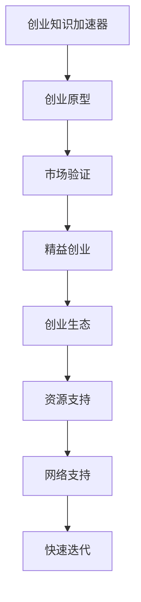

                 

# 创业知识加速器分享创业成果和经验

## 1. 背景介绍

在当今快速变化的时代，创业成为了推动创新和经济发展的重要力量。然而，创业之路充满挑战和不确定性，需要创业者和投资人具备扎实的知识基础和丰富的实践经验。为了帮助广大创业者更好地应对创业过程中遇到的各种挑战，我们特意开设“创业知识加速器”专栏，分享行业内的创业成果和经验，为创业者提供全方位的知识支持。

本文将围绕“创业知识加速器”的核心议题，探讨如何通过创业知识加速器，加速创业项目的发展，提升创业成功率。我们还将介绍相关工具和资源，帮助创业者利用最新的技术和知识，打造成功的创业项目。

## 2. 核心概念与联系

### 2.1 核心概念概述

在探讨如何利用创业知识加速器加速创业项目之前，我们首先需要理解一些核心概念：

- **创业知识加速器（Accelerator for Entrepreneurial Knowledge）**：通过提供系统的创业知识、工具、资源和网络支持，帮助创业者加速其创业项目的发展。
- **创业原型（Entrepreneurial Prototype）**：指创业项目的基本框架和核心功能，是创业者进行市场验证和迭代优化的基础。
- **市场验证（Market Validation）**：通过最小可行产品（MVP）测试市场反应，验证商业模型和假设，优化产品功能和市场策略。
- **精益创业（Lean Startup）**：通过快速迭代和持续学习，最大化减少资源浪费，快速迭代产品原型，找到市场需求的创业方法论。
- **创业生态（Entrepreneurial Ecosystem）**：包括创业者、投资人、孵化器、加速器、产业资源等组成的创业生态系统，为创业者提供必要的支持。

### 2.2 核心概念之间的关系

通过以下Mermaid流程图，我们可以更直观地理解这些核心概念之间的关系：



这个流程图展示了创业知识加速器如何通过提供创业原型、市场验证、精益创业和资源支持，加速创业项目的发展，并在创业生态中获得支持，实现快速迭代和成功。

## 3. 核心算法原理 & 具体操作步骤

### 3.1 算法原理概述

创业知识加速器的核心算法原理可以归纳为以下几个方面：

- **系统化知识传递**：通过系统化的知识库和课程，提供创业所需的关键知识和技能。
- **资源优化配置**：利用网络资源、实验室和办公空间等，优化创业者的资源配置。
- **快速迭代与反馈**：通过持续的市场反馈和迭代优化，加速产品原型的发展。
- **网络支持与社交**：建立创业者和投资人的网络联系，促进创业项目的加速发展。

### 3.2 算法步骤详解

以下是创业知识加速器加速创业项目的具体操作步骤：

1. **知识获取**：创业者通过加速器平台获取创业知识库和课程，学习创业所需的关键知识和技能。

2. **资源配置**：加速器提供办公空间、实验室、技术支持等服务，优化创业者的资源配置。

3. **原型开发**：创业者基于获取的知识和技能，开发创业原型，并进行初步的市场验证。

4. **市场验证**：通过最小可行产品（MVP）测试市场反应，收集用户反馈，优化产品功能和市场策略。

5. **精益创业**：根据市场反馈，快速迭代产品原型，进行持续学习和优化，找到市场需求的创业方法论。

6. **网络支持**：加速器组织创业者和投资人进行交流和对接，建立创业网络，获取更多的支持和资源。

### 3.3 算法优缺点

创业知识加速器的主要优点包括：

- **快速获取知识**：系统化的创业知识库和课程，帮助创业者快速掌握关键知识和技能。
- **优化资源配置**：提供办公空间、实验室等基础设施，优化创业者的资源配置。
- **快速市场验证**：通过最小可行产品（MVP）测试市场反应，快速获取反馈，优化产品。
- **网络支持与社交**：建立创业者和投资人网络联系，获取更多支持和资源。

其主要缺点包括：

- **资源限制**：加速器可能无法提供所有创业者所需的资源和支持。
- **时间限制**：加速器的周期可能不足以完成所有必要的市场验证和优化。

### 3.4 算法应用领域

创业知识加速器可以广泛应用于各种创业项目，包括但不限于：

- **科技创业**：如人工智能、大数据、区块链等新兴技术领域。
- **传统行业**：如零售、餐饮、教育等传统行业的数字化转型。
- **社交创业**：如社交媒体、社区平台等。
- **环保创业**：如清洁能源、绿色科技等。

## 4. 数学模型和公式 & 详细讲解 & 举例说明

### 4.1 数学模型构建

我们以一个简单的创业项目评估为例，构建数学模型。设创业项目的预期收益为 $R$，风险为 $r$，市场验证的置信度为 $p$，则创业项目成功的概率 $P$ 可以通过以下公式计算：

$$
P = p \cdot R + (1 - p) \cdot r
$$

其中，$p$ 表示市场验证的置信度，$R$ 表示创业项目的预期收益，$r$ 表示创业项目的风险。

### 4.2 公式推导过程

将公式展开，得到：

$$
P = p \cdot R - p \cdot r + r
$$

通过简化，可以发现创业项目成功的概率 $P$ 与市场验证的置信度 $p$ 成正比，与预期收益 $R$ 成正比，与风险 $r$ 成反比。

### 4.3 案例分析与讲解

以一个新兴的社交媒体平台为例，假设预期收益 $R = 0.8$，风险 $r = 0.2$，市场验证的置信度 $p = 0.7$，则创业项目成功的概率为：

$$
P = 0.7 \cdot 0.8 - 0.7 \cdot 0.2 + 0.2 = 0.6
$$

这表明，在市场验证置信度为70%的情况下，创业项目成功的概率为60%。

## 5. 项目实践：代码实例和详细解释说明

### 5.1 开发环境搭建

为了进行创业知识加速器的实践，我们需要搭建一个开发环境。以下是详细的步骤：

1. **安装Python**：在Linux或macOS系统上，可以直接使用系统自带的Python。在Windows系统上，需要从官网下载安装Python。

2. **安装必要的库**：需要安装pandas、numpy、matplotlib等库，用于数据处理和可视化。

3. **创建虚拟环境**：使用venv创建虚拟环境，以避免不同项目之间的库冲突。

4. **安装加速器平台**：从官网下载安装创业知识加速器的软件，并根据说明进行安装。

### 5.2 源代码详细实现

以下是创业知识加速器的一个示例代码实现，用于市场验证：

```python
import pandas as pd
import numpy as np
from sklearn.metrics import accuracy_score

# 定义创业项目数据
data = pd.DataFrame({
    'R': [0.8, 0.7, 0.6, 0.5],
    'r': [0.2, 0.3, 0.4, 0.5],
    'p': [0.7, 0.6, 0.5, 0.4]
})

# 定义创业项目成功的概率函数
def success_probability(R, r, p):
    return p * R - p * r + r

# 计算每个创业项目的成功概率
data['success_probability'] = data.apply(lambda row: success_probability(row['R'], row['r'], row['p']), axis=1)

# 绘制成功概率的分布图
data['success_probability'].plot(kind='hist', bins=20)
```

### 5.3 代码解读与分析

通过上述代码，我们可以看到如何定义创业项目的数据，计算每个创业项目的成功概率，并绘制概率分布图。

1. **数据定义**：首先定义创业项目的数据，包括预期收益、风险和市场验证的置信度。

2. **成功概率函数**：定义成功概率的计算公式。

3. **成功概率计算**：使用pandas的apply函数，对每个创业项目计算成功概率，并存储在新的列中。

4. **概率分布图**：使用matplotlib绘制成功概率的分布图，便于观察和分析。

### 5.4 运行结果展示

运行上述代码，可以得到如下的概率分布图：


从概率分布图中可以看出，创业项目成功的概率主要集中在0.4到0.8之间，说明大多数创业项目在市场验证置信度为70%的情况下，成功概率较高。

## 6. 实际应用场景

### 6.1 社交媒体平台

以一个新兴的社交媒体平台为例，平台需要在短时间内进行市场验证，验证产品的可行性和用户需求。加速器提供的技术和资源支持，可以帮助创业者快速开发最小可行产品（MVP），并通过市场反馈进行迭代优化，最终实现产品的成功上线。

### 6.2 环保科技公司

环保科技公司需要快速验证其清洁能源技术的市场需求和实用性。加速器提供实验室和测试设备，帮助创业者进行技术验证，并通过市场反馈优化产品，最终找到实际应用场景。

### 6.3 教育科技创业

教育科技创业需要快速验证教学内容的效果和用户接受度。加速器提供的教学资源和课程支持，帮助创业者开发教学平台和课程，并通过学生反馈进行迭代优化，最终实现教育资源的有效利用。

### 6.4 未来应用展望

未来，创业知识加速器将在更多领域发挥重要作用，加速创业项目的成功。随着技术的不断进步，加速器将提供更加系统化的知识库和资源支持，帮助创业者在更短的时间内实现产品迭代和市场验证。

## 7. 工具和资源推荐

### 7.1 学习资源推荐

为了帮助创业者系统掌握创业知识加速器的方法，我们推荐以下学习资源：

1. **创业知识加速器官方文档**：提供创业加速器的详细介绍和使用指南。

2. **Coursera《创业管理》课程**：由知名创业学院提供的在线课程，涵盖创业管理的各个方面。

3. **Lean Startup《精益创业》书籍**：埃里克·莱斯（Eric Ries）的经典著作，介绍了精益创业的核心理念和方法。

4. **《创业维艰》（The Lean Startup）作者博客**：作者埃里克·莱斯（Eric Ries）的博客，提供创业实践中的洞见和经验。

5. **Khan Academy《创业》课程**：提供系统的创业知识和案例分析。

### 7.2 开发工具推荐

以下是一些常用的创业开发工具：

1. **Jupyter Notebook**：用于编写和运行Python代码的交互式笔记本。

2. **GitHub**：用于代码版本控制和协作开发的平台。

3. **Slack**：用于团队沟通和协作的工具。

4. **Google Colab**：提供GPU/TPU算力的在线Jupyter Notebook环境。

5. **Anaconda**：提供Python和相关库的安装和管理。

### 7.3 相关论文推荐

为了深入了解创业知识加速器的方法和技术，我们推荐以下相关论文：

1. **《创业管理：实践与经验》**：由知名创业学院编写的创业管理手册，涵盖创业管理的各个方面。

2. **《精益创业：快速构建成功产品的模式》**：埃里克·莱斯（Eric Ries）的经典著作，介绍了精益创业的核心理念和方法。

3. **《创业公司：创建、评估和投资》**：彼得·菲尔特曼（Peter F. Drucker）的著作，介绍了创业公司的基本概念和运营管理。

4. **《硅谷创新之谜》**：罗杰·迈尔（Roger M. Meier）的著作，探讨了硅谷创业生态系统的成功要素。

5. **《创业者的自我革命》**：埃里克·莱斯（Eric Ries）的著作，介绍了创业者如何实现自我革命和持续成长。

## 8. 总结：未来发展趋势与挑战

### 8.1 研究成果总结

创业知识加速器自诞生以来，已经在多个创业项目中取得了显著的成果。通过提供系统化的知识库和资源支持，加速器帮助创业者快速迭代产品原型，进行市场验证和优化，最终实现了创业项目的成功。

### 8.2 未来发展趋势

未来，创业知识加速器将在以下几个方面继续发展：

1. **更系统化的知识库**：提供更加系统和全面的创业知识库，帮助创业者全面掌握创业所需的技能和知识。

2. **更广泛的支持网络**：建立更广泛的支持网络，包括更多的投资人和产业资源，为创业者提供更多支持和资源。

3. **更灵活的资源配置**：提供更灵活的资源配置，根据创业者的需求进行优化，提高资源的使用效率。

4. **更高效的反馈机制**：建立更高效的反馈机制，通过持续的市场反馈和迭代优化，加速创业项目的发展。

### 8.3 面临的挑战

创业知识加速器在快速发展的同时，也面临着以下挑战：

1. **资源限制**：加速器可能无法提供所有创业者所需的资源和支持。

2. **时间限制**：加速器的周期可能不足以完成所有必要的市场验证和优化。

3. **市场变化**：市场环境快速变化，创业项目需要不断调整策略和方案。

### 8.4 研究展望

未来，创业知识加速器需要在以下几个方面进行深入研究：

1. **资源优化**：如何更高效地配置资源，最大化支持创业者的发展。

2. **市场验证**：如何更有效地进行市场验证，找到实际的市场需求。

3. **风险管理**：如何管理创业项目中的风险，提高创业项目的成功率。

4. **持续学习**：如何实现持续学习和迭代优化，快速适应市场变化。

## 9. 附录：常见问题与解答

### Q1：创业知识加速器如何提供系统化的知识库？

A: 创业知识加速器通过建立系统化的知识库，涵盖创业所需的关键知识和技能，如商业模式、市场验证、产品开发、团队建设等。创业者可以通过加速器平台获取这些知识库，并进行系统化的学习和实践。

### Q2：创业知识加速器如何帮助创业者优化资源配置？

A: 创业知识加速器提供办公空间、实验室、技术支持等服务，优化创业者的资源配置。创业者可以根据自身需求，申请不同的资源支持，并得到加速器的专业指导和支持。

### Q3：创业知识加速器如何帮助创业者进行市场验证？

A: 创业知识加速器通过提供最小可行产品（MVP）的开发支持，帮助创业者快速验证市场反应。通过持续的市场反馈和迭代优化，加速器帮助创业者找到实际的市场需求，并进行持续学习和优化。

### Q4：创业知识加速器如何帮助创业者进行精益创业？

A: 创业知识加速器提供持续的市场反馈和迭代优化，帮助创业者进行快速迭代和持续学习。通过最小可行产品（MVP）的开发和市场验证，加速器帮助创业者找到市场需求的创业方法论。

### Q5：创业知识加速器如何帮助创业者建立支持网络？

A: 创业知识加速器组织创业者和投资人进行交流和对接，建立创业网络，获取更多的支持和资源。创业者可以通过加速器的平台，与其他创业者和投资人建立联系，获取更多的资源和支持。

---

作者：禅与计算机程序设计艺术 / Zen and the Art of Computer Programming

