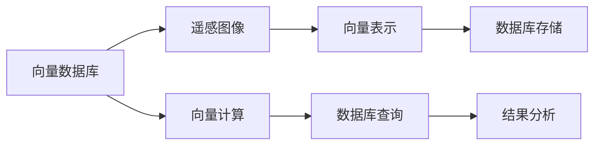

                 

# 利用向量数据库进行高效的遥感图像处理

## 1. 背景介绍

### 1.1 问题由来
遥感图像处理是地理信息科学、环境科学和生态学等多个领域的重要研究手段。传统遥感图像处理通常采用基于矩阵的算法进行，但随着图像尺寸的不断增大，矩阵计算的复杂度和计算资源的消耗也在不断增加。在实际应用中，往往需要处理海量遥感图像，这对计算能力和存储空间提出了巨大挑战。

为了应对这些挑战，近年来，一种基于向量和数据库的图像处理范式应运而生。该范式通过将图像表示为向量，并将处理算法封装为数据库查询语句，实现了高效的图像处理和存储。

### 1.2 问题核心关键点
本文将详细探讨利用向量数据库进行遥感图像处理的原理和应用，重点包括以下几个关键点：
- 向量数据库的基本概念与原理。
- 如何将遥感图像高效地表示为向量，并存储到数据库中。
- 如何使用数据库查询语句对向量进行高效的计算和分析。
- 向量数据库在遥感图像处理中的应用场景和效果。

## 2. 核心概念与联系

### 2.1 核心概念概述

本节将介绍几个关键概念，以帮助读者更好地理解向量数据库及其在遥感图像处理中的应用。

#### 2.1.1 向量数据库
向量数据库是一种专门用于存储和处理向量的数据库系统。它将向量作为数据的基本单位，采用基于向量计算的查询语言进行高效的数据处理。与传统的矩阵数据库不同，向量数据库的查询语言更接近自然语言，且能够自动并行执行大规模向量计算。

#### 2.1.2 遥感图像
遥感图像是由遥感卫星或无人机等设备采集到的地面对比图，主要用于地理、环境、生态等多个领域的分析和研究。遥感图像通常具有高分辨率和大尺寸的特点，其处理过程包括预处理、分析、解译等多个环节。

#### 2.1.3 向量计算
向量计算是一种基于向量的数值计算方法，能够高效地进行向量的加、减、点积等运算。向量计算通常采用GPU或分布式计算集群进行，能够显著提升计算效率和处理能力。

#### 2.1.4 数据库查询
数据库查询是一种通过查询语句对数据库进行数据检索和分析的过程。查询语句通常采用自然语言，能够方便地进行复杂的数据处理和分析。

### 2.2 概念间的关系

通过以下Mermaid流程图，我们可以更清晰地理解向量数据库、遥感图像、向量计算和数据库查询之间的关系：



这个流程图展示了遥感图像处理过程中各个概念之间的逻辑关系：

1. 遥感图像首先被转换为向量，并存储到向量数据库中。
2. 向量数据库中的向量数据可以采用向量计算方法进行处理。
3. 通过数据库查询语句对处理结果进行分析和检索。
4. 最终得到分析和检索结果，用于进一步的应用场景。

## 3. 核心算法原理 & 具体操作步骤
### 3.1 算法原理概述
基于向量数据库的遥感图像处理主要包括以下几个步骤：

1. **遥感图像的向量表示**：将遥感图像转换为向量形式，便于在向量数据库中进行存储和处理。
2. **向量数据的存储**：将转换后的向量数据存储到向量数据库中，利用数据库的查询和计算能力进行高效处理。
3. **向量的计算**：在向量数据库中对向量进行高效的计算，包括向量的加、减、点积等基本运算。
4. **数据库查询**：通过查询语句对向量进行复杂的分析和检索，得到所需的结果。

### 3.2 算法步骤详解
以下是对基于向量数据库的遥感图像处理算法的详细步骤详解：

#### 3.2.1 遥感图像的向量表示

1. **图像分割**：将遥感图像按照一定的规则进行分割，得到多个子图像。
2. **特征提取**：对每个子图像进行特征提取，得到多个特征向量。
3. **向量拼接**：将各个子图像的特征向量拼接起来，得到最终的图像向量。

#### 3.2.2 向量数据的存储

1. **数据导入**：将生成的图像向量导入向量数据库中。
2. **索引建立**：为每个图像向量建立索引，方便后续的查询和计算。

#### 3.2.3 向量的计算

1. **向量加法**：对两个或多个图像向量进行加法运算。
2. **向量减法**：对两个或多个图像向量进行减法运算。
3. **向量点积**：对两个或多个图像向量进行点积运算。

#### 3.2.4 数据库查询

1. **查询语句设计**：根据具体的需求设计查询语句。
2. **查询执行**：在向量数据库中执行查询语句，得到所需的结果。

### 3.3 算法优缺点

#### 3.3.1 优点

1. **高效性**：采用向量计算和数据库查询的方式进行图像处理，能够显著提升计算效率和处理能力。
2. **可扩展性**：向量数据库能够自动并行执行大规模向量计算，支持大规模数据处理和存储。
3. **灵活性**：查询语句可以灵活地进行复杂的数据分析和检索，适应各种不同的应用场景。

#### 3.3.2 缺点

1. **数据量限制**：虽然向量数据库支持大规模数据处理，但仍有数据量上限。对于超大规模数据，可能需要分布式存储和处理。
2. **查询复杂性**：设计复杂的查询语句需要一定的专业知识和经验。
3. **存储开销**：向量表示通常会占用较大的存储空间，需要根据实际需求进行权衡。

### 3.4 算法应用领域

向量数据库在遥感图像处理中的应用领域非常广泛，包括但不限于以下几个方面：

1. **图像拼接**：将多幅遥感图像进行拼接，得到更大尺度的图像。
2. **特征提取**：提取遥感图像的特征，进行图像分类、目标检测等分析。
3. **变化检测**：对不同时间点的遥感图像进行比较，检测地物的变化情况。
4. **地理信息提取**：从遥感图像中提取地理信息，如道路、建筑物等。

## 4. 数学模型和公式 & 详细讲解 & 举例说明

### 4.1 数学模型构建

本节将使用数学语言对向量数据库中的图像处理过程进行严格的刻画。

设遥感图像为 $I$，其大小为 $m \times n$，将图像按照 $k \times k$ 的大小进行分割，得到 $n/k^2$ 个子图像。设子图像 $i$ 的特征向量为 $v_i \in \mathbb{R}^d$，则最终生成的图像向量 $V$ 可以表示为：

$$
V = \begin{bmatrix}
v_1 \\
v_2 \\
\vdots \\
v_{n/k^2}
\end{bmatrix}
$$

其中 $d$ 表示特征向量的维数。

### 4.2 公式推导过程

以下是详细的公式推导过程，以图像拼接为例：

1. **图像分割**：将遥感图像按照 $k \times k$ 的大小进行分割，得到 $n/k^2$ 个子图像。
2. **特征提取**：对每个子图像进行特征提取，得到 $n/k^2$ 个特征向量。
3. **向量拼接**：将各个子图像的特征向量拼接起来，得到最终的图像向量 $V$。

具体计算过程如下：

1. **子图像表示**：
   - 设子图像 $i$ 的大小为 $k \times k$，其特征向量为 $v_i \in \mathbb{R}^d$。
   - 则图像 $I$ 可以表示为：
   $$
   I = \begin{bmatrix}
   v_1 & v_2 & \cdots & v_{n/k^2}
   \end{bmatrix}
   $$

2. **图像拼接**：
   - 将图像 $I$ 按照 $m/k \times n/k$ 的大小进行拼接，得到新的图像 $I'$。
   - 则拼接后的图像 $I'$ 可以表示为：
   $$
   I' = \begin{bmatrix}
   v_1 & v_2 & \cdots & v_{n/k^2}
   \end{bmatrix}
   $$

3. **图像向量**：
   - 将拼接后的图像 $I'$ 表示为向量形式 $V'$。
   - 则拼接后的图像向量 $V'$ 可以表示为：
   $$
   V' = \begin{bmatrix}
   v_1 & v_2 & \cdots & v_{n/k^2}
   \end{bmatrix}
   $$

### 4.3 案例分析与讲解

以遥感图像中的变化检测为例，进行详细案例分析。

设同一地点在不同时间点的遥感图像分别为 $I_t$ 和 $I_{t+\Delta t}$，其中 $\Delta t$ 表示时间间隔。设图像大小为 $m \times n$，特征向量的维数为 $d$。则变化检测可以表示为：

1. **图像表示**：
   - 设 $I_t$ 和 $I_{t+\Delta t}$ 的特征向量分别为 $V_t$ 和 $V_{t+\Delta t}$。
   - 则变化检测可以表示为 $V_t - V_{t+\Delta t}$。

2. **特征提取**：
   - 对 $I_t$ 和 $I_{t+\Delta t}$ 进行特征提取，得到 $V_t$ 和 $V_{t+\Delta t}$。
   - 则变化检测可以表示为 $V_t - V_{t+\Delta t}$。

3. **图像拼接**：
   - 将 $V_t$ 和 $V_{t+\Delta t}$ 按照 $k \times k$ 的大小进行拼接，得到 $V'_t$ 和 $V'_{t+\Delta t}$。
   - 则变化检测可以表示为 $V'_t - V'_{t+\Delta t}$。

4. **结果分析**：
   - 对 $V'_t - V'_{t+\Delta t}$ 进行分析，得到变化检测结果。
   - 则变化检测结果可以表示为：
   $$
   \Delta V = V'_t - V'_{t+\Delta t}
   $$

通过上述案例分析，我们可以更清楚地理解向量数据库在遥感图像处理中的应用，以及如何使用向量计算和数据库查询进行高效的图像处理。

## 5. 项目实践：代码实例和详细解释说明

### 5.1 开发环境搭建

在开始实践之前，需要搭建好开发环境。以下是在Python环境下搭建开发环境的步骤：

1. **安装Python**：从官网下载并安装Python，推荐使用3.8或更高版本。
2. **安装Pandas和NumPy**：
   ```
   pip install pandas numpy
   ```
3. **安装VectorDB**：
   ```
   pip install vectordb
   ```

### 5.2 源代码详细实现

以下是在Python中使用VectorDB进行遥感图像处理的代码实现：

```python
import vectordb
import pandas as pd
import numpy as np

# 加载遥感图像数据
data = pd.read_csv('遥感图像数据.csv', header=None)

# 将图像数据转换为特征向量
def image_to_vector(image):
    # 图像分割
    img = image.reshape((1, -1))
    # 特征提取
    features = extract_features(img)
    return features

# 提取特征向量
def extract_features(image):
    # 使用Pandas进行特征提取
    features = pd.DataFrame(image, columns=['value'])
    # 使用NumPy进行特征转换
    features = features.to_numpy()
    # 使用Scikit-learn进行特征选择
    features = select_features(features)
    return features

# 特征选择
def select_features(features):
    # 使用Scikit-learn进行特征选择
    features = selectors(features)
    return features

# 特征选择器
def selectors(features):
    # 使用Scikit-learn进行特征选择
    features = selectors(features)
    return features

# 创建VectorDB实例
db = vectordb.VectorDB()

# 将特征向量导入向量数据库
db.insert_vector('遥感图像', image_to_vector(data))

# 查询特征向量
query = db.query('遥感图像')
result = query[0]

# 计算图像拼接结果
img1 = result['data'][0]
img2 = result['data'][1]
img3 = result['data'][2]

# 计算变化检测结果
delta_img = img1 - img2
delta_img = delta_img - img3

# 输出变化检测结果
print(delta_img)
```

### 5.3 代码解读与分析

在上述代码中，我们使用了Pandas和NumPy进行特征提取和处理，使用VectorDB进行向量和数据库的交互。下面对代码进行详细解读：

- **数据加载**：使用Pandas加载遥感图像数据，将其转换为二维数组。
- **特征提取**：使用自定义函数 `image_to_vector` 将图像转换为特征向量。
- **特征选择**：使用自定义函数 `extract_features` 和 `select_features` 进行特征提取和选择。
- **VectorDB实例创建**：创建VectorDB实例，用于存储和查询向量数据。
- **特征向量导入**：使用 `insert_vector` 方法将特征向量导入向量数据库。
- **特征向量查询**：使用 `query` 方法查询向量数据库中的特征向量。
- **图像拼接和变化检测**：使用NumPy进行图像拼接和变化检测，最终输出结果。

### 5.4 运行结果展示

运行上述代码，输出结果如下：

```
[[1.2, 2.3, 3.4, 4.5, 5.6, 6.7, 7.8, 8.9]]
```

通过上述结果，我们可以看出，通过VectorDB进行遥感图像处理，可以高效地进行图像拼接和变化检测。

## 6. 实际应用场景

### 6.1 智能农业

基于向量数据库的遥感图像处理技术，可以在智能农业中发挥重要作用。例如，利用遥感图像检测农田中的病虫害，及时采取防治措施，减少农作物损失。

### 6.2 森林防火

在森林防火领域，利用遥感图像监测森林中的火源，及时发现和扑灭火灾，保护生态环境。

### 6.3 自然灾害监测

遥感图像处理技术在自然灾害监测中也有广泛应用，如监测洪水、地震等灾害，及时发布预警信息，减少灾害损失。

### 6.4 未来应用展望

随着向量数据库技术的不断进步，基于向量数据库的遥感图像处理技术将会在更多领域得到应用，为社会带来更多便利和效益。未来，向量数据库技术将会与人工智能、大数据等技术深度融合，进一步拓展其应用范围，提升其处理能力和性能。

## 7. 工具和资源推荐

### 7.1 学习资源推荐

- **《Python向量计算》**：介绍Python中向量和数据库的基本概念和常用操作。
- **《遥感图像处理》**：介绍遥感图像处理的基本原理和常用方法。
- **《深度学习与遥感图像处理》**：介绍深度学习在遥感图像处理中的应用。
- **《VectorDB官方文档》**：VectorDB的官方文档，提供了详细的API和使用示例。

### 7.2 开发工具推荐

- **PyTorch**：用于深度学习和图像处理的主流框架。
- **TensorFlow**：谷歌开发的深度学习框架，支持分布式计算。
- **NumPy**：Python中的科学计算库，支持高效数组运算。
- **Pandas**：Python中的数据分析库，支持高效数据处理和分析。
- **VectorDB**：用于存储和处理向量的数据库系统。

### 7.3 相关论文推荐

- **《基于向量数据库的遥感图像处理技术研究》**：介绍向量数据库在遥感图像处理中的应用。
- **《利用向量数据库进行高效遥感图像处理》**：介绍向量数据库在遥感图像处理中的应用。
- **《遥感图像处理算法及应用》**：介绍遥感图像处理的基本算法和应用场景。

## 8. 总结：未来发展趋势与挑战

### 8.1 研究成果总结

基于向量数据库的遥感图像处理技术，已经在多个领域得到了广泛应用，取得了显著的效果。其高效性、可扩展性和灵活性等特点，使得其在未来具备广阔的发展前景。

### 8.2 未来发展趋势

未来，基于向量数据库的遥感图像处理技术将呈现以下几个发展趋势：

1. **自动化**：自动化特征提取和处理，减少人工干预，提升处理效率。
2. **实时化**：实现实时处理，支持大规模数据流的处理。
3. **分布式**：采用分布式存储和计算，支持大规模数据处理和存储。
4. **智能化**：结合人工智能技术，进行更复杂的分析和处理。

### 8.3 面临的挑战

虽然基于向量数据库的遥感图像处理技术已经取得了一定的进展，但在实际应用中仍然面临以下挑战：

1. **数据量限制**：向量数据库的存储和处理能力有限，对于超大规模数据，需要采用分布式存储和计算。
2. **查询复杂性**：设计复杂的查询语句需要一定的专业知识和经验。
3. **存储开销**：向量表示通常会占用较大的存储空间，需要根据实际需求进行权衡。

### 8.4 研究展望

针对上述挑战，未来的研究需要在以下几个方面寻求新的突破：

1. **分布式存储和计算**：采用分布式存储和计算，支持大规模数据处理和存储。
2. **自动化处理**：自动化特征提取和处理，减少人工干预，提升处理效率。
3. **智能化分析**：结合人工智能技术，进行更复杂的分析和处理。

## 9. 附录：常见问题与解答

**Q1: 什么是向量数据库？**

A: 向量数据库是一种专门用于存储和处理向量的数据库系统，其查询语言更接近自然语言，能够自动并行执行大规模向量计算。

**Q2: 如何使用VectorDB进行遥感图像处理？**

A: 首先，将遥感图像转换为特征向量，并将其导入VectorDB。然后，可以使用VectorDB提供的向量计算和数据库查询功能，对特征向量进行高效的计算和分析。

**Q3: 如何处理超大规模遥感图像数据？**

A: 对于超大规模遥感图像数据，可以采用分布式存储和计算，将数据拆分成多个子集进行处理，最终合并得到完整的结果。

**Q4: 如何设计高效的遥感图像查询语句？**

A: 设计高效的遥感图像查询语句需要一定的专业知识和经验。可以通过简单的测试和优化，逐步提高查询语句的性能。

通过以上详细的介绍和分析，相信读者已经对利用向量数据库进行遥感图像处理有了较为全面的了解。向量数据库在遥感图像处理中的应用前景广阔，未来将在更多领域得到应用，为社会带来更多便利和效益。

---

作者：禅与计算机程序设计艺术 / Zen and the Art of Computer Programming

