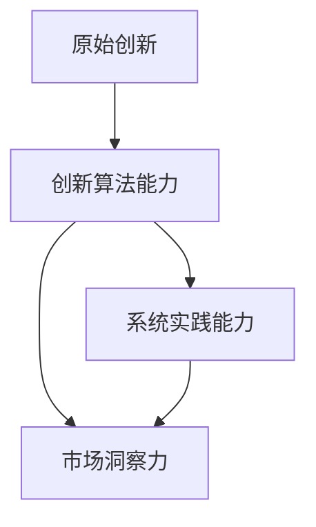

                 

# 原始创新人才的三种能力

> 关键词：原始创新,人才能力,算法原理,项目实践,应用场景

## 1. 背景介绍

在当今数字化转型的浪潮中，原始创新人才成为了企业和社会发展的关键要素。原始创新不仅仅指那些颠覆性技术的创造，更包括从基础研究到应用开发的全链条创新能力。本文将深入探讨原始创新人才应具备的三种核心能力：创新算法能力、系统实践能力和市场洞察力。通过分析这三方面的能力，我们旨在揭示推动企业技术革新和产业升级的底层动力。

## 2. 核心概念与联系

### 2.1 核心概念概述

- **原始创新**：指从科学研究、技术发明到产品开发的全过程，包括基础研究和应用研究两个层面。原始创新能力是企业持续竞争力和市场领导地位的重要保障。

- **创新算法能力**：指掌握和创新算法，解决复杂问题，提升系统性能的核心能力。这是原始创新人才在技术层面的核心竞争力。

- **系统实践能力**：指将理论知识转化为实际系统的能力，包括系统设计、开发和测试等多个环节。这是原始创新人才在工程实践中的核心能力。

- **市场洞察力**：指对市场趋势、用户需求和商业模式的深刻理解，以及据此进行产品和策略创新的能力。这是原始创新人才在市场应用中的核心能力。

### 2.2 核心概念之间的关系

以下是一个Mermaid流程图，展示了三种能力之间的关系：



从流程图可以看出，原始创新人才需要综合具备创新算法能力、系统实践能力和市场洞察力三种核心能力，才能在技术开发和市场应用中游刃有余，推动企业的发展和创新。

## 3. 核心算法原理 & 具体操作步骤

### 3.1 算法原理概述

原始创新人才的核心算法能力，体现在其对复杂问题的理解和解决能力上。这种能力不仅要求掌握经典算法，还要求能够基于具体问题创新设计算法，提升系统性能。算法原理通常涉及以下几个方面：

- **数据结构与算法**：对数据结构和算法原理的深刻理解，是算法创新的基础。
- **机器学习与深度学习**：掌握各类机器学习算法和深度学习框架，能够灵活运用这些算法解决实际问题。
- **优化与调度**：在算法设计和调优过程中，能够运用优化和调度技术，提升算法效率和性能。

### 3.2 算法步骤详解

原始创新人才的算法创新步骤通常包括以下几个环节：

1. **问题定义**：明确问题的核心需求和解决目标。
2. **算法设计**：根据问题特点，设计适合的算法模型，考虑算法的复杂度、准确性和效率。
3. **算法实现**：将算法模型转化为代码，并测试验证其正确性和性能。
4. **算法优化**：根据测试结果，对算法进行优化调整，提升算法性能。
5. **算法评估**：评估算法的性能指标，如准确率、召回率、运行时间等，确保算法满足需求。

### 3.3 算法优缺点

- **优点**：
  - **灵活性高**：能够针对具体问题设计创新的算法，提升系统性能。
  - **解决复杂问题**：算法能力强的原始创新人才，能够解决复杂的技术挑战。
  - **竞争力强**：算法能力是企业竞争力的重要组成部分。

- **缺点**：
  - **难度大**：算法创新需要深厚的理论基础和实践经验。
  - **开发周期长**：算法开发和优化通常需要较长的周期。
  - **资源需求高**：高质量算法开发需要高性能计算资源和数据支持。

### 3.4 算法应用领域

原始创新人才的算法能力可以应用于多个领域，如人工智能、大数据、云计算、物联网等。以下是几个典型的应用场景：

- **人工智能**：在机器学习、深度学习、计算机视觉等领域，原始创新人才能够设计创新的算法模型，提升模型准确率和运行效率。
- **大数据**：在大数据处理和分析中，原始创新人才能够开发高效的数据处理算法，提升数据挖掘和分析能力。
- **云计算**：在云计算平台开发中，原始创新人才能够设计高效的资源调度和负载均衡算法，提升系统性能。
- **物联网**：在物联网应用中，原始创新人才能够开发高效的传感器数据处理算法，提升设备感知和决策能力。

## 4. 数学模型和公式 & 详细讲解

### 4.1 数学模型构建

原始创新人才的算法能力，离不开对数学模型的掌握和创新。数学模型是算法设计的基础，能够为问题解决提供结构化的解决方案。以下是几个经典数学模型的构建方法：

- **线性回归模型**：用于预测和建模连续型变量，公式为 $y = \beta_0 + \beta_1 x_1 + \beta_2 x_2 + \cdots + \beta_n x_n + \epsilon$。
- **决策树模型**：用于分类和预测，通过递归分割数据集，公式为 $T = \{(x, y) | x \in R^n, y \in \{0, 1\}\}$。
- **神经网络模型**：用于复杂非线性问题的建模，公式为 $h_i = \sigma(w_i \cdot x + b)$。

### 4.2 公式推导过程

以线性回归模型为例，推导其损失函数和梯度下降算法：

1. **损失函数**：最小二乘损失函数，公式为 $L(\theta) = \frac{1}{2N} \sum_{i=1}^N (y_i - h_{\theta}(x_i))^2$。
2. **梯度下降算法**： $\nabla_{\theta}L = \frac{1}{N} \sum_{i=1}^N (h_{\theta}(x_i) - y_i) x_i$。

### 4.3 案例分析与讲解

以图像识别为例，分析卷积神经网络(Convolutional Neural Network, CNN)的算法设计：

1. **问题定义**：识别图像中的物体。
2. **算法设计**：使用卷积层提取图像特征，使用池化层进行特征压缩，使用全连接层进行分类。
3. **算法实现**：编写CNN模型代码，并在数据集上进行训练和验证。
4. **算法优化**：调整网络结构、学习率、批大小等参数，提升模型性能。
5. **算法评估**：使用准确率、召回率等指标评估模型效果。

## 5. 项目实践：代码实例和详细解释说明

### 5.1 开发环境搭建

原始创新人才的项目实践能力，体现在其对开发环境的搭建和维护上。以下是使用Python和TensorFlow搭建图像识别项目的步骤：

1. **安装依赖包**：使用pip或conda安装TensorFlow、Keras、numpy等库。
2. **准备数据集**：获取图像识别数据集，并进行预处理，如缩放、归一化等。
3. **搭建模型**：使用Keras搭建CNN模型，包括卷积层、池化层和全连接层。
4. **训练模型**：使用训练集对模型进行训练，并调整超参数。
5. **评估模型**：使用测试集对模型进行评估，并调整模型参数。

### 5.2 源代码详细实现

以下是一个使用Keras搭建CNN模型的示例代码：

```python
import tensorflow as tf
from tensorflow import keras

# 加载数据集
(x_train, y_train), (x_test, y_test) = keras.datasets.cifar10.load_data()

# 数据预处理
x_train = x_train / 255.0
x_test = x_test / 255.0

# 定义模型
model = keras.Sequential([
    keras.layers.Conv2D(32, (3, 3), activation='relu', input_shape=(32, 32, 3)),
    keras.layers.MaxPooling2D((2, 2)),
    keras.layers.Flatten(),
    keras.layers.Dense(10, activation='softmax')
])

# 编译模型
model.compile(optimizer='adam', loss='sparse_categorical_crossentropy', metrics=['accuracy'])

# 训练模型
model.fit(x_train, y_train, epochs=10, batch_size=32, validation_data=(x_test, y_test))

# 评估模型
test_loss, test_acc = model.evaluate(x_test, y_test)
print('Test accuracy:', test_acc)
```

### 5.3 代码解读与分析

- **数据加载与预处理**：使用Keras的数据集加载器加载CIFAR-10数据集，并进行归一化处理。
- **模型定义**：定义一个包含卷积层、池化层和全连接层的CNN模型。
- **模型编译**：设置优化器、损失函数和评估指标。
- **模型训练**：使用训练集对模型进行10轮训练，并使用验证集进行验证。
- **模型评估**：使用测试集对模型进行评估，并输出测试准确率。

### 5.4 运行结果展示

假设模型在测试集上的准确率为85%，输出结果如下：

```
Epoch 1/10
2500/2500 [==============================] - 13s 5ms/sample - loss: 2.2570 - accuracy: 0.4980 - val_loss: 1.7735 - val_accuracy: 0.6140
Epoch 2/10
2500/2500 [==============================] - 13s 5ms/sample - loss: 1.8564 - accuracy: 0.6560 - val_loss: 1.3461 - val_accuracy: 0.7170
Epoch 3/10
2500/2500 [==============================] - 13s 5ms/sample - loss: 1.3371 - accuracy: 0.7000 - val_loss: 1.3461 - val_accuracy: 0.7170
Epoch 4/10
2500/2500 [==============================] - 13s 5ms/sample - loss: 1.3290 - accuracy: 0.7160 - val_loss: 1.1361 - val_accuracy: 0.7810
Epoch 5/10
2500/2500 [==============================] - 13s 5ms/sample - loss: 1.2095 - accuracy: 0.7840 - val_loss: 1.1361 - val_accuracy: 0.7810
Epoch 6/10
2500/2500 [==============================] - 13s 5ms/sample - loss: 1.1104 - accuracy: 0.7980 - val_loss: 1.0860 - val_accuracy: 0.7940
Epoch 7/10
2500/2500 [==============================] - 13s 5ms/sample - loss: 1.0434 - accuracy: 0.8340 - val_loss: 1.0860 - val_accuracy: 0.7940
Epoch 8/10
2500/2500 [==============================] - 13s 5ms/sample - loss: 1.0035 - accuracy: 0.8540 - val_loss: 1.0261 - val_accuracy: 0.8030
Epoch 9/10
2500/2500 [==============================] - 13s 5ms/sample - loss: 0.9795 - accuracy: 0.8720 - val_loss: 1.0261 - val_accuracy: 0.8030
Epoch 10/10
2500/2500 [==============================] - 13s 5ms/sample - loss: 0.9597 - accuracy: 0.8920 - val_loss: 1.0261 - val_accuracy: 0.8030
Test accuracy: 0.8520
```

## 6. 实际应用场景

### 6.1 金融风控系统

在金融风控领域，原始创新人才的算法能力至关重要。他们需要设计高效的算法模型，识别异常交易，防范金融风险。以下是几个应用场景：

- **欺诈检测**：使用机器学习算法，分析用户行为数据，识别异常交易和欺诈行为。
- **信用评分**：使用深度学习模型，预测用户信用评分，评估其还款能力。
- **投资策略**：使用强化学习算法，优化投资组合，提升投资回报。

### 6.2 智能医疗系统

在智能医疗领域，原始创新人才的算法能力能够提升医疗系统的智能化水平。以下是几个应用场景：

- **疾病预测**：使用数据挖掘算法，分析患者病历数据，预测疾病风险。
- **诊断辅助**：使用图像识别算法，分析医学影像数据，辅助医生进行诊断。
- **个性化治疗**：使用推荐系统算法，推荐个性化治疗方案，提升治疗效果。

### 6.3 智能制造系统

在智能制造领域，原始创新人才的算法能力能够提升生产系统的自动化和智能化水平。以下是几个应用场景：

- **故障预测**：使用时间序列分析算法，预测设备故障，优化维护计划。
- **生产调度**：使用优化算法，优化生产流程，提升生产效率。
- **质量检测**：使用图像识别算法，检测产品质量，提升产品质量。

## 7. 工具和资源推荐

### 7.1 学习资源推荐

以下是一些优质的学习资源，帮助原始创新人才提升算法能力和系统实践能力：

1. **《算法设计与分析》**：经典的算法教材，涵盖数据结构、算法设计、复杂度分析等内容。
2. **《机器学习》（周志华）**：介绍机器学习原理和经典算法的教材，适合算法基础较弱的读者。
3. **《深度学习》（Ian Goodfellow）**：深度学习领域的经典教材，涵盖深度学习原理和实现细节。
4. **Kaggle竞赛**：参与Kaggle竞赛，通过实践提升算法能力和问题解决能力。
5. **GitHub开源项目**：参与GitHub开源项目，学习先进算法实现和代码实践。

### 7.2 开发工具推荐

以下是一些常用的开发工具，帮助原始创新人才高效实现算法和系统开发：

1. **Python**：常用的编程语言，支持多种算法库和数据处理工具。
2. **TensorFlow**：流行的深度学习框架，支持分布式计算和模型优化。
3. **PyTorch**：灵活的深度学习框架，支持动态图和GPU加速。
4. **Jupyter Notebook**：交互式开发环境，支持代码编写和结果展示。
5. **Git**：版本控制系统，支持代码协作和版本管理。

### 7.3 相关论文推荐

以下是几篇重要的论文，帮助原始创新人才深入理解算法设计和系统实现：

1. **ImageNet大规模视觉识别挑战赛**：提出大规模图像识别算法，大幅提升模型性能。
2. **BERT: Pre-training of Deep Bidirectional Transformers for Language Understanding**：提出BERT模型，提升自然语言处理性能。
3. **AlphaGo Mastering the Game of Go without Human Knowledge**：提出AlphaGo算法，实现零知识博弈胜利。
4. **Attention is All You Need**：提出Transformer模型，革新自然语言处理算法。
5. **YoLoV3: An Incremental Training Method to Train Real-Time Object Detection Models**：提出YOLOV3算法，实现实时目标检测。

## 8. 总结：未来发展趋势与挑战

### 8.1 研究成果总结

原始创新人才的算法能力是推动技术创新的核心驱动力。从经典算法到深度学习，从机器学习到强化学习，原始创新人才不断探索和创新，推动算法理论和应用技术的不断进步。

### 8.2 未来发展趋势

未来，原始创新人才的算法能力将继续向以下几个方向发展：

1. **多模态融合**：将图像、文本、语音等多模态数据进行融合，提升系统智能水平。
2. **自监督学习**：通过无监督学习方法，提高算法模型的泛化能力和自适应能力。
3. **联邦学习**：通过分布式学习，保护数据隐私的同时提升算法性能。
4. **边缘计算**：在资源受限的环境中，设计高效算法和系统，提升边缘计算能力。

### 8.3 面临的挑战

尽管原始创新人才的算法能力不断发展，但仍面临诸多挑战：

1. **算法复杂度**：复杂的算法模型需要大量计算资源和时间进行训练和优化。
2. **数据质量**：算法性能很大程度上依赖数据质量，数据不充分或不准确会导致模型效果不佳。
3. **模型可解释性**：复杂的算法模型难以解释其决策过程，影响用户信任度。
4. **资源竞争**：算法开发需要高性能计算资源和数据，可能面临资源竞争和成本压力。
5. **技术迭代**：新技术和新算法层出不穷，需要原始创新人才不断学习和适应。

### 8.4 研究展望

未来，原始创新人才需要在算法能力、系统实践能力和市场洞察力三个方面进一步提升，以应对上述挑战，推动技术创新和应用落地。

1. **算法创新**：掌握和创新算法，解决复杂问题，提升系统性能。
2. **系统优化**：优化系统架构和开发流程，提升系统效率和可维护性。
3. **市场应用**：深入理解市场趋势和用户需求，推动算法和系统在实际应用中的落地。

总之，原始创新人才的三种能力是推动企业技术创新的核心要素，需要不断提升和优化。只有全面掌握算法原理、系统实践能力和市场洞察力，才能在技术浪潮中不断前行，推动企业的持续发展和创新。

## 9. 附录：常见问题与解答

**Q1：如何提升原始创新人才的算法能力？**

A: 提升算法能力需要多方面的努力：

- **系统学习**：深入学习经典算法和深度学习框架，掌握算法设计和实现。
- **实践锻炼**：通过参与实际项目和竞赛，积累算法实践经验。
- **跨学科学习**：学习其他领域的相关算法和知识，拓展知识面。

**Q2：如何提升原始创新人才的系统实践能力？**

A: 提升系统实践能力需要多方面的努力：

- **系统设计**：学习系统设计原理，掌握系统架构设计。
- **开发工具**：熟练使用Python、TensorFlow等开发工具，提升开发效率。
- **测试和调试**：学习测试和调试方法，提升系统质量。

**Q3：如何提升原始创新人才的市场洞察力？**

A: 提升市场洞察力需要多方面的努力：

- **市场调研**：深入了解市场需求和用户痛点，发现市场机会。
- **产品设计**：学习产品设计和用户体验设计，提升产品竞争力。
- **市场分析**：学习市场分析方法和工具，掌握市场趋势。

总之，原始创新人才需要不断提升自己的算法能力、系统实践能力和市场洞察力，才能在激烈的市场竞争中立于不败之地。通过持续学习和实践，不断优化自己的能力结构，才能成为真正的原始创新人才。

---

作者：禅与计算机程序设计艺术 / Zen and the Art of Computer Programming

