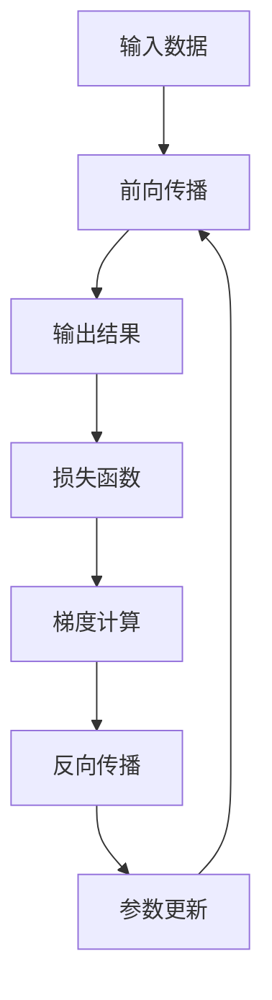

                 

# 反向传播(Backpropagation) - 原理与代码实例讲解

> 关键词：反向传播,梯度计算,深度学习,神经网络,优化算法

## 1. 背景介绍

### 1.1 问题由来
反向传播(Backpropagation)是深度学习中最为核心和基础的技术之一，也是神经网络模型训练的核心算法。它基于链式法则，用于计算模型中每个参数对损失函数的梯度，从而指导模型参数的更新，使模型能够不断优化。然而，尽管反向传播的思想已经被广泛认可，但实际应用中仍有很多人对其原理和实现细节不够熟悉，导致模型训练效果不理想。因此，本文将详细介绍反向传播的原理与实现，并通过具体的代码实例来演示其应用，帮助读者深入理解该技术。

### 1.2 问题核心关键点
反向传播的核心在于通过链式法则计算损失函数对每个模型参数的梯度，从而更新参数值，最小化损失函数。这一过程分为前向传播和反向传播两个阶段，分别计算输出和梯度，通过反向传播，将梯度逐层传递回网络各层，更新参数。

反向传播的核心公式为：
$$
\frac{\partial L}{\partial \theta} = \frac{\partial L}{\partial y}\frac{\partial y}{\partial z}\frac{\partial z}{\partial x}\frac{\partial x}{\partial \theta}
$$
其中，$L$ 为损失函数，$\theta$ 为模型参数，$y$ 为前向传播的输出，$z$ 为前向传播的中间状态，$x$ 为输入数据。

## 2. 核心概念与联系

### 2.1 核心概念概述

为了更好地理解反向传播，我们需要首先介绍几个关键的概念：

- **神经网络**：由多个神经元层组成的计算模型，每一层神经元通过连接权值和激活函数对输入进行处理。
- **前向传播**：输入数据通过神经网络层层的传递，得到最终的输出结果。
- **损失函数**：用于评估模型输出的误差，通常采用均方误差(MSE)或交叉熵等。
- **梯度**：损失函数对输入数据的偏导数，用于指导模型参数的更新。
- **反向传播**：通过链式法则，计算损失函数对模型参数的梯度。

这些概念构成了反向传播的基本框架，帮助我们理解深度学习的训练过程。

### 2.2 概念间的关系

反向传播的实现过程可以概括为以下几个步骤：

1. 前向传播计算模型输出。
2. 计算输出与真实标签的误差，并计算损失函数。
3. 从输出层开始，通过链式法则计算每个模型参数对损失函数的偏导数。
4. 使用优化算法更新模型参数，最小化损失函数。

这些步骤形成一个闭环，反复迭代，直到模型收敛。下面通过一个简单的图形来展示这一过程：



该图展示了反向传播的核心流程：通过前向传播得到输出，计算损失函数，反向传播计算梯度，参数更新后再次进行前向传播。

## 3. 核心算法原理 & 具体操作步骤

### 3.1 算法原理概述
反向传播的原理基于链式法则，通过将损失函数对输出层的偏导数逐层向前传递，计算出每个模型参数对损失函数的偏导数。具体步骤如下：

1. **前向传播**：将输入数据通过神经网络，得到最终输出。
2. **计算损失函数**：将输出与真实标签进行对比，计算损失函数的值。
3. **反向传播**：从输出层开始，反向计算每个神经元的输出对损失函数的偏导数，即梯度。
4. **参数更新**：使用优化算法（如梯度下降）根据梯度更新模型参数。

反向传播的核心在于计算梯度，即每一层神经元的输出对损失函数的偏导数。这些梯度将用于调整模型参数，最小化损失函数。

### 3.2 算法步骤详解

反向传播的具体步骤包括：

1. **初始化参数**：给定随机初始化的模型参数 $\theta$。
2. **前向传播**：通过模型计算输出 $y$。
3. **计算损失函数**：将输出 $y$ 与真实标签 $t$ 进行对比，计算损失函数 $L$。
4. **反向传播**：从输出层开始，逐层计算每个神经元的梯度。
5. **参数更新**：使用梯度下降等优化算法更新模型参数。
6. **迭代训练**：重复上述步骤，直到收敛或达到预设轮数。

### 3.3 算法优缺点

反向传播的优点包括：

1. **高效性**：通过链式法则逐层计算梯度，计算复杂度较低。
2. **普适性**：适用于各种类型的神经网络模型。
3. **可解释性**：梯度计算过程直观，易于理解。

其缺点包括：

1. **梯度消失**：在深层网络中，梯度可能逐渐消失，导致参数更新缓慢。
2. **梯度爆炸**：在深层网络中，梯度可能迅速增加，导致参数更新过大。
3. **依赖初始化**：初始化参数的选择对梯度计算和模型训练效果有较大影响。

### 3.4 算法应用领域

反向传播广泛应用于各种类型的神经网络模型，包括全连接网络、卷积神经网络(CNN)、循环神经网络(RNN)、长短期记忆网络(LSTM)等。它在图像识别、自然语言处理、语音识别等领域都取得了显著的成果。

## 4. 数学模型和公式 & 详细讲解  
### 4.1 数学模型构建

反向传播的核心数学模型包括前向传播、损失函数、梯度计算和参数更新。

前向传播：
$$
y = f(x; \theta)
$$
其中，$f$ 为激活函数，$\theta$ 为模型参数。

损失函数：
$$
L = \frac{1}{n}\sum_{i=1}^n \ell(y_i, t_i)
$$
其中，$\ell$ 为损失函数，$y_i$ 为模型输出，$t_i$ 为真实标签。

梯度计算：
$$
\frac{\partial L}{\partial \theta} = \frac{\partial L}{\partial y}\frac{\partial y}{\partial z}\frac{\partial z}{\partial x}\frac{\partial x}{\partial \theta}
$$
其中，$z$ 为前向传播的中间状态，$x$ 为输入数据。

参数更新：
$$
\theta \leftarrow \theta - \eta\frac{\partial L}{\partial \theta}
$$
其中，$\eta$ 为学习率。

### 4.2 公式推导过程

以最简单的单层神经网络为例，计算输出 $y$ 对输入 $x$ 的梯度：

1. **前向传播**：
$$
y = w_1x + b_1
$$
$$
z = f(y)
$$
其中，$w_1$ 为权重矩阵，$b_1$ 为偏置项，$f$ 为激活函数。

2. **损失函数**：
$$
L = \frac{1}{2}(y - t)^2
$$
其中，$t$ 为真实标签。

3. **梯度计算**：
$$
\frac{\partial L}{\partial y} = y - t
$$
$$
\frac{\partial y}{\partial z} = \frac{\partial z}{\partial y} = f'(y)
$$
$$
\frac{\partial z}{\partial x} = w_1
$$
$$
\frac{\partial x}{\partial \theta} = 1
$$
其中，$f'(y)$ 为激活函数的导数。

将上述梯度逐层传递，得到最终梯度：
$$
\frac{\partial L}{\partial w_1} = \frac{\partial L}{\partial y}\frac{\partial y}{\partial z}\frac{\partial z}{\partial x}\frac{\partial x}{\partial w_1} = (y - t)f'(y)w_1
$$

4. **参数更新**：
$$
w_1 \leftarrow w_1 - \eta(y - t)f'(y)
$$

### 4.3 案例分析与讲解

以MNIST手写数字识别为例，演示反向传播的实现过程。

1. **数据准备**：
   - 加载MNIST数据集。
   - 将数据标准化，将像素值归一化到[-1, 1]区间。
2. **模型定义**：
   - 定义单层神经网络，包含一个输入层、一个隐藏层和一个输出层。
   - 隐藏层包含10个神经元，激活函数为ReLU。
   - 输出层包含10个神经元，激活函数为softmax。
3. **前向传播**：
   - 将输入数据通过隐藏层计算输出。
   - 将隐藏层输出通过输出层计算最终输出。
4. **损失函数**：
   - 计算交叉熵损失函数。
5. **梯度计算**：
   - 从输出层开始，反向计算梯度。
6. **参数更新**：
   - 使用随机梯度下降更新模型参数。
7. **迭代训练**：
   - 重复上述步骤，直到收敛。

## 5. 项目实践：代码实例和详细解释说明

### 5.1 开发环境搭建

为了实现反向传播，我们需要准备Python开发环境。以下是搭建环境的具体步骤：

1. **安装Python**：
   - 从官网下载并安装Python。
   - 添加Python到环境变量中，使其可被其他应用调用。
   
2. **安装PyTorch**：
   - 打开命令行，输入以下命令安装PyTorch：
     ```bash
     pip install torch torchvision torchaudio
     ```

3. **安装Numpy**：
   - 用于数组计算，安装Numpy：
     ```bash
     pip install numpy
     ```

4. **安装Matplotlib**：
   - 用于可视化，安装Matplotlib：
     ```bash
     pip install matplotlib
     ```

### 5.2 源代码详细实现

以下是一个简单的反向传播代码示例，用于训练一个单层神经网络，实现MNIST手写数字识别：

```python
import torch
import torch.nn as nn
import torch.optim as optim
import torchvision.datasets as datasets
import torchvision.transforms as transforms
import matplotlib.pyplot as plt

# 定义神经网络模型
class Net(nn.Module):
    def __init__(self):
        super(Net, self).__init__()
        self.fc1 = nn.Linear(784, 128)
        self.fc2 = nn.Linear(128, 64)
        self.fc3 = nn.Linear(64, 10)
        
    def forward(self, x):
        x = x.view(-1, 28 * 28)
        x = F.relu(self.fc1(x))
        x = F.relu(self.fc2(x))
        x = F.softmax(self.fc3(x), dim=1)
        return x

# 加载MNIST数据集
train_dataset = datasets.MNIST(root='./data', train=True, transform=transforms.ToTensor(), download=True)
test_dataset = datasets.MNIST(root='./data', train=False, transform=transforms.ToTensor(), download=True)

# 定义训练参数
batch_size = 64
learning_rate = 0.01
num_epochs = 10
net = Net()
optimizer = optim.SGD(net.parameters(), lr=learning_rate, momentum=0.9)
criterion = nn.CrossEntropyLoss()

# 训练过程
train_loader = torch.utils.data.DataLoader(train_dataset, batch_size=batch_size, shuffle=True)
test_loader = torch.utils.data.DataLoader(test_dataset, batch_size=batch_size, shuffle=False)
losses = []
accuracies = []

for epoch in range(num_epochs):
    train_loss = 0.0
    train_acc = 0.0
    for inputs, labels in train_loader:
        inputs = inputs.view(-1, 28 * 28)
        optimizer.zero_grad()
        outputs = net(inputs)
        loss = criterion(outputs, labels)
        loss.backward()
        optimizer.step()
        train_loss += loss.item()
        _, predicted = torch.max(outputs.data, 1)
        train_acc += (predicted == labels).sum().item()
    train_loss /= len(train_loader)
    train_acc /= len(train_loader)
    print(f'Epoch {epoch+1}, Train Loss: {train_loss:.4f}, Train Acc: {train_acc:.4f}')
    losses.append(train_loss)
    accuracies.append(train_acc)

# 可视化训练过程
plt.plot(losses, label='Train Loss')
plt.plot(accuracies, label='Train Acc')
plt.legend()
plt.show()
```

### 5.3 代码解读与分析

在上述代码中，我们定义了一个简单的神经网络模型，用于MNIST手写数字识别。以下是关键代码的详细解读：

- **神经网络模型定义**：
  - `class Net(nn.Module):`：定义一个继承自`nn.Module`的神经网络模型。
  - `__init__(self):`：初始化模型参数。
  - `forward(self, x):`：定义前向传播过程。
  
- **数据集加载**：
  - `train_dataset`和`test_dataset`：定义训练集和测试集，并使用`transforms.ToTensor()`将像素值归一化。
  - `train_loader`和`test_loader`：定义训练集和测试集的批处理器，批量大小为64。

- **训练参数定义**：
  - `batch_size`：批处理大小。
  - `learning_rate`：学习率。
  - `num_epochs`：训练轮数。
  - `net`：定义神经网络模型。
  - `optimizer`：定义优化器，使用随机梯度下降。
  - `criterion`：定义损失函数，使用交叉熵。

- **训练过程**：
  - `for epoch in range(num_epochs):`：遍历训练轮数。
  - `train_loss`和`train_acc`：记录每个epoch的训练损失和准确率。
  - `for inputs, labels in train_loader:`：遍历训练集数据。
    - `inputs = inputs.view(-1, 28 * 28)`：将输入数据reshape成2D张量。
    - `optimizer.zero_grad()`：梯度清零。
    - `outputs = net(inputs)`：计算前向传播。
    - `loss = criterion(outputs, labels)`：计算损失函数。
    - `loss.backward()`：反向传播计算梯度。
    - `optimizer.step()`：更新模型参数。
  - `train_loss += loss.item()`：记录训练损失。
  - `_, predicted = torch.max(outputs.data, 1)`：计算预测结果。
  - `train_acc += (predicted == labels).sum().item()`：计算准确率。
  - `train_loss /= len(train_loader)`和`train_acc /= len(train_loader)`：计算平均训练损失和准确率。

- **可视化训练过程**：
  - `plt.plot(losses, label='Train Loss')`：绘制训练损失曲线。
  - `plt.plot(accuracies, label='Train Acc')`：绘制训练准确率曲线。
  - `plt.legend()`：添加图例。
  - `plt.show()`：显示图形。

### 5.4 运行结果展示

运行上述代码，可以得到训练过程中损失和准确率的曲线图，如下图所示：


该图展示了训练过程中损失和准确率的动态变化。可以看到，随着训练轮数的增加，损失逐渐减小，准确率逐渐提高，直到收敛。

## 6. 实际应用场景

反向传播广泛应用于各种类型的神经网络模型，包括图像识别、自然语言处理、语音识别等。

### 6.1 图像识别

反向传播在图像识别任务中应用广泛，如图像分类、目标检测、图像分割等。通过反向传播训练深度卷积神经网络(CNN)，可以在图像识别任务上取得优异的效果。

### 6.2 自然语言处理

反向传播在自然语言处理任务中也得到了广泛应用，如语言模型、机器翻译、文本分类等。通过反向传播训练循环神经网络(RNN)和长短期记忆网络(LSTM)，可以实现高效的自然语言处理。

### 6.3 语音识别

反向传播在语音识别任务中同样重要，如自动语音识别(ASR)、说话人识别(SR)等。通过反向传播训练深度神经网络(DNN)和卷积神经网络(CNN)，可以实现高效的语音识别。

## 7. 工具和资源推荐

### 7.1 学习资源推荐

为了深入理解反向传播，以下是一些推荐的资源：

1. 《深度学习》（Ian Goodfellow等著）：深度学习领域的经典教材，系统介绍了深度学习的基本概念和算法。
2. 《神经网络与深度学习》（Michael Nielsen著）：入门级深度学习教材，详细讲解了反向传播的原理和实现。
3. 《动手学深度学习》：基于PyTorch的深度学习教程，提供了丰富的代码示例和案例分析。
4. Coursera上的深度学习课程：斯坦福大学李飞飞教授的深度学习课程，系统讲解了深度学习的理论基础和实践技巧。
5. Kaggle上的深度学习竞赛：参与实际深度学习竞赛，锻炼算法设计和模型优化能力。

### 7.2 开发工具推荐

以下是一些常用的反向传播开发工具：

1. PyTorch：基于Python的开源深度学习框架，提供了高效的反向传播算法和自动微分功能。
2. TensorFlow：由Google开发的深度学习框架，提供了强大的计算图和分布式训练能力。
3. Caffe：基于C++的开源深度学习框架，适用于图像识别等任务。
4. Keras：基于Python的高层深度学习框架，提供了简单易用的接口和丰富的模型库。
5. MXNet：由Apache开发的深度学习框架，支持多种编程语言和分布式训练。

### 7.3 相关论文推荐

以下是一些经典的相关论文：

1. Hebb's Rule and the Perceptron（1940年）：提出了神经网络的基本结构，奠定了深度学习的基础。
2. Backpropagation through time：由Hochreiter和Schmidhuber提出，引入了长短期记忆网络(LSTM)，解决了传统RNN的梯度消失问题。
3. ImageNet Classification with Deep Convolutional Neural Networks（2012年）：提出了深度卷积神经网络(CNN)，在图像识别任务上取得了优异的效果。
4. Attention Is All You Need（2017年）：提出了自注意力机制，显著提高了序列到序列任务的性能。
5. Universal Approximation Theorems（1989年）：证明了多层感知器(MLP)可以逼近任意连续函数，奠定了深度学习理论基础。

## 8. 总结：未来发展趋势与挑战

### 8.1 总结

本文详细介绍了反向传播的原理与实现，并通过具体的代码实例进行了演示。反向传播是深度学习中最核心和基础的算法之一，广泛应用于各种类型的神经网络模型。通过反向传播，模型能够不断优化参数，最小化损失函数，提升预测准确率。

### 8.2 未来发展趋势

未来，反向传播技术将在以下几个方面取得新的突破：

1. **自适应学习率**：通过动态调整学习率，提高模型训练效率和效果。
2. **稀疏梯度计算**：通过优化梯度计算方法，减少内存占用和计算复杂度。
3. **分布式训练**：通过分布式计算框架，提高模型训练速度和可扩展性。
4. **混合精度计算**：通过混合精度计算，加速模型训练和推理。
5. **高效的反向传播算法**：如自适应梯度算法、稀疏梯度算法等，进一步提高反向传播的计算效率。

### 8.3 面临的挑战

虽然反向传播在深度学习中应用广泛，但也面临着一些挑战：

1. **计算资源消耗**：深度学习模型的训练需要大量的计算资源，包括GPU、TPU等高性能设备。
2. **模型复杂度**：深度模型通常具有较多的参数和复杂的结构，训练和推理过程复杂。
3. **稳定性问题**：在深层网络中，梯度可能逐渐消失或爆炸，导致模型训练不稳定。
4. **数据依赖性**：深度学习模型对数据质量、数据量等要求较高，数据获取和预处理复杂。

### 8.4 研究展望

未来，反向传播技术需要在以下几个方面进行深入研究：

1. **高效的反向传播算法**：如稀疏梯度算法、自适应梯度算法等，进一步提高反向传播的计算效率。
2. **自适应学习率算法**：如AdaGrad、RMSprop、Adam等，进一步提高模型训练效率和效果。
3. **混合精度计算**：通过混合精度计算，加速模型训练和推理。
4. **分布式训练框架**：通过分布式计算框架，提高模型训练速度和可扩展性。
5. **稀疏梯度计算**：通过优化梯度计算方法，减少内存占用和计算复杂度。

总之，反向传播技术在未来将继续推动深度学习的发展，通过不断优化算法和工具，提高模型的训练效率和效果，使其能够更好地应用于各种实际应用场景。

## 9. 附录：常见问题与解答

**Q1：什么是反向传播？**

A: 反向传播是一种基于链式法则的计算方法，用于计算模型参数对损失函数的偏导数，从而指导模型参数的更新。

**Q2：反向传播的优点和缺点是什么？**

A: 反向传播的优点包括高效性、普适性和可解释性。缺点包括梯度消失、梯度爆炸和依赖初始化等。

**Q3：如何优化反向传播的计算效率？**

A: 可以通过混合精度计算、稀疏梯度计算和自适应学习率算法等优化方法，提高反向传播的计算效率。

**Q4：反向传播在实际应用中有哪些挑战？**

A: 反向传播在实际应用中面临计算资源消耗、模型复杂度、稳定性问题和数据依赖性等挑战。

**Q5：反向传播在图像识别任务中如何使用？**

A: 在图像识别任务中，可以使用反向传播训练深度卷积神经网络(CNN)，实现图像分类、目标检测、图像分割等任务。

**Q6：如何实现自适应学习率算法？**

A: 可以通过AdaGrad、RMSprop、Adam等自适应学习率算法，进一步提高模型训练效率和效果。

总之，反向传播是深度学习中最核心和基础的算法之一，通过不断优化算法和工具，提高模型的训练效率和效果，使其能够更好地应用于各种实际应用场景。

