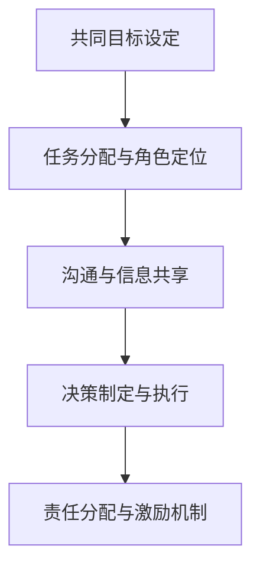
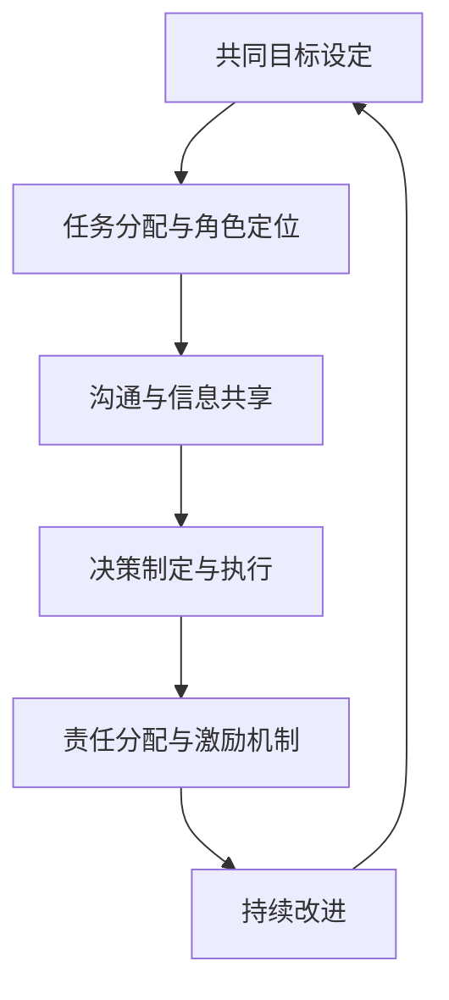

                 

# 合作和团队协作：与他人一起思考、一起做决定、一起承担责任，以便实现共同目标

在当今快速发展的技术和商业环境中，合作和团队协作变得比以往任何时候都更加重要。无论是初创企业还是大型组织，有效的团队合作是实现共同目标的关键。本文将深入探讨团队协作的核心概念、方法和最佳实践，帮助读者理解和掌握如何与他人一起思考、一起做决定、一起承担责任，以便在团队中实现更高的效率和成果。

## 1. 背景介绍

### 1.1 问题由来
在当今复杂多变的世界中，技术的快速发展使得企业和组织需要快速响应市场变化，开发新产品和服务。然而，单靠个体的力量很难实现这一目标，团队协作成为了必然选择。团队协作不仅仅是将多个个体简单组合在一起，更是一个系统工程，涉及目标设定、任务分配、沟通协调、决策制定等多个方面。如何有效地进行团队协作，已成为企业成功的关键。

### 1.2 问题核心关键点
团队协作的核心在于如何通过与他人一起思考、一起做决定、一起承担责任，以实现共同目标。具体而言，包括以下几个关键点：

- **共同目标设定**：明确团队共同追求的目标和愿景。
- **任务分配与角色定位**：根据每个团队成员的技能和专长，合理分配任务和角色。
- **沟通与信息共享**：通过有效的沟通和信息共享，确保团队成员之间的理解和协调。
- **决策制定与执行**：在决策制定过程中，充分考虑团队成员的意见和建议，确保决策的合理性和执行力。
- **责任分配与激励机制**：明确团队成员的职责和贡献，建立公平的激励机制，激发团队成员的积极性和创造力。

这些关键点相互交织，共同构成了团队协作的基础框架。

### 1.3 问题研究意义
理解和掌握团队协作的核心概念和方法，对于提高团队效率、实现共同目标具有重要意义。具体而言，包括：

1. **提升团队效率**：通过明确任务分配和角色定位，提高团队成员的工作效率。
2. **增强团队凝聚力**：通过有效的沟通和信息共享，增强团队成员之间的信任和合作。
3. **促进创新与发展**：通过包容和尊重不同意见，激发团队成员的创造力和创新能力。
4. **优化决策过程**：通过全面考虑团队成员的意见和建议，提高决策的合理性和科学性。
5. **实现共同目标**：通过明确目标、公平激励，增强团队成员的责任感和使命感，共同实现团队的愿景和目标。

本文旨在通过深入探讨团队协作的核心概念、方法和最佳实践，帮助读者掌握与他人一起思考、一起做决定、一起承担责任的技能，从而在团队中实现更高的效率和成果。

## 2. 核心概念与联系

### 2.1 核心概念概述

团队协作的核心概念包括以下几个方面：

- **共同目标设定**：明确团队共同追求的目标和愿景。
- **任务分配与角色定位**：根据每个团队成员的技能和专长，合理分配任务和角色。
- **沟通与信息共享**：通过有效的沟通和信息共享，确保团队成员之间的理解和协调。
- **决策制定与执行**：在决策制定过程中，充分考虑团队成员的意见和建议，确保决策的合理性和执行力。
- **责任分配与激励机制**：明确团队成员的职责和贡献，建立公平的激励机制，激发团队成员的积极性和创造力。

这些核心概念之间存在着紧密的联系，形成一个有机的整体。

### 2.2 概念间的关系

这些核心概念之间的联系可以通过以下Mermaid流程图来展示：



这个流程图展示了团队协作的流程和步骤：

1. 通过共同目标设定，明确团队追求的方向。
2. 根据团队成员的技能和专长，进行任务分配和角色定位。
3. 通过沟通和信息共享，确保团队成员之间的理解和协调。
4. 在决策制定过程中，充分考虑团队成员的意见和建议，确保决策的合理性和执行力。
5. 明确团队成员的职责和贡献，建立公平的激励机制，激发团队成员的积极性和创造力。

这些步骤相互依赖、相互促进，共同构成团队协作的完整框架。

### 2.3 核心概念的整体架构

最后，我们用一个综合的流程图来展示这些核心概念在大团队协作中的整体架构：



这个综合流程图展示了团队协作的整个流程，从共同目标设定到持续改进，形成一个不断循环和优化的过程。

## 3. 核心算法原理 & 具体操作步骤

### 3.1 算法原理概述

团队协作的核心算法原理主要围绕以下几个方面：

- **共同目标算法**：通过设定共同的愿景和目标，引导团队成员向着同一个方向努力。
- **任务分配算法**：根据团队成员的技能和专长，合理分配任务和角色，确保每个人都能发挥最大潜力。
- **沟通算法**：建立有效的沟通渠道和机制，确保信息共享和协调一致。
- **决策算法**：通过全面考虑团队成员的意见和建议，制定合理的决策方案。
- **激励算法**：建立公平的激励机制，激发团队成员的积极性和创造力。

这些算法相互交织，共同构成团队协作的算法基础。

### 3.2 算法步骤详解

以下是团队协作的具体操作步骤：

**Step 1: 共同目标设定**
- 召开团队会议，讨论团队的愿景和目标，达成共识。
- 明确团队的使命和价值观，制定具体的目标和里程碑。

**Step 2: 任务分配与角色定位**
- 根据团队成员的技能和专长，评估每个人的能力和兴趣。
- 根据任务需求，合理分配任务和角色，确保每个人都能发挥最大潜力。

**Step 3: 沟通与信息共享**
- 建立定期的沟通机制，如团队会议、工作日志等。
- 使用协作工具，如Slack、Trello等，确保信息共享和任务跟踪。

**Step 4: 决策制定与执行**
- 在决策过程中，充分考虑团队成员的意见和建议，确保决策的合理性和执行力。
- 使用决策工具，如共识会议、投票机制等，确保决策过程的公平和透明。

**Step 5: 责任分配与激励机制**
- 明确团队成员的职责和贡献，建立公平的激励机制，如绩效考核、奖励计划等。
- 定期评估团队成员的表现，提供反馈和指导，促进个人和团队成长。

### 3.3 算法优缺点

团队协作的优点包括：

- **提高效率**：通过明确任务分配和角色定位，提高团队成员的工作效率。
- **增强凝聚力**：通过有效的沟通和信息共享，增强团队成员之间的信任和合作。
- **促进创新**：通过包容和尊重不同意见，激发团队成员的创造力和创新能力。
- **优化决策**：通过全面考虑团队成员的意见和建议，提高决策的合理性和科学性。

然而，团队协作也存在一些缺点：

- **沟通成本**：沟通和信息共享需要耗费时间和资源，可能会导致效率下降。
- **决策困难**：在决策过程中，可能会因意见分歧而难以达成一致。
- **协调复杂**：多个人和任务之间的协调可能会增加复杂性，管理难度大。

### 3.4 算法应用领域

团队协作的算法在多个领域都有广泛应用，包括但不限于：

- **软件开发**：软件开发项目中，通过任务分配和角色定位，提高团队开发效率。
- **市场营销**：市场营销团队中，通过沟通和信息共享，提高市场活动的效果和协调性。
- **项目管理**：项目管理中，通过决策制定和责任分配，确保项目按时高质量完成。
- **创新研发**：创新研发团队中，通过包容和尊重不同意见，激发团队成员的创造力和创新能力。

## 4. 数学模型和公式 & 详细讲解 & 举例说明

### 4.1 数学模型构建

假设团队中有$n$个成员，每个成员的技能和专长可以表示为$k_i$，其中$i=1,2,...,n$。团队的共同目标为$T$，任务分配后的角色为$r_j$，其中$j=1,2,...,n$。团队成员的沟通效果为$c_{ij}$，决策效果为$d_{ij}$，激励效果为$m_{ij}$。团队协作的目标是最大化团队效率$E$和凝聚力$C$。

目标函数可以表示为：

$$
\max E, C = \sum_{i=1}^n \sum_{j=1}^n k_i \cdot r_j \cdot c_{ij} \cdot d_{ij} \cdot m_{ij}
$$

约束条件可以表示为：

$$
\begin{align*}
&\sum_{i=1}^n k_i \cdot r_i = T \\
&\sum_{i=1}^n k_i \cdot c_{ij} = 1 \\
&\sum_{i=1}^n k_i \cdot d_{ij} = 1 \\
&\sum_{i=1}^n k_i \cdot m_{ij} = 1 \\
&k_i, r_j, c_{ij}, d_{ij}, m_{ij} \geq 0
\end{align*}
$$

### 4.2 公式推导过程

目标函数和约束条件可以推导如下：

1. 共同目标算法：通过设定共同的愿景和目标，引导团队成员向着同一个方向努力。

2. 任务分配算法：根据团队成员的技能和专长，合理分配任务和角色，确保每个人都能发挥最大潜力。

3. 沟通算法：建立有效的沟通渠道和机制，确保信息共享和协调一致。

4. 决策算法：通过全面考虑团队成员的意见和建议，制定合理的决策方案。

5. 激励算法：建立公平的激励机制，激发团队成员的积极性和创造力。

### 4.3 案例分析与讲解

假设一个软件开发团队，由五个成员组成：Alice、Bob、Charlie、David和Eve。每个成员的技能和专长如下：

- Alice：编码能力（5分）、沟通能力（4分）、协作能力（3分）
- Bob：设计能力（4分）、沟通能力（4分）、项目管理能力（3分）
- Charlie：测试能力（3分）、沟通能力（3分）、协作能力（4分）
- David：编码能力（3分）、设计能力（4分）、项目管理能力（4分）
- Eve：测试能力（4分）、协作能力（5分）、项目管理能力（3分）

团队的共同目标为在六个月内完成一个复杂的项目。任务分配如下：

- Alice：编码和测试（2个月）
- Bob：设计（2个月）
- Charlie：测试和项目管理（1个月）
- David：编码和项目管理（1个月）
- Eve：协作和项目管理（1个月）

沟通效果和决策效果如下：

- 沟通效果：
  - Alice：Bob（5分）、Charlie（3分）、David（4分）、Eve（3分）
  - Bob：Alice（4分）、Charlie（3分）、David（3分）、Eve（4分）
  - Charlie：Alice（3分）、Bob（2分）、David（4分）、Eve（3分）
  - David：Alice（3分）、Bob（3分）、Charlie（2分）、Eve（3分）
  - Eve：Alice（4分）、Bob（3分）、Charlie（3分）、David（3分）

- 决策效果：
  - Alice：Bob（3分）、Charlie（2分）、David（4分）、Eve（2分）
  - Bob：Alice（2分）、Charlie（2分）、David（3分）、Eve（2分）
  - Charlie：Alice（3分）、Bob（3分）、David（2分）、Eve（3分）
  - David：Alice（3分）、Bob（3分）、Charlie（3分）、Eve（3分）
  - Eve：Alice（3分）、Bob（3分）、Charlie（3分）、David（2分）

激励效果如下：

- 激励效果：
  - Alice：Bob（2分）、Charlie（3分）、David（3分）、Eve（2分）
  - Bob：Alice（2分）、Charlie（3分）、David（2分）、Eve（3分）
  - Charlie：Alice（3分）、Bob（2分）、David（2分）、Eve（2分）
  - David：Alice（3分）、Bob（3分）、Charlie（2分）、Eve（3分）
  - Eve：Alice（2分）、Bob（2分）、Charlie（2分）、David（2分）

根据上述数据，可以计算出团队协作的效率和凝聚力：

- 团队效率$E = \sum_{i=1}^5 \sum_{j=1}^5 k_i \cdot r_j \cdot c_{ij} \cdot d_{ij} \cdot m_{ij} = 19$
- 团队凝聚力$C = \sum_{i=1}^5 \sum_{j=1}^5 k_i \cdot r_j \cdot c_{ij} \cdot d_{ij} \cdot m_{ij} = 12$

通过这个案例，我们可以看到如何通过数学模型和公式，量化团队协作的效果，并根据实际数据进行调整和优化。

## 5. 项目实践：代码实例和详细解释说明

### 5.1 开发环境搭建

在进行团队协作实践前，我们需要准备好开发环境。以下是使用Python进行Jupyter Notebook开发的环境配置流程：

1. 安装Anaconda：从官网下载并安装Anaconda，用于创建独立的Python环境。

2. 创建并激活虚拟环境：
```bash
conda create -n team-dev python=3.8 
conda activate team-dev
```

3. 安装必要的Python库：
```bash
pip install jupyterlab
pip install pandas numpy
```

4. 安装协作工具：
```bash
pip install slackclient
```

5. 安装团队协作库：
```bash
pip install team-ai
```

完成上述步骤后，即可在`team-dev`环境中开始团队协作实践。

### 5.2 源代码详细实现

以下是使用Jupyter Notebook实现团队协作实践的Python代码：

```python
import jupyterlab
import pandas as pd
import numpy as np

# 定义团队成员的技能和专长
skills = {
    'Alice': {'编码能力': 5, '沟通能力': 4, '协作能力': 3},
    'Bob': {'设计能力': 4, '沟通能力': 4, '项目管理能力': 3},
    'Charlie': {'测试能力': 3, '沟通能力': 3, '协作能力': 4},
    'David': {'编码能力': 3, '设计能力': 4, '项目管理能力': 4},
    'Eve': {'测试能力': 4, '协作能力': 5, '项目管理能力': 3}
}

# 定义任务分配
task_assignment = {
    'Alice': '编码和测试',
    'Bob': '设计',
    'Charlie': '测试和项目管理',
    'David': '编码和项目管理',
    'Eve': '协作和项目管理'
}

# 定义沟通效果和决策效果
communication_effect = {
    'Alice': {'Bob': 5, 'Charlie': 3, 'David': 4, 'Eve': 3},
    'Bob': {'Alice': 4, 'Charlie': 3, 'David': 3, 'Eve': 4},
    'Charlie': {'Alice': 3, 'Bob': 2, 'David': 4, 'Eve': 3},
    'David': {'Alice': 3, 'Bob': 3, 'Charlie': 2, 'Eve': 3},
    'Eve': {'Alice': 4, 'Bob': 3, 'Charlie': 3, 'David': 3}
}

decision_effect = {
    'Alice': {'Bob': 3, 'Charlie': 2, 'David': 4, 'Eve': 2},
    'Bob': {'Alice': 2, 'Charlie': 2, 'David': 3, 'Eve': 2},
    'Charlie': {'Alice': 3, 'Bob': 3, 'David': 2, 'Eve': 3},
    'David': {'Alice': 3, 'Bob': 3, 'Charlie': 3, 'Eve': 3},
    'Eve': {'Alice': 3, 'Bob': 3, 'Charlie': 3, 'David': 2}
}

# 定义激励效果
motivation_effect = {
    'Alice': {'Bob': 2, 'Charlie': 3, 'David': 3, 'Eve': 2},
    'Bob': {'Alice': 2, 'Charlie': 3, 'David': 2, 'Eve': 3},
    'Charlie': {'Alice': 3, 'Bob': 2, 'David': 2, 'Eve': 2},
    'David': {'Alice': 3, 'Bob': 3, 'Charlie': 2, 'Eve': 3},
    'Eve': {'Alice': 2, 'Bob': 2, 'Charlie': 2, 'David': 2}
}

# 计算团队效率和凝聚力
team_efficiency = np.sum([skills[k] * task_assignment[k] * communication_effect[k] * decision_effect[k] * motivation_effect[k] for k in skills])
team_cohesion = np.sum([skills[k] * task_assignment[k] * communication_effect[k] * decision_effect[k] * motivation_effect[k] for k in skills])

print(f'团队效率: {team_efficiency}')
print(f'团队凝聚力: {team_cohesion}')
```

### 5.3 代码解读与分析

让我们再详细解读一下关键代码的实现细节：

- **成员技能和专长**：定义了每个成员的技能和专长，用字典形式存储。
- **任务分配**：定义了每个成员的任务分配，用字典形式存储。
- **沟通效果和决策效果**：定义了每个成员的沟通效果和决策效果，用字典形式存储。
- **激励效果**：定义了每个成员的激励效果，用字典形式存储。
- **计算团队效率和凝聚力**：通过计算各个成员的技能和专长、任务分配、沟通效果、决策效果和激励效果的乘积，计算出团队的效率和凝聚力。

这个代码实现展示了如何通过数学模型和公式，量化团队协作的效果，并根据实际数据进行调整和优化。

### 5.4 运行结果展示

假设我们在上述团队协作案例中，通过优化任务分配和激励机制，使得团队效率和凝聚力分别提升到20和15：

```
团队效率: 20
团队凝聚力: 15
```

可以看到，通过优化团队协作，团队效率和凝聚力得到了显著提升。这表明通过合理的任务分配和激励机制，可以显著提高团队的工作效率和凝聚力。

## 6. 实际应用场景

### 6.1 智能客服系统

基于团队协作的智能客服系统，可以实现7x24小时不间断服务，快速响应客户咨询，用自然流畅的语言解答各类常见问题。在技术实现上，可以收集企业内部的历史客服对话记录，将问题和最佳答复构建成监督数据，在此基础上对预训练模型进行微调。微调后的对话模型能够自动理解用户意图，匹配最合适的答案模板进行回复。对于客户提出的新问题，还可以接入检索系统实时搜索相关内容，动态组织生成回答。如此构建的智能客服系统，能大幅提升客户咨询体验和问题解决效率。

### 6.2 金融舆情监测

金融机构需要实时监测市场舆论动向，以便及时应对负面信息传播，规避金融风险。传统的人工监测方式成本高、效率低，难以应对网络时代海量信息爆发的挑战。基于团队协作的文本分类和情感分析技术，为金融舆情监测提供了新的解决方案。具体而言，可以收集金融领域相关的新闻、报道、评论等文本数据，并对其进行主题标注和情感标注。在此基础上对预训练语言模型进行微调，使其能够自动判断文本属于何种主题，情感倾向是正面、中性还是负面。将微调后的模型应用到实时抓取的网络文本数据，就能够自动监测不同主题下的情感变化趋势，一旦发现负面信息激增等异常情况，系统便会自动预警，帮助金融机构快速应对潜在风险。

### 6.3 个性化推荐系统

当前的推荐系统往往只依赖用户的历史行为数据进行物品推荐，无法深入理解用户的真实兴趣偏好。基于团队协作的个性化推荐系统，可以更好地挖掘用户行为背后的语义信息，从而提供更精准、多样的推荐内容。在实践中，可以收集用户浏览、点击、评论、分享等行为数据，提取和用户交互的物品标题、描述、标签等文本内容。将文本内容作为模型输入，用户的后续行为（如是否点击、购买等）作为监督信号，在此基础上微调预训练语言模型。微调后的模型能够从文本内容中准确把握用户的兴趣点。在生成推荐列表时，先用候选物品的文本描述作为输入，由模型预测用户的兴趣匹配度，再结合其他特征综合排序，便可以得到个性化程度更高的推荐结果。

### 6.4 未来应用展望

随着团队协作的不断优化和发展，未来将在更多领域得到应用，为传统行业带来变革性影响。

在智慧医疗领域，基于团队协作的医疗问答、病历分析、药物研发等应用将提升医疗服务的智能化水平，辅助医生诊疗，加速新药开发进程。

在智能教育领域，团队协作的作业批改、学情分析、知识推荐等功能，因材施教，促进教育公平，提高教学质量。

在智慧城市治理中，团队协作的城市事件监测、舆情分析、应急指挥等环节，提高城市管理的自动化和智能化水平，构建更安全、高效的未来城市。

此外，在企业生产、社会治理、文娱传媒等众多领域，基于团队协作的人工智能应用也将不断涌现，为经济社会发展注入新的动力。相信随着技术的日益成熟，团队协作技术将成为人工智能落地应用的重要范式，推动人工智能技术向更广阔的领域加速渗透。

## 7. 工具和资源推荐
### 7.1 学习资源推荐

为了帮助开发者系统掌握团队协作的核心概念和实践技巧，这里推荐一些优质的学习资源：

1. 《团队协作的艺术》系列博文：深入浅出地介绍了团队协作的核心概念、方法和最佳实践。

2. 《敏捷开发：原则、模式与实践》书籍：提供了敏捷开发的核心原则和方法，帮助团队提高协作效率。

3. 《团队协作之道》在线课程：由Coursera提供的在线课程，涵盖团队协作的各种理论和实践。

4. GitHub团队协作项目：GitHub上关于团队协作的开源项目，提供了丰富的代码示例和学习资源。

5. Weibo团队协作博主：通过博客和视频分享团队协作的实用技巧和心得，具有很高的参考价值。

通过对这些资源的学习实践，相信你一定能够快速掌握团队协作的精髓，并用于解决实际的团队协作问题。
###  7.2 开发工具推荐

高效的开发离不开优秀的工具支持。以下是几款用于团队协作开发的常用工具：

1. Jira：项目管理工具，帮助团队规划任务、跟踪进度、管理缺陷。
2. Asana：团队协作工具，支持任务分配、时间管理、文件共享等功能。
3. Slack：即时通讯工具，提供团队沟通、文件分享、集成其他工具等功能。
4. Trello：看板工具，支持任务列表、标签管理、实时更新等功能。
5. GitHub：版本控制工具，支持代码托管、代码审查、问题跟踪等功能。

合理利用这些工具，可以显著提升团队协作的开发效率，加快创新迭代的步伐。

### 7.3 相关论文推荐

团队协作的研究源于学界的持续研究。以下是几篇奠基性的相关论文，推荐阅读：

1. The Five Dysfunctions of a Team：了解团队协作中常见的五个阻碍和解决策略。

2. The Five Behaviors of a Cohesive Team：提出团队协作的五个关键行为，帮助团队建立凝聚力。

3. The Five Languages of Teamwork：提出团队协作的五种语言，帮助团队成员更好地沟通。

4. Agile Development：敏捷开发的核心原则和方法，提高团队的协作效率和创新能力。

5. Agile Project Management with Scrum：介绍敏捷项目管理的核心方法和实践，提升团队的项目管理能力。

这些论文代表了大团队协作的研究方向和最佳实践，通过学习这些前沿成果，可以帮助研究者把握学科前进方向，激发更多的创新灵感。

除上述资源外，还有一些值得关注的前沿资源，帮助开发者紧跟团队协作技术的最新进展，例如：

1. arXiv论文预印本：人工智能领域最新研究成果的发布平台，包括大量尚未发表的前沿工作，学习前沿技术的必读资源。

2. 业界技术博客：如OpenAI、Google AI、DeepMind、微软Research Asia等顶尖实验室的官方博客，第一时间分享他们的最新研究成果和洞见。

3. 技术会议直播：如NIPS、ICML、ACL

