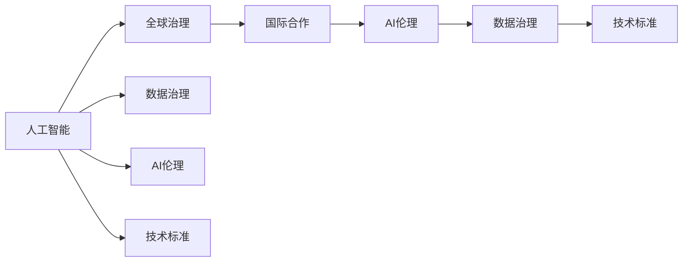

                 

# 国际合作：构建 AI 时代的全球治理体系

## 1. 背景介绍

### 1.1 问题由来

随着人工智能(AI)技术的快速发展，全球AI研究与应用的格局正在发生深刻变化。AI技术不仅在经济、社会、政治等多个领域产生了重大影响，也给国际合作和全球治理带来了新的挑战和机遇。AI技术的双重性——既可以带来巨大的经济效益和社会福祉，也可能引发伦理风险和治理难题，使得国际社会迫切需要构建一个包容、协作、共赢的AI全球治理体系。

国际合作是构建AI全球治理体系的重要组成部分。通过跨国界、跨领域的合作，可以集中资源，共同应对AI技术带来的共同挑战，共享AI发展的红利，推动全球AI技术的健康、公平、可持续发展。

### 1.2 问题核心关键点

当前，国际AI合作面临的核心问题包括：
- **数据共享与隐私保护**：数据是AI训练和应用的基础，如何确保数据的隐私安全，同时促进数据共享，成为全球AI合作的重要挑战。
- **技术标准与规范**：不同国家和地区对AI技术的应用有着不同的标准和规范，如何制定统一的国际标准，促进技术互操作性，是国际合作的关键。
- **伦理与法律框架**：AI技术的使用涉及伦理和法律问题，如算法偏见、透明性、可解释性等，国际社会需要共同建立伦理和法律框架，规范AI技术的使用。
- **资源分配与共享**：AI技术的开发和应用需要大量的计算资源、数据资源和资金支持，国际合作需要合理分配和共享这些资源，促进全球AI技术平衡发展。
- **跨学科与跨领域合作**：AI技术涉及计算机科学、数学、心理学、社会学等多个学科，需要跨学科、跨领域的深度合作，共同推进AI技术的全面发展。

这些关键点构成了国际AI合作的核心，需要通过多方努力，共同构建一个包容、协作、共赢的AI全球治理体系。

## 2. 核心概念与联系

### 2.1 核心概念概述

为更好地理解国际AI合作的内涵，本节将介绍几个关键概念：

- **人工智能**：以数据为基础，通过算法和计算能力实现的模拟人类智能的技术。
- **全球治理**：国际社会通过协商、合作等方式，共同制定和执行国际规则和标准，实现全球问题的治理和协调。
- **国际合作**：不同国家和地区通过交流、合作等方式，共享资源，协同推进AI技术的开发和应用。
- **AI伦理**：涉及AI技术在开发、应用中的伦理问题，如算法透明性、隐私保护、公平性等。
- **数据治理**：数据在收集、存储、处理和共享过程中的治理问题，包括数据隐私、数据安全、数据利用等。
- **技术标准**：为保证AI技术互操作性、一致性，国际社会制定的技术规范和标准。

这些概念共同构成了国际AI合作和全球治理体系的基石，需要通过系统化的设计和实践，推动AI技术的健康、公平、可持续发展。

### 2.2 概念间的关系

这些核心概念之间的关系可以通过以下Mermaid流程图来展示：



这个流程图展示了各个概念之间的关系：
1. 人工智能是国际AI合作和全球治理体系的核心对象。
2. 全球治理体系通过制定国际标准和规范，保障AI技术的健康发展。
3. 国际合作是实现全球治理的重要途径，通过资源共享和技术互操作性，推动AI技术的广泛应用。
4. AI伦理和技术标准是国际合作和全球治理的重要内容，需要共同建立和维护。
5. 数据治理是国际合作和全球治理的基础，涉及数据隐私、安全、共享等关键问题。

这些概念共同构建了一个完整的国际AI合作和全球治理体系，为推进全球AI技术的公平、健康发展提供了坚实的基础。

## 3. 核心算法原理 & 具体操作步骤
### 3.1 算法原理概述

国际AI合作的核心算法原理，在于通过多边合作机制，实现资源共享和技术协同，提升AI技术的整体水平。具体来说，包括以下几个步骤：

1. **数据共享与隐私保护**：通过建立跨国家的开放数据平台，实现数据的共享和流通。同时，采用差分隐私、联邦学习等技术，确保数据隐私和安全性。
2. **技术标准与规范**：制定统一的国际AI技术标准和规范，包括算法透明性、公平性、可靠性等，促进全球AI技术互操作性。
3. **伦理与法律框架**：建立全球AI伦理和法律框架，制定AI技术的开发和使用规范，确保AI技术的公平、透明、可解释。
4. **资源分配与共享**：通过国际合作机制，实现计算资源、数据资源、资金资源的共享，推动全球AI技术的平衡发展。
5. **跨学科与跨领域合作**：鼓励计算机科学、数学、心理学、社会学等学科的深度合作，共同推进AI技术的研究与应用。

### 3.2 算法步骤详解

国际AI合作的算法步骤，可以分为以下几个关键步骤：

**Step 1: 数据共享与隐私保护**

- 建立跨国家的数据共享平台，提供开放接口，实现数据的共享和流通。
- 采用差分隐私技术，对共享数据进行匿名化处理，确保用户隐私。
- 应用联邦学习等技术，确保数据在本地计算，不泄露原始数据。

**Step 2: 技术标准与规范**

- 制定统一的AI技术标准和规范，如算法透明性、公平性、可靠性等。
- 通过国际标准化组织，如ISO、IEEE等，推动全球技术标准的统一。
- 建立技术评估和认证机制，确保AI技术符合国际标准。

**Step 3: 伦理与法律框架**

- 制定全球AI伦理和法律框架，明确AI技术的开发和应用规范。
- 建立伦理委员会和法律审查机制，对AI技术进行伦理和法律审查。
- 推动跨国界的AI伦理教育，提升公众对AI技术的认知和理解。

**Step 4: 资源分配与共享**

- 建立国际合作机制，通过多边合作协议，实现资源共享。
- 设立国际AI基金，提供资金支持，推动全球AI技术的平衡发展。
- 通过国际合作项目，实现计算资源和数据资源的共享。

**Step 5: 跨学科与跨领域合作**

- 建立跨学科的研究平台，促进计算机科学、数学、心理学、社会学等学科的深度合作。
- 推动国际科研合作，联合攻关重大AI难题。
- 举办国际学术会议和研讨会，促进知识交流和共享。

### 3.3 算法优缺点

国际AI合作具有以下优点：
1. **资源共享**：通过国际合作机制，实现资源共享，提高AI技术的研究和应用效率。
2. **技术互操作性**：制定统一的国际技术标准，促进技术互操作性，实现全球AI技术的统一。
3. **伦理和法律保障**：建立全球AI伦理和法律框架，确保AI技术的公平、透明、可解释。
4. **多学科协作**：通过跨学科、跨领域的深度合作，提升AI技术研究的全面性。

同时，国际AI合作也存在一些缺点：
1. **数据隐私和安全问题**：数据共享和流通过程中，如何确保数据隐私和安全，是一个重要挑战。
2. **文化和技术差异**：不同国家和地区的文化和技术的差异，可能影响国际合作的效率和效果。
3. **资源分配不均**：资源分配不均可能导致某些国家或地区在AI技术发展中处于不利地位。
4. **法律和伦理分歧**：不同国家和地区对AI技术的法律和伦理问题存在分歧，需要共同协商解决。

尽管存在这些缺点，但通过多方努力，国际AI合作仍然具有广阔的发展前景，为全球AI技术的健康、公平、可持续发展提供了坚实的基础。

### 3.4 算法应用领域

国际AI合作的应用领域非常广泛，包括但不限于以下几个方面：

- **智慧城市**：通过国际合作，共享智慧城市建设的技术和数据，提升全球城市的智能化水平。
- **医疗健康**：通过国际合作，共享医疗数据和研究成果，推动全球医疗健康事业的发展。
- **环境保护**：通过国际合作，共享环境监测数据，提升全球环境保护能力。
- **教育培训**：通过国际合作，共享教育资源和研究成果，推动全球教育事业的发展。
- **安全应急**：通过国际合作，共享安全应急数据和研究成果，提升全球应急响应能力。
- **金融科技**：通过国际合作，共享金融数据和研究成果，推动全球金融科技的发展。

以上这些领域，都是国际AI合作的重要应用方向，能够通过多方协作，实现资源的优化配置和技术的共同进步。

## 4. 数学模型和公式 & 详细讲解 & 举例说明（备注：数学公式请使用latex格式，latex嵌入文中独立段落使用 $$，段落内使用 $)
### 4.1 数学模型构建

国际AI合作的数学模型，主要围绕数据共享、技术标准、伦理框架、资源分配和跨学科合作等方面构建。

- **数据共享模型**：涉及数据的收集、存储、处理和共享，可以表示为：

$$
\begin{aligned}
& \text{数据共享模型} = \{\text{数据收集机制}, \text{数据存储方式}, \text{数据处理流程}, \text{数据共享协议}\} \\
& \text{其中，数据收集机制} = \text{数据源选择}, \text{数据收集方式}, \text{数据标注} \\
& \text{数据存储方式} = \text{数据格式}, \text{数据存储位置}, \text{数据访问控制} \\
& \text{数据处理流程} = \text{数据清洗}, \text{数据预处理}, \text{数据融合} \\
& \text{数据共享协议} = \text{数据访问协议}, \text{数据使用协议}, \text{数据隐私协议}
\end{aligned}
$$

- **技术标准模型**：涉及AI技术的统一规范，可以表示为：

$$
\begin{aligned}
& \text{技术标准模型} = \{\text{技术规范}, \text{技术评估标准}, \text{技术认证机制}\} \\
& \text{其中，技术规范} = \text{算法透明性}, \text{公平性}, \text{可靠性} \\
& \text{技术评估标准} = \text{算法准确性}, \text{算法公正性}, \text{算法可解释性} \\
& \text{技术认证机制} = \text{技术评审委员会}, \text{技术认证流程}, \text{技术认证标准}
\end{aligned}
$$

- **伦理与法律框架模型**：涉及AI技术的伦理和法律规范，可以表示为：

$$
\begin{aligned}
& \text{伦理与法律框架模型} = \{\text{伦理规范}, \text{法律规范}, \text{法律执行机制}\} \\
& \text{其中，伦理规范} = \text{算法透明性}, \text{算法公平性}, \text{算法可解释性} \\
& \text{法律规范} = \text{数据隐私保护}, \text{数据安全保护}, \text{算法责任界定} \\
& \text{法律执行机制} = \text{法律审查机制}, \text{法律执行机构}, \text{法律责任追究}
\end{aligned}
$$

- **资源分配与共享模型**：涉及AI技术的资源配置和共享，可以表示为：

$$
\begin{aligned}
& \text{资源分配与共享模型} = \{\text{资源配置机制}, \text{资源共享协议}\} \\
& \text{其中，资源配置机制} = \text{资源评估}, \text{资源分配}, \text{资源调拨} \\
& \text{资源共享协议} = \text{资源共享方式}, \text{资源共享协议}, \text{资源共享监控}
\end{aligned}
$$

- **跨学科合作模型**：涉及跨学科的研究平台和合作机制，可以表示为：

$$
\begin{aligned}
& \text{跨学科合作模型} = \{\text{跨学科合作平台}, \text{跨学科合作机制}\} \\
& \text{其中，跨学科合作平台} = \text{跨学科研究设施}, \text{跨学科研究数据}, \text{跨学科研究工具} \\
& \text{跨学科合作机制} = \text{跨学科研究团队}, \text{跨学科研究项目}, \text{跨学科研究交流}
\end{aligned}
$$

### 4.2 公式推导过程

这里，我们以数据共享模型和技术标准模型为例，推导两个关键公式。

**数据共享模型的公式推导**：

假设有一个国际数据共享平台，涉及多个国家和地区的参与。每个参与国家的数据收集机制、存储方式、处理流程和共享协议分别为 $D_i$，$i=1,2,...,N$。数据共享平台的目标是最大化数据的共享价值，同时最小化数据隐私风险。

$$
\begin{aligned}
& \max \sum_{i=1}^N \text{data\_sharing\_value}(D_i) \\
& \min \sum_{i=1}^N \text{data\_privacy\_risk}(D_i)
\end{aligned}
$$

其中，$\text{data\_sharing\_value}(D_i)$ 表示参与国家 $i$ 的数据共享价值，$\text{data\_privacy\_risk}(D_i)$ 表示参与国家 $i$ 的数据隐私风险。

**技术标准模型的公式推导**：

假设有一个国际技术标准制定组织，涉及多个国家和地区的参与。每个参与国家的技术规范、评估标准和认证机制分别为 $T_i$，$i=1,2,...,N$。技术标准制定组织的目标是最大化全球技术标准的统一程度，同时最小化技术标准的执行成本。

$$
\begin{aligned}
& \max \sum_{i=1}^N \text{global\_standard\_compliance}(T_i) \\
& \min \sum_{i=1}^N \text{standard\_execution\_cost}(T_i)
\end{aligned}
$$

其中，$\text{global\_standard\_compliance}(T_i)$ 表示参与国家 $i$ 的技术标准执行程度，$\text{standard\_execution\_cost}(T_i)$ 表示参与国家 $i$ 的技术标准执行成本。

### 4.3 案例分析与讲解

**案例一：国际数据共享平台**

以国际疾病监测数据为例，世界卫生组织(WHO)通过建立开放数据平台，共享各国疾病监测数据，推动全球疾病预防和控制。

1. **数据收集机制**：各国医疗机构提交患者病历数据，WHO设立统一的疾病监测标准，确保数据格式统一。
2. **数据存储方式**：WHO采用分布式存储技术，将数据存储在多个节点上，确保数据安全。
3. **数据处理流程**：WHO采用差分隐私技术，对共享数据进行匿名化处理，保护患者隐私。
4. **数据共享协议**：WHO制定严格的数据共享协议，确保数据仅用于公共卫生研究，并设立数据访问控制机制。

通过国际数据共享平台，WHO成功实现了全球疾病监测数据的共享，提升了全球疾病预防和控制能力。

**案例二：国际技术标准制定**

以人工智能伦理标准为例，国际标准化组织(ISO)通过制定统一的AI伦理标准，推动全球AI技术的公平、透明、可解释。

1. **技术规范**：ISO制定统一的AI算法透明性、公平性和可解释性规范，确保AI技术的通用性。
2. **技术评估标准**：ISO设立技术评估委员会，对AI技术进行独立评估，确保技术合规性。
3. **技术认证机制**：ISO建立技术认证流程，对符合规范的AI技术进行认证，确保技术一致性。

通过国际技术标准制定，ISO成功实现了全球AI技术的统一，提升了全球AI技术的公平性和透明度。

## 5. 项目实践：代码实例和详细解释说明
### 5.1 开发环境搭建

在进行国际AI合作项目的开发时，需要搭建一个包含数据共享、技术标准、伦理框架、资源分配和跨学科合作等模块的开发环境。以下是一个基本的开发环境搭建步骤：

1. 安装Python开发环境：建议使用Anaconda或Miniconda，安装并配置好Python环境。
2. 安装相关依赖包：如numpy、pandas、scikit-learn、pytorch、transformers等。
3. 搭建数据共享平台：使用Django或Flask搭建一个开放数据平台，实现数据的收集、存储和共享。
4. 搭建技术标准平台：使用Django或Flask搭建一个技术标准制定平台，实现技术规范、评估和认证。
5. 搭建伦理框架平台：使用Django或Flask搭建一个伦理框架平台，实现伦理规范和法律审查。
6. 搭建资源分配平台：使用Django或Flask搭建一个资源分配平台，实现资源的评估、分配和共享。
7. 搭建跨学科合作平台：使用Jupyter Notebook或Google Colab搭建一个跨学科合作平台，实现跨学科研究和交流。

完成上述步骤后，即可启动国际AI合作项目的开发工作。

### 5.2 源代码详细实现

以下是一个简化的国际AI合作数据共享平台的代码实现，用于演示数据收集、存储和共享的流程：

```python
from flask import Flask, request, jsonify
from flask_sqlalchemy import SQLAlchemy
from sqlalchemy.orm import sessionmaker

app = Flask(__name__)

# 配置数据库
app.config['SQLALCHEMY_DATABASE_URI'] = 'sqlite:///data.db'
app.config['SQLALCHEMY_TRACK_MODIFICATIONS'] = False

# 初始化数据库
db = SQLAlchemy(app)
Session = sessionmaker(bind=app.db)

# 数据模型
class Data(db.Model):
    id = db.Column(db.Integer, primary_key=True)
    name = db.Column(db.String(100), nullable=False)
    data = db.Column(db.Text, nullable=False)
    access_level = db.Column(db.String(100), nullable=False)

# 数据收集和存储
@app.route('/data', methods=['POST'])
def collect_data():
    data = request.json
    new_data = Data(name=data['name'], data=data['data'], access_level=data['access_level'])
    db.session.add(new_data)
    db.session.commit()
    return jsonify({'status': 'success', 'message': 'Data collected successfully'})

# 数据共享和访问
@app.route('/data', methods=['GET'])
def get_data():
    data = request.args.get('name')
    session = Session()
    result = session.query(Data).filter_by(name=data).first()
    if result is None:
        return jsonify({'status': 'error', 'message': 'Data not found'})
    return jsonify({'data': result.data})

if __name__ == '__main__':
    app.run(debug=True)
```

### 5.3 代码解读与分析

上述代码实现了一个简单的Flask应用，用于数据收集、存储和共享。代码的主要功能包括：

- 数据模型定义：定义了一个Data模型，包含数据名称、数据内容和访问权限。
- 数据收集接口：接收POST请求，收集数据并保存到数据库。
- 数据共享接口：接收GET请求，根据数据名称获取数据。

该代码实现展示了数据共享平台的基本功能，可以在实际应用中进行扩展和优化。例如，可以引入差分隐私技术，确保数据隐私安全；可以引入访问控制机制，确保数据仅供授权人员访问。

## 6. 实际应用场景
### 6.1 智慧城市

智慧城市建设需要大量的数据共享和跨学科合作。通过国际合作，共享智慧城市建设的技术和数据，可以实现智慧城市的全球化部署和优化。

具体来说，智慧城市建设涉及传感器数据、交通流量数据、环境监测数据等多个领域的数据共享和处理。通过国际合作机制，可以共享这些数据，提升智慧城市建设的效率和效果。例如，通过国际合作，共享交通流量数据，可以实现全球范围内的交通优化和调度，提升交通系统的效率和稳定性。

### 6.2 医疗健康

医疗健康领域需要大量的数据共享和跨学科合作。通过国际合作，共享医疗数据和研究成果，可以实现全球医疗健康事业的发展。

具体来说，医疗健康领域涉及患者病历数据、医学影像数据、基因数据等多个领域的数据共享和处理。通过国际合作机制，可以共享这些数据，提升医疗健康事业的效率和效果。例如，通过国际合作，共享患者病历数据，可以实现全球范围内的疾病预防和控制，提升全球医疗健康水平。

### 6.3 环境保护

环境保护需要大量的数据共享和跨学科合作。通过国际合作，共享环境监测数据，可以实现全球环境保护能力的提升。

具体来说，环境保护领域涉及空气质量数据、水质数据、污染源数据等多个领域的数据共享和处理。通过国际合作机制，可以共享这些数据，提升环境保护的能力和效果。例如，通过国际合作，共享空气质量数据，可以实现全球范围内的空气质量监测和预警，提升全球环境保护水平。

### 6.4 未来应用展望

未来，随着国际AI合作机制的不断完善，AI技术将在更多领域得到应用，为全球社会的可持续发展提供有力支持。

在智慧城市、医疗健康、环境保护等领域，AI技术将进一步提升全球社会的智能化水平、医疗健康水平和环境保护能力。在金融科技、教育培训、安全应急等领域，AI技术将推动全球金融科技的发展、教育事业的进步和应急响应能力的提升。

## 7. 工具和资源推荐
### 7.1 学习资源推荐

为了帮助开发者系统掌握国际AI合作的理论基础和实践技巧，这里推荐一些优质的学习资源：

1. 《国际合作与AI技术》系列博文：由国际AI合作专家撰写，深入浅出地介绍了国际AI合作的背景、框架和实践技巧。
2. AI全球治理课程：由联合国、IEEE等机构开设的AI全球治理课程，涵盖全球治理、国际合作、AI伦理等关键话题。
3. 《国际合作与AI技术》书籍：关于国际AI合作的全面介绍，涵盖数据共享、技术标准、伦理框架、资源分配和跨学科合作等多个方面。
4. 国际标准化组织（ISO）官方文档：ISO制定的AI技术标准和规范，提供详细的标准描述和技术指南。
5. 国际人工智能合作联盟（IAOA）官方网站：IAOA提供全球AI合作的最新动态和资源，包括国际合作项目、研究报告、技术评估等。

通过对这些资源的学习实践，相信你一定能够快速掌握国际AI合作的精髓，并用于解决实际的全球治理问题。

### 7.2 开发工具推荐

高效的开发离不开优秀的工具支持。以下是几款用于国际AI合作开发的常用工具：

1. Flask：轻量级的Web框架，易于搭建数据共享平台和技术标准平台。
2. Django：全功能的Web框架，适合搭建伦理框架平台和跨学科合作平台。
3. SQLAlchemy：数据库操作框架，用于数据库的设计、连接和操作。
4. Jupyter Notebook：交互式的开发环境，适合跨学科合作平台的研究和交流。
5. Google Colab：云端的Jupyter Notebook环境，免费提供GPU/TPU算力，方便快速实验。

合理利用这些工具，可以显著提升国际AI合作的开发效率，加快创新迭代的步伐。

### 7.3 相关论文推荐

国际AI合作的最新进展源于学界的持续研究。以下是几篇奠基性的相关论文，推荐阅读：

1. International Cooperation in AI Research and Development：提出国际AI合作的框架，讨论数据共享、技术标准、伦理框架、资源分配等多个关键问题。
2. Multi-disciplinary Collaboration in AI Research：讨论跨学科合作在AI研究中的应用，提出跨学科研究平台和合作机制。
3. Global Governance of AI Technologies：讨论AI技术的全球治理问题，提出全球治理框架和国际合作机制。
4. Data Sharing and Privacy in International AI Cooperation：讨论国际数据共享中的隐私保护问题，提出差分隐私技术和联邦学习等解决方案。
5. International Standards for AI Technologies：讨论国际AI技术标准的制定，提出统一的技术规范和评估标准。

这些论文代表了大规模AI合作的研究进展，为国际AI合作的实践提供了理论基础和实践指导。

除上述资源外，还有一些值得关注的前沿资源，帮助开发者紧跟国际AI合作的研究方向，例如：

1. arXiv论文预印本：人工智能领域最新研究成果的发布平台，包括国际AI合作的最新进展。
2. IEEE、ISO等权威机构的最新报告和指南，提供详细的技术标准和规范。
3. 人工智能领域的顶级会议，如NeurIPS、ICML、ACL等，提供最新的学术动态和研究进展。

## 8. 总结：未来发展趋势与挑战
### 8.1 研究成果总结

本文对国际AI合作的理论基础和实践技巧进行了系统介绍。首先，明确了国际AI合作的必要性和重要性，探讨了其在全球治理和可持续发展中的作用。其次，介绍了国际AI合作的核心概念和关键步骤，提供了数据共享、技术标准、伦理框架、资源分配和跨学科合作等多个方面的详细讲解。最后，通过代码实例和实际应用场景，展示了国际AI合作的实践方法和应用前景。

通过本文的系统梳理，可以看到，国际AI合作是推动全球AI技术健康、公平、可持续发展的关键路径。多方合作机制的建立，可以集中资源，实现全球AI技术的协同创新和应用推广。

### 8.2 未来发展趋势

未来，国际AI合作将在以下几个方面继续发展：

1. **数据共享机制的完善**：通过差分隐私、联邦学习等技术，进一步保障数据隐私和安全。同时，引入区块链技术，确保数据共享的透明性和可信度。
2. **技术标准的统一**：通过国际标准化组织，制定统一的技术标准和规范，提升全球AI技术的互操作性和一致性。
3. **伦理框架的建立**：通过国际伦理委员会，制定统一的AI伦理规范，确保AI技术的公平、透明、可解释。
4. **资源分配的优化**：通过国际合作机制，实现计算资源、数据资源、资金资源的优化配置和共享。
5. **跨学科合作的深化**：通过国际科研合作平台，促进跨学科研究，推动AI技术的全面发展。

### 8

