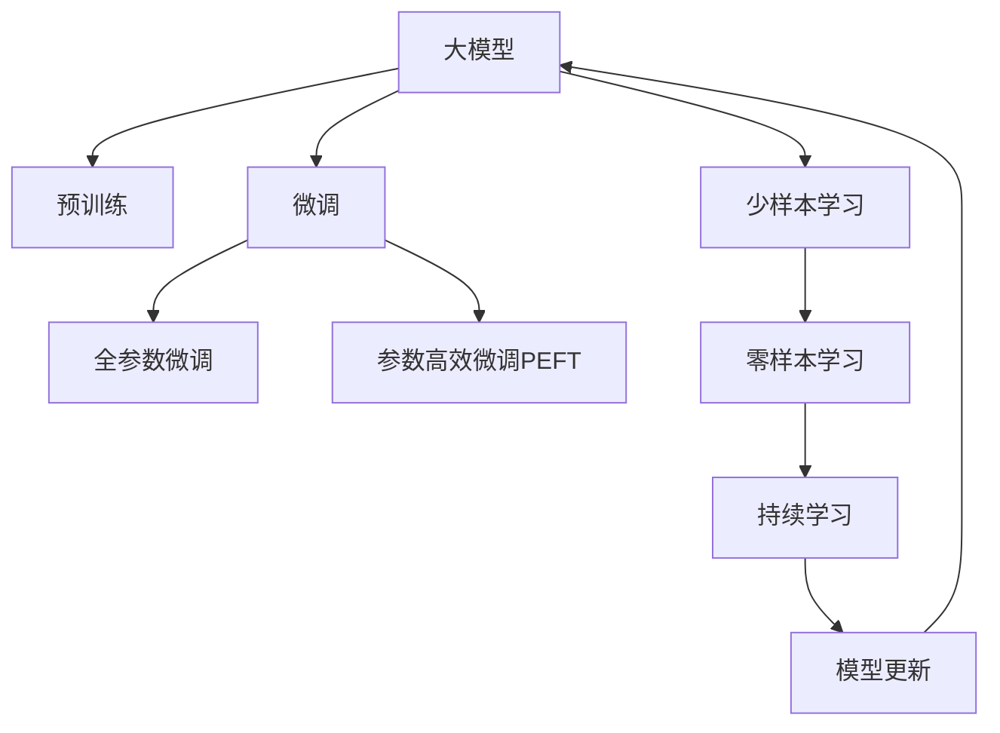
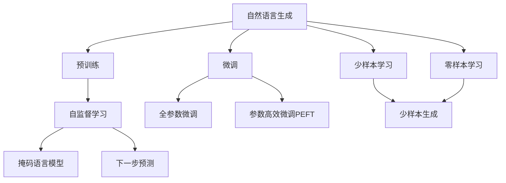
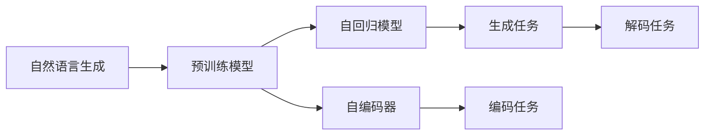
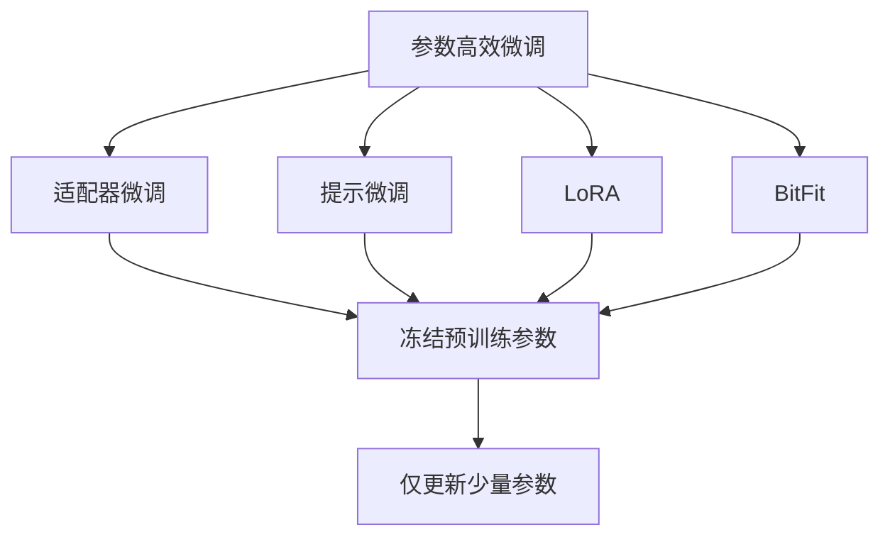
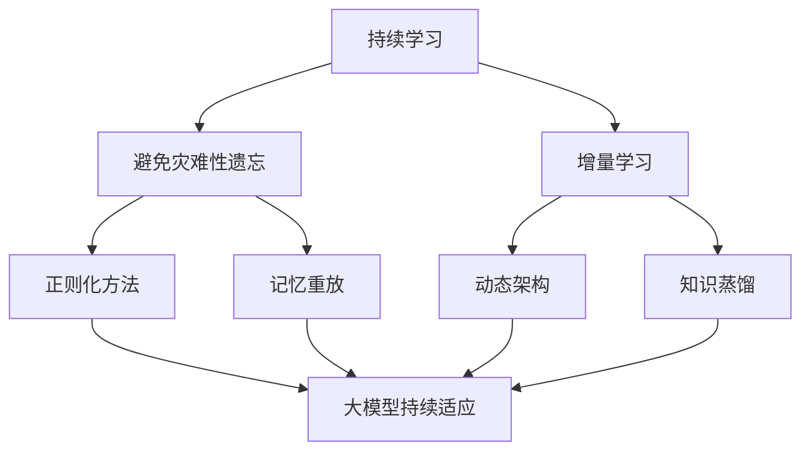
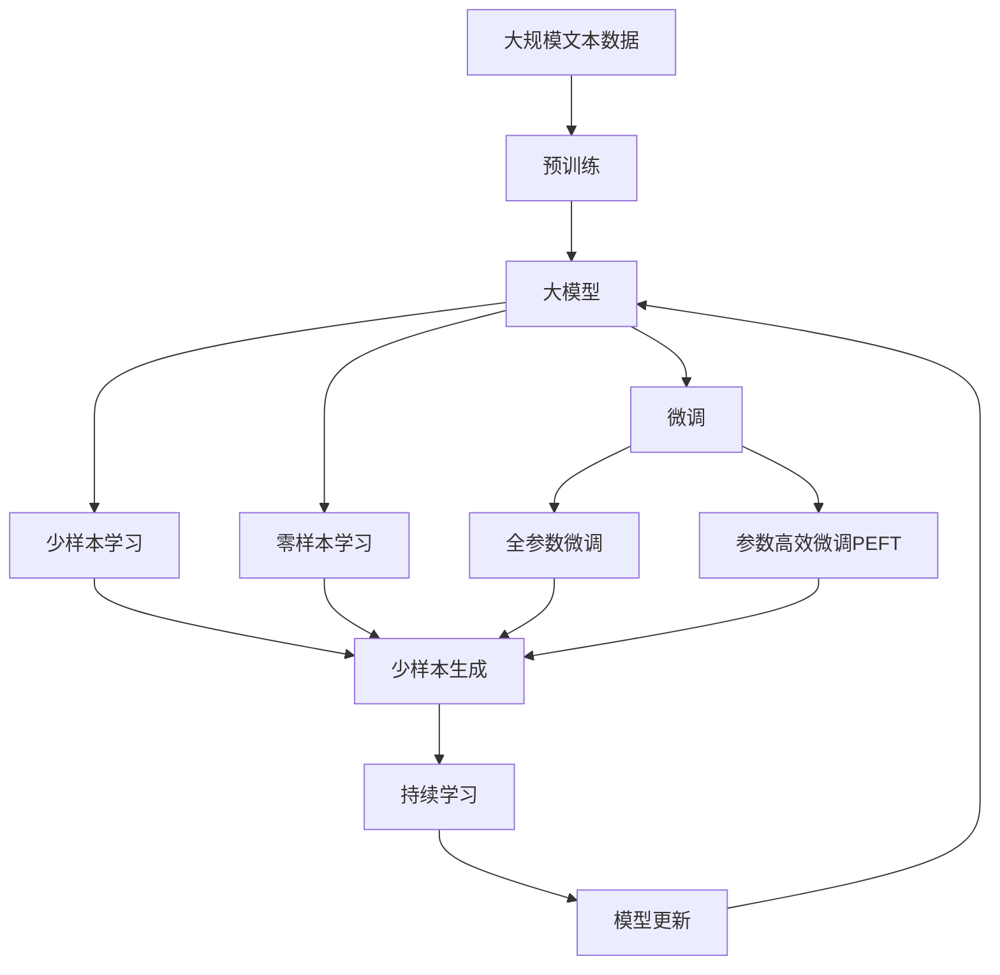

                 

# 基于AI大模型的自然语言生成：写作的未来

> 关键词：自然语言生成,大模型,自然语言处理(NLP),Transformer,BERT,GPT,预训练,微调,Fine-Tuning

## 1. 背景介绍

### 1.1 问题由来
近年来，随着深度学习技术的飞速发展，人工智能(AI)在自然语言处理(NLP)领域取得了令人瞩目的成就。其中，基于大规模预训练语言模型的大规模自然语言生成技术更是惊艳了整个行业。自然语言生成(NLG)是指利用计算机自动生成自然语言文本，旨在赋予机器以人的语言表达能力，被广泛应用于自动写作、内容生成、翻译等场景。

自然语言生成的核心技术包括基于规则的方法和基于统计的方法。基于规则的方法需要大量的人工编写语法和语义规则，可解释性强，但适用范围有限，且无法处理复杂的语言现象。基于统计的方法则通过学习大量的文本数据，自动抽取语言规则，更加灵活，但存在模型复杂度高、泛化能力差等问题。

为了解决这些问题，研究人员开始探索利用深度学习模型进行自然语言生成。特别是基于Transformer架构的预训练语言模型，如BERT、GPT等，以其卓越的语言理解能力和生成能力，迅速成为自然语言生成领域的新宠。这些模型通过在大规模无标签文本数据上进行预训练，学习到了丰富的语言知识，能够生成高质量的自然语言文本，满足了NLP领域对于自然语言生成的更高需求。

### 1.2 问题核心关键点
自然语言生成技术的关键在于如何通过机器学习自动生成语法正确、语义通顺、风格多样的自然语言文本。具体来说，有以下几个核心问题：

1. 如何有效地预训练语言模型，使其具备充分的语言知识，从而在生成任务上表现优异？
2. 如何对预训练模型进行微调，使其能够适应具体的生成任务，并获得良好的生成效果？
3. 如何提高生成文本的质量和多样性，避免出现重复、生硬、语义不清等问题？
4. 如何提高生成效率，降低计算资源和时间的消耗？
5. 如何结合先验知识，生成更具针对性的自然语言文本？

针对这些问题，自然语言生成领域涌现出了许多基于预训练和微调的创新技术，如GPT、GPT-2、T5等模型。这些模型通过在大规模语料上进行预训练，再通过微调或fine-tuning等技术，实现了在特定任务上的高效生成。

### 1.3 问题研究意义
自然语言生成技术的研究和应用，对于推动人工智能技术的发展，促进语言学研究，提升人们的语言表达和沟通能力，具有重要意义：

1. 促进人工智能应用：自然语言生成技术使机器能够自动产生高质量的自然语言文本，极大地拓展了人工智能在语言理解和表达上的应用场景，如智能客服、自动摘要、内容创作等。
2. 推动语言学研究：自然语言生成技术通过大规模语料的学习和模型微调，能够揭示语言的深层结构和规律，促进语言学研究的深入。
3. 提升语言表达和沟通：自然语言生成技术使机器能够生成符合人类语言习惯的文本，提升人们的语言表达和沟通效率。
4. 加速文本内容生成：自然语言生成技术可以自动生成新闻、报道、评论等内容，极大缩短内容创作的周期。
5. 促进技术产业化：自然语言生成技术的商业化应用，为信息传播、内容创作、广告投放等产业带来新的商业模式和增长点。

自然语言生成技术的不断进步，使机器能够像人一样自然流畅地进行语言表达，为人工智能技术的发展和普及带来了新的动力。

## 2. 核心概念与联系

### 2.1 核心概念概述

为了更好地理解自然语言生成的核心技术，本节将介绍几个关键概念：

- 自然语言生成(NLG)：指利用计算机自动生成自然语言文本的过程。其目标是通过机器学习技术，自动产生语法正确、语义通顺、风格多样的文本，以实现自然语言表达。
- 大模型(Large Model)：指具有大规模参数量、训练数据量和计算资源的深度学习模型。大模型通常在大规模无标签文本数据上进行预训练，学习到丰富的语言知识。
- 预训练(Pre-training)：指在大规模无标签文本数据上，通过自监督学习任务训练模型，使其学习通用的语言表示的过程。常见的预训练任务包括掩码语言模型、下一步预测等。
- 微调(Fine-tuning)：指在预训练模型的基础上，使用下游任务的少量标注数据，通过有监督地训练优化模型，使其能够适应特定任务的过程。
- 自回归模型(AR)：指以自身输出作为下一个输入进行计算的模型，如GPT系列模型。
- 自编码器(CE)：指通过编码和解码过程生成输出的模型，如BERT。
- 参数高效微调(PEFT)：指在微调过程中，只更新少量的模型参数，而固定大部分预训练权重不变，以提高微调效率的方法。
- 少样本学习(Few-shot Learning)：指在只有少量标注样本的情况下，模型能够快速适应新任务的学习方法。
- 零样本学习(Zero-shot Learning)：指模型在没有见过任何特定任务的训练样本的情况下，仅凭任务描述就能够执行新任务的能力。
- 持续学习(Continual Learning)：指模型能够持续从新数据中学习，同时保持已学习的知识，而不会出现灾难性遗忘。

这些概念之间的逻辑关系可以通过以下Mermaid流程图来展示：



这个流程图展示了大模型在自然语言生成中的核心概念及其之间的关系：

1. 大模型通过预训练获得基础能力。
2. 微调是对预训练模型进行任务特定的优化，可以分为全参数微调和参数高效微调（PEFT）。
3. 少样本学习和零样本学习是微调模型的重要补充，使其在不更新模型参数的情况下，能够进行高效的生成。
4. 持续学习旨在使模型能够不断学习新知识，同时避免遗忘旧知识。

### 2.2 概念间的关系

这些核心概念之间存在着紧密的联系，形成了自然语言生成技术的完整生态系统。下面我们通过几个Mermaid流程图来展示这些概念之间的关系。

#### 2.2.1 自然语言生成的学习范式



这个流程图展示了大模型在自然语言生成中的学习范式：

1. 自然语言生成任务首先在大规模语料上进行预训练。
2. 微调是自然语言生成的核心过程，可以是全参数微调或参数高效微调。
3. 少样本学习和零样本学习是微调的重要补充。
4. 预训练的任务可以是自监督学习，如掩码语言模型和下一步预测。

#### 2.2.2 自然语言生成与预训练模型的关系



这个流程图展示了自然语言生成与预训练模型的关系：

1. 自然语言生成任务可以使用自回归模型或自编码器作为预训练模型。
2. 自回归模型通过自身输出作为下一个输入进行计算。
3. 自编码器通过编码和解码过程生成输出。
4. 生成任务可以通过自回归模型直接生成文本，也可以通过自编码器进行编码解码生成文本。

#### 2.2.3 参数高效微调方法



这个流程图展示了几种常见的参数高效微调方法，包括适配器微调、提示微调、LoRA和BitFit。这些方法的共同特点是冻结大部分预训练参数，只更新少量参数，从而提高微调效率。

#### 2.2.4 持续学习在大模型中的应用



这个流程图展示了持续学习在大模型中的应用：

1. 持续学习的目标是避免灾难性遗忘和实现增量学习。
2. 正则化方法、记忆重放、动态架构和知识蒸馏等技术，可以使大模型持续适应新的任务和数据。

### 2.3 核心概念的整体架构

最后，我们用一个综合的流程图来展示这些核心概念在大模型自然语言生成中的整体架构：



这个综合流程图展示了从预训练到大模型自然语言生成的完整过程：

1. 大模型通过大规模文本数据的预训练获得基础能力。
2. 微调是对预训练模型进行任务特定的优化，可以分为全参数微调和参数高效微调。
3. 少样本学习和零样本学习是微调模型的重要补充。
4. 持续学习使模型能够不断学习新知识，同时避免遗忘旧知识。

通过这些流程图，我们可以更清晰地理解自然语言生成技术在大模型中的应用和各个核心概念之间的联系。

## 3. 核心算法原理 & 具体操作步骤
### 3.1 算法原理概述

自然语言生成技术的核心是利用深度学习模型生成符合语法和语义规范的自然语言文本。其中，基于预训练语言模型的大规模自然语言生成技术尤为突出。其核心思想是：将预训练的语言模型作为生成器，通过微调或fine-tuning等方法，使其适应特定的生成任务。

具体来说，假设预训练语言模型为 $M_{\theta}$，其中 $\theta$ 为预训练得到的模型参数。给定生成任务 $T$ 的训练集 $D=\{(x_i, y_i)\}_{i=1}^N$，其中 $x_i$ 为输入，$y_i$ 为生成的目标文本。生成任务的生成过程可以表示为：

$$
y = M_{\theta}(x)
$$

其中 $M_{\theta}$ 表示模型参数为 $\theta$ 的预训练语言模型。为了使模型在生成任务上表现优异，需要对模型进行微调，优化损失函数：

$$
\mathcal{L}(\theta) = -\frac{1}{N}\sum_{i=1}^N \log P(y_i | x_i)
$$

其中 $P(y_i | x_i)$ 表示模型在输入 $x_i$ 下生成 $y_i$ 的概率。通过梯度下降等优化算法，微调过程不断更新模型参数 $\theta$，最小化损失函数 $\mathcal{L}(\theta)$，使得模型输出逼近真实的文本生成结果。

### 3.2 算法步骤详解

自然语言生成的大规模模型微调一般包括以下几个关键步骤：

**Step 1: 准备预训练模型和数据集**
- 选择合适的预训练语言模型 $M_{\theta}$ 作为初始化参数，如 BERT、GPT等。
- 准备生成任务的训练集 $D$，划分为训练集、验证集和测试集。训练集需要包含大量样本，验证集和测试集用于评估模型性能。

**Step 2: 添加生成任务适配层**
- 根据生成任务类型，在预训练模型顶层设计合适的输出层和损失函数。
- 对于生成任务，通常使用语言模型的解码器输出概率分布，并以负对数似然为损失函数。

**Step 3: 设置微调超参数**
- 选择合适的优化算法及其参数，如 AdamW、SGD 等，设置学习率、批大小、迭代轮数等。
- 设置正则化技术及强度，包括权重衰减、Dropout、Early Stopping 等。
- 确定冻结预训练参数的策略，如仅微调顶层，或全部参数都参与微调。

**Step 4: 执行梯度训练**
- 将训练集数据分批次输入模型，前向传播计算损失函数。
- 反向传播计算参数梯度，根据设定的优化算法和学习率更新模型参数。
- 周期性在验证集上评估模型性能，根据性能指标决定是否触发 Early Stopping。
- 重复上述步骤直到满足预设的迭代轮数或 Early Stopping 条件。

**Step 5: 测试和部署**
- 在测试集上评估微调后模型 $M_{\hat{\theta}}$ 的性能，对比微调前后的生成质量提升。
- 使用微调后的模型对新样本进行生成，集成到实际的应用系统中。
- 持续收集新的数据，定期重新微调模型，以适应数据分布的变化。

以上是自然语言生成的大规模模型微调的一般流程。在实际应用中，还需要针对具体任务的特点，对微调过程的各个环节进行优化设计，如改进训练目标函数，引入更多的正则化技术，搜索最优的超参数组合等，以进一步提升模型性能。

### 3.3 算法优缺点

大规模模型自然语言生成技术具有以下优点：

1. 生成文本质量高。得益于预训练模型的丰富知识，大规模模型能够在生成任务上生成高质量的文本，符合语法和语义规范。
2. 生成效率高。大规模模型在训练和推理时，可以利用并行计算和优化技术，生成效率高，响应速度快。
3. 泛化能力强。大规模模型在大规模语料上进行预训练，具备较强的泛化能力，能够在多种生成任务上表现优异。

然而，这种技术也存在一些局限性：

1. 依赖高质量数据。生成模型的效果很大程度上取决于训练数据的质量，数据质量不高会影响模型的生成效果。
2. 过拟合风险高。大规模模型的参数量巨大，在训练时容易发生过拟合，需要严格的超参数调优和正则化技术。
3. 生成内容缺乏创意。大规模模型虽然能够生成语法正确、语义通顺的文本，但缺乏原创性和创新性，生成内容可能过于保守和单调。
4. 生成内容难以控制。大规模模型生成的文本往往不受人为控制，可能会输出不适当的内容，带来伦理和安全问题。

尽管存在这些局限性，但就目前而言，大规模模型自然语言生成技术仍然是自然语言生成领域的主流范式。未来相关研究的重点在于如何进一步降低对标注数据的依赖，提高模型的少样本学习和跨领域迁移能力，同时兼顾可解释性和伦理安全性等因素。

### 3.4 算法应用领域

大规模模型自然语言生成技术已经广泛应用于各种场景，包括但不限于：

1. 自动摘要：从长文本中自动生成简洁明了的摘要。通过微调预训练模型，使其能够理解和抽取文本的关键信息，生成高质量的摘要。
2. 内容创作：自动生成新闻、博客、小说等内容。通过微调预训练模型，使其能够生成符合人类语言习惯的文本，提升内容创作的效率和质量。
3. 对话系统：自动生成对话回复。通过微调预训练模型，使其能够理解和生成符合语境的对话内容，提升聊天机器人的交互体验。
4. 文本翻译：自动翻译不同语言的文本。通过微调预训练模型，使其能够将一种语言转换为另一种语言，提高翻译的准确性和流畅度。
5. 代码生成：自动生成程序代码。通过微调预训练模型，使其能够理解代码语义，生成符合语法和语义规范的代码。
6. 广告文案：自动生成广告文案。通过微调预训练模型，使其能够生成吸引人的广告语言，提升广告效果。
7. 内容推荐：自动推荐相关内容。通过微调预训练模型，使其能够理解用户兴趣，生成个性化的推荐内容，提升用户体验。

除了上述这些经典应用外，大规模模型自然语言生成技术还被创新性地应用到更多场景中，如可控文本生成、知识推理、代码推理等，为自然语言生成技术带来了新的突破。随着预训练模型和微调方法的不断进步，相信自然语言生成技术将在更广阔的应用领域大放异彩。

## 4. 数学模型和公式 & 详细讲解 & 举例说明
### 4.1 数学模型构建

在自然语言生成中，我们通常使用基于概率模型的框架来构建数学模型。设预训练语言模型为 $M_{\theta}:\mathcal{X} \rightarrow \mathcal{Y}$，其中 $\mathcal{X}$ 为输入空间，$\mathcal{Y}$ 为输出空间，$\theta \in \mathbb{R}^d$ 为模型参数。假设生成任务 $T$ 的训练集为 $D=\{(x_i, y_i)\}_{i=1}^N$，其中 $x_i \in \mathcal{X}$ 为输入文本，$y_i \in \mathcal{Y}$ 为生成的目标文本。

定义模型 $M_{\theta}$ 在输入 $x$ 上的生成概率为 $P(y | x)$，则生成任务的损失函数可以表示为：

$$
\mathcal{L}(\theta) = -\frac{1}{N}\sum_{i=1}^N \log P(y_i | x_i)
$$

其中 $P(y_i | x_i)$ 表示模型在输入 $x_i$ 下生成 $y_i$ 的概率。通过梯度下降等优化算法，微调过程不断更新模型参数 $\theta$，最小化损失函数 $\mathcal{L}(\theta)$，使得模型输出逼近真实的文本生成结果。

### 4.2 公式推导过程

下面以文本生成的例子来说明模型的构建和优化过程。假设生成模型 $M_{\theta}$ 的输出为 $\hat{y}=M_{\theta}(x) \in [0,1]$，表示样本生成为特定类别的概率。真实标签 $y \in \{0,1\}$。则二分类交叉熵损失函数定义为：

$$
\ell(M_{\theta}(x),y) = -[y\log \hat{y} + (1-y)\log (1-\hat{y})]
$$

将其代入经验风险公式，得：

$$
\mathcal{L}(\theta) = -\frac{1}{N}\sum_{i=1}^N [y_i\log M_{\theta}(x_i)+(1-y_i)\log(1-M_{\theta}(x_i))]
$$

根据链式法则，损失函数对参数 $\theta_k$ 的梯度为：

$$
\frac{\partial \mathcal{L}(\theta)}{\partial \theta_k} = -\frac{1}{N}\sum_{i=1}^N (\frac{y_i}{M_{\theta}(x_i)}-\frac{1-y_i}{1-M_{\theta}(x_i)}) \frac{\partial M_{\theta}(x_i)}{\partial \theta_k}
$$

其中 $\frac{\partial M_{\theta}(x_i)}{\partial \theta_k}$ 可进一步递归展开，利用自动微分技术完成计算。

在得到损失函数的梯度后，即可带入参数更新公式，完成模型的迭代优化。重复上述过程直至收敛，最终得到适应生成任务的最优模型参数 $\theta^*$。

### 4.3 案例分析与讲解

以下我们以文本摘要任务为例，给出使用PyTorch对BERT模型进行微调的代码实现。

```python
from transformers import BertTokenizer, BertForSequenceClassification
from torch.utils.data import Dataset
import torch

class TextSummaryDataset(Dataset):
    def __init__(self, texts, summaries):
        self.texts = texts
        self.summaries = summaries
        self.tokenizer = BertTokenizer.from_pretrained('bert-base-cased')

    def __len__(self):
        return len(self.texts)
    
    def __getitem__(self, item):
        text = self.texts[item]
        summary = self.summaries[item]

        encoding = self.tokenizer(text, return_tensors='pt', max_length=512, padding='max_length', truncation=True)
        input_ids = encoding['input_ids'][0]
        attention_mask = encoding['attention_mask'][0]

        return {'input_ids': input_ids, 
                'attention_mask': attention_mask,
                'labels': summary}

# 创建dataset
tokenizer = BertTokenizer.from_pretrained('bert-base-cased')
train_dataset = TextSummaryDataset(train_texts, train_summaries, tokenizer)
dev_dataset = TextSummaryDataset(dev_texts, dev_summaries, tokenizer)
test_dataset = TextSummaryDataset(test_texts, test_summaries, tokenizer)

# 定义模型和优化器
model = BertForSequenceClassification.from_pretrained('bert-base-cased', num_labels=1)
optimizer = AdamW(model.parameters(), lr=2e-5)

# 执行训练
epochs = 5
batch_size = 16

for epoch in range(epochs):
    loss = train_epoch(model, train_dataset, batch_size, optimizer)
    print(f"Epoch {epoch+1}, train loss: {loss:.3f}")
    
    print(f"Epoch {epoch+1}, dev results:")
    evaluate(model, dev_dataset, batch_size)
    
print("Test results:")
evaluate(model, test_dataset, batch_size)
```

以上就是使用PyTorch对BERT模型进行文本摘要任务微调的完整代码实现。可以看到，借助Transformers库的强大封装，我们可以用相对简洁的代码完成BERT模型的加载和微调。

## 5. 项目实践：代码实例和详细解释说明
### 5.1 开发环境搭建

在进行自然语言生成项目实践前，我们需要准备好开发环境。以下是使用Python进行PyTorch开发的环境配置流程：

1. 安装Anaconda：从官网下载并安装Anaconda，用于创建独立的Python环境。

2. 创建并激活虚拟环境：
```bash
conda create -n pytorch-env python=3.8 
conda activate pytorch-env
```

3. 安装PyTorch：根据CUDA版本，从官网获取对应的安装命令。例如：
```bash
conda install pytorch torchvision torchaudio cudatoolkit=11.1 -c pytorch -c conda-forge
```

4. 安装Transformers库：
```bash
pip install transformers
```

5. 安装各类工具包：
```bash
pip install numpy pandas scikit-learn matplotlib tqdm jupyter notebook ipython
```

完成上述步骤后，即可在`pytorch-env`环境中开始自然语言生成项目的实践。

### 5.2 源代码详细实现

下面我们以对话系统任务为例，给出使用Transformers库对GPT模型进行微调的PyTorch代码实现。

首先，定义对话系统任务的数据处理函数：

```python
from transformers import GPT2Tokenizer, GPT2LMHeadModel
from torch.utils.data import Dataset
import torch

class DialogueDataset(Dataset):
    def __init__(self, dialogues, tokenizer, max_len=256):
        self.dialogues = dialogues
        self.tokenizer = tokenizer
        self.max_len = max_len
        
    def __len__(self):
        return len(self.dialogues)
    
    def __getitem__(self, item):
        dialogue = self.dialogues[item]
        inputs = [tokenizer.encode(dialogue[i] + tokenizer.eos_token, return_tensors='pt') for i in range(len(dialogue)-1)]
        targets = [tokenizer.encode(dialogue[i+1] + tokenizer.eos_token, return_tensors='pt') for i in range(len(dialogue)-1)]

        return {'inputs': inputs,
                'targets': targets,
                'attention_mask': torch.tensor([1] * (len(inputs) - 1) + [0])}

# 创建dataset
tokenizer = GPT2Tokenizer.from_pretrained('gpt2')
train_dataset = DialogueDataset(train_dialogues, tokenizer, max_len=256)
dev_dataset = DialogueDataset(dev_dialogues, tokenizer, max_len=256)
test_dataset = DialogueDataset(test_dialogues, tokenizer, max_len=256)
```

然后，定义模型和优化器：

```python
from transformers import GPT2LMHeadModel, AdamW

model = GPT2LMHeadModel.from_pretrained('gpt2')
optimizer = AdamW(model.parameters(), lr=2e-5)
```

接着，定义训练和评估函数：

```python
from torch.utils.data import DataLoader
from tqdm import tqdm
from sklearn.metrics import accuracy_score

device = torch.device('cuda') if torch.cuda.is_available() else torch.device('cpu')
model.to(device)

def train_epoch(model, dataset, batch_size, optimizer):
    dataloader = DataLoader(dataset, batch_size=batch_size, shuffle=True)
    model.train()
    

