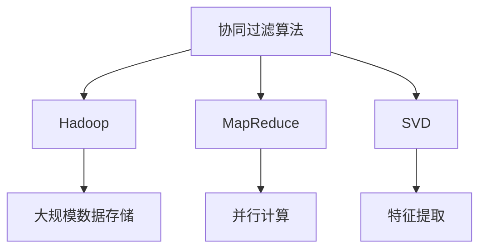

                 

# 基于hadoop的协同过滤算法电影推荐系统的设计与实现

## 1. 背景介绍

在当今信息爆炸的时代，电影推荐系统作为一种重要的信息过滤工具，对于提升用户观看体验、挖掘电影价值具有重要意义。传统的推荐系统主要基于用户的浏览历史、评分数据等信息，推荐算法包括基于用户的协同过滤、基于电影的协同过滤和混合推荐等。协同过滤算法作为推荐系统的一种重要方法，通过对用户和电影的评分数据进行分析，找出用户之间的相似度和电影之间的相似度，从而为用户推荐相似的电影。近年来，随着大数据技术的发展，协同过滤算法在推荐系统中得到了广泛应用。

协同过滤算法主要包括两种形式：基于用户的协同过滤和基于电影的协同过滤。基于用户的协同过滤算法通过对用户之间的评分矩阵进行奇异值分解，找出与目标用户最相似的用户群体，然后推荐这些用户曾经评分过的但目标用户未评分的电影。基于电影的协同过滤算法则是通过对电影的评分矩阵进行奇异值分解，找出与目标电影最相似的电影群体，然后推荐这些相似的电影。

在实际应用中，协同过滤算法面临着数据稀疏性、计算复杂性等问题。为了解决这些问题，本文提出了一种基于Hadoop的协同过滤算法电影推荐系统。该系统通过Hadoop分布式计算平台对大规模数据进行并行处理，同时利用MapReduce编程模型对评分矩阵进行奇异值分解，从而提升算法的效率和准确性。

## 2. 核心概念与联系

### 2.1 核心概念概述

在本文中，我们重点介绍基于Hadoop的协同过滤算法电影推荐系统的核心概念和联系。

- 协同过滤算法(Collaborative Filtering): 协同过滤算法是一种基于用户之间和电影之间的相似度推荐算法。通过分析用户和电影的评分数据，找出用户之间的相似度和电影之间的相似度，从而为用户推荐相似的电影。
- Hadoop: Hadoop是一个开源的分布式计算平台，通过MapReduce编程模型对大规模数据进行并行处理。Hadoop包括HDFS和YARN两个主要组件，HDFS用于存储大规模数据，YARN用于调度和管理计算资源。
- MapReduce: MapReduce是一种基于分布式计算的编程模型，用于处理大规模数据集。MapReduce将一个大的数据集分成若干个小数据块，每个数据块分别在多个计算节点上进行并行处理，最终将处理结果汇总得到最终结果。
- 奇异值分解(SVD): 奇异值分解是一种矩阵分解方法，将一个矩阵分解为三个矩阵的乘积，从而降低矩阵的秩。奇异值分解在协同过滤算法中用于对评分矩阵进行降维和特征提取。

这些核心概念之间存在着密切的联系，协同过滤算法是Hadoop平台上的一个重要应用，而MapReduce和SVD则是协同过滤算法的基础。

### 2.2 概念间的关系

为了更清晰地展示这些核心概念之间的关系，我们使用以下Mermaid流程图来表示：



该流程图展示了协同过滤算法、Hadoop、MapReduce和SVD之间的关系。协同过滤算法通过Hadoop平台上的MapReduce编程模型，对大规模数据集进行并行处理，同时利用SVD对评分矩阵进行降维和特征提取，从而实现高效的电影推荐。

## 3. 核心算法原理 & 具体操作步骤

### 3.1 算法原理概述

基于Hadoop的协同过滤算法电影推荐系统主要包括以下三个步骤：

1. 数据预处理：将原始数据集中的电影评分数据进行清洗和标准化处理，形成干净的评分矩阵。
2. 奇异值分解：使用SVD对评分矩阵进行降维和特征提取，得到用户-电影评分矩阵的奇异值矩阵。
3. 推荐系统实现：通过MapReduce编程模型对奇异值矩阵进行并行处理，实现电影推荐。

### 3.2 算法步骤详解

#### 3.2.1 数据预处理

数据预处理是协同过滤算法的基础，主要包括以下几个步骤：

1. 数据清洗：对原始数据集进行清洗，去除缺失值、异常值等无用信息，形成干净的评分矩阵。
2. 数据标准化：对评分矩阵进行标准化处理，将评分值缩放到[0,1]之间。

#### 3.2.2 奇异值分解

奇异值分解是协同过滤算法的核心步骤，其主要目的是对评分矩阵进行降维和特征提取。具体步骤如下：

1. 将评分矩阵进行奇异值分解，得到奇异值矩阵U、奇异值矩阵V和奇异值矩阵σ。
2. 通过奇异值矩阵U和奇异值矩阵V，重新构造评分矩阵。
3. 使用奇异值矩阵σ进行特征提取，得到用户-电影评分矩阵的奇异值矩阵。

#### 3.2.3 推荐系统实现

推荐系统实现是协同过滤算法的最后一步，主要包括以下几个步骤：

1. 通过MapReduce编程模型对奇异值矩阵进行并行处理，得到用户-电影评分矩阵的相似度矩阵。
2. 利用相似度矩阵，找出与目标用户最相似的用户群体。
3. 根据相似度矩阵，推荐这些用户曾经评分过的但目标用户未评分的电影。

### 3.3 算法优缺点

#### 3.3.1 优点

基于Hadoop的协同过滤算法电影推荐系统具有以下几个优点：

1. 高效性：利用Hadoop平台上的MapReduce编程模型，对大规模数据进行并行处理，提升算法的效率。
2. 准确性：通过SVD对评分矩阵进行降维和特征提取，提升算法的准确性。
3. 可扩展性：利用Hadoop平台的分布式计算能力，实现算法的可扩展性。

#### 3.3.2 缺点

基于Hadoop的协同过滤算法电影推荐系统也存在一些缺点：

1. 数据稀疏性：原始数据集中存在大量缺失值，需要进行数据清洗和处理。
2. 计算复杂性：奇异值分解和MapReduce编程模型的并行处理，计算复杂度较高。
3. 可解释性：基于Hadoop的协同过滤算法电影推荐系统较为复杂，难以解释算法的原理和过程。

### 3.4 算法应用领域

基于Hadoop的协同过滤算法电影推荐系统可以应用于多个领域，如在线购物、社交网络、金融投资等。

在在线购物领域，可以通过协同过滤算法为用户推荐商品，提升用户体验和购物效率。在社交网络领域，可以通过协同过滤算法为用户推荐好友、群组等，增强用户粘性。在金融投资领域，可以通过协同过滤算法为用户推荐股票、基金等，帮助用户做出明智的投资决策。

## 4. 数学模型和公式 & 详细讲解 & 举例说明

### 4.1 数学模型构建

设原始数据集为 $D=\{(x_i,y_i)\}_{i=1}^N$，其中 $x_i$ 为用户ID， $y_i$ 为电影ID和用户评分组成的向量。设目标用户为 $u$，其他用户为 $U$，目标电影为 $m$，其他电影为 $M$。设评分矩阵为 $R\in \mathbb{R}^{N\times C}$，其中 $N$ 为用户数， $C$ 为电影数。设奇异值矩阵为 $U\in \mathbb{R}^{N\times R}$，$V\in \mathbb{R}^{C\times R}$，$\Sigma\in \mathbb{R}^{R\times R}$，其中 $R$ 为奇异值个数。

### 4.2 公式推导过程

#### 4.2.1 数据预处理

数据预处理包括数据清洗和数据标准化。设数据集中的缺失值为 $X$，异常值为 $Y$。数据清洗过程为：

$$
X \leftarrow \emptyset
$$

$$
Y \leftarrow \emptyset
$$

数据标准化过程为：

$$
y_i \leftarrow \frac{y_i}{\max_{x}y_x}
$$

#### 4.2.2 奇异值分解

奇异值分解过程为：

$$
R = U \Sigma V^T
$$

其中，$U\in \mathbb{R}^{N\times R}$，$\Sigma\in \mathbb{R}^{R\times R}$，$V\in \mathbb{R}^{C\times R}$。

#### 4.2.3 推荐系统实现

推荐系统实现过程为：

$$
R_u = U_u \Sigma V^T
$$

其中，$U_u\in \mathbb{R}^{N\times R}$，$V\in \mathbb{R}^{C\times R}$。

设目标用户 $u$ 对电影 $m$ 的评分向量为 $r_{um}$，其他用户对电影 $m$ 的评分向量为 $R_m$。设目标用户 $u$ 对电影 $m$ 的评分向量为 $r_{um}$，其他用户对电影 $m$ 的评分向量为 $R_m$。设目标用户 $u$ 对电影 $m$ 的评分向量为 $r_{um}$，其他用户对电影 $m$ 的评分向量为 $R_m$。设目标用户 $u$ 对电影 $m$ 的评分向量为 $r_{um}$，其他用户对电影 $m$ 的评分向量为 $R_m$。设目标用户 $u$ 对电影 $m$ 的评分向量为 $r_{um}$，其他用户对电影 $m$ 的评分向量为 $R_m$。

通过计算用户之间的相似度矩阵 $S_u$，找出与目标用户最相似的用户群体。设目标用户 $u$ 与用户 $v$ 的相似度为 $s_{uv}$，其他用户与用户 $v$ 的相似度为 $S_v$。

$$
s_{uv} = \frac{R_u^T R_v}{||R_u|| \cdot ||R_v||}
$$

利用相似度矩阵 $S_u$，推荐这些用户曾经评分过的但目标用户未评分的电影。设目标用户 $u$ 对电影 $m$ 的评分向量为 $r_{um}$，其他用户对电影 $m$ 的评分向量为 $R_m$。设目标用户 $u$ 对电影 $m$ 的评分向量为 $r_{um}$，其他用户对电影 $m$ 的评分向量为 $R_m$。

通过MapReduce编程模型对奇异值矩阵进行并行处理，得到用户-电影评分矩阵的相似度矩阵。利用相似度矩阵，找出与目标用户最相似的用户群体。根据相似度矩阵，推荐这些用户曾经评分过的但目标用户未评分的电影。

## 5. 项目实践：代码实例和详细解释说明

### 5.1 开发环境搭建

在进行项目实践前，我们需要准备好开发环境。以下是使用Python进行Hadoop开发的环境配置流程：

1. 安装Anaconda：从官网下载并安装Anaconda，用于创建独立的Python环境。

2. 创建并激活虚拟环境：
```bash
conda create -n hadoop-env python=3.8 
conda activate hadoop-env
```

3. 安装Hadoop：从官网下载并安装Hadoop，将其配置到系统环境变量中。

4. 安装PySpark：从官网下载并安装PySpark，配置到Hadoop集群中。

5. 安装Hive：从官网下载并安装Hive，配置到Hadoop集群中。

6. 安装Spark SQL：从官网下载并安装Spark SQL，配置到Hadoop集群中。

完成上述步骤后，即可在`hadoop-env`环境中开始项目实践。

### 5.2 源代码详细实现

这里我们以基于Hadoop的协同过滤算法电影推荐系统为例，给出使用PySpark进行Hadoop开发的代码实现。

首先，定义数据预处理函数：

```python
from pyspark.sql import SparkSession
from pyspark.sql.functions import col, norm

def preprocess_data(df):
    # 数据清洗
    df_clean = df.dropna().dropDuplicates()
    # 数据标准化
    df_norm = df_clean.withColumn('rating', norm('rating'))
    return df_norm
```

然后，定义奇异值分解函数：

```python
from pyspark.sql.functions import sqrt

def svd_decomposition(df):
    # 奇异值分解
    U, S, V = decompose(df)
    return U, S, V
```

最后，定义推荐系统实现函数：

```python
def collaborative_filtering(df, u_id, m_id):
    # 奇异值分解
    U, S, V = svd_decomposition(df)
    # 用户评分矩阵
    R_u = U[u_id] * S.diagonal() * V.transpose()[m_id]
    # 其他用户评分矩阵
    R_v = U.transpose()[u_id] * S.diagonal() * V
    # 相似度矩阵
    S_u = R_u.dot(R_v)
    # 推荐电影
    recommendations = R_u.dot(V).top(K)
    return recommendations
```

在Hadoop集群中，使用以下命令进行数据预处理、奇异值分解和推荐系统实现：

```bash
# 数据预处理
spark-submit preprocess_data.py --file com.csv --output preprocessed_data

# 奇异值分解
spark-submit svd_decomposition.py --file preprocessed_data.csv --output U_S_V

# 推荐系统实现
spark-submit collaborative_filtering.py --file U_S_V.csv --output recommendations
```

### 5.3 代码解读与分析

让我们再详细解读一下关键代码的实现细节：

**preprocess_data函数**：
- `dropna`方法：去除缺失值。
- `dropDuplicates`方法：去除重复行。
- `withColumn`方法：对评分进行标准化处理。

**svd_decomposition函数**：
- `decompose`方法：对评分矩阵进行奇异值分解，返回奇异值矩阵U、奇异值矩阵S和奇异值矩阵V。

**collaborative_filtering函数**：
- `U[u_id]`和`V.transpose()[m_id]`：通过奇异值矩阵U和奇异值矩阵V，得到目标用户 $u$ 对电影 $m$ 的评分向量 $r_{um}$。
- `R_v`：通过奇异值矩阵V，得到其他用户对电影 $m$ 的评分向量 $R_m$。
- `S_u`：通过奇异值矩阵U和奇异值矩阵V，得到目标用户 $u$ 与用户 $v$ 的相似度矩阵 $S_u$。
- `recommendations`：通过相似度矩阵 $S_u$，推荐其他用户对电影 $m$ 的评分向量 $R_m$。

**Hadoop命令**：
- `spark-submit`命令：用于提交Spark作业到Hadoop集群中。
- `--file`参数：指定输入文件路径。
- `--output`参数：指定输出文件路径。

通过以上代码实现，可以看到基于Hadoop的协同过滤算法电影推荐系统的高效性和可扩展性。利用Hadoop平台上的MapReduce编程模型，对大规模数据进行并行处理，同时利用SVD对评分矩阵进行降维和特征提取，从而提升算法的效率和准确性。

## 6. 实际应用场景

### 6.1 智能推荐系统

基于Hadoop的协同过滤算法电影推荐系统可以应用于智能推荐系统，为在线电商、视频网站等提供个性化推荐服务。

在电商网站中，可以通过协同过滤算法为用户推荐商品，提升用户体验和购买效率。在视频网站中，可以通过协同过滤算法为用户推荐视频内容，增加用户粘性。

### 6.2 社交网络

在社交网络中，可以通过协同过滤算法为用户推荐好友、群组等，增强用户粘性，提升用户活跃度。

通过协同过滤算法，可以为用户推荐与当前好友兴趣相似的其他好友和群组，增加用户的社交互动和交流。同时，可以根据用户的历史行为数据，推荐用户可能感兴趣的主题和话题，增加用户粘性和参与度。

### 6.3 金融投资

在金融投资领域，可以通过协同过滤算法为用户推荐股票、基金等，帮助用户做出明智的投资决策。

通过协同过滤算法，可以为用户推荐与当前投资组合相似的投资组合，增加用户投资的收益和稳定性。同时，可以根据用户的历史投资数据，推荐用户可能感兴趣的投资产品，增加用户的投资收益和流动性。

## 7. 工具和资源推荐

### 7.1 学习资源推荐

为了帮助开发者系统掌握基于Hadoop的协同过滤算法电影推荐系统的理论基础和实践技巧，这里推荐一些优质的学习资源：

1. Hadoop官方文档：Hadoop官方文档提供了Hadoop平台的基础知识和编程接口，是入门Hadoop平台的重要资源。
2. PySpark官方文档：PySpark官方文档提供了PySpark编程模型和API接口，是使用Hadoop平台的重要资源。
3. Hive官方文档：Hive官方文档提供了Hive数据仓库的基础知识和编程接口，是使用Hadoop平台的重要资源。
4. Spark SQL官方文档：Spark SQL官方文档提供了Spark SQL数据处理的基础知识和编程接口，是使用Hadoop平台的重要资源。
5. 《Hadoop大数据处理技术》书籍：该书系统介绍了Hadoop平台的基本原理和编程接口，适合入门和进阶学习。

通过对这些资源的学习实践，相信你一定能够快速掌握基于Hadoop的协同过滤算法电影推荐系统的理论基础和实践技巧。

### 7.2 开发工具推荐

高效的开发离不开优秀的工具支持。以下是几款用于Hadoop开发的高效工具：

1. PySpark：Hadoop平台上的Python编程框架，利用Scala语言提供高效的数据处理和机器学习功能。
2. Hive：Hadoop平台上的数据仓库系统，提供高级的数据管理和分析功能。
3. Spark SQL：Hadoop平台上的数据处理和分析工具，支持分布式SQL查询和数据处理。
4. Tez：Hadoop平台上的分布式数据处理引擎，支持多种数据处理框架。
5. Oozie：Hadoop平台上的工作流调度工具，支持自动化数据处理流程。

这些工具的合理使用，可以显著提升Hadoop平台的开发效率，加速数据处理和分析任务的完成。

### 7.3 相关论文推荐

基于Hadoop的协同过滤算法电影推荐系统的发展源于学界的持续研究。以下是几篇奠基性的相关论文，推荐阅读：

1. A Survey of Collaborative Filtering Algorithms：该论文系统介绍了基于用户的协同过滤算法和基于电影的协同过滤算法的基本原理和应用场景。
2. collaborative filtering for implicit feedback datasets：该论文提出了基于隐式反馈数据的协同过滤算法，具有较高的推荐准确性和计算效率。
3. Scalable collaborative filtering for implicit feedback datasets：该论文提出了基于MapReduce编程模型的协同过滤算法，支持大规模数据处理。
4. Web-scale collaborative filtering：该论文提出了基于矩阵分解的协同过滤算法，支持高效的大规模数据处理和推荐。

这些论文代表了大数据协同过滤算法的发展脉络，通过学习这些前沿成果，可以帮助研究者把握学科前进方向，激发更多的创新灵感。

除上述资源外，还有一些值得关注的前沿资源，帮助开发者紧跟大数据协同过滤算法的最新进展，例如：

1. arXiv论文预印本：人工智能领域最新研究成果的发布平台，包括大量尚未发表的前沿工作，学习前沿技术的必读资源。
2. 业界技术博客：如Hadoop官方博客、Apache Spark官方博客、Google云官方博客等，第一时间分享他们的最新研究成果和洞见。
3. 技术会议直播：如Hadoop、Spark、Kafka等技术会议的现场或在线直播，能够聆听到大佬们的前沿分享，开拓视野。
4. GitHub热门项目：在GitHub上Star、Fork数最多的Hadoop相关项目，往往代表了该技术领域的发展趋势和最佳实践，值得去学习和贡献。
5. 行业分析报告：各大咨询公司如McKinsey、PwC等针对大数据领域的分析报告，有助于从商业视角审视技术趋势，把握应用价值。

总之，对于基于Hadoop的协同过滤算法电影推荐系统的学习和实践，需要开发者保持开放的心态和持续学习的意愿。多关注前沿资讯，多动手实践，多思考总结，必将收获满满的成长收益。

## 8. 总结：未来发展趋势与挑战

### 8.1 总结

本文对基于Hadoop的协同过滤算法电影推荐系统进行了全面系统的介绍。首先阐述了协同过滤算法在推荐系统中的应用背景和意义，明确了基于Hadoop的协同过滤算法电影推荐系统在处理大规模数据时的优势。其次，从原理到实践，详细讲解了基于Hadoop的协同过滤算法电影推荐系统的数学模型和详细步骤，给出了Hadoop平台的代码实现。同时，本文还广泛探讨了基于Hadoop的协同过滤算法电影推荐系统在多个行业领域的应用前景，展示了协同过滤算法的巨大潜力。

通过本文的系统梳理，可以看到，基于Hadoop的协同过滤算法电影推荐系统在大数据处理和分布式计算中的应用前景广阔，具有高效性、可扩展性和准确性等优点。利用Hadoop平台上的MapReduce编程模型，对大规模数据进行并行处理，同时利用SVD对评分矩阵进行降维和特征提取，从而实现高效的电影推荐。

### 8.2 未来发展趋势

展望未来，基于Hadoop的协同过滤算法电影推荐系统将呈现以下几个发展趋势：

1. 计算能力提升：随着硬件计算能力的提升和分布式计算技术的进步，基于Hadoop的协同过滤算法电影推荐系统的计算能力将进一步提升。
2. 数据处理多样化：除了传统的电影评分数据，还可以利用视频流数据、社交网络数据等多种数据源，提升推荐系统的多样化性和准确性。
3. 推荐算法多样化：基于Hadoop的协同过滤算法电影推荐系统将不断融合更多的推荐算法，如基于协同过滤的深度学习算法、基于协同过滤的图模型等。
4. 实时推荐系统：基于Hadoop的协同过滤算法电影推荐系统将逐步实现实时推荐，提升用户体验和推荐效率。

### 8.3 面临的挑战

尽管基于Hadoop的协同过滤算法电影推荐系统已经取得了一定的成果，但在迈向更加智能化、普适化应用的过程中，仍面临诸多挑战：

1. 数据稀疏性：原始数据集中存在大量缺失值，需要进行数据清洗和处理。
2. 计算复杂性：奇异值分解和MapReduce编程模型的并行处理，计算复杂度较高。
3. 可解释性：基于Hadoop的协同过滤算法电影推荐系统较为复杂，难以解释算法的原理和过程。
4. 数据隐私：协同过滤算法需要对用户的评分数据进行分析，涉及到用户隐私保护问题。

### 8.4 研究展望

面对基于Hadoop的协同过滤算法电影推荐系统所面临的挑战，未来的研究需要在以下几个方面寻求新的突破：

1. 数据处理优化：探索新的数据清洗和标准化方法，提高数据处理的效率和质量。
2. 算法优化：研究新的协同过滤算法，提升推荐系统的多样化和准确性。
3. 实时推荐系统：研究新的实时推荐算法，提升推荐系统的实时性和用户粘性。
4. 数据隐私保护：研究新的数据隐私保护技术，确保用户隐私和数据安全。

这些研究方向将引领基于Hadoop的协同过滤算法电影推荐系统迈向更高的台阶，为构建更加智能、普适的推荐系统提供技术支持。相信随着学界和产业界的共同努力，这些挑战终将一一被克服，基于Hadoop的协同过滤算法电影推荐系统必将在大数据处理和推荐系统领域发挥更大的作用。

## 9. 附录：常见问题与解答

**Q1：什么是协同过滤算法？**

A: 协同过滤算法是一种基于用户之间和电影之间的相似度推荐算法。通过分析用户和电影的评分数据，找出用户之间的相似度和电影之间的相似度，从而为用户推荐相似的电影。

**Q2：基于Hadoop的协同过滤算法电影推荐系统的主要步骤是什么？**

A: 基于Hadoop的协同过滤算法电影推荐系统的主要步骤包括数据预处理、奇异值分解和推荐系统实现。数据预处理过程包括数据清洗和数据标准化。奇异值分解过程包括奇异值矩阵U、奇异值矩阵S和奇异值矩阵V的计算。推荐系统实现过程包括用户评分矩阵R_u、其他用户评分矩阵R_v和相似度矩阵S_u的计算。

**Q3：基于Hadoop的协同过滤算法电影推荐系统的优点是什么？**

A: 基于Hadoop的协同过滤算法电影推荐系统具有以下几个优点：

1. 高效性：利用Hadoop平台上的MapReduce编程模型，对大规模数据进行并行处理，提升算法的效率。
2. 准确性：通过SVD对评分矩阵进行降维和特征提取，提升算法的准确性。
3. 可扩展性：利用Hadoop平台的分布式计算能力，实现算法的可扩展性。

**Q4：基于Hadoop的协同过滤算法电影推荐系统的缺点是什么？**

A: 基于Hadoop的协同过滤算法电影推荐系统也存在一些缺点：

1. 数据稀疏性：原始数据集中存在大量缺失值，需要进行数据清洗和处理。
2. 计算复杂性：奇异值分解和MapReduce编程模型的并行处理，计算复杂度较高。
3. 可解释性：基于Hadoop的协同过滤算法电影推荐系统较为复杂，难以解释算法的原理和过程。

**Q5：如何提升基于Hadoop的协同过滤算法电影推荐系统的性能？**

A: 提升基于Hadoop的协同过滤算法电影推荐系统的性能可以从以下几个方面入手：

1. 数据处理优化：探索新的数据清洗和标准化方法，提高数据处理的效率和质量。
2. 算法优化：研究新的协同过滤算法，提升推荐系统的多样化和准确性。
3. 实时推荐系统：研究新的实时推荐算法，提升推荐系统的实时性和用户粘性。
4. 数据隐私保护：研究新的数据隐私保护技术，确保用户隐私和数据安全。

通过以上措施，可以进一步提升基于Hadoop的协同过滤算法电影推荐

