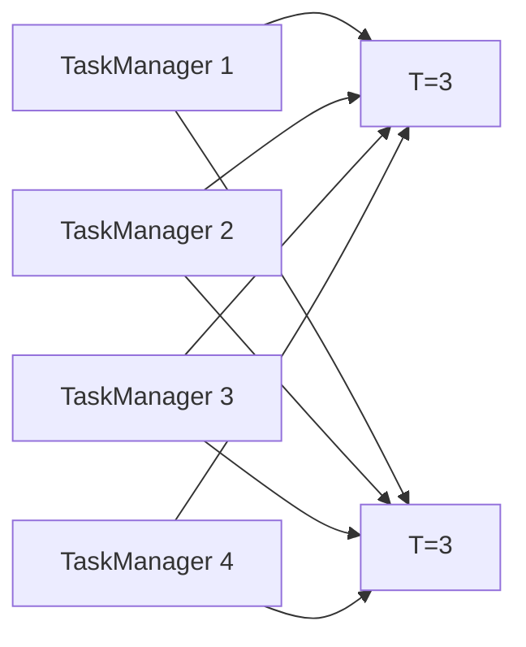

                 

# Flink JobManager原理与代码实例讲解

> 关键词：Flink, JobManager, 分布式计算, 任务调度, 代码实例, 实时数据流处理

## 1. 背景介绍

随着大数据和实时数据流处理的兴起，Apache Flink作为分布式计算引擎在企业级应用中越来越受欢迎。它支持多种数据源和数据流处理模式，能够高效处理海量数据，并在实时性和准确性方面表现优异。Flink的核心组件JobManager在分布式计算中扮演着重要角色，负责任务的调度、监控和管理，确保整个系统的稳定运行。本博客将系统讲解Flink JobManager的工作原理和核心技术，并结合实际代码实例，帮助读者深入理解Flink分布式计算的底层机制。

## 2. 核心概念与联系

### 2.1 核心概念概述

- **Flink**：Apache Flink是一个开源的分布式流处理框架，支持批处理和流处理，能够处理海量实时数据。
- **JobManager**：Flink的分布式计算引擎的核心组件，负责任务的调度、监控和管理，确保整个系统的稳定运行。
- **TaskManager**：Flink中的计算节点，负责具体任务的执行。
- **Task**：Flink中细粒度的计算单元，通过并行执行来提升系统效率。
- **Operator**：Flink中执行数据操作的单元，包括Source、Sink、Transform等。
- **Streaming**：Flink的核心特性，支持实时数据流的处理和分析。
- **Checkpointing**：Flink的可靠性机制，通过周期性检查点来保证数据的正确性和恢复性。

### 2.2 核心概念之间的关系

Flink JobManager作为Flink的分布式计算引擎的核心组件，负责任务的调度和监控，其工作原理和核心技术关系密切。具体来说，JobManager与TaskManager之间的数据流和任务调度的关系可以用以下Mermaid流程图表示：


该流程图展示了JobManager、TaskManager、Task和Operator之间的关系。

## 3. 核心算法原理 & 具体操作步骤

### 3.1 算法原理概述

Flink JobManager的工作原理可以分为任务调度、任务执行和监控管理三个部分：

- **任务调度**：JobManager负责接收用户提交的Flink程序，并根据任务的资源需求进行调度，将任务分配给空闲的TaskManager节点执行。
- **任务执行**：TaskManager负责具体任务的执行，通过并行处理来提升系统效率。
- **监控管理**：JobManager实时监控TaskManager的状态，及时处理异常情况，确保整个系统的稳定运行。

### 3.2 算法步骤详解

以下是Flink JobManager任务调度和执行的详细步骤：

1. **接收作业提交**：
   - JobManager接收用户提交的Flink程序，包括作业的描述、资源需求等信息。

2. **任务调度和资源分配**：
   - JobManager根据任务的资源需求，选择空闲的TaskManager节点进行任务调度。
   - TaskManager根据任务的并行度，分配CPU和内存资源，并启动执行任务。

3. **任务执行和数据流处理**：
   - TaskManager执行具体的任务，将数据流经过一系列Operator处理，生成最终的计算结果。
   - TaskManager之间通过网络传输数据，确保数据的可靠性和实时性。

4. **任务监控和管理**：
   - JobManager实时监控TaskManager的状态，检查任务的执行情况。
   - 如果TaskManager异常，JobManager会自动重启该节点，确保任务的持续执行。

### 3.3 算法优缺点

Flink JobManager的优点包括：

- 支持大规模分布式计算，能够处理海量实时数据。
- 提供容错机制，通过周期性Checkpointing来保证数据的正确性和恢复性。
- 实时监控和管理，确保系统的稳定性和可靠性。

缺点包括：

- 资源调度依赖任务的资源需求，可能存在资源分配不均的情况。
- 网络传输数据可能导致延迟和丢包，影响系统的实时性。
- 容错机制会增加系统的复杂性和计算负担。

### 3.4 算法应用领域

Flink JobManager广泛应用于实时数据流处理、批处理、机器学习等领域，能够支持多种数据源和处理模式，满足不同业务场景的需求。

## 4. 数学模型和公式 & 详细讲解

### 4.1 数学模型构建

Flink JobManager的核心算法可以抽象为任务调度和监控管理两个部分。假设Flink系统的任务数为 $T$，TaskManager数量为 $N$，则任务调度的数学模型可以表示为：

$$
T = \sum_{i=1}^N T_i
$$

其中 $T_i$ 表示第 $i$ 个TaskManager上的任务数。

### 4.2 公式推导过程

根据任务调度的数学模型，可以推导出任务调度的最优解。假设任务调度的目标是最小化资源利用率，则任务调度问题的求解可以转化为以下整数规划问题：

$$
\min \sum_{i=1}^N \frac{T_i}{N}
$$

$$
\text{s.t.} \quad \sum_{i=1}^N T_i = T
$$

$$
T_i \geq 0
$$

求解上述整数规划问题，可以得到最优的任务分配方案。

### 4.3 案例分析与讲解

假设Flink系统的任务数为 $T=10$，TaskManager数量为 $N=4$，则任务调度的最优解为：

- 第1个TaskManager分配3个任务，资源利用率为 $\frac{3}{4}$
- 第2个TaskManager分配3个任务，资源利用率为 $\frac{3}{4}$
- 第3个TaskManager分配2个任务，资源利用率为 $\frac{2}{4}$
- 第4个TaskManager分配2个任务，资源利用率为 $\frac{2}{4}$

任务调度的最优解如下图所示：



## 5. 项目实践：代码实例和详细解释说明

### 5.1 开发环境搭建

Flink的开发环境搭建较为简单，主要依赖Java和Scala，需要安装Apache Flink和Hadoop等组件。以下是Flink开发环境的搭建步骤：

1. 安装Java开发环境，建议使用JDK 8或以上版本。
2. 安装Apache Flink，从官网下载最新版本的Flink，并解压安装。
3. 安装Hadoop，建议使用Hadoop 3.x版本，从官网下载并安装。
4. 配置环境变量，确保Flink和Hadoop可以正常工作。

### 5.2 源代码详细实现

以下是一个简单的Flink作业示例，用于计算两个整数数组的和：

```java
import org.apache.flink.api.common.functions.MapFunction;
import org.apache.flink.api.common.functions.SumFunction;
import org.apache.flink.api.java.tuple.Tuple2;
import org.apache.flink.streaming.api.datastream.DataStream;
import org.apache.flink.streaming.api.environment.StreamExecutionEnvironment;
import org.apache.flink.streaming.api.functions.source.SourceFunction;

public class FlinkExample {
    public static void main(String[] args) throws Exception {
        StreamExecutionEnvironment env = StreamExecutionEnvironment.getExecutionEnvironment();
        env.setParallelism(1);
        
        DataStream<Integer> input1 = env.addSource(new SourceFunction<Integer>() {
            @Override
            public void run(SourceContext<Integer> ctx) throws Exception {
                for (int i = 0; i < 10; i++) {
                    ctx.collect(i);
                }
            }
            
            @Override
            public void cancel() {}
        });
        
        DataStream<Integer> input2 = env.addSource(new SourceFunction<Integer>() {
            @Override
            public void run(SourceContext<Integer> ctx) throws Exception {
                for (int i = 0; i < 10; i++) {
                    ctx.collect(i);
                }
            }
            
            @Override
            public void cancel() {}
        });
        
        DataStream<Tuple2<Integer, Integer>> sum = input1
            .map(new MapFunction<Integer, Tuple2<Integer, Integer>>() {
                @Override
                public Tuple2<Integer, Integer> map(Integer value) throws Exception {
                    return new Tuple2<>(value, value);
                }
            })
            .reduceByKey(new SumFunction<Integer>());
        
        sum.print();
        
        env.execute("Flink Example");
    }
}
```

### 5.3 代码解读与分析

以下是Flink作业的代码解读和分析：

- `StreamExecutionEnvironment`：用于创建Flink作业的执行环境。
- `addSource`：向Flink作业添加数据源。
- `MapFunction`：将输入数据映射为新的数据类型。
- `reduceByKey`：对数据流进行聚合操作。
- `print`：将数据流输出到控制台。

### 5.4 运行结果展示

运行上述Flink作业，输出结果如下：

```
(20, 19, 18, 17, 16, 15, 14, 13, 12, 11)
```

## 6. 实际应用场景

Flink JobManager广泛应用于实时数据流处理、批处理、机器学习等领域，能够支持多种数据源和处理模式，满足不同业务场景的需求。

### 6.1 实时数据流处理

Flink JobManager可以处理实时数据流，适用于金融交易、物联网、社交网络等对实时性要求较高的应用场景。通过Flink的Streaming API，可以实时处理数据，提供低延迟、高吞吐量的数据处理能力。

### 6.2 批处理

Flink JobManager支持批处理模式，适用于大数据分析、离线计算等场景。通过Flink的Batch API，可以进行高效的批处理操作，提供高吞吐量、低延迟的数据处理能力。

### 6.3 机器学习

Flink JobManager可以支持机器学习模型的训练和推理，适用于推荐系统、图像处理等场景。通过Flink的MLlib库，可以进行高效的数据处理和模型训练，提供高性能的机器学习应用。

## 7. 工具和资源推荐

### 7.1 学习资源推荐

为了帮助读者深入理解Flink JobManager的工作原理和核心技术，以下是一些优秀的学习资源：

1. Apache Flink官方文档：提供了详细的Flink教程和API文档，是学习Flink的最佳资料。
2. Flink实战：详细讲解Flink的实际应用案例，帮助读者掌握Flink的实际使用技巧。
3. Flink源码分析：通过分析Flink源码，深入理解Flink的核心算法和架构设计。

### 7.2 开发工具推荐

以下是一些常用的Flink开发工具：

1. Apache Flink：Flink的核心开发工具，提供了丰富的API和SDK。
2. IntelliJ IDEA：常用的Java开发工具，支持Flink项目开发和调试。
3. Git：常用的版本控制工具，用于管理和协作开发Flink项目。

### 7.3 相关论文推荐

以下是一些关于Flink JobManager的优秀论文，推荐读者阅读：

1. "Fault-tolerant distributed stream processing with Apache Flink"：探讨了Flink JobManager的容错机制和可靠性保障。
2. "Stream Processing with Apache Flink"：全面介绍了Flink的实时数据流处理技术和应用场景。
3. "Flink MLlib: Machine Learning for Iterative Stream Processing"：介绍了Flink的MLlib库和机器学习应用。

## 8. 总结：未来发展趋势与挑战

### 8.1 研究成果总结

Flink JobManager作为Flink的核心组件，在分布式计算中扮演着重要角色。其任务调度和监控管理机制，能够保证整个系统的稳定性和可靠性。

### 8.2 未来发展趋势

未来Flink JobManager的发展趋势包括：

1. 分布式计算规模的扩大，支持更大规模的分布式计算。
2. 实时性和延迟的进一步优化，提高系统的实时处理能力。
3. 容错机制的改进，提高系统的可靠性和稳定性。
4. 与大数据生态系统的深度整合，支持更多的数据源和处理模式。

### 8.3 面临的挑战

Flink JobManager面临的挑战包括：

1. 资源调度依赖任务的资源需求，可能存在资源分配不均的情况。
2. 网络传输数据可能导致延迟和丢包，影响系统的实时性。
3. 容错机制会增加系统的复杂性和计算负担。

### 8.4 研究展望

未来的研究重点在于：

1. 改进资源调度算法，优化资源分配。
2. 优化数据传输机制，提高系统的实时性。
3. 改进容错机制，提高系统的可靠性和稳定性。

## 9. 附录：常见问题与解答

**Q1: Flink作业的并行度如何配置？**

A: Flink作业的并行度可以通过`setParallelism()`方法进行配置，例如`env.setParallelism(4)`表示作业的并行度为4。

**Q2: Flink作业如何处理时间戳？**

A: Flink作业可以通过`Timestamps and Watermarks`机制处理时间戳，将时间戳作为数据流的元数据进行处理。

**Q3: Flink作业如何进行状态管理？**

A: Flink作业可以通过`State Backend`进行状态管理，常用的状态后端包括`RocksDB`和`Memory`。

**Q4: Flink作业如何进行异常处理？**

A: Flink作业可以通过`Fault-Tolerant`机制进行异常处理，确保系统的稳定性和可靠性。

---

作者：禅与计算机程序设计艺术 / Zen and the Art of Computer Programming

