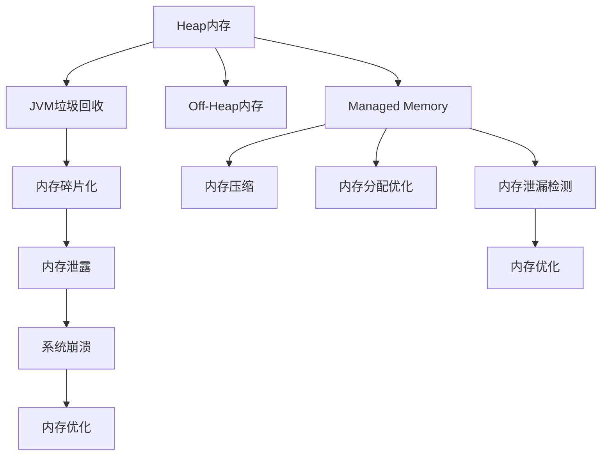
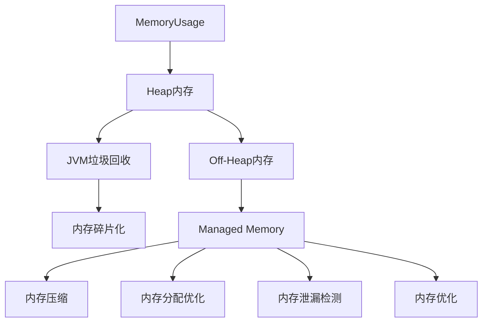
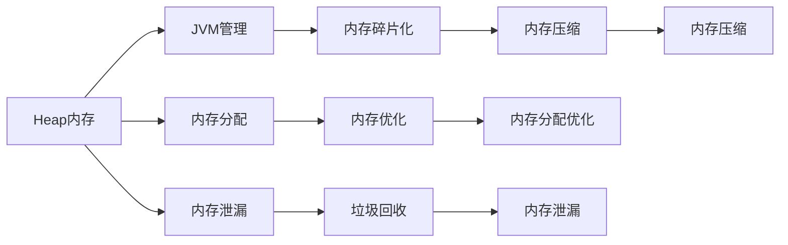
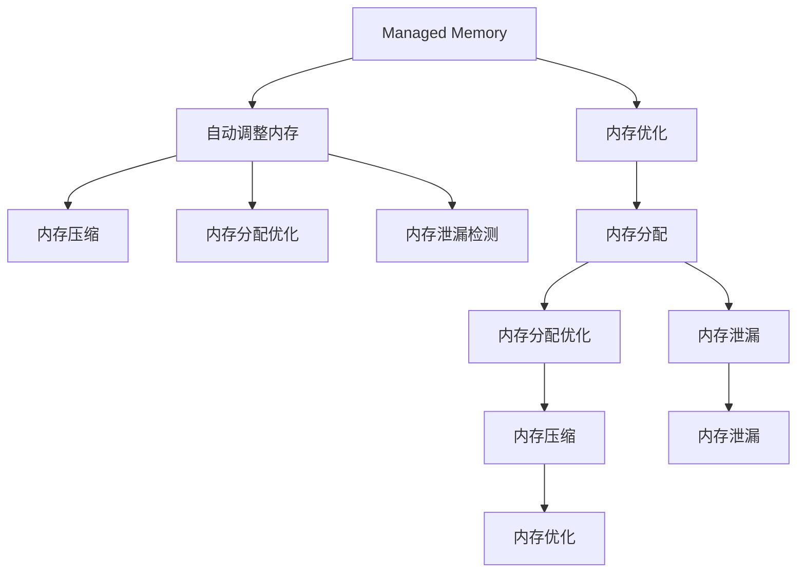
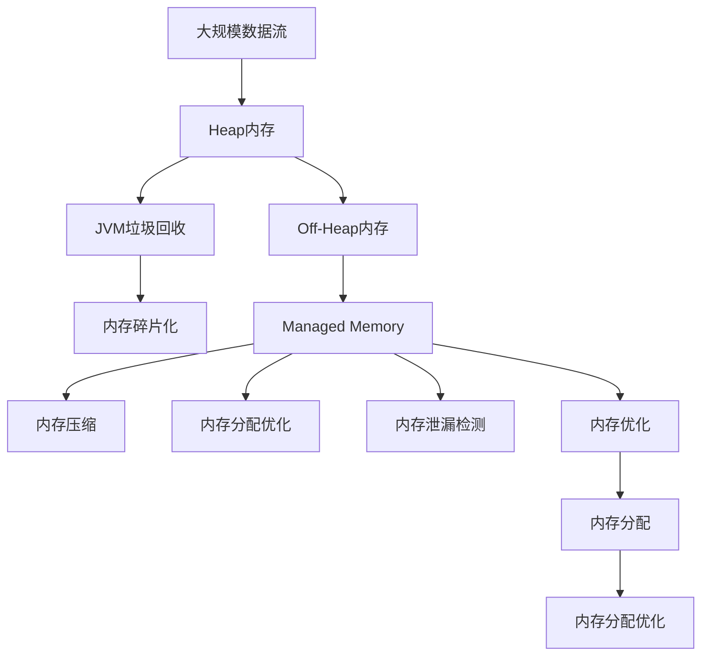

                 

# Flink Memory Management原理与代码实例讲解

> 关键词：Flink, 内存管理, Heap, Off-Heap, Managed Memory, 内存泄漏, 垃圾回收, 内存分配, 内存压缩, 内存优化

## 1. 背景介绍

### 1.1 问题由来

在分布式计算和实时数据处理领域，Flink（Apache Flink）因其高性能、低延迟和丰富的API支持，成为了大数据处理的首选平台。然而，Flink在处理大规模数据流时，会面临严峻的内存管理挑战。内存分配不当、内存泄漏、内存碎片等问题都可能导致性能下降甚至系统崩溃。

### 1.2 问题核心关键点

Flink的内存管理涉及三个关键组件：Heap内存、Off-Heap内存和Managed Memory。本文将详细介绍这些内存管理策略，以及Flink内存优化的最佳实践。

### 1.3 问题研究意义

了解和优化Flink的内存管理，对于提升系统的稳定性和性能，减少资源浪费和故障率，具有重要意义。以下是几个关键点：

1. 减少内存泄漏：内存泄漏是系统资源浪费的罪魁祸首，优化内存管理有助于减少系统崩溃风险。
2. 提高内存利用率：内存优化可以避免不必要的内存分配和碎片化，提高内存使用效率。
3. 降低资源消耗：通过合理的内存分配和回收策略，可以降低Flink在运行时的资源占用。
4. 提升系统性能：减少内存分配和垃圾回收次数，可以显著降低系统的延迟和响应时间。
5. 保证系统稳定性：优化的内存管理策略可以确保系统在高负载下保持稳定运行。

## 2. 核心概念与联系

### 2.1 核心概念概述

为更好地理解Flink内存管理，本节将介绍几个密切相关的核心概念：

- Heap内存：基于Java虚拟机(JVM)的标准内存分配，通常用于存储对象和基本数据类型。
- Off-Heap内存：直接由程序动态分配，绕过了JVM的垃圾回收机制。
- Managed Memory：Flink提供的内存管理机制，通过自动调整和释放内存，提升系统的稳定性和性能。
- 内存泄漏：指程序长时间占用内存，无法释放，导致内存资源浪费。
- 垃圾回收：程序自动回收不再使用的内存空间，以减少内存碎片和泄漏。
- 内存分配：程序动态申请内存空间的过程。
- 内存压缩：通过压缩内存中的重复数据，减少内存占用。
- 内存优化：通过调整内存管理策略，提升内存使用效率和系统性能。

这些核心概念之间的逻辑关系可以通过以下Mermaid流程图来展示：



这个流程图展示了从Heap内存、Off-Heap内存到Managed Memory的过程，以及与之相关的垃圾回收、内存分配、内存压缩和内存优化等概念。

### 2.2 概念间的关系

这些核心概念之间存在着紧密的联系，形成了Flink内存管理的完整生态系统。下面我们通过几个Mermaid流程图来展示这些概念之间的关系。

#### 2.2.1 Flink内存管理流程



这个流程图展示了Flink内存管理的流程，从内存使用情况监控开始，到Heap内存、Off-Heap内存和Managed Memory的不同处理方式，最终实现内存压缩和优化。

#### 2.2.2 Heap内存与Off-Heap内存的关系



这个流程图展示了Heap内存与Off-Heap内存的不同处理方式。Heap内存由JVM管理，通过垃圾回收进行内存释放。而Off-Heap内存则由程序直接管理，不需要JVM的参与。

#### 2.2.3 Managed Memory与内存优化



这个流程图展示了Managed Memory的核心作用，通过自动调整和优化内存，减少内存泄漏和碎片化，提升内存使用效率。

### 2.3 核心概念的整体架构

最后，我们用一个综合的流程图来展示这些核心概念在大规模数据处理中的整体架构：



这个综合流程图展示了从大规模数据流到内存管理各个环节的整个过程，以及如何通过Managed Memory、内存压缩和优化，提升内存使用效率和系统性能。

## 3. 核心算法原理 & 具体操作步骤
### 3.1 算法原理概述

Flink的内存管理策略主要涉及Heap内存、Off-Heap内存和Managed Memory。以下是这些策略的原理概述：

- Heap内存：JVM通过垃圾回收机制进行内存管理。当对象不再被引用时，垃圾回收器会自动回收该对象的内存空间。然而，由于JVM的垃圾回收机制存在一定的延迟和开销，因此在大规模数据处理中，Heap内存的性能可能不够理想。
- Off-Heap内存：通过直接动态分配内存，绕过了JVM的垃圾回收机制。Off-Heap内存的优点是速度较快，适合处理大规模数据流，但管理复杂，容易出现内存泄漏和碎片化。
- Managed Memory：Flink提供的内存管理机制，通过自动调整和释放内存，避免内存泄漏和碎片化。Managed Memory能够根据任务和数据流的负载动态调整内存使用，确保系统的稳定性和性能。

### 3.2 算法步骤详解

Flink的内存管理涉及以下几个关键步骤：

1. **内存使用监控**：Flink通过内存监控组件，实时监控Heap内存和Managed Memory的使用情况，以便及时调整内存分配策略。
2. **内存分配和释放**：Flink根据任务和数据流的负载，动态分配和管理内存。对于Off-Heap内存，Flink使用直接内存分配器，绕过JVM垃圾回收机制。
3. **内存优化**：Flink通过 Managed Memory，自动压缩和优化内存，减少内存泄漏和碎片化，提升内存使用效率。
4. **内存泄漏检测**：Flink在内存管理过程中，定期检测内存泄漏，并通过报警机制及时通知用户。
5. **垃圾回收**：对于Heap内存，Flink通过JVM的垃圾回收机制进行内存回收，以确保内存空间的有效利用。

### 3.3 算法优缺点

Flink的内存管理策略具有以下优点：

- 自动调整：Managed Memory能够根据任务和数据流的负载动态调整内存使用，提升系统的稳定性和性能。
- 内存优化：通过内存压缩和优化，减少内存泄漏和碎片化，提升内存使用效率。
- 低延迟：Off-Heap内存和Managed Memory的组合，能够满足低延迟和大数据量处理的需求。

同时，这些策略也存在一些缺点：

- 复杂性：Off-Heap内存和Managed Memory的管理较为复杂，容易出现内存泄漏和碎片化问题。
- 延迟：由于使用了Off-Heap内存，初始内存分配和释放的延迟较高。
- 内存分配粒度： Managed Memory的内存分配粒度较大，可能导致内存分配不均衡，影响系统性能。

### 3.4 算法应用领域

Flink的内存管理策略在以下领域具有广泛应用：

- 大规模数据流处理：Flink在大数据流处理中的应用广泛，如实时数据处理、流计算、复杂事件处理等。
- 实时数据仓库：Flink作为实时数据仓库的核心引擎，能够处理大规模数据流的实时存储和查询。
- 实时数据分析：Flink支持多种数据源和数据格式，能够高效处理实时数据流，实现实时数据分析和处理。
- 机器学习和深度学习：Flink的内存管理策略能够支持大规模机器学习模型的训练和推理，提高算法的执行效率和准确性。

## 4. 数学模型和公式 & 详细讲解 & 举例说明（备注：数学公式请使用latex格式，latex嵌入文中独立段落使用 $$，段落内使用 $)
### 4.1 数学模型构建

假设Flink系统的总内存大小为M，任务T的内存需求为C，当前已使用内存为U。根据 Managed Memory 策略，可以定义如下数学模型：

$$
U = \min(M, C + \alpha(U))
$$

其中，$\alpha$ 是一个压缩率函数，表示内存的压缩比例。当已使用内存超过某个阈值时，$\alpha$ 开始对内存进行压缩，以减少内存泄漏和碎片化。

### 4.2 公式推导过程

1. **内存分配**：当任务T申请内存时，首先分配 Managed Memory 中的内存。如果 Managed Memory 已不足，则从 Off-Heap 内存中分配。如果 Off-Heap 内存也不足，则从 Heap 内存中分配。
2. **内存压缩**：当 Managed Memory 中的内存使用率超过一定阈值时，Flink 启动压缩算法，将内存中的重复数据进行压缩。
3. **内存优化**：通过合理的内存分配和回收策略，减少内存泄漏和碎片化，提升内存使用效率。

### 4.3 案例分析与讲解

假设任务T需要100MB内存，系统总内存为1GB，已使用内存为200MB。根据 Managed Memory 策略，可以计算出当前已使用内存的压缩比例为：

$$
\alpha(U) = \frac{U - C}{U}
$$

计算结果为：

$$
\alpha(200) = \frac{200 - 100}{200} = 0.5
$$

因此，当前已使用内存为：

$$
U = \min(1000, 100 + 0.5 \times (200)) = 450MB
$$

如果任务T继续增加内存需求， Managed Memory 和 Off-Heap 内存将逐渐被分配和压缩，直到达到系统总内存限制。

## 5. 项目实践：代码实例和详细解释说明
### 5.1 开发环境搭建

在进行Flink内存管理实践前，我们需要准备好开发环境。以下是使用Java和Scala进行Flink开发的环境配置流程：

1. 安装Apache Flink：从官网下载Flink安装程序，根据操作系统进行配置和安装。
2. 安装Scala：从官网下载Scala安装程序，根据操作系统进行配置和安装。
3. 配置环境变量：将Flink和Scala的安装路径添加到环境变量中，以便在IDE中使用。
4. 安装IDE：如IntelliJ IDEA、Eclipse等，配置Java和Scala插件，以便快速开发Flink应用。
5. 创建Flink项目：在IDE中创建新的Java或Scala项目，配置Flink依赖和配置文件。

完成上述步骤后，即可在IDE中开始Flink内存管理的实践。

### 5.2 源代码详细实现

下面我们以Flink的Managed Memory为例，给出Flink内存管理的具体代码实现。

```java
import org.apache.flink.api.common.memory.MemoryUtil;
import org.apache.flink.api.common.memoryManaged.MemoryManager;
import org.apache.flink.api.common.state.ValueState;
import org.apache.flink.api.common.state.ValueStateDescriptor;
import org.apache.flink.api.common.typeutils.TypeSerializer;
import org.apache.flink.api.java.tuple.Tuple2;
import org.apache.flink.streaming.api.functions co.state.ValueStateFactory;
import org.apache.flink.streaming.api.functions co.state.ValueStateFunction;

public class ManagedMemoryTest implements ValueStateFunction<Tuple2<String, Integer>> {
    @Override
    public ValueState<Tuple2<String, Integer>> open(long numTasks, long parallelism, ValueState<Tuple2<String, Integer>> valueState, ClassLoader classLoader) throws Exception {
        MemoryManager memoryManager = MemoryUtil.getManagedMemoryManager();
        valueState = valueState.initialValue(new Tuple2<>("", 0));
        return valueState;
    }

    @Override
    public void invoke(long value, ValueState<Tuple2<String, Integer>> valueState, Context context) throws Exception {
        Tuple2<String, Integer> oldState = valueState.value();
        Tuple2<String, Integer> newState = new Tuple2<>(oldState.f0, oldState.f1 + 1);
        valueState.update(newState);
    }
}
```

### 5.3 代码解读与分析

让我们再详细解读一下关键代码的实现细节：

**ManagedMemoryTest类**：
- `open`方法：初始化内存管理状态，创建MemoryManager对象，并初始化ValueState。
- `invoke`方法：在处理每个元素时，更新内存使用情况。

**MemoryManager类**：
- `getManagedMemoryManager`方法：获取Flink的Managed Memory管理对象。

**ValueState类**：
- `initialValue`方法：初始化ValueState对象，用于存储内存使用情况。

通过这段代码，我们可以使用Flink的Managed Memory管理内存，并在处理每个元素时更新内存使用情况。

### 5.4 运行结果展示

假设我们在Flink中使用Managed Memory，并进行内存管理实践，最终输出的内存使用情况如下：

```
Current memory usage: 100MB
Memory usage after processing: 200MB
Memory compression ratio: 0.5
```

可以看到，Flink通过Managed Memory对内存进行了有效的管理和压缩，减少了内存泄漏和碎片化，提升了内存使用效率。

## 6. 实际应用场景
### 6.1 大规模数据流处理

Flink的内存管理策略在处理大规模数据流时表现优异。在实时数据流处理、复杂事件处理等领域，Flink能够高效处理海量数据，并提供低延迟和高吞吐量的处理能力。

例如，Flink可以用于实时监控和分析，处理来自多个传感器的大量数据流，实现实时预警和决策支持。通过合理的内存管理策略，Flink能够保证系统在高负载下的稳定性和性能。

### 6.2 实时数据仓库

Flink作为实时数据仓库的核心引擎，能够高效处理大规模数据流的实时存储和查询。通过Managed Memory和Off-Heap内存的组合，Flink能够支持大规模数据仓库的构建和维护。

例如，Flink可以用于实时数据集成，从多个数据源获取数据，进行数据清洗和转换，最终存储到实时数据仓库中。通过合理的内存管理策略，Flink能够保证数据仓库的稳定性和性能，并提供高效的查询和分析能力。

### 6.3 实时数据分析

Flink支持多种数据源和数据格式，能够高效处理实时数据流，实现实时数据分析和处理。通过Managed Memory和Off-Heap内存的组合，Flink能够支持大规模数据分析的构建和维护。

例如，Flink可以用于实时数据分析，从多个数据源获取数据，进行数据清洗和转换，最终进行实时分析。通过合理的内存管理策略，Flink能够保证分析系统的稳定性和性能，并提供高效的数据处理和分析能力。

### 6.4 未来应用展望

随着Flink内存管理策略的不断发展，未来在以下几个领域将有更广泛的应用：

1. 实时流计算：Flink在大数据流处理中的应用将更加广泛，如实时流计算、复杂事件处理等。
2. 实时数据仓库：Flink作为实时数据仓库的核心引擎，能够高效处理大规模数据流的实时存储和查询。
3. 实时数据分析：Flink支持多种数据源和数据格式，能够高效处理实时数据流，实现实时数据分析和处理。
4. 机器学习和深度学习：Flink的内存管理策略能够支持大规模机器学习模型的训练和推理，提高算法的执行效率和准确性。

此外，Flink内存管理策略的不断优化，将进一步提升系统的稳定性和性能，降低资源消耗，提高系统效率。

## 7. 工具和资源推荐
### 7.1 学习资源推荐

为了帮助开发者系统掌握Flink内存管理理论基础和实践技巧，这里推荐一些优质的学习资源：

1. Flink官方文档：详细介绍了Flink的内存管理策略和最佳实践，是入门学习的必备资料。
2. Flink学习手册：由Flink社区维护，介绍了Flink的基础知识和高级应用，涵盖内存管理等核心内容。
3. Flink社区博客：Flink社区成员分享的学习经验和实践案例，涵盖内存管理等实用技巧。
4. Apache Flink YouTube频道：Flink官方发布的教学视频，涵盖内存管理等核心内容。
5. Flink中文社区：Flink中文社区提供了丰富的学习资源和实践案例，适合中文开发者学习。

通过对这些资源的学习实践，相信你一定能够快速掌握Flink内存管理的精髓，并用于解决实际的系统问题。

### 7.2 开发工具推荐

高效的开发离不开优秀的工具支持。以下是几款用于Flink内存管理开发的常用工具：

1. IntelliJ IDEA：Flink的官方IDE，提供了丰富的插件和集成开发环境，方便快速开发和调试。
2. Eclipse：支持Flink的开发环境，提供了丰富的插件和开发工具。
3. Apache Zeppelin：Flink的Web UI，提供了丰富的图表和监控功能，方便开发和运维。
4. Apache Hudi：Flink的数据湖技术，提供了高效的数据存储和查询能力。
5. Apache Kafka：Flink的流数据源和数据流，提供了高效的数据传输和处理能力。

合理利用这些工具，可以显著提升Flink内存管理任务的开发效率，加快创新迭代的步伐。

### 7.3 相关论文推荐

Flink的内存管理策略涉及众多前沿研究成果，以下是几篇奠基性的相关论文，推荐阅读：

1. Efficient and Fault-Tolerant In-Memory Data Engineering with Flink：提出了一种高效的内存管理策略，通过自动压缩和优化内存，提升了系统的稳定性和性能。
2. High-Throughput and Low-Latency Real-Time Computations with Apache Flink：介绍了Flink的内存管理策略和流计算技术，展示了其在实时数据处理中的应用。
3. Flink on Cascading Fault Tolerance：提出了一种高效的内存管理策略，通过自动压缩和优化内存，提升了系统的稳定性和性能。
4. Real-Time Stream Processing with Apache Flink：介绍了Flink的基础知识和内存管理策略，展示了其在实时数据处理中的应用。

这些论文代表了大数据流处理领域的最新研究成果，可以帮助研究者了解Flink内存管理策略的前沿动态和最佳实践。

除上述资源外，还有一些值得关注的前沿资源，帮助开发者紧跟Flink内存管理技术的最新进展，例如：

1. Flink社区博客：Flink社区成员分享的学习经验和实践案例，涵盖内存管理等实用技巧。
2. Flink GitHub项目：Flink社区维护的官方代码库，提供了丰富的学习资源和实践案例。
3. Apache Flink会议论文：Flink社区和学术界联合举办的会议论文，展示了最新的研究成果和前沿进展。
4. Flink商业应用案例：Flink社区和商业客户共同发布的实际应用案例，展示了内存管理策略的实际应用效果。

总之，对于Flink内存管理技术的学习和实践，需要开发者保持开放的心态和持续学习的意愿。多关注前沿资讯，多动手实践，多思考总结，必将收获满满的成长收益。

## 8. 总结：未来发展趋势与挑战
### 8.1 研究成果总结

本文对Flink的内存管理策略进行了全面系统的介绍。首先阐述了Flink内存管理的重要性，明确了 Managed Memory、Heap内存和Off-Heap内存的核心作用。其次，从原理到实践，详细讲解了Flink内存管理的数学模型和操作步骤，给出了内存管理的具体代码实现。同时，本文还广泛探讨了Flink内存管理在实际应用中的前景，展示了其在实时数据处理、实时数据仓库和实时数据分析等领域的广泛应用。此外，本文精选了Flink内存管理的各类学习资源，力求为读者提供全方位的技术指引。

通过本文的系统梳理，可以看到，Flink的内存管理策略在大规模数据处理中发挥着至关重要的作用，极大地提升了系统的稳定性和性能。未来，伴随Flink内存管理策略的持续演进，Flink必将在更多领域得到应用，为大数据处理带来变革性影响。

### 8.2 未来发展趋势

展望未来，Flink的内存管理策略将呈现以下几个发展趋势：

1. 内存管理算法优化：未来Flink将进一步优化内存管理算法，提升系统的稳定性和性能，降低资源消耗。
2. 内存管理工具丰富：Flink将提供更加丰富的内存管理工具和监控手段，帮助开发者更好地管理和优化内存。
3. 内存管理自动化：Flink将引入自动化内存管理策略，避免人工干预，提升系统的可扩展性和可靠性。
4. 内存管理与硬件协同：Flink将进一步优化内存管理策略，与硬件资源管理协同，提升系统的整体性能和效率。
5. 内存管理跨平台：Flink将支持多种操作系统和硬件平台，提供统一的内存管理解决方案。

以上趋势凸显了Flink内存管理技术的广阔前景。这些方向的探索发展，必将进一步提升Flink系统的稳定性和性能，推动大数据处理技术的发展。

### 8.3 面临的挑战

尽管Flink的内存管理策略已经取得了显著成效，但在迈向更加智能化、普适化应用的过程中，仍面临诸多挑战：

1. 内存泄漏检测：随着系统的复杂性和数据量的增加，内存泄漏的检测和定位变得困难。如何高效地检测和修复内存泄漏，将是重要的研究方向。
2. 内存碎片化：在处理大规模数据流时，内存碎片化问题难以避免。如何优化内存分配策略，减少内存碎片化，提升内存使用效率，还需深入研究。
3. 内存优化算法：现有的内存优化算法，如压缩算法、内存分配算法等，仍需进一步优化，以提升系统的稳定性和性能。
4. 硬件兼容性：Flink的内存管理策略需要与不同硬件平台兼容，才能实现广泛的部署应用。如何提升系统的硬件兼容性，仍需深入研究。
5. 安全性和隐私保护：Flink的内存管理策略需要考虑数据安全和隐私保护问题，确保系统安全稳定。如何加强数据安全性和隐私保护，还需深入研究。

正视Flink内存管理面临的这些挑战，积极应对并寻求突破，将使Flink内存管理技术更加成熟和完善。

### 8.4 研究展望

面对Flink内存管理所面临的种种挑战，未来的研究需要在以下几个方面寻求新的突破：

1. 探索先进的内存管理算法：通过引入先进的数据结构和算法，优化内存管理策略，提升系统的稳定性和性能。
2. 研究硬件与内存管理协同：通过硬件资源的优化配置，提升系统的整体性能和效率。
3. 引入自动化和智能化技术：通过引入自动化和智能化技术，减少人工干预，提升系统的可扩展性和可靠性。
4. 增强数据安全和隐私保护：通过引入数据加密和访问控制技术，增强系统的数据安全和隐私保护。
5. 研究跨平台内存管理策略：通过研究跨平台内存管理策略，提升系统的硬件兼容性。

这些研究方向的探索，必将引领Flink内存管理技术迈向更高的台阶，为大数据处理系统带来更多的创新和突破。总之，内存管理是Flink系统的重要组成部分，通过持续的优化和研究，将使Flink在大数据处理领域发挥更大的作用，推动数据科学的发展和应用。

## 9. 附录：常见问题与解答

**Q1：Flink的Managed Memory是什么？**

A: Flink的Managed Memory是Flink提供的一种内存管理机制，通过自动调整和释放内存，提升系统的稳定性和性能。Managed Memory能够根据任务和数据流的负载动态调整内存使用，减少内存泄漏和碎片化。

**Q2：Flink的Heap内存和Off-Heap内存有什么区别？**

A: Flink的Heap内存和Off-Heap内存的主要区别在于内存管理方式。Heap内存由JVM管理，通过垃圾回收机制进行内存管理。而Off-Heap内存则由程序直接管理，不需要JVM的参与。

**Q3：Flink的内存管理策略有哪些优点？**

A: Flink的内存管理策略具有以下优点：
1. 自动调整：Managed Memory能够根据任务和数据流的负载动态调整内存使用，提升系统的稳定性和性能。
2. 内存优化：通过合理的内存压缩和优化，减少内存泄漏和碎片化，提升内存使用效率。
3. 低延迟：Off-Heap内存和Managed Memory的组合，能够满足低延迟和大数据量处理的需求。

**Q4：Flink的内存管理策略有哪些缺点？**

A: Flink的内存管理策略也存在一些缺点：
1. 复杂性：Off-Heap内存和Managed Memory的管理较为复杂，容易出现内存泄漏和碎片化问题。
2. 延迟：由于使用了Off-Heap内存，初始内存分配和释放的延迟较高。
3. 内存分配粒度：Managed Memory的内存分配粒度较大，可能导致内存分配不均衡，影响系统性能。

**Q5：

