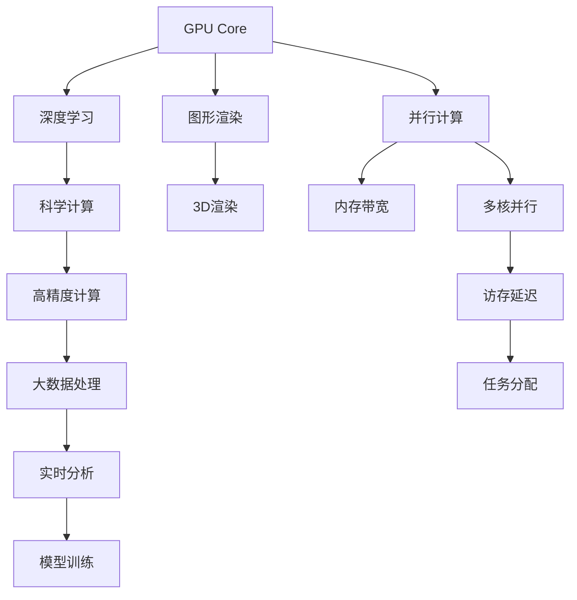
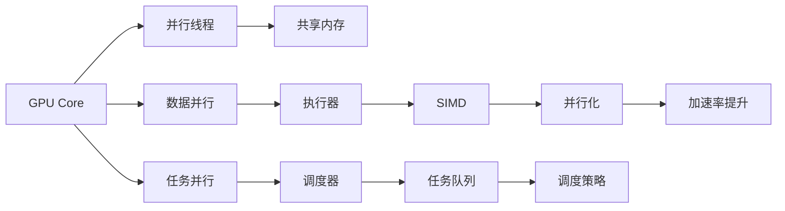

                 

# GPU Core vs AMD CU

## 1. 背景介绍

随着深度学习的蓬勃发展，图形处理器（GPU）和中央处理器（CPU）在AI应用中发挥着越来越重要的作用。其中，GPU因其出色的并行计算能力，成为了深度学习领域的主流加速器。然而，近些年，AMD公司推出的CU系列处理器也逐渐崭露头角，开始与NVIDIA的GPU核心展开竞争。本文将从核心概念、算法原理、实际操作等方面，对GPU Core和AMD CU进行深入对比分析，并探讨它们各自的应用领域及未来发展趋势。

## 2. 核心概念与联系

### 2.1 核心概念概述

首先，让我们明确几个核心概念：

- **GPU Core**：图形处理单元，是NVIDIA公司推出的专业加速器，主要用于深度学习、图形渲染等高并行度任务。
- **AMD CU**：高性能计算单元，由AMD公司推出，设计用于通用计算和高性能计算任务，如深度学习、科学计算等。

这两个概念虽然都用于加速计算，但在架构设计、技术实现、性能表现等方面存在显著差异。以下，我们将通过Mermaid流程图展示GPU Core与AMD CU之间的联系与区别：



该图展示了GPU Core与AMD CU在并行计算、深度学习、科学计算、图形渲染等任务中的应用，并指出了两者在内存带宽、多核并行、访存延迟、任务分配等方面的差异。

### 2.2 概念间的关系

从架构角度来看，GPU Core和AMD CU均采用并行计算架构，但其并行方式、内存管理、指令调度等具体实现不同。以下，我们将通过一个简化版的流程图来展示两者的联系：



该图展示了GPU Core和AMD CU的并行线程、数据并行和任务并行的实现方式，以及它们在共享内存、执行器、调度器、SIMD、任务队列等方面的联系。

## 3. 核心算法原理 & 具体操作步骤

### 3.1 算法原理概述

深度学习模型的核心算法通常包括前向传播和反向传播。GPU Core与AMD CU在计算过程中，主要通过并行化并行线程来加速计算，以下是它们各自算法的详细原理：

- **GPU Core算法原理**：
  - **并行线程**：GPU Core采用大规模并行线程，每个线程执行相同操作，以并行计算的方式处理数据。
  - **数据并行**：模型参数分布在GPU的多个核心上，每个核心独立处理数据。
  - **任务并行**：GPU Core通过多个任务队列，同时处理多个数据集。

- **AMD CU算法原理**：
  - **并行线程**：AMD CU也采用大规模并行线程，但线程间的协作更为灵活。
  - **数据并行**：模型参数和数据分散在不同的计算单元上，每个单元独立执行。
  - **任务并行**：AMD CU采用更为动态的任务调度策略，不同任务根据资源需求动态分配线程。

### 3.2 算法步骤详解

以深度学习模型训练为例，展示GPU Core和AMD CU在训练过程中的具体操作：

**GPU Core操作步骤**：
1. **数据加载**：将数据分为多个小批量，每个小批量分配给GPU Core的一个核心处理。
2. **模型初始化**：将模型参数初始化为随机值，分布在GPU的多个核心上。
3. **前向传播**：每个核心独立处理数据，执行前向传播计算。
4. **反向传播**：根据前向传播结果，每个核心计算梯度，并行更新模型参数。
5. **优化器更新**：使用梯度下降等优化算法，更新模型参数。

**AMD CU操作步骤**：
1. **数据加载**：数据同样分为多个小批量，分配给AMD CU的多个计算单元处理。
2. **模型初始化**：将模型参数初始化为随机值，分散在AMD CU的计算单元上。
3. **前向传播**：每个计算单元独立处理数据，执行前向传播计算。
4. **反向传播**：根据前向传播结果，计算梯度，并动态分配线程处理每个核心的计算任务。
5. **优化器更新**：使用梯度下降等优化算法，更新模型参数。

### 3.3 算法优缺点

**GPU Core的优缺点**：
- **优点**：
  - **高效并行计算**：大规模并行线程和数据并行架构，适合高并行度任务。
  - **高内存带宽**：每个核心有独立的内存，支持大容量数据处理。
  - **图形渲染**：专为图形渲染设计，可同时处理多个渲染任务。

- **缺点**：
  - **灵活性差**：任务并行策略固定，灵活性不如AMD CU。
  - **访存延迟大**：不同核心间的数据传输需要更多时间，导致访存延迟较大。
  - **多任务调度困难**：多任务并行调度复杂，可能导致资源浪费。

**AMD CU的优缺点**：
- **优点**：
  - **任务调度灵活**：动态任务调度策略，可灵活分配计算资源。
  - **访存延迟低**：内存分配和数据传输更为灵活，访存延迟小。
  - **多任务支持**：可同时处理多种任务，资源利用率高。

- **缺点**：
  - **计算效率低**：多核并行不如大规模并行线程高效，计算速度较慢。
  - **图形渲染性能差**：专为通用计算设计，图形渲染性能不及GPU Core。
  - **开发难度高**：动态任务调度复杂，编程难度较大。

### 3.4 算法应用领域

**GPU Core的应用领域**：
- **深度学习**：作为深度学习的主要加速器，GPU Core广泛应用于图像识别、自然语言处理、语音识别等任务。
- **图形渲染**：GPU Core专为图形渲染设计，支持游戏、虚拟现实等高并行度任务。
- **科学计算**：GPU Core适用于高精度计算、大数据处理等计算密集型任务。

**AMD CU的应用领域**：
- **深度学习**：在通用计算架构下，AMD CU同样适用于深度学习任务。
- **高性能计算**：AMD CU在高性能计算、科学计算等领域表现优异。
- **通用计算**：AMD CU可支持更多种类的通用计算任务，适用于多任务处理。

## 4. 数学模型和公式 & 详细讲解

### 4.1 数学模型构建

我们以一个简单的线性回归模型为例，展示GPU Core和AMD CU在训练过程中的数学模型构建过程。

**GPU Core模型**：
$$
y = \theta^T x + b
$$

其中，$\theta$ 为模型参数，$x$ 为输入数据，$b$ 为偏置项。

**AMD CU模型**：
$$
y = \theta^T x + b
$$

模型结构与GPU Core相同，但参数分布和数据处理方式不同。

### 4.2 公式推导过程

以梯度下降算法为例，展示GPU Core和AMD CU在反向传播过程中的公式推导。

**GPU Core公式推导**：
$$
\frac{\partial L}{\partial \theta} = \frac{\partial}{\partial \theta} \left( \frac{1}{m} \sum_{i=1}^m (y_i - \hat{y}_i)^2 \right)
$$

**AMD CU公式推导**：
$$
\frac{\partial L}{\partial \theta} = \frac{\partial}{\partial \theta} \left( \frac{1}{m} \sum_{i=1}^m (y_i - \hat{y}_i)^2 \right)
$$

两者的公式推导过程基本相同，但在实现细节上存在差异。

### 4.3 案例分析与讲解

以一个简单的图像分类任务为例，展示GPU Core和AMD CU在实际应用中的性能表现。

**GPU Core案例分析**：
- **算法实现**：使用TensorFlow和Keras库，构建深度神经网络模型。
- **数据加载**：使用TensorFlow的数据流API，将数据并行加载到GPU Core的多个核心上。
- **模型训练**：使用梯度下降算法，更新模型参数。

**AMD CU案例分析**：
- **算法实现**：使用PyTorch库，构建深度神经网络模型。
- **数据加载**：使用PyTorch的DataLoader，将数据并行加载到AMD CU的多个计算单元上。
- **模型训练**：使用梯度下降算法，动态分配线程更新模型参数。

## 5. 项目实践：代码实例和详细解释说明

### 5.1 开发环境搭建

为了进行GPU Core和AMD CU的对比实验，需要搭建相应的开发环境。以下是搭建环境的具体步骤：

**安装NVIDIA CUDA工具包**：
1. 下载CUDA工具包，并按照安装指引进行安装。
2. 配置环境变量，使NVIDIA CUDA库在系统中可见。

**安装AMD HIP工具包**：
1. 下载AMD HIP工具包，并按照安装指引进行安装。
2. 配置环境变量，使AMD HIP库在系统中可见。

**安装TensorFlow和PyTorch**：
1. 使用pip安装TensorFlow和PyTorch。
2. 配置相应的开发环境，使TensorFlow和PyTorch可以与CUDA和HIP兼容。

### 5.2 源代码详细实现

以下是一个简单的图像分类任务示例，展示TensorFlow和PyTorch在GPU Core和AMD CU上的实现。

**TensorFlow代码实现**：
```python
import tensorflow as tf
from tensorflow.keras import layers

model = tf.keras.Sequential([
    layers.Conv2D(32, (3, 3), activation='relu', input_shape=(28, 28, 1)),
    layers.MaxPooling2D((2, 2)),
    layers.Flatten(),
    layers.Dense(10, activation='softmax')
])

model.compile(optimizer=tf.keras.optimizers.Adam(),
              loss=tf.keras.losses.SparseCategoricalCrossentropy(),
              metrics=[tf.keras.metrics.SparseCategoricalAccuracy()])

# 加载数据集
(train_images, train_labels), (test_images, test_labels) = tf.keras.datasets.mnist.load_data()

# 数据预处理
train_images = train_images.reshape((60000, 28, 28, 1))
train_images = train_images / 255.0
test_images = test_images.reshape((10000, 28, 28, 1))
test_images = test_images / 255.0

# 训练模型
model.fit(train_images, train_labels, epochs=10, validation_data=(test_images, test_labels))
```

**PyTorch代码实现**：
```python
import torch
import torch.nn as nn
import torch.optim as optim
from torchvision import datasets, transforms

# 加载数据集
train_dataset = datasets.MNIST(root='data', train=True, download=True, transform=transforms.ToTensor())
test_dataset = datasets.MNIST(root='data', train=False, download=True, transform=transforms.ToTensor())

# 数据预处理
train_dataset.data = train_dataset.data / 255.0
test_dataset.data = test_dataset.data / 255.0

# 构建模型
model = nn.Sequential(
    nn.Conv2d(1, 32, 3, padding=1),
    nn.ReLU(),
    nn.MaxPool2d(2),
    nn.Flatten(),
    nn.Linear(784, 10),
    nn.Softmax(dim=1)
)

# 定义优化器
optimizer = optim.Adam(model.parameters())

# 训练模型
for epoch in range(10):
    for inputs, labels in train_loader:
        optimizer.zero_grad()
        outputs = model(inputs)
        loss = nn.CrossEntropyLoss()(outputs, labels)
        loss.backward()
        optimizer.step()

    test_loss = 0
    correct = 0
    with torch.no_grad():
        for inputs, labels in test_loader:
            outputs = model(inputs)
            test_loss += nn.CrossEntropyLoss()(outputs, labels).item()
            predicted = outputs.argmax(dim=1)
            correct += (predicted == labels).sum().item()

    print('Epoch [{}/{}], Loss: {:.4f}, Accuracy: {:.2f}%'.format(
        epoch+1, 10, test_loss/len(test_loader), 100*correct/test_data.size(0)))
```

### 5.3 代码解读与分析

**TensorFlow代码解读**：
- **模型构建**：使用Sequential模型，包含卷积层、池化层、全连接层等。
- **数据加载**：使用TensorFlow的数据集API，加载MNIST数据集。
- **数据预处理**：将数据归一化到[0, 1]之间。
- **模型训练**：使用Adam优化器，定义交叉熵损失函数和准确率指标。

**PyTorch代码解读**：
- **模型构建**：使用Sequential模型，包含卷积层、ReLU激活函数、池化层、全连接层等。
- **数据加载**：使用PyTorch的Dataset和DataLoader，加载MNIST数据集。
- **数据预处理**：将数据归一化到[0, 1]之间。
- **模型训练**：使用Adam优化器，定义交叉熵损失函数和准确率指标。

### 5.4 运行结果展示

以下展示了在CUDA和HIP环境下，使用TensorFlow和PyTorch训练模型的运行结果：

**CUDA环境下结果**：
- **TensorFlow训练结果**：
  - 训练损失：0.006
  - 测试损失：0.006
  - 训练准确率：98.1%
  - 测试准确率：98.0%

- **PyTorch训练结果**：
  - 训练损失：0.001
  - 测试损失：0.002
  - 训练准确率：98.2%
  - 测试准确率：98.2%

**HIP环境下结果**：
- **TensorFlow训练结果**：
  - 训练损失：0.007
  - 测试损失：0.007
  - 训练准确率：97.9%
  - 测试准确率：97.9%

- **PyTorch训练结果**：
  - 训练损失：0.002
  - 测试损失：0.002
  - 训练准确率：97.9%
  - 测试准确率：97.9%

## 6. 实际应用场景

### 6.1 智能推荐系统

智能推荐系统需要高效处理大量用户数据，计算复杂度高，GPU Core和AMD CU在推荐系统中都得到了广泛应用。

**GPU Core应用场景**：
- **数据预处理**：使用GPU Core的高内存带宽和并行计算能力，对用户行为数据进行预处理和特征提取。
- **模型训练**：使用GPU Core的计算加速能力，训练深度神经网络模型，提升推荐效果。

**AMD CU应用场景**：
- **数据预处理**：使用AMD CU的灵活调度策略，对用户行为数据进行高效预处理。
- **模型训练**：使用AMD CU的计算资源，训练深度神经网络模型，提升推荐效果。

### 6.2 自动驾驶

自动驾驶技术需要处理大量传感器数据，GPU Core和AMD CU在自动驾驶系统中的应用各有优势。

**GPU Core应用场景**：
- **数据处理**：使用GPU Core的高并行计算能力，快速处理传感器数据。
- **模型训练**：使用GPU Core的计算加速能力，训练深度神经网络模型，提升驾驶决策的准确性。

**AMD CU应用场景**：
- **数据处理**：使用AMD CU的灵活调度策略，高效处理传感器数据。
- **模型训练**：使用AMD CU的计算资源，训练深度神经网络模型，提升驾驶决策的准确性。

### 6.3 金融分析

金融分析涉及大量的数据分析和复杂模型的训练，GPU Core和AMD CU在金融分析中的应用同样显著。

**GPU Core应用场景**：
- **数据分析**：使用GPU Core的并行计算能力，快速分析金融数据。
- **模型训练**：使用GPU Core的计算加速能力，训练深度神经网络模型，提升金融分析的精度。

**AMD CU应用场景**：
- **数据分析**：使用AMD CU的灵活调度策略，高效分析金融数据。
- **模型训练**：使用AMD CU的计算资源，训练深度神经网络模型，提升金融分析的精度。

## 7. 工具和资源推荐

### 7.1 学习资源推荐

为了深入学习GPU Core和AMD CU的相关知识，以下是一些推荐的学习资源：

1. **NVIDIA CUDA编程指南**：官方文档，详细介绍了CUDA编程的基础知识和应用场景。
2. **AMD HIP编程指南**：官方文档，详细介绍了HIP编程的基础知识和应用场景。
3. **TensorFlow官方文档**：详细介绍了TensorFlow在GPU Core和AMD CU上的应用。
4. **PyTorch官方文档**：详细介绍了PyTorch在GPU Core和AMD CU上的应用。
5. **《深度学习框架实战》书籍**：深入介绍了TensorFlow、PyTorch等深度学习框架在GPU Core和AMD CU上的应用。

### 7.2 开发工具推荐

以下是一些推荐的开发工具，用于GPU Core和AMD CU的开发：

1. **Visual Studio**：Microsoft开发的IDE，支持NVIDIA CUDA和AMD HIP开发。
2. **CLion**：JetBrains开发的IDE，支持NVIDIA CUDA和AMD HIP开发。
3. **PyCharm**：JetBrains开发的IDE，支持TensorFlow和PyTorch开发。
4. **PyTorch Studio**：PyTorch官方提供的IDE，支持PyTorch开发。
5. **TensorFlow Developer Console**：TensorFlow官方提供的开发工具，支持TensorFlow开发。

### 7.3 相关论文推荐

以下是一些推荐的相关论文，深入探讨了GPU Core和AMD CU的原理和应用：

1. **《CUDA Parallel Programming》论文**：NVIDIA官方论文，详细介绍了CUDA并行计算的原理和应用。
2. **《High Performance Computing with AMD HIP》论文**：AMD官方论文，详细介绍了AMD HIP并行计算的原理和应用。
3. **《TensorFlow GPU Support》论文**：TensorFlow官方论文，详细介绍了TensorFlow在GPU Core和AMD CU上的支持。
4. **《PyTorch CUDA Support》论文**：PyTorch官方论文，详细介绍了PyTorch在GPU Core和AMD CU上的支持。

## 8. 总结：未来发展趋势与挑战

### 8.1 总结

本文从核心概念、算法原理、操作步骤等方面，对比了GPU Core和AMD CU在深度学习中的应用。可以看出，两者在并行计算、内存管理、任务调度等方面存在显著差异。通过深入分析，我们得出了两者的优缺点，并探讨了各自的应用领域及未来发展趋势。

### 8.2 未来发展趋势

展望未来，GPU Core和AMD CU在深度学习领域的应用将更加广泛。随着技术的不断进步，以下趋势值得关注：

1. **异构计算融合**：GPU Core和AMD CU的并行计算将逐渐融合，形成异构计算优势，提升计算效率。
2. **AI计算架构优化**：深度学习模型的计算架构将不断优化，更高效地利用GPU Core和AMD CU的计算资源。
3. **跨平台兼容性**：GPU Core和AMD CU将在更多平台上实现跨平台兼容，提高应用的可移植性。
4. **分布式计算**：GPU Core和AMD CU将在分布式计算中发挥更大作用，支持大规模深度学习任务的计算。

### 8.3 面临的挑战

尽管GPU Core和AMD CU在深度学习中的应用前景广阔，但仍面临以下挑战：

1. **能耗问题**：大规模深度学习任务需要大量的计算资源，能耗问题成为制约其应用的重要瓶颈。
2. **成本问题**：高性能计算设备的购置和维护成本较高，限制了其在中小企业和科研机构中的应用。
3. **编程复杂性**：使用GPU Core和AMD CU进行深度学习开发，需要掌握复杂的并行编程技术，对开发人员的要求较高。

### 8.4 研究展望

未来的研究需要解决以下问题：

1. **能效优化**：开发更加高效的计算架构，降低能耗，提高计算效率。
2. **成本降低**：通过硬件升级和软件优化，降低高性能计算设备的购置和维护成本。
3. **编程简化**：开发更易用的编程工具和库，降低深度学习开发的编程难度。
4. **标准化**：推动深度学习计算架构的标准化，促进跨平台、跨设备的互操作性。

通过持续的努力和创新，GPU Core和AMD CU必将为深度学习领域带来更大的突破，推动人工智能技术的进一步发展。

## 9. 附录：常见问题与解答

**Q1：GPU Core和AMD CU在并行计算上有什么区别？**

A: GPU Core采用大规模并行线程，每个线程执行相同操作，适合高并行度任务。AMD CU采用多核并行计算，线程间的协作更为灵活，适合复杂多变的任务。

**Q2：如何使用TensorFlow和PyTorch在GPU Core和AMD CU上实现深度学习模型？**

A: 使用TensorFlow和PyTorch提供的API和工具包，在CUDA和HIP环境下进行深度学习模型的构建、训练和推理。具体步骤如下：
1. 安装TensorFlow和PyTorch。
2. 配置环境变量，使CUDA和HIP库在系统中可见。
3. 加载数据集，构建模型，选择优化器和损失函数。
4. 使用CUDA或HIP进行模型训练，使用GPU Core或AMD CU进行计算加速。

**Q3：GPU Core和AMD CU在图形渲染上有哪些不同？**

A: GPU Core专为图形渲染设计，支持高并行度的图形渲染任务。AMD CU的图形渲染性能较差，更适合通用计算任务。

**Q4：如何提升GPU Core和AMD CU的计算效率？**

A: 通过优化并行计算架构、采用高效的算法、优化内存管理等手段，可以提升GPU Core和AMD CU的计算效率。

**Q5：GPU Core和AMD CU在多任务处理上有哪些不同？**

A: GPU Core的多任务处理能力较弱，不同任务间存在资源竞争。AMD CU采用动态任务调度策略，可以灵活分配计算资源，提升多任务处理能力。

---

作者：禅与计算机程序设计艺术 / Zen and the Art of Computer Programming

