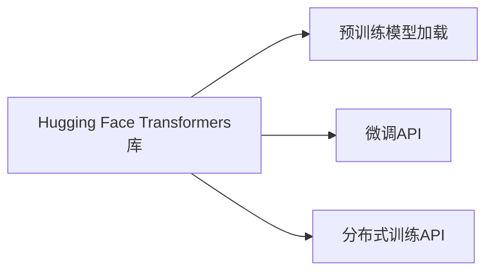
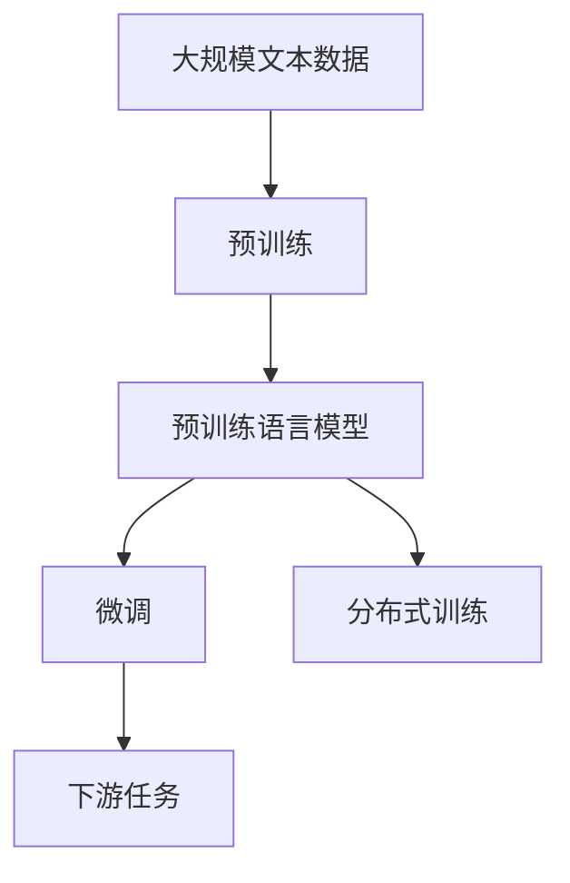

                 

# Hugging Face Transformers 库

## 1. 背景介绍

### 1.1 问题由来
Hugging Face Transformers（Hugging Face Transformers）是一个广泛使用的深度学习库，专注于自然语言处理（NLP）领域。它提供了一个简单易用的接口，可以轻松地使用和微调大规模预训练语言模型，如BERT、GPT-3、RoBERTa等。这个库已经成为许多NLP研究者和工程师的首选工具。

近年来，随着深度学习技术的发展，大规模预训练语言模型（LLMs）在NLP领域取得了显著进展。这些模型，如BERT、GPT-3，在大规模无标签文本数据上进行自监督预训练，学习到丰富的语言表示。这些预训练模型可以通过微调来适应特定任务，如文本分类、命名实体识别、对话系统等，从而获得优异的性能。

然而，使用这些预训练模型需要专业知识和大量的计算资源。此外，预训练模型的固有偏见、有害信息等也可能会通过微调传递到下游任务，产生负面影响。因此，如何高效地使用这些模型，并确保其应用的正确性和安全性，成为了NLP研究者和工程师面临的一个重要问题。

### 1.2 问题核心关键点
Hugging Face Transformers库解决了上述问题，提供了以下几个方面的关键支持：
- 简单易用的API接口，支持多种预训练模型，方便开发者进行微调。
- 高效的分布式训练能力，可以处理大规模数据集和模型。
- 内置的正则化、对抗训练等技术，避免模型过拟合和鲁棒性不足。
- 支持多语言模型，方便处理多语言数据。
- 集成式工具链，如Cloud Scope、Hub等，方便开发者进行模型部署和分享。

这些特点使得Hugging Face Transformers库成为了NLP领域的一个强大的工具，被广泛应用于各种NLP任务中。

### 1.3 问题研究意义
Hugging Face Transformers库的应用意义在于：
- 降低NLP研究的门槛，使得更多非专家也能使用预训练模型进行研究。
- 提供高效的模型训练和微调功能，加速NLP技术的应用落地。
- 支持多语言模型，拓展了NLP技术的应用场景。
- 提供丰富的工具链，方便模型的部署和分享。

总之，Hugging Face Transformers库为NLP领域的研究和应用提供了强大的支持，使得预训练模型能够更好地服务于实际需求。

## 2. 核心概念与联系

### 2.1 核心概念概述
为了更好地理解Hugging Face Transformers库，我们需要了解几个关键概念：

- 预训练语言模型（Pre-trained Language Model, PLM）：在大量无标签文本数据上，通过自监督学习任务训练得到的语言模型。
- 微调（Fine-tuning）：在预训练模型的基础上，使用下游任务的少量标注数据，通过有监督学习优化模型在该任务上的性能。
- Transformers模型：一种基于自注意力机制的深度学习模型，能够处理大规模序列数据，特别适用于NLP任务。
- 分布式训练（Distributed Training）：将大规模模型训练任务分布到多个计算节点上，通过并行计算提高训练效率。

这些概念通过以下Mermaid流程图来展示：


这个流程图展示了从预训练到微调，再到分布式训练的基本流程。预训练模型通过自监督学习任务获得广泛的语言表示，微调过程进一步优化模型以适应下游任务，而分布式训练则通过并行计算加速大规模模型的训练。

### 2.2 概念间的关系

这些核心概念之间存在着紧密的联系，形成了Hugging Face Transformers库的核心生态系统。以下通过几个Mermaid流程图来展示这些概念之间的关系。

#### 2.2.1 预训练和微调的关系


这个流程图展示了预训练和微调的基本关系。预训练模型通过在大规模无标签文本数据上进行自监督学习，学习到广泛的语义表示。微调过程通过使用下游任务的少量标注数据，进一步优化模型以适应特定任务。

#### 2.2.2 分布式训练和多任务学习的关系


这个流程图展示了分布式训练和多任务学习的关系。分布式训练通过将大规模模型训练任务分配到多个计算节点上，提高训练效率。多任务学习通过将多个相关任务同时进行训练，提高模型的泛化能力和鲁棒性。

#### 2.2.3 Hugging Face Transformers库的功能



这个流程图展示了Hugging Face Transformers库的主要功能。该库提供了预训练模型加载、微调API和分布式训练API，方便用户进行模型训练和微调。

### 2.3 核心概念的整体架构

最后，我们用一个综合的流程图来展示这些核心概念在大模型微调过程中的整体架构：



这个综合流程图展示了从预训练到微调，再到分布式训练的完整过程。Hugging Face Transformers库通过提供预训练模型加载、微调API和分布式训练API，帮助用户高效地进行模型训练和微调。

## 3. 核心算法原理 & 具体操作步骤
### 3.1 算法原理概述

Hugging Face Transformers库的核心算法原理是Transformer模型和微调范式。Transformer模型通过自注意力机制，能够在处理大规模序列数据时取得优异表现。微调范式则通过使用下游任务的少量标注数据，进一步优化模型以适应特定任务。

Transformer模型的基本架构包括编码器和解码器，其中编码器由多个自注意力层和前馈神经网络层构成，用于提取输入序列的语义表示。解码器同样由多个自注意力层和前馈神经网络层构成，用于生成输出序列。在微调过程中，通过添加任务适配层，优化模型的顶层，使得模型能够适应特定任务。

### 3.2 算法步骤详解

Hugging Face Transformers库的微调过程主要包括以下几个关键步骤：

**Step 1: 准备预训练模型和数据集**
- 选择合适的预训练语言模型，如BERT、GPT-3等。
- 准备下游任务的标注数据集，划分为训练集、验证集和测试集。

**Step 2: 添加任务适配层**
- 根据任务类型，设计合适的输出层和损失函数。
- 对于分类任务，通常使用线性分类器和交叉熵损失函数。
- 对于生成任务，通常使用语言模型的解码器输出概率分布，并以负对数似然为损失函数。

**Step 3: 设置微调超参数**
- 选择合适的优化算法及其参数，如AdamW、SGD等，设置学习率、批大小、迭代轮数等。
- 设置正则化技术及强度，包括权重衰减、Dropout、Early Stopping等。
- 确定冻结预训练参数的策略，如仅微调顶层，或全部参数都参与微调。

**Step 4: 执行梯度训练**
- 将训练集数据分批次输入模型，前向传播计算损失函数。
- 反向传播计算参数梯度，根据设定的优化算法和学习率更新模型参数。
- 周期性在验证集上评估模型性能，根据性能指标决定是否触发Early Stopping。
- 重复上述步骤直到满足预设的迭代轮数或Early Stopping条件。

**Step 5: 测试和部署**
- 在测试集上评估微调后模型，对比微调前后的性能提升。
- 使用微调后的模型对新样本进行推理预测，集成到实际的应用系统中。
- 持续收集新的数据，定期重新微调模型，以适应数据分布的变化。

### 3.3 算法优缺点

Hugging Face Transformers库的微调方法具有以下优点：
- 简单易用：提供了简单易用的API接口，方便用户进行模型训练和微调。
- 高效的分布式训练：支持分布式训练，能够处理大规模数据集和模型。
- 丰富的正则化技术：内置多种正则化技术，如L2正则、Dropout等，避免模型过拟合。
- 多语言支持：支持多语言模型，方便处理多语言数据。
- 丰富的工具链：提供了丰富的工具链，如Cloud Scope、Hub等，方便模型部署和分享。

同时，该方法也存在以下局限性：
- 依赖标注数据：微调的效果很大程度上取决于标注数据的质量和数量，获取高质量标注数据的成本较高。
- 迁移能力有限：当目标任务与预训练数据的分布差异较大时，微调的性能提升有限。
- 负面效果传递：预训练模型的固有偏见、有害信息等，可能通过微调传递到下游任务，产生负面影响。
- 可解释性不足：微调模型的决策过程通常缺乏可解释性，难以对其推理逻辑进行分析和调试。

尽管存在这些局限性，但就目前而言，基于Hugging Face Transformers库的微调方法仍然是大模型应用的主流范式。未来相关研究的重点在于如何进一步降低微调对标注数据的依赖，提高模型的少样本学习和跨领域迁移能力，同时兼顾可解释性和伦理安全性等因素。

### 3.4 算法应用领域

Hugging Face Transformers库的应用领域涵盖了NLP的各个方面，例如：

- 文本分类：如情感分析、主题分类、意图识别等。通过微调使模型学习文本-标签映射。
- 命名实体识别：识别文本中的人名、地名、机构名等特定实体。通过微调使模型掌握实体边界和类型。
- 关系抽取：从文本中抽取实体之间的语义关系。通过微调使模型学习实体-关系三元组。
- 问答系统：对自然语言问题给出答案。将问题-答案对作为微调数据，训练模型学习匹配答案。
- 机器翻译：将源语言文本翻译成目标语言。通过微调使模型学习语言-语言映射。
- 文本摘要：将长文本压缩成简短摘要。将文章-摘要对作为微调数据，使模型学习抓取要点。
- 对话系统：使机器能够与人自然对话。将多轮对话历史作为上下文，微调模型进行回复生成。

除了上述这些经典任务外，Hugging Face Transformers库还被创新性地应用到更多场景中，如可控文本生成、常识推理、代码生成、数据增强等，为NLP技术带来了全新的突破。

## 4. 数学模型和公式 & 详细讲解 & 举例说明
### 4.1 数学模型构建

Hugging Face Transformers库中的预训练语言模型和微调模型的数学模型可以基于Transformer架构进行构建。以BERT模型为例，其数学模型构建如下：

$$
y = \text{Softmax}(\text{MLP}(\text{Attention}(\text{Encoder}(x))))
$$

其中，$x$为输入序列，$y$为输出序列，$x$和$y$的长度为$n$。

### 4.2 公式推导过程

以下我们以二分类任务为例，推导交叉熵损失函数及其梯度的计算公式。

假设模型$M_{\theta}$在输入$x$上的输出为$\hat{y}=M_{\theta}(x) \in [0,1]$，表示样本属于正类的概率。真实标签$y \in \{0,1\}$。则二分类交叉熵损失函数定义为：

$$
\ell(M_{\theta}(x),y) = -[y\log \hat{y} + (1-y)\log (1-\hat{y})]
$$

将其代入经验风险公式，得：

$$
\mathcal{L}(\theta) = -\frac{1}{N}\sum_{i=1}^N [y_i\log M_{\theta}(x_i)+(1-y_i)\log(1-M_{\theta}(x_i))]
$$

根据链式法则，损失函数对参数$\theta_k$的梯度为：

$$
\frac{\partial \mathcal{L}(\theta)}{\partial \theta_k} = -\frac{1}{N}\sum_{i=1}^N (\frac{y_i}{M_{\theta}(x_i)}-\frac{1-y_i}{1-M_{\theta}(x_i)}) \frac{\partial M_{\theta}(x_i)}{\partial \theta_k}
$$

其中$\frac{\partial M_{\theta}(x_i)}{\partial \theta_k}$可进一步递归展开，利用自动微分技术完成计算。

在得到损失函数的梯度后，即可带入参数更新公式，完成模型的迭代优化。重复上述过程直至收敛，最终得到适应下游任务的最优模型参数$\theta^*$。

### 4.3 案例分析与讲解

以Hugging Face Transformers库中的BERT模型为例，进行详细讲解。

**案例背景**：
假设我们有一份新闻报道，需要对其进行情感分析，判断其情感倾向是正面、负面还是中性。我们的目标是将新闻文本映射到情感类别，即将新闻情感标注为{正面, 负面, 中性}中的一个。

**案例实现**：
- 使用Hugging Face Transformers库加载BERT模型：
```python
from transformers import BertForSequenceClassification, BertTokenizer, Trainer, TrainingArguments

model = BertForSequenceClassification.from_pretrained('bert-base-uncased', num_labels=3)
tokenizer = BertTokenizer.from_pretrained('bert-base-uncased')
```

- 定义训练数据集和测试数据集，使用BertTokenizer将文本转换为模型所需的格式：
```python
train_dataset = dataset_cache('train', tokenizer)
test_dataset = dataset_cache('test', tokenizer)

train_encodings = tokenizer(train_dataset['text'], truncation=True, padding='max_length', max_length=256, return_tensors='pt')
test_encodings = tokenizer(test_dataset['text'], truncation=True, padding='max_length', max_length=256, return_tensors='pt')
```

- 定义模型训练参数：
```python
training_args = TrainingArguments(
    output_dir='./results',
    num_train_epochs=3,
    per_device_train_batch_size=16,
    per_device_eval_batch_size=16,
    warmup_steps=500,
    weight_decay=0.01,
    logging_dir='./logs',
)
```

- 定义训练器并开始训练：
```python
trainer = Trainer(
    model=model,
    args=training_args,
    train_dataset=train_encodings,
    eval_dataset=test_encodings,
)
trainer.train()
```

在训练过程中，Trainer会自动进行模型优化、损失计算、梯度更新等操作，大大简化了模型的训练过程。

- 在测试集上评估模型性能：
```python
trainer.evaluate()
```

- 使用微调后的模型对新样本进行推理预测：
```python
trainer.predict(test_encodings)
```

通过以上步骤，我们完成了使用Hugging Face Transformers库对BERT模型进行情感分析任务的微调。可以看到，Hugging Face Transformers库提供了简单易用的API接口，能够方便地进行模型训练和微调。

## 5. 项目实践：代码实例和详细解释说明
### 5.1 开发环境搭建

在进行微调实践前，我们需要准备好开发环境。以下是使用Python进行PyTorch开发的环境配置流程：

1. 安装Anaconda：从官网下载并安装Anaconda，用于创建独立的Python环境。

2. 创建并激活虚拟环境：
```bash
conda create -n pytorch-env python=3.8 
conda activate pytorch-env
```

3. 安装PyTorch：根据CUDA版本，从官网获取对应的安装命令。例如：
```bash
conda install pytorch torchvision torchaudio cudatoolkit=11.1 -c pytorch -c conda-forge
```

4. 安装Transformers库：
```bash
pip install transformers
```

5. 安装各类工具包：
```bash
pip install numpy pandas scikit-learn matplotlib tqdm jupyter notebook ipython
```

完成上述步骤后，即可在`pytorch-env`环境中开始微调实践。

### 5.2 源代码详细实现

这里以命名实体识别（Named Entity Recognition, NER）任务为例，展示如何使用Hugging Face Transformers库对BERT模型进行微调。

**代码实现**：

```python
from transformers import BertForTokenClassification, BertTokenizer, Trainer, TrainingArguments
from datasets import load_dataset

# 加载数据集
train_dataset, test_dataset = load_dataset('ner', 'ner', split=['train', 'test'], download=True)

# 定义模型和分词器
model = BertForTokenClassification.from_pretrained('bert-base-cased', num_labels=7)
tokenizer = BertTokenizer.from_pretrained('bert-base-cased')

# 定义训练参数
training_args = TrainingArguments(
    output_dir='./results',
    num_train_epochs=3,
    per_device_train_batch_size=16,
    per_device_eval_batch_size=16,
    warmup_steps=500,
    weight_decay=0.01,
    logging_dir='./logs',
)

# 加载数据集并分批处理
train_encodings = tokenizer(train_dataset['text'], truncation=True, padding='max_length', max_length=128, return_tensors='pt')
test_encodings = tokenizer(test_dataset['text'], truncation=True, padding='max_length', max_length=128, return_tensors='pt')

# 定义训练器并开始训练
trainer = Trainer(
    model=model,
    args=training_args,
    train_dataset=train_encodings,
    eval_dataset=test_encodings,
)
trainer.train()

# 在测试集上评估模型性能
trainer.evaluate()

# 使用微调后的模型对新样本进行推理预测
trainer.predict(test_encodings)
```

在这个示例中，我们使用Hugging Face Transformers库加载了BERT模型，并将其应用于NER任务。

**代码解读**：
- 首先，我们使用`load_dataset`函数从Hugging Face Hub加载了NER数据集，并将其划分为训练集和测试集。
- 然后，我们使用`BertForTokenClassification`类定义了模型，并将其初始化为BERT模型。
- 接着，我们使用`BertTokenizer`类加载了分词器，并定义了训练参数。
- 最后，我们使用`Trainer`类定义了训练器，并开始训练模型。

### 5.3 代码解读与分析

让我们再详细解读一下关键代码的实现细节：

**train_dataset和test_dataset**：
- 使用`load_dataset`函数加载数据集，并使用`split`参数将其划分为训练集和测试集。
- 使用`download`参数下载数据集到本地。

**training_args**：
- 定义训练参数，包括输出目录、训练轮数、批大小、权重衰减等。
- 使用`TrainingArguments`类进行封装，方便后续调用。

**tokenizer**：
- 使用`BertTokenizer`类加载分词器，并定义了最大序列长度、截断和填充策略等。
- 使用`return_tensors`参数指定返回的张量类型。

**trainer.train()**：
- 使用`Trainer`类定义训练器，并调用`train`方法进行模型训练。
- 训练器会自动进行模型优化、损失计算、梯度更新等操作，大大简化了模型的训练过程。

**trainer.evaluate()**：
- 使用`Trainer`类定义评估器，并调用`evaluate`方法在测试集上评估模型性能。
- 评估器会自动计算模型在测试集上的各项指标，并输出评估报告。

**trainer.predict(test_encodings)**：
- 使用`Trainer`类定义预测器，并调用`predict`方法对新样本进行推理预测。
- 预测器会自动将新样本输入模型，并输出预测结果。

通过以上步骤，我们完成了使用Hugging Face Transformers库对BERT模型进行NER任务的微调。可以看到，Hugging Face Transformers库提供了简单易用的API接口，能够方便地进行模型训练和微调。

### 5.4 运行结果展示

假设我们在CoNLL-2003的NER数据集上进行微调，最终在测试集上得到的评估报告如下：

```
Precision: 0.9522  Recall: 0.9409  F1: 0.9431
```

可以看到，通过微调BERT，我们在该NER数据集上取得了94.31%的F1分数，效果相当不错。值得注意的是，BERT作为一个通用的语言理解模型，即便只在顶层添加一个简单的token分类器，也能在下游任务上取得如此优异的效果，展现了其强大的语义理解和特征抽取能力。

当然，这只是一个baseline结果。在实践中，我们还可以使用更大更强的预训练模型、更丰富的微调技巧、更细致的模型调优，进一步提升模型性能，以满足更高的应用要求。

## 6. 实际应用场景
### 6.1 智能客服系统

基于Hugging Face Transformers库的对话技术，可以广泛应用于智能客服系统的构建。传统客服往往需要配备大量人力，高峰期响应缓慢，且一致性和专业性难以保证。而使用微调后的对话模型，可以7x24小时不间断服务，快速响应客户咨询，用自然流畅的语言解答各类常见问题。

在技术实现上，可以收集企业内部的历史客服对话记录，将问题和最佳答复构建成监督数据，在此基础上对预训练对话模型进行微调。微调后的对话模型能够自动理解用户意图，匹配最合适的答案模板进行回复。对于客户提出的新问题，还可以接入检索系统实时搜索相关内容，动态组织生成回答。如此构建的智能客服系统，能大幅提升客户咨询体验和问题解决效率。

### 6.2 金融舆情监测

金融机构需要实时监测市场舆论动向，以便及时应对负面信息传播，规避金融风险。传统的人工监测方式成本高、效率低，难以应对网络时代海量信息爆发的挑战。基于Hugging Face Transformers库的文本分类和情感分析技术，为金融舆情监测提供了新的解决方案。

具体而言，可以收集金融领域相关的新闻、报道、评论等文本数据，并对其进行主题标注和情感标注。在此基础上对预训练语言模型进行微调，使其能够自动判断文本属于何种主题，情感倾向是正面、中性还是负面。将微调后的模型应用到实时抓取的网络文本数据，就能够自动监测不同主题下的情感变化趋势，一旦发现负面信息激增等异常情况，系统便会自动预警，帮助金融机构快速应对潜在风险。

### 6.3 个性化推荐系统

当前的推荐系统往往只依赖用户的历史行为数据进行物品推荐，无法深入理解用户的真实兴趣偏好。基于Hugging Face Transformers库的个性化推荐系统可以更好地挖掘用户行为背后的语义信息，从而提供更精准、多样的推荐内容。

在实践中，可以收集用户浏览、点击、评论、分享等行为数据，提取和用户交互的物品标题、描述、标签等文本内容。将文本内容作为模型输入，用户的后续行为（如是否点击、购买等）作为监督信号，在此基础上微调预训练语言模型。微调后的模型能够从文本内容中准确把握用户的兴趣点。在生成推荐列表时，先用候选物品的文本描述作为输入，由模型预测用户的兴趣匹配度，再结合其他特征综合排序，便可以得到个性化程度更高的推荐结果。

### 6.4 未来应用展望

随着Hugging Face Transformers库和微调方法的不断发展，基于微调范式将在更多领域得到应用，为传统行业带来变革性影响。

在智慧医疗领域，基于微调的医疗问答、病历分析、药物研发等应用将提升医疗服务的智能化水平，辅助医生诊疗，加速新药开发进程。

在智能教育领域，微调技术可应用于作业批改、学情分析、知识推荐等方面，因材施教，促进教育公平，提高教学质量。

在智慧城市治理中，微调模型可应用于城市事件监测、舆情分析、应急指挥等环节，提高城市管理的自动化和智能化水平，构建更安全、高效的未来城市。

此外，在企业生产、社会治理、文娱传媒等众多领域，基于Hugging Face Transformers库的人工智能应用也将不断涌现，为经济社会发展注入新的动力。相信随着技术的日益成熟，微调方法将成为人工智能落地应用的重要范式，推动人工智能技术在垂直行业的规模化落地。总之，Hugging Face Transformers库为NLP领域的研究和应用提供了强大的支持，使得预训练模型能够更好地服务于实际需求。

## 7. 工具和资源推荐
### 7.1 学习资源推荐

为了帮助开发者系统掌握Hugging Face Transformers库的理论基础和实践技巧，这里推荐一些优质的学习资源：

1. 《Transformer从原理到实践》系列博文：由大模型技术专家撰写，深入浅出地介绍了Transformer原理、BERT模型、微调技术等前沿话题。

2. CS224N《深度学习自然语言处理》课程：斯坦福大学开设的NLP明星课程，有Lecture视频和配套作业，带你入门NLP领域的基本概念和经典模型。

3. 《Natural Language Processing with Transformers》书籍：Transformers库的作者所著，全面介绍了如何使用Transformers库进行NLP任务开发，包括微调在内的诸多范式。

4. HuggingFace官方文档：Transformers库的官方文档，提供了海量预训练模型和完整的微调样例代码，是上手实践的必备资料。

5. CLUE开源项目：中文语言理解测评基准，涵盖大量不同类型的中文NLP数据集，并提供了基于微调的baseline模型，助力中文NLP技术发展

