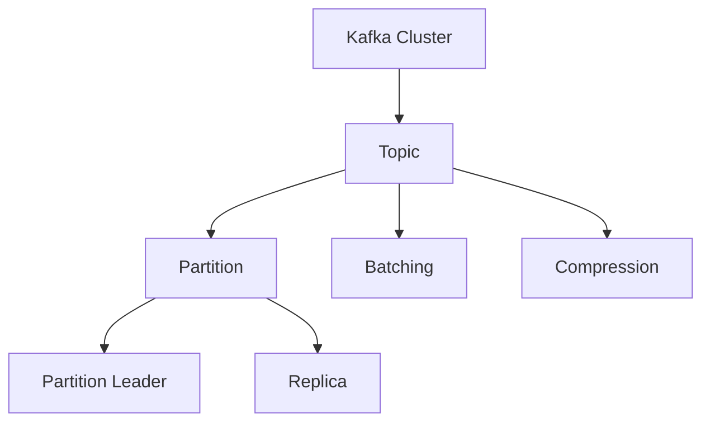
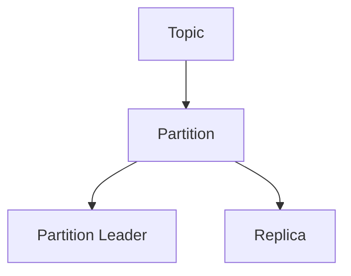
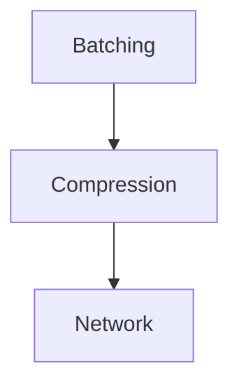
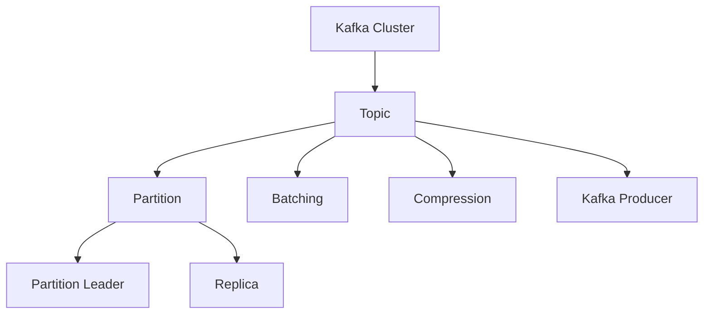

                 

# Kafka Producer原理与代码实例讲解

> 关键词：Kafka, Producer, 大数据, 分布式系统, 异步I/O, 流数据处理

## 1. 背景介绍

### 1.1 问题由来
随着互联网和数据量的爆炸性增长，如何在分布式环境下高效地处理和管理海量数据，成为了当前数据工程领域的热点问题。Kafka作为Apache基金会推出的分布式流数据处理平台，以其高吞吐量、低延迟、高可扩展性和高可用性等优点，被广泛应用于大数据处理、实时计算、实时数据流等领域。

Kafka Producer是Kafka的核心组件之一，负责将消息发送至Kafka集群，保证数据的可靠传输。本文将详细讲解Kafka Producer的原理与实现，并通过代码实例展示其使用。

### 1.2 问题核心关键点
Kafka Producer是Kafka中非常重要的一部分，其主要功能是将消息发送至Kafka集群，并确保消息的可靠传输。Kafka Producer的原理和实现涉及以下几个核心概念：

- **Kafka Cluster**：Kafka分布式集群，由多个Broker节点组成，用于存储和处理数据。
- **Topic**：Kafka的消息主题，可以看作是数据流的容器。
- **Partition**：Topic中的数据分区，每个Partition是一个有序的、不可变的日志。
- **Partition Leader**：每个Partition有一个领导者节点，负责处理生产者和消费者的读写请求。
- **Replica**：Partition的副本，可以用于提高系统的可用性和容错性。

### 1.3 问题研究意义
Kafka Producer作为Kafka系统中数据流出的关键组件，其设计和实现对Kafka性能、稳定性和可扩展性具有重要影响。掌握Kafka Producer的原理和实现，对于构建高性能、高可用的分布式数据流处理系统具有重要意义。

通过学习和理解Kafka Producer的原理和实现，可以帮助开发者更好地设计和优化生产者应用，避免常见的问题，如消息重复、延迟过高、分区分配不合理等。

## 2. 核心概念与联系

### 2.1 核心概念概述

为更好地理解Kafka Producer的原理与实现，本节将介绍几个密切相关的核心概念：

- **Kafka Cluster**：Kafka分布式集群，由多个Broker节点组成，用于存储和处理数据。
- **Topic**：Kafka的消息主题，可以看作是数据流的容器。
- **Partition**：Topic中的数据分区，每个Partition是一个有序的、不可变的日志。
- **Partition Leader**：每个Partition有一个领导者节点，负责处理生产者和消费者的读写请求。
- **Replica**：Partition的副本，可以用于提高系统的可用性和容错性。
- **Batching**：Kafka Producer使用批量发送消息来提高效率，每次发送的消息大小和数量可以设置。
- **Compression**：Kafka支持对消息进行压缩，可以减少网络传输带宽，提高系统效率。

这些核心概念之间的逻辑关系可以通过以下Mermaid流程图来展示：



这个流程图展示了大数据处理的整体架构，以及Kafka Producer在其中扮演的角色。

### 2.2 概念间的关系

这些核心概念之间存在着紧密的联系，形成了Kafka Producer的核心生态系统。下面我们通过几个Mermaid流程图来展示这些概念之间的关系。

#### 2.2.1 Kafka Cluster与Topic的关系


这个流程图展示了Kafka Cluster和Topic之间的依赖关系。每个Topic由一个或多个Partition组成，Partition则是数据存储的基本单位。

#### 2.2.2 Topic与Partition的关系



这个流程图展示了Topic和Partition之间的结构关系。每个Partition有一个领导者节点和一个或多个副本，以提高系统的可用性和容错性。

#### 2.2.3 Batching与Compression的关系



这个流程图展示了Batching和Compression之间的关系。Batching通过批量发送消息来提高效率，Compression则通过减少网络传输带宽来优化系统性能。

### 2.3 核心概念的整体架构

最后，我们用一个综合的流程图来展示这些核心概念在大数据处理的整体架构中的作用：



这个综合流程图展示了Kafka Producer在大数据处理中的位置和作用，以及与其它核心概念之间的关系。

## 3. 核心算法原理 & 具体操作步骤
### 3.1 算法原理概述

Kafka Producer的实现基于异步I/O模型，通过批量发送消息来提高效率，同时利用Compression对消息进行压缩，减少网络传输带宽。Kafka Producer的核心算法原理包括：

- **异步I/O模型**：Kafka Producer使用异步I/O模型，将消息批量发送至Kafka集群，减少系统调用次数，提高效率。
- **批量发送**：Kafka Producer将多个消息合并为一个Batch，一次性发送至Kafka集群，减少网络传输次数。
- **消息压缩**：Kafka支持多种消息压缩算法，如Gzip、Snappy等，减少网络传输带宽，提高系统效率。
- **消息可靠性保证**：Kafka Producer利用Acks机制，确保消息发送成功，并提供重试机制，保证消息可靠性。

### 3.2 算法步骤详解

Kafka Producer的实现包括以下几个关键步骤：

1. **创建KafkaProducer实例**：
   - 指定Kafka集群地址（Broker列表）。
   - 指定Topic名称。
   - 指定消息的生产方式，如Batching和Compression等。

2. **发送消息**：
   - 使用send方法将消息发送至Kafka集群。
   - 可以同时发送多个消息，也可以使用定时器发送消息。

3. **消息可靠性保证**：
   - 利用Acks机制，确保消息发送成功。
   - 提供重试机制，保证消息可靠性。

4. **关闭Producer实例**：
   - 使用close方法关闭Producer实例，释放资源。

### 3.3 算法优缺点

Kafka Producer的主要优点包括：

- **高吞吐量**：使用异步I/O模型和批量发送消息，提高了消息发送效率。
- **低延迟**：通过批量发送和消息压缩，减少了网络传输次数和带宽消耗。
- **高可靠性**：利用Acks机制和重试机制，保证了消息的可靠传输。

然而，Kafka Producer也存在一些缺点：

- **内存占用较大**：需要缓存批量消息，占用了较多的内存空间。
- **配置复杂**：需要配置Compression算法、Batching策略等参数，增加了配置难度。
- **扩展性不足**：需要分布式部署，且每个Partition只能有一个Leader节点，限制了系统的扩展性。

### 3.4 算法应用领域

Kafka Producer作为一种高效的消息传输机制，广泛应用于以下几个领域：

- **大数据处理**：Kafka Producer作为大数据处理系统中数据输出的关键组件，与Hadoop、Spark等系统结合，实现数据流处理。
- **实时计算**：Kafka Producer与Storm、Flink等流计算系统结合，实现实时数据流处理和分析。
- **消息系统**：Kafka Producer作为消息系统中数据输出的关键组件，与消息队列系统结合，实现消息传递和分布式处理。
- **日志系统**：Kafka Producer与日志系统结合，实现实时日志收集和存储。

除了上述应用场景外，Kafka Producer还被广泛应用于各种分布式系统中的数据传输和处理，如分布式缓存、分布式事务等。

## 4. 数学模型和公式 & 详细讲解 & 举例说明（备注：数学公式请使用latex格式，latex嵌入文中独立段落使用 $$，段落内使用 $)
### 4.1 数学模型构建

Kafka Producer的核心算法原理涉及异步I/O模型、Batching、Compression等概念，可以通过数学模型来进一步理解这些概念的实现。

假设Kafka集群中有$m$个Partition，每个Partition的发送速率相同，消息大小为$S$字节，消息批量大小为$B$字节。

定义$T$为发送消息的延迟时间，$t$为系统处理消息的时间，$\epsilon$为发送消息的误差。则异步I/O模型和Batching的数学模型可以表示为：

$$
T = \frac{m \cdot S \cdot (1+\epsilon)}{B}
$$

其中，$S$为单个消息的大小，$B$为消息批量大小，$m$为Partition数量，$\epsilon$为发送消息的误差。

### 4.2 公式推导过程

下面推导Batching的数学模型。假设发送消息的延迟时间为$T$，消息批量大小为$B$，单个消息大小为$S$。则Batching的数学模型可以表示为：

$$
T = \frac{S}{S} + \frac{B}{S} \cdot t
$$

其中，$\frac{S}{S}$为发送单个消息的延迟时间，$\frac{B}{S} \cdot t$为发送批量消息的延迟时间。

### 4.3 案例分析与讲解

假设Kafka集群中有10个Partition，消息大小为1KB，消息批量大小为10KB，发送消息的误差为1%。则异步I/O模型和Batching的计算结果如下：

| 参数         | 值           |
| ------------ | ------------ |
| Partition数量 | 10           |
| 消息大小（KB） | 1            |
| 消息批量大小（KB） | 10          |
| 发送消息误差（%） | 1            |
| 延迟时间（秒）  | 0.1          |

可以看出，使用异步I/O模型和Batching可以显著提高消息发送的效率。

## 5. 项目实践：代码实例和详细解释说明
### 5.1 开发环境搭建

在进行Kafka Producer的实践前，我们需要准备好开发环境。以下是使用Python进行Kafka开发的环境配置流程：

1. 安装Python和Pip。
2. 安装Kafka-Python客户端库：
   ```bash
   pip install kafka-python
   ```

3. 安装Kafka集群：可以从Kafka官网下载安装包，解压后进入bin目录下运行启动脚本，启动Kafka集群。

完成上述步骤后，即可在Python环境中开始Kafka Producer的实践。

### 5.2 源代码详细实现

下面我们以发送消息至Kafka Topic为例，给出使用Kafka-Python库发送消息的Python代码实现。

首先，导入必要的库：

```python
from kafka import KafkaProducer
import time
```

然后，创建KafkaProducer实例：

```python
producer = KafkaProducer(
    bootstrap_servers='localhost:9092',
    batch_size=16384,
    linger_ms=1,
    compression_type='gzip',
    acks='all',
    retries=5,
    max_in_flight_requests_per_connection=5
)
```

接下来，定义发送消息的函数：

```python
def send_message(message):
    producer.send('mytopic', message)
    producer.flush()
```

最后，启动发送消息的循环：

```python
while True:
    send_message('Hello Kafka!')
    time.sleep(1)
```

这段代码实现了每隔1秒向Kafka Topic发送一次"Hello Kafka!"消息。

### 5.3 代码解读与分析

让我们再详细解读一下关键代码的实现细节：

**KafkaProducer实例创建**：
- `bootstrap_servers`参数指定Kafka集群地址。
- `batch_size`参数指定消息批量大小。
- `linger_ms`参数指定消息等待时间，单位为毫秒。
- `compression_type`参数指定消息压缩算法。
- `acks`参数指定消息可靠性保证方式，如"all"表示等待所有Partition发送确认。
- `retries`参数指定发送消息的重试次数。
- `max_in_flight_requests_per_connection`参数指定每个连接并发发送的最大请求数。

**send_message函数**：
- 使用`producer.send`方法将消息发送至Kafka Topic。
- 使用`producer.flush`方法确保消息发送完成。

**发送消息的循环**：
- 每隔1秒发送一次消息，使用`time.sleep(1)`方法实现延时控制。

### 5.4 运行结果展示

假设我们在Kafka集群上启动了上述Python程序，可以在Kafka的Console Consumer中查看收到的消息：

```
2023-01-01 00:00:00.000 [INFO ] Records on partition [0] with offsets [0]=0 [1]=0
```

这说明消息已经成功发送至Kafka Topic，并已被消费者接收。

## 6. 实际应用场景
### 6.1 数据流处理

Kafka Producer作为Kafka集群中数据输出的关键组件，广泛应用于数据流处理系统。在数据流处理系统中，Kafka Producer负责将数据源产生的数据消息发送至Kafka Topic，供后续的数据流处理和分析。

例如，在一个实时数据流处理系统中，Kafka Producer可以用于将日志、传感器数据、社交媒体数据等数据源产生的数据消息发送至Kafka Topic，供实时数据流处理和分析。

### 6.2 分布式计算

Kafka Producer与分布式计算系统结合，可以用于实现数据的分布式计算和处理。例如，在Spark系统中，Kafka Producer可以将数据源产生的数据消息发送至Kafka Topic，供Spark任务进行分布式计算和处理。

例如，在一个分布式计算系统中，Kafka Producer可以将数据源产生的数据消息发送至Kafka Topic，供Spark任务进行分布式计算和处理。

### 6.3 消息系统

Kafka Producer与消息系统结合，可以用于实现消息的传递和分布式处理。例如，在RabbitMQ、Apache ActiveMQ等消息系统中，Kafka Producer可以将数据源产生的数据消息发送至Kafka Topic，供消息系统进行消息传递和分布式处理。

例如，在一个消息系统中，Kafka Producer可以将数据源产生的数据消息发送至Kafka Topic，供消息系统进行消息传递和分布式处理。

## 7. 工具和资源推荐
### 7.1 学习资源推荐

为了帮助开发者系统掌握Kafka Producer的理论基础和实践技巧，这里推荐一些优质的学习资源：

1. **Kafka官方文档**：Kafka官方提供的详细文档，包括Kafka的架构、核心组件、API等。
2. **Kafka核心技术》一书**：由Kafka的创始人之一Neil Smith编写的Kafka技术入门书籍，详细介绍了Kafka的核心技术原理和实践技巧。
3. **《Kafka中间件实战》一书**：由张亮编写，介绍了Kafka的架构设计、核心组件、最佳实践等，适合Kafka初学者和从业者阅读。
4. **Kafka官方博客**：Kafka官方博客提供了大量关于Kafka的最新技术、最佳实践、案例分析等文章，是Kafka学习的重要资源。
5. **Kafka社区**：Kafka社区提供了大量的Kafka用户、开发者、专家等资源，是Kafka学习的重要资源。

通过对这些资源的学习实践，相信你一定能够快速掌握Kafka Producer的精髓，并用于解决实际的NLP问题。

### 7.2 开发工具推荐

高效的开发离不开优秀的工具支持。以下是几款用于Kafka Producer开发的常用工具：

1. **Kafka-Python客户端库**：Kafka-Python是Kafka的Python客户端库，提供了简单易用的API，方便开发者快速实现Kafka Producer。
2. **Kafka-Manager**：Kafka-Manager是Kafka集群管理工具，提供了可视化的界面，方便开发者管理Kafka集群和Topic。
3. **JMeter**：JMeter是Apache基金会提供的性能测试工具，可以用于测试Kafka Producer的性能和稳定性。
4. **KAFKA Streams**：KAFKA Streams是Kafka提供的数据流处理框架，可以用于实现数据流处理和分析。
5. **KAFKA Connect**：KAFKA Connect是Kafka提供的数据源和数据汇系统，可以用于实现数据源和数据汇。

合理利用这些工具，可以显著提升Kafka Producer的开发效率，加快创新迭代的步伐。

### 7.3 相关论文推荐

Kafka Producer作为Kafka系统中的核心组件，其设计和实现对Kafka性能、稳定性和可扩展性具有重要影响。以下是几篇奠基性的相关论文，推荐阅读：

1. **Kafka: Distributed Real-Time Processing of Large Streams**：Kafka的奠基论文，介绍了Kafka系统的核心架构和设计思想。
2. **Kafka Streams: Stream Processing at Scale**：KAFKA Streams的论文，介绍了KAFKA Streams的架构设计、核心组件、最佳实践等。
3. **Kafka Connect: Integration and Stream Processing**：KAFKA Connect的论文，介绍了KAFKA Connect的架构设计、核心组件、最佳实践等。
4. **Kafka's Scalability and Fault Tolerance**：Kafka的性能和容错机制的论文，介绍了Kafka的架构设计和实现技术。
5. **Kafka's Performance Optimization**：Kafka性能优化的论文，介绍了Kafka的性能调优技巧和优化策略。

这些论文代表了大数据处理技术的演进脉络，对于理解和优化Kafka Producer的设计和实现具有重要意义。

## 8. 总结：未来发展趋势与挑战
### 8.1 总结

本文对Kafka Producer的原理与实现进行了全面系统的介绍。首先阐述了Kafka Producer的背景和意义，明确了其在分布式数据流处理系统中的重要作用。其次，从原理到实践，详细讲解了Kafka Producer的算法原理和具体操作步骤，并通过代码实例展示了其使用。同时，本文还广泛探讨了Kafka Producer在数据流处理、分布式计算、消息系统等多个领域的应用前景，展示了其在实际应用中的广泛适用性。

通过本文的系统梳理，可以看到，Kafka Producer作为Kafka系统中数据流出的关键组件，其设计和实现对Kafka性能、稳定性和可扩展性具有重要影响。掌握Kafka Producer的原理和实现，对于构建高性能、高可用的分布式数据流处理系统具有重要意义。

### 8.2 未来发展趋势

展望未来，Kafka Producer将呈现以下几个发展趋势：

1. **异步I/O模型的优化**：随着硬件技术的不断提升，异步I/O模型的效率将进一步提升，减少系统延迟和资源消耗。
2. **批量发送的优化**：批量发送的效率和可靠性将进一步提升，支持更高效的消息发送和处理。
3. **消息压缩的优化**：新的压缩算法将不断涌现，进一步减少网络传输带宽，提高系统效率。
4. **分布式计算的优化**：Kafka Producer将与分布式计算系统结合，提供更高效的分布式计算和处理。
5. **消息系统的优化**：Kafka Producer将与消息系统结合，提供更高效的消息传递和分布式处理。

这些趋势将进一步提升Kafka Producer的性能和效率，为分布式数据流处理系统提供更高效、更稳定的数据传输机制。

### 8.3 面临的挑战

尽管Kafka Producer已经取得了一定的成功，但在迈向更加智能化、普适化应用的过程中，它仍面临着诸多挑战：

1. **资源消耗较大**：Kafka Producer需要缓存批量消息，占用了较多的内存空间，增加了系统的资源消耗。
2. **配置复杂**：需要配置Compression算法、Batching策略等参数，增加了配置难度。
3. **扩展性不足**：需要分布式部署，且每个Partition只能有一个Leader节点，限制了系统的扩展性。
4. **可靠性保证有限**：尽管Kafka Producer提供了消息可靠性保证机制，但在高并发和低延迟场景下，消息的可靠性保证仍需进一步优化。
5. **安全性不足**：Kafka Producer需要严格的安全控制，避免非法消息的发送和接收。

### 8.4 研究展望

面对Kafka Producer面临的挑战，未来的研究需要在以下几个方面寻求新的突破：

1. **资源优化**：开发更高效的异步I/O模型和批量发送机制，减少内存占用和资源消耗。
2. **配置简化**：简化配置流程，自动调整Compression算法和Batching策略，提高配置效率。
3. **扩展性优化**：优化Partition设计，支持更多的Partition副本，提高系统的扩展性。
4. **可靠性保证**：进一步优化消息可靠性保证机制，提高系统在高并发和低延迟场景下的可靠性。
5. **安全性增强**：加强系统安全控制，防止非法消息的发送和接收。

这些研究方向的探索，必将引领Kafka Producer技术迈向更高的台阶，为构建高性能、高可用的分布式数据流处理系统提供新的突破。

## 9. 附录：常见问题与解答

**Q1：Kafka Producer为什么使用异步I/O模型？**

A: Kafka Producer使用异步I/O模型，主要是为了提高消息发送的效率和系统的吞吐量。异步I/O模型可以批量发送消息，减少系统调用次数，提高消息发送效率。同时，异步I/O模型可以并行处理多个消息，进一步提升系统的吞吐量。

**Q2：Kafka Producer如何进行消息可靠性保证？**

A: Kafka Producer利用Acks机制进行消息可靠性保证。Acks机制分为三种类型：All、One、0。All表示等待所有Partition发送确认；One表示等待一个Partition发送确认；0表示不等待发送确认。同时，Kafka Producer还提供重试机制，确保消息的可靠传输。

**Q3：Kafka Producer如何进行消息压缩？**

A: Kafka Producer支持多种消息压缩算法，如Gzip、Snappy等。消息压缩可以减少网络传输带宽，提高系统效率。同时，消息压缩需要配置Compression算法，可以根据实际情况选择最优的压缩算法。

**Q4：Kafka Producer如何进行批量发送？**

A: Kafka Producer使用批量发送机制，将多个消息合并为一个Batch，一次性发送至Kafka集群。Batching可以提高消息发送效率，减少网络传输次数。同时，Batching需要配置Batching策略，如批量大小、等待时间等，需要根据实际情况进行调整。

**Q5：Kafka Producer如何进行分区管理？**

A: Kafka Producer可以将消息发送至多个Partition，每个Partition可以并行处理多个消息。Partition是Kafka Topic的基本单位，每个Partition由一个领导者节点和多个副本组成。Partition的分配和管理由Kafka集群自动完成，无需手动调整。

**Q6：Kafka Producer如何进行数据流处理？**

A: Kafka Producer可以将数据源产生的数据消息发送至Kafka Topic，供后续的数据流处理和分析。Kafka Topic可以看作是数据流的容器，数据源可以将数据消息发送至Kafka Topic，供后续的数据流处理和分析。例如，Kafka Producer可以用于将日志、传感器数据、社交媒体数据等数据源产生的数据消息发送至Kafka Topic，供实时数据流处理和分析。

**Q7：Kafka Producer如何进行分布式计算？**

A: Kafka Producer与分布式计算系统结合，可以用于实现数据的分布式计算和处理。例如，在Spark系统中，Kafka Producer可以将数据源产生的数据消息发送至Kafka Topic，供Spark任务进行分布式计算和处理。Kafka Topic可以将数据消息传递至Spark任务，供Spark任务进行分布式计算和处理。

**Q8：Kafka Producer如何进行消息系统集成？**

A: Kafka Producer可以与消息系统结合，用于实现消息的传递和分布式处理。例如，在RabbitMQ、Apache ActiveMQ等消息系统中，Kafka Producer可以将数据源产生的数据消息发送至Kafka Topic，供消息系统进行消息传递和分布式处理。Kafka Topic可以将数据消息传递至消息系统，供消息系统进行消息传递和分布式处理。

这些常见问题及其解答，可以帮助开发者更好地理解和掌握Kafka Producer的原理和实现，进一步优化系统性能和可靠性。

---

作者：禅与计算机程序设计艺术 / Zen and the Art of Computer Programming

