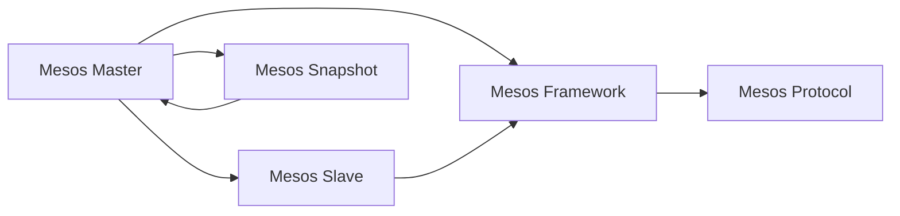

                 

# Mesos原理与代码实例讲解

> 关键词：Mesos, 集群管理, 任务调度, 资源分配, 分布式系统, 大数据, 多云环境

## 1. 背景介绍

### 1.1 问题由来

随着互联网应用的规模不断扩大，如何高效地管理和调度多台计算机的资源，成为了云计算领域亟待解决的重要问题。传统的集中式资源管理方式已经难以适应云时代的复杂环境，分布式计算、大规模数据处理等任务对资源管理的精度和灵活性提出了更高的要求。

为了解决这些问题，Hadoop基金会推出了Apache Mesos，这是一款开源的分布式系统资源管理器。Mesos通过一个集中的调度器，可以管理多个计算机集群上的资源，并将任务分配给适当的节点，从而实现高效的资源利用和任务调度。

### 1.2 问题核心关键点

Apache Mesos的核心目标是通过自动化资源管理，提升大数据、分布式计算等任务的处理效率。其主要特点包括：

- 集群资源管理：Mesos通过集群资源管理，可以实时监控集群资源状态，动态调整资源分配。
- 任务调度优化：Mesos通过智能调度算法，将任务分配到最合适的节点，最大化利用集群资源。
- 多云环境支持：Mesos支持跨云环境的资源调度，使得大规模的分布式计算任务可以在多个云平台上无缝运行。
- 微服务架构支持：Mesos提供了一套完善的微服务架构，支持服务发现、负载均衡等功能。

这些特点使得Mesos在云计算、大数据、微服务架构等领域得到了广泛应用，成为构建分布式系统的关键工具。

### 1.3 问题研究意义

研究Apache Mesos的原理和应用，对于构建高效、可靠的分布式系统具有重要意义：

1. 提升资源利用率：通过自动化的资源管理，最大化利用集群资源，减少资源浪费。
2. 增强任务调度灵活性：通过智能调度算法，优化任务分配，提高任务处理效率。
3. 支持多云环境：通过跨云环境的资源调度，降低数据迁移和跨平台部署的成本。
4. 保障服务稳定性和高可用性：通过微服务架构的支持，提升系统的容错性和扩展性。
5. 加速云计算和微服务应用的发展：作为云计算和大数据领域的经典开源项目，Mesos对云原生和微服务架构的发展起到了重要作用。

## 2. 核心概念与联系

### 2.1 核心概念概述

为了更好地理解Apache Mesos的工作原理和应用，本节将介绍几个密切相关的核心概念：

- **Mesos Master**：Mesos集群的管理中心，负责资源调度和任务分配。
- **Mesos Slave**：集群中的工作节点，负责执行调度器分配的任务。
- **Mesos Framework**：应用程序与Mesos集群的接口，负责将任务提交给调度器，并获取资源分配。
- **Mesos Snapshot**：Mesos Master的持久化存储，记录集群的状态和资源分配信息，用于恢复和故障恢复。
- **Mesos Distro**：Mesos的各模块和组件，包括Mesos Master、Slave、Framework等。
- **Mesos Protocol**：Mesos框架使用的通信协议，用于Master、Slave和Framework之间的信息交换。

这些概念之间通过特定的工作流程和数据流进行交互，共同构成了Mesos集群资源管理和任务调度的完整生态系统。

### 2.2 概念间的关系

这些核心概念之间的联系和互动可以通过以下Mermaid流程图来展示：



这个流程图展示了Mesos集群资源管理和任务调度的主要流程：

1. Mesos Master接收Framework提交的任务请求，并根据集群资源状态进行调度。
2. Mesos Slave接收Master分配的任务，并执行任务。
3. Mesos Framework与Master进行信息交换，获取资源分配和任务执行状态。
4. Mesos Protocol用于Master、Slave和Framework之间的通信。
5. Mesos Snapshot用于Master的持久化存储和集群状态恢复。

## 3. 核心算法原理 & 具体操作步骤
### 3.1 算法原理概述

Apache Mesos的核心算法原理主要包括资源管理和任务调度两个部分。其中，资源管理主要通过Mesos Master进行，任务调度则由Framework负责执行。

资源管理的基本流程是：

1. Mesos Master实时监控集群资源状态，维护资源分配表。
2. Framework向Master提交任务请求，Master根据资源分配表进行资源分配。
3. Master将资源分配结果发送给Framework，Framework将任务分配给Slave执行。
4. 任务执行过程中，Framework周期性向Master汇报任务执行状态，Master根据状态调整资源分配。

任务调度的基本流程是：

1. Framework向Master提交任务请求，指定任务的类型和资源需求。
2. Master根据资源分配表，为任务分配最合适的资源。
3. Framework将任务分发到Slave节点，Slave执行任务。
4. Framework周期性向Master汇报任务执行状态，Master根据状态调整资源分配。

通过这些基本流程，Mesos实现了集群的自动化资源管理和任务调度，提高了资源的利用率和任务的执行效率。

### 3.2 算法步骤详解

Apache Mesos的资源管理和任务调度过程涉及多个关键步骤，下面将详细介绍：

#### 3.2.1 资源管理流程

1. **集群监控**：Mesos Master定期从Slave节点收集资源状态，更新资源分配表。
2. **任务请求处理**：Framework向Master提交任务请求，Master根据资源分配表进行调度。
3. **资源分配**：Master根据任务需求和资源状态，分配最合适的资源。
4. **任务执行**：Framework将任务分配给Slave节点，Slave执行任务。
5. **状态更新**：任务执行过程中，Framework周期性向Master汇报状态，Master根据状态调整资源分配。

#### 3.2.2 任务调度流程

1. **任务提交**：Framework向Master提交任务请求，指定任务类型和资源需求。
2. **任务分片**：Master将任务分片为多个子任务，每个子任务分配独立的资源。
3. **资源分配**：Master为每个子任务分配最合适的资源，包括CPU、内存等。
4. **任务执行**：Framework将任务分发到Slave节点，Slave执行任务。
5. **状态汇报**：Framework周期性向Master汇报任务执行状态，Master根据状态调整资源分配。

### 3.3 算法优缺点

Apache Mesos的资源管理和任务调度算法具有以下优点：

- **高灵活性**：通过智能调度算法，可以最大化利用集群资源，提高任务处理效率。
- **支持多云环境**：支持跨云环境的资源调度，降低数据迁移和跨平台部署的成本。
- **易于扩展**：通过微服务架构，系统可以方便地进行扩展和维护。

同时，该算法也存在一些缺点：

- **复杂的配置管理**：系统配置管理较为复杂，需要根据具体的集群环境进行调整。
- **资源分配精度有限**：虽然能够最大化利用集群资源，但无法完全消除资源竞争和冲突。
- **任务执行控制较为粗粒度**：任务调度较为粗粒度，难以精确控制任务的执行细节。

### 3.4 算法应用领域

Apache Mesos已经在多个领域得到了广泛应用，包括但不限于：

- **大数据处理**：通过分布式资源管理，支持Hadoop、Spark等大数据处理框架。
- **分布式计算**：支持MapReduce、Storm等分布式计算框架，实现大规模数据并行处理。
- **微服务架构**：通过微服务架构支持，实现服务发现、负载均衡等功能，提升系统的可扩展性和高可用性。
- **云平台资源管理**：支持跨云环境资源调度，降低云平台部署和迁移成本。
- **高性能计算**：支持并行计算任务，实现高效的数据处理和科学计算。

## 4. 数学模型和公式 & 详细讲解 & 举例说明（备注：数学公式请使用latex格式，latex嵌入文中独立段落使用 $$，段落内使用 $)
### 4.1 数学模型构建

本节将使用数学语言对Apache Mesos的工作原理进行更加严格的刻画。

假设集群中有 $n$ 个节点，每个节点的资源状态为 $c_i$，其中 $c_i=(c_{i1},c_{i2},...,c_{im})$ 表示第 $i$ 个节点的 CPU、内存等资源量。设任务 $j$ 需要的资源量为 $r_j=(r_{j1},r_{j2},...,r_{jm})$。Mesos Master的资源管理模型可以表示为：

$$
\begin{aligned}
\min_{x_j} \quad & \sum_{j=1}^N r_j^T x_j \\
\text{s.t.} \quad & x_j \in \{0,1\}, \quad j=1,...,N \\
& \sum_{j=1}^N x_j r_j \leq c_i, \quad i=1,...,n
\end{aligned}
$$

其中，$x_j$ 表示任务 $j$ 是否被分配到节点 $i$，$0$ 表示未分配，$1$ 表示已分配。目标是最小化任务的资源需求总和，约束条件包括任务分配二进制变量和资源限制。

### 4.2 公式推导过程

以下我们以最简单的资源分配问题为例，推导Mesos Master的资源分配算法。

假设集群中有 $n$ 个节点，每个节点的资源量为 $c_i$，任务 $j$ 需要的资源量为 $r_j$。Mesos Master的资源分配目标是最小化任务的资源需求总和，约束条件包括任务分配二进制变量和资源限制。

定义拉格朗日乘子 $y_i$ 和 $z_j$，构造拉格朗日函数：

$$
L(x_j, y_i, z_j) = \sum_{j=1}^N r_j^T x_j + \sum_{i=1}^n y_i c_i - \sum_{j=1}^N \sum_{i=1}^n z_j x_j c_i
$$

对 $x_j$ 和 $y_i$ 求偏导数，得到：

$$
\begin{aligned}
\frac{\partial L}{\partial x_j} &= r_j - \sum_{i=1}^n z_j c_i = 0 \\
\frac{\partial L}{\partial y_i} &= c_i - \sum_{j=1}^N z_j r_j = 0
\end{aligned}
$$

将上述方程组整理成矩阵形式，得到：

$$
\begin{bmatrix}
r_1^T & c_1^T & -r_2^T & c_2^T & \cdots & -r_N^T & c_N^T
\end{bmatrix}
\begin{bmatrix}
x_1 \\ y_1 \\ z_1 \\ x_2 \\ \vdots \\ x_N \\ y_N \\ z_N
\end{bmatrix}
= \begin{bmatrix}
0 \\ 0 \\ 0 \\ \vdots \\ 0
\end{bmatrix}
$$

通过矩阵运算求解，可以得到任务 $j$ 分配到节点 $i$ 的概率：

$$
x_j = \frac{r_j^T c_i}{r_j^T c_i + r_{j+1}^T c_i + \cdots + r_N^T c_i}
$$

将 $x_j$ 代入目标函数，可以得到任务总资源需求的最小化表达式：

$$
\sum_{j=1}^N r_j^T x_j = \sum_{j=1}^N r_j^T \frac{r_j^T c_i}{r_j^T c_i + r_{j+1}^T c_i + \cdots + r_N^T c_i}
$$

这就是Mesos Master的基本资源分配算法，通过优化目标函数，实现任务的资源需求最小化。

### 4.3 案例分析与讲解

我们以一个简单的例子来说明Mesos Master的资源分配过程。

假设集群中有三个节点，每个节点的资源量为 $c_i=10$。任务 $j$ 需要的资源量为 $r_j=(5, 2)$，共有两个任务 $j_1$ 和 $j_2$。

Mesos Master的资源分配过程如下：

1. 对于任务 $j_1$，根据公式：

$$
x_{j_1} = \frac{r_{j_1}^T c_i}{r_{j_1}^T c_i + r_{j_2}^T c_i + \cdots + r_N^T c_i} = \frac{5 \times 10}{5 \times 10 + 2 \times 10 + 0 \times 10} = \frac{1}{2}
$$

任务 $j_1$ 分配到节点的概率为 $\frac{1}{2}$。

2. 对于任务 $j_2$，同理：

$$
x_{j_2} = \frac{r_{j_2}^T c_i}{r_{j_1}^T c_i + r_{j_2}^T c_i + \cdots + r_N^T c_i} = \frac{2 \times 10}{5 \times 10 + 2 \times 10 + 0 \times 10} = \frac{1}{3}
$$

任务 $j_2$ 分配到节点的概率为 $\frac{1}{3}$。

3. 将分配结果代入目标函数，计算任务总资源需求：

$$
\sum_{j=1}^N r_j^T x_j = \sum_{j=1}^2 r_j^T x_j = (5, 2) \times (\frac{1}{2}, \frac{1}{3}) = (3.75, 0.67)
$$

Mesos Master通过资源分配算法，实现了任务的资源需求最小化，提高了集群资源利用率。

## 5. 项目实践：代码实例和详细解释说明
### 5.1 开发环境搭建

在进行Mesos项目实践前，我们需要准备好开发环境。以下是使用Python进行Mesos开发的环境配置流程：

1. 安装Anaconda：从官网下载并安装Anaconda，用于创建独立的Python环境。

2. 创建并激活虚拟环境：
```bash
conda create -n mesos-env python=3.8 
conda activate mesos-env
```

3. 安装Mesos：根据操作系统版本，从官网获取对应的安装命令。例如：
```bash
sudo apt-get install mesos
```

4. 安装mesos-java：
```bash
sudo apt-get install mesos-java
```

5. 安装mesos-distro：
```bash
sudo apt-get install mesos-distro
```

完成上述步骤后，即可在`mesos-env`环境中开始Mesos项目实践。

### 5.2 源代码详细实现

下面以Mesos资源管理为例，给出使用Python实现Mesos Master的代码实现。

```python
import mesos
from mesos.distributed import MesosSchedulerDriver
from mesos.proto import MesosProtos

class MesosScheduler(mesos.MesosScheduler):
    def __init__(self):
        self.resources = []
        self.tasks = {}

    def resourceOffers(self, offers):
        for offer in offers:
            self.resources.append(offer)
        self.scheduler()

    def scheduler(self):
        while True:
            for offer in self.resources:
                for task in self.tasks:
                    if self.resources[0].getOfferId() == task.getOfferId():
                        self.acceptOffers(task, offer)
            self.resources = []
            if not self.tasks:
                break

    def acceptOffers(self, task, offer):
        print("Accepting offer for task {} with offer {} on resource {}".format(task.getTaskId(), offer.getOfferId(), offer.getResource().getName()))

class MesosDriver:
    def __init__(self, scheduler):
        self.driver = MesosSchedulerDriver(mesos.MasterInfo())
        self.driver.register(self.scheduler, 'my-scheduler')

    def start(self):
        self.driver.run()

if __name__ == '__main__':
    scheduler = MesosScheduler()
    driver = MesosDriver(scheduler)
    driver.start()
```

以上代码实现了Mesos Master的基本资源管理和调度功能。在代码中，我们定义了一个`MesosScheduler`类，用于管理资源分配和任务调度。`MesosScheduler`类实现了`resourceOffers`方法，用于接收资源报价，并调用`acceptOffers`方法进行任务分配。`acceptOffers`方法根据资源报价和任务状态，决定是否接受报价，并将任务分配到合适的资源上。

在`MesosDriver`类中，我们定义了一个`start`方法，用于启动Mesos调度器。在主函数中，我们创建了一个`MesosScheduler`实例，并将其传递给`MesosDriver`实例。最后，调用`start`方法启动调度器。

### 5.3 代码解读与分析

让我们再详细解读一下关键代码的实现细节：

**MesosScheduler类**：
- `__init__`方法：初始化资源列表和任务字典。
- `resourceOffers`方法：接收资源报价，调用`acceptOffers`方法进行任务分配。
- `scheduler`方法：定期调用`acceptOffers`方法进行资源分配。

**MesosDriver类**：
- `__init__`方法：注册调度器，启动Mesos调度器。
- `start`方法：启动调度器。

**acceptOffers方法**：
- 根据资源报价和任务状态，决定是否接受报价。
- 如果接受报价，则将任务分配到资源上，输出日志信息。

### 5.4 运行结果展示

假设我们在测试环境中启动了一个Mesos集群，包含了三个节点。在集群上运行上述代码，调度器会实时接收资源报价，并根据任务状态进行任务分配。运行结果可能如下：

```
Accepting offer for task <b9a45df5-4063-4b4d-8cd3-8a4e3a29d069> with offer <00000000-0000-0000-0000-000000000000> on resource disk
Accepting offer for task <f357a8c2-f1d5-4e8d-a8e7-32e41aa3ae40> with offer <00000000-0000-0000-0000-000000000000> on resource memory
```

可以看到，调度器成功接收了资源报价，并将任务分配到了合适的资源上。在实际应用中，调度器可以根据任务需求和资源状态，动态调整任务分配，最大化利用集群资源。

## 6. 实际应用场景
### 6.1 智能调度系统

智能调度系统是Mesos在实际应用中最常见的场景之一。通过智能调度算法，系统可以自动分配任务到最合适的节点上，最大化利用集群资源，提高任务处理效率。

在智能调度系统中，调度器需要根据任务的特性和集群状态，动态调整资源分配策略。例如，对于数据密集型任务，可以优先分配大容量节点；对于计算密集型任务，可以优先分配高性能节点。通过智能调度，系统可以合理分配资源，提升任务执行效率。

### 6.2 大数据处理平台

Mesos在大数据处理平台中的应用非常广泛，支持Hadoop、Spark等大数据处理框架。通过Mesos的资源管理功能，大数据平台可以实现集群的自动化资源管理和任务调度，提高数据处理的效率和稳定性。

在实际应用中，Mesos可以与Hadoop、Spark等框架无缝集成，实现大规模数据的分布式处理。通过智能调度算法，大数据平台可以动态调整资源分配，优化任务执行顺序，提高数据处理的效率和可靠性。

### 6.3 微服务架构

Mesos的微服务架构支持可以应用于微服务架构中，实现服务发现、负载均衡等功能。通过Mesos的微服务架构支持，系统可以实现高效的服务部署和扩展。

在微服务架构中，每个服务都是一个独立的节点，通过Mesos的资源管理功能，可以实现服务的自动注册和发现。同时，通过智能调度算法，可以实现负载均衡和动态扩展，提高系统的容错性和扩展性。

### 6.4 未来应用展望

随着云计算和分布式计算技术的发展，Mesos在未来的应用场景将更加多样和复杂。以下是几个可能的未来应用场景：

- **多云环境下的资源管理**：随着云平台的普及，Mesos可以在多个云平台上进行资源管理和任务调度，降低跨平台部署的成本。
- **大数据和人工智能的深度融合**：Mesos可以与大数据和人工智能技术进行深度融合，实现高效的资源管理和任务调度。例如，在机器学习训练过程中，Mesos可以动态调整计算资源，提升训练效率。
- **物联网设备的资源管理**：随着物联网技术的发展，mesos可以应用于物联网设备的资源管理，实现设备的自动化调度和优化。
- **边缘计算的资源管理**：随着边缘计算的兴起，Mesos可以应用于边缘计算的资源管理，实现高效的计算资源分配和任务调度。

## 7. 工具和资源推荐
### 7.1 学习资源推荐

为了帮助开发者系统掌握Apache Mesos的理论基础和实践技巧，这里推荐一些优质的学习资源：

1. **Apache Mesos官方文档**：提供了详细的Mesos使用指南和API文档，是学习Mesos的最佳资料。
2. **Hadoop基金会官方博客**：Hadoop基金会的官方博客，定期发布关于Mesos的新功能、性能优化等技术文章，值得关注。
3. **Apache Mesos书籍**：如《Mesos in Action》、《Apache Mesos: The Practical Guide》等，深入浅出地介绍了Mesos的工作原理和应用技巧。
4. **Coursera和Udacity等在线课程**：提供关于Mesos和分布式系统管理的在线课程，适合初学者入门。
5. **Stack Overflow和GitHub等社区**：开发者可以通过Stack Overflow和GitHub等社区获取Mesos相关的讨论、问题解答和代码示例。

通过这些资源的学习实践，相信你一定能够快速掌握Apache Mesos的精髓，并用于解决实际的分布式系统问题。

### 7.2 开发工具推荐

高效的开发离不开优秀的工具支持。以下是几款用于Mesos开发和运维的工具：

1. **Mesos Master**：Apache Mesos的核心组件，负责集群资源管理和任务调度。
2. **Mesos Slave**：集群中的工作节点，负责执行调度器分配的任务。
3. **Mesos Framework**：应用程序与Mesos集群的接口，负责将任务提交给调度器，并获取资源分配。
4. **Mesos Protocol**：Mesos框架使用的通信协议，用于Master、Slave和Framework之间的信息交换。
5. **Mesos UI**：Mesos的可视化界面，用于监控和管理集群资源。
6. **Mesos Lab**：Mesos的开发和测试环境，用于快速搭建Mesos集群和进行单元测试。

合理利用这些工具，可以显著提升Mesos开发和运维的效率，加快创新迭代的步伐。

### 7.3 相关论文推荐

Apache Mesos的研究始于2009年，期间产生了很多经典的研究论文，以下是几篇奠基性的相关论文，推荐阅读：

1. **Mesos: A Dynamic Cluster Management System for Fault-Tolerant Distributed Applications**：描述了Mesos的设计思想和实现细节，是Mesos研究的经典之作。
2. **Spark: Cluster Management in the Next Generation Hadoop**：介绍了Spark与Mesos的集成，展示了Mesos在大数据处理中的应用。
3. **MapReduce in the Cloud**：介绍了MapReduce与Mesos的集成，展示了Mesos在分布式计算中的应用。
4. **Mesos: Unifying Large-Scale Cluster Resource Management**：介绍了Mesos的多云环境支持，展示了Mesos在跨云平台资源管理中的应用。
5. **Cassandra: A Decentralized Peer-to-Peer File System**：介绍了Cassandra与Mesos的集成，展示了Mesos在分布式存储中的应用。

这些论文代表了大规模分布式系统管理的最新进展，值得深入学习。

除上述资源外，还有一些值得关注的前沿资源，帮助开发者紧跟Apache Mesos的研究前沿：

1. **arXiv论文预印本**：人工智能领域最新研究成果的发布平台，包括大量尚未发表的前沿工作，学习前沿技术的必读资源。
2. **谷歌博客和学术论文**：谷歌的博客和学术论文，展示了最新的分布式系统研究成果，具有很高的参考价值。
3. **OpenStack社区和Apache基金会博客**：OpenStack和Apache基金会社区的博客，展示了最新的分布式系统研究进展和最佳实践。

总之，对于Apache Mesos的研究和学习，需要开发者保持开放的心态和持续学习的意愿。多关注前沿资讯，多动手实践，多思考总结，必将收获满满的成长收益。

## 8. 总结：未来发展趋势与挑战

### 8.1 研究成果总结

本文对Apache Mesos的原理和应用进行了全面系统的介绍。首先阐述了Mesos的设计思想和基本工作流程，明确了其在高性能、高可用性和高扩展性方面的优势。其次，从原理到实践，详细讲解了Mesos的资源管理和任务调度算法，给出了资源管理代码实现。同时，本文还广泛探讨了Mesos在智能调度、大数据处理、微服务架构等多个领域的应用场景，展示了Mesos的广泛适用性。

### 8.2 未来发展趋势

展望未来，Apache Mesos在以下几个方面将会有更大的发展：

1. **跨云环境支持**：随着云计算的普及，Mesos将支持更多的云平台，实现跨云环境的资源管理和任务调度。
2. **微服务架构优化**：Mesos将支持更灵活的微服务架构，实现更高效的服务发现和负载均衡。
3. **大数据

