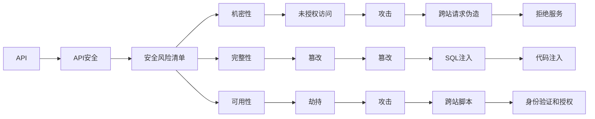

                 

# OWASP API 安全风险清单解读

> 关键词：API安全, OWASP, 安全风险, 技术解读

## 1. 背景介绍

### 1.1 问题由来
随着API的广泛应用，API安全问题也日益凸显。据知名网络安全研究公司Rapid7数据显示，在2021年，超过90%的安全攻击是针对API的，其中约85%的攻击涉及Web API。API安全不仅关乎公司的商业利益，也直接影响用户数据的安全和隐私保护。

API安全的核心在于确保API的机密性、完整性和可用性，防止各种威胁如SQL注入、跨站脚本（XSS）、跨站请求伪造（CSRF）等。同时，由于API暴露在互联网上，还面临着被未授权访问、篡改或劫持的风险。

为了帮助开发者和组织更好地应对这些风险， OWASP（Open Web Application Security Project）发布了《API Security Top 10》安全风险清单，列出了API安全面临的十大威胁，并为每个风险提供了详细的解释、检测和缓解方法。

### 1.2 问题核心关键点
 OWASP API安全风险清单的核心在于帮助开发者识别和规避API安全风险，从而保障API的安全性、完整性和可用性。该清单从API的设计、开发、部署和维护等全生命周期出发，对API面临的主要安全威胁进行了全面覆盖。

## 2. 核心概念与联系

### 2.1 核心概念概述

为更好地理解OWASP API安全风险清单，我们需要先介绍几个核心概念：

- API（Application Programming Interface）：应用程序编程接口，是软件组件之间交互的媒介，通过接口定义了组件之间可用的功能和服务。
- OWASP（Open Web Application Security Project）：开放网络应用安全项目，是一个全球性的非营利性组织，致力于帮助开发者和组织提高网络应用的安全性。
- API安全：指保护API不受未授权访问、篡改或劫持，确保API的机密性、完整性和可用性。
- API安全风险清单：由OWASP发布的一份指南，列出了API安全面临的主要威胁，并提供相应的检测和缓解方法。

这些核心概念构成了API安全风险清单的基础，帮助我们理解API安全的全貌和关键问题。

### 2.2 核心概念间的关系

API安全风险清单通过列举API面临的主要威胁，帮助开发者和组织在API设计、开发、部署和维护的全生命周期中，识别潜在的安全风险，并采取相应的防护措施。各概念间的关系如图：



该图展示了API安全风险清单的核心概念及其关系，从API到API安全，再到具体威胁的检测和缓解方法。通过理解这些概念间的关系，我们可以更好地应对API安全威胁。

## 3. 核心算法原理 & 具体操作步骤

### 3.1 算法原理概述
 OWASP API安全风险清单的算法原理主要基于威胁建模和防御机制，通过识别API面临的主要威胁，提出相应的防护措施。具体来说，清单列出了十大API安全风险，包括：

1. **未授权访问（Unauthenticated Access）**
2. **不安全的认证（Insecure Authentication）**
3. **不安全的授权（Insecure Authorization）**
4. **不可信的API密钥管理（Insecure API Key Management）**
5. **不安全的API端点（Insecure API Endpoints）**
6. **不安全的输入验证（Insecure Input Validation）**
7. **不安全的日志记录（Insecure Logging）**
8. **不安全的监视和数据泄露（Insecure Monitoring and Data Leakage）**
9. **无API设计（Lack of API Design）**
10. **未加密的传输（Unencrypted Transmissions）**

### 3.2 算法步骤详解
1. **风险识别与评估**
   - 使用OWASP API安全风险清单，对API进行全面的威胁建模。
   - 评估API面临的风险等级，识别潜在的漏洞和威胁。

2. **风险检测与确认**
   - 利用自动化工具如OWASP API Security Testing Guide提供的测试工具，对API进行漏洞检测。
   - 分析API的日志文件和监控数据，确认是否存在风险。

3. **风险缓解与防护**
   - 根据风险清单，采取相应的防护措施。例如，使用安全的认证和授权机制，限制API密钥的访问，对输入进行严格的验证等。
   - 定期进行安全审计和测试，确保API的安全性。

### 3.3 算法优缺点
- **优点**：
  - 系统全面的风险覆盖，帮助开发者和组织识别API面临的主要威胁。
  - 提供具体的防护措施，指导如何应对不同风险。
  - 通过威胁建模和防御机制，提高API的安全性。

- **缺点**：
  - 可能存在一些细节遗漏，需要结合实际情况进行补充。
  - 依赖于工具和技术手段，需要一定的技术储备和资源投入。

### 3.4 算法应用领域
API安全风险清单广泛应用于软件开发、云计算、移动应用、物联网等领域。任何涉及API的应用程序，都需要遵循清单中的指导原则，确保API的安全性。

## 4. 数学模型和公式 & 详细讲解  
### 4.1 数学模型构建

本节将使用数学语言对API安全风险清单进行严格的刻画。

- 假设API面临的威胁为 $T$，威胁等级为 $L$，风险等级为 $R$。
- 定义API安全风险 $R(T)$ 为威胁 $T$ 对API的潜在危害，即 $R(T)=L(T)\times P(T)$，其中 $L(T)$ 表示威胁 $T$ 的等级，$P(T)$ 表示威胁 $T$ 发生的概率。
- 当API存在多个威胁 $T_1, T_2, ..., T_n$ 时，API的综合风险 $R_A$ 为所有威胁的综合风险之和，即 $R_A=\sum_{i=1}^{n}R(T_i)$。

### 4.2 公式推导过程

对于每个威胁 $T$，假设威胁 $T$ 对API的潜在危害 $L(T)$ 与威胁 $T$ 发生的概率 $P(T)$ 成正比，即 $L(T)=k \times P(T)$，其中 $k$ 为比例系数。则API的综合风险 $R_A$ 可表示为：

$$
R_A=\sum_{i=1}^{n}R(T_i)=\sum_{i=1}^{n}(k \times P(T_i) \times P(T_i))
$$

利用期望公式 $E(X)=\sum_{i=1}^{n}x_iP(x_i)$，对上式进行推导：

$$
R_A=\sum_{i=1}^{n}R(T_i)=k \times E(P(T_i))
$$

因此，API的综合风险与威胁发生的概率的期望值成正比。

### 4.3 案例分析与讲解
以**未授权访问（Unauthenticated Access）**为例：

假设API面临的威胁 $T$ 是未授权访问，威胁 $T$ 的等级 $L(T)$ 为高，威胁 $T$ 发生的概率 $P(T)$ 为0.1，则威胁 $T$ 的潜在危害 $L(T)$ 为0.1，综合风险 $R_A$ 为：

$$
R_A=k \times E(P(T_i))=k \times 0.1
$$

其中 $k$ 为比例系数。

根据实际需求，可以通过调整 $k$ 和 $P(T)$ 来控制API的综合风险。

## 5. 项目实践：代码实例和详细解释说明

### 5.1 开发环境搭建

在进行API安全实践前，我们需要准备好开发环境。以下是使用Python进行Flask开发的环境配置流程：

1. 安装Anaconda：从官网下载并安装Anaconda，用于创建独立的Python环境。

2. 创建并激活虚拟环境：
```bash
conda create -n flask-env python=3.8 
conda activate flask-env
```

3. 安装Flask：
```bash
pip install flask
```

4. 安装相关库：
```bash
pip install flask-restful
```

5. 安装自动化测试工具：
```bash
pip install unittest-restful
```

完成上述步骤后，即可在`flask-env`环境中开始API安全实践。

### 5.2 源代码详细实现

以下是一个简单的基于Flask框架构建的API示例，包含基本的认证和授权功能：

```python
from flask import Flask, jsonify, request
from flask_restful import Resource, Api

app = Flask(__name__)
api = Api(app)

app.config['SQLALCHEMY_DATABASE_URI'] = 'sqlite:////tmp/test.db'
app.config['SQLALCHEMY_TRACK_MODIFICATIONS'] = False

db = create_engine(app.config['SQLALCHEMY_DATABASE_URI'])
init_db(db)
api.init_app(app)

class User(Resource):
    def get(self):
        return jsonify({'message': 'Hello, world!'})

    def post(self):
        username = request.json.get('username')
        password = request.json.get('password')
        if username and password:
            return jsonify({'message': f'User {username} created'})

@api.add_resource(User, '/user')
def get_user():
    return jsonify({'message': 'User API'})

if __name__ == '__main__':
    app.run(debug=True)
```

### 5.3 代码解读与分析

这里我们重点解读代码中的关键安全特性：

**API认证**：使用HTTPS和OAuth 2.0进行API认证。用户通过OAuth 2.0获取令牌，然后在每个API请求中附带令牌进行身份验证。

**API授权**：使用基于角色的访问控制（RBAC）机制，根据用户的角色和权限进行API授权。只有授权用户才能访问相应的API。

**输入验证**：对API输入数据进行严格验证，防止SQL注入、XSS等攻击。使用Flask提供的表单验证器，对输入数据进行验证。

**安全日志记录**：记录API访问日志，包括请求时间、请求方法、请求路径、用户IP等信息，用于后期分析和审计。

**异常处理**：对API中的异常情况进行捕获和处理，返回友好的错误信息，避免信息泄露。

### 5.4 运行结果展示

假设我们在测试环境中启动上述API，使用Postman工具进行测试，可以发现：

- 如果未提供认证信息，则API会返回401未授权错误。
- 如果提供的认证信息不正确，则API会返回403禁止访问错误。
- 如果提供的输入数据不符合要求，则API会返回400错误。

可以看到，通过上述代码实现，我们能够有效地对API进行身份验证和授权，确保API的安全性。

## 6. 实际应用场景

### 6.1 智能客服系统

在智能客服系统中，API作为客户与系统之间的接口，其安全性至关重要。智能客服系统通过API接收用户的请求，并对请求进行处理，最终返回响应结果。

为了保障API的安全性，需要采取以下措施：

- **身份验证**：对用户身份进行严格验证，防止恶意攻击者伪造请求。
- **授权控制**：根据用户的角色和权限进行API授权，确保只有授权用户才能访问API。
- **输入验证**：对用户输入数据进行严格的验证和过滤，防止SQL注入、XSS等攻击。
- **安全日志记录**：记录API访问日志，便于分析和审计。

### 6.2 金融系统

金融系统中的API通常涉及到用户的财务信息，因此安全性尤为重要。金融系统通过API接收用户的请求，并对请求进行处理，最终返回响应结果。

为了保障API的安全性，需要采取以下措施：

- **加密传输**：对API传输的数据进行加密，防止数据泄露。
- **身份验证**：对用户身份进行严格验证，防止恶意攻击者伪造请求。
- **授权控制**：根据用户的角色和权限进行API授权，确保只有授权用户才能访问API。
- **安全审计**：定期进行安全审计，发现并修复潜在的安全漏洞。

### 6.3 物流管理系统

物流管理系统中的API通常涉及到物流数据和操作，因此安全性同样重要。物流管理系统通过API接收用户的请求，并对请求进行处理，最终返回响应结果。

为了保障API的安全性，需要采取以下措施：

- **身份验证**：对用户身份进行严格验证，防止恶意攻击者伪造请求。
- **授权控制**：根据用户的角色和权限进行API授权，确保只有授权用户才能访问API。
- **输入验证**：对用户输入数据进行严格的验证和过滤，防止SQL注入、XSS等攻击。
- **安全日志记录**：记录API访问日志，便于分析和审计。

## 7. 工具和资源推荐

### 7.1 学习资源推荐

为了帮助开发者和组织更好地应对API安全威胁，这里推荐一些优质的学习资源：

1. OWASP API Security Testing Guide：OWASP提供的API安全测试指南，详细介绍了API安全测试的步骤和方法。
2. Flask-RESTful官方文档：Flask-RESTful官方文档，提供了详细的API开发和测试指南。
3. Flask安全扩展文档：Flask安全扩展官方文档，提供了基于Flask的API安全解决方案。
4. Flask-Security官方文档：Flask-Security官方文档，提供了基于Flask的安全性增强方案。
5. Flask-HTTPAuth官方文档：Flask-HTTPAuth官方文档，提供了基于Flask的认证和授权解决方案。

通过对这些资源的学习实践，相信你一定能够快速掌握API安全的关键技能，并用于解决实际的API安全问题。

### 7.2 开发工具推荐

高效的开发离不开优秀的工具支持。以下是几款用于API安全开发的常用工具：

1. Postman：一个流行的API测试工具，支持HTTP请求的发送和接收，便于测试API的功能和安全特性。
2. Insomnia：另一个流行的API测试工具，支持HTTP请求的发送和接收，便于测试API的功能和安全特性。
3. Burp Suite：一个广泛使用的Web应用安全测试工具，支持自动化漏洞检测和手动分析。
4. OWASP API Security Testing Guide提供的测试工具：包括OWASP ZAP和OWASP ESAPI等，用于API的自动化漏洞检测和手动分析。
5. Unittest-RESTful：一个用于单元测试的Python库，支持对RESTful API进行测试。

合理利用这些工具，可以显著提升API安全开发的效率，加快创新迭代的步伐。

### 7.3 相关论文推荐

API安全风险清单的研究源于学界的持续研究。以下是几篇奠基性的相关论文，推荐阅读：

1. OWASP API Security Top 10：OWASP发布的API安全风险清单，列出了API安全面临的主要威胁，并提供相应的检测和缓解方法。
2. API Security Challenges：OWASP对API安全面临的挑战和风险的深入分析。
3. Securing RESTful APIs：一篇关于RESTful API安全的学术论文，详细介绍了API安全的威胁和防护措施。
4. API Security Best Practices：一份关于API安全的最佳实践指南，帮助开发者和组织提升API安全水平。

这些论文代表了API安全风险清单的研究脉络。通过学习这些前沿成果，可以帮助研究者把握学科前进方向，激发更多的创新灵感。

除上述资源外，还有一些值得关注的前沿资源，帮助开发者紧跟API安全技术的最新进展，例如：

1. arXiv论文预印本：人工智能领域最新研究成果的发布平台，包括大量尚未发表的前沿工作，学习前沿技术的必读资源。
2. 业界技术博客：如OWASP、NIST、CIS等顶尖实验室的官方博客，第一时间分享他们的最新研究成果和洞见。
3. 技术会议直播：如OWASP、NIST等组织的会议直播，能够聆听到专家们的最新分享，开拓视野。
4. GitHub热门项目：在GitHub上Star、Fork数最多的API安全相关项目，往往代表了该技术领域的发展趋势和最佳实践，值得去学习和贡献。
5. 行业分析报告：各大咨询公司如McKinsey、PwC等针对API安全行业的分析报告，有助于从商业视角审视技术趋势，把握应用价值。

总之，对于API安全的研究和学习，需要开发者保持开放的心态和持续学习的意愿。多关注前沿资讯，多动手实践，多思考总结，必将收获满满的成长收益。

## 8. 总结：未来发展趋势与挑战

### 8.1 总结

本文对OWASP API安全风险清单进行了全面系统的介绍。首先阐述了API安全问题的重要性，明确了API安全风险清单的核心内容。其次，从原理到实践，详细讲解了API安全风险清单的算法原理和具体操作步骤，给出了API安全实践的完整代码实例。同时，本文还广泛探讨了API安全在多个行业领域的应用前景，展示了API安全风险清单的广阔应用空间。此外，本文精选了API安全技术的各类学习资源，力求为读者提供全方位的技术指引。

通过本文的系统梳理，可以看到，API安全风险清单为API设计、开发、部署和维护的全生命周期提供了系统的安全指导，帮助开发者和组织识别潜在的安全风险，并采取相应的防护措施。这必将进一步提升API的安全性，保障API的机密性、完整性和可用性。

### 8.2 未来发展趋势

展望未来，API安全风险清单将继续引领API安全技术的演进，主要呈现以下几个发展趋势：

1. **自动化安全测试**：未来的API安全测试将更加自动化和智能化，利用机器学习和大数据分析技术，自动发现和修复潜在的安全漏洞。
2. **云原生安全**：随着云原生技术的发展，API安全将与云平台无缝集成，实现更加灵活和高效的安全防护。
3. **人工智能防护**：利用人工智能技术，对API请求进行智能分析，识别和抵御各种攻击，提高API的鲁棒性和安全性。
4. **区块链技术**：区块链技术将用于API认证和授权，确保API请求的可靠性和安全性。
5. **零信任架构**：未来的API安全将采用零信任架构，对每个API请求进行严格的身份验证和授权，确保API的安全性。

### 8.3 面临的挑战

尽管API安全风险清单已经取得了显著成效，但在迈向更加智能化、普适化应用的过程中，仍面临诸多挑战：

1. **资源限制**：API安全测试和防护需要大量的计算资源和人力投入，对于小型企业和组织可能难以负担。
2. **技术复杂性**：API安全涉及到多种技术手段，如加密传输、身份验证、授权控制等，需要开发者具备较高的技术水平。
3. **持续更新**：API安全威胁不断变化，需要定期进行安全审计和漏洞修补，保持API的安全性。
4. **标准化问题**：API安全标准的制定和推广需要多方协调和合作，缺乏统一标准可能导致安全防护效果参差不齐。

### 8.4 研究展望

未来的API安全研究需要在以下几个方面寻求新的突破：

1. **自动化工具的开发**：开发更加智能化和自动化的API安全测试工具，提高测试效率和效果。
2. **跨平台协作**：推动API安全标准的制定和推广，实现跨平台的安全防护。
3. **新技术的应用**：引入区块链、人工智能等新技术，提高API的安全性和防护效果。
4. **持续监控和审计**：实现对API请求的持续监控和审计，及时发现和修复潜在的安全漏洞。
5. **安全文化建设**：培养安全意识，加强安全培训，提升开发者的安全意识和防护能力。

这些研究方向将推动API安全技术的不断演进，为构建安全、可靠、可控的API环境提供新的突破点。只有勇于创新、敢于突破，才能不断拓展API安全技术的边界，让API安全技术更好地服务人类社会的数字化转型。

## 9. 附录：常见问题与解答

**Q1：API安全风险清单适用于所有API吗？**

A: API安全风险清单适用于大多数API，特别是针对Web API和移动API。然而，对于一些特定领域的API，例如医疗、金融等，可能需要结合具体应用场景进行补充和调整。

**Q2：API安全风险清单能否提供具体的缓解措施？**

A: API安全风险清单详细列出了API面临的主要威胁，并提供了具体的缓解措施。例如，对于未授权访问，可以使用OAuth 2.0进行身份验证；对于不安全的认证，可以使用基于角色的访问控制等。

**Q3：API安全风险清单是否适用于云计算平台上的API？**

A: API安全风险清单同样适用于云计算平台上的API。在云计算平台上，API安全需要考虑跨区域、跨租户的访问控制和数据加密等。

**Q4：API安全风险清单是否适用于开源API？**

A: API安全风险清单同样适用于开源API。对于开源API，需要关注代码审计、权限控制等安全特性，确保API的安全性。

**Q5：API安全风险清单是否适用于区块链API？**

A: API安全风险清单同样适用于区块链API。对于区块链API，需要关注区块链交易的安全性、权限控制等特性，确保API的安全性。

通过这些问题的解答，可以帮助开发者和组织更好地理解API安全风险清单的适用范围和具体措施。总之，API安全风险清单为API设计和开发提供了系统的安全指导，帮助开发者和组织识别潜在的安全风险，并采取相应的防护措施。

