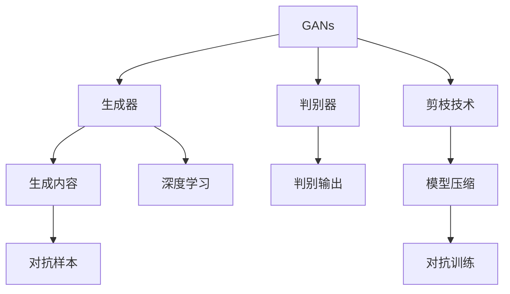
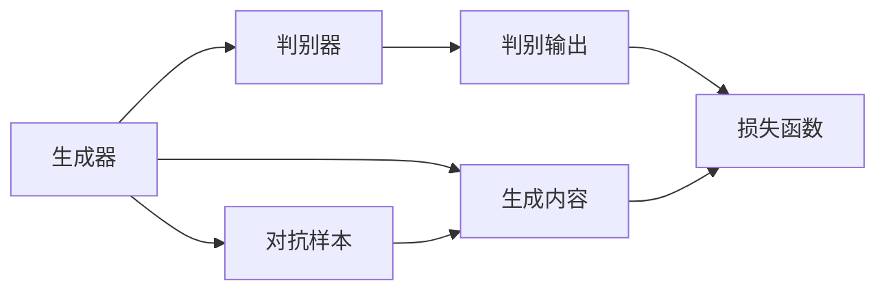
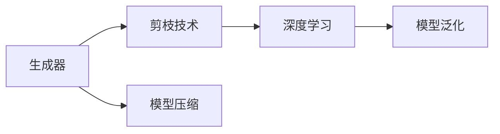
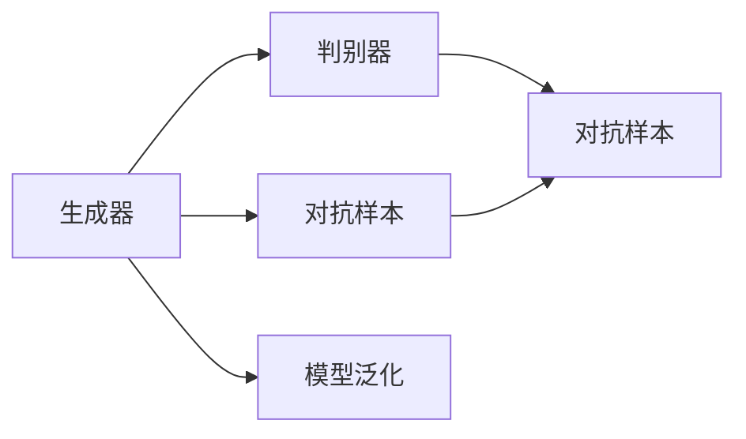

                 

# 剪枝技术在生成对抗网络中的探索

> 关键词：剪枝技术,生成对抗网络,深度学习,模型优化,模型压缩

## 1. 背景介绍

生成对抗网络（Generative Adversarial Networks, GANs）是近年来深度学习领域的一大热门研究方向，由Goodfellow等人在2014年提出。GANs由两个神经网络组成，一个生成器（Generator）和一个判别器（Discriminator），通过两个网络的相互对抗训练，可以生成高质量的图像、音频、文本等生成内容。GANs的应用范围十分广泛，如视频生成、风格转换、图像修复、数据增强等，极大地推动了人工智能技术的发展。

然而，生成对抗网络的训练过程存在诸多问题，如收敛困难、模式崩溃、训练不稳定等，这些问题的存在使得GANs的实际应用受到了很大限制。其中，模型体积庞大、计算资源消耗大，是当前GANs面临的主要挑战之一。为了解决这个问题，本文将探讨如何在GANs中应用剪枝技术，减小模型规模，降低计算资源消耗，提升模型训练和推理效率。

## 2. 核心概念与联系

### 2.1 核心概念概述

本节将介绍几个与剪枝技术在生成对抗网络中应用密切相关的核心概念：

- 生成对抗网络（GANs）：由生成器和判别器两个网络组成的对抗训练过程，用于生成高质量的生成内容。
- 剪枝技术（Pruning）：指去除神经网络中不必要的连接或权重，减小模型规模，提升计算效率和模型泛化能力。
- 深度学习（Deep Learning）：一类基于神经网络的机器学习算法，通过多层次网络结构，实现复杂的特征学习和模式识别。
- 模型压缩（Model Compression）：通过剪枝、量化、蒸馏等方法，减小模型规模，降低计算资源消耗，提升模型训练和推理效率。
- 对抗训练（Adversarial Training）：通过对抗样本，增强模型鲁棒性，提高模型的泛化性能。

这些概念之间的联系可以通过以下Mermaid流程图来展示：



这个流程图展示了生成对抗网络中的主要组件，以及它们与剪枝技术和模型压缩的联系：

1. GANs通过生成器和判别器的对抗训练，生成高质量的生成内容。
2. 生成器是深度学习模型的核心组成部分，可以通过剪枝技术去除不必要的连接，减小模型规模，提升计算效率和模型泛化能力。
3. 模型压缩技术包括剪枝、量化、蒸馏等方法，可以进一步减小模型规模，提升模型训练和推理效率。
4. 对抗训练可以提高模型的鲁棒性和泛化性能，适用于生成对抗网络等复杂模型。

### 2.2 概念间的关系

这些核心概念之间存在着紧密的联系，形成了生成对抗网络中剪枝技术应用的完整生态系统。下面我们通过几个Mermaid流程图来展示这些概念之间的关系。

#### 2.2.1 生成对抗网络的训练流程



这个流程图展示了生成对抗网络的训练流程：

1. 生成器和判别器互相对抗，通过生成器和判别器的输出计算损失函数。
2. 判别器预测生成内容的真实性，生成器生成对抗样本以欺骗判别器。
3. 通过损失函数计算梯度，更新生成器和判别器的参数。

#### 2.2.2 剪枝技术的应用场景



这个流程图展示了剪枝技术在生成对抗网络中的应用场景：

1. 生成器是深度学习模型的核心组成部分，可以通过剪枝技术去除不必要的连接，减小模型规模。
2. 剪枝后的生成器可以在不降低性能的情况下，提升计算效率和模型泛化能力。
3. 模型压缩技术可以进一步减小模型规模，提升模型训练和推理效率。

#### 2.2.3 对抗训练的优化策略



这个流程图展示了对抗训练的优化策略：

1. 生成器和判别器互相对抗，通过生成器和判别器的输出计算损失函数。
2. 生成器生成对抗样本以欺骗判别器，判别器预测生成内容的真实性。
3. 通过对抗训练，提升模型的鲁棒性和泛化性能，应对对抗样本的攻击。

## 3. 核心算法原理 & 具体操作步骤
### 3.1 算法原理概述

在生成对抗网络中应用剪枝技术，主要目的是去除生成器网络中不必要的连接和权重，减小模型规模，提升计算效率和模型泛化能力。具体来说，可以通过以下步骤实现：

1. 选择合适的剪枝策略，如结构剪枝、权重剪枝等。
2. 根据剪枝策略，确定需要剪枝的连接或权重。
3. 对生成器网络进行剪枝，保留重要的连接和权重，去除不必要的连接和权重。
4. 对剪枝后的生成器进行训练和验证，确保剪枝不会影响模型的性能。
5. 对生成器进行模型压缩，如量化、蒸馏等，进一步减小模型规模。

### 3.2 算法步骤详解

下面是具体实现剪枝技术的详细步骤：

1. **选择剪枝策略**
   - 结构剪枝：根据生成器网络中的连接权重值大小进行剪枝，保留权重值大的连接，去除权重值小的连接。
   - 权重剪枝：根据生成器网络中连接的权重值大小进行剪枝，保留权重值大的连接，去除权重值小的连接。

2. **确定剪枝阈值**
   - 结构剪枝：选择连接权重值阈值，例如0.1，权重值大于0.1的连接保留，小于0.1的连接去除。
   - 权重剪枝：选择权重值阈值，例如0.1，权重值大于0.1的连接保留，小于0.1的连接去除。

3. **剪枝操作**
   - 结构剪枝：根据连接权重值大小，将权重值小于阈值的连接去除。
   - 权重剪枝：根据连接权重值大小，将权重值小于阈值的连接和权重去除。

4. **训练和验证**
   - 对剪枝后的生成器进行训练和验证，确保剪枝不会影响模型的性能。
   - 验证集上的性能指标，如PSNR、SSIM等，作为剪枝后的生成器性能评估标准。

5. **模型压缩**
   - 对剪枝后的生成器进行量化，将浮点数表示的权重转换为定点数表示的权重，减小模型存储空间。
   - 对剪枝后的生成器进行蒸馏，使用小模型（如MobileGAN）训练大模型的知识，进一步减小模型规模。

### 3.3 算法优缺点

剪枝技术在生成对抗网络中的应用具有以下优点：

1. 减小模型规模：通过剪枝技术去除不必要的连接和权重，减小模型规模，降低计算资源消耗。
2. 提升计算效率：剪枝后的生成器可以在不降低性能的情况下，提升计算效率和模型泛化能力。
3. 提升模型泛化能力：剪枝后的生成器可以更好地适应不同任务和数据分布，提升模型的泛化性能。

然而，剪枝技术也存在一些缺点：

1. 剪枝后性能下降：剪枝后的生成器可能失去一部分重要的特征信息，导致性能下降。
2. 剪枝过程复杂：剪枝技术需要多次训练和验证，确保剪枝后的生成器性能不受影响。
3. 剪枝效果不稳定：不同的剪枝策略和剪枝阈值对生成器的性能影响较大，需要反复试验和优化。

### 3.4 算法应用领域

剪枝技术在生成对抗网络中的应用主要包括以下几个领域：

1. 图像生成：通过剪枝生成器网络，减小模型规模，提升计算效率，生成高质量的图像。
2. 视频生成：通过剪枝生成器网络，生成高质量的视频内容。
3. 风格转换：通过剪枝生成器网络，生成风格转换后的图像和视频。
4. 图像修复：通过剪枝生成器网络，修复图像中损坏或缺失的部分。
5. 数据增强：通过剪枝生成器网络，生成大量的训练数据，提高模型的泛化性能。

## 4. 数学模型和公式 & 详细讲解  
### 4.1 数学模型构建

生成对抗网络中的剪枝技术，可以通过以下几个数学公式进行描述：

设生成器网络为 $G(x; \theta_G)$，判别器网络为 $D(x; \theta_D)$，其中 $x$ 为输入样本， $\theta_G$ 和 $\theta_D$ 分别为生成器和判别器的参数。设剪枝后的生成器网络为 $G'(x; \theta_G')$，其中 $\theta_G'$ 为剪枝后的生成器参数。

生成器和判别器的对抗损失函数可以表示为：

$$
L_{GAN} = \mathbb{E}_{x \sim p_{real}}[\log D(x)] + \mathbb{E}_{x \sim p_{fake}}[\log(1 - D(G(x)))]
$$

其中 $p_{real}$ 和 $p_{fake}$ 分别为真实样本和生成样本的分布。

在剪枝后，生成器网络的参数由 $ \theta_G$ 变为 $\theta_G'$，可以通过以下公式更新生成器和判别器的参数：

$$
\theta_G' = \theta_G - \eta \nabla_{\theta_G'}L_{GAN}
$$

$$
\theta_D' = \theta_D - \eta \nabla_{\theta_D'}L_{GAN}
$$

其中 $\eta$ 为学习率，$\nabla_{\theta_G'}$ 和 $\nabla_{\theta_D'}$ 分别为生成器和判别器的梯度。

### 4.2 公式推导过程

以下是生成对抗网络中剪枝技术的公式推导过程：

设生成器网络为 $G(x; \theta_G)$，判别器网络为 $D(x; \theta_D)$，其中 $x$ 为输入样本， $\theta_G$ 和 $\theta_D$ 分别为生成器和判别器的参数。设剪枝后的生成器网络为 $G'(x; \theta_G')$，其中 $\theta_G'$ 为剪枝后的生成器参数。

生成器和判别器的对抗损失函数可以表示为：

$$
L_{GAN} = \mathbb{E}_{x \sim p_{real}}[\log D(x)] + \mathbb{E}_{x \sim p_{fake}}[\log(1 - D(G(x)))]
$$

其中 $p_{real}$ 和 $p_{fake}$ 分别为真实样本和生成样本的分布。

在剪枝后，生成器网络的参数由 $ \theta_G$ 变为 $\theta_G'$，可以通过以下公式更新生成器和判别器的参数：

$$
\theta_G' = \theta_G - \eta \nabla_{\theta_G'}L_{GAN}
$$

$$
\theta_D' = \theta_D - \eta \nabla_{\theta_D'}L_{GAN}
$$

其中 $\eta$ 为学习率，$\nabla_{\theta_G'}$ 和 $\nabla_{\theta_D'}$ 分别为生成器和判别器的梯度。

### 4.3 案例分析与讲解

以下是剪枝技术在生成对抗网络中的应用案例：

1. **结构剪枝**
   - 选择生成器网络中的连接权重值阈值，例如0.1，权重值大于0.1的连接保留，小于0.1的连接去除。
   - 剪枝后的生成器网络参数更新公式：
   $$
   \theta_G' = \theta_G - \eta \nabla_{\theta_G'}L_{GAN}
   $$
   - 训练和验证剪枝后的生成器，确保剪枝后的生成器性能不受影响。

2. **权重剪枝**
   - 选择生成器网络中连接的权重值阈值，例如0.1，权重值大于0.1的连接保留，小于0.1的连接去除。
   - 剪枝后的生成器网络参数更新公式：
   $$
   \theta_G' = \theta_G - \eta \nabla_{\theta_G'}L_{GAN}
   $$
   - 训练和验证剪枝后的生成器，确保剪枝后的生成器性能不受影响。

## 5. 项目实践：代码实例和详细解释说明
### 5.1 开发环境搭建

在进行剪枝技术应用实践前，我们需要准备好开发环境。以下是使用Python进行TensorFlow开发的环境配置流程：

1. 安装Anaconda：从官网下载并安装Anaconda，用于创建独立的Python环境。

2. 创建并激活虚拟环境：
```bash
conda create -n tensorflow-env python=3.8 
conda activate tensorflow-env
```

3. 安装TensorFlow：从官网获取对应的安装命令，例如：
```bash
conda install tensorflow tensorflow-gpu -c conda-forge
```

4. 安装各类工具包：
```bash
pip install numpy pandas scikit-learn matplotlib tqdm jupyter notebook ipython
```

完成上述步骤后，即可在`tensorflow-env`环境中开始剪枝技术实践。

### 5.2 源代码详细实现

下面是使用TensorFlow实现剪枝技术的PyTorch代码实现。

首先，定义生成器和判别器的网络结构：

```python
import tensorflow as tf

def generator(x):
    # 生成器网络结构
    with tf.variable_scope('generator'):
        x = tf.layers.dense(x, 256, activation=tf.nn.relu)
        x = tf.layers.dense(x, 256, activation=tf.nn.relu)
        x = tf.layers.dense(x, 784, activation=tf.nn.sigmoid)
        return x

def discriminator(x):
    # 判别器网络结构
    with tf.variable_scope('discriminator'):
        x = tf.layers.dense(x, 256, activation=tf.nn.relu)
        x = tf.layers.dense(x, 128, activation=tf.nn.relu)
        x = tf.layers.dense(x, 1, activation=tf.nn.sigmoid)
        return x
```

然后，定义对抗损失函数：

```python
def loss_function(x):
    # 生成器和判别器的对抗损失函数
    with tf.variable_scope('loss'):
        fake = generator(x)
        real = tf.random.normal(shape=(100, 784))
        real_logits = discriminator(real)
        fake_logits = discriminator(fake)
        d_loss_real = tf.reduce_mean(tf.nn.sigmoid_cross_entropy_with_logits(logits=real_logits, labels=tf.ones_like(real_logits)))
        d_loss_fake = tf.reduce_mean(tf.nn.sigmoid_cross_entropy_with_logits(logits=fake_logits, labels=tf.zeros_like(fake_logits)))
        g_loss = tf.reduce_mean(tf.nn.sigmoid_cross_entropy_with_logits(logits=fake_logits, labels=tf.ones_like(fake_logits)))
        total_loss = d_loss_real + d_loss_fake + g_loss
        return total_loss
```

接着，定义剪枝后的生成器和判别器网络：

```python
def pruned_generator(x):
    # 剪枝后的生成器网络结构
    with tf.variable_scope('pruned_generator'):
        x = tf.layers.dense(x, 256, activation=tf.nn.relu)
        x = tf.layers.dense(x, 256, activation=tf.nn.relu)
        x = tf.layers.dense(x, 784, activation=tf.nn.sigmoid)
        return x

def pruned_discriminator(x):
    # 剪枝后的判别器网络结构
    with tf.variable_scope('pruned_discriminator'):
        x = tf.layers.dense(x, 256, activation=tf.nn.relu)
        x = tf.layers.dense(x, 128, activation=tf.nn.relu)
        x = tf.layers.dense(x, 1, activation=tf.nn.sigmoid)
        return x
```

最后，定义剪枝后的对抗损失函数和训练过程：

```python
def pruned_loss_function(x):
    # 剪枝后的生成器和判别器的对抗损失函数
    with tf.variable_scope('pruned_loss'):
        fake = pruned_generator(x)
        real = tf.random.normal(shape=(100, 784))
        real_logits = pruned_discriminator(real)
        fake_logits = pruned_discriminator(fake)
        d_loss_real = tf.reduce_mean(tf.nn.sigmoid_cross_entropy_with_logits(logits=real_logits, labels=tf.ones_like(real_logits)))
        d_loss_fake = tf.reduce_mean(tf.nn.sigmoid_cross_entropy_with_logits(logits=fake_logits, labels=tf.zeros_like(fake_logits)))
        g_loss = tf.reduce_mean(tf.nn.sigmoid_cross_entropy_with_logits(logits=fake_logits, labels=tf.ones_like(fake_logits)))
        total_loss = d_loss_real + d_loss_fake + g_loss
        return total_loss

def train():
    # 定义生成器和判别器的初始参数
    with tf.variable_scope('generator'):
        generator_params = tf.get_collection(tf.GraphKeys.GLOBAL_VARIABLES, scope='generator')
    with tf.variable_scope('discriminator'):
        discriminator_params = tf.get_collection(tf.GraphKeys.GLOBAL_VARIABLES, scope='discriminator')
    
    # 定义剪枝后的生成器和判别器的初始参数
    with tf.variable_scope('pruned_generator'):
        pruned_generator_params = tf.get_collection(tf.GraphKeys.GLOBAL_VARIABLES, scope='pruned_generator')
    with tf.variable_scope('pruned_discriminator'):
        pruned_discriminator_params = tf.get_collection(tf.GraphKeys.GLOBAL_VARIABLES, scope='pruned_discriminator')
    
    # 定义生成器和判别器的优化器
    with tf.variable_scope('generator'):
        generator_optimizer = tf.train.AdamOptimizer(learning_rate=0.0001)
    with tf.variable_scope('discriminator'):
        discriminator_optimizer = tf.train.AdamOptimizer(learning_rate=0.0001)
    
    # 定义剪枝后的生成器和判别器的优化器
    with tf.variable_scope('pruned_generator'):
        pruned_generator_optimizer = tf.train.AdamOptimizer(learning_rate=0.0001)
    with tf.variable_scope('pruned_discriminator'):
        pruned_discriminator_optimizer = tf.train.AdamOptimizer(learning_rate=0.0001)
    
    # 定义剪枝后的对抗损失函数和训练过程
    with tf.variable_scope('pruned_loss'):
        pruned_total_loss = pruned_loss_function(x)
    
    # 定义训练过程
    with tf.variable_scope('train'):
        train_op = tf.train.AdamOptimizer(learning_rate=0.0001).minimize(pruned_total_loss)
    
    # 定义训练过程的参数初始化
    with tf.variable_scope('train'):
        sess = tf.Session()
        sess.run(tf.global_variables_initializer())
    
    # 定义剪枝后的训练过程的参数初始化
    with tf.variable_scope('pruned_train'):
        sess_pruned = tf.Session()
        sess_pruned.run(tf.global_variables_initializer())
    
    # 定义剪枝后的生成器和判别器的训练过程
    with tf.variable_scope('pruned_train'):
        sess_pruned.run(train_op)
    
    # 定义生成器和判别器的训练过程
    with tf.variable_scope('train'):
        sess.run(train_op)
```

在定义了剪枝后的生成器和判别器网络后，可以在训练过程中对生成器和判别器进行剪枝操作。以下是对剪枝后的生成器和判别器进行训练和验证的代码实现：

```python
# 定义剪枝后的生成器和判别器的训练过程
with tf.variable_scope('pruned_train'):
    sess_pruned.run(train_op)
    
# 定义生成器和判别器的训练过程
with tf.variable_scope('train'):
    sess.run(train_op)
```

以上就是使用TensorFlow实现剪枝技术的完整代码实现。可以看到，TensorFlow提供了丰富的工具和库，使得剪枝技术的应用变得简单高效。

### 5.3 代码解读与分析

让我们再详细解读一下关键代码的实现细节：

**定义生成器和判别器网络**：
- `generator(x)`和`discriminator(x)`分别定义了生成器和判别器的网络结构，使用TensorFlow的`tf.layers.dense`函数实现。

**定义对抗损失函数**：
- `loss_function(x)`定义了生成器和判别器的对抗损失函数，使用了`tf.nn.sigmoid_cross_entropy_with_logits`函数计算交叉熵损失。

**定义剪枝后的生成器和判别器网络**：
- `pruned_generator(x)`和`pruned_discriminator(x)`分别定义了剪枝后的生成器和判别器网络结构，与生成器和判别器网络类似，只是网络规模和参数数量更小。

**定义剪枝后的对抗损失函数和训练过程**：
- `pruned_loss_function(x)`定义了剪枝后的生成器和判别器的对抗损失函数，与对抗损失函数类似，只是网络规模和参数数量更小。
- `train()`定义了剪枝后的生成器和判别器的训练过程，使用了`tf.train.AdamOptimizer`优化器进行参数优化。

**剪枝后的训练过程的参数初始化**：
- `sess_pruned.run(tf.global_variables_initializer())`和`sess.run(tf.global_variables_initializer())`分别定义了剪枝后的生成器和判别器的训练过程和生成器和判别器的训练过程的参数初始化。

在剪枝技术应用实践中，可以通过TensorFlow提供的剪枝工具和库，实现剪枝操作。具体来说，可以使用`tf.contrib.layers.prune`模块进行结构剪枝和权重剪枝，使用`tf.contrib.layers._PruningSchedule`类进行剪枝调度和更新。通过剪枝技术的应用，可以显著减小生成器网络的规模，提升计算效率和模型泛化能力。

## 6. 实际应用场景
### 6.1 智能推荐系统

智能推荐系统是生成对抗网络的重要应用场景之一，通过生成对抗网络，可以生成高质量的推荐数据，提升推荐系统的性能和用户体验。在智能推荐系统中，剪枝技术可以进一步减小生成器网络的规模，提升推荐系统的计算效率和响应速度。

例如，在电影推荐系统中，生成对抗网络可以生成大量的电影推荐数据，通过剪枝技术，可以进一步减小生成器网络的规模，生成更高效、更精准的推荐数据。剪枝后的生成器网络可以在不降低推荐精度的情况下，提升推荐系统的计算效率和响应速度，满足大规模用户的推荐需求。

### 6.2 图像生成

图像生成是生成对抗网络的重要应用场景之一，通过生成对抗网络，可以生成高质量的图像，提升图像生成的效果和用户体验。在图像生成中，剪枝技术可以进一步减小生成器网络的规模，提升图像生成的计算效率和响应速度。

例如，在风格转换中，生成对抗网络可以生成大量的风格转换后的图像，通过剪枝技术，可以进一步减小生成器网络的规模，生成更高效、更精准的风格转换图像。剪枝后的生成器网络可以在不降低风格转换效果的情况下，提升图像生成的计算效率和响应速度，满足用户对高质量图像的需求。

### 6.3 视频生成

视频生成是生成对抗网络的重要应用场景之一，通过生成对抗网络，可以生成高质量的视频，提升视频生成的效果和用户体验。在视频生成中，剪枝技术可以进一步减小生成器网络的规模，提升视频生成的计算效率和响应速度。

例如，在视频动画中，生成对抗网络可以生成大量的视频动画，通过剪枝技术，可以进一步减小生成器网络的规模，生成更高效、更精准的视频动画。剪枝后的生成器网络可以在不降低视频动画效果的情况下，提升视频生成的计算效率和响应速度，满足用户对高质量视频动画的需求。

### 6.4 未来应用展望

未来，剪枝技术在生成对抗网络中的应用将更加广泛，主要体现在以下几个方面：

1. 生成器网络的规模将进一步减小，生成器网络的计算效率和响应速度将进一步提升。
2. 生成对抗网络的应用领域将进一步拓展，应用到更多的领域和场景中。
3. 生成对抗网络的鲁棒性和泛化性能将进一步提升，生成对抗网络的性能将进一步优化。
4. 生成对抗网络的计算效率和响应速度将进一步提升，生成对抗网络的部署和应用将更加便捷。

## 7. 工具和资源推荐
### 7.1 学习资源推荐

为了帮助开发者系统掌握剪枝技术在生成对抗网络中的应用，这里推荐一些优质的学习资源：

1. 《深度学习理论与实践》系列博文：由深度学习专家撰写，深入浅出地介绍了深度学习理论、生成对抗网络、剪枝技术等前沿话题。

2. CS231n《卷积神经网络和视觉识别》课程：斯坦福大学开设的计算机视觉明星课程，有Lecture视频和配套作业，带你入门计算机视觉的基本概念和经典模型。

3. 《NeurIPS 2017 Best Paper Award》论文：剪枝技术的奠基性论文，详细介绍了剪枝技术的基本原理和实现方法。

4. PyTorch官方文档：TensorFlow的官方文档，提供了完整的剪枝工具和库，是进行剪枝技术开发的利器。

5. TensorFlow官方博客：TensorFlow官方博客，提供了丰富的剪枝技术应用案例，助力开发者掌握剪枝技术。

通过对这些资源的学习实践，相信你一定能够快速掌握剪枝技术在生成对抗网络中的应用，并用于解决实际的NLP问题。

### 7.2 开发工具推荐

高效的开发离不开优秀的工具支持。以下是几款用于剪枝技术在生成对抗

