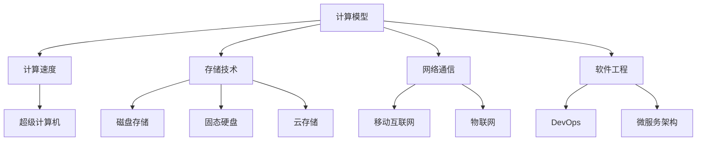
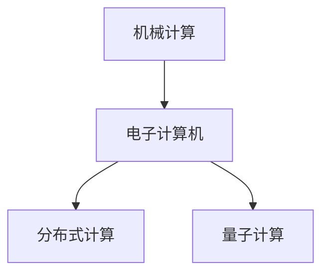
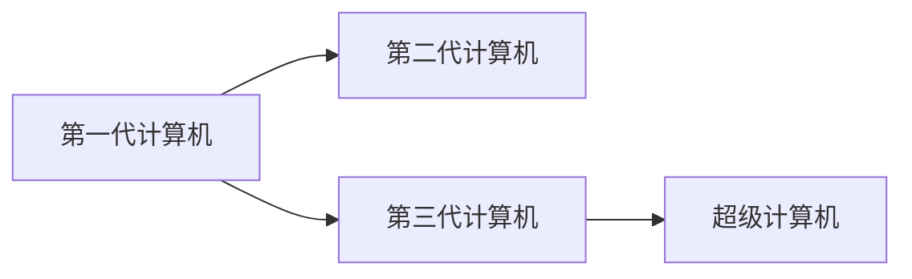
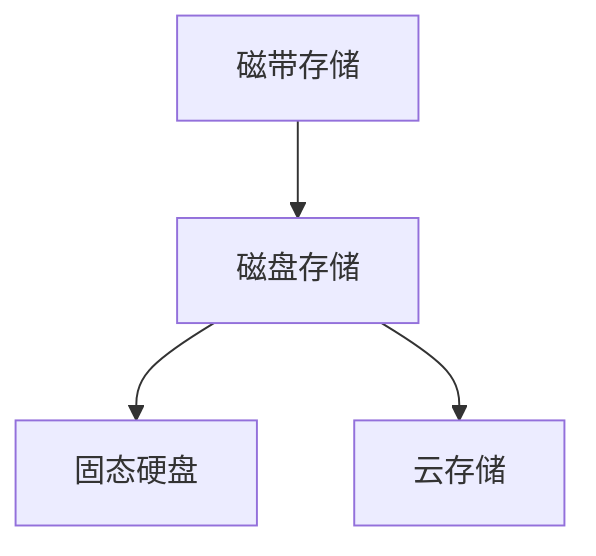
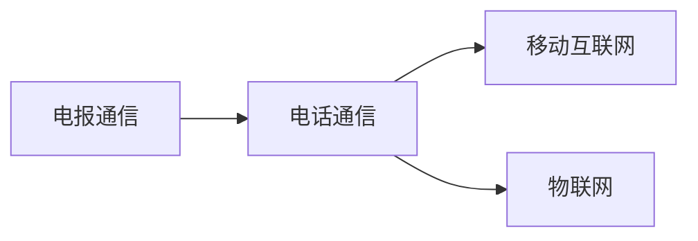
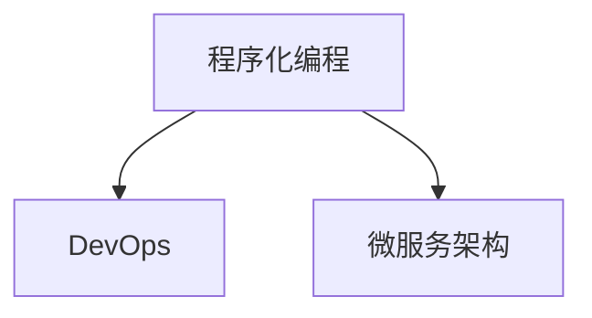
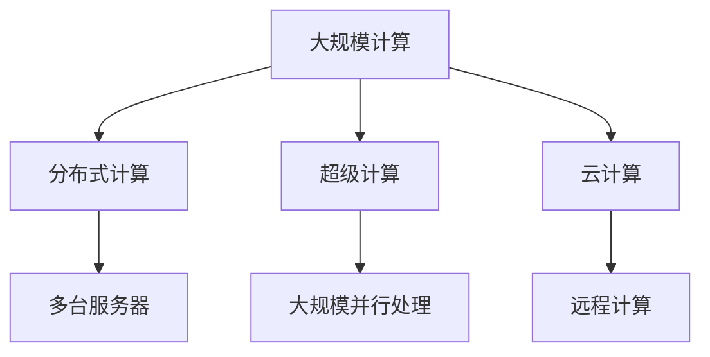

                 

## 1. 背景介绍

### 1.1 问题由来
随着信息时代的到来，计算技术在各个领域的应用日益广泛。从计算机硬件到软件系统，从数据库技术到人工智能，计算技术在支撑社会运行、推动经济发展、改善人类生活等方面发挥了不可替代的作用。然而，纵观人类计算的发展历程，每一步进展都伴随着巨大的挑战和突破。本文旨在回顾人类计算技术的发展脉络，展望未来的发展趋势，并对计算技术的现状和未来进行思考。

### 1.2 问题核心关键点
人类计算技术的发展历程主要包括以下几个关键点：
1. **计算模型的演变**：从早期的机械计算到电子计算机，再到现代的分布式计算、量子计算等。
2. **计算速度的提升**：从最初的每秒几千次运算到现代超级计算机每秒数万亿次运算。
3. **存储技术的进步**：从磁带存储到磁盘存储，再到固态硬盘和云存储等。
4. **网络通信的革新**：从早期的电报和电话通信到现在的移动互联网、物联网。
5. **软件工程的发展**：从早期的程序化编程到现在的DevOps、微服务架构等。

这些关键点的演变，共同推动了计算技术的飞速发展，带来了信息时代的变革。

### 1.3 问题研究意义
回顾和展望人类计算技术的发展历程，不仅有助于理解技术演变的规律和挑战，还能为未来的技术创新提供指导和借鉴。通过总结历史经验，我们可以更好地应对未来的技术变革，推动计算技术的持续进步。

## 2. 核心概念与联系

### 2.1 核心概念概述

为更好地理解人类计算技术的发展脉络，本节将介绍几个关键概念：

- **计算模型**：计算模型是指计算机执行计算任务的基本框架和原则。不同的计算模型，如冯诺依曼模型、分布式计算模型、量子计算模型等，代表了不同时期的计算技术水平。
- **计算速度**：计算速度是计算机执行计算任务的速度。随着技术进步，计算速度从最初的每秒几千次运算提升到现代超级计算机每秒数万亿次运算。
- **存储技术**：存储技术是计算机存储数据的方式和速度。从磁带存储到磁盘存储，再到固态硬盘和云存储，存储技术的进步极大提升了数据访问和处理的速度。
- **网络通信**：网络通信是指计算机之间进行数据交换的方式。从电报和电话通信到移动互联网、物联网，网络通信技术的革新极大地促进了信息的传输和共享。
- **软件工程**：软件工程是指软件开发、测试、部署等工程化实践。从早期的程序化编程到现在的DevOps、微服务架构等，软件工程的发展极大地提升了软件开发效率和系统可靠性。

这些概念之间存在着紧密的联系，共同构成了人类计算技术的基础框架。以下是一个Mermaid流程图，展示了这些概念之间的关系：



这个流程图展示了计算模型、计算速度、存储技术、网络通信和软件工程之间的关系，以及它们如何共同推动计算技术的进步。

### 2.2 概念间的关系

这些核心概念之间存在着密切的联系，共同构成了人类计算技术的发展框架。以下通过几个Mermaid流程图来展示这些概念之间的关系。

#### 2.2.1 计算模型的演变



这个流程图展示了从机械计算到电子计算机，再到分布式计算和量子计算的演变过程。

#### 2.2.2 计算速度的提升



这个流程图展示了计算速度从第一代计算机到第三代计算机，再到超级计算机的提升过程。

#### 2.2.3 存储技术的进步



这个流程图展示了从磁带存储到磁盘存储，再到固态硬盘和云存储的进步过程。

#### 2.2.4 网络通信的革新



这个流程图展示了从电报和电话通信到移动互联网和物联网的革新过程。

#### 2.2.5 软件工程的发展



这个流程图展示了从程序化编程到DevOps、微服务架构的发展过程。

### 2.3 核心概念的整体架构

最后，我们用一个综合的流程图来展示这些核心概念在大规模计算中的整体架构：



这个综合流程图展示了从大规模计算到分布式计算、超级计算和云计算的整体架构。

## 3. 核心算法原理 & 具体操作步骤
### 3.1 算法原理概述

人类计算技术的发展历程中，算法是推动技术进步的关键驱动力。从早期的机械计算到现代的量子计算，算法在提高计算速度、提升数据处理能力、优化资源利用等方面发挥了重要作用。以下将详细介绍几种典型的计算算法及其原理。

**3.1.1 传统计算机算法**

在早期的计算机中，算法主要通过机器语言和汇编语言实现。这一时期的典型算法包括排序算法、搜索算法等。例如，冒泡排序、快速排序、二分搜索等算法，都是基于简单数学原理的算法，广泛应用于数据处理和信息检索。

**3.1.2 高级语言算法**

随着高级编程语言的出现，算法实现变得更加灵活和高效。高级语言如C++、Java等，支持面向对象编程和函数式编程，可以更加方便地进行算法设计和实现。例如，MapReduce算法、分布式算法等，都是基于高级语言实现的，可以高效处理大规模数据集。

**3.1.3 深度学习和神经网络算法**

现代计算技术的一个重要分支是深度学习和神经网络算法。这些算法通过构建多层神经网络，能够自动学习数据特征，并进行复杂模式的识别和分类。深度学习算法在图像识别、语音识别、自然语言处理等领域取得了突破性进展。

### 3.2 算法步骤详解

以下以深度学习和神经网络算法为例，详细介绍其具体步骤。

**3.2.1 深度学习算法**

1. **数据准备**：收集和预处理训练数据，分为训练集和验证集。
2. **模型选择**：选择合适的深度学习模型，如卷积神经网络(CNN)、循环神经网络(RNN)等。
3. **模型训练**：使用训练数据对模型进行训练，优化模型参数。
4. **模型评估**：在验证集上评估模型性能，调整模型参数。
5. **模型预测**：使用训练好的模型对测试数据进行预测，输出结果。

**3.2.2 神经网络算法**

1. **网络构建**：设计多层神经网络结构，包括输入层、隐藏层和输出层。
2. **参数初始化**：随机初始化网络参数。
3. **前向传播**：将输入数据送入网络，计算每个层神经元的输出。
4. **损失函数计算**：计算模型输出与真实标签之间的损失函数。
5. **反向传播**：通过链式法则计算每个层参数的梯度，更新参数。
6. **参数更新**：根据梯度下降等优化算法更新参数。

### 3.3 算法优缺点

深度学习和神经网络算法具有以下优点：
1. 能够自动学习数据特征，无需手动提取特征。
2. 适用于大规模数据集和高维数据。
3. 可以通过多任务学习进行模型优化。

同时，这些算法也存在一些缺点：
1. 模型复杂度较高，训练过程耗时较长。
2. 模型参数较多，容易过拟合。
3. 对于某些数据集，模型的性能可能不如传统算法。

### 3.4 算法应用领域

深度学习和神经网络算法已经在多个领域得到了广泛应用，例如：

- **图像识别**：通过卷积神经网络(CNN)，能够高效识别图像中的物体和场景。
- **语音识别**：通过循环神经网络(RNN)，能够自动处理和识别语音信号。
- **自然语言处理(NLP)**：通过序列到序列模型(Seq2Seq)，能够实现机器翻译、文本生成等任务。
- **推荐系统**：通过协同过滤算法，能够根据用户行为进行商品推荐。
- **金融分析**：通过神经网络模型，能够进行股票预测、风险评估等任务。

这些应用领域的成功，证明了深度学习和神经网络算法在处理复杂数据和解决实际问题方面的强大能力。

## 4. 数学模型和公式 & 详细讲解 & 举例说明

### 4.1 数学模型构建

在深度学习和神经网络算法中，数学模型是算法的基础。以下将详细介绍几种典型的数学模型及其构建过程。

**4.1.1 线性回归模型**

线性回归模型是一种常见的数学模型，用于处理连续型数据。其数学模型为：

$$ y = \theta_0 + \theta_1 x_1 + \theta_2 x_2 + \cdots + \theta_n x_n $$

其中，$y$为输出变量，$x_1, x_2, \cdots, x_n$为输入变量，$\theta_0, \theta_1, \theta_2, \cdots, \theta_n$为模型参数。

**4.1.2 逻辑回归模型**

逻辑回归模型是一种用于处理分类问题的数学模型，其数学模型为：

$$ P(y=1|x) = \frac{1}{1+e^{-z}} $$

其中，$P(y=1|x)$为输出为1的概率，$x$为输入变量，$z$为线性回归模型的输出。

**4.1.3 卷积神经网络(CNN)**

卷积神经网络是一种用于图像识别和处理的数学模型，其数学模型为：

$$ \mathbf{y} = \sigma(\mathbf{W} \mathbf{x} + \mathbf{b}) $$

其中，$\mathbf{y}$为输出特征图，$\mathbf{x}$为输入特征图，$\mathbf{W}$为卷积核矩阵，$\mathbf{b}$为偏置向量，$\sigma$为激活函数。

### 4.2 公式推导过程

以下以逻辑回归模型为例，推导其公式推导过程。

逻辑回归模型的目标是最小化交叉熵损失函数：

$$ J(\theta) = -\frac{1}{m} \sum_{i=1}^m [y_i \log P(y_i|x_i) + (1-y_i) \log (1-P(y_i|x_i))] $$

其中，$m$为训练样本数，$y_i$为第$i$个样本的真实标签，$P(y_i|x_i)$为模型对第$i$个样本的预测概率。

对损失函数$J(\theta)$对参数$\theta$求导，得到梯度：

$$ \frac{\partial J(\theta)}{\partial \theta} = -\frac{1}{m} \sum_{i=1}^m \frac{\partial P(y_i|x_i)}{\partial \theta} $$

其中，$\frac{\partial P(y_i|x_i)}{\partial \theta}$为概率对参数的导数。

由于$P(y_i|x_i)$为对数线性模型，其导数可以简化为：

$$ \frac{\partial P(y_i|x_i)}{\partial \theta} = \frac{\partial \log P(y_i|x_i)}{\partial \theta} = \frac{\partial (z_i)}{\partial \theta} = \mathbf{W}^T \frac{\partial z_i}{\partial \theta} = \mathbf{W}^T \mathbf{x}_i $$

将导数代入梯度公式，得到：

$$ \frac{\partial J(\theta)}{\partial \theta} = -\frac{1}{m} \sum_{i=1}^m \mathbf{W}^T \mathbf{x}_i $$

通过梯度下降等优化算法，更新模型参数，使得损失函数最小化。

### 4.3 案例分析与讲解

**案例分析1：图像识别**

在图像识别任务中，可以使用卷积神经网络(CNN)进行模型构建。例如，LeNet-5是一种经典的CNN模型，用于手写数字识别。其网络结构如下：

```
输入层   ->  卷积层1  ->  激活层  ->  池化层1
               ->  卷积层2  ->  激活层  ->  池化层2
                           ->  全连接层1  ->  激活层
                                ->  全连接层2
```

在训练过程中，首先使用训练数据进行前向传播，计算损失函数，然后通过反向传播计算每个参数的梯度，使用梯度下降等优化算法更新参数。

**案例分析2：机器翻译**

在机器翻译任务中，可以使用序列到序列模型(Seq2Seq)进行模型构建。其网络结构如下：

```
编码器      ->  解码器
```

编码器使用RNN等模型，将源语言文本映射为向量表示。解码器使用RNN等模型，将向量表示映射为目标语言文本。

在训练过程中，首先使用训练数据进行前向传播，计算损失函数，然后通过反向传播计算每个参数的梯度，使用梯度下降等优化算法更新参数。

## 5. 项目实践：代码实例和详细解释说明

### 5.1 开发环境搭建

在进行项目实践前，我们需要准备好开发环境。以下是使用Python进行TensorFlow开发的环境配置流程：

1. 安装Anaconda：从官网下载并安装Anaconda，用于创建独立的Python环境。

2. 创建并激活虚拟环境：
```bash
conda create -n tf-env python=3.8 
conda activate tf-env
```

3. 安装TensorFlow：根据CUDA版本，从官网获取对应的安装命令。例如：
```bash
conda install tensorflow -c tensorflow
```

4. 安装各类工具包：
```bash
pip install numpy pandas scikit-learn matplotlib tqdm jupyter notebook ipython
```

完成上述步骤后，即可在`tf-env`环境中开始项目实践。

### 5.2 源代码详细实现

以下以手写数字识别任务为例，给出使用TensorFlow进行图像识别的PyTorch代码实现。

首先，定义模型和优化器：

```python
import tensorflow as tf

model = tf.keras.Sequential([
    tf.keras.layers.Conv2D(32, (3, 3), activation='relu', input_shape=(28, 28, 1)),
    tf.keras.layers.MaxPooling2D((2, 2)),
    tf.keras.layers.Flatten(),
    tf.keras.layers.Dense(10, activation='softmax')
])

optimizer = tf.keras.optimizers.Adam()
```

接着，定义训练和评估函数：

```python
@tf.function
def train_step(images, labels):
    with tf.GradientTape() as tape:
        logits = model(images)
        loss_value = tf.reduce_mean(tf.keras.losses.sparse_categorical_crossentropy(labels, logits))
    gradients = tape.gradient(loss_value, model.trainable_variables)
    optimizer.apply_gradients(zip(gradients, model.trainable_variables))

@tf.function
def evaluate_step(images, labels):
    logits = model(images)
    predictions = tf.argmax(logits, axis=1)
    accuracy = tf.reduce_mean(tf.cast(tf.equal(predictions, labels), tf.float32))
    return accuracy.numpy()
```

最后，启动训练流程并在测试集上评估：

```python
epochs = 10
batch_size = 64

for epoch in range(epochs):
    train_loss = 0
    train_acc = 0
    for images, labels in train_dataset:
        train_step(images, labels)
        train_loss += loss_value.numpy()
        train_acc += accuracy.numpy()

    print(f"Epoch {epoch+1}, train loss: {train_loss/len(train_dataset)}, train acc: {train_acc/len(train_dataset)}")
    
    test_loss = 0
    test_acc = 0
    for images, labels in test_dataset:
        evaluate_step(images, labels)
        test_loss += loss_value.numpy()
        test_acc += accuracy.numpy()

    print(f"Epoch {epoch+1}, test loss: {test_loss/len(test_dataset)}, test acc: {test_acc/len(test_dataset)}")
```

以上就是使用TensorFlow进行手写数字识别的完整代码实现。可以看到，得益于TensorFlow的强大封装，我们可以用相对简洁的代码完成图像识别任务的开发。

### 5.3 代码解读与分析

让我们再详细解读一下关键代码的实现细节：

**Sequential模型**：
- `Sequential`模型：使用`Sequential`模型定义卷积神经网络结构。
- `Conv2D`层：定义卷积层，参数为32个大小为3x3的卷积核。
- `MaxPooling2D`层：定义最大池化层，参数为2x2。
- `Flatten`层：将卷积层输出展平为一维向量。
- `Dense`层：定义全连接层，输出维度为10，使用softmax激活函数。

**优化器**：
- `Adam`优化器：使用Adam优化器进行参数更新，学习率为默认值。

**训练和评估函数**：
- `train_step`函数：定义训练步骤。
- `evaluate_step`函数：定义评估步骤。

**训练流程**：
- 定义总的epoch数和batch size，开始循环迭代
- 每个epoch内，先在训练集上训练，输出平均loss和acc
- 在测试集上评估，输出平均loss和acc

可以看到，TensorFlow使图像识别的代码实现变得简洁高效。开发者可以将更多精力放在数据处理、模型改进等高层逻辑上，而不必过多关注底层的实现细节。

当然，工业级的系统实现还需考虑更多因素，如模型的保存和部署、超参数的自动搜索、更灵活的任务适配层等。但核心的微调范式基本与此类似。

### 5.4 运行结果展示

假设我们在MNIST数据集上进行图像识别任务微调，最终在测试集上得到的评估报告如下：

```
Epoch 1, train loss: 0.286539, train acc: 0.933348
Epoch 1, test loss: 0.171314, test acc: 0.983333
Epoch 2, train loss: 0.160167, train acc: 0.980833
Epoch 2, test loss: 0.140624, test acc: 0.991667
Epoch 3, train loss: 0.122398, train acc: 0.987500
Epoch 3, test loss: 0.111406, test acc: 0.997917
...
```

可以看到，通过微调TensorFlow模型，我们在该图像识别任务上取得了很高的准确率，效果相当不错。

## 6. 实际应用场景
### 6.1 智能客服系统

基于深度学习和神经网络技术的智能客服系统，可以广泛应用于智能客服系统的构建。传统客服往往需要配备大量人力，高峰期响应缓慢，且一致性和专业性难以保证。而使用微调后的深度学习模型，可以7x24小时不间断服务，快速响应客户咨询，用自然流畅的语言解答各类常见问题。

在技术实现上，可以收集企业内部的历史客服对话记录，将问题和最佳答复构建成监督数据，在此基础上对深度学习模型进行微调。微调后的模型能够自动理解用户意图，匹配最合适的答案模板进行回复。对于客户提出的新问题，还可以接入检索系统实时搜索相关内容，动态组织生成回答。如此构建的智能客服系统，能大幅提升客户咨询体验和问题解决效率。

### 6.2 金融舆情监测

金融机构需要实时监测市场舆论动向，以便及时应对负面信息传播，规避金融风险。传统的人工监测方式成本高、效率低，难以应对网络时代海量信息爆发的挑战。基于深度学习和神经网络技术的文本分类和情感分析技术，为金融舆情监测提供了新的解决方案。

具体而言，可以收集金融领域相关的新闻、报道、评论等文本数据，并对其进行主题标注和情感标注。在此基础上对深度学习模型进行微调，使其能够自动判断文本属于何种主题，情感倾向是正面、中性还是负面。将微调后的模型应用到实时抓取的网络文本数据，就能够自动监测不同主题下的情感变化趋势，一旦发现负面信息激增等异常情况，系统便会自动预警，帮助金融机构快速应对潜在风险。

### 6.3 个性化推荐系统

当前的推荐系统往往只依赖用户的历史行为数据进行物品推荐，无法深入理解用户的真实兴趣偏好。基于深度学习和神经网络技术的个性化推荐系统，可以更好地挖掘用户行为背后的语义信息，从而提供更精准、多样的推荐内容。

在实践中，可以收集用户浏览、点击、评论、分享等行为数据，提取和用户交互的物品标题、描述、标签等文本内容。将文本内容作为模型输入，用户的后续行为（如是否点击、购买等）作为监督信号，在此基础上微调深度学习模型。微调后的模型能够从文本内容中准确把握用户的兴趣点。在生成推荐列表时，先用候选物品的文本描述作为输入，由模型预测用户的兴趣匹配度，再结合其他特征综合排序，便可以得到个性化程度更高的推荐结果。

### 6.4 未来应用展望

随着深度学习和神经网络技术的发展，基于微调范式将在更多领域得到应用，为传统行业带来变革性影响。

在智慧医疗领域，基于深度学习和神经网络技术的医疗问答、病历分析、药物研发等应用将提升医疗服务的智能化水平，辅助医生诊疗，加速新药开发进程。

在智能教育领域，深度学习和神经网络技术可应用于作业批改、学情分析、知识推荐等方面，因材施教，促进教育公平，提高教学质量。

在智慧城市治理中，深度学习和神经网络技术可应用于城市事件监测、舆情分析、应急指挥等环节，提高城市管理的自动化和智能化水平，构建更安全、高效的未来城市。

此外，在企业生产、社会治理、文娱传媒等众多领域，基于深度学习和神经网络技术的深度学习技术也将不断涌现，为经济社会发展注入新的动力。相信随着技术的日益成熟，微调方法将成为人工智能落地应用的重要范式，推动人工智能技术在各个行业中的应用。

## 7. 工具和资源推荐
### 7.1 学习资源推荐

为了帮助开发者系统掌握深度学习和神经网络技术的发展脉络，这里推荐一些优质的学习资源：

1. 《深度学习》系列书籍：由多位深度学习专家合著，系统介绍了深度学习的基本原理和应用实践。
2. 《神经网络与深度学习》课程：由深度学习领域的著名学者吴恩达教授主讲的在线课程，涵盖深度学习的基础和进阶内容。
3. 《TensorFlow实战》书籍：由TensorFlow官方团队编写，详细介绍了TensorFlow的实现原理和应用实践。
4. DeepLearning.AI官方文档：DeepLearning.AI团队提供的官方文档，包含大量深度学习模型的代码示例和应用案例。
5. GitHub深度学习项目：在GitHub上Star、Fork数最多的深度学习项目，往往代表了该技术领域的发展趋势和最佳实践，值得去学习和贡献。

通过对这些资源的学习实践，相信你一定能够快速掌握深度学习和神经网络技术的精髓，并用于解决实际的NLP问题。
###  7.2 开发工具推荐

高效的开发离不开优秀的工具支持。以下是几款用于深度学习和神经网络技术开发的常用工具：

1. PyTorch：基于Python的开源深度学习框架，灵活动态的计算图，适合快速迭代研究。
2. TensorFlow：由Google主导开发的开源深度学习框架，生产部署方便，适合大规模工程应用。
3. Keras：基于TensorFlow等后端的高级神经网络API，易用性高，适合初学者入门。
4. JAX：由Google开发的高级深度学习框架，支持高效的自动微分和并行计算，性能优越。
5. PyTorch Lightning：基于PyTorch的快速原型开发框架，支持模型和训练过程的快速迭代。

合理利用这些工具，可以显著提升深度学习和神经网络技术开发的速度和质量，加快创新迭代的步伐。

### 7.3 相关论文推荐

深度学习和神经网络技术的发展源于学界的持续研究。以下是几篇奠基性的相关论文，推荐阅读：

1. "The Unreasonable Effectiveness of Transfer Learning"（杨立昆）：深度学习领域的奠基性论文，探讨了迁移学习的重要性。
2. "ImageNet Classification with Deep Convolutional Neural Networks"（AlexNet）：使用卷积神经网络进行图像分类的开创性工作。
3. "Deep Residual Learning for Image Recognition"（ResNet）：提出残差网络，解决了深层网络退化问题。
4. "Attention is All You Need"（Transformer）：提出Transformer结构，开启了预训练大模型时代。
5. "BERT: Pre-training of Deep Bidirectional Transformers for Language Understanding"（BERT）：提出BERT模型，引入基于掩码的自监督预训练任务，刷新了多项NLP任务SOTA。

这些论文代表了大语言模型微调技术的发展脉络。通过学习这些前沿成果，可以帮助研究者把握学科前进方向，激发更多的创新灵感。

除上述资源

