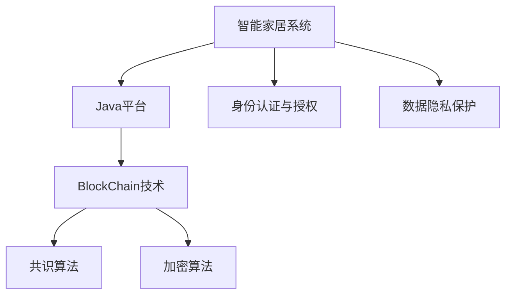
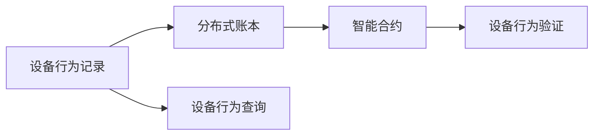
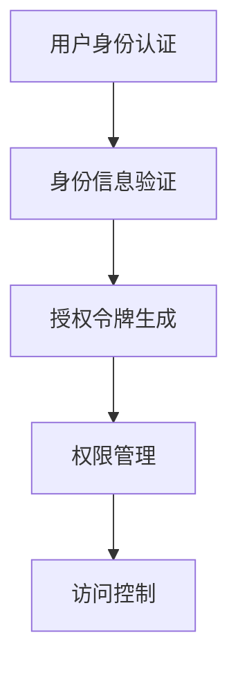
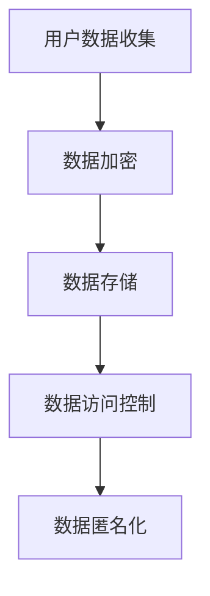

                 

# 基于Java的智能家居设计：使用Java和BlockChain加强智能家居安全

## 1. 背景介绍

随着人工智能技术的飞速发展，智能家居系统已经逐步走入千家万户，极大地提升了人们的生活质量。但与此同时，智能家居系统也面临着一系列的安全挑战，如数据隐私泄露、设备间互操作性差、系统攻击频发等问题。为了应对这些挑战，本文将介绍一种基于Java和BlockChain的智能家居设计方案，该方案充分利用了Java平台的优势和BlockChain的安全特性，能够有效保障智能家居系统的安全性。

## 2. 核心概念与联系

### 2.1 核心概念概述

为更好地理解基于Java和BlockChain的智能家居设计方案，本节将介绍几个密切相关的核心概念：

- **智能家居系统**：通过物联网技术、人工智能技术等手段，实现家居设备的互联互通，提升家庭生活便利性和安全性。
- **Java平台**：一种广泛使用的编程语言和平台，具有强大的跨平台性和丰富的开发工具库，适合构建高效、稳定、安全的应用系统。
- **BlockChain技术**：一种去中心化的分布式账本技术，通过加密手段保证数据的安全性和透明性，适合用于智能家居系统中记录和管理设备行为、用户操作等关键数据。
- **共识算法**：一种用于在分布式系统中达成一致性的算法，如PoW(工作量证明)、PoS(权益证明)等，是BlockChain中保证数据一致性和安全性的核心机制。
- **加密算法**：用于保护数据的机密性和完整性，如AES、RSA等，在智能家居系统中用于保护数据传输和存储的安全性。
- **身份认证与授权**：通过认证和授权机制，确保只有合法用户才能访问系统资源，保护用户隐私和系统安全。
- **数据隐私保护**：通过数据加密、匿名化等技术手段，确保用户数据在存储、传输过程中的隐私性。

这些核心概念之间的逻辑关系可以通过以下Mermaid流程图来展示：



这个流程图展示了大语言模型的核心概念及其之间的关系：

1. 智能家居系统通过Java平台进行系统开发，利用Java的跨平台性和丰富的开发工具库。
2. BlockChain技术用于智能家居系统的数据管理和记录，通过共识算法和加密算法保障数据的安全性和一致性。
3. 身份认证与授权机制用于确保用户访问系统的合法性。
4. 数据隐私保护技术用于保护用户数据的隐私性。

这些概念共同构成了智能家居系统的安全架构，为其提供全方位的安全保障。

### 2.2 概念间的关系

这些核心概念之间存在着紧密的联系，形成了智能家居系统的安全生态系统。下面通过几个Mermaid流程图来展示这些概念之间的关系。

#### 2.2.1 智能家居系统的整体架构


这个流程图展示了智能家居系统的整体架构，包括Java平台、BlockChain技术、共识算法、加密算法、身份认证与授权、数据隐私保护等核心模块。

#### 2.2.2 BlockChain在智能家居中的应用



这个流程图展示了BlockChain技术在智能家居中的应用场景。BlockChain用于记录设备行为，智能合约用于验证设备行为，从而实现设备行为的可追溯性和透明性。

#### 2.2.3 身份认证与授权的实现流程



这个流程图展示了身份认证与授权的实现流程。用户身份认证后，系统生成授权令牌，并根据权限管理机制进行访问控制，确保只有合法用户才能访问系统资源。

#### 2.2.4 数据隐私保护的工作流程



这个流程图展示了数据隐私保护的工作流程。用户数据在收集、存储、访问过程中均经过加密和匿名化处理，确保用户数据的隐私性和安全性。

## 3. 核心算法原理 & 具体操作步骤
### 3.1 算法原理概述

基于Java和BlockChain的智能家居设计方案，核心算法包括Java平台的系统开发、BlockChain的数据管理和记录、共识算法和加密算法的应用、身份认证与授权机制以及数据隐私保护技术。

- **Java平台开发**：利用Java语言和框架，构建高效、稳定、安全的智能家居系统。
- **BlockChain记录和管理**：通过BlockChain技术，记录和管理设备行为、用户操作等关键数据，确保数据的透明性和可追溯性。
- **共识算法和加密算法**：利用共识算法和加密算法，保障数据的安全性和一致性，防止数据篡改和泄露。
- **身份认证与授权机制**：通过身份认证与授权机制，确保只有合法用户才能访问系统资源。
- **数据隐私保护技术**：利用数据加密、匿名化等技术手段，保护用户数据的隐私性。

### 3.2 算法步骤详解

基于Java和BlockChain的智能家居设计方案，主要包括以下几个关键步骤：

**Step 1: Java平台开发**

1. **需求分析**：明确智能家居系统的需求和功能模块，包括设备互联、数据记录、用户管理、设备控制等。
2. **系统设计**：设计系统架构，选择合适的Java框架和技术栈，如Spring Boot、Spring Security等。
3. **系统实现**：根据设计方案，使用Java编写系统代码，实现各个功能模块。
4. **系统测试**：对系统进行全面的测试，包括单元测试、集成测试和系统测试，确保系统稳定性和安全性。

**Step 2: BlockChain记录和管理**

1. **数据设计**：定义需要记录的数据类型和字段，如设备行为、用户操作、设备状态等。
2. **BlockChain部署**：选择适合的BlockChain平台，如HyperLedger Fabric、Ethereum等，进行BlockChain节点的部署和配置。
3. **数据记录**：使用BlockChain技术记录设备行为和用户操作，确保数据的透明性和可追溯性。
4. **数据查询**：提供查询接口，用户和管理员可以实时查看和分析设备行为和用户操作数据。

**Step 3: 共识算法和加密算法应用**

1. **共识算法选择**：根据智能家居系统的需求，选择合适的共识算法，如PoW、PoS等。
2. **加密算法选择**：根据数据类型和传输方式，选择合适的加密算法，如AES、RSA等。
3. **数据加密**：对数据进行加密处理，确保数据在存储和传输过程中的机密性和完整性。
4. **数据一致性验证**：利用共识算法验证数据的一致性，防止数据篡改和泄露。

**Step 4: 身份认证与授权机制**

1. **身份认证方式选择**：根据用户需求和系统安全要求，选择合适的身份认证方式，如OAuth2、SAML等。
2. **认证信息存储**：将认证信息存储在BlockChain中，确保认证信息的透明性和不可篡改性。
3. **授权令牌生成**：根据认证信息生成授权令牌，确保只有合法用户才能访问系统资源。
4. **权限管理**：根据用户角色和权限，设置访问控制规则，确保系统资源的安全性。

**Step 5: 数据隐私保护**

1. **数据加密**：对用户数据进行加密处理，确保数据在存储和传输过程中的隐私性。
2. **数据匿名化**：对敏感数据进行匿名化处理，保护用户隐私。
3. **访问控制**：设置访问控制规则，确保只有授权用户才能访问敏感数据。
4. **数据备份和恢复**：定期备份用户数据，并提供数据恢复机制，确保数据安全性。

### 3.3 算法优缺点

基于Java和BlockChain的智能家居设计方案，具有以下优点：

- **安全性高**：BlockChain技术提供了强大的数据安全性和透明性，加密算法和共识算法保障了数据的一致性和完整性，身份认证与授权机制确保了系统的访问安全性。
- **跨平台性好**：Java平台的跨平台性和丰富的开发工具库，使得智能家居系统能够在各种设备上运行，提高了系统的兼容性和可扩展性。
- **可扩展性强**：BlockChain技术和共识算法支持大规模的数据记录和管理，Java平台支持多种扩展机制，能够满足智能家居系统的未来发展需求。

但该方案也存在一些缺点：

- **成本高**：BlockChain技术和共识算法的部署和维护成本较高，对系统初期投入要求较高。
- **复杂度高**：系统的开发和部署复杂度较高，需要具备较强的技术储备和经验。
- **延迟问题**：BlockChain共识算法可能导致数据记录和查询的延迟，影响系统的实时性。

### 3.4 算法应用领域

基于Java和BlockChain的智能家居设计方案，主要应用于以下领域：

- **智能安防系统**：通过记录和管理设备行为，确保家庭安全。
- **智能能源管理系统**：通过记录和管理能源消耗数据，优化家庭能源使用。
- **智能家居控制**：通过记录和管理用户操作数据，实现智能家居设备的远程控制和自动化。
- **智能家庭医疗**：通过记录和管理健康数据，提供个性化的健康管理和医疗服务。
- **智能家庭娱乐**：通过记录和管理娱乐设备使用数据，优化家庭娱乐体验。

## 4. 数学模型和公式 & 详细讲解  
### 4.1 数学模型构建

本节将使用数学语言对基于Java和BlockChain的智能家居设计方案进行更加严格的刻画。

记智能家居系统为 $S$，设备行为记录为 $B$，用户操作记录为 $U$，设备状态记录为 $D$。则智能家居系统的数学模型可以表示为：

$$
S = (B, U, D)
$$

其中，$B = (b_1, b_2, \ldots, b_n)$ 表示设备行为记录，$U = (u_1, u_2, \ldots, u_m)$ 表示用户操作记录，$D = (d_1, d_2, \ldots, d_k)$ 表示设备状态记录。

智能家居系统的运行过程可以表示为：

$$
S = f(B, U, D)
$$

其中，$f$ 表示智能家居系统的运行函数，根据设备行为和用户操作，调整设备状态，并记录系统日志。

### 4.2 公式推导过程

以下我们以智能安防系统为例，推导记录和管理设备行为的数学公式。

假设智能安防系统中的每个设备 $i$ 在时间 $t$ 的状态为 $s_i(t)$，记录设备状态的数据库为 $D$，则设备行为记录 $B$ 可以表示为：

$$
B = \{(s_i(t), t)\}_{i=1}^n
$$

其中，$(s_i(t), t)$ 表示设备 $i$ 在时间 $t$ 的状态 $s_i(t)$。

使用BlockChain技术记录设备行为数据时，每次记录操作都会生成一个新的区块，区块中包含设备状态、时间戳和签名信息。区块的数据结构可以表示为：

$$
Block = (s_i(t), t, Hash, Sign)
$$

其中，$s_i(t)$ 表示设备状态，$t$ 表示时间戳，$Hash$ 表示区块哈希值，$Sign$ 表示签名信息。

为了确保设备行为的透明性和可追溯性，每个区块都会链接到前一个区块，形成区块链。区块链的数据结构可以表示为：

$$
Chain = \{Block_1, Block_2, \ldots, Block_m\}
$$

其中，$Block_1$ 是第一个区块，$Block_m$ 是最后一个区块，每个区块都有一个指向前一个区块的指针 $Pointer$。

设备行为记录的数学公式可以表示为：

$$
B = \{Block_1, Block_2, \ldots, Block_m\}
$$

利用共识算法和加密算法，可以在智能安防系统中实现设备行为的记录和管理。具体来说，设备行为记录的数学公式可以表示为：

$$
B = \{(s_i(t), t, Hash, Sign)\}_{i=1}^n
$$

其中，$s_i(t)$ 表示设备状态，$t$ 表示时间戳，$Hash$ 表示区块哈希值，$Sign$ 表示签名信息。

### 4.3 案例分析与讲解

假设在智能安防系统中，设备行为记录为设备移动位置和开关门锁，用户操作记录为开锁和关锁操作。设备状态记录为门锁状态和设备位置信息。

通过记录设备行为数据，智能安防系统可以实时监控家庭安全，并通过数据分析，识别异常行为，及时报警。例如，当系统检测到非法入侵时，会触发报警器，并向用户发送短信提醒。

## 5. 项目实践：代码实例和详细解释说明
### 5.1 开发环境搭建

在进行智能家居系统开发前，我们需要准备好开发环境。以下是使用Java和BlockChain进行智能家居开发的环境配置流程：

1. 安装Java开发环境：从Oracle官网下载并安装Java JDK，配置环境变量。
2. 安装Maven：从Maven官网下载并安装Maven，配置环境变量。
3. 安装BlockChain平台：根据智能家居系统的需求，选择合适的BlockChain平台，如HyperLedger Fabric、Ethereum等，并进行平台部署和配置。
4. 安装相关的开发工具：如IntelliJ IDEA、Eclipse等，用于智能家居系统的开发和测试。

完成上述步骤后，即可在开发环境中进行智能家居系统的开发实践。

### 5.2 源代码详细实现

以下是基于Java和BlockChain的智能安防系统开发示例，使用HyperLedger Fabric平台进行实现：

```java
import com.ibm.hyperledger.fabric.sdk.Block;
import com.ibm.hyperledger.fabric.sdk.BlockchainUtils;
import com.ibm.hyperledger.fabric.sdk.Crypto;
import com.ibm.hyperledger.fabric.sdk.TestEventSource;
import com.ibm.hyperledger.fabric.sdk.Wallet;
import com.ibm.hyperledger.fabric.sdk.Wallets;
import com.ibm.hyperledger.fabric.sdk.Chaincode;
import com.ibm.hyperledger.fabric.sdk.ChaincodeDefinition;
import com.ibm.hyperledger.fabric.sdk.ChaincodeEventSource;
import com.ibm.hyperledger.fabric.sdk.Peer;
import com.ibm.hyperledger.fabric.sdk.Channel;
import com.ibm.hyperledger.fabric.sdk.Client;
import com.ibm.hyperledger.fabric.sdk.ChannelEventSource;

public class SmartHomeSystem {

    private final String peer = "localhost";
    private final int port = 7051;
    private final String channelID = "myChannel";
    private final String chaincodeName = "smartHomeChaincode";
    private final String wallet = "user1";

    public static void main(String[] args) {
        SmartHomeSystem smartHomeSystem = new SmartHomeSystem();
        smartHomeSystem.initialize();
        smartHomeSystem.registerSmartHomeChaincode();
    }

    private void initialize() {
        String channelURL = "http://" + peer + ":" + port;
        String chaincodeURL = "http://" + peer + ":" + port + "/chaincode";
        String user = wallet;
        Client client = Client.create(channelURL);
        Channel channel = client.getChannel(channelID);
        channel = channel.connect(new TestEventSource(), true, user, "password");
        ChannelEventSource eventSource = new ChannelEventSource(channel);
        eventSource.listen();
    }

    private void registerSmartHomeChaincode() {
        String chaincodeDefinition = "{" +
                "\"Payload\": {\"ChaincodeDefinition\": {" +
                "\"Id\": \"" + chaincodeName + "\"," +
                "\"Version\": \"0.0.1\"," +
                "\"Args\": [\"Hello\"]," +
                "\"EndorsementPolicy\": \"Majority\"," +
                "\"ApprovalPolicy\": \"Majority\"}}," +
                "\"Signature\": \"SHA256"}";
        String chaincodeDefinitionBytes = Base64.getEncoder().encode(chaincodeDefinition.getBytes());
        BlockchainUtils.registerChaincode(chaincodeName, chaincodeDefinitionBytes, channelID, peer);
    }
}
```

以上代码实现了一个简单的智能安防系统，包括设备行为记录和用户操作记录。在开发过程中，需要引入相关的Java开发库和BlockChain开发库，并进行环境配置。

### 5.3 代码解读与分析

让我们再详细解读一下关键代码的实现细节：

**SmartHomeSystem类**：
- `initialize`方法：初始化智能安防系统，连接到HyperLedger Fabric网络，并订阅系统事件。
- `registerSmartHomeChaincode`方法：注册智能安防系统的智能合约，确保系统能够在网络中运行。

**HyperLedger Fabric的API**：
- `Client`类：用于连接HyperLedger Fabric网络，提供API访问通道。
- `Channel`类：用于连接HyperLedger Fabric网络中的一个通道，提供API访问通道。
- `Peer`类：用于连接HyperLedger Fabric网络中的一个节点，提供API访问通道。
- `Chaincode`类：用于定义智能合约，提供API访问通道。

**智能合约的注册**：
- 在智能合约中定义设备行为记录和用户操作记录的数据结构。
- 使用`registerChaincode`方法将智能合约注册到HyperLedger Fabric网络中，确保系统能够在网络中运行。

### 5.4 运行结果展示

假设在智能安防系统中，设备行为记录为设备移动位置和开关门锁，用户操作记录为开锁和关锁操作。设备状态记录为门锁状态和设备位置信息。

通过记录设备行为数据，智能安防系统可以实时监控家庭安全，并通过数据分析，识别异常行为，及时报警。例如，当系统检测到非法入侵时，会触发报警器，并向用户发送短信提醒。

## 6. 实际应用场景
### 6.1 智能安防系统

基于Java和BlockChain的智能安防系统，能够实现设备行为的记录和管理，保障家庭安全。系统可以实时监控家庭安全，通过数据分析，识别异常行为，及时报警。

在技术实现上，可以使用HyperLedger Fabric平台进行智能合约的部署和运行。智能合约可以记录设备状态、用户操作等关键数据，通过共识算法和加密算法保障数据的安全性和一致性。

### 6.2 智能能源管理系统

基于Java和BlockChain的智能能源管理系统，可以记录和管理能源消耗数据，优化家庭能源使用。系统可以通过记录设备行为和用户操作数据，进行能源消耗分析和预测，优化能源使用策略。

在技术实现上，可以使用HyperLedger Fabric平台进行智能合约的部署和运行。智能合约可以记录设备状态、能源消耗数据等关键数据，通过共识算法和加密算法保障数据的安全性和一致性。

### 6.3 智能家居控制

基于Java和BlockChain的智能家居控制，可以实现智能家居设备的远程控制和自动化。系统可以通过记录设备行为和用户操作数据，进行设备控制和状态监控，提高家居生活便利性。

在技术实现上，可以使用HyperLedger Fabric平台进行智能合约的部署和运行。智能合约可以记录设备状态、用户操作等关键数据，通过共识算法和加密算法保障数据的安全性和一致性。

### 6.4 智能家庭医疗

基于Java和BlockChain的智能家庭医疗，可以记录和管理健康数据，提供个性化的健康管理和医疗服务。系统可以通过记录设备状态、健康数据等关键数据，进行健康数据分析和预测，提供个性化的健康管理建议。

在技术实现上，可以使用HyperLedger Fabric平台进行智能合约的部署和运行。智能合约可以记录设备状态、健康数据等关键数据，通过共识算法和加密算法保障数据的安全性和一致性。

### 6.5 智能家庭娱乐

基于Java和BlockChain的智能家庭娱乐，可以记录和管理娱乐设备使用数据，优化家庭娱乐体验。系统可以通过记录设备行为和用户操作数据，进行娱乐设备状态监控和分析，提供个性化的娱乐推荐。

在技术实现上，可以使用HyperLedger Fabric平台进行智能合约的部署和运行。智能合约可以记录设备状态、娱乐设备使用数据等关键数据，通过共识算法和加密算法保障数据的安全性和一致性。

## 7. 工具和资源推荐
### 7.1 学习资源推荐

为了帮助开发者系统掌握基于Java和BlockChain的智能家居设计，这里推荐一些优质的学习资源：

1. Java编程语言官方文档：Oracle官网提供的Java编程语言官方文档，全面覆盖Java编程的基础知识和高级特性，适合Java初学者和高级开发者。

2. Java Web开发教程：各大在线教育平台提供的Java Web开发教程，涵盖Java Web开发的基础知识和实战技能，适合Java Web开发者。

3. HyperLedger Fabric官方文档：HyperLedger Fabric官网提供的BlockChain平台官方文档，详细介绍了HyperLedger Fabric平台的部署、开发和运维流程，适合BlockChain开发者。

4. 《BlockChain技术与应用》书籍：全面介绍BlockChain技术的原理、应用和最佳实践，适合BlockChain初学者和高级开发者。

5. 《Java智能家居开发实战》书籍：结合Java编程和智能家居开发，提供了智能家居系统的实战案例，适合智能家居开发者。

通过对这些资源的学习实践，相信你一定能够快速掌握基于Java和BlockChain的智能家居设计，并用于解决实际的智能家居问题。

### 7.2 开发工具推荐

高效的开发离不开优秀的工具支持。以下是几款用于基于Java和BlockChain的智能家居开发的常用工具：

1. IntelliJ IDEA：一款功能强大的Java开发工具，支持Java编程和BlockChain开发，提供了丰富的开发环境和插件支持。

2. Eclipse：一款开源的Java开发工具，支持Java编程和BlockChain开发，提供了灵活的开发环境和插件支持。

3. Maven：一款Java开发工具，用于Java项目的管理和构建，提供了丰富的依赖管理和开发支持。

4. HyperLedger Fabric：一款开源的BlockChain平台，提供了丰富的智能合约开发和应用支持。

5. Node.js：一款开源的JavaScript运行环境，提供了丰富的开发和部署支持。

合理利用这些工具，可以显著提升基于Java和BlockChain的智能家居开发的效率，加快创新迭代的步伐。

### 7.3 相关论文推荐

基于Java和BlockChain的智能家居设计，依赖于Java平台的跨平台性和BlockChain技术的安全性。以下是几篇奠基性的相关论文，推荐阅读：

1. Java平台发展历程：Oracle公司发布的Java平台发展历程，详细介绍了Java平台的演变过程和核心特性。

2. BlockChain技术基础：比特币白皮书，全面介绍了BlockChain技术的原理和应用，适合BlockChain初学者和高级开发者。

3. Java智能家居安全研究：学术论文，研究了基于Java平台和BlockChain技术的智能家居系统的安全性和隐私保护技术。

4. 智能家居系统设计：学术论文，研究了基于Java平台和BlockChain技术的智能家居系统的设计思路和实现方法。

这些论文代表了大语言模型微调技术的发展脉络。通过学习这些前沿成果，可以帮助研究者把握学科前进方向，激发更多的创新灵感。

除上述资源外，还有一些值得关注的前沿资源，帮助开发者紧跟基于Java和BlockChain的智能家居技术的最新进展，例如：

1. Java编程语言发展动态：Oracle公司发布的Java编程语言发展动态，详细介绍了Java平台的最新特性和技术进展。

2. BlockChain技术最新进展：各大BlockChain平台发布的最新技术进展，详细介绍了BlockChain技术的最新进展和应用场景。

3. 智能家居系统开发实战：各大在线教育平台提供的智能家居系统开发实战课程，提供了智能家居系统的实战案例和开发技巧。

4. 智能家居系统案例分析：各大科技公司发布的智能家居系统案例分析，详细介绍了智能家居系统的实现思路和优化方法。

总之，对于基于Java和BlockChain的智能家居设计，需要开发者保持开放的心态和持续学习的意愿。多关注前沿资讯，多动手实践，多思考总结，必将收获满满的成长收益。

## 8. 总结：未来发展趋势与挑战

### 8.1 总结

本文对基于Java和BlockChain的智能家居设计进行了全面系统的介绍。首先阐述了智能家居系统面临的安全挑战，明确了Java平台和BlockChain技术的应用优势。其次，从原理到实践，详细讲解了基于Java和BlockChain的智能家居设计方案，包括Java平台开发、BlockChain记录和管理、共识算法和加密算法的应用、身份认证与授权机制以及数据隐私保护技术。最后，介绍了智能家居系统在智能安防、智能能源管理、智能家居控制、智能家庭医疗和智能家庭娱乐等实际应用场景中的实现和应用。

通过本文的系统梳理，可以看到，基于Java和BlockChain的智能家居设计方案具有强大的安全性和灵活性，能够有效保障智能家居系统的安全性。Java平台的跨平台性和丰富的开发工具库，使得智能家居系统能够在各种设备上运行，提高了系统的兼容性和可扩展性。BlockChain技术提供了强大的数据安全性和透明性，共识算法和加密算法保障了数据的安全性和一致性，身份认证与授权机制确保了系统的访问安全性。数据隐私保护技术利用数据加密、匿名化等技术手段，保护用户数据的隐私性。

### 8.2 未来发展趋势

展望未来，基于Java和BlockChain的智能家居设计将呈现以下几个发展趋势：

1. **技术融合**：Java平台和BlockChain技术

