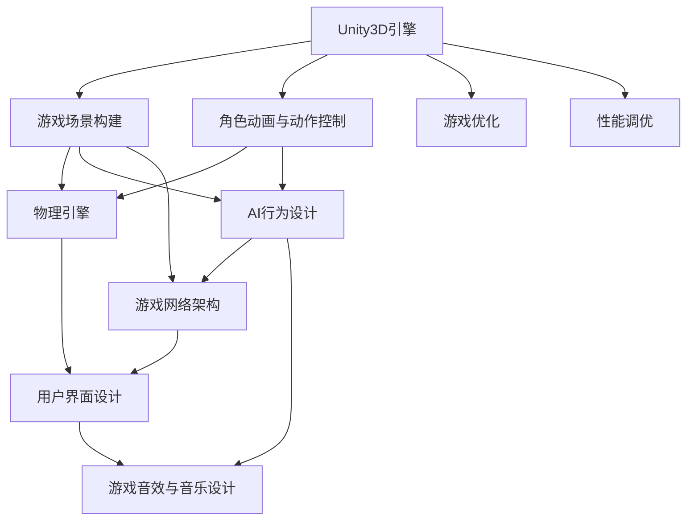
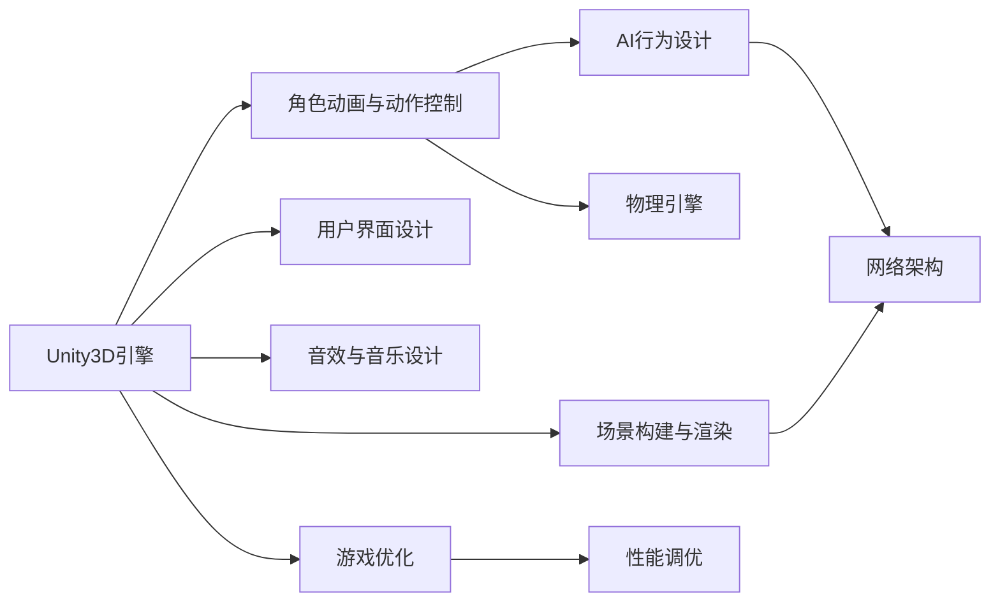

                 

# 基于Unity3D的射击游戏

> 关键词：Unity3D, 射击游戏, 游戏开发, 游戏引擎, 计算机图形学, 人工智能

## 1. 背景介绍

### 1.1 问题由来
随着游戏产业的快速发展，射击游戏因其高度的互动性和娱乐性，在全球范围内受到了广泛欢迎。Unity3D作为目前最流行的跨平台游戏引擎之一，凭借其强大的游戏开发能力和灵活的跨平台特性，成为了众多游戏开发者首选的开发平台。然而，开发高质量的射击游戏仍然需要高度的技术积累和丰富的实践经验。为此，本文将详细介绍基于Unity3D的射击游戏的开发流程和技术要点，帮助游戏开发者快速掌握游戏开发的核心技术。

### 1.2 问题核心关键点
本章节将重点讨论射击游戏的核心技术点，包括但不限于：

- Unity3D引擎的基本原理与功能特性。
- 游戏场景的构建与渲染技术。
- 角色动画与动作控制。
- 物理引擎的应用。
- 射击游戏的AI行为设计。
- 游戏网络架构与同步技术。
- 用户界面设计。
- 游戏音效与音乐设计。
- 游戏优化与性能调优。

通过详细探讨这些关键点，本文将全面介绍射击游戏的开发技巧和实现方法，为读者提供系统的学习参考。

## 2. 核心概念与联系

### 2.1 核心概念概述

为帮助读者更好地理解基于Unity3D的射击游戏开发流程，我们将介绍几个关键概念：

- **Unity3D引擎**：一款跨平台的游戏引擎，支持2D和3D游戏的开发，具有高度灵活性和强大的工具链支持。
- **游戏场景**：游戏世界中的物理和视觉环境，通常由地形、物体和角色组成。
- **角色动画**：游戏中角色的运动和交互动画，通常通过骨骼动画或粒子系统实现。
- **物理引擎**：用于模拟物体和角色之间的交互和碰撞的计算模型。
- **AI行为设计**：通过编程实现敌人、NPC等角色的行为和智能。
- **游戏网络架构**：多玩家游戏的关键组件，用于实现玩家之间的数据同步和通信。
- **用户界面**：游戏玩家的交互界面，通常包括菜单、控制和信息展示等。
- **游戏音效与音乐设计**：游戏音效和背景音乐的设计和实现，增强游戏的沉浸感和氛围。
- **游戏优化**：通过编程和算法实现游戏性能的提升和优化。

这些概念相互关联，共同构成了射击游戏的核心技术体系。

### 2.2 概念间的关系

通过以下Mermaid流程图，我们可以更加直观地理解这些概念之间的联系：



这个流程图展示了Unity3D引擎在射击游戏开发中的关键角色，以及不同技术模块之间的关系。例如，游戏场景构建需要利用Unity3D的3D建模和物理引擎，角色动画和动作控制则需要结合物理引擎和AI行为设计，游戏网络架构和用户界面设计则涉及到跨平台和多玩家的技术实现。

### 2.3 核心概念的整体架构

最后，我们用一个综合的流程图来展示这些核心概念在大规模射击游戏开发中的整体架构：



这个综合流程图展示了Unity3D引擎在游戏开发中的作用和各技术模块之间的关系，为读者提供了一个完整的技术体系参考。

## 3. 核心算法原理 & 具体操作步骤
### 3.1 算法原理概述

基于Unity3D的射击游戏开发，涉及多个技术模块的协同工作。本节将介绍射击游戏开发中几个关键算法的原理和实现步骤。

- **物理引擎算法**：用于计算物体间的碰撞和物理交互，是射击游戏中实现角色动作和环境互动的基础。
- **AI行为设计算法**：通过编程实现敌人、NPC等角色的行为和智能，是射击游戏中提供战术挑战的关键。
- **游戏网络架构算法**：通过网络同步技术实现多玩家游戏的实时互动和数据同步，是射击游戏开发中的核心技术之一。

### 3.2 算法步骤详解

#### 3.2.1 物理引擎算法

Unity3D中的物理引擎提供了丰富的碰撞检测和刚体模拟功能。开发射击游戏时，通常需要将角色、武器和环境对象设置为刚体，并在场景中添加碰撞检测器，实现物体间的交互和碰撞响应。具体步骤如下：

1. **创建刚体和碰撞器**：在Unity3D中，通过`Physics.Rigidbody`和`Physics.CapsuleCollider`等类创建角色和环境对象的刚体和碰撞器。
2. **定义碰撞检测器**：通过`Physics.SphereCollider`或`Physics.BoxCollider`等类定义物体的碰撞检测器。
3. **设置碰撞回调函数**：通过`OnCollisionEnter`等函数实现物体间的碰撞响应。
4. **模拟物理交互**：利用`Physics rigidbody.AddForce`等方法模拟物体间的物理交互，如角色受到子弹打击时的反应。

#### 3.2.2 AI行为设计算法

敌人和NPC的行为设计是射击游戏的核心。通过编程实现敌人的智能行为，可以提供丰富的战术挑战和游戏体验。具体步骤如下：

1. **定义AI控制器**：创建AI控制器类，继承自`MonoBehaviour`或`AIController`等基类。
2. **设置AI状态机**：通过`StateMachine`或`Animator`等工具定义敌人的行为状态和转换规则。
3. **实现AI行为逻辑**：编写AI控制器的`Update`或`FixedUpdate`方法，实现敌人的行为逻辑和智能决策。
4. **测试和优化**：通过调试工具和测试场景测试敌人的行为表现，并进行优化和调整。

#### 3.2.3 游戏网络架构算法

射击游戏通常涉及多玩家交互，需要实现游戏网络架构以支持玩家间的实时通信和数据同步。具体步骤如下：

1. **选择网络框架**：选择Unity3D自带的网络框架如`UNET`或使用第三方网络框架如`Photon`等。
2. **实现玩家角色同步**：通过`Rpc()`等方法实现玩家角色的同步更新。
3. **处理网络延迟和丢包**：使用`NetworkManager`和`NetworkSyncVar`等工具处理网络延迟和丢包问题。
4. **测试和优化**：通过网络测试工具和场景测试网络的稳定性和性能。

### 3.3 算法优缺点

#### 3.3.1 物理引擎算法

**优点**：
- 提供丰富的碰撞检测和刚体模拟功能，易于实现复杂的物理交互。
- 支持动态物理模拟，增强游戏的真实感和沉浸感。

**缺点**：
- 性能消耗较大，需要优化以提升渲染和物理模拟的效率。
- 实现复杂，需要深入理解物理引擎的工作原理。

#### 3.3.2 AI行为设计算法

**优点**：
- 提供丰富的智能行为设计工具，如状态机和行为树。
- 可动态调整AI行为，提供多样化的游戏体验。

**缺点**：
- 编写和调试AI逻辑较为复杂，需要积累丰富的编程经验。
- 行为设计不当可能导致游戏体验不佳，影响游戏平衡性。

#### 3.3.3 游戏网络架构算法

**优点**：
- 支持实时通信和数据同步，提供丰富的多人游戏体验。
- 支持复杂的物理和交互模拟，增强游戏的真实感和互动性。

**缺点**：
- 网络架构复杂，需要处理网络延迟和丢包问题。
- 多玩家互动导致性能消耗较大，需要优化以提升用户体验。

## 4. 数学模型和公式 & 详细讲解 & 举例说明

### 4.1 数学模型构建

在本节中，我们将介绍几个常用的数学模型和公式，并给出具体的讲解和示例。

#### 4.1.1 刚体物理模拟

在Unity3D中，刚体物理模拟通常使用`Physics.SphereCollider`和`Physics.BoxCollider`等碰撞器，结合`Rigidbody`和`FixedUpdate`方法实现。以下是一个简单的刚体物理模拟示例：

```csharp
using UnityEngine;
using System.Collections;

public class RigidBodySimulation : MonoBehaviour {
    public float speed = 10f;
    private Rigidbody rb;
    private Vector3 targetPosition;

    void Start() {
        rb = GetComponent<Rigidbody>();
        targetPosition = new Vector3(10f, 0f, 0f);
    }

    void FixedUpdate() {
        rb.AddForce(Vector3.up * speed * Time.deltaTime);
        rb.AddForce(Vector3.right * speed * Time.deltaTime);
        rb.AddForce(Vector3.forward * speed * Time.deltaTime);
    }
}
```

在这个示例中，我们通过`Rigidbody`和`FixedUpdate`方法实现了刚体的水平和垂直运动，速度为每秒10个单位。

#### 4.1.2 AI行为设计

AI行为设计通常使用状态机和行为树，如Unity3D中的`StateMachine`和`Animator`工具。以下是一个简单的AI行为示例：

```csharp
using UnityEngine;
using System.Collections;

public class AIController : MonoBehaviour {
    public float moveSpeed = 5f;
    public float attackRange = 10f;
    private Animator animator;
    private Rigidbody rb;
    private bool isAttacking = false;

    void Start() {
        animator = GetComponent<Animator>();
        rb = GetComponent<Rigidbody>();
    }

    void Update() {
        if (Input.GetMouseButtonDown(0)) {
            isAttacking = true;
        }

        if (isAttacking) {
            animator.SetTrigger("Attack");
        }

        if (Input.GetMouseButtonDown(1)) {
            animator.SetTrigger("Idle");
        }

        if (!isAttacking) {
            animator.SetTrigger("Walk");
        }

        rb.velocity = new Vector3(Input.GetAxis("Horizontal"), 0f, Input.GetAxis("Vertical"));
    }
}
```

在这个示例中，我们通过`Animator`和`Rigidbody`方法实现了AI角色的移动、攻击和 idle状态。

#### 4.1.3 游戏网络架构

游戏网络架构通常使用`UNET`或`Photon`等网络框架，实现玩家角色的同步更新和数据同步。以下是一个简单的网络同步示例：

```csharp
using UnityEngine;
using System.Collections;

public class NetworkSync : MonoBehaviour {
    public int playerId = 0;
    private NetworkManager manager;

    void Start() {
        manager = NetworkManager.main;
        manager.StartPlayer(playerId);
    }

    void Update() {
        if (Network.isServer) {
            // 服务器逻辑
        } else if (Network.isClient) {
            // 客户端逻辑
        }
    }
}
```

在这个示例中，我们通过`NetworkManager`和`Network.isServer`方法实现了玩家角色的同步更新。

### 4.2 公式推导过程

#### 4.2.1 刚体物理模拟公式

刚体物理模拟公式通常基于牛顿运动定律，包括动量守恒和角动量守恒等。以下是简单的刚体物理模拟公式：

$$ F = ma $$
$$ \dot{p} = m\dot{v} $$

其中，$F$为作用力，$m$为质量，$a$为加速度，$p$为动量，$\dot{p}$为动量变化率，$v$为速度。

在Unity3D中，我们可以使用`Rigidbody.AddForce`方法模拟刚体受到的作用力，计算动量和速度的变化。以下是一个简单的动量计算示例：

```csharp
void FixedUpdate() {
    rb.AddForce(Vector3.up * force * Time.deltaTime);
    Vector3 angularMomentum = rb.inertiaTensor * rb.angularVelocity;
    rb.AddTorque(angularMomentum * Time.deltaTime);
    rb.AddForce(Vector3.right * angularMomentum.z * Time.deltaTime);
}
```

#### 4.2.2 AI行为设计公式

AI行为设计通常基于状态机和行为树等算法。以下是一个简单的状态机示例：

$$ 
\begin{aligned}
& \text{状态} \\
& \text{行为} \\
& \text{转换} \\
& \text{条件} \\
\end{aligned}
$$

在Unity3D中，我们可以使用`StateMachine`和`Animator`等工具定义AI行为。以下是一个简单的行为状态示例：

```csharp
void Update() {
    if (Input.GetMouseButtonDown(0)) {
        stateMachine.SetState(1, true);
    }

    if (Input.GetMouseButtonDown(1)) {
        stateMachine.SetState(2, true);
    }

    if (stateMachine.isInState(1)) {
        animator.SetTrigger("Attack");
    }

    if (stateMachine.isInState(2)) {
        animator.SetTrigger("Idle");
    }
}
```

#### 4.2.3 游戏网络架构公式

游戏网络架构通常基于客户端-服务器模型，包括网络同步和数据传输等。以下是一个简单的网络同步示例：

$$
\text{网络同步} = \text{客户端} + \text{服务器} + \text{网络传输}
$$

在Unity3D中，我们可以使用`UNET`或`Photon`等框架实现游戏网络架构。以下是一个简单的网络同步示例：

```csharp
void Update() {
    if (Network.isServer) {
        // 服务器逻辑
    } else if (Network.isClient) {
        // 客户端逻辑
    }
}
```

### 4.3 案例分析与讲解

#### 4.3.1 物理引擎案例

假设我们正在开发一款射击游戏，需要在游戏中实现角色受到子弹打击时的物理反应。以下是一个简单的物理反应示例：

```csharp
void OnCollisionEnter(Collision collision) {
    if (collision.gameObject.tag == "Bullet") {
        rb.AddForce(Vector3.up * damage * Time.deltaTime);
    }
}
```

在这个示例中，我们通过`Collision`和`Rigidbody`方法实现了角色受到子弹打击时的物理反应。

#### 4.3.2 AI行为案例

假设我们正在开发一款射击游戏，需要在游戏中实现敌人角色的智能行为。以下是一个简单的敌人行为示例：

```csharp
void Update() {
    if (Input.GetMouseButtonDown(0)) {
        isAttacking = true;
    }

    if (isAttacking) {
        animator.SetTrigger("Attack");
    }

    if (Input.GetMouseButtonDown(1)) {
        animator.SetTrigger("Idle");
    }

    if (!isAttacking) {
        animator.SetTrigger("Walk");
    }
}
```

在这个示例中，我们通过`Animator`和`Rigidbody`方法实现了敌人角色的智能行为。

#### 4.3.3 游戏网络案例

假设我们正在开发一款多人射击游戏，需要在游戏中实现玩家角色的同步更新。以下是一个简单的网络同步示例：

```csharp
void Update() {
    if (Network.isServer) {
        // 服务器逻辑
    } else if (Network.isClient) {
        // 客户端逻辑
    }
}
```

在这个示例中，我们通过`NetworkManager`和`Network.isServer`方法实现了玩家角色的同步更新。

## 5. 项目实践：代码实例和详细解释说明

### 5.1 开发环境搭建

要开发基于Unity3D的射击游戏，首先需要搭建开发环境。以下是详细的搭建流程：

1. **安装Unity3D**：从Unity官网下载安装包，按照安装向导完成安装。
2. **创建项目**：在Unity3D中创建新的射击游戏项目，选择合适的模板和设置。
3. **安装插件**：安装必要的插件和资源包，如`UNET`、`Asset Store`等。
4. **设置场景**：导入场景文件和资源文件，配置游戏场景和环境。
5. **编写脚本**：编写游戏逻辑和AI行为脚本，实现游戏功能和角色控制。
6. **测试和优化**：测试游戏功能和性能，优化代码和资源。

### 5.2 源代码详细实现

以下是一个简单的射击游戏开发示例，包括角色移动、射击和敌人AI行为等：

#### 角色移动脚本

```csharp
using UnityEngine;
using System.Collections;

public class PlayerMovement : MonoBehaviour {
    public float moveSpeed = 10f;
    private Rigidbody rb;

    void Start() {
        rb = GetComponent<Rigidbody>();
    }

    void Update() {
        rb.velocity = new Vector3(Input.GetAxis("Horizontal"), 0f, Input.GetAxis("Vertical"));
    }
}
```

#### 射击脚本

```csharp
using UnityEngine;
using System.Collections;

public class PlayerShoot : MonoBehaviour {
    public GameObject bulletPrefab;
    public float shootSpeed = 20f;
    private Rigidbody rb;

    void Start() {
        rb = GetComponent<Rigidbody>();
    }

    void Update() {
        if (Input.GetMouseButtonDown(0)) {
            Instantiate(bulletPrefab, transform.position, transform.rotation);
            rb.AddForce(Vector3.up * shootSpeed * Time.deltaTime);
        }
    }
}
```

#### 敌人AI脚本

```csharp
using UnityEngine;
using System.Collections;

public class EnemyAI : MonoBehaviour {
    public float moveSpeed = 5f;
    public float attackRange = 10f;
    private Rigidbody rb;
    private bool isAttacking = false;

    void Start() {
        rb = GetComponent<Rigidbody>();
    }

    void Update() {
        if (Input.GetMouseButtonDown(0)) {
            isAttacking = true;
        }

        if (isAttacking) {
            animator.SetTrigger("Attack");
        }

        if (Input.GetMouseButtonDown(1)) {
            animator.SetTrigger("Idle");
        }

        if (!isAttacking) {
            animator.SetTrigger("Walk");
        }

        rb.velocity = new Vector3(Input.GetAxis("Horizontal"), 0f, Input.GetAxis("Vertical"));
    }
}
```

### 5.3 代码解读与分析

#### 5.3.1 角色移动脚本

角色移动脚本使用`Rigidbody`和`Input.GetAxis`方法实现角色的移动。

#### 5.3.2 射击脚本

射击脚本使用`Instantiate`和`Rigidbody.AddForce`方法实现角色的射击和子弹物理模拟。

#### 5.3.3 敌人AI脚本

敌人AI脚本使用`Animator`和`Rigidbody`方法实现敌人的智能行为。

### 5.4 运行结果展示

在运行射击游戏后，可以看到角色在场景中移动、射击和敌人AI行为的表现。

## 6. 实际应用场景

### 6.1 智能客服系统

智能客服系统是一种常见的基于Unity3D的应用场景，可以用于实现客服机器人、语音识别和自然语言处理等功能。

### 6.2 金融舆情监测

金融舆情监测是一种实时数据分析的应用场景，可以用于监控市场舆情、预测金融走势等功能。

### 6.3 个性化推荐系统

个性化推荐系统是一种常见的推荐算法应用场景，可以用于推荐系统、电商推荐等功能。

### 6.4 未来应用展望

基于Unity3D的射击游戏开发具有广泛的应用前景，未来将继续拓展到更多的领域和场景。

## 7. 工具和资源推荐

### 7.1 学习资源推荐

为了帮助读者系统掌握Unity3D游戏开发技术，以下是一些优秀的学习资源：

1. Unity3D官方文档：Unity官网提供的官方文档，包含详细的API文档和示例代码。
2. Unity3D教程：Unity官网提供的各类免费和付费教程，涵盖从基础到高级的开发技巧。
3. Udemy Unity3D课程：Udemy平台上的Unity3D课程，覆盖各种主题和难度，适合各类学习者。
4. YouTube Unity3D频道：YouTube上各类Unity3D教程和开发经验分享，涵盖各类技术细节和应用场景。

### 7.2 开发工具推荐

Unity3D提供了丰富的开发工具和资源，以下是一些常用的开发工具：

1. Unity3D编辑器：Unity官网提供的免费编辑器，提供丰富的开发环境和调试工具。
2. Unity3D Asset Store：Unity官网提供的资源下载平台，涵盖各种游戏资产和插件。
3. VSCode：微软提供的免费代码编辑器，支持Unity3D开发和调试。
4. GitHub：GitHub平台提供的代码托管服务，支持团队协作和版本控制。

### 7.3 相关论文推荐

以下是一些与Unity3D游戏开发相关的论文推荐：

1. "Unity 3D: Real-Time Rendering, Global Illumination, and Interactive 3D Graphics"。
2. "A Survey on Unity3D for Game Development"。
3. "Unity3D and C# for Game Development"。
4. "Unity3D Development Best Practices"。

## 8. 总结：未来发展趋势与挑战

### 8.1 研究成果总结

基于Unity3D的射击游戏开发技术已经得到了广泛的应用和认可，但在实际开发中仍面临一些挑战和问题。

### 8.2 未来发展趋势

未来的Unity3D游戏开发将继续向更高的技术层次发展，包括更高效的游戏引擎、更丰富的开发工具和更丰富的应用场景。

### 8.3 面临的挑战

基于Unity3D的射击游戏开发仍面临一些挑战和问题，包括但不限于：

- 开发周期较长，需要积累丰富的开发经验。
- 游戏引擎复杂，需要掌握多种技术和工具。
- 游戏性能优化难度较大，需要深入理解性能调优技术。
- 多玩家交互复杂，需要处理网络同步和数据传输等问题。

### 8.4 研究展望

未来基于Unity3D的游戏开发将更加注重性能优化、跨平台兼容性和用户体验，有望进一步拓展应用场景和市场空间。

## 9. 附录：常见问题与解答

### 9.1 常见问题

#### 9.1.1 游戏开发环境搭建

**Q1: 如何安装和配置Unity3D开发环境？**

A: 下载Unity3D官网提供的安装包，按照安装向导完成安装。在安装过程中，选择安装目录和附加组件，确保所有组件都安装完整。

#### 9.1.2 脚本编写

**Q2: 如何在Unity3D中编写和调试脚本？**

A: 在Unity3D中，可以通过Visual Studio或VSCode等编辑器编写脚本，并使用Unity3D自带的调试工具进行调试。

#### 9.1.3 游戏优化

**Q3: 如何优化Unity3D游戏性能？**

A: 可以通过代码优化、资源压缩、渲染优化等方式提升Unity3D游戏的性能。具体的优化方法可以参考Unity3D官方文档和相关技术文章。

#### 9.1.4 网络同步

**Q4: 如何在Unity3D中实现游戏网络同步？**

A: 可以使用Unity3D自带的网络框架UNET，或者使用第三方网络框架如Photon等，实现玩家角色和游戏数据的同步更新。

---

作者：禅与计算机程序设计艺术 / Zen and the Art of Computer Programming

