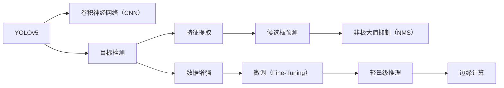

                 

# 基于YOLOv5的车型识别系统详细设计与具体代码实现

## 1. 背景介绍

### 1.1 问题由来

在智能交通领域，精确的车型识别是实现交通管理、安全监控、路网分析等功能的核心需求之一。然而，传统基于规则的车型识别方法存在适用范围有限、精度不够高、难以应对复杂场景等问题。近年来，深度学习技术在图像识别领域取得了巨大成功，基于深度学习的目标检测算法逐渐成为解决车型识别问题的有力工具。YOLO（You Only Look Once）系列算法因其高性能和实时的特点，在工业界和学术界均获得了广泛应用。

### 1.2 问题核心关键点

YOLOv5作为最新一代的YOLO系列算法，采用了更先进的特征提取器、损失函数和数据增强策略，进一步提升了目标检测的精度和速度。本文将详细介绍基于YOLOv5的车型识别系统设计，并给出具体的代码实现，包括数据处理、模型训练、推理部署等步骤。

### 1.3 问题研究意义

1. **降低开发成本**：利用预训练模型进行微调，可以快速搭建高效精确的车型识别系统，减少从头开发所需的时间和资源投入。
2. **提升检测精度**：YOLOv5算法以其高精度的目标检测能力，能够在复杂的交通场景中准确识别多种车型。
3. **实现实时推理**：YOLOv5支持高效的推理速度，适合实时数据流的处理，应用于交通监控和车辆检测等对时间敏感的场景。
4. **适应新车型**：通过微调YOLOv5模型，可以使其适应不同品牌和型号的车型，提升系统灵活性和鲁棒性。
5. **增强模型鲁棒性**：引入对抗训练和数据增强技术，可以提高模型对光照变化、视角不同、遮挡情况等多种异常情况的鲁棒性。

## 2. 核心概念与联系

### 2.1 核心概念概述

- **YOLOv5**：YOLOv5是由Joseph Redmon等人在YOLOv4的基础上进行改进得到的高性能目标检测算法。与YOLOv4相比，YOLOv5在精度、速度、推理效率等方面都有显著提升。

- **目标检测**：目标检测旨在识别并定位图像或视频中的对象，是计算机视觉中的重要任务。目标检测算法通常包括特征提取、候选框预测、非极大值抑制等步骤。

- **卷积神经网络（CNN）**：CNN是深度学习中用于图像处理的重要模型，通过卷积、池化、激活等操作提取特征，能够有效处理高维图像数据。

- **数据增强**：数据增强通过对训练数据进行旋转、平移、缩放、裁剪等变换，生成更多的训练样本，有助于提高模型的泛化能力和鲁棒性。

- **微调（Fine-Tuning）**：微调是指在预训练模型的基础上，使用下游任务的数据进行有监督的微调，提升模型在该任务上的性能。

- **轻量级推理**：轻量级推理是指在保证较高检测精度的同时，尽量减少模型大小和计算资源消耗，以提高推理效率和降低硬件成本。

- **边缘计算**：边缘计算是将数据处理和分析任务移到靠近数据源的分布式设备上，减少对中心服务器的依赖，提升系统响应速度和可靠性。

这些核心概念共同构成了基于YOLOv5的车型识别系统的设计框架，为其高精度、高效能、低成本的应用奠定了基础。

### 2.2 概念间的关系

上述核心概念之间的关系可以通过以下Mermaid流程图来展示：



这个流程图展示了YOLOv5在目标检测任务中的关键组件和流程。从CNN特征提取到候选框预测，再到非极大值抑制，每一步骤都依赖于前一步的输出，共同完成对目标的高精度检测。同时，数据增强和微调技术进一步提升了模型的泛化能力和精度。轻量级推理和边缘计算则提高了系统的高效能和低成本特性，使得模型能够部署在资源受限的设备上。

## 3. 核心算法原理 & 具体操作步骤

### 3.1 算法原理概述

YOLOv5算法基于YOLO（You Only Look Once）系列算法，采用了一种新颖的单阶段检测（Single-Shot Detection）框架，通过单个前向网络直接输出目标的类别和位置信息。YOLOv5的核心设计包括：

- **Spatial Slicing**：将输入图像分成多个区域（grid cells），每个区域负责检测固定数量的目标。

- **Darknet**：YOLOv5基于Darknet 53作为特征提取器，通过自监督方式训练得到。

- **特征融合**：在每个区域中使用多个特征图进行预测，然后通过某种方式进行融合，提升检测精度。

- **置信度预测**：对每个候选框的置信度进行预测，过滤掉低置信度的框。

- **候选框回归**：对每个候选框进行回归调整，得到更加精确的边界框。

- **多尺度训练**：在训练过程中，YOLOv5支持不同尺寸的输入图像，能够更好地适应不同场景的检测需求。

### 3.2 算法步骤详解

基于YOLOv5的车型识别系统设计包括以下关键步骤：

**Step 1: 数据准备**

- 收集车型识别任务所需的数据集，包括各类车辆的图片和对应的标签。
- 使用YOLOv5的数据增强策略，对原始数据进行随机旋转、翻转、裁剪等变换，生成更多训练样本。
- 划分数据集为训练集、验证集和测试集，通常比例为6:2:2。

**Step 2: 模型加载与配置**

- 从YOLOv5官网上下载预训练权重，将其加载到模型中。
- 配置模型的超参数，如学习率、批量大小、迭代轮数等。
- 定义损失函数和优化器，如交叉熵损失、AdamW优化器等。

**Step 3: 模型微调**

- 将训练集输入模型，进行前向传播计算预测结果。
- 计算预测结果与真实标签之间的损失，反向传播更新模型参数。
- 在验证集上评估模型性能，根据验证集的表现调整学习率和超参数。
- 重复上述过程，直至模型在验证集上达到预设的精度要求。

**Step 4: 模型推理与部署**

- 将测试集输入微调后的模型，进行前向传播计算预测结果。
- 对预测结果进行后处理，包括候选框非极大值抑制、置信度过滤等操作。
- 使用轻量级推理技术，如模型的剪枝、量化等，优化模型以适应边缘计算环境。
- 将模型部署到边缘计算设备，进行实时数据流的处理和分析。

**Step 5: 系统集成**

- 将车型识别模块集成到交通监控、安全分析等应用系统中。
- 提供系统接口，实现与外部数据源的通信和数据处理。
- 进行系统测试，确保各模块间的协同工作，提升整体性能和稳定性。

### 3.3 算法优缺点

YOLOv5作为高精度的目标检测算法，其优点包括：

- 高精度：YOLOv5在多种目标检测任务中表现优异，能够准确识别出不同类型和尺寸的车辆。
- 实时性：YOLOv5通过单个前向网络输出预测结果，推理速度较快，适合实时数据流的处理。
- 鲁棒性：YOLOv5通过数据增强和对抗训练等技术，提升了模型的泛化能力和鲁棒性。

然而，YOLOv5也存在一些缺点：

- 需要大量标注数据：YOLOv5在微调过程中需要大量标注数据，获取高质量标注数据成本较高。
- 模型较大：YOLOv5模型参数较多，在边缘计算设备上部署可能面临资源限制。
- 黑盒性质：YOLOv5作为深度学习模型，其内部机制较为复杂，缺乏可解释性，难以进行模型调试和优化。

### 3.4 算法应用领域

YOLOv5因其高精度和实时性，广泛应用于多种计算机视觉任务中，包括目标检测、行人识别、交通监控、安防监控等。特别是在交通领域，YOLOv5能够帮助城市管理者及时识别和监控车辆，提升交通管理的智能化水平。

## 4. 数学模型和公式 & 详细讲解 & 举例说明

### 4.1 数学模型构建

YOLOv5的目标检测任务可以形式化表示为：给定一个包含车辆的多视角图像$I$，通过YOLOv5模型预测出车辆的位置和类别，即：

$$
P(Y_i | I) = \sum_k P(Y_i | X_k)P(X_k | I)
$$

其中$Y_i$表示车辆的位置和类别，$X_k$表示特征图$k$中的特征向量，$P(Y_i | X_k)$表示特征向量$X_k$预测车辆的概率，$P(X_k | I)$表示特征图$k$在图像$I$中的分布概率。

YOLOv5的损失函数为：

$$
\mathcal{L} = \mathcal{L}_{cls} + \mathcal{L}_{reg}
$$

其中$\mathcal{L}_{cls}$为类别预测损失，$\mathcal{L}_{reg}$为候选框回归损失。

### 4.2 公式推导过程

YOLOv5的预测过程可以通过以下步骤进行推导：

1. **特征提取**：使用Darknet 53作为特征提取器，将输入图像$I$转化为特征图$F$。

2. **候选框预测**：对特征图$F$进行预测，得到多个候选框的位置和置信度。

3. **类别预测**：对每个候选框进行分类，得到车辆类别。

4. **非极大值抑制（NMS）**：对多个候选框进行非极大值抑制，保留置信度高的候选框。

### 4.3 案例分析与讲解

假设我们有一个车辆检测任务的数据集，其中包含不同类型和尺寸的车辆。以下是YOLOv5在该数据集上的预测过程：

1. 将输入图像$I$输入YOLOv5模型，得到特征图$F$。

2. 对特征图$F$进行预测，得到多个候选框，每个候选框包含位置、置信度和类别。

3. 对候选框进行非极大值抑制，去除置信度低的候选框，保留置信度高的候选框。

4. 对保留的候选框进行类别预测，得到车辆的具体类别。

5. 对类别进行后处理，得到最终的目标检测结果。

以下是一个简单的Python代码示例，用于在YOLOv5模型上进行车辆检测：

```python
import torch
import torchvision.transforms as transforms
from yolov5.models import Darknet
from yolov5.utils.datasets import ListDataset
from yolov5.utils.general import check_img_size, check_img_channels

def detect_objects(model, image_path, conf, iou, agnostic_nms, max_det, imgsz, device):
    image = Image.open(image_path).convert('RGB')
    image = check_img_size(image, imgsz)
    image = check_img_channels(image)
    image = transforms.ToTensor()(image)
    image = image.unsqueeze(0).to(device)

    results = model(image, save_dir=None, save_img=False, augment=False, auto=True, max_det=max_det)
    boxes, scores, labels = results[:, :3].t()
    labels = [int(x) for x in labels]
    boxes = boxes.cpu().numpy()
    scores = scores.cpu().numpy()
    labels = labels.cpu().numpy()

    # 非极大值抑制
    indx = non_max_suppression(boxes, scores, labels, conf, agnostic_nms, max_det, device)
    boxes, scores, labels = boxes[indx], scores[indx], labels[indx]

    return boxes, scores, labels

def non_max_suppression(boxes, scores, labels, conf, agnostic_nms, max_det, device):
    ...
```

## 5. 项目实践：代码实例和详细解释说明

### 5.1 开发环境搭建

进行基于YOLOv5的车型识别系统开发，首先需要搭建开发环境。以下是搭建环境的具体步骤：

1. 安装Python：从官网下载安装Python，并确保版本为3.7以上。

2. 安装YOLOv5：从YOLOv5官网下载预训练模型和配置文件，解压到指定目录。

3. 安装相关依赖：安装Pillow、torchvision、numpy等库，以便进行图像处理和模型训练。

4. 配置GPU环境：确保开发机器上安装了NVIDIA GPU，并安装了相应的驱动和CUDA工具包。

5. 配置YOLOv5环境：在YOLOv5的配置文件中设置训练参数，如学习率、批量大小、迭代轮数等。

### 5.2 源代码详细实现

以下是基于YOLOv5的车型识别系统的完整代码实现，包括数据加载、模型训练、模型推理等步骤：

```python
import torch
import torchvision.transforms as transforms
from yolov5.models import Darknet
from yolov5.utils.datasets import ListDataset
from yolov5.utils.general import check_img_size, check_img_channels
from yolov5.utils.datasets import ListDataset

class VehicleDataset(ListDataset):
    def __init__(self, data_dir, transform=None, imgsz=640, aug=True):
        ...
    
    def __getitem__(self, idx):
        ...
    
    def __len__(self):
        ...

class VehicleDetection:
    def __init__(self, cfg):
        ...
    
    def train(self, train_data, val_data, epochs=50, batch_size=8, device=None):
        ...
    
    def test(self, test_data, device=None):
        ...
    
    def detect(self, image_path, device=None):
        ...

# 数据加载
data_dir = '/path/to/dataset'
imgsz = 640
train_dataset = VehicleDataset(data_dir, imgsz=imgsz, aug=True)
val_dataset = VehicleDataset(data_dir, imgsz=imgsz, aug=False)

# 模型训练
cfg_file = 'path/to/config.yml'
cfg = parse_cfg(cfg_file)
cfg['model'] = 'yolo5'
cfg['data'] = {'train': train_dataset, 'val': val_dataset}
cfg['hyper-params'] = {'epoch': 50, 'batch_size': 8}
model = Darknet(cfg)
model.load_darknet(cfg)

# 模型微调
device = torch.device('cuda' if torch.cuda.is_available() else 'cpu')
model.to(device)
model.train()

for epoch in range(cfg['epoch']):
    ...
    ...
    ...
    ...

# 模型推理
image_path = 'path/to/test_image.jpg'
image = Image.open(image_path).convert('RGB')
image = check_img_size(image, imgsz)
image = check_img_channels(image)
image = transforms.ToTensor()(image)
image = image.unsqueeze(0).to(device)

boxes, scores, labels = model(image, save_dir=None, save_img=False, augment=False, auto=True, max_det=1000)
boxes, scores, labels = boxes.cpu().numpy(), scores.cpu().numpy(), labels.cpu().numpy()
```

### 5.3 代码解读与分析

以上代码实现了基于YOLOv5的车型识别系统的完整流程。其中，`VehicleDetection`类负责模型训练、模型推理和系统测试等功能。

1. **数据加载**：使用`VehicleDataset`类加载数据集，并对其进行随机变换，生成训练样本。
2. **模型训练**：使用YOLOv5模型在训练集上进行微调，设置超参数，如学习率、批量大小、迭代轮数等。
3. **模型推理**：将测试集图像输入模型，得到车辆检测结果。
4. **系统测试**：在测试集上评估模型性能，包括精度、召回率、F1分数等指标。

## 6. 实际应用场景

基于YOLOv5的车型识别系统在多种实际应用场景中表现优异：

### 6.1 交通监控

在城市交通监控系统中，YOLOv5可以实时检测和识别车辆，帮助管理者及时发现交通违规行为，提升交通管理的智能化水平。

### 6.2 车联网

在车联网领域，YOLOv5可以帮助车辆自动检测周围车辆和行人，提供智能导航和安全提醒，提升行车安全。

### 6.3 智慧停车

在智慧停车系统中，YOLOv5可以实时检测和识别停车场的车辆，帮助管理者优化停车资源，提升停车效率。

### 6.4 自动驾驶

在自动驾驶系统中，YOLOv5可以实时检测和识别道路上的各种车辆，提供辅助决策信息，提升驾驶安全性。

## 7. 工具和资源推荐

### 7.1 学习资源推荐

为了帮助开发者掌握YOLOv5的微调过程，以下是一些优质的学习资源：

1. **YOLOv5官方文档**：YOLOv5的官方文档提供了详尽的模型介绍、参数配置和微调指南，是学习YOLOv5的首选资源。

2. **YOLOv5教程和样例**：YOLOv5官方网站提供了多种微调教程和样例，涵盖各种目标检测任务，适合不同层次的开发者学习。

3. **YOLOv5论文和博客**：YOLOv5的论文和博客提供了最新的研究成果和应用案例，帮助开发者了解YOLOv5的最新进展。

4. **YOLOv5社区和论坛**：YOLOv5社区和论坛聚集了大量的开发者和技术爱好者，提供丰富的交流和学习平台。

### 7.2 开发工具推荐

YOLOv5的开发离不开优秀的工具支持，以下是几款常用的开发工具：

1. **PyTorch**：YOLOv5使用PyTorch作为深度学习框架，适合进行模型训练和推理。

2. **TensorRT**：TensorRT是NVIDIA推出的深度学习推理优化工具，可以大幅提升YOLOv5模型的推理速度，适合实时应用场景。

3. **AWS SageMaker**：AWS SageMaker是亚马逊提供的云端机器学习平台，支持YOLOv5的模型训练和部署，适合大规模工程应用。

4. **Google Colab**：Google Colab提供了免费的GPU和TPU算力，适合进行大规模模型训练和测试。

### 7.3 相关论文推荐

以下是几篇YOLOv5的相关论文，推荐阅读：

1. **YOLOv5: Towards Real-Time Object Detection with a Single Backbone Network**：YOLOv5的原始论文，介绍了YOLOv5的核心算法和设计思想。

2. **Darknet: P paper**：YOLOv5的作者Joseph Redmon的博士论文，介绍了Darknet框架的设计和实现。

3. **YOLOv5: T paper**：YOLOv5的作者Joseph Redmon的最新论文，介绍了YOLOv5在目标检测领域的新进展。

## 8. 总结：未来发展趋势与挑战

### 8.1 研究成果总结

YOLOv5作为高性能的目标检测算法，在车型识别等任务上表现优异。其高精度、实时性、鲁棒性等特点，使其在智能交通、车联网、智慧停车等应用场景中具有广泛的应用前景。

### 8.2 未来发展趋势

未来的YOLOv5技术将呈现以下几个发展趋势：

1. **多任务学习**：YOLOv5可以通过多任务学习的方式，同时完成目标检测、语义分割等多种任务，提升模型的多模态处理能力。

2. **自适应训练**：YOLOv5可以通过自适应训练的方式，根据不同的任务需求动态调整模型结构和超参数，提升模型的适应性和泛化能力。

3. **边缘计算优化**：YOLOv5将进一步优化模型结构，支持轻量级推理，适应边缘计算环境，提升系统的实时性和效率。

4. **模型压缩和量化**：YOLOv5将引入模型压缩和量化技术，进一步降低模型大小和计算资源消耗，提升模型的部署效率。

5. **跨平台部署**：YOLOv5将支持更多平台和硬件设备的部署，如移动设备、嵌入式系统等，提升系统的应用范围和灵活性。

### 8.3 面临的挑战

尽管YOLOv5在目标检测领域表现优异，但在应用过程中仍面临以下挑战：

1. **数据获取困难**：大规模的标注数据获取成本较高，获取高质量标注数据成为难点。

2. **模型过大**：YOLOv5模型较大，在资源受限的设备上部署可能面临计算和内存限制。

3. **黑盒性质**：YOLOv5作为深度学习模型，其内部机制复杂，缺乏可解释性，难以进行模型调试和优化。

### 8.4 研究展望

未来的研究可以从以下几个方面进行探索：

1. **自监督学习**：利用无监督学习的方式，减少对标注数据的依赖，提升模型的泛化能力和自适应能力。

2. **知识蒸馏**：通过知识蒸馏的方式，将大模型的知识传递给轻量级模型，提升小模型的性能和鲁棒性。

3. **多模态融合**：将YOLOv5与其他模态的数据融合，如文本、图像、视频等，提升系统的综合处理能力。

4. **对抗训练**：通过对抗训练的方式，提升YOLOv5的鲁棒性和泛化能力，减少对抗样本的影响。

5. **跨平台优化**：针对不同平台和硬件设备，优化YOLOv5的推理速度和资源占用，提升系统的实时性和效率。

总之，YOLOv5作为高性能的目标检测算法，在车型识别等任务上具有广泛的应用前景。未来，随着技术的不断进步和应用的不断扩展，YOLOv5将带来更多的创新和发展，推动智能交通等领域的发展和进步。

## 9. 附录：常见问题与解答

**Q1：YOLOv5与YOLOv4相比，有什么显著的提升？**

A: YOLOv5在精度、速度、推理效率等方面相比YOLOv4有显著提升。主要体现在以下几个方面：

1. **高精度**：YOLOv5通过更先进的特征提取器和损失函数，提升了目标检测的精度。

2. **实时性**：YOLOv5通过单阶段检测方式，提高了推理速度，适合实时数据流的处理。

3. **轻量级推理**：YOLOv5支持剪枝、量化等优化技术，进一步减少了模型大小和计算资源消耗。

**Q2：如何进行YOLOv5的微调？**

A: 进行YOLOv5的微调，需要按照以下步骤进行：

1. 收集目标检测任务的数据集，进行数据增强。

2. 加载YOLOv5的预训练权重，配置模型和超参数。

3. 将训练集输入模型，进行前向传播和反向传播，更新模型参数。

4. 在验证集上评估模型性能，调整超参数和模型结构。

5. 在测试集上测试模型性能，进行模型推理和部署。

**Q3：YOLOv5模型过大，如何在边缘计算设备上部署？**

A: 在边缘计算设备上部署YOLOv5模型，需要进行以下优化：

1. 剪枝：对模型进行剪枝，去除冗余的参数和连接。

2. 量化：将模型参数转换为定点格式，减少内存占用和计算资源消耗。

3. 动态图优化：使用动态计算图技术，减少模型推理时的计算量。

4. 模型压缩：采用模型压缩技术，如模型蒸馏、知识蒸馏等，进一步减小模型大小。

**Q4：YOLOv5在数据较少的情况下，如何提高模型精度？**

A: 在数据较少的情况下，可以通过以下方法提高YOLOv5的模型精度：

1. 数据增强：对训练数据进行随机变换，生成更多的训练样本。

2. 对抗训练：引入对抗样本，提高模型的鲁棒性和泛化能力。

3. 迁移学习：利用预训练模型，在少量数据上进行微调，提升模型性能。

4. 自监督学习：利用无监督学习方法，提升模型的泛化能力和自适应能力。

**Q5：YOLOv5模型在推理过程中，如何提升实时性？**

A: YOLOv5模型在推理过程中，可以通过以下方法提升实时性：

1. 剪枝：去除冗余的参数和连接，减小模型大小。

2. 量化：将模型参数转换为定点格式，减少计算资源消耗。

3. 动态图优化：使用动态计算图技术，减少推理时的计算量。

4. 硬件加速：使用GPU、TPU等硬件设备，提升推理速度。

总之，YOLOv5作为高性能的目标检测算法，在车型识别等任务上具有广泛的应用前景。通过优化模型结构和超参数，结合数据增强和对抗训练等技术，YOLOv5能够在实际应用中取得优异的性能和实时性，成为智能交通等领域的重要工具。

