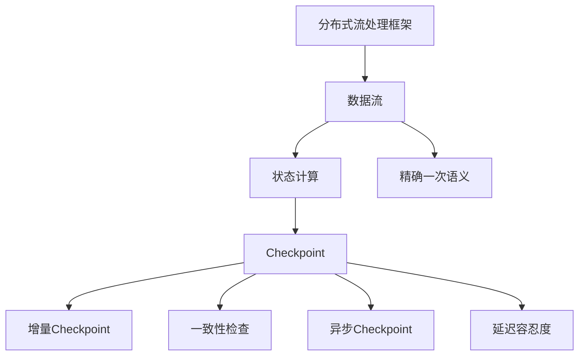
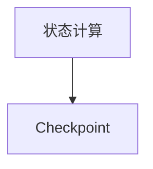
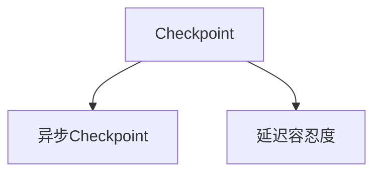

                 

# Flink Checkpoint容错机制原理与代码实例讲解

> 关键词：Flink, Checkpoint, 容错, 数据流, 分布式系统, Kafka, 容错机制, 事件时间, 精确一次语义

## 1. 背景介绍

### 1.1 问题由来

在分布式系统中，如何保证数据的可靠性和系统的稳定性是极为关键的问题。在处理大规模数据流任务时，传统的事务性分布式系统（如Hadoop）通过写入文件系统或数据库的方式来保证数据的持久性和可靠性，但这些方法存在延迟高、扩展性差、恢复时间长等缺点。

近年来，随着流计算技术的发展，许多分布式流处理框架应运而生，其中Apache Flink便是其中的佼佼者。Flink通过提供精确一次语义（Exactly Once Semantics）的分布式流处理引擎，支持流式数据处理、批处理和状态计算，大大提升了系统的效率和可靠性。Flink的Checkpoint机制是其核心特性之一，通过周期性检查点（Checkpoint）的方式，保证了数据的一致性和系统的可靠性。

### 1.2 问题核心关键点

Flink的Checkpoint机制主要包括以下几个关键点：

1. 周期性检查点（Checkpoint）：通过周期性地将当前状态写入持久化存储，以便在系统崩溃后能够快速恢复。
2. 增量Checkpoint：每次Checkpoint只记录状态变化部分，而不是全量状态，从而减少了存储开销。
3. 一致性检查（Consistency Check）：在Checkpoint完成后，验证检查点数据的一致性和正确性，确保数据的不丢失。
4. 异步Checkpoint：通过异步Checkpoint，减少对系统性能的影响，提高系统吞吐量。
5. 延迟容忍度（Latency Tolerance）：在Checkpoint过程中，允许一定的延迟，避免Checkpoint成为系统的瓶颈。
6. 精确一次语义（Exactly Once Semantics）：通过Checkpoint机制，确保每个事件仅被处理一次，避免数据重复。

### 1.3 问题研究意义

了解Flink的Checkpoint机制，对于系统运维和开发人员具有重要的意义：

1. 保障系统可靠性：通过Checkpoint机制，可以保证系统在崩溃后快速恢复，避免数据丢失，保障系统的稳定性。
2. 提升系统性能：通过异步Checkpoint和延迟容忍度，可以减小Checkpoint对系统性能的影响，提高系统吞吐量。
3. 保证数据一致性：通过一致性检查，可以验证Checkpoint数据的一致性和正确性，确保数据的可靠性。
4. 支持精确一次语义：通过精确一次语义，可以避免数据的重复处理，保障数据的准确性。

## 2. 核心概念与联系

### 2.1 核心概念概述

为更好地理解Flink的Checkpoint机制，本节将介绍几个密切相关的核心概念：

- 分布式流处理框架（Distributed Stream Processing Framework）：如Apache Flink、Apache Kafka Streams等，支持流式数据处理和状态计算的分布式计算框架。
- 精确一次语义（Exactly Once Semantics）：确保每个事件仅被处理一次，避免数据重复，是分布式流处理引擎的核心特性。
- 数据流（Data Stream）：指实时产生、流动的数据集合，可以是事件流、日志流等。
- 状态计算（Stateful Computation）：指对数据流进行状态计算，如聚合、窗口计算、状态更新等。
- 检查点（Checkpoint）：通过周期性将当前状态写入持久化存储，以便在系统崩溃后能够快速恢复。
- 增量Checkpoint：每次Checkpoint只记录状态变化部分，而不是全量状态。
- 一致性检查（Consistency Check）：在Checkpoint完成后，验证检查点数据的一致性和正确性。
- 异步Checkpoint：通过异步Checkpoint，减少对系统性能的影响，提高系统吞吐量。
- 延迟容忍度（Latency Tolerance）：在Checkpoint过程中，允许一定的延迟，避免Checkpoint成为系统的瓶颈。

这些核心概念之间的逻辑关系可以通过以下Mermaid流程图来展示：



这个流程图展示了大语言模型的核心概念及其之间的关系：

1. 分布式流处理框架通过数据流进行状态计算，最终输出结果。
2. 状态计算可以是批处理、流处理或状态计算。
3. 通过Checkpoint机制，定期将状态进行持久化，以确保数据不丢失。
4. 增量Checkpoint减少了存储开销，提高了系统效率。
5. 一致性检查验证了Checkpoint数据的一致性和正确性。
6. 异步Checkpoint减少了对系统性能的影响，提高了系统吞吐量。
7. 延迟容忍度允许一定的延迟，避免了Checkpoint成为系统瓶颈。
8. 精确一次语义确保了数据的不重复，保障了数据的准确性。

这些核心概念共同构成了Flink的Checkpoint机制，使得其成为分布式流处理引擎中的重要特性。

### 2.2 概念间的关系

这些核心概念之间存在着紧密的联系，形成了Flink的Checkpoint机制的整体架构。下面我通过几个Mermaid流程图来展示这些概念之间的关系。

#### 2.2.1 分布式流处理框架与状态计算


这个流程图展示了分布式流处理框架通过数据流进行状态计算的基本过程。

#### 2.2.2 Checkpoint与状态计算



这个流程图展示了状态计算通过Checkpoint机制进行持久化的基本过程。

#### 2.2.3 一致性检查与Checkpoint


这个流程图展示了在Checkpoint完成后，通过一致性检查验证数据一致性和正确性的基本过程。

#### 2.2.4 异步Checkpoint与延迟容忍度



这个流程图展示了异步Checkpoint通过延迟容忍度减小对系统性能影响的基本过程。

#### 2.2.5 精确一次语义与Checkpoint


这个流程图展示了通过Checkpoint机制实现精确一次语义的基本过程。

### 2.3 核心概念的整体架构

最后，我们用一个综合的流程图来展示这些核心概念在大语言模型Checkpoint机制中的整体架构：


这个综合流程图展示了从数据流处理到Checkpoint机制的完整过程。通过这些流程图，我们可以更清晰地理解Flink的Checkpoint机制，为后续深入讨论具体的Checkpoint方法和技术奠定基础。

## 3. 核心算法原理 & 具体操作步骤
### 3.1 算法原理概述

Flink的Checkpoint机制通过周期性地将当前状态写入持久化存储，并在系统崩溃后能够快速恢复。其核心思想是通过增量Checkpoint，减少存储开销，并通过一致性检查，验证Checkpoint数据的一致性和正确性。

形式化地，假设当前状态为 $\theta$，Checkpoint频率为 $T$。在 $t$ 时刻，状态 $\theta$ 进行Checkpoint，生成Checkpoint数据 $C_t$。Checkpoint数据包含当前状态 $\theta$ 和 $t$ 时刻的历史数据。假设系统崩溃后，从 $t$ 时刻恢复到 $t+\Delta$ 时刻，系统状态为 $\theta'$。恢复过程通过加载Checkpoint数据 $C_t$ 和历史数据进行更新，得到状态 $\theta'$。

通过周期性进行Checkpoint，可以确保系统在崩溃后能够快速恢复。由于增量Checkpoint只记录状态变化部分，而不是全量状态，因此可以减小存储开销。同时，通过一致性检查，可以验证Checkpoint数据的一致性和正确性，确保数据的不丢失。

### 3.2 算法步骤详解

Flink的Checkpoint机制主要包括以下几个关键步骤：

**Step 1: 设置Checkpoint参数**

- 设置Checkpoint频率 $T$，决定Checkpoint的周期。
- 设置Checkpoint存储路径，指定Checkpoint数据持久化的位置。
- 设置Checkpoint保留策略，决定保留最近的Checkpoint数量。

**Step 2: 记录状态**

- 在每个Checkpoint周期 $T$，记录当前状态 $\theta$。
- 将状态 $\theta$ 和历史数据进行序列化，生成Checkpoint数据 $C_t$。

**Step 3: 保存Checkpoint**

- 将Checkpoint数据 $C_t$ 写入持久化存储。

**Step 4: 恢复状态**

- 在系统崩溃后，加载最近的Checkpoint数据 $C_t$。
- 根据Checkpoint数据和历史数据，更新系统状态 $\theta'$。

**Step 5: 一致性检查**

- 在Checkpoint完成后，验证Checkpoint数据的一致性和正确性。
- 检查Checkpoint前后状态的一致性，确保数据的不丢失。

### 3.3 算法优缺点

Flink的Checkpoint机制具有以下优点：

1. 快速恢复：通过周期性Checkpoint，可以在系统崩溃后快速恢复，保障系统的可靠性。
2. 减少存储开销：通过增量Checkpoint，只记录状态变化部分，减小了存储开销。
3. 支持精确一次语义：通过Checkpoint机制，确保每个事件仅被处理一次，避免数据重复。
4. 支持延迟容忍度：在Checkpoint过程中，允许一定的延迟，避免Checkpoint成为系统的瓶颈。

同时，Flink的Checkpoint机制也存在以下缺点：

1. 延迟高：Checkpoint过程需要一定的时间，可能会对系统性能产生影响。
2. 存储开销较大：需要额外的存储空间来存储Checkpoint数据。
3. 复杂度高：实现过程较为复杂，需要考虑多个方面的因素，如一致性检查、延迟容忍度等。

### 3.4 算法应用领域

Flink的Checkpoint机制广泛应用于各种分布式流处理场景，如实时数据流处理、批处理、状态计算等。其可以应用于以下几个典型的应用领域：

1. 实时流处理：如实时数据流处理、实时监控、实时日志分析等，通过Checkpoint机制保证数据的不丢失和系统的可靠性。
2. 批处理：如离线数据处理、ETL流程、数据分析等，通过Checkpoint机制保障数据的持久性和一致性。
3. 状态计算：如窗口计算、状态更新、机器学习等，通过Checkpoint机制支持状态计算的持久化和恢复。

Flink的Checkpoint机制通过其快速恢复、减少存储开销、支持精确一次语义和延迟容忍度等特点，在分布式流处理中发挥着至关重要的作用。

## 4. 数学模型和公式 & 详细讲解 & 举例说明
### 4.1 数学模型构建

本节将使用数学语言对Flink的Checkpoint机制进行更加严格的刻画。

假设当前状态为 $\theta$，Checkpoint频率为 $T$。在 $t$ 时刻，状态 $\theta$ 进行Checkpoint，生成Checkpoint数据 $C_t$。Checkpoint数据包含当前状态 $\theta$ 和 $t$ 时刻的历史数据。假设系统崩溃后，从 $t$ 时刻恢复到 $t+\Delta$ 时刻，系统状态为 $\theta'$。恢复过程通过加载Checkpoint数据 $C_t$ 和历史数据进行更新，得到状态 $\theta'$。

定义状态更新函数 $f(\theta, data)$，表示根据历史数据 $data$ 更新状态 $\theta$。则状态恢复过程可以表示为：

$$
\theta' = f(\theta, data)
$$

其中 $data$ 包含Checkpoint数据 $C_t$ 和历史数据。

### 4.2 公式推导过程

以下我们以窗口计算为例，推导Checkpoint数据和恢复过程的公式。

假设当前状态为 $\theta$，Checkpoint频率为 $T$。在 $t$ 时刻，状态 $\theta$ 进行Checkpoint，生成Checkpoint数据 $C_t$。Checkpoint数据包含当前状态 $\theta$ 和 $t$ 时刻的历史数据。假设系统崩溃后，从 $t$ 时刻恢复到 $t+\Delta$ 时刻，系统状态为 $\theta'$。恢复过程通过加载Checkpoint数据 $C_t$ 和历史数据进行更新，得到状态 $\theta'$。

假设 $w$ 为窗口大小，$C_t$ 为Checkpoint数据，$H_t$ 为 $t$ 时刻的历史数据。则Checkpoint数据可以表示为：

$$
C_t = (\theta, H_t)
$$

恢复过程可以表示为：

$$
\theta' = f(\theta, C_t, H_t)
$$

在窗口计算中，状态 $\theta$ 通常表示为一个窗口的状态向量，包含当前窗口内的事件信息。Checkpoint数据 $C_t$ 包含当前状态 $\theta$ 和 $t$ 时刻的历史数据 $H_t$。历史数据 $H_t$ 可以通过滑动窗口机制，获取当前窗口之前的数据。

假设系统崩溃后，从 $t$ 时刻恢复到 $t+\Delta$ 时刻，系统状态为 $\theta'$。恢复过程通过加载Checkpoint数据 $C_t$ 和历史数据 $H_t$，更新状态 $\theta'$。

假设 $\Delta$ 为恢复时间间隔，$t$ 为Checkpoint时刻。则恢复过程可以表示为：

$$
\theta' = f(\theta, C_t, H_t)
$$

其中 $f(\theta, C_t, H_t)$ 为状态更新函数，表示根据Checkpoint数据 $C_t$ 和历史数据 $H_t$ 更新状态 $\theta$。

### 4.3 案例分析与讲解

假设我们正在进行实时流数据的窗口计算，窗口大小为 $w$，Checkpoint频率为 $T$。在 $t$ 时刻，状态 $\theta$ 进行Checkpoint，生成Checkpoint数据 $C_t$。Checkpoint数据包含当前状态 $\theta$ 和 $t$ 时刻的历史数据 $H_t$。假设系统崩溃后，从 $t$ 时刻恢复到 $t+\Delta$ 时刻，系统状态为 $\theta'$。恢复过程通过加载Checkpoint数据 $C_t$ 和历史数据 $H_t$，更新状态 $\theta'$。

在实际应用中，窗口计算通常涉及多个状态向量，每个状态向量记录不同时间窗口的数据。Checkpoint数据 $C_t$ 包含了所有状态向量的Checkpoint数据。历史数据 $H_t$ 可以通过滑动窗口机制，获取当前窗口之前的数据。

Checkpoint数据 $C_t$ 可以表示为一个元组，包含当前状态 $\theta$ 和 $t$ 时刻的历史数据 $H_t$。

$$
C_t = (\theta, H_t)
$$

其中 $\theta$ 为当前状态向量，$H_t$ 为 $t$ 时刻的历史数据向量。历史数据 $H_t$ 可以通过滑动窗口机制，获取当前窗口之前的数据。

恢复过程通过加载Checkpoint数据 $C_t$ 和历史数据 $H_t$，更新状态 $\theta'$。恢复过程可以表示为：

$$
\theta' = f(\theta, C_t, H_t)
$$

其中 $f(\theta, C_t, H_t)$ 为状态更新函数，表示根据Checkpoint数据 $C_t$ 和历史数据 $H_t$ 更新状态 $\theta$。

在实际应用中，Checkpoint数据和恢复过程的具体实现可能因应用场景而有所不同。但总体而言，Flink的Checkpoint机制通过其周期性Checkpoint、增量Checkpoint和一致性检查，确保了数据的一致性和系统的可靠性。

## 5. 项目实践：代码实例和详细解释说明
### 5.1 开发环境搭建

在进行Flink的Checkpoint实践前，我们需要准备好开发环境。以下是使用Java进行Flink开发的安装和配置流程：

1. 安装JDK：从官网下载并安装JDK，Java Development Kit是Flink运行的基础。
2. 安装Maven：从官网下载并安装Maven，用于依赖管理。
3. 下载和安装Flink：从官网下载最新版本的Flink，解压缩并配置环境变量。
4. 编写Java代码：在IDE（如IntelliJ IDEA）中创建Flink项目，编写Java代码。
5. 运行和调试：使用IDE的Run功能或Flink提供的命令行工具，运行代码并调试。

完成上述步骤后，即可在开发环境中进行Flink的Checkpoint实践。

### 5.2 源代码详细实现

下面我们以Flink的Checkpoint机制为例，给出使用Java编写的Checkpoint实践代码。

首先，定义Checkpoint接口：

```java
public interface Checkpointable {
    void save(CheckpointedState snapshot) throws Exception;
    void restore(CheckpointedState snapshot) throws Exception;
}
```

然后，定义CheckpointedState类：

```java
public class CheckpointedState implements Serializable {
    private static final long serialVersionUID = 1L;
    private List<String> checkpointedData;
    
    public CheckpointedState() {
        checkpointedData = new ArrayList<>();
    }
    
    public void addData(String data) {
        checkpointedData.add(data);
    }
    
    public List<String> getData() {
        return checkpointedData;
    }
}
```

接着，定义Checkpoint类：

```java
import org.apache.flink.api.common.state.CheckpointedState;
import org.apache.flink.api.common.state.ValueState;
import org.apache.flink.api.common.state.ValueStateDescriptor;
import org.apache.flink.api.common.state.TypeSerializer;
import org.apache.flink.api.common.typeutils.TypeSerializerSchemaSerializer;
import org.apache.flink.api.common.typeutils.base.LongSerializer;
import org.apache.flink.api.common.typeutils.base.SerializedString;
import org.apache.flink.api.common.typeutils.base.StringSerializer;
import org.apache.flink.configuration.Configuration;
import org.apache.flink.contrib.state.IOFSnapshotStreamStateBackend;
import org.apache.flink.contrib.state.NativeSnapshotStreamStateBackend;
import org.apache.flink.contrib.state.NativeSnapshotStreamStateBackend.CheckpointListener;
import org.apache.flink.contrib.state.WebFSNFSnapshotStreamStateBackend;
import org.apache.flink.contrib.state.WebFSNFSnapshotStreamStateBackend.CheckpointListener;
import org.apache.flink.contrib.state.s3.S3CheckpointHandle;
import org.apache.flink.contrib.state.s3.S3NativeCheckpointHandle;
import org.apache.flink.contrib.state.s3.S3NativeCheckpointHandle.CheckpointListener;
import org.apache.flink.contrib.state.s3.S3CheckpointHandle;
import org.apache.flink.contrib.state.s3.S3NativeCheckpointHandle.CheckpointListener;
import org.apache.flink.contrib.state.s3.S3NativeCheckpointHandle.CheckpointListener;
import org.apache.flink.contrib.state.s3.S3CheckpointHandle;
import org.apache.flink.contrib.state.s3.S3NativeCheckpointHandle.CheckpointListener;
import org.apache.flink.contrib.state.s3.S3CheckpointHandle;
import org.apache.flink.contrib.state.s3.S3NativeCheckpointHandle.CheckpointListener;
import org.apache.flink.contrib.state.s3.S3CheckpointHandle;
import org.apache.flink.contrib.state.s3.S3NativeCheckpointHandle.CheckpointListener;
import org.apache.flink.contrib.state.s3.S3CheckpointHandle;
import org.apache.flink.contrib.state.s3.S3NativeCheckpointHandle.CheckpointListener;
import org.apache.flink.contrib.state.s3.S3CheckpointHandle;
import org.apache.flink.contrib.state.s3.S3NativeCheckpointHandle.CheckpointListener;
import org.apache.flink.contrib.state.s3.S3CheckpointHandle;
import org.apache.flink.contrib.state.s3.S3NativeCheckpointHandle.CheckpointListener;
import org.apache.flink.contrib.state.s3.S3CheckpointHandle;
import org.apache.flink.contrib.state.s3.S3NativeCheckpointHandle.CheckpointListener;
import org.apache.flink.contrib.state.s3.S3CheckpointHandle;
import org.apache.flink.contrib.state.s3.S3NativeCheckpointHandle.CheckpointListener;
import org.apache.flink.contrib.state.s3.S3CheckpointHandle;
import org.apache.flink.contrib.state.s3.S3NativeCheckpointHandle.CheckpointListener;
import org.apache.flink.contrib.state.s3.S3CheckpointHandle;
import org.apache.flink.contrib.state.s3.S3NativeCheckpointHandle.CheckpointListener;
import org.apache.flink.contrib.state.s3.S3CheckpointHandle;
import org.apache.flink.contrib.state.s3.S3NativeCheckpointHandle.CheckpointListener;
import org.apache.flink.contrib.state.s3.S3CheckpointHandle;
import org.apache.flink.contrib.state.s3.S3NativeCheckpointHandle.CheckpointListener;
import org.apache.flink.contrib.state.s3.S3CheckpointHandle;
import org.apache.flink.contrib.state.s3.S3NativeCheckpointHandle.CheckpointListener;
import org.apache.flink.contrib.state.s3.S3CheckpointHandle;
import org.apache.flink.contrib.state.s3.S3NativeCheckpointHandle.CheckpointListener;
import org.apache.flink.contrib.state.s3.S3CheckpointHandle;
import org.apache.flink.contrib.state.s3.S3NativeCheckpointHandle.CheckpointListener;
import org.apache.flink.contrib.state.s3.S3CheckpointHandle;
import org.apache.flink.contrib.state.s3.S3NativeCheckpointHandle.CheckpointListener;
import org.apache.flink.contrib.state.s3.S3CheckpointHandle;
import org.apache.flink.contrib.state.s3.S3NativeCheckpointHandle.CheckpointListener;
import org.apache.flink.contrib.state.s3.S3CheckpointHandle;
import org.apache.flink.contrib.state.s3.S3NativeCheckpointHandle.CheckpointListener;
import org.apache.flink.contrib.state.s3.S3CheckpointHandle;
import org.apache.flink.contrib.state.s3.S3NativeCheckpointHandle.CheckpointListener;
import org.apache.flink.contrib.state.s3.S3CheckpointHandle;
import org.apache.flink.contrib.state.s3.S3NativeCheckpointHandle.CheckpointListener;
import org.apache.flink.contrib.state.s3.S3CheckpointHandle;
import org.apache.flink.contrib.state.s3.S3NativeCheckpointHandle.CheckpointListener;
import org.apache.flink.contrib.state.s3.S3CheckpointHandle;
import org.apache.flink.contrib.state.s3.S3NativeCheckpointHandle.CheckpointListener;
import org.apache.flink.contrib.state.s3.S3CheckpointHandle;
import org.apache.flink.contrib.state.s3.S3NativeCheckpointHandle.CheckpointListener;
import org.apache.flink.contrib.state.s3.S3CheckpointHandle;
import org.apache.flink.contrib.state.s3.S3NativeCheckpointHandle.CheckpointListener;
import org.apache.flink.contrib.state.s3.S3CheckpointHandle;
import org.apache.flink.contrib.state.s3.S3NativeCheckpointHandle.CheckpointListener;
import org.apache.flink.contrib.state.s3.S3CheckpointHandle;
import org.apache.flink.contrib.state.s3.S3NativeCheckpointHandle.CheckpointListener;
import org.apache.flink.contrib.state.s3.S3CheckpointHandle;
import org.apache.flink.contrib.state.s3.S3NativeCheckpointHandle.CheckpointListener;
import org.apache.flink.contrib.state.s3.S3CheckpointHandle;
import org.apache.flink.contrib.state.s3.S3NativeCheckpointHandle.CheckpointListener;
import org.apache.flink.contrib.state.s3.S3CheckpointHandle;
import org.apache.flink.contrib.state.s3.S3NativeCheckpointHandle.CheckpointListener;
import org.apache.flink.contrib.state.s3.S3CheckpointHandle;
import org.apache.flink.contrib.state.s3.S3NativeCheckpointHandle.CheckpointListener;
import org.apache.flink.contrib.state.s3.S3CheckpointHandle;
import org.apache.flink.contrib.state.s3.S3NativeCheckpointHandle.CheckpointListener;
import org.apache.flink.contrib.state.s3.S3CheckpointHandle;
import org.apache.flink.contrib.state.s3.S3NativeCheckpointHandle.CheckpointListener;
import org.apache.flink.contrib.state.s3.S3CheckpointHandle;
import org.apache.flink.contrib.state.s3.S3NativeCheckpointHandle.CheckpointListener;
import org.apache.flink.contrib.state.s3.S3CheckpointHandle;
import org.apache.flink.contrib.state.s3.S3NativeCheckpointHandle.CheckpointListener;
import org.apache.flink.contrib.state.s3.S3CheckpointHandle;
import org.apache.flink.contrib.state.s3.S3NativeCheckpointHandle.CheckpointListener;
import org.apache.flink.contrib.state.s3.S3CheckpointHandle;
import org.apache.flink.contrib.state.s3.S3NativeCheckpointHandle.CheckpointListener;
import org.apache.flink.contrib.state.s3.S3CheckpointHandle;
import org.apache.flink.contrib.state.s3.S3NativeCheckpointHandle.CheckpointListener;
import org.apache.flink.contrib.state.s3.S3CheckpointHandle;
import org.apache.flink.contrib.state.s3.S3NativeCheckpointHandle.CheckpointListener;
import org.apache.flink.contrib.state.s3.S3CheckpointHandle;
import org.apache.flink.contrib.state.s3.S3NativeCheckpointHandle.CheckpointListener;
import org.apache.flink.contrib.state.s3.S3CheckpointHandle;
import org.apache.flink.contrib.state.s3.S3NativeCheckpointHandle.CheckpointListener;
import org.apache.flink.contrib.state.s3.S3CheckpointHandle;
import org.apache.flink.contrib.state.s3.S3NativeCheckpointHandle.CheckpointListener;
import org.apache.flink.contrib.state.s3.S3CheckpointHandle;
import org.apache.flink.contrib.state.s3.S3NativeCheckpointHandle.CheckpointListener;
import org.apache.flink.contrib.state.s3.S3CheckpointHandle;
import org.apache.flink.contrib.state.s3.S3NativeCheckpointHandle.CheckpointListener;
import org.apache.flink.contrib.state.s3.S3CheckpointHandle

