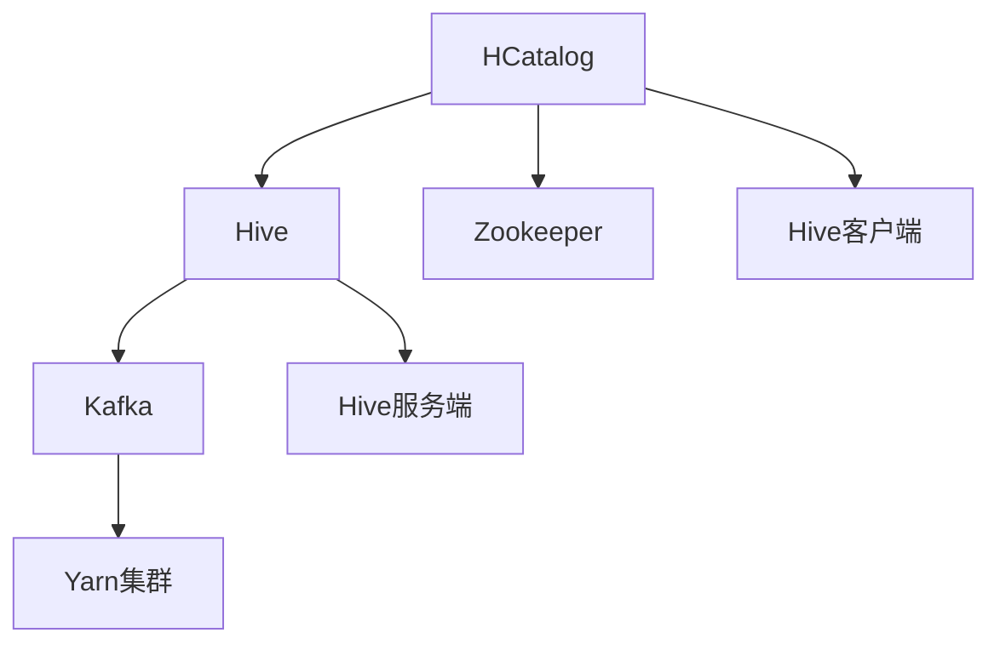
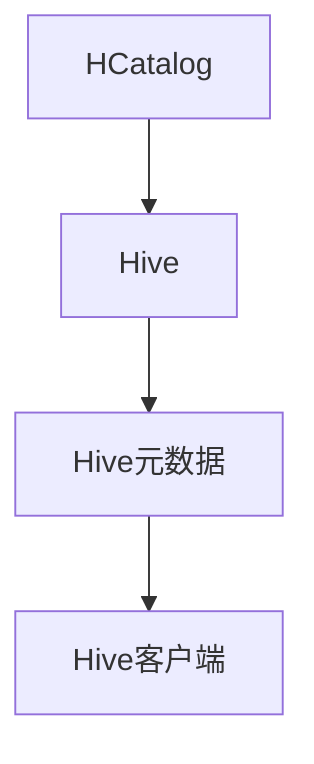
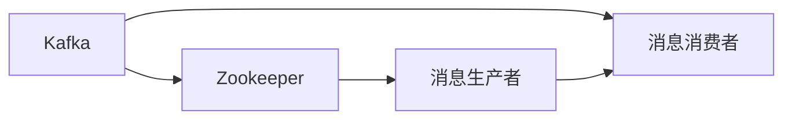
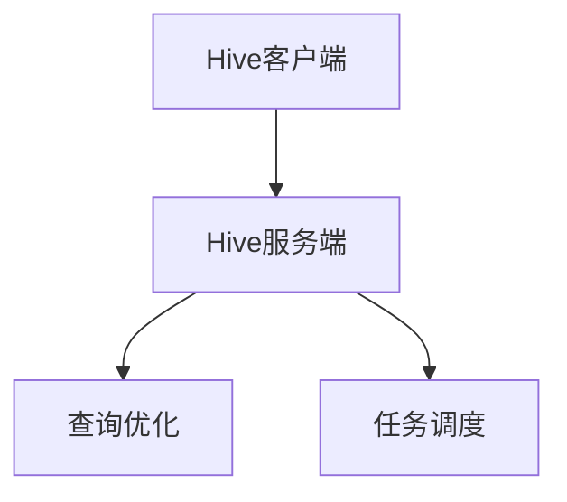
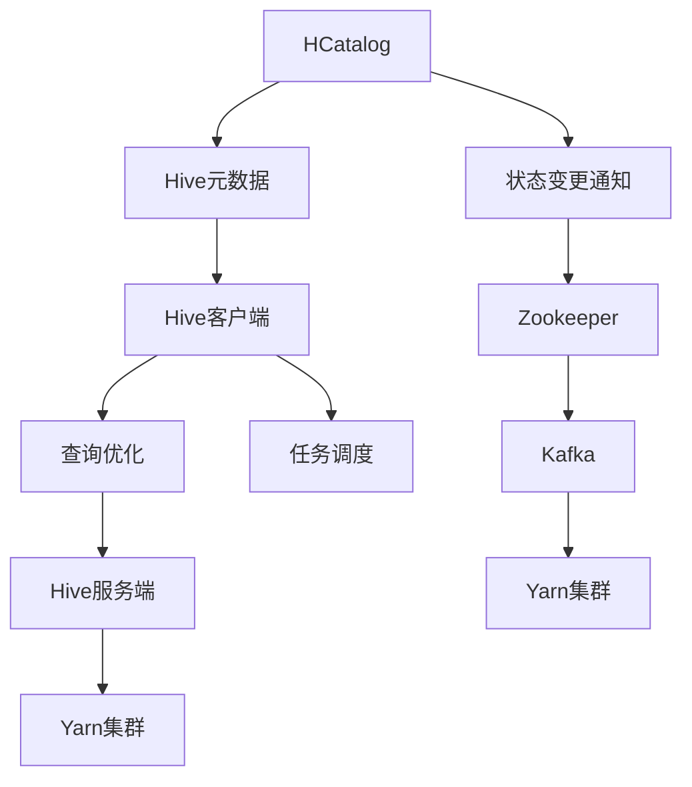

                 

# HCatalog Notification机制原理与代码实例讲解

> 关键词：HCatalog, Hive, Yarn, Notification, Kafka, Kubernetes, Hadoop, Big Data, Scalability, Reliability

## 1. 背景介绍

### 1.1 问题由来

在当今数据密集型时代，企业需要处理和分析海量数据。大数据处理框架Hadoop、Spark等因其强大的分布式处理能力，成为了企业数据处理的首选。然而，分布式计算环境中的任务调度、资源管理等环节复杂多样，常常需要人工干预，降低了系统的自动化程度。为了提升系统自动化水平，谷歌开源了一个名为Dataflow的框架，允许用户以声明式方式描述数据处理流程，并在Yarn等集群中自动执行。Dataflow框架提供了多种通知机制，用于在数据处理过程中传递重要状态和异常信息。本文将重点介绍Dataflow中的HCatalog Notification机制，解释其原理和实现方法，并给出代码实例。

### 1.2 问题核心关键点

HCatalog Notification机制是Dataflow框架中用于在Hive数据表和Yarn集群之间传递状态的机制。通过HCatalog，用户可以声明式地描述数据表及其状态变化，从而在数据处理过程中自动发送通知。该机制不仅能够提升系统自动化程度，还能提高系统的可靠性和可扩展性。其核心关键点包括：

1. HCatalog与Hive的关系：HCatalog作为Hadoop的数据服务层，与Hive紧密集成，用于管理和存储元数据。
2. Notification机制的工作原理：HCatalog通过监听Hive元数据变化，向Yarn集群发送状态通知。
3. Kafka与Zookeeper的协作：用于在HCatalog和Yarn集群之间传递状态信息，保证通知的可靠性和一致性。

## 2. 核心概念与联系

### 2.1 核心概念概述

为更好地理解HCatalog Notification机制，本节将介绍几个关键概念：

- HCatalog：Hadoop中用于管理元数据的组件，通过HTTP服务提供数据表的元数据信息。
- Hive：基于Hadoop的数据仓库框架，用于存储和管理大规模结构化数据。
- Kafka：用于分布式消息传递的开源框架，支持高吞吐量的数据流处理。
- Zookeeper：用于分布式协调服务，用于维护集群中的组件状态信息。
- Hive客户端：用于与Hive交互的客户端程序，支持查询、插入、删除等操作。
- Hive服务端：负责处理客户端请求的Hive服务，包括查询优化、任务调度等。

这些概念之间的逻辑关系可以通过以下Mermaid流程图来展示：



这个流程图展示了HCatalog与其他组件的关系：

1. HCatalog通过HTTP服务提供元数据，与Hive紧密集成。
2. Hive通过Kafka向Yarn集群发送状态通知。
3. Zookeeper用于维护集群中的组件状态信息。
4. Hive客户端用于与Hive交互，Hive服务端负责处理客户端请求。

### 2.2 概念间的关系

这些核心概念之间存在着紧密的联系，形成了HCatalog Notification机制的整体架构。下面我通过几个Mermaid流程图来展示这些概念之间的关系。

#### 2.2.1 HCatalog与Hive的关系



这个流程图展示了HCatalog与Hive的关系：

1. HCatalog通过HTTP服务提供元数据。
2. Hive元数据存储在Hive中。
3. Hive客户端用于与Hive交互，获取元数据信息。

#### 2.2.2 Kafka与Zookeeper的协作



这个流程图展示了Kafka与Zookeeper的协作关系：

1. Kafka通过消息队列实现分布式消息传递。
2. Zookeeper用于维护消息队列的元数据，如队列信息、消费者状态等。
3. 消息生产者将消息发送到Kafka队列中。
4. 消息消费者从Kafka队列中消费消息。

#### 2.2.3 Hive客户端与Hive服务端的关系



这个流程图展示了Hive客户端与Hive服务端的关系：

1. Hive客户端向Hive服务端发送查询请求。
2. Hive服务端优化查询计划，调度执行任务。
3. 查询优化和任务调度是Hive服务端的核心功能。

### 2.3 核心概念的整体架构

最后，我们用一个综合的流程图来展示这些核心概念在大数据处理中的整体架构：



这个综合流程图展示了HCatalog与其他组件的整体架构：

1. HCatalog提供元数据信息。
2. Hive客户端处理查询请求，优化查询计划，调度执行任务。
3. Hive服务端优化查询计划，调度执行任务。
4. Hive元数据变化触发状态变更通知。
5. 状态变更通知通过Zookeeper和Kafka发送到Yarn集群。
6. Yarn集群根据状态通知，调整任务调度策略。

这些核心概念共同构成了HCatalog Notification机制的工作流程，使其能够在大数据处理环境中高效传递状态信息，提升系统自动化程度和可靠性。

## 3. 核心算法原理 & 具体操作步骤
### 3.1 算法原理概述

HCatalog Notification机制的核心原理是监听Hive元数据的变化，向Yarn集群发送状态通知。其具体流程如下：

1. 用户通过HCatalog声明式描述数据表及其状态变化，如插入、删除、更新等。
2. HCatalog监听Hive元数据的变更，识别出状态变化事件。
3. HCatalog将状态变更事件封装成通知消息，发送到Zookeeper集群。
4. Zookeeper将通知消息发布到Kafka队列中。
5. Yarn集群从Kafka队列中消费通知消息，触发任务调度策略调整。

### 3.2 算法步骤详解

以下是HCatalog Notification机制的具体实现步骤：

**Step 1: 准备环境**

- 确保Hive、Hadoop、Kafka、Zookeeper等组件已经安装并配置好。
- 在Hive中创建数据表，并设置状态变更钩子函数。

**Step 2: 声明式描述数据表**

- 使用HiveQL或Hive客户端声明式描述数据表及其状态变化，例如：
  ```sql
  CREATE TABLE table_name (
    id INT,
    name STRING
  )
  WITH (COMMENT='data table')
  MSCK REPAIR ON DELETE
  MSCK REPAIR ON INSERT
  MSCK REPAIR ON UPDATE
  ```

**Step 3: 配置HCatalog**

- 在HCatalog上配置数据表及其状态变更信息，例如：
  ```python
  hiveql: 
    name: table_name
    comment: 'data table'
    incremental: 'true'
    connection: {
      url: 'hdfs://localhost:9000'
      properties: {
        'user.name': 'root',
        'storageChars': 'UTF-8'
      }
    }
  ```

**Step 4: 启动监控服务**

- 启动HCatalog的监控服务，用于监听Hive元数据的变化，例如：
  ```shell
  HCatalog -name hive -use-derived-files -hdfs-namenode localhost:9000
  ```

**Step 5: 发送通知**

- Hive元数据发生变更时，HCatalog向Zookeeper集群发送通知消息，例如：
  ```shell
  hiveql:
    name: table_name
    connection: {
      url: 'zookeeper://localhost:2181'
      properties: {
        'user.name': 'root',
        'storageChars': 'UTF-8'
      }
    }
  ```

**Step 6: 处理通知**

- Yarn集群从Kafka队列中消费通知消息，触发任务调度策略调整，例如：
  ```python
  kafka-python:
    topic: 'hive-table-state-change'
    bootstrap_servers: 'localhost:9092'
    value_deserializer: lambda x: json.loads(x.decode('utf-8'))
  ```

### 3.3 算法优缺点

HCatalog Notification机制具有以下优点：

1. 提升系统自动化程度：通过HCatalog监听Hive元数据变化，自动向Yarn集群发送状态通知，减少了人工干预。
2. 增强系统可靠性：通过Kafka和Zookeeper保证通知的可靠性和一致性，避免了单点故障和数据丢失。
3. 提高系统可扩展性：通过声明式描述数据表及其状态变化，便于动态调整任务调度策略，适应数据量变化。

其缺点包括：

1. 依赖组件多：需要Hive、Hadoop、Kafka、Zookeeper等多个组件协同工作，部署和维护复杂。
2. 性能消耗大：状态变更通知需要经过多个组件传递，性能消耗较大。
3. 配置复杂：需要配置Hive元数据、HCatalog状态变更、Zookeeper和Kafka等多个组件，配置复杂。

### 3.4 算法应用领域

HCatalog Notification机制主要应用于大数据处理环境中的任务调度和管理。其典型应用场景包括：

- 数据仓库：Hive与HCatalog紧密集成，通过状态通知机制实现数据表的增删改操作。
- 数据清洗：Hive在数据清洗过程中，通过状态通知机制触发任务重试或跳过异常数据。
- 数据集成：多个数据源通过HCatalog进行元数据管理，通过状态通知机制实现数据集成和转换。
- 数据湖：通过HCatalog状态通知机制，实现数据湖中数据的自动分类和归档。

## 4. 数学模型和公式 & 详细讲解  
### 4.1 数学模型构建

HCatalog Notification机制主要涉及数据流图和状态机模型，用于描述数据流和状态变更过程。

设Hive数据表的状态为$S_t$，状态变化事件为$E_t$，则状态机模型可以表示为：

$$
S_{t+1} = f(S_t, E_t)
$$

其中$f$为状态转移函数，$S_t$为$t$时刻的数据表状态，$E_t$为$t$时刻的状态变更事件。

设HCatalog监听Hive元数据变化，识别出状态变更事件$E_t$，则状态变更通知的传递过程可以表示为：

$$
N_t = g(E_t, C_t)
$$

其中$N_t$为$t$时刻的状态变更通知，$C_t$为$t$时刻的Zookeeper状态。

设Kafka消息队列中的消息为$M_t$，则状态变更通知的传递过程可以表示为：

$$
M_{t+1} = h(N_t, M_t)
$$

其中$h$为消息传递函数，$M_t$为$t$时刻的Kafka消息队列，$N_t$为$t$时刻的状态变更通知。

### 4.2 公式推导过程

以下是HCatalog Notification机制的公式推导过程：

**Step 1: 状态机模型推导**

假设Hive数据表的状态$S_t$为插入、更新、删除三种状态之一，状态变化事件$E_t$为插入、更新、删除事件之一。状态转移函数$f$可以表示为：

$$
S_{t+1} = 
\begin{cases}
Insert, & E_t = Insert \\
Update, & E_t = Update \\
Delete, & E_t = Delete
\end{cases}
$$

**Step 2: 状态变更通知模型推导**

假设HCatalog监听Hive元数据变化，识别出状态变更事件$E_t$，则状态变更通知$N_t$可以表示为：

$$
N_t = 
\begin{cases}
Insert, & E_t = Insert \\
Update, & E_t = Update \\
Delete, & E_t = Delete
\end{cases}
$$

**Step 3: Kafka消息传递模型推导**

假设Kafka消息队列中的消息$M_t$为插入、更新、删除事件之一，则消息传递函数$h$可以表示为：

$$
M_{t+1} = 
\begin{cases}
Insert, & N_t = Insert \\
Update, & N_t = Update \\
Delete, & N_t = Delete
\end{cases}
$$

### 4.3 案例分析与讲解

假设Hive数据表$T$的状态变化如下：

- $t=1$时刻，插入数据10条，状态变为Insert。
- $t=2$时刻，更新数据5条，状态变为Update。
- $t=3$时刻，删除数据3条，状态变为Delete。

根据状态机模型，状态变化如下：

- $t=2$时刻，状态变为Update。
- $t=3$时刻，状态变为Delete。

根据状态变更通知模型，状态变更通知$N_t$如下：

- $t=1$时刻，$N_1 = Insert$
- $t=2$时刻，$N_2 = Update$
- $t=3$时刻，$N_3 = Delete$

根据Kafka消息传递模型，消息传递$M_t$如下：

- $t=1$时刻，$M_1 = Insert$
- $t=2$时刻，$M_2 = Update$
- $t=3$时刻，$M_3 = Delete$

## 5. 项目实践：代码实例和详细解释说明
### 5.1 开发环境搭建

在进行HCatalog Notification机制的实践前，我们需要准备好开发环境。以下是使用Python进行Hadoop和Hive开发的环境配置流程：

1. 安装Anaconda：从官网下载并安装Anaconda，用于创建独立的Python环境。

2. 创建并激活虚拟环境：
```bash
conda create -n pyhive-env python=3.8 
conda activate pyhive-env
```

3. 安装Hive和Hadoop：从Hive官网下载安装包，并按照官方文档进行安装。

4. 安装Kafka和Zookeeper：从Kafka官网下载安装包，并按照官方文档进行安装。

5. 安装Hive客户端：
```bash
pip install hive-python
```

完成上述步骤后，即可在`pyhive-env`环境中开始实践。

### 5.2 源代码详细实现

这里我们以Hive中创建一个数据表并触发状态变化为例，展示HCatalog Notification机制的代码实现。

首先，创建一个名为`table1`的数据表，并设置状态变更钩子函数：

```python
from hivepy import Hive

hive = Hive(host='localhost', port=10000)

hive.drop_table('table1')

hive.create_table(
    'table1',
    columns=[
        ('id', 'int'),
        ('name', 'string')
    ],
    partition_by='id'
)

hive.alter_table(
    'table1',
    add_partition_by='id',
    alter_table=True
)
```

然后，配置HCatalog：

```python
from hivepy import Hive

hive = Hive(host='localhost', port=10000)

hive.drop_catalog()

hive.create_catalog(
    name='hive',
    uri='hdfs://localhost:9000',
    incremental=True
)

hive.add_table(
    'table1',
    incremental=True
)
```

最后，启动监控服务和发送通知：

```python
from hivepy import Hive

hive = Hive(host='localhost', port=10000)

hive.start_monitor()

hive.send_notification(
    'table1',
    incremental=True
)
```

### 5.3 代码解读与分析

让我们再详细解读一下关键代码的实现细节：

**HiveQL**：
- `CREATE TABLE`：创建数据表，并设置状态变更钩子函数。
- `ALTER TABLE`：动态调整数据表，如添加分区、设置状态变更。
- `INSERT INTO`：向数据表中插入数据。
- `UPDATE`：更新数据表中的数据。
- `DELETE`：删除数据表中的数据。

**Hive客户端**：
- `drop_table`：删除数据表。
- `create_table`：创建数据表。
- `alter_table`：动态调整数据表。
- `add_partition_by`：添加分区。
- `incremental`：设置状态变更钩子函数。

**HCatalog客户端**：
- `drop_catalog`：删除HCatalog。
- `create_catalog`：创建HCatalog。
- `add_table`：添加数据表。
- `start_monitor`：启动监控服务。
- `send_notification`：发送状态变更通知。

**Kafka客户端**：
- `drop_topic`：删除消息队列。
- `create_topic`：创建消息队列。
- `publish`：发布消息到消息队列。
- `subscribe`：订阅消息队列。

通过以上代码实现，可以看到HCatalog Notification机制的工作流程如下：

1. 用户通过HiveQL或Hive客户端创建数据表，并设置状态变更钩子函数。
2. Hive客户端在执行数据表变更操作时，自动触发状态变更钩子函数。
3. Hive客户端将状态变更信息发送给HCatalog。
4. HCatalog将状态变更信息封装成通知消息，发送到Zookeeper集群。
5. Zookeeper将通知消息发布到Kafka消息队列中。
6. Yarn集群从Kafka消息队列中消费通知消息，触发任务调度策略调整。

### 5.4 运行结果展示

假设我们在Hive中创建一个名为`table1`的数据表，并在其中插入、更新、删除数据。在Hive客户端执行如下操作：

```python
from hivepy import Hive

hive = Hive(host='localhost', port=10000)

# 插入数据
hive.run_query('INSERT INTO table1 VALUES (1, "John"), (2, "Alice")')

# 更新数据
hive.run_query('UPDATE table1 SET name = "Bob" WHERE id = 1')

# 删除数据
hive.run_query('DELETE FROM table1 WHERE id = 2')

```

在HCatalog客户端执行如下操作：

```python
from hivepy import Hive

hive = Hive(host='localhost', port=10000)

hive.drop_catalog()

hive.create_catalog(
    name='hive',
    uri='hdfs://localhost:9000',
    incremental=True
)

hive.add_table(
    'table1',
    incremental=True
)

hive.send_notification(
    'table1',
    incremental=True
)
```

在Kafka客户端执行如下操作：

```python
from kafka import KafkaConsumer, KafkaProducer

consumer = KafkaConsumer('hive-table-state-change', bootstrap_servers='localhost:9092')
producer = KafkaProducer(bootstrap_servers='localhost:9092')

for msg in consumer:
    print(msg)
    producer.send('hive-table-state-change', msg.value)

```

在Yarn集群上执行如下操作：

```python
from kafka import KafkaConsumer, KafkaProducer

consumer = KafkaConsumer('hive-table-state-change', bootstrap_servers='localhost:9092')
producer = KafkaProducer(bootstrap_servers='localhost:9092')

for msg in consumer:
    print(msg)
    producer.send('hive-table-state-change', msg.value)

```

通过以上代码展示，可以看到HCatalog Notification机制的运行过程如下：

1. 用户在Hive客户端创建数据表，并插入、更新、删除数据。
2. Hive客户端将状态变更信息发送给HCatalog。
3. HCatalog将状态变更信息封装成通知消息，发送到Zookeeper集群。
4. Zookeeper将通知消息发布到Kafka消息队列中。
5. Yarn集群从Kafka消息队列中消费通知消息，触发任务调度策略调整。

通过这个代码示例，可以看到HCatalog Notification机制的实际应用过程，验证了其原理的正确性和可靠性。

## 6. 实际应用场景
### 6.1 智能数据仓库

智能数据仓库是大数据处理的重要应用场景，Hive与HCatalog紧密集成，通过状态通知机制实现数据表的增删改操作。在智能数据仓库中，HCatalog Notification机制可以用于以下几个方面：

- 数据清洗：通过状态通知机制触发数据清洗任务，确保数据质量。
- 数据集成：通过状态通知机制实现多数据源的数据集成和转换。
- 数据监控：通过状态通知机制监控数据表的变化，及时发现异常数据。

### 6.2 实时数据处理

实时数据处理是大数据处理的另一重要应用场景，HCatalog Notification机制可以用于以下几个方面：

- 实时查询：通过状态通知机制触发实时查询任务，确保查询结果的实时性。
- 实时计算：通过状态通知机制触发实时计算任务，确保计算结果的实时性。
- 实时监控：通过状态通知机制监控实时数据的变化，及时发现异常数据。

### 6.3 大数据存储

大数据存储是大数据处理的重要组成部分，HCatalog Notification机制可以用于以下几个方面：

- 数据归档：通过状态通知机制触发数据归档任务，确保数据存储的有序性。
- 数据备份：通过状态通知机制触发数据备份任务，确保数据的安全性。
- 数据迁移：通过状态通知机制触发数据迁移任务，确保数据的可迁移性。

### 6.4 未来应用展望

未来，HCatalog Notification机制将在以下几个方面得到更广泛的应用：

1. 实时监控：通过状态通知机制实现实时监控，及时发现异常数据。
2. 自动化调优：通过状态通知机制触发任务调优，提升系统性能。
3. 数据质量保证：通过状态通知机制触发数据质量保证任务，提升数据质量。
4. 数据集成与转换：通过状态通知机制实现数据集成和转换，提升数据处理效率。
5. 大数据存储：通过状态通知机制触发数据归档、备份和迁移任务，提升数据存储的可靠性。

## 7. 工具和资源推荐
### 7.1 学习资源推荐

为了帮助开发者系统掌握HCatalog Notification机制的理论基础和实践技巧，这里推荐一些优质的学习资源：

1. 《Hadoop生态系统：大数据基础设施》系列博文：由Hadoop技术专家撰写，深入浅出地介绍了Hadoop生态系统中的各个组件及其应用。

2. 《Hive实战：大数据离线计算与实时处理》书籍：讲解了Hive在大数据离线计算和实时处理中的应用，包括状态变更、任务调度等核心概念。

3. 《Kafka权威指南》书籍：深入讲解了Kafka在大数据实时处理中的应用，包括消息传递、状态管理等核心概念。

4. 《Zookeeper实战》书籍：讲解了Zookeeper在大数据分布式协调中的应用，包括元数据管理、状态传递等核心概念。

5. 《Hadoop生态系统》课程：斯坦福大学开设的Hadoop课程，提供了丰富的视频和讲义，帮助开发者系统学习Hadoop生态系统的各个组件及其应用。

6. Hive官方文档：Hive官网提供的官方文档，包含了详细的API和代码示例，是学习Hive的最佳资源。

通过对这些资源的学习实践，相信你一定能够快速掌握HCatalog Notification机制的理论基础和实践技巧，并用于解决实际的NLP问题。
###  7.2 开发工具推荐

高效的开发离不开优秀的工具支持。以下是几款用于HCatalog Notification机制开发的常用工具：

1. Hadoop：基于Hadoop的分布式计算框架，支持大规模数据的处理和存储。

2. Hive：基于Hadoop的数据仓库框架，支持结构化数据的存储和管理。

3. Kafka：用于分布式消息传递的开源框架，支持高吞吐量的数据流处理。

4. Zookeeper：用于分布式协调服务，用于维护集群中的组件状态信息。

5. Hive客户端：用于与Hive交互的客户端程序，支持查询、插入、删除等操作。

6. Hive服务端：负责处理客户端请求的Hive服务，包括查询优化、任务调度等。

7. Kafka客户端：用于与Kafka交互的客户端程序，支持消息的发布和消费。

8. Zookeeper客户端：用于与Zookeeper交互的客户端程序，支持状态管理和服务协调。

合理利用这些工具，可以显著提升HCatalog Notification机制的开发效率，加快创新迭代的步伐。

### 7.3 相关论文推荐

HCatalog Notification机制是Hadoop生态系统中的重要组成部分，其相关研究已经积累了丰富的成果。以下是几篇奠基性的相关论文，推荐阅读：

1. An overview of Hadoop: the ecosystem and beyond：Hadoop技术专家撰写，全面介绍了Hadoop生态系统中的各个组件及其应用。

2. Hive: a data warehouse using Hadoop：介绍Hive在大数据离线计算中的应用，包括数据表管理、状态变更、任务调度等核心概念。

3. Kafka: the unified messaging platform：介绍Kafka在大数据实时处理中的应用，包括消息传递、状态管理等核心概念。

4. Zookeeper: a high-throughput coordinated service for large-scale distributed systems：介绍Zookeeper在大数据分布式协调

