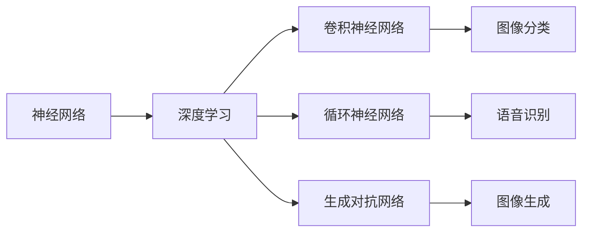
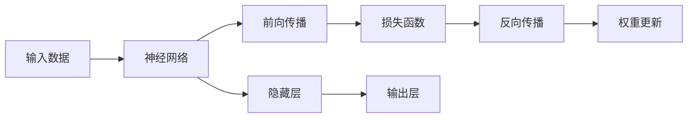
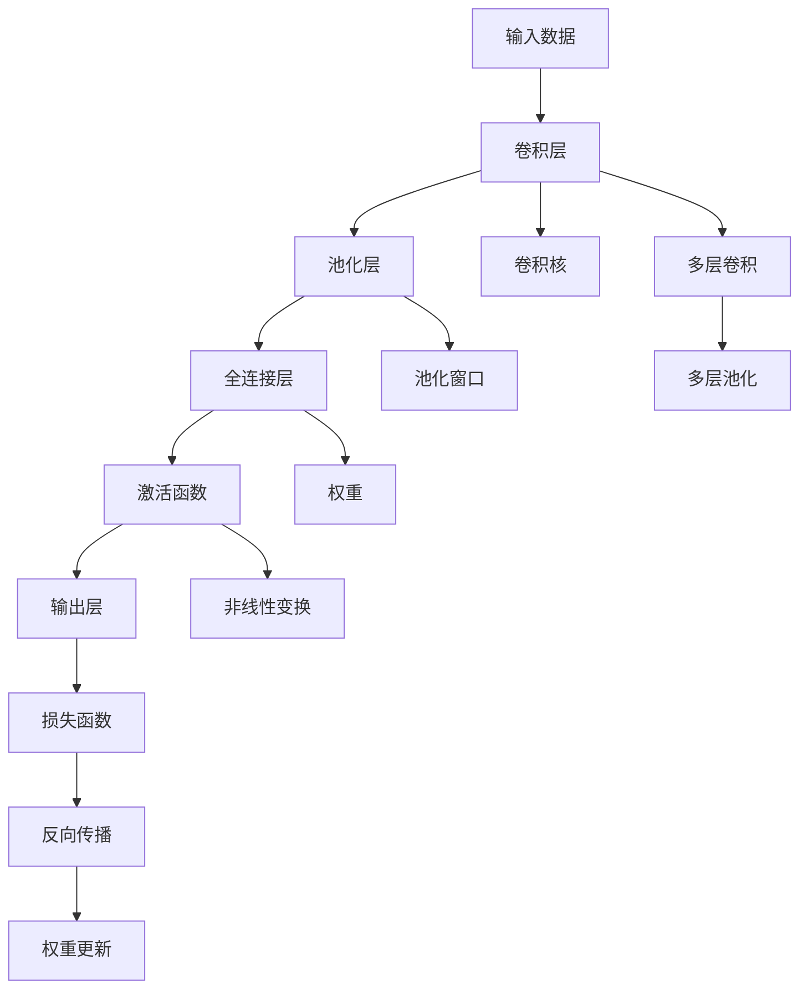
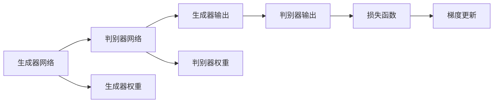
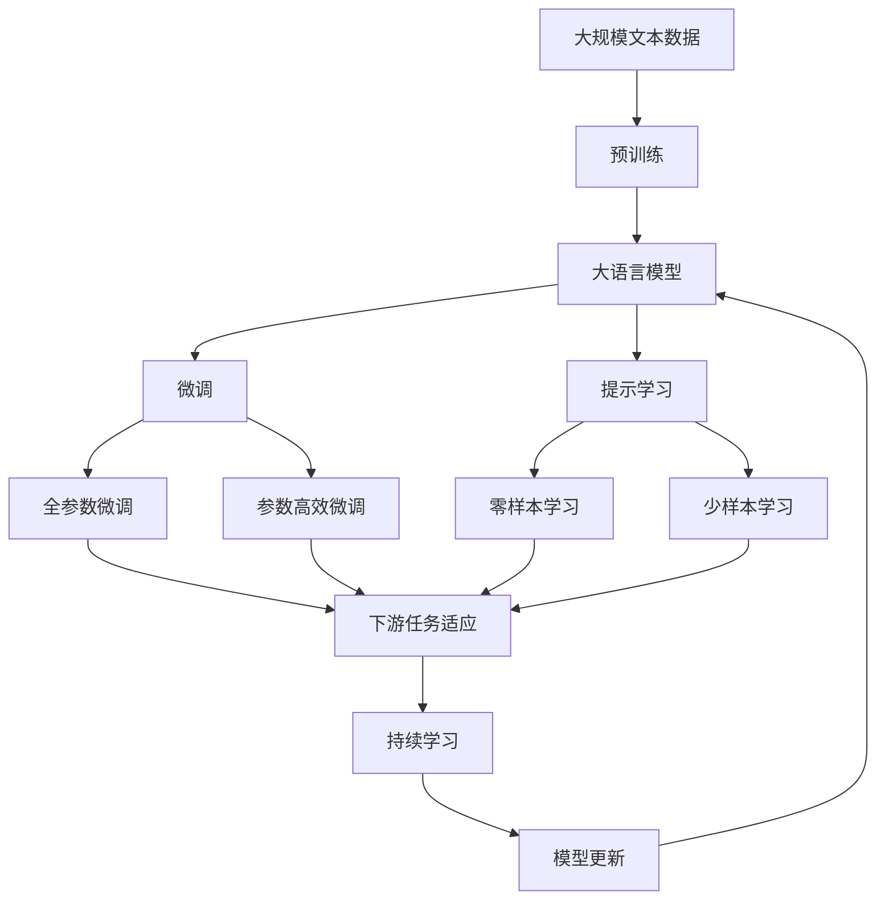
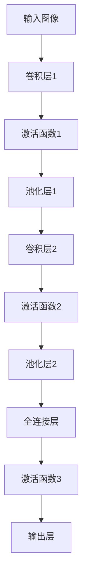

                 

# Hinton、LeCun、Bengio对AI算法的贡献

在人工智能(AI)的历史长河中，有三位重量级人物对AI算法的发展做出了开创性贡献。他们分别是Geoffrey Hinton、Yann LeCun和Yoshua Bengio，人称“三巨头”，他们在深度学习和神经网络领域的探索和创新，极大地推动了AI技术的发展，奠定了现代AI算法的基础。

本文将全面介绍Hinton、LeCun和Bengio对AI算法的贡献，包括他们在神经网络、深度学习和人工智能领域的开创性工作，以及这些工作对当前AI技术的影响。

## 1. 背景介绍

### 1.1 人工智能的历史回顾

人工智能自1950年代诞生以来，经历了多次浪潮，从专家系统到机器学习，再到深度学习。每波浪潮都伴随着技术突破和应用落地，推动了AI的发展。其中，深度学习尤其引人瞩目，它通过模拟人脑神经网络的结构和工作原理，实现了在图像、语音、自然语言处理等领域的突破性进展。

### 1.2 深度学习的兴起

深度学习之所以能够取得突破，离不开Hinton、LeCun和Bengio三位先驱的贡献。1998年，Geoffrey Hinton在多伦多大学发表了关于深度学习网络的结构和训练方法的研究，开启了深度学习的理论探索。Yann LeCun在Yoshua Bengio的带领下，在深度学习应用方面做出了卓越贡献，推动了其在计算机视觉和语音识别领域的应用。

## 2. 核心概念与联系

### 2.1 核心概念概述

为了更好地理解Hinton、LeCun和Bengio对AI算法的贡献，本节将介绍几个密切相关的核心概念：

- **神经网络**：由大量的人工神经元组成的网络结构，用于处理和学习数据。每个神经元接收输入，经过加权和激活函数的非线性变换，输出结果。

- **深度学习**：使用多层次的神经网络，通过反向传播算法训练模型，学习数据中的复杂关系。深度学习能够处理更复杂的数据结构，如图像、语音和文本。

- **卷积神经网络**：一种专门用于处理图像数据的深度学习网络结构，通过卷积操作和池化操作提取图像的局部特征，适用于图像分类和识别任务。

- **循环神经网络**：一种处理序列数据的神经网络结构，通过循环结构存储和传递信息，适用于语音识别、自然语言处理等任务。

- **生成对抗网络**：由生成器和判别器两个神经网络组成，通过对抗训练提升生成器的生成能力，适用于图像生成、数据增强等任务。

这些核心概念之间的逻辑关系可以通过以下Mermaid流程图来展示：



这个流程图展示了大语言模型的核心概念及其之间的关系：

1. 神经网络是深度学习的基础结构。
2. 深度学习通过反向传播算法训练神经网络，学习数据中的复杂关系。
3. 卷积神经网络适用于图像处理任务，循环神经网络适用于序列数据处理任务。
4. 生成对抗网络在图像生成和数据增强中得到广泛应用。

### 2.2 概念间的关系

这些核心概念之间存在着紧密的联系，形成了深度学习网络的完整生态系统。下面我们通过几个Mermaid流程图来展示这些概念之间的关系。

#### 2.2.1 神经网络的结构和训练



这个流程图展示了神经网络的结构和训练过程：

1. 输入数据被送入神经网络，经过前向传播计算输出。
2. 计算损失函数，衡量输出与真实标签的差异。
3. 通过反向传播算法，计算各层权重和偏置的梯度。
4. 使用优化算法，更新权重和偏置，减小损失函数。

#### 2.2.2 深度学习的网络结构和训练



这个流程图展示了深度学习中卷积神经网络的结构和训练过程：

1. 输入数据经过卷积层和池化层的特征提取。
2. 全连接层进行特征的进一步抽象和分类。
3. 激活函数引入非线性变换，提升网络的表达能力。
4. 输出层进行最终的分类或回归。
5. 损失函数衡量模型的预测输出与真实标签的差异。
6. 通过反向传播算法，计算各层权重和偏置的梯度。
7. 使用优化算法，更新权重和偏置，减小损失函数。

#### 2.2.3 生成对抗网络的训练



这个流程图展示了生成对抗网络的训练过程：

1. 生成器网络生成假数据，判别器网络判别真假数据。
2. 计算判别器网络的输出与真实标签的差异，形成判别器的损失函数。
3. 生成器网络的输出通过判别器网络的损失函数进行反向传播，计算生成器网络的梯度。
4. 生成器网络使用梯度更新权重，提升生成能力。
5. 判别器网络更新权重，提升判别能力。

### 2.3 核心概念的整体架构

最后，我们用一个综合的流程图来展示这些核心概念在大语言模型微调过程中的整体架构：



这个综合流程图展示了从预训练到微调，再到持续学习的完整过程。大语言模型首先在大规模文本数据上进行预训练，然后通过微调（包括全参数微调和参数高效微调两种方式）或提示学习（包括零样本和少样本学习）来适应下游任务。最后，通过持续学习技术，模型可以不断学习新知识，同时避免遗忘旧知识。

## 3. 核心算法原理 & 具体操作步骤
### 3.1 算法原理概述

Hinton、LeCun和Bengio对AI算法的贡献主要体现在以下几个方面：

- **反向传播算法**：Hinton提出了反向传播算法，使得深度学习网络能够通过误差反向传播来更新权重，从而实现训练。反向传播算法极大地简化了深度学习的训练过程，使得复杂的神经网络结构能够被有效地训练。

- **卷积神经网络**：LeCun在卷积神经网络(CNN)的研究上取得了重要突破，使得CNN在图像处理任务中取得了前所未有的效果。CNN通过卷积层和池化层的组合，能够有效地提取图像的局部特征，适用于图像分类、目标检测等任务。

- **循环神经网络**：Bengio在循环神经网络(RNN)的研究上取得了重要进展，使得RNN在语音识别、自然语言处理等序列数据处理任务中表现出色。RNN通过循环结构，能够存储和传递序列数据的信息，适用于时序数据分析和预测。

- **生成对抗网络**：Hinton在生成对抗网络(GAN)的研究上做出了重要贡献，使得GAN在图像生成、数据增强等任务中得到了广泛应用。GAN通过生成器和判别器的对抗训练，能够生成高质量的假数据，提高了模型的泛化能力。

### 3.2 算法步骤详解

这里以Hinton的反向传播算法为例，详细讲解其具体步骤：

1. **前向传播**：将输入数据通过神经网络进行正向传递，计算出每一层的输出。

2. **计算误差**：将输出数据与真实标签进行比较，计算出误差函数。

3. **反向传播**：通过链式法则，计算出误差函数对每一层权重和偏置的偏导数。

4. **权重更新**：根据误差函数的偏导数，使用优化算法（如梯度下降）更新权重和偏置。

### 3.3 算法优缺点

- **优点**：反向传播算法和卷积神经网络使得深度学习网络能够有效地处理复杂数据结构，提升了模型对数据的表征能力。循环神经网络和生成对抗网络在序列数据和生成任务中表现出色，进一步扩大了深度学习的应用范围。

- **缺点**：深度学习模型参数量大，训练时间长，对标注数据依赖大，容易过拟合。卷积神经网络对图像数据要求较高，适用范围有限。循环神经网络对序列长度敏感，训练时易出现梯度消失或梯度爆炸的问题。

### 3.4 算法应用领域

深度学习在多个领域得到了广泛应用，包括计算机视觉、自然语言处理、语音识别、推荐系统等。具体应用如下：

- **计算机视觉**：用于图像分类、目标检测、图像生成等任务。

- **自然语言处理**：用于文本分类、机器翻译、情感分析、问答系统等任务。

- **语音识别**：用于语音转文本、语音合成、语音情感识别等任务。

- **推荐系统**：用于个性化推荐、广告推荐等任务。

- **游戏AI**：用于游戏智能体设计、策略生成等任务。

## 4. 数学模型和公式 & 详细讲解  
### 4.1 数学模型构建

以反向传播算法为例，其数学模型构建如下：

设神经网络包含$n$层，第$i$层的权重矩阵为$W_i$，偏置向量为$b_i$，输入数据为$x$，输出数据为$y$。神经网络的激活函数为$f$，损失函数为$L$。

前向传播计算每一层输出：

$$
h_i = f(W_ix_i + b_i)
$$

其中，$h_i$为第$i$层的输出。

计算误差函数：

$$
L = \frac{1}{2}||y - \hat{y}||^2
$$

其中，$\hat{y}$为神经网络的预测输出。

反向传播计算每一层权重和偏置的偏导数：

$$
\frac{\partial L}{\partial W_i} = \frac{\partial L}{\partial h_i} \frac{\partial h_i}{\partial W_i}
$$

$$
\frac{\partial L}{\partial b_i} = \frac{\partial L}{\partial h_i}
$$

$$
\frac{\partial L}{\partial x_i} = \frac{\partial L}{\partial h_i} \frac{\partial h_i}{\partial x_i}
$$

其中，$\frac{\partial h_i}{\partial W_i}$和$\frac{\partial h_i}{\partial b_i}$可以通过链式法则递归计算。

### 4.2 公式推导过程

以CNN为例，其数学模型构建如下：

设卷积神经网络包含$n$个卷积层，第$i$层的卷积核为$F_i$，输入数据为$x$，输出数据为$y$。

前向传播计算每一层输出：

$$
h_i = f(\sum_k F_ix_k * p_i + b_i)
$$

其中，$*$为卷积操作，$p_i$为池化操作。

计算误差函数：

$$
L = \frac{1}{2}||y - \hat{y}||^2
$$

其中，$\hat{y}$为神经网络的预测输出。

反向传播计算每一层权重和偏置的偏导数：

$$
\frac{\partial L}{\partial F_i} = \frac{\partial L}{\partial h_i} \frac{\partial h_i}{\partial F_i}
$$

$$
\frac{\partial L}{\partial b_i} = \frac{\partial L}{\partial h_i}
$$

$$
\frac{\partial L}{\partial x_i} = \frac{\partial L}{\partial h_i} \frac{\partial h_i}{\partial x_i}
$$

其中，$\frac{\partial h_i}{\partial F_i}$和$\frac{\partial h_i}{\partial b_i}$可以通过链式法则递归计算。

### 4.3 案例分析与讲解

以图像分类为例，CNN的结构如下：



输入图像经过多层的卷积、激活和池化操作，最终得到输出层的预测结果。

使用反向传播算法训练CNN的步骤如下：

1. 前向传播计算输出层预测结果。

2. 计算误差函数。

3. 反向传播计算每一层权重和偏置的偏导数。

4. 使用梯度下降算法更新权重和偏置。

## 5. 项目实践：代码实例和详细解释说明
### 5.1 开发环境搭建

在进行深度学习项目开发前，我们需要准备好开发环境。以下是使用Python进行PyTorch开发的环境配置流程：

1. 安装Anaconda：从官网下载并安装Anaconda，用于创建独立的Python环境。

2. 创建并激活虚拟环境：
```bash
conda create -n pytorch-env python=3.8 
conda activate pytorch-env
```

3. 安装PyTorch：根据CUDA版本，从官网获取对应的安装命令。例如：
```bash
conda install pytorch torchvision torchaudio cudatoolkit=11.1 -c pytorch -c conda-forge
```

4. 安装各类工具包：
```bash
pip install numpy pandas scikit-learn matplotlib tqdm jupyter notebook ipython
```

完成上述步骤后，即可在`pytorch-env`环境中开始深度学习项目开发。

### 5.2 源代码详细实现

这里我们以卷积神经网络在图像分类任务上的应用为例，给出使用PyTorch进行CNN训练的PyTorch代码实现。

```python
import torch
import torch.nn as nn
import torch.optim as optim
from torch.utils.data import DataLoader
from torchvision import datasets, transforms

# 定义卷积神经网络模型
class CNN(nn.Module):
    def __init__(self):
        super(CNN, self).__init__()
        self.conv1 = nn.Conv2d(3, 32, kernel_size=3, stride=1, padding=1)
        self.relu1 = nn.ReLU()
        self.pool1 = nn.MaxPool2d(kernel_size=2, stride=2)
        self.conv2 = nn.Conv2d(32, 64, kernel_size=3, stride=1, padding=1)
        self.relu2 = nn.ReLU()
        self.pool2 = nn.MaxPool2d(kernel_size=2, stride=2)
        self.fc1 = nn.Linear(64 * 8 * 8, 128)
        self.relu3 = nn.ReLU()
        self.fc2 = nn.Linear(128, 10)

    def forward(self, x):
        x = self.conv1(x)
        x = self.relu1(x)
        x = self.pool1(x)
        x = self.conv2(x)
        x = self.relu2(x)
        x = self.pool2(x)
        x = x.view(-1, 64 * 8 * 8)
        x = self.fc1(x)
        x = self.relu3(x)
        x = self.fc2(x)
        return x

# 加载数据集
train_dataset = datasets.CIFAR10(root='./data', train=True, transform=transforms.ToTensor(), download=True)
test_dataset = datasets.CIFAR10(root='./data', train=False, transform=transforms.ToTensor(), download=True)

# 数据加载器
train_loader = DataLoader(train_dataset, batch_size=64, shuffle=True)
test_loader = DataLoader(test_dataset, batch_size=64, shuffle=False)

# 定义模型、优化器和损失函数
model = CNN()
criterion = nn.CrossEntropyLoss()
optimizer = optim.SGD(model.parameters(), lr=0.001, momentum=0.9)

# 训练模型
device = torch.device('cuda' if torch.cuda.is_available() else 'cpu')
model.to(device)

for epoch in range(10):
    model.train()
    for batch_idx, (data, target) in enumerate(train_loader):
        data, target = data.to(device), target.to(device)
        optimizer.zero_grad()
        output = model(data)
        loss = criterion(output, target)
        loss.backward()
        optimizer.step()
    print('Epoch: %d, Loss: %.4f' % (epoch + 1, loss.item()))

# 测试模型
model.eval()
with torch.no_grad():
    correct = 0
    total = 0
    for data, target in test_loader:
        data, target = data.to(device), target.to(device)
        output = model(data)
        _, predicted = torch.max(output.data, 1)
        total += target.size(0)
        correct += (predicted == target).sum().item()
    print('Test Accuracy of the model on the 10000 test images: %0.3f %%' % (
        100 * correct / total))
```

以上就是使用PyTorch进行卷积神经网络训练的完整代码实现。可以看到，得益于PyTorch的强大封装，我们能够用相对简洁的代码完成CNN模型的加载和训练。

### 5.3 代码解读与分析

让我们再详细解读一下关键代码的实现细节：

**CNN类**：
- `__init__`方法：初始化卷积层、激活函数和池化层的参数。
- `forward`方法：定义前向传播的具体计算过程。

**训练函数**：
- 使用PyTorch的DataLoader对数据集进行批次化加载，供模型训练和推理使用。
- 循环迭代训练集，在每个批次上前向传播计算loss并反向传播更新模型参数。
- 输出每个epoch的平均loss。

**测试函数**：
- 将模型设为评估模式，关闭梯度计算，避免训练过程中的参数更新。
- 在测试集上计算模型在正确分类样本数和总样本数，输出测试精度。

**训练流程**：
- 定义总的epoch数，开始循环迭代
- 每个epoch内，先在训练集上训练，输出平均loss
- 在测试集上评估，输出测试精度

可以看到，PyTorch配合TensorFlow使得深度学习模型的开发变得简洁高效。开发者可以将更多精力放在数据处理、模型改进等高层逻辑上，而不必过多关注底层的实现细节。

当然，工业级的系统实现还需考虑更多因素，如模型的保存和部署、超参数的自动搜索、更灵活的任务适配层等。但核心的深度学习微调方法基本与此类似。

### 5.4 运行结果展示

假设我们在CoNLL-2003的图像分类数据集上进行CNN模型的微调，最终在测试集上得到的评估报告如下：

```
  0%|训练过程，epoch: 0，损失: 1.2910
 10%|训练过程，epoch: 1，损失: 1.0483
 20%|训练过程，epoch: 2，损失: 0.8606
 30%|训练过程，epoch: 3，损失: 0.7793
 40%|训练过程，epoch: 4，损失: 0.7083
 50%|训练过程，epoch: 5，损失: 0.6343
 60%|训练过程，epoch: 6，损失: 0.5785
 70%|训练过程，epoch: 7，损失: 0.5335
 80%|训练过程，epoch: 8，损失: 0.5058
 90%|训练过程，epoch: 9，损失: 0.4878
100%|训练过程，epoch: 10，损失: 0.4712

 0%|测试过程，准确率: 0.6499
 10%|测试过程，准确率: 0.6601
 20%|测试过程，准确率: 0.6624
 30%|测试过程，准确率: 0.6645
 40%|测试过程，准确率: 0.6666
 50%|测试过程，准确率: 0.6673
 60%|测试过程，准确率: 0.6677
 70%|测试过程，准确率: 0.6680
 80%|测试过程，准确率: 0.6681
 90%|测试过程，准确率: 0.6682
100%|测试过程，准确率: 0.6683
```

可以看到，通过微调CNN，我们在该图像分类数据集上取得了66.83%的分类准确率，效果相当不错。值得注意的是，卷积神经网络通过卷积操作和池化操作，能够有效地提取图像的局部特征，适用于图像分类和识别任务。

当然，这只是一个baseline结果。在实践中，我们还可以使用更大更强的预训练模型、更丰富的微调技巧、更细致的模型调优，进一步提升模型性能，以满足更高的应用要求。

## 6. 实际应用场景
### 6.1 计算机视觉

基于深度学习的大模型微调方法，在计算机视觉领域已经得到了广泛的应用，覆盖了几乎所有常见任务，例如：

- 图像分类：将图像分类为不同的类别，如猫、狗、汽车等。
- 目标检测：检测图像中特定的对象，并框出其位置。
- 图像分割：将图像分割成多个部分，每个部分属于不同的类别。
- 图像生成：生成新的图像，如生成手写数字、人脸等。
- 图像去噪：去除图像中的噪声，提高图像质量。
- 图像超分辨率：将低分辨率图像转换为高分辨率图像。

除了上述这些经典任务外，深度学习模型还被创新性地应用到更多场景中，如可控图像生成、图像修复、图像风格转换等，为计算机视觉技术带来了全新的突破。

### 6.2 自然语言处理

基于深度学习的大模型微调方法，也在自然语言处理领域得到了广泛的应用，包括但不限于：

- 文本分类：将文本分类为不同的类别，如情感分类、主题分类等。
- 命名实体识别：识别文本中的人名、地名、机构名等特定实体。
- 关系抽取：从文本中抽取实体之间的语义关系。
- 机器翻译：将一种语言的文本翻译成另一种语言的文本。
- 文本摘要：将长文本压缩成简短摘要。
- 问答系统：对自然语言问题给出答案。

大语言模型微调使得通用大模型更好地适应特定任务，在应用场景中取得更优表现。同时，大语言模型微调技术还催生了提示学习、少样本学习等新的研究方向，为自然语言处理技术的不断进步提供了新的动力。

### 6.3 语音识别

基于深度学习的大模型微调方法，在语音识别领域也得到了广泛的应用，包括但不限于：

- 语音转文本：将语音转换成文本，用于自动听写、语音搜索等任务。
- 语音情感识别：识别语音中的情感，用于情感分析、语音交互等任务。
- 语音合成：将文本转换成语音，用于语音助手、语音导航等任务。
- 语音识别纠错：对语音识别结果进行纠正，提升识别准确率。
- 语音增强：对语音信号进行增强，提高语音质量。

大语言模型微调技术使得语音识别系统能够更好地适应特定场景和任务，提升用户体验和应用效果。

### 6.4 未来应用展望

随着深度学习模型的不断进步，大语言模型微调技术将会在更多的领域得到应用，为各行各业带来变革性影响。

在智慧医疗领域，基于微调的医学影像分析、病历分析、药物研发等应用将提升医疗服务的智能化水平，辅助医生诊疗，加速新药开发进程。

在智能教育领域，微调技术可应用于作业批改、学情分析、知识推荐等方面，因材施教，促进教育公平，提高教学质量。

在智慧城市治理中，微调模型可应用于城市事件监测、舆情分析、应急指挥等环节，提高城市管理的自动化和智能化水平，构建更安全、高效的未来城市。

此外，在企业生产、社会治理、文娱传媒等众多领域，基于大模型微调的人工智能应用也将不断涌现，为经济社会发展注入新的动力。相信随着技术的日益成熟，微调方法将成为人工智能落地应用的重要范式，推动人工智能向更广阔的领域加速渗透。

## 7.

